# 2021年7月新版-----RHCE8.2 RH124 RH134 RH294 认证课程 - P39：day7-5一次性计划任务 - bili_15701050454 - BV1Gy4y1T7ug

好，人。😊，让杠歪啊， we install。啊，这。然后还有呃主安装。啊，一样。更歪。不。いいですか。啊，这个。啊，不如果被。加一个句啊标志模块安装。一样。杠Y啊 murderderer。给你到啊。

Mo多少。这个。啊啊具体就这些啊。嗯。对，加这。不如。是不是？

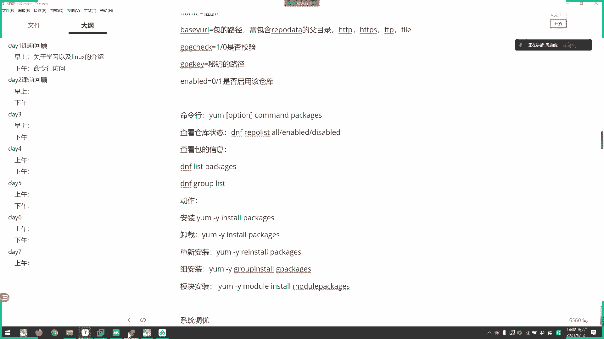

呃。要。

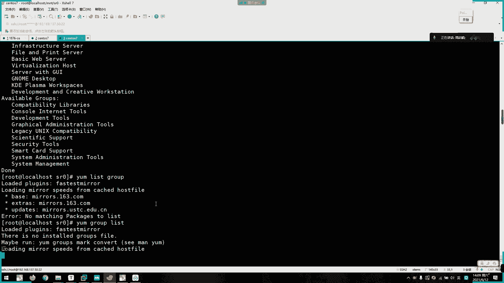

咋猪 list。O还有1个DF啊 modelel。不理。啊，O。啊，这就是我们啊关于呃软件抛的一些操作方式啊，然后是小调优啊，两呃也也是两个方面啊，一个是UNE。第一个。嗯。作为。首护竞争。有。

内置内置啊进行调用。啊，首先啊操作命令。我们的TUMEDADM。想秒机吧。调 m e 啊。🎼TM。あ啲。啲一点。呃。list啊可以查看到啊。所有配置。TUMEDADM。呃。四系结果了吗哦好。

 remove 。谢谢。😊，啊，痛的。啊，一边。嗯，那确实。查看。当前。系统。调优配置。啊，TMED啊AM。We。Come on。啊， so command on了。你com是 command等一下。

呃。那小叔 come on啊 come on啊 그慢的。啊，看一下啊嗯。系统推荐啊调优配置。然后TUMEDADMprofi。嗯。啊，然后是我们的一个啊配置名称。更改。系统。调优配置。好。都是寸的。

ADN。Of。关闭。系统调优。然后是啊啊通过更改。nice。10。嗯。是清纯调友。啊，有我们的一个呃未运行。运行前法。指定赖。收了一个nice。刚才然后是0到哦。-19。到。我们的20。仲有发位啊。

59啊。然后是我们的啊com。好嗯。Yeah。更改。运行中。进程的赖。那就 be nice。杠N，然后也是-19到20。有时的BID。好。top更改last。啊。那top里面。嗯。嗯，啊。然后输入。

锁定。用ID呢。再输入。来。要基本模式吧。啊，他能做的就是啊。我们系统提过来。请为。🤧嗯。啊。需要进入。救援模式。查看问题啊并。处理。啊，比如我们的一个呃。修改我的密码。嗯，内核选择切面。嗯。一啊按一。

然后。下载。🤧嗯。算了，还是复制成一动画吧。因为你们没有这个概念，我说的话好像都说说收不了多少，就是他要加载我们的一个根，然后再。啊，一直呃驱动起来，拉起来整个系统的。啊，从我们不短。嗯，把这个。

复制过去吧啊。然后呢。RO改成我们的RW啊，让它是变成可写啊，不然它是直读的。早上有演示过啊。对啊，我早知道就是连依拉一起。😊，嗯。I改成，然后是。不，然后是更改密码。好，切个啊。

GDRL啊杠叉啊加X就行。然后是。7更。情况。中更。啊，CHROOT然后是我们的SY。啊好天。然后是通过。明年。他说。更改。你吧。诶跟日话好咗后啦，诶记得。如果啊启用了S1。需要重新。打。上0个。有钱。

这是候我们来把它touch。auto。要是恳秋。加D。即系佢做揸啲。让它启动。可以了。好。文件系统。是不是。嗯。自据。随便。嗯。大概都是。不需要进入。救援模式。啊，当。要输入word密码。啊。

这种情况啊通常。出现的在。发展问题。啊，或展问题一定要注意啊。那我们啊。考试的时候啊一定要注意。建了一个新的分区，以后做了自动挂载以后呢啊，一定要重启一下，检查一下啊，重启检查。不然如果机器开不起来。

也是没有分的。好，这是我们的一个。啊，早上内啊。好，我们看下午的内容。这午啊我们主要讲一个91物啊，91物我们系统中啊。有三种替换用物啊，但是大体能分为两种而已啊，大体为两种。首先是第一种。啊。

这用是我们的艾，就ADD啊，是我提团来提供的一个服务啊，叫做一次性提换物。啊，然后另一种叫做周期性机维物。我们的呃那个呃热切割啊log。ROLATE啊。这个就是由我们的cloud提供的啊。好。

然后呃我们的一次性就换物了啊。是由我们的艾来提供。然后呢依赖于我们的艾呃ATP服务啊，刚才说过了ATT服务，然后它的一个对炼存放在我们的wa server艾里面啊。要这个命令怎么用呢？啊。

然后还要注意一点啊，就是我我们执行任务是那个pas变量啊的值和当前定义任务的用户成份是一致的啊。一句话一定要记住。等一下我们cloud就不一样了，cloud就不一样了。就是说它目前的。

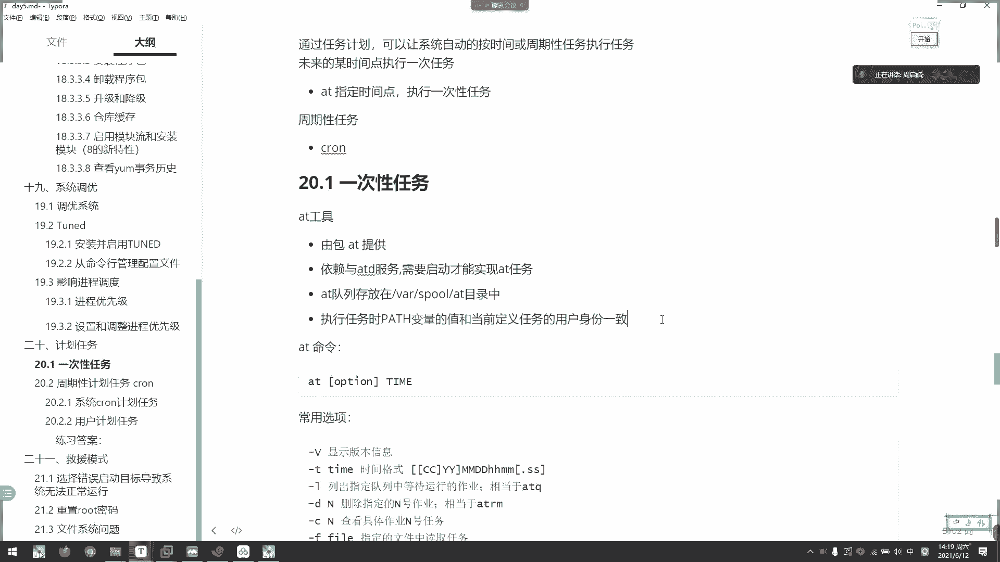

啊，他边呢是由我们这个提供的啊。嗯。🎼这是我圣斗7。我不想用这个。他起不来。那行我们sorry呀。

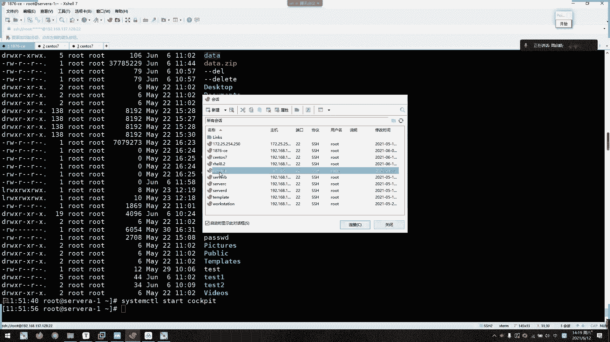

所以没关系。嗯。所干嘛啦？哦，没开机没开起来。嗯。这是我们光光办救援啊，只能回去慢慢看啊。笔记没有书本就没有。哎呦。🎼先把它关机。老钟祥。那我要改回来的。

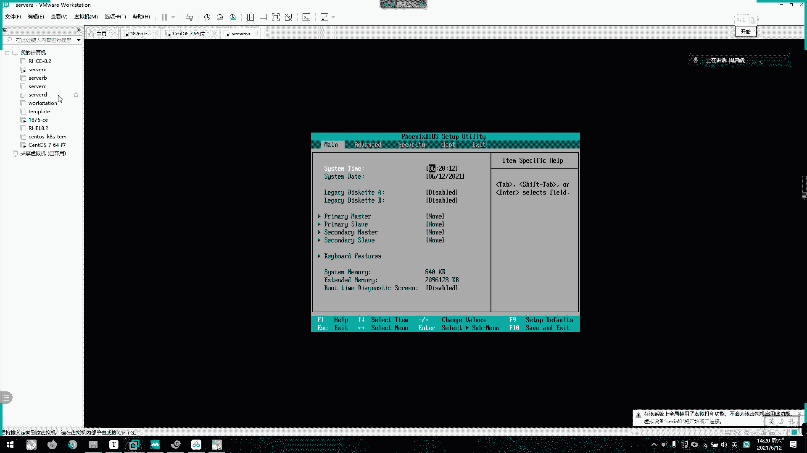

可，改垂置个，直接快照。

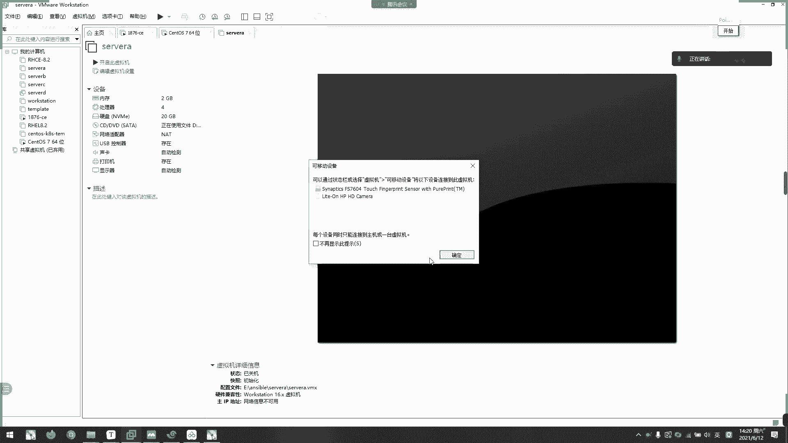

去。😊，和闹钟。明白了没有？你发平常高校班是两点半上课，我就调了20分的闹钟。啊。呃，刚才。要演示什么来着？啊，AD我们啊通过一口。呃，一口 pass。啊，可以看到我们这环境变列了。好。😊。

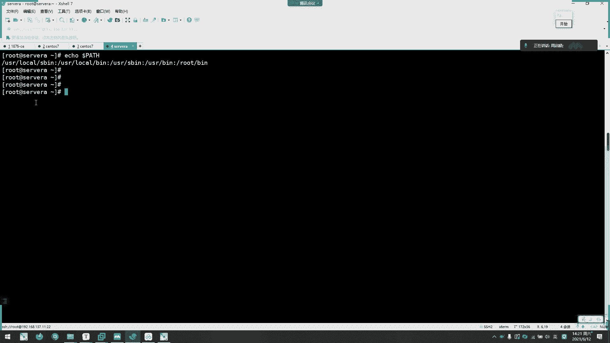

我们艾是调用了这个，我们等一下验证是不是啊？有个方法可以验证啊，主要是啊一些常用选项啊，首先杠T啊，可是设置我们运行的时间啊，然后L啊列是现在队列中的一些作业，要杠呃杠D啊，就是删除哪一个作业。

然后杠C啊，查看我们的一个作业号啊。要概啊，从指定文件中读取我们的一个任务啊，干面的话是大任务背完之后，然后通过邮件啊，然后提时没有那个变要输出啊，这句话也很重要，我们等一下看啊，我们等一下看嗯。

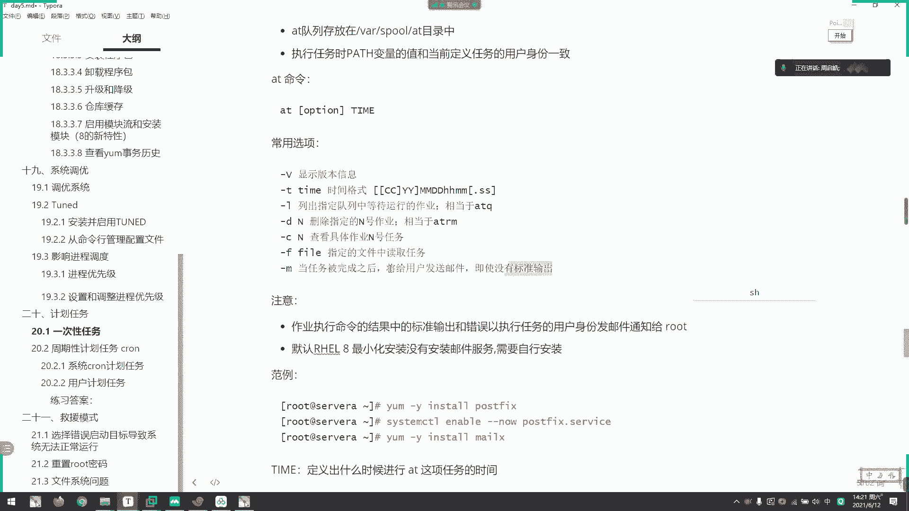

好，首先是我们看一下服务起来没有。啊。我估计没有装，看到没有？啊，因为因为因为这个小罐装一般都不装的啊。嗯。呃。你挂仔挂仔啦。挂咗没有。为什么抽想？

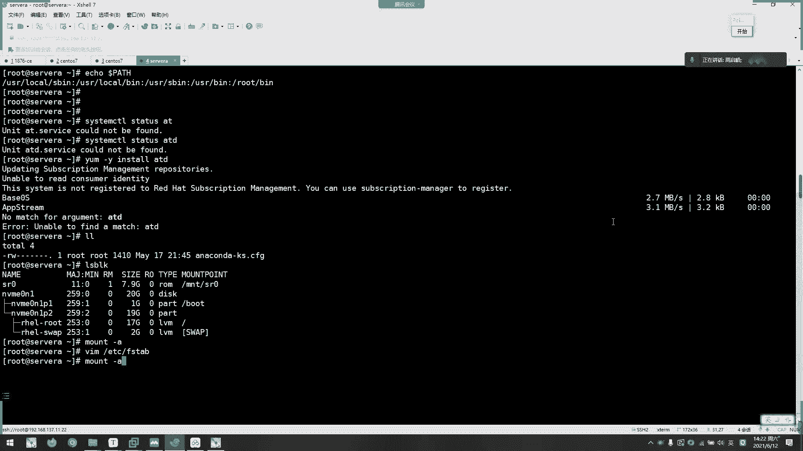

ATT啊嗯。

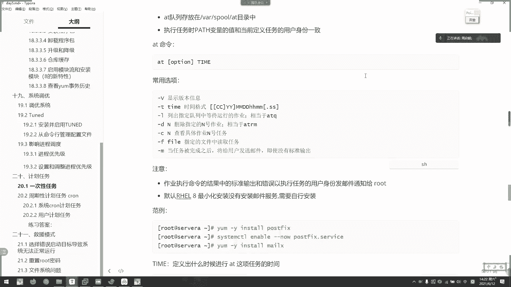

ATT吧。st才是ADA，我算你傻了。嗯。没开起来。啊，它是营业补的状态。嗯。嗯，你要看起来了。🎼好，看起来了啊，怎么用啊，首先啊我们AT接AT。🎼嗯。然后编辑。

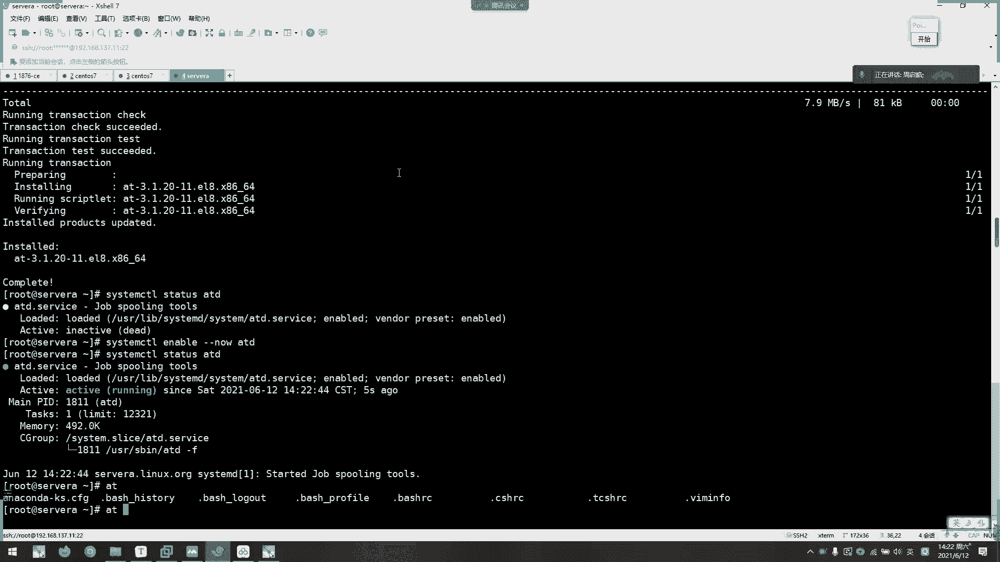

直接弄个。

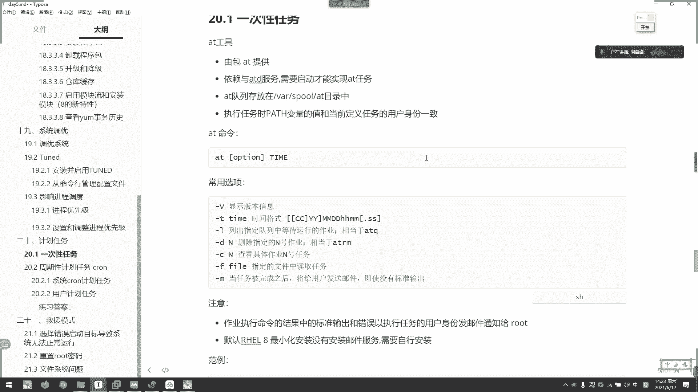

闹吧。啊，然后他又进入我们那个兵备选是的啊啊，他他的他的项他的项是我们SH啊啊，是我们兵的SH啊啊，他又是那一个啊，然后比如说我这边要。copy。BDC吧。可以。往底下学校的。到我们的电塔下哎呀。

好核心的这个东西写错了又不能删。B啲 c。改耽误了data。下的叫做。ETC加个时间吧。DAT。一。家饭后。然后我都得慢慢住啊，然我们ctlD执行啊，contlD。O。Yeah。他说啊。呃3分。

估计他没有做了这个要因为跳过一分钟。哎，算了。😔，这样吧。一分钟后啊就25分。嗯。傻么。一分钟。点晚要。After贵。啊，我们来MKDIR1个data。很多点。🎼行他说25分执行这个啊。

我目前看一下有没有。目前没有啊。嗯。我们看一下ATTL。它是有一个任务啊，看到没有？你25分看一下。啊，执金的看到没有？没了啊，任务已经没有了，任务已经没有了啊。

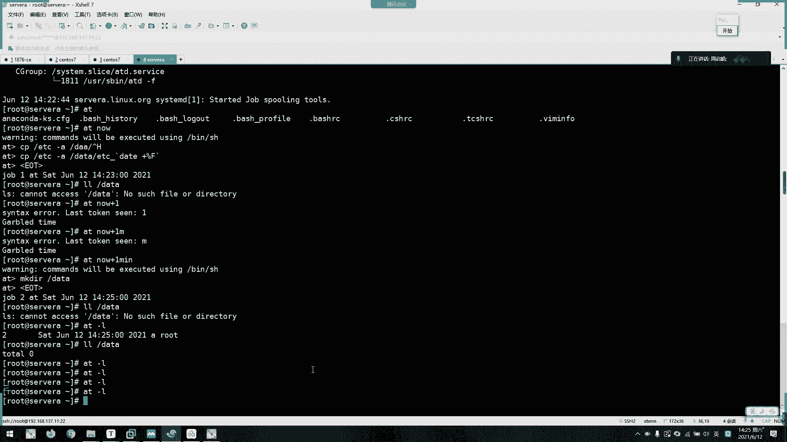

🤧K。啊，这就是我们的一个一次性激关任务啊。然后嗯比如说我要指定它一个时间啊。

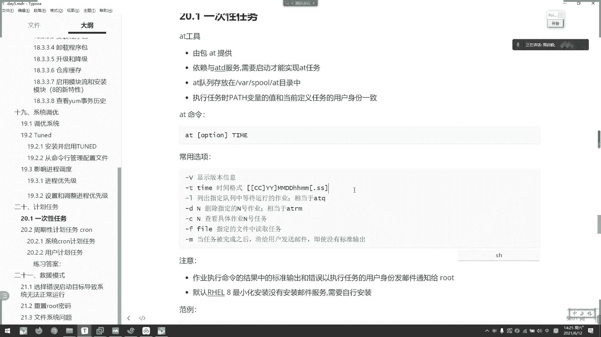

嗯。比如说按批呃。202。2021年的。6月12日。然后是14点。30分。

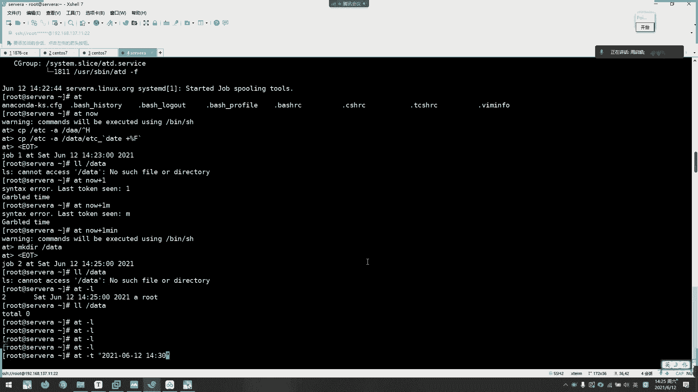

嗯。不行，开下。C c歪歪。MN滴滴。HHMM。

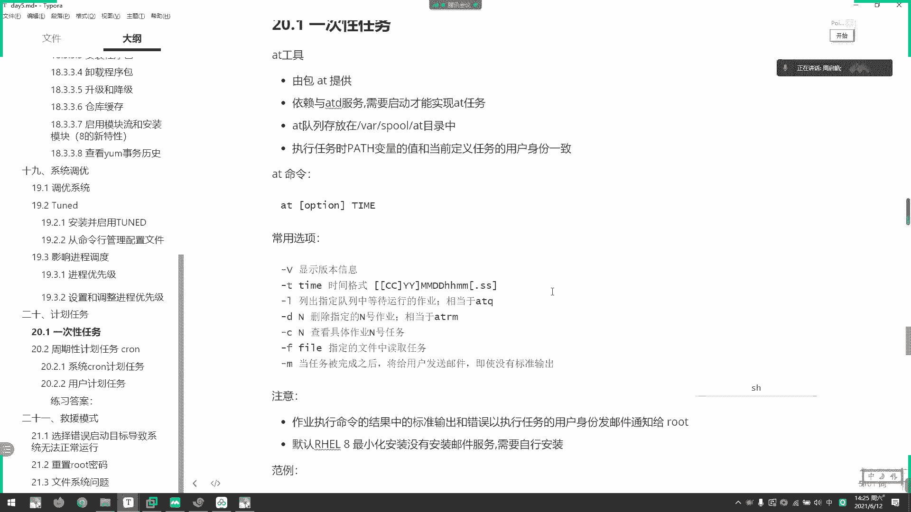

那怎么写这个？只有这样吗？哇靠，还真的。呃，比如说一扣。あ三に。那个。没有。啊，我都写错了。让他想一声啊。这样啊，我又说定了，就今天的一个。30分啊30分。嗯。

然后呢我们来看一下啊AT杠L可以看到这个任务，对不对？看一下他是不是存班照我们说的哇是。🎼啊，是了，然后A里面。等下啊，这个就是啊这个就是。这个就是。可以看一下它的配置，我们注意到最后一行就可以了。

🎼嗯，没看到杠A对不对？再住 a。啊先看A是什么。这下面吗？🎼那就是一个响铃，我等一下看一下332份会不会响铃这。

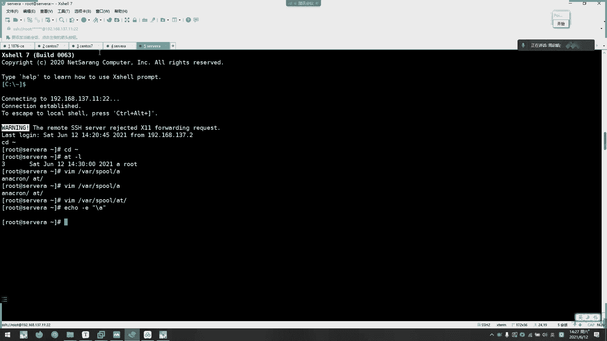

好。

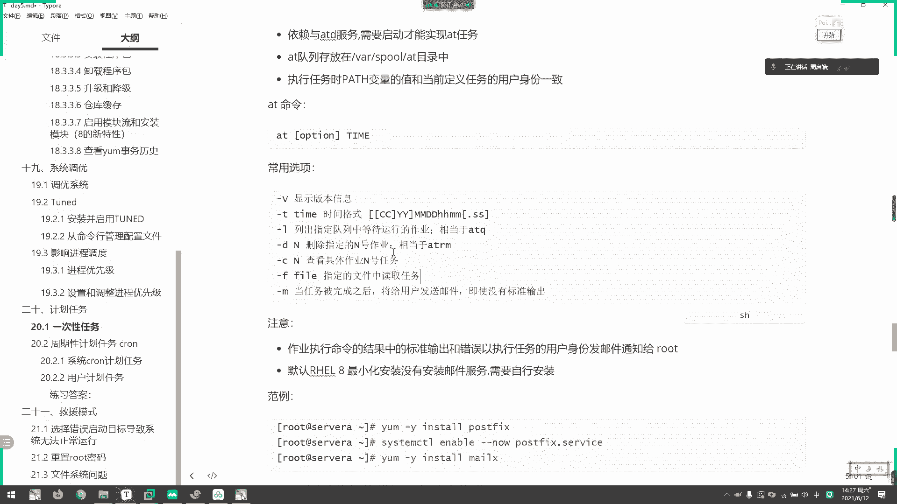

然后啊我们再写一个。응。嗯。比如说。35份啊。做个总结啊。Okay。把它顺序来啊，TT2。看到没有？啊，35分的。🎼1了于我不想那执金怎么办啊，钢低出取消。🎼立干低然后试试。啊，地几啊。啊。

这些杀的啊这些杀的看到没有？啊，除了这种方式X一呃。肯能加低啊，记得啊肯定加低啊。好，然后继续可以看到AT杠L啊。🎼5啊，然后我们看一下刚刚那里是不是多少。🎼了这个啊，你看又多了一个，是不是？🎼嗯。

应有这个啊，看一下他做了什么东西。啊，rebo看到没有啊，rebo。呃，那么我们不想让它执行，除除了那里杠低，我们还可以从这里删除啊。F-2。哇说 it。🎼都是A00000。这个文应该。把它删掉。啊。

然后现在哎你改样。来又不在了啊，这然像我们1个30分的，这是我们的一次信息化用户。

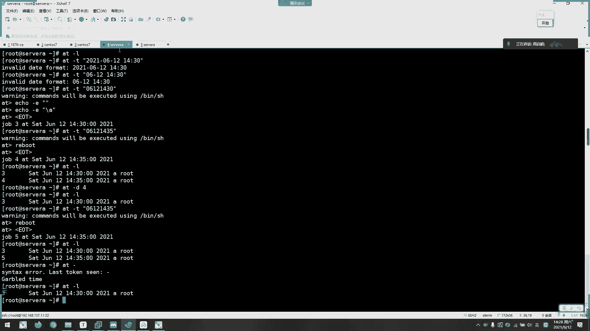

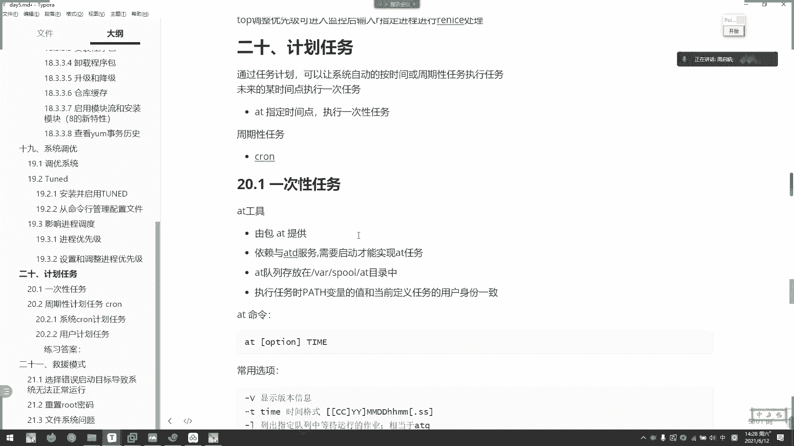

好。😊，那么。呃，我们这边。弄一个输出。啊。L加一啊就也是30分钟。🎼我是等他响了再再做啊。哎那。加一等他选了再做啊，等下选了。我们看一下上0分会不会响应。🤧嗯。这么久了吗？Yeah。有点9。嗯。

没有想。右下面。咋搞？得到执行的啊，这个没有讲励。嗯，可能他作为把它当做一个变子输出了。那么我们做下一个实验啊，AT。闹那就只半天时间，然后呢加一分钟，就是呃我现在是30分，那31分执行的意思啊。

但是如果我现在敲了，它变上1分，我这个是不会运行的。所以我们要要加快速度写啊，比如说我要一口一个hello。然后它一口一个我们的一个pas啊。他要出要验证那个东西吗？啊，保存到啊，3一份让它运行。

所以一可以要他运行。好，算衣分了，我们看一下这个用我不在啊，已经不在了，但是他一口了输出到哪里去了啊。没看到哎。好。

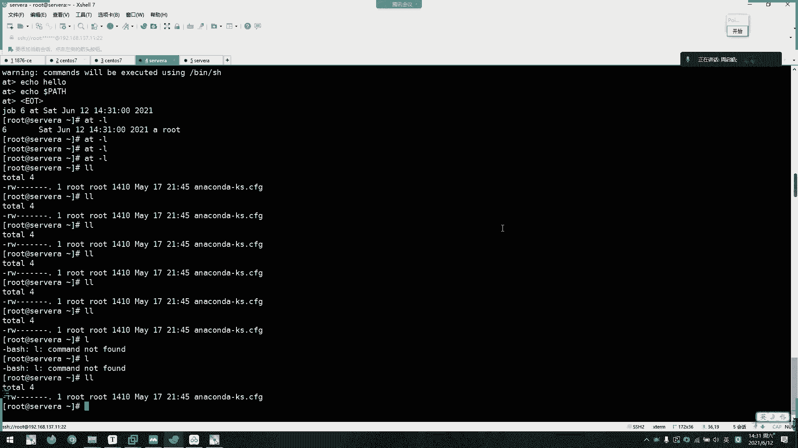

啊，这就是。我们说的啊有表演输出。哎，不要输出，他时候呢他。只能通过我们的一个。只要它是个标准输出或者错误执行的一个任务啊，它会以我们的一个用户身份发送给我们的wordot。

所以我们需要装一个邮件工具啊。用工具呢我们这边推荐用一个pose feel啊 post feel我们安装一下啊y杠Ystore。

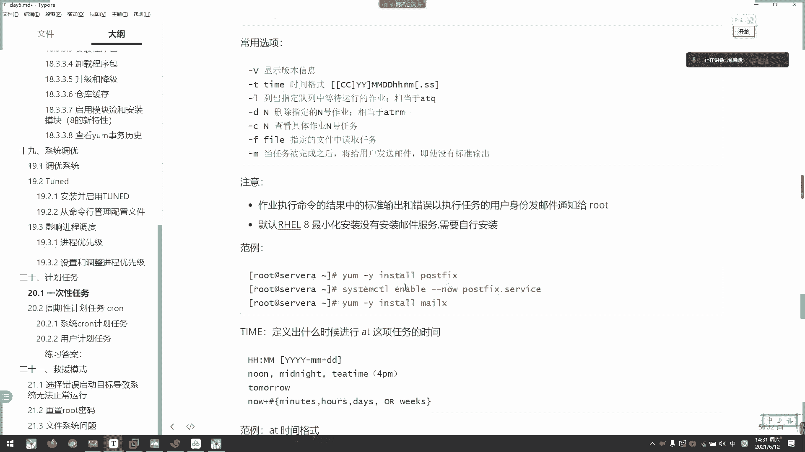

Posfu。好，开始啊。这是我们的邮件工具。呃，还要做一个喵X啊。啊。启动了没有啊，那个启动。影一部更觉嬲。On the possible。嗯去啊。看到没有啊？有25洞了，那就行了，25动了啊。

然后他要装一个工具啊。Xmail啊。嗯，不知道干什么。到是秒号开始。啊me。这个是看邮件的啊看邮件的，不装这个的话，要他自己默认去安装，会很卡。好。这个还完全没有。比如说我这边转的你store给OSD。

还有。That's true。它会提示它会提示。没有。等一下他会让你装，但是这样装的话会很很卡。对，就卡在这里啊，所以我知道我要装这个啊，没有X直接这样装就可以了。嗯，卡住了。好。

那么我们再重新来一次啊。嗯。33分，那我现在。不加一啊不加一，直接闹啊，直接闹呃，一cohello。啊，然后加一口一个S panel。到。可以看到。30分，我们看一下有没有这个任务，然后我们那没有了。

看你看有图圈的看到没有啊。没有。然后去看这个邮件。看到没有啊，这是我们的一个输出。好。🤧啊，这是我们的一个配置变量啊。好，这是我的配水量。再看一遍。嗯，这就把留言打开了啊，是刚刚发的，对不对？33分。

我们的一些必要输出，还有些错误输出啊，都都是通过邮件来发到我们的。就外路钟啊。发通知。告诉你执行了告诉你执行好。

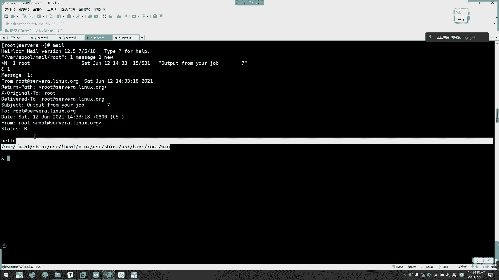

啊，这是我们的一个移似计划任务啊，时间的一个定义啊啊HH啊啊要是可以啊。定义这个啊什么半夜啊啊半夜啊，中午啊，然后是下午4点。然后是明天啊，然后还要唠啊，可以加一个小时啊，一个星期啊。

我刚刚是直接用分钟还给你啊。哦。嗯，格式这个具体可以看一下。啊呀，刚刚是加15分加加分钟的啊，然后是。啊，明天的15点这样子啊，这能发你的回去看一下。好，然后APD啊的一个任务执行方式啊啊。

可以用我们的一个输入出印象啊啊，可以用我们的一个。呃，全部是啊，我们刚才就是刚全布室了，然后是一个文件，我看一下啊。

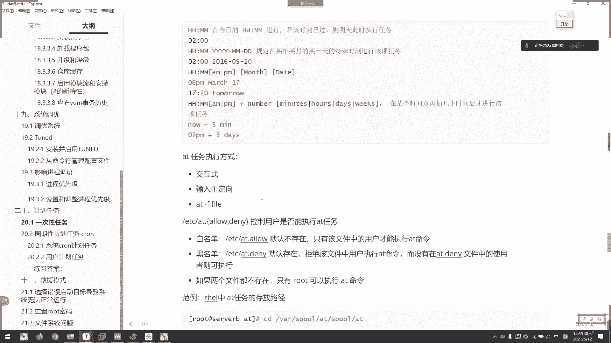

嗯。输入重印象啊，michello。🎼不对，输入。扣。Hello。嗯，都不行的骗子。嗯。输入。嗯。啊，这样就可以了。AT杠聊。啊，已经运行了。😊，啊，看一下有没有啊没有。啊住了啊。第二个。是吧。嗯。

为什么呢？35分怎么可不落饭呢？啊，怎么可慢都烦？好奇怪。三分。嗯，这个也发了。Q you。快。嗯，稍等一遍看一下。从那么西关闭口啊，所以后引起来看一下。马上就有一个邮件，看到没有？苗。com慢翻。

为什么呢？为什么他把它当做是一个命令？啊，不要紧。啊，不要说我们前面说过还是用文件的。把删了这。不来。好。要我们写到文件当中啊啊洋洋呃，我们的艾特。怎么写就直接写我的命令了啊个helo。

然后是一口我的pa命啊。老师。呃。啊 m k d i 啊。我们的一个。对塔下弄个t目录啊这样子。OK然后艾。呃。闹了。刚的。🎼就我们刚刚约定。嗯。后面再加时间。🎼那个辣不用加干尬。啊，可以了，看到没有？

啊。嗯，AT3L。已经执行了。好有邮件吗？看到没。啊，看到没有？然后我们看一下啊，我们data。啊，你看这个t目录了，对不对？啊，他就做出来了。嗯。喂。🎼那么我们他说有标准输出哎，或者是错误输出。

他都会以邮件通知。那么我们如果架购。🎼创目录的时候加个V啊，加个V。🎼它会不会有邮件呢？あ。啊，data，然后继续来个case一。教会。退入。5800。🎼嗯。对。No。他。不A。O看一下啊，没有。嗯。

啊，有啊啊啊有只要我有标准输出，它都会有提示啊。好，OK那么我们把邮件删了。

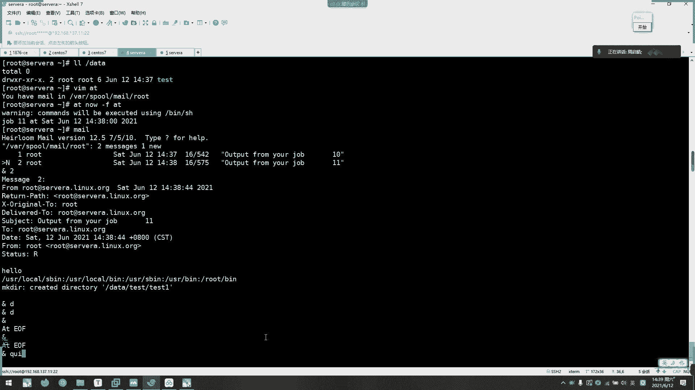

🤧没有这个，然后。呃，我们的一个啊我们的一个白名单黑名单啊白名单黑名单我们可以看一下啊，它在我们的EDC。

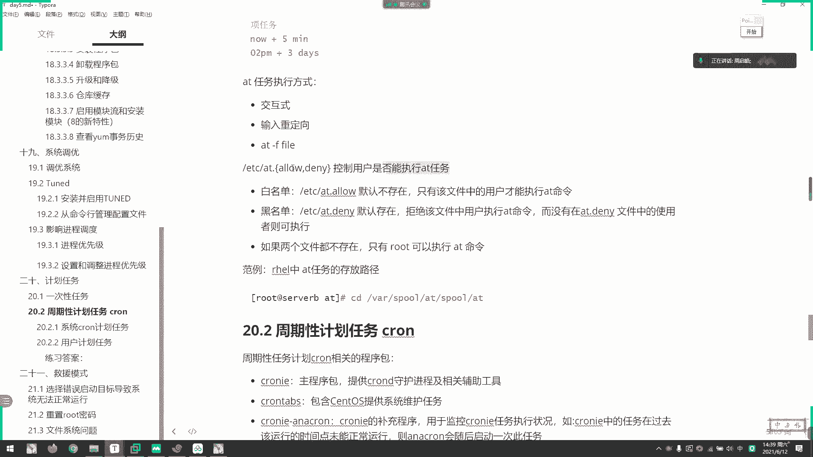

呃。🎼哎，ATT里面会有这个文件啊。这是我们的day是我们的一个黑名单。一名单。啊，目前是没有写，比如是说我把一个普通英文写进去啊。啊てま。🎼好，然后我们A。K一下uswork，我看一下有没有其他补骤。

🎼你提醒告诉我。我等一下再创建一个呃不通库吧，就是ad。呃，加一个student吧。嗯，O。都了树干修的。啊。算是的，那么我是do。能不能创建这个9V物啊？啊。能不能能不能能不能能不能。能不能。

你觉得能不能。啊。来嘛，交顾一下嘛。8。是不是要老师开车啊。😊，补了是吧。会收获来呢，但是我只是黑名单，只是拒绝了devo我啊。为什么你们觉得不冷呢啊？哎呀，写错了。他可以用的啊啊。可以用噶啊。

为什么不能呢？哎呀。I don't。你个， hello。Yeah。大家有没有。嗯。哎，他怎么没有那个。出来。哦，差一分钟啊。我们封浪吧，它是可以用的。然后那了还有没有网对。应该写给了我们的word了。

看一下是不是写给了word。啊，是写给我的root。啊，他传给我们录看到没有？

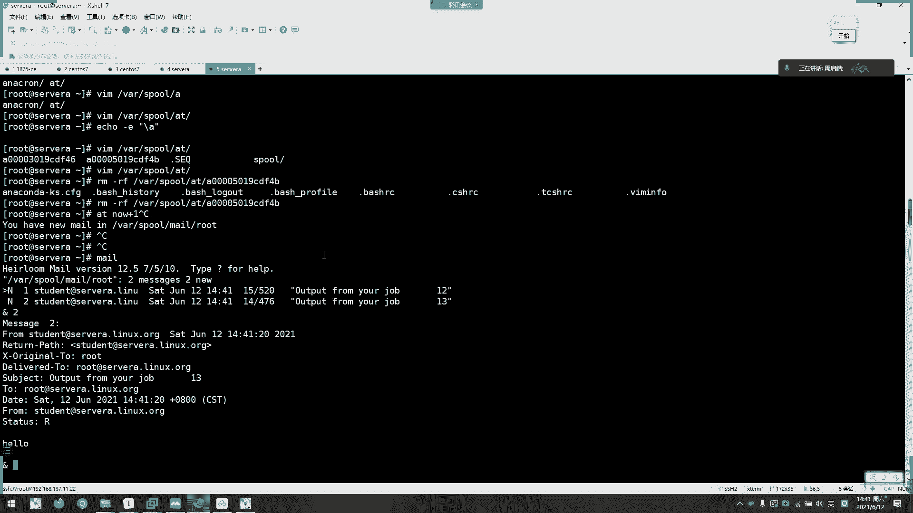

嗯。它是可以用的。然后刚刚我们A名班定义的是dbos啊。

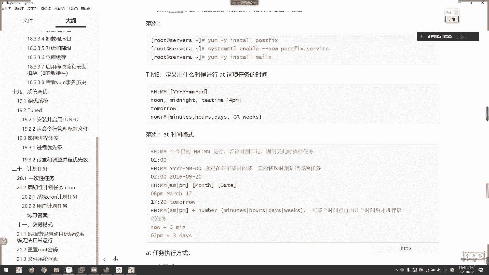

速干。嗯。那他能用吗？啊。他用吗？对啊，是不能的呀他这个钱就不能的。ok。这是我们的黑名单。对对对对对，都拼名单了啊。好。然后我现在写一个。嗯。嗯哼。吓，我即系。把它写到百名单出来。能用吗？没有吗？

他同时存在我们的白名单黑名单吗。能不能用啊？不能吗？试一下，我觉得可以。我觉得可以。他。你不要怀疑自己好不好？😊，哎，你看可以的，有回名单是可以。😊，好。哎呀。啊。丢是吧，丢可以是吧？好，那么。

问题来了。啊。我们的word能不能用啊？或者能不能用。你觉得word能不能用？然后你们觉得word能不能用？Yeah。😊，挖坑给你们跳啊，或者能不能用啊，思考一下。其实把你们。思考也没用，思考也没用。

说思考。啊，只能凭感觉，你们觉得words能不能用？我在做root。晚啊。而且我word也不在黑名单中啊，你觉得能不能用可以吗？可以吗？😀呵。😊，你好过分啊，每一次都打个问号哦。😊，啊，哎可以用啊，哎。

真的是。呵呵。😊，啊，那么哎。我这边。再创建一个啊。呵呵。😊，Yeah。就这样啊啊随便创一个吧，那就随意。还有谁？啊，说干有声音。啊，你觉得用生意能不能啊，他又他也不是在白名单，也不是黑名单中。

你觉得他行不行？啊。既不在白名单，也不在黑名单，你觉得他行不行？嗯。可以吗？啊，可以吗？哎呀，加好友真的是。挑多少次坑了，还还还没有感觉。啊，跳多少次颗呢。😊，Yeah。系。😊，啊。

何辉何何辉告诉大家了何辉告诉大家了啊。😊，合格告诉大家是这样的，它在定义啊这个定义。它默认有一个daily啊daily的黑名单啊，黑名单默认是有的啊，我不管写不写啊，它默认都有。但是我写了以后呢。

它会屏蔽掉啊屏蔽。屏蔽到里面的用户啊，只要啊平常平偏。里面的用户，但是呢啊排排名单。更屌啊，完没他。那我写进去啊，我把用户写进去。啊，那就只有白名单里面的用户能用啊，只有白名单里面的用户能用。嗯。

要VL个白名单能用啊，除了ro呃root之外啊，root之外啊。所以要我写在白名单里面啊。嗯ん。😊，这个没试过，哎，一个用户都不写，我就不知道。因为他默认默认是没有hellow这个文件的啊。

默认是没有的。没有白名单的，默认是没有白名单的，我直接写不进去了。默认是没有的。我那你跟他说，我试一下啊。看一下把。嗯。里面的人删了是行不行？🎼啊，现在里面没有人了，那么。看一下行不行。啊，有冇事你看。

へい。😊，😀呵呵。😊，然只要有这个名单啊，估计只能任录的可以用啊。啊，最我给 you了。嗯。好。删除啊。🎼ETC啊E。啊，呃AP。他是默认没有这个文件的，所以是可以用的啊，那么问题来了。

OBS能不能用啊啊，OBS能不能用啊？嗯哼。😊，啊，OB的没用。快点啊，回答完这个问题，我就休息啊。所以什么呃，那不好啊。😀呵呵呵。😊，对对对啊，不能啊不能因为啊啊还好很认真啊，大家很认真啊。

这个我没有把黑名单删了啊。好，可以啊，那我们先休息啊啊，这里有写了啊。😊。

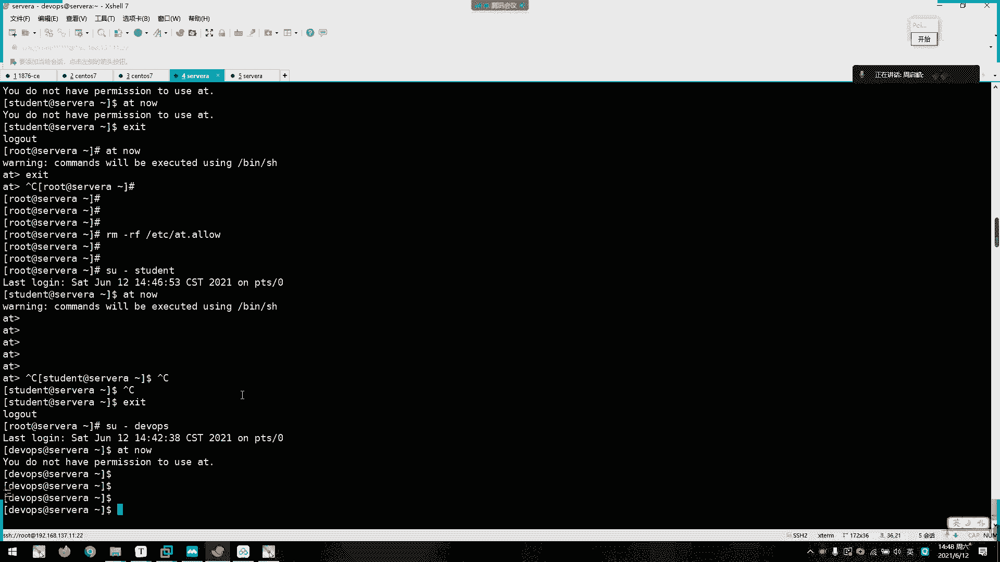

嗯。啊，你看如果把名单存在啊，拒绝文件从。啊，执行那个at命令啊。然后艾特可以执行啊。啊，刚刚那个充分用题也也讲了，我们休息一会啊，休息一会儿，我们讲那个系统期外用管，周期信息外用管。很好大家很好就。

😊，就嘉豪各种材料啊。😊，嗯哼。😊。

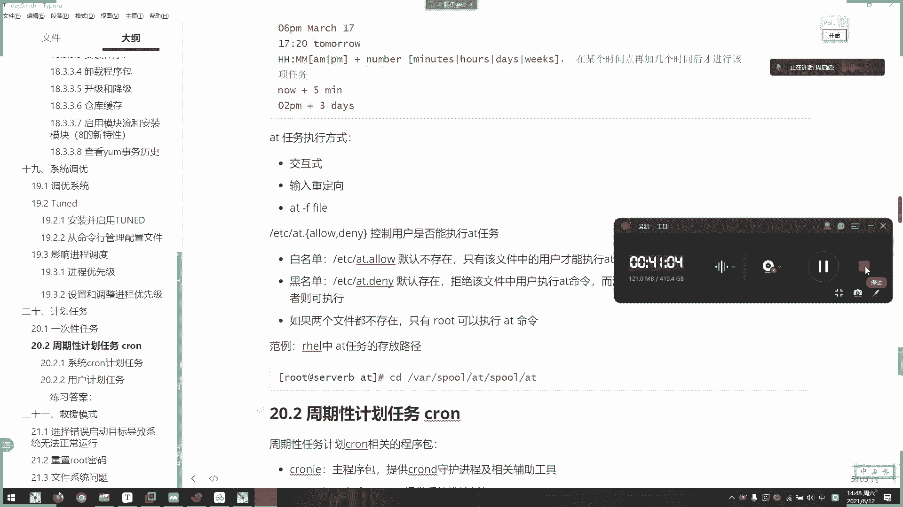