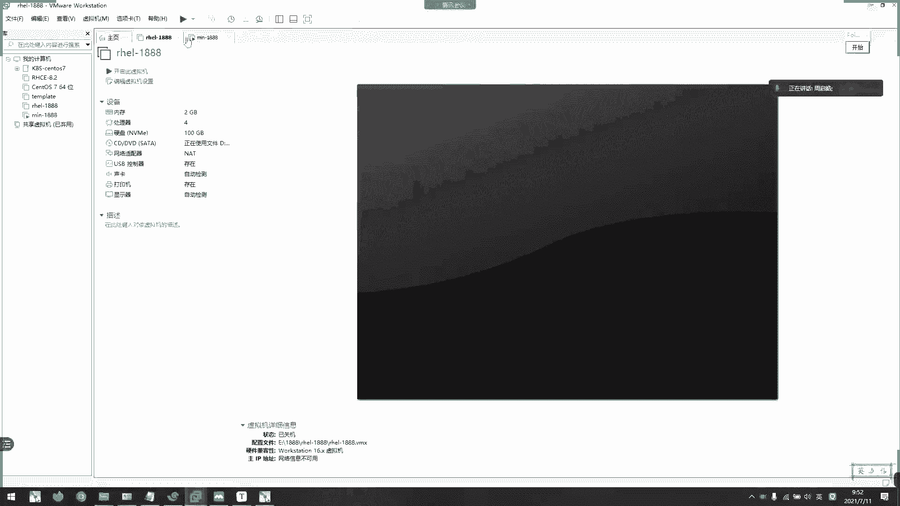
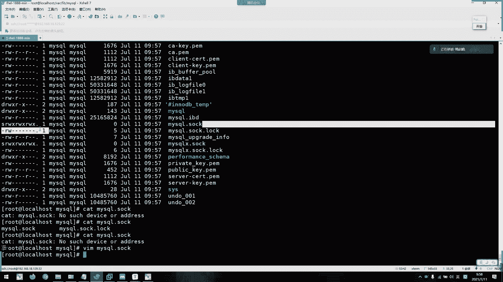

# 2021年7月新版-----RHCE8.2 RH124 RH134 RH294 认证课程 - P3：day2-1文件类型以及文件操作命令1 - bili_15701050454 - BV1Gy4y1T7ug

我们上课了啊，先回顾一下昨天的一些内容啊。啊。嗯。所以我就跟上一班不一样啊，下个帮我就。复习的比较详细啊，我们这个班就。然后他们占用比较多时间，然后我们这个班就来开过那些重点就好了。好。啊，昨天上午。

今天上午啊。嗯，4。1啊。这个虚章。嗯。考试时间啊以及。呢些范围啊。然后第二个呢啊就是安装。Yeah。嗯。所以是安装。阿 yellow。8。2。虚拟机。嗯，Well。Baw。诶。对道。虚拟网卡。Lod。

工作模式。一体数字啊。你。啊，然后是我们的一个啊linux框架。啊，有。普通人过啊。有么分类？有。普通用户。还有一个特权用户。Ro。权限极大。嗯。😊，啊要是。🤧咳。换终端。啊，有我们一个临时切换。

还有一个永久切换。等个啊，先给一个查看的。M怎ong。是。呃。给你。啊，灵合切换。啊，有我们的INIT啊。说3啊INIT5。哎油吃吧。System CTL。表示sad default。啊，可以是。

Graphical。啊就他嘅。啊，或是。嗯。你的优势。Get talking。🤧嗯。😊，好，表示。She。多用户登录啊。短户登录。啊。查看信息。啊，有我们的W。Cool。A I。こやない。还哭啊。

详细列出。当前。切。登录。系统的所有账号。二子啊。一些其他信息。呃。嗯，正在执行。动作。嗯。回来啊。当前终端。安全登录啊。对。登录。当前终端。用裤。信息。详细信息吧。登肉。当前。重装。的用户。

对如こみ看。啊，一样的这个啊。

是不是啊看一下，我都忘了，我好像就是抹。

哦。酷跟酷爱是一样啊。

哦，不对哦。

啊，不对不对不对。去。列出。Orrow。登录到系统的用户的详机信息啊。嗯，还有中端。分类啊。啊，两种啊，一种是文本终端。啊，又是伪重装。哼我说的啊只有一种啊，就是。嗯。服务器本地使用文本。呃。

命令航模式吧。启动。好，这个可以说啊。图形化。啊，远程工具。连接的终端啊都属于伪用包啊。查看命令。是我们的TTY啊。嗯。大家有什么？上午的重点还有一个没有吧，法问命令啊啊。啊，格式。可是是。W。嗯。

啊 come on。加学下啊。还有参数。写中文吧。怕你们听不看不懂。场所。Yeah。有啦。嗯。咪行。选上。的风格儿。不。有我们的短选项。长选项。啊，还有。B stick。短商呢啊是unux风格。哦。

一般为。更干加什。比如。哦。感一。是不要这些。🎼嗯。L改L。呃，min哦，不是。偏U风格。一般为。加单词。啊，比如。3e。刚刚 help。啊，bes的风格。就。一4。Cool。呃，当初我没见过。

应该就这五吧。啊，比如PS。AUX吧。是。🤧Good。还后是多行。好吧。ち。多。民令行。执行。有三种啊，第一种为我们的封号。啊，第二种是我们的两个出线。第三种是我们的两个M。上姐之间有什么区别啊？そ到。

Come on。一。整套 command2。很好晚上。啊。不管。🤧嗯。咁 on。X啊的结果。是否。有。正确输出。也不会照智能输出，我们标决对吧啊，是否有。标准输出。🤧K。啊，都依次。进行。打破啊丢。

Commond。一。For come on on。这个啊。如果com on。一、执行成功。So。不执行。科板号。好，然后改的。如果com玛尼。执行失败。说。或执行。可不好？应该能看懂吧，反织啊。

我就不写反织了啊。啊，紧接是。嗯。命令分好啊。给你分呢。啊，比如说我多个命令啊，而且一行写不完。我们就要用啊这个符号。我也与你分开了。啊，比如昨天说的嗯，我写了配置文件啊。嗯。哎呀我这里还要加。

FG猜猜擦吧。对。加个封号。嗯。嗯。啊，ENS叉叉叉哪个网卡。啊，就这样啊，要回着仔细好，然后是。呃，路径。扩展。命令无权了。Table。最小化。安装啊需要安装工具。嗯。facease。

Complete。是的。啊，差不多了吧。好。没呀。这个弄错了。啊，这里开始下午了啊。差不多吧，不管了。嗯。啊，然后下午还提了一下。嗯。Next个。中的。目录。结构啊。哦。单根。导致。导致的。嗯。

塑形结构啊。啊，然后他那些文件夹我就不一一介绍了，直接回去看啊。🎼哦，我就就到这里啊，昨天。没有按了太多效了。补存一下。嗯。

好。嗯。那么我们看一下今天的内容啊。

其实还有很多重点，算了。它的重点。好。我们看一下昨天我们讲完它的一个目录结构啊。说吧。当中导致了塑形结构。然后呃那些目录我都有解析过了啊，这里就不重复解释了。我接下来看的是啊。

linux下的第大文件类型啊，第一大文件类型啊，记住啊，第一大文件类型这个必须要懂啊，这个必须要知道是哪7种。面试会问的这个问题啊，大家注意一下啊。没时候问的啊，首先。常见的第一种啊，叫做普通文件啊。

叫普通文件。

啊，一个横杠。啊。没给你们说。啊，先我们来艾O一下呃。随以吧，去问法去类型。L13这下L22个L，其实它等于是我们的LS杠L啊，这个后面会讲到啊。啊，等于LX加L，因为它是一个边命的。

可以详细列出文件的详细信息。然后呢，我可以我们要注意到。嗯。文件呢。最后发啊。一共有。11个字段啊，你共有11个字段。🤧嗯。那个笔。啊，又11个字道。然后呢，文件类型啊就是我们11个字段中的第一个字段。

啊，然后后面9个字段啊是啊相关权限的啊，最后一个权呃最后一个字段是也相关权限的啊啊，但他这点的话就没所谓。这些全面相关的，后面都会讲啊，后面都会讲。我们先来看。我先来看。它的一个文件类型文件类型。啊。

就是我们的文件的。首第低位啊第一位。

第一个字动。好，后面有普通文件最常见的啊就是我们的一个文本文件啊，文本文件还有可行的一些文件啊都是。有啦。一。代表是目录文件啊，就是dory啊dory。好像是L。L吧。它是link啊，是软链接啊软链接。

1B啊是我们的快设备啊，brolock啊，它是我们的物理设备的一个应素文件啊。LC啊是我们支付设备啊，设备呢都是虚拟出来的啊，虚理出来的啊，所以它叫字符设备啊，比如我们的TTY啊。

TTY就是支付设备了啊。1P啊是款的文件啊。广告文件呢它呃相当于是我们后面要学到的一个东西，叫做广告啊，把上一个命令。啊，下一个命令的一个输出啊，作为下一个命令的输入啊。啊，这就有管道啊。

这这条这条就有管道啊。相当于是一个传送带啊，管道。然后这个文件呢啊它可以直接使用这个文件做网道传输也可以了。要SS要套机制啊，挑跳节做文件。它是用于啊服务监通性啊。服务通讯。嗯，通讯。啊。

比如我们来买这个服啊。啊，配置文件。他配置文件啊。是开通啊，对应高口3306。然后呢，如果他本金。本地需要连接。Local。ICL。logo house啊要连接的话呢啊就要通过这个它就是文件来连接了啊。

它做用于本地通讯的。因为如果他本地通讯。我要禁用掉3306这个端口啊，让它不开放，让它不开放。然后他要连的话呢啊就要。要使用到我们这个套就这文件才能跟我们的啊服务通学啊。是这样用的啊。

这个不要求不要求我但是要知道啊，这些不要求懂，但是要知道我们主要的啊常用的还是这三个啊，常用的还就这三个啊。当然管道文件我们了解就可以了。但是管道这个技术啊常用的啊也是常用的。

我来看一下这些文件啊，它是什么颜色啊，什么样的啊，比如这里。不通文件啊是白色的。目录文件啊是蓝色的。然后这里有个P，看到没有啊，广道文件。我一下找不找得到。我送么少东西吗？没有套级之类。以前多套节是。

哦，最少会安装，我连一下。

这一台K下。

我去看其道吧。好，我们的设备文件呢昨天说了啊，一般都放在DV下啊，看。全都是黄色的。你看这些就是我们的那个终端啊，TY啊，他们都是支付设备啊，支付设备。然后呢。啊。有张。MVM10M1啊。

这就是我们的一个虚拟硬盘啊硬盘。它对于系统来说啊，虽然对于对于VM络来说是虚拟的。但是它对于现在这个系统来说呢，它是啊物理的啊物理，所以叫物理硬盘啊，所以快速为的识别啊。我找一下光盘，S20啊。

就是光盘啊，你看都属于快设备啊。嗯。嗯。那这个应该这个颜色的话。最意世界。对，这就是套取这文件。不对，它这不是指色的，应该。😊，是。应该是当于这个点。这昨键是指啥？然后这里也有软链接啊，软链接是什么呢？

原链接相当于是我们啊。windows下的快捷方式啊快捷方式啊，我们稍后就会讲到这个东西。这个超级资本家。可了。啊，这就套就这啊S啊S开头。啊，或者我这边装一个。把这个服务给你们看一下。啊。

你们这里没有写仓库的话，装不了的，我是写了仓库的。🤧就演示一下，其实这个服务你们可以不抓啊，就演示一下那个那个套就是稳件而已。O。🤧Oh。是。So。好，做完了啊。我们来看一下。看一下他放。Yeah。응。

응。嗯。嗯。说了。我找一下。哦，在这个位置啊。🎼张柜。他是个文件。那就不是这里。唉。哦，对。没我找那个。平时放在哪里？嗯。先找到那个存放数据的目录啊。ち。🎼应该是袜赖不下来。啊，多什么东西啊。

初始化啊启动初始化。好，对了。啊这些就是S。🎼等一下吧。嗯。😊，🎼开不了。嗯。嗯。P。这要加他配置才行啊。不想加，太麻烦了。就可以啊。或者我们后面还有服务渠道啊，再提这个so。

因为我们后面scket了啊。它是一个装的单元啊，我们后面也要讲到这一个东西，然后后面再看这个东西吧，直道其他文件类型就可以了。就是说啊所给的是紫色的啊是紫色的。

好。然后呢，其他文件类型我们都看过了啊。都记得吧。H。😊，记得啊，5分钟后忘记是吧？好，然后呢我们可以看到一些啊文件操作命令啊。干了。啊，一个。先不用等啊，记得就可以了啊，先不用等。

面试也不会问你他们是什么东西，因为这些都没讲啊，对不对？这些都没讲。嗯。普通文件这个不用说了吧啊对。T上必须要记住啊，A上必须要记住啊，这是必须。要知道是什么东西，后面这四个呢一定要答出来啊，叫他名字。

你可以不知道他的英文，但是一定要知道他的名字啊。他问你啊，如果面试问题啊。呃，lin下有多少种文件类型啊，分别是什么啊，你一定要能打出来的啊这个东西。基本上都会问的。啊然后。

我来看一下文件的一个操作命令啊，首以是显示我们的工作目录啊，工作目录呢，我们有个命令啊，小丑。

p w d啊。点啊。😊，说PWD以后呢啊，它就会列出我们当前的工作路径。而且是。这里要遇到个字点啊，叫做绝。哎。绝对陆地啊。这是个路径。什么叫绝对路径？啊，绝对正确的嘛，对不对？怎么说他都觉对正确的？

就是从。呃，我们的。文件。知道。The。开始。那么啊。的头开始啊。啊，那么。我们linux只有单根，那它的开始是不是更的啊，从根。吓的哇哎。下的live。稍等马系统。这是不是绝对的？啊。

这不绝对的对于系统来说，它是绝对绝是正确的啊。这个路径啊，这里感输错啊，他就肯定不是绝对的。对不对？所谓的绝对它就肯定是对的，肯定存在这个路径的啊。如果不存在，就肯定不是绝对的。She。好，这是我们的。

觉对如径，那么。有绝对。那就有相对，对不对？啊，什么叫相对路径啊，比如。啊，我回来。けど。对。什么叫相对？啊，目前也是学逻路径啊，跟其他塔。🎼我现在在这里啊创建几个文件夹啊。嗯。去。这两个吧。然后。

Yeah。再来个。对。The负音。😊，就不用播号了，回一。然后在在这个不用了。在T2上面装1个F2。然后他去。🎼这1一。啊，F1。再叫一个叫做。看能应该叫第才对啊 file吧。응。我们现在装个工具啊。

中心化就有啊，这个工具就不用做。对。嗯。😊，做乜。突然又充不了东西。I still。Yeah。都行。好。🎼我错的这个工具啊，然后。看一下。啊。你看数据结构啊，这点代表我当前目录啊。

其实它就是一个强头路径啊。行行行，就是一个强头路径啊L。我们对脑下有t1t2两个目录啊。然后再下一集啊，在T一上面用F一这个目录，F一下面有发一这个文件啊。然后啊再在t2下有F2啊。

然后在F2下有一个啊F22，对不对？啊，然后啊还差个东西。一ちゃ？啊，再创建一个firow。30。没办法就这样交吧，再去一下。对。它跟FA是一个底啊，那么。🎼什么叫相对路径？我先录到最里面去啊，这一。

的，F1。不容易。对。这f一的还还能进入。我在这里发了音，对不对？那么他的上一级。或者是从根开始怎么怎么算啊，首先呢我们把这个。放一写出来。Yeah。然后呢，他的上亿级。我加个点点。

要在它的相应级再加点点。那又多做少来F一t一data。啊，这又到根了啊。嗯。漏下去了。Yeah。嗯。😊，啊，不对。这样吧。我目前当前的工作目录啊在。要别对不对？然后呢。F1的上亿级啊，就是少点点啊。

🎼是不是有个F131是不是贴1啊，T11下面是不是有个fi3啊？🎼啊怎么出来了？啊，有了看是不是？所以两个点啊就代表它的上一级啊，上一级所有的F3。🎼你要想，我现在是F1啊，我的工作目录啊。

可以学一下data。对二，这啊，开一。然后是。K1，然后是F1啊。好冷鞋。F一。啊，这是我当建的工作目录。那么我在ts下啊在贴下是不是有一个fi3？呃文件。那么我要在F一。访问F3这个文件啊。

那么我用三个路径，是不是我要返回上亿级啊，返回上一级。啊，那么相对于F一，我上一是不是T一，那么我们来个点点。根号代表上亿级啊点点。嗯。我就返回这一点啊，相对啊。啊。就是呃FV相对K1啊。

它就K1就是它的一个商一级目录啊。你明白吗？啊，或者说啊。这样。🎼对。🎼呃，我们现在两个点是不是在T一了啊？然后再两个点，哎，怎么又多了X。现在是国到data的，是不是？啊。🎼然后呢，我可以去到T2。

看到没有？然后再访问里面的F2。你来。能看明白这个意思吗？啊，同学们。能看明白这个意思吗？可以是吧。其他同学呢呃没基础的同学呢。一些刚小白小白小小白们都可以没明白。嗯。退退出去再去看。金其实用的不多啊。

他采用于。采用于采用于软件接啊，调用软软件件。当当然你软件件不做也可以啊，不做传度路计也可以，用传都路计也没问题啊。但是如果呃文件移动了就。比较那个了。一层一层去LL和W区。自己。其实这个用的不多。

这种的哎点点是返回上一级，但是。这我们常用的就是CD常用啊，后来说还有另外几种啊点点。反馈向一体。还个上亿级。W。啊，然后是CD。啊。叫做上一个。录录。啊，后拉号加目录。啊，强的就这些。对不对？对。

一般法官都是绝对路径，特别是删文件的时候啊，特别是删文件。是。一个相对路径，你输错了，你就就我跟你说。ふふ。😊，啊。查用的这己是切换路径啊，切最常用的切换路径。

啊，这里有一些列出啊。啊。这是对用户的啊，指定用户不线加用户名。点是代表大屏路径啊。

昨天我们咨金。我呃最前加我的时候是不是点，然后是我的那个helloba啊，嗯，是不是啊这就通过相对路径访问的啊，这就通过相对路径访问。

🎼啊，点点上一支目录啊，上线工作目录是什么意思呢？啊，比如我现在在。

呃，F一中对不对？然后呢，我现在切换到。葫芦。两个目录之间没有没有，这就除了三个以外啊，没有其他关系，对不对？是不是？啊，我我加不录。啊除了在跟跟下面啊一点关系都没有了。所以呢？我只是从那边切过来。

所以呢我CD一个减啊就可以回到上面去了。这要返回上一个目录啊，上一个目录我是从哪里来的，我就返回到那一个目录去。Yeah。

对不对啊，这都能理解吗？最常用的啊一些。路径啊，不消毒路径啊，就是这些。好。接下来是我们昨天。呃，可以这样想啊可以这样想。好，然后接下来是我们昨天。啊，说到的7名啊7名。呃，一个是目录名。所为机名啊。

我们昨昨天说了，就是目录机名，对不对？然后呢，如果这种的话叫做呃这种啊叫做文件机名啊这种。叫文件地名。啊，这有一个方面啊，就base类啊，记名DIR类就是路径啊，支取路径有个只取文件啊。

这呢呃了解一下就行了。但是我跟你们说啊，写脚本的时候也比较常用的啊比较常用。就有时候我们执行要命令读取它啊，比如说PWD啊。啊，就是说我这个脚本我要切换到哪个目录啊，然后我要读取它的这个机名。

然后把它通过管道传呃，传到别的用途去啊，让它作为一个变量啊什么之类的，也也有这种啊，所以。机名居名常用啊，可能DRR可能没那么常用，但机名肯定常用啊。B令啊。是。好，然后咧。

目录啊各个目录一些基本病例啊。就是CD啊CD不是我们的CD word啊，不是听歌的CD光盘啊啊，它是意思是我们的圈子 delivery啊，就更改目录的意思啊，改变目录。刚才说了啊CD啊。

然后指定决对ro径指定销对ro径就可以替换了，这个就不详减了啊，不详解不详解，不是不详讲。

啊直行切换啊，个路径后它就可以通过简约的路径切换啊，哇 live下啊，你看我就切换到这里了，对不对？然后CD下个路径，我们下一级目录啊，然后CD可以加波浪号，也可以加不加波浪号啊，回以到加目录。

切换目录啊这个切换目录。所以这个不朗啊不然，阿里路径是对的，他就就过去了。这个CD啊，大这注以啊一定要CD目录，不要CD到文件去啊，这些文件它就会爆错了啊。

好，这就是我们的CD啊的翻例啊，这个了解一下，就我要去到哪里啊，去到哪里就是了啊。嗯。然后我们先休息吧，先休息，不然列出内容这里两分钟全部完，对不对？贴两个人角度。啊，先休息啊啊，休到10点半上课啊。

