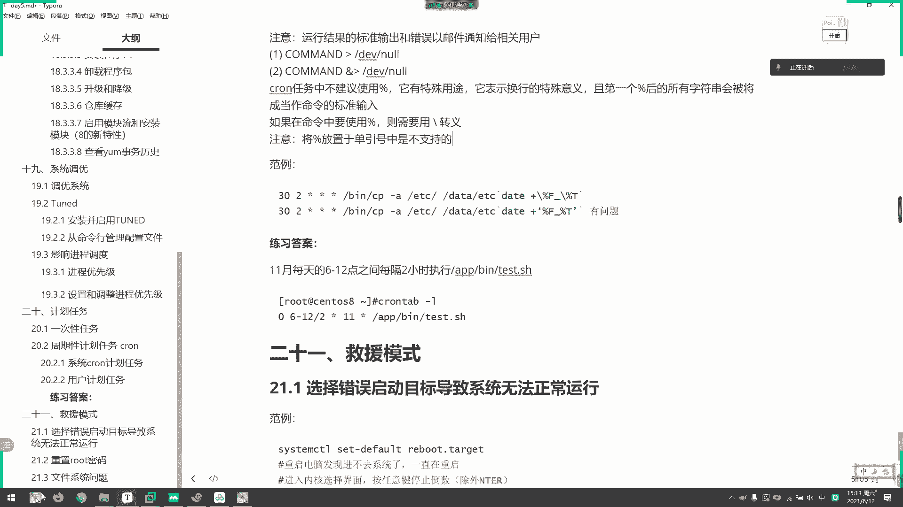
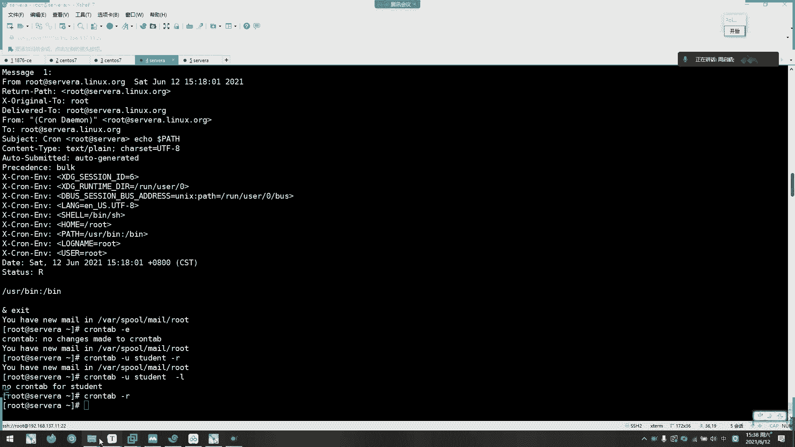

# 2021年7月新版-----RHCE8.2 RH124 RH134 RH294 认证课程 - P40：day7-6 周期性计划任务 - bili_15701050454 - BV1Gy4y1T7ug

吓。刚才啊我们介绍了一切呃一次性计划任务啊，然后接着呢啊我们要部署一些周期性的机会用务啊，什么叫周期性啊啊，比如说我在。嗯。要定一个每。每周一啊每周呃。每周一或者每天啊每周一。呃，某个时间点啊。

比如说14点。要执行一次我们的一个备份啊，比如是啊把它。EDC被封啊，他。是。you said we f。好，我们的EDC。然后记个时间吧啊。Data。电电脑络。请体时间。然后是点烫。点击一下啊。

这样子。让他每周一啊下午2点钟。执行那么怎么做啊，那么怎么做？我们就要用到周期金计关物啊，直接设定一次它每一周都运行。首先我们看一下啊，我们做一个信计划任务啊，有两类啊有两类，一类是我们的一个。

是有机关用务啊，一类是我们的用户机关用户。是。呃，其实他们都是类似的东西啊，类似东西。但是啊我们要多选我们一个用户的机会用务。因为在实际情况中啊，我们是无法写到我们的一个机会用务的。一般情况下。

因为沃路啊社会被我们的一个大佬给拿住了。我们呢他只能。去建立自己的一个基本任务啊。那我们来看一下。注意细关任务啊，所有我们的一个可能可能里啊这个手机包。提供的，然后呢，是由我们的格兰蒂啊。喺。

进行提供输物进件以及一些相关的辅助工具啊。然后然。是包含了stos一个提供系统的维护用务。然后是格兰啊。啊，不会多。啊，是它一个普充程序啊，用来监控我们的任务状况啊。反正我们装的话，它三个依赖直接装网。

三个依赖接锁吧。嗯，就是说我们这个任务啊没做的话，他会后续监控着，然后让他再启动一次啊。啊，然后用7版本以后呢，我们怎么查看这个啊服务，就用stus的去看我们cloy啊。

你看它是运行状态啊，运行状态。Yeah。啊。

那么我们看到了可啊看到里啊就分为两种啊，一个是系统用户作业啊，然后是一个是我们的一个用户用户作业啊，我们先来了解一下我们的一个系统切换任务啊，新切换任务。呃，这里有一个格式说明啊。

我们直接编写里面的啊EDC看到里。

嗯。呃，点table啊。🎼这里。啊，这里可以看到。啊，我们首先要指定它的效力型啊，为我们的一个beanb，然后呢它的一个环境变量呢啊从这里定义了。啊，然后是发邮件给谁啊。

发邮件给我们的一个work用户啊。🤧嗯。好。那么紧接着啊可以看到这里有一个example。啊，教我们怎么写啊。呃，无论是系统机关任务，还有我们这个用户提关任务都是一样的啊，都是五个星啊五个星。我行。

然后还要做什么？但时我们系统机分用户了啊，会添加一个用户啊，谁去执行，谁执行15个星是代表什么呢？星星星。嗯。行。要回家分。10。嗯。对。星期。嗯。分时热性钱，如果全都是新的话，就每分钟都执行。

每分钟都执行。啊，如果我这边。如果是一。啊，其他都是新的话呢啊代表着什么呢？每个小时01分执行。然后这里有果时间。也是一啊两个亿了啊两个一就是每天1点01分执行。嗯。

每个月1号每个月1号的1点01分执行月啊就是1月。1月1日1点01分执行。然后是啊星期的话可能会有冲突啊啊，其实也不是冲突，等一下我也会挖坑给你们跳啊，这里如果是一的话啊就是。

如果1月1日啊是星期一的话呢，就会执行的。肯定这句话有提议的啊，等一下再挖坑给你们跳啊，等一下再挖坑给你们跳。Yeah。😊，好，现在就知道这个意思什么是什么？这个呀比我这边新星星星。

一啊就是星期一啊星期一。啊，每个星期一都要每个小时啊，每个小时每一分钟都要执行的啊，是这个意思啊。心就是美的意思啊，美。好，那么怎么写啊？比如说我现在啊要弄一个。先把格式写起来。分时日月7息。

然后谁志行，他要干什么呢？啊、いいこ。呃一个hello。嗯。🎼改成就这样吧，每分钟就是一次。嗯，O。那么们现在就等待啊。嗯标等噶。第一。哎。第一。第一。啊，OK目前是没有了。嗯，可能会有问题啊。

要重启一下。之前也试过，他执行的。We。领邮券啊。应该是出问题，我回购一下。要重启一下。之前又出现这个问题啊，我说呃讲了半天了，他一个邮件都没到，什么问题？然后我用了一个没有没有没有输出的去让他备份啊。

证明了我我我我是可以执行的。然后这个消息的话，我们还是用这个。哎呀，手电啊。😀呵。😊，你个。看一下他等一下有没有啊。或者我们这边改一下吧。嗯。Good。啊，在我们的右色边右色边有没有在右色边在啊哦。

奔驰日月CT。我们来copy杠A。嗯。我们的。ETC然后存放在我们的data下，叫做ETC。下划线。8。加。把方F啊。这个有问题了。嗯。叫哥说你。有问题。🎼是打引号还是双引号来着？

看下。这样子鞋会有问题的。看一下。呃。他下。哪里指定的。这里。他说。这样写会有问题。要转移啊要转移。

不是打你号说银行，我要转业。因为摆放号在卡里里面有其他一些作用的。啊，已经有mail了啊。啊，已经已经运行过hello了，不用不用去证实自己的，看到没有？他把我们的变量都输出来了。这是我们两个。

那我们看一下d塔等一下会不会有啊。难道我写错了。Yeah。和比刚A data塔下的EDC。没起说啊。有了有了有了。怎么运行的上面那个没运行下面那个。只允杰的这个Ecohelo。嗯。😊，难道我写错地址了。

data。这个。Yeah。嗰鼻更器。我们可py在优色并下面。DDE加F。嗯。优色饼。Oh。🎼I。还是交互的意思啊。应该不用加。嗯。没做金额。看到没有？没执行你。未出钱嘅。也没有报错哎。嗯。呃。

那就再写一遍喽。嗯，把路线插起来咯。哦，我知道了我知道了。一定要查绝对路径这个。啊，因为他popy的话在我们这里是别名啊。所以他一定要。啊，所以他啊这里一定要。🤧嗯。用绝对路径呢。人民无效的。

所以我们写替换任务啊，建议大家啊不管它在不在黄金平台里面都。写一个这个给他。还是没有哎。这个已经错了。🎼嗯。什么问题呢？哦，忘了加用户啊。顶。😀呵呵呵。😊，哎。

啊。这个。放置预单以后都是不支职的。

啊，有了啊有了。好，可以。啊，这是我们的一个性统机外物啊。低低。嗯。🎼先把那个删掉啊，ETC cloud。啊使用机关物。🎼啊，不懂的话，我们可以再。乌班图，但是物班图，它这个这个文件还没有放你呢。

空白的这个空白的。我们先不把这个删。呃。再弄个。呃，消线。加。No。这样子他就不会不会冲突了就不会冲突了。嗯，这个已经不会有。那是的。看一下。唉，再15分看一下吧。时间能不能过得快一点？

等待总是漫长的啊。

我可先往下看一下啊。嗯。😊，好。啊，反正这个格式啊适用于我们的一个系统就清维户啊。他系统机关问题得要加一个入手啊，然后我们看一下它的时时间法啊。啊，它可以离场取值啊，也可以连时取值，然后可以不产啊不场。

不传的话，我觉得。か度啦。可以，不用加哈，把它是把放T啊，做有有一个加就可以了。行，不管了，加也没所谓啊。好来。然后啊把这关我删掉啊。Yeah。这是我们的一个系统切换物啊。

今。O。😊，这样只有把我们的系统机构任户删掉了啊。好，然后。我们看一下。这个时间我们等一下再看啊等一下再看。我们先看一下呃。我们的一个用户替换任务啊。同知关我。啊，首先是我们的一个c table。

怎么写啊？首先是啊每个用户都有一个重要的cloud用户文件啊，也是存放在我们的一个呃stop里面的一个cud cloudud里面。然后创建以后呢，它就有一个用户啊。

用户名作为它的一个机关用户存放的文件夹。然后呢啊word用户能修改其他用户的作业。然后标准的啊默认标准输出和错误啊都会发送邮件到我们的一个对应的用户啊。比如啊user创建的用户呢。

就发发送给user的邮箱啊，就不是发给我们的ro了。我们系统的话是发给我们的ro了啊，当然也可以m to设置啊。然后呢用户的可从默认pa。嗯，是我们的一个。入色并和并啊，然后呢，其他路径。啊。

要在我们的计划任务上面啊自定义啊，我们看一下怎么定义我们的一个这个任啊。首先是cloud table啊杠一，然后就到进入我们的一个编辑模式了，编辑模式，然后呢杠R啊移住所有的一个计活任务。啊。

然后杠I的话呢，跟我们刚R一起用呢，可以啊指定啊你说指定的一个任务啊。看珠。哎，听我们的一个user啊。啊，经我们UC的运行，刚刚说过了，只有他可以修改我们其他用户的计关用务啊，L了就列出所有了。

所以我们现在先先。

クラ。🎼So how。🎼あ単に。嗯，OK还是一样啊。分时。🤧4月17。啊，一口。我们看一下我的pa编列啊。啊，然后这边切换一个用户啊。对好。我们看下我们普通用户的。うん。Cown。T感一。啊。

也是分464T。一口啊，我们来拍始。嗯，然我查看啊。그라운。🎼手ぼかったよ。这样子就可以看到我们的一个机换物了。Hello。🎼でも。好，然后等待自己啊。嗯，已经有了。啊，可以看到你看少的可怜。

我们有环境变量，这这块用户你们的环境变量少的可怜啊，少的可怜。这边有了没有啊？啊，还没有等等一下。等待他一下。e c h o m。贴贴取那没必中啊，有了啊，你看他是发送给我们这里对应的用户的啊。

我看一下这个啊，这样啊，默认的都是一样的，少了可怜啊，少了可怜。虽以呢我们通常情况下呢啊是。把啊比如一些脚本啊，我们都是写成一个绝对路径的啊，写成一个绝对路径。那我们把这个计关任务删掉啊。呃。

再再编辑一个讲呃hello。Table一。继续差一点。好，我们来看一下其他情况的。嗯。😊，比如说我这边指定为一，刚刚已经说过了啊，指定为一，它就是每小时每一分钟运行，对不对？啊，没秒没想说一分钟运行。

然后呢，我们除了这样子啊，还可以是15啊20。事实还要新行行新。行行。口啊，hello啊，这句话什么意思啊？就是每每个小时的啊。第1分钟第15分钟第20分钟第40分钟都执行一次这个任务啊。

执行这个都执行一这个任务。然后啊还有个步长。呃，比如。啊，退。嗯。20到。24吧。啊，行行行。あ行こどなあんハロ。啊，又是什么意思啊？就是啊我们8点。晚上8点到晚上12点。

每一分钟都执行一次个hel喽啊。然后还有一个牧场。我们的。不先。先行吧，这个怎么又跳了跳了这个东西，我自动拆集以后，它那个按键有点问题，我觉得。啊嗯还是行吧，还是行。啊，不要。这样吧啊，行。哦。

然后先先先。啊，被告。Hello。这什么意思？说每两分钟运行一次啊每两分钟运行一次。那么问题来了啊。啊，问题来了先。星。行。先呢个 hell咯。啊，这一句话什么意思？这一句话什么意思？问题来了啊。啊。

不要不要不要沉默了啊，啊该沉默的时候沉默，不管沉默时候都要该出收拾的要出手。那这是什么意思？检验一下你们有没有理解？嗯。姐，你在你们有没有理解每5小时执行，知道吧？还有其他员工作答案吗？

一天5寸肯定不是一。5次。😀呵ふ。😊，不要吗？你。5喝。😊，啊，也不是不对不对。分时1月星期啊，记住啊，分时1月星期。就是一个坑来了。😊，啊，这是啊。不过可以，只有两个人回答，三个人回答。怎么可能。

哎呀，你们都没掌握啊。就。呃，我们龙家江同学掌握了啊，就我们龙家这样讲同学掌握了意思意思是每每五小时执行一次，但是这个win定是运行不了的啊。😀呵。😊，我怎么可能是5分呢？每分钟。

每5小时里面的每一个分钟都要进行。但是。🎼他掌握了这个意思的啊掌握了这个意思。他的这个是执行不了的，知道为什么吗？啊，这个执行不了这是一个错误命令它的。😀呵呵。😊，来了。我们那个任同学。

他的意思是答对了的，意思是对的。每5小时执行一啊，也不会执行一次啊，每5小时执行啊，里面的每一分钟都要执行啊。反正看到心都是美啊美啊。就只要5分钟是新的话，那是每一分钟都要执行啊。然后到达啊这个小时啊。

就是满足我这个条件了。比如我我这边啊。如果这个人执行啊，如果这个人执行，每5小时是不是啊我们的早上5点啊，早上5点的话，每一分钟都要执行，然后到10点，每一分钟都要执行啊，然后到下午3点15点嘛。

对不对？每一分钟都要执行，然后下午6点ok不对，下午20点啊，8点钟每一分钟执行，那么最后一次。啊，所以我们这个布产。不长。是要可以整除的啊可以整除。这个是错误写法了。O。啊，再下一个啊再下一个。11。

呃。对。不是只是不是只被24小时整除。比如我这个分钟是要被60整除，这个要被。24整除，然后这个啊是可以被30或者31整除。1月是备12整数，然后星期啊，肯定是要被7整数，对不对？等等啊，我有个电话。

咱继续好。那么啊这里啊分时日了啊日了呃。呃，每个月的8号到15号啊，然后啊。一三五。这三个月。啊，然后我这边啊心情。啊这个hello。啊，这个啊这个是怎么执行啊？这个什么东西啊，能能理解吗？

能能不能理解？能不能理解？看一下你们怎么怎么理解这这这个这个这个任务怎么执行的。嗯。可以可以可以说了可以说了啊，大胆发挥自己的一个想象啊。🤧嗯。嚟哦，次次发言咯。很容易的啊，反正信号是美的，不信啊。

你们一一定要记住风时月月星期啊，把它写出来，然后把它对上去就可以了，对上去就可以了。135每个月周五。135。月的每个周周五。不对。不对不对不对不对。不对。135月8到15。到周五之前。

有点意思啊这个有点意思。啊，有点意思嘿。😊，那如果他不是周五了，我就不执行了吗？😡，啊。😀Yeah。😊，对。你们看一下他这样子怎么会定义，怎么定义，能不能执行。啊，我又定义了啊。8到1呃8到15日。

然后又定义了周五，难道他85日不是周五他就不运行了吗？啊，你们觉得他怎么运行呢？从后面开始读是没错，本正你对照一下课时预约信息。为什么星期要拆开来放啊？为什么星期要拆开来放？想一下。Okay。😊，啊。

再给2分钟思考啊。如果他8到每个呃135月，如果他8到15日5日周五的话，他值不执行？对。🤧啊，你这个。😊，哎呀对对对对对对，哎呀不好玩。😊，呃何亏何亏说出来了哎。😊。

不过我相信啊啊永伟永伟也是自己思考出来的啊，可以啊啊，能理解这个问题可以啊。那我们来看一下，哎呀，刚才忘了删了这个任务啊。可以啊可以不错真不错啊。🎼你是你们是我这一件带过最好的啊，我带过最最好的一件啊。

🎼所以这样老说你你们是我带过最差的一件，我反过来说，你们是我带过最好的一件。好，我们看一下。あ。那我们看一下啊，通过面啊面提示有提示的啊，有提示的呃。이디ク。Table。응。都这里。这个是。嗯是这里。

我找一下。嗯。嗯。不是这一张。你上是内真。Clud。真。这就是我这一粘。嗯。晚上也不睡。嗯，要介绍他那个时间怎么写的啊。面孔。こ。啊，看一下是不是这一张啊，应该是这一张了，开始有这个时间介绍了。

可以看一下，等下啊，分钟的话是0到59啊，然后时间是0到23。这里是1到31号啊，然后是月11到12月，然后星期一到星期天啊，然后他零或者7都是代表我们的星期天啊。然后啊这里。就可以指定一下吧。

我们发邮件给谁啊，然后。那个机会物。这里都有格式，要有特殊的啊特殊的这边也顺便讲了啊。这是重启以后啊重启以后运行。然后呢，这是啊美年运行一时啊，它代表的是0011啊，每年的1月1日啊，每年的1月1日。

然后呃这个是也是啊一样的啊。明年的业业，就说这个是每月啊每个月。也就是一日啊。🤧嗯。然后啊这个星期啊每个星期运行看到没有？好像是每天。每天运试一次啊，然后每小时每小时。好。然后看下继就往下啊。

🎼看一下我们那个唉没有了吧？还有啊，应该。不是164行吗？哦。他用那个字顶。你那句话呢哦在这里啊在这里啊，这里可以看到啊note啊，这个这句话。啊。呃，这个例子跟我那个是类似的啊，你看啊330。

然后4115，然后嗯。这什么意思啊？分时日月星期啊，每个月1号到15号。啊，一号跟15号，每个月1号跟15号，然后是4点30分一试一试，然后他是初五的。要后他后面啊，注意他一句话啊啊。

我case啊 a command to be worn at。呃，4点30分啊，早上。You on the first。就是1号到15啊，11号25号。

然后啊 of each month就是啊每个月的一号跟15号。有呢 pass every fri。家的家。有理解没有啊。嘴啊，我是挖个坑给你们挑的。看你们能不能理解。

所以你们一定要读懂这个分时的月薪息怎么来的。啊。所以星息为什么要放到最后啊？星息为什么要放到最后？

好， ok。很好很好啊，有有有一个同学能答出来，我觉得非常好啊。然后呢，我们系统相关的还可以放在我们的一个对应的文文件夹里面啊，让它美图运行啊，这是我们配置文件定义的，我们不用管它。好。

这是我们的一个cly啊，然后啊要定义它的一个配选啊。没有。呃，先讲完再给你们做这个练习啊。这种屏们重新是个练习呃。

哎哟。呵呵。😊，怎么有那么多任务呢？我没删吗？그라운 cable 간。啊还真的有这个。🎼那就顺水。🎼把它给那个。table望紧热啊，多谢几多谢几个。星星星星星。各 hello。然后是星星星星星。好不？

打个一吧一扣 hello。然后是。新。嗯。星星。一。到5月。🤧嗯。嗯你好 hello。写知道吧。然我们删除啊。🎼刚刚阿我已经听过了啊，我也不想再重新写一遍，所以我们直接啊cloud。🎼加个I呀给我啊。

杠AR。嗯，他这里没得选了，只能他说是不是真的把word那个替换任务都删掉。反过来。啊，也不行。他不能指定我要杀哪一个吗？

嗯我做个实验给这个实败想着说。这能不能用？

完了，不行。看一下能不能单独删除了，有没有。Delete user， ground table。没有，他只能按按用户删除，只能按用户删。Use still的。still可以。

嗯，col不是甘独手吗？应该是感橘啊感橘呢。

感觉。嗯，T DENT。没有问。那我不写在st里面吗？还有这个直接退了吧。不保存了。🤧嗯。是丢的吧。STUD E，N T。STU。嗯。🎼哎，他没把我删了，他经会用我删了。

然到时候我一样可以指定一个任务给他啊。他说我有问题啊。啊，忘记定时间了，分时日月星期啊。O了。🎼嗯。反正他外加嘛，就周五也会执行嘛。中午也会执行。呃。要我看一下没有。看一下有没有最近的啊，37分啊。

应该是这个了啊啊是啊。看到没有？嗯，你看31分的啊。hello啊，那就没问题了。相关的。啊， ok。这有还行。所以啊这这是我们的一个root啊，是可以。给其他用户指定业务的。Cronund table。

然后是甘珠。这的。卡号。看一下还有没有了。打票。已经没有了，删了啊。然后这边也把word删了啊，补充了。不错了。O。😊。

然后其他呃排面大黑单是跟刚才是一样的，跟刚才是一样的。1啊主要是指定一个配置变量啊，指定一个配置变量。

🎼嗯，好了刚刚开啊是我们的一个呃入色B还有B嘛，对不对？然后我们现在写一下Cown。

感じ？PAATH等于我们的一个注射。B啊，然后。发购物的密码啊。我是。我们的闭幕录啊，还有一个。不是。Spin。这样子。然后是。奔时日月。日约星T，然后是机扣。呃，一口。Hasband啊。

看一下它有没有框啊。OK啊，我们等一下，等一分钟看一下结果。

嗯。然后呢，如果我们不想它有一个标准输出啊，还有或者一个错误输出啊，给我们的一个邮件通知啊，我们可以直接把它丢到我们的垃圾箱就可以了啊，直接用这个就可以了，不用管这个。啊，这个是我们标用准确。

还有不用错误都可以。啊，丢给我，对不对？让他们有输出就行了吗？是不是？

看一下嗯，做了没有？う。啊，就开始了是40分啊，26。看一下，你看这是我们定义的配置，它就能用这个pa panel了啊。所以呢我们。嗯，O。已经没有了。🎼hello，删除啦。hello，table。啊。

O。相关。好，然后呢如果不想让他有输出啊，我们直接。定义。本是。是。星期比如我们LL手是不是有啊？啊，把它丢到了。对。啊，算了，还是一口吧，一口肯定有输出嘛，对不对？听到我们的hello。啊。

丢到我个烂子他手备里面。我们看一下他会不会有邮件。另外我们这个也改一下。弄一个student吧。嗯。嗯。当时月出现。嗯。Hello。🎼啊，这边我们定义一下有井发瓶水啊。不要吐，不用吐。嗯， ok 。

怎么还有。38分。嗯，让他执行一下。对。你看这是我们sielden发过来的st发过来的，看到没有？啊，就说我们觉得可以指定1我呃自己的啊并没有啊，自己的就没有了，看到没有？啊，这个就没有了，只有一封。

全部是 studentdent的。好。所以我们把它的标准输出给。弄掉啊，它就不会邮件了。う。OK这个是我们的一个激关网。然不呢，我们还有一点时间。

做个练习啊做个练习。开下，你们掌过了没有，就这个啊。最好自己写一个脚本，脚本的内容就是一个一口。一个 hell吧。啊，记得装啊交本内容。其实没必要啊，直接写写上去吧。因为我这边定义的是也不会马上执行啊。

有们马上写，你们写一下啊，写完就打到我们的那个微信群上面就可以了。那我们休息啊，休息到4点钟我们来讲那个gra，还有这个正策表示啊。哦。不。

关掉。