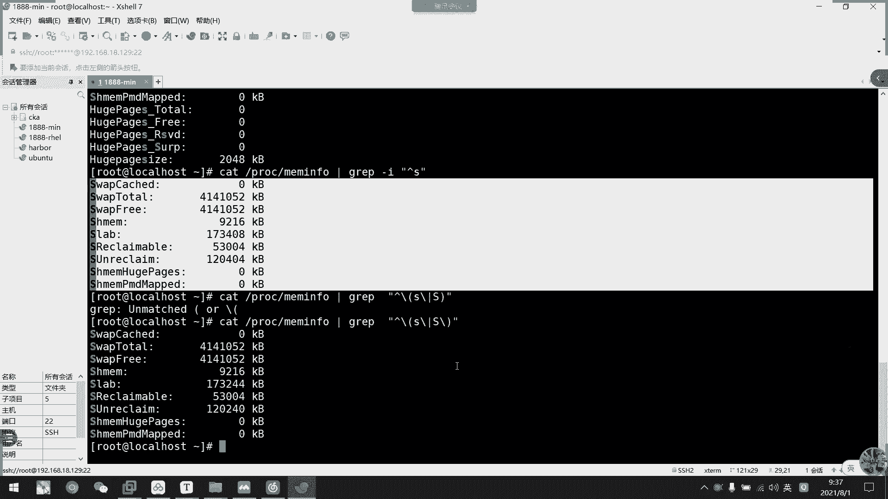
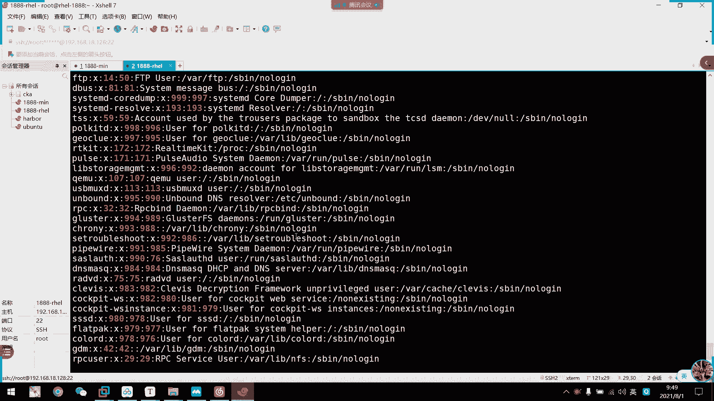
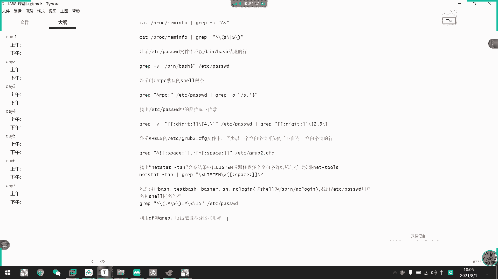
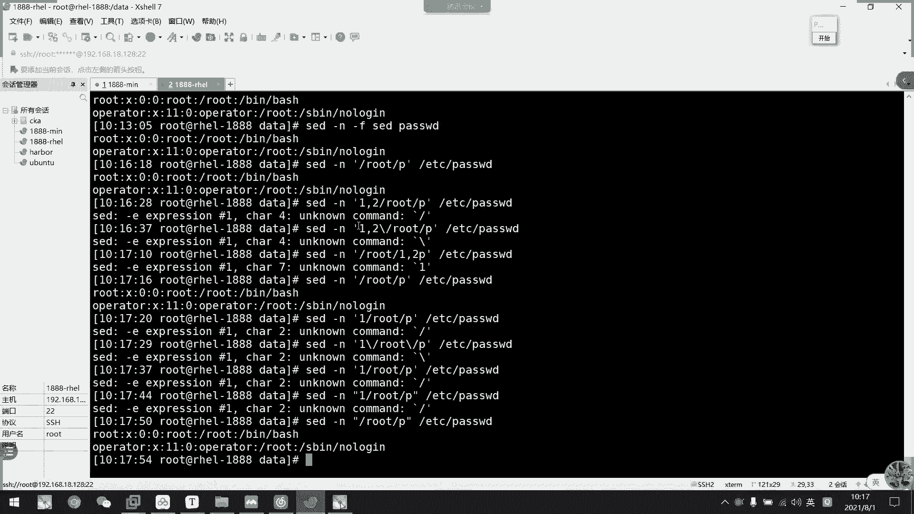
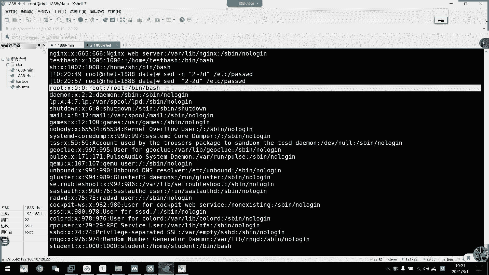
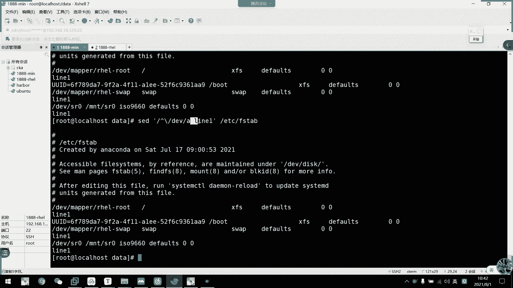
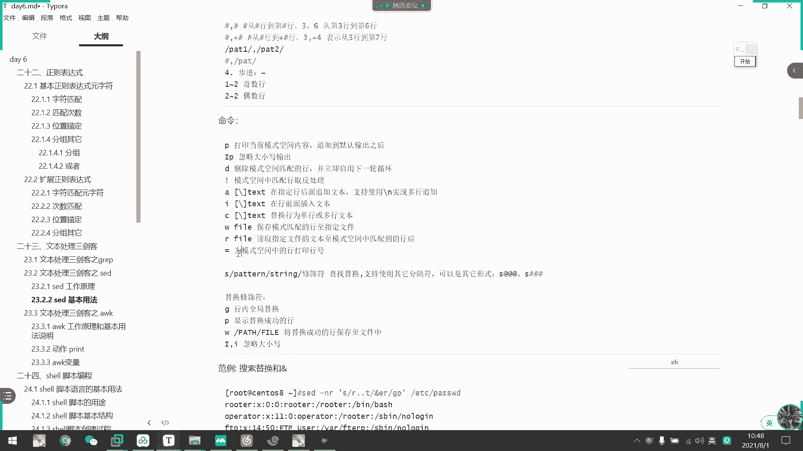
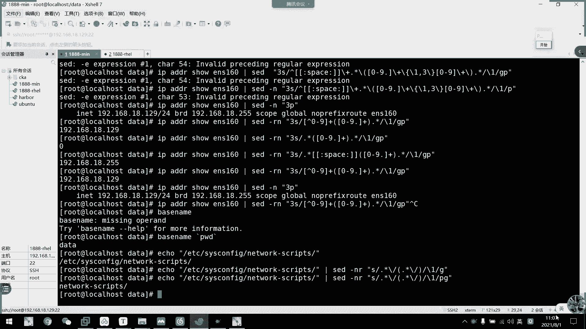
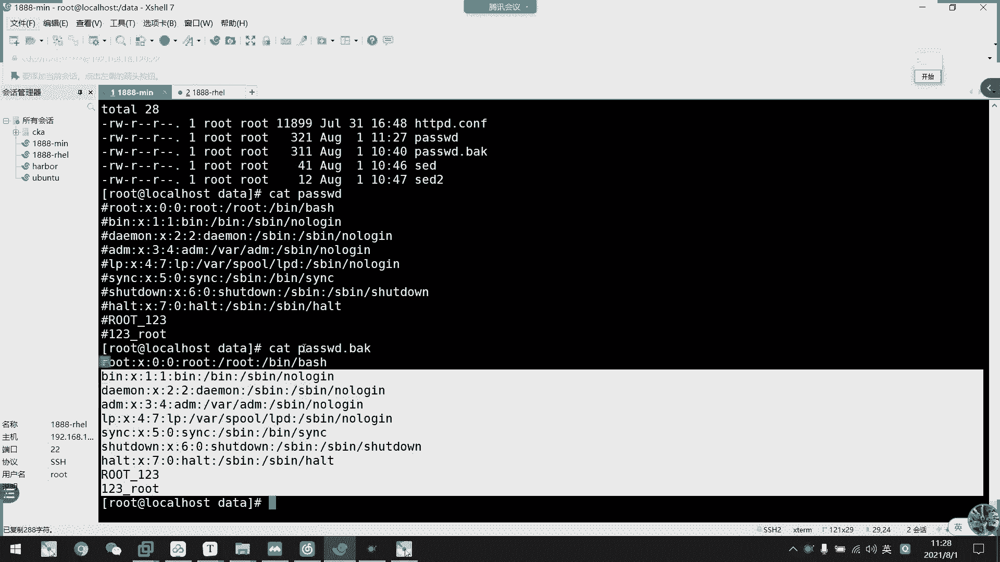
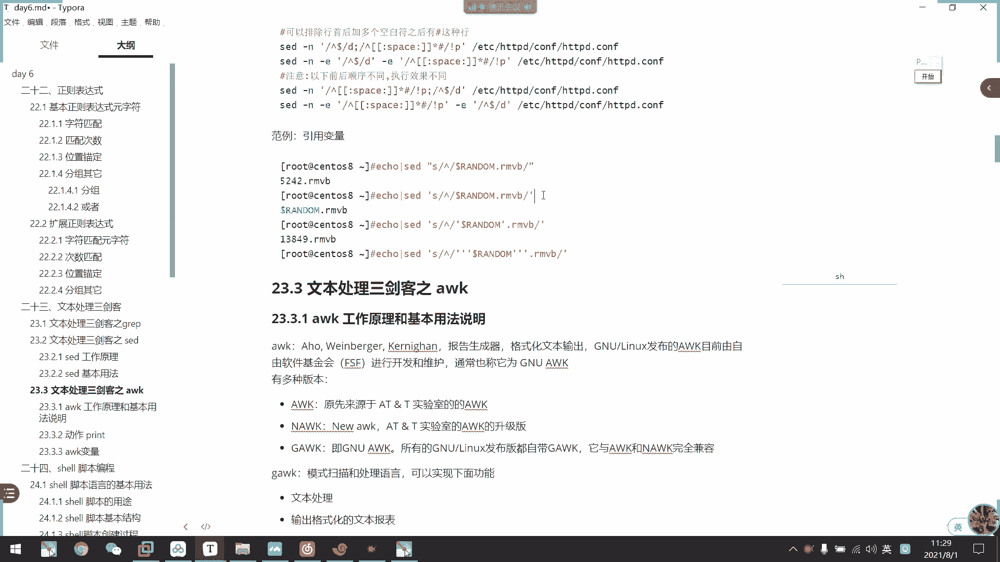

# 2021年7月新版-----RHCE8.2 RH124 RH134 RH294 认证课程 - P41：day8-1 文本三剑客之sed - bili_15701050454 - BV1Gy4y1T7ug

啊。直接只回顾gra吧。啊，第二天的下午。是grape与。顺则。表达是啊。嗯。好，首先是grape呃一个。🤧嗯。常用选项啊。从学下。这是干I啊忽略。大小写。干啥。显示。很好。赣O。是。显示。匹配的。嗯。

部分。钢V。不显示。匹配的行。更衣。多条件。匹配吧。条件。之间的关系。好啊。嗯，还有什么来着？刚到不啊。呃。二。单时。喂。本久续备啊。🤧嗯。嗯，干大衣啊。使用扩展。正则。表达式。等同于 e grape。

照没有了吧。常用的。我记得。在我脑海里记得就采用的就是这些啊。差不多了，选在行号统计函数啊，统计函数这个。也可以。哦，对哦。最重要的几个杠A。嗯。🤧嗯。呃，显示匹配。的行后边行。关闭了。有。

显示匹配的行。以子。该。嗯。Qing。几好。更尸。显示匹配的很。以此。该行。前后。啊，这回真的是差不多。呃，杠C也加一下吧。ラし。显示。匹配。用来统计啊，所以我一般都是用。WC去数的。就这样吧。

然后是这台表达式的话，我们就直接看一下这个练习。就看一下这个联系。我刚翻了一下啊，发现他有些题可以。

用我们的分组吧。frame的分钟。我再试一下啊。

随便一台吧。

好，我们先看一下题。第一题。又显示这个pro。

没人货啊。内存的信息。然后它要显示。🤧大事。街度。或者小S开头。嗯。啊，这样子就可以了。

这个也有粉式是不是开头啊？开到大。第二种。就分组嘛，对不对？

各两种方式啊。嗯。

把题目也拷过来吧。

然后是第二题。不以这个结尾的行。诶电脑啊。

调见。Gui。不以那个结尾。嗯，你哪里呢。对对。还有没有其他结尾的吗？

第三题显示它默认的效程序啊。这题用AWK好做。

呃，要显示它尾端。嗯。看一下这样行不行吧。我脑海中子也没有答汗啊。哎，不行，拆不开。Dixin。点数。不行啊。嗯。😊，个我拆不开。我要RPC。是吧。必 c开头都系。一起开到的。哎，我没有这个用户吗？去。

没有这个用户，看一下这台有没有。嗯就体用。解不开呀，咋搞？咋整呢？他没动开。这么号分不开。啊Bc。开头。直接点心。Dxin。跟。Sure。怎么动不开它呢？我用刚O去截。这个线才好做哦。

我一匹配都匹配整行出来。

什么鬼？🤧嗯。写是他的尾部。它是含匹配。有同西做出来吗？这个。他不用塞，好像做不出来哎。是不是？这样吧。应该要。做两次了。怎能。再接。这用卡可以。Hey。什么。说出那么多了。嗯。这个。对。用卡的话。

它跟这个已经没关系了。用卡我还不如用到AWK啊，对不对？

好，第四题。ETC中的两位数和三位数啊。

有 grape。嗯。他要含还是怎么？说了。

嗯。两位数和三位数。嗯。怎么了？干低没反应。

D I。我总忘记这个怎么背。

DIPIT。嗯m。数字。数字。哦。

但他这样子截把这个也截出来了。

这不对啊。

嗯，这样也不对。嗯。等一下。啊，这个我忘了之前做过出来怎么做。这个我想想。那怎么排？把把把334个以上的排掉了。只显示两位数。可以了。不行。

前面也加个。

这个不行。

形式可以，但是他会多个冒号。

可是可以。嗯。

最后把这个排掉。谢谢。不到3。我都想。

加的快不行。他这4个都。而且是数字全都选中。就是多了个四位数的。5位数的也有。嗯，这个咋搞啊？🤧咳。咋整？数字。我说要排个四一下，但是。又要那哥。做两次啊。排两次。也可以。

不过我觉得好像好复杂的样子而已。

这就没有了。嗯。总感觉好像有点。头布的一样。就是我刚第一感就不行。可以的。

这干DI扩展了。So。

用两个方。洗两次呗。Yeah。

哎，反正能练练到他的那个语字符就可以了。嗯，西田西田。来 here。显示我vo八中。至少有一个空白字符。且后面。非通班支付的函。

嗯。

Great。🤧嗯。空白字符开头的行。然后。或者这也不用加。这点心。还有飞空。哪一个。이是。

If you see， global earth。

可以吧。是不就这么多。嗯。我验证一下是不是就这么多？啊，六十5行。是65行啊这啊，你昨天做有多少行？六手盘是吧？

这个。就是这个。什么找出。天结果中以list审后跟用一个空多个空白字符。

这回都。那就先。🤧嗯。Weui。他有绿色。Nscent。说还是加一点吧。可是。去点心。到最尾。嗰啲。

嗯。多个空白字符。

还是那个吧。还要不买支付。任意个是吧？嗯。他把它当成一个整体的。嗯。怎么用心啊，那用心啊。嗯。用心也可以。为什么问他不行呢？编一个购买字服。到结尾。

哦，我知道了。

啊，然后是添加这几个用户啊。是只有这个下威楼了是吧？

嗯。就是 add的。

有一个是什么？You looking。

呃。很以的。是这么个用户是吧？

猴他这里。题目要求是要。

他的意思就是说首尾相同啊，与笑同名嘛，就首尾相同嘛。我看一下这边的话正好讲一下那个。

分组吧。我看一下能不能。九分钟。呃。Dixxing。行。到。Grave。那出问题了，那是。需要一。In white， bed in freeze。他说哪里出问题了呢？他这个条件。问题。哦，知道。搞啲啦。

多出来了。啊，这个呃就是我们分组呃，给你们说一下这什么原理啊。

他提示我要用扩展的政式表示啊。🤧我们看一下。

🎼呃，给你们讲解一下啊，首尾相同。啊，这个是分组啊，同时也在我们的个打开这里吧。

啊这啊分钟。好。我昨天想着用set才能又分转，原来它回呃也可以用我们收尾相同这个方式啊。呃，首先我们按照我们的答案来看一下它的。

那个。多结一行吧，来分析我们这个分组吧。

啊，首先呢我们这里。他啊以括号括起来为一个组啊，然后括号括起来为一个组啊。啊，分组是这样的啊，把它括起来，等一等一下用s的时候会呃更加常用于这个分组。我们先看一下我这个brave是什么意思啊。

首先是啊我以这个单词开头。一个大词开头。点心开头啊，然后点心，然后一直到这个单词结尾啊，这个叫互相引用啊。啊，我把这个单词。用括号括起来啊，叫做第一组啊，叫是G啊。啊，第一组，然后呢，我后面再用起来。

啊，后面借用起来啊，这个就叫做后下引用啊啊，它每一个括号。比如说我在这里再括一个括号啊，比如说啊我在这里再括一个括号啊，这里为第二组啊这样子。反正他从第一个括号开始为第一组，第二个号括号就第二组。

这样子互相引用啊。我这也用，就然后这个这个一。它的匹配条件是跟这个是一样的啊，跟这个是一样的。要我括起来那个是一样的。呃，我这样把它改一下。

你们就知道。啊，这里不用点心了。比如说我用SYMC啊。That Y， and C。嗯。明白吧。啊，我现在这个就是啊。呃，以SNYIC结尾的这一个单词呃为开头。那我第一个匹配条件是不是这个？

第一个匹配条就是不是这个。啊，不说。啊，然后这里点心一直正常来说，一直到最后吧。点心啊。啊，用一个字符嘛，对不对？一个字符啊，然后后下也用。我这里这个条件。他改成是什么呢？在他。这个表示里面它是什么呢？

啊，就是。🤧。SYMC。这个单词开头。然后就是结尾了。对不对？能明白吗？这个就有首尾相同。都收起来就是收尾相同啊。能民白白这样子的一个匹配条件。系啊。啊，对，这是一个分组。不是一多了，是这个。是这个。

是这个。嗯，对对对，多了是代表它结尾多了次他表它结尾，然后这里是代表的开头。嗯，明白吧。那么我们就可以做到我们的一个行首行委。安手防尾或者这里应该可以用。这样子看一下行不行啊。诶。我们先看一下这个吧。

Wpe。然后是EDC pass。啊，你看他搜出来结果是不是跟啊数为相同嘛，对不对？那么我说一下。直接让它作为同一个单词。呃。我了分 좋아啊。有。啊，他意义就是这个，其实就是我这里啊作为一个。

单词啊把它整整一个作为一个单词。因为它有一个冒号，它就截开了嘛，有个冒号截开了就不不属于它心嘛。如果它是下划线的话，我就结果不是这样了。如果这里是下划线，结果就不是这样啊，但它是冒号。

它就直接可以选择这些四个单词，对不对？啊，这四个单词嘛。

啊。好，那我们分组的话，我们等一下，如果这里没听懂，我等一下讲的 set的时候，我们再看一下，好不好？嗯，很好用的，我们到时候。看到晒的时候也就知道很好用的这个东西啊。我你会讲。特别是搜索替代的时候。

或者是删除哎那个题。然体谅。8。对。呃，这里讲完了是吧啊，然后是到最后一题了啊。最后一题。啊，DF和我们的brad取出。各分区的利用率。

DF。分机利用内右手。这列。那直接grabe。嗯。🤧嗯。又好仲就意个办法。然后再入间屋啊。嗯WAW肯定。搞啲啦。我操我也很快啊，我觉得。😊。

是吧。呃，这样也很快啊。

AWK后面也会讲这个例子。AWK他直接。用空格，还有百摆放号做风格服就可以了。

啊，这是我们的题的答案啊。你们有想现在要的可以截一下图。给我们截一下图啊。因为这个笔记杰克才给你们的啊。你们截一下图吧。

那么先。开一下啊。

先开一下下载的头啊。好，是的。啊，现在跟我们的那个。gra啊其实是类似的啊，他们啊现在也是我们的一个航编编辑器啊，但是我们这个gra是含。选择器。啊，我们这个是编辑器啊，为什么叫编辑器啊？

因为它强调之讯啊，它既可以像gr谷一样截取一行啊，也可以对这一行进行操作啊，对进行操作啊，它的一个工作顺序跟逻辑跟我们的那个。我有差不多啊，也是打开整个文件啊，对于整个文件来说。

然后是朱行读取逐行读取啊，先把赖一。拉过来，然后啊按照它的一个锁定的脚本啊，锁定的脚本。🤧嗯。进处理啊，如果。不违背，它就不输出啊。如果是匹配的，他就呃作为一个不要输出打印出来啊。啊。

它的一个沟通原理跟我们的gra是类似的啊。

等我们看一下。好，看一下这里。呃。这里。他的一个命令行。格式是什么了啊？首以是s加选项，然后呢，这里是。加脚本啊加脚本。然后是我们的一个输入文件输入文件。啊，什么意思？就说我们用s。这角度。

他要等待我们说入，对不对？啊，比如说我这里出个。啊，他就打一坦克。输入U开打开HO输入1888。啊说 real。啊，他要打印表啊，就是他现在的话呢，我这个脚本为空啊，脚本为空。所以呢我现在是输什么。

他就打印什么出来啊，输什么再打印什么。这些都写了啊。他는过래不가。是类似的啊，但是也进不相同啊，他会把原有的就算不匹配的，它都会打印出来的。我们看一下。

啊，首先看一下它的一个损失啊，刚。不输出模式空间内存到屏幕啊就不会自动打印。通常他会我刚刚说了，他会自动打印把我们的一个模式空间的内容都会打印出来呃。

比如说啊我这边在等。交了。road，然后再打印我们的ETC下的password。八号。啊，你看他会全都做出来。啊，全部做出来。

全都给打印出来，但是呢我们找一下他有处理过的函。诶。因，这里怎边没有了。这应该会打两盘才对。是我的语费有问题。是我的渝北问。是这样啊。我们看一下。系啊，系啊。啊，这里就是他已音编辑呃。

就是说他已经处理了导函。这一个。经过脚本处理。

嗯，还有这个啊，刚好两行是不是？我看一下。

刚刚可以不把那个内存空间中的。打印出来啊，那么我们看下。那么最后就是这两行嘛，对不对？啊，所以刚刚我们上面说的这么错啊。他这里全部打出来，是因为他会把内存空间的都打印到屏幕。

然后把处理的就直接放到已处理的行，直接放到他该行的下面打印出来。然后我们家嗯就不打印那个。呃，类似空间的。内容。所以呢最后他就打印我们匹配出来的两个行，处理了两个行。

啊，然后一也是到底没问题啊，跟我们那个。呃。跟我们那个break的那个一也是一样的，我就先不讲这个啊。要盖F啊，指定文件中读取那个编辑文本。

嗯，你是一要。这个。好。然后这里。写一个。啊，是一个。赛的杠N。嗯。杠F。接的。这里要不要加东西啊，忘记了。这个可能要看翻例才行呢。啊，不行。这算了。啊，没有对应的。

嗯，所以刚F我看一下，等等。该普这个翻例很少。以这个作为脚本。嗯。因为我要打印。地址命令看一下，先看一下地址命例。嗯。对就我处理当地址。第几行。技速函和O续航，要P是打印。

我不能用P怎么弄啊？应该要把它写到脚本里面了，试一下吧。他作为整个作为一个脚本。可一下。啊，这就可以了。还要他整个作为脚本才行啊。它跟我们那个gra不一样，它gra的话，我们直接输一个word。

它就可以作为条件了。但是这里啊由为它是一个脚呃要脚本，所以我们要把整个脚本都写到里面去才可以啊。

呃，然后是杠R杠一是用这呃扩展的这个表使啊。然后杠I的话呢，它可以。备份文在编辑啊。啊，所以我们一般刚I点BAK让它自动备份啊，让它自动备份啊，比如说。说了还是不讲这个，我们先看啊还是先看跟恩啊这些。

一些呃搜索。搜索搜索处理的。你年啊。首先他这个脚本呢啊还可以做一个地址定界啊。对定键，然后。这个地格式的可以不给地址，然后直接给对全文进行处理。其实这个就是一个范围，跟我们那个。VIM是类似的。啊。

就是就是第几行到第几行。记得吗我们VIM那个什么来着？那你们有意见吗？嗯。我们VIM哪里有类似于这个的？地呃，地址定界。有印象吗？是不是我们搜索替代？先是。黎航到黎行。或是模式。或者是结尾。都没音象了。

一得と。不 see。是不是这个？第一链接是不是前面这个地址啊？嗯。都完了吗？都还给老师了吗？好，然后是单地指指定第几行啊。然后这里是模式。啊，这也次模式啊，可以。😊，用正式表达式来写呃来来表示啊。

然后地地址范围啊地址范围。第方围呢可以是从第几行到第几行啊，然后也是可以第几行加第几行啊，加加多少到那一行。然后也可以试模式一到模式2。然后也可以试航。大博士。啊，然后这里可以用布径啊。

布径用呃这个百分2百分波浪号啊，一波浪2就代表基数的函了。2，波浪二就代表无数的函了。就1到2嘛，这里是1到2嘛，好像是2到2嘛。就这从一开始啊从一开始，然后每次加2，然后这里是从二开始，每次加2。

所以是基数不是啊，然后这里一定要结合我们的一个命令啊啊，所以是P，我们都是用P吧啊，先是打印出来。那么我们就按照这个地址格式来做一下啊。

比如说。嗯。我们看才这一这这样子。啊，他就。不用这个。好，就这个。我们这里没有加任何的取值范围，所以呢它会对全呃全文进行处理，对不对啊，对行全文进行处理。那么我们这里加个地址，直接第一行到第二行。诶。

哪出问题了。

啲行到边行。这么神奇啊，啥S啊？这也是指定第三行了，放在前面应该没问题啊。

D行到第二行。诶。真的是神奇的。这不对。第一行。表达这个问题。转移也不行。做嘢不是。我怎么给不了了呢？是打引号的问题吗？

我怎么给不了行呢，给不了地址。没下。或者这个是这里直接删啊。3然后是。P配的。哦，我知道了。

好知道。这样子啊。1到2批啊。知啊知啊知知道。他现在这样子地的定界，他只能对行进行处理啊啊，我知道知道知道。

然后是指定第几行，然后。呃，到我们模式啊，刚刚进入模式啊。就ro的这个模式，我说啊结合不起来啊，然后是模式啊。然后这里是呃取决范围啊。啊，刚刚其实已经输过了，就1到2。1到2。然后或者是1加2。

就是1到第三行啊。

遇到第三行。啊。啊，然后是模式一到模式2啊，比如说说我们的一个。

Road。到我们的。不要去。六六边吧。嗯，你。best don log。너点不通。怎么会那么多的？那作业有点多打出来，为什么打出来那么多了？喂。他应该到这里就要停了吧。那为什么说出4个来着？哦。

我知道了啊，第二个ro它这里啊是第二个root。啊，没错啊，root然后到下面结束啊，然后是root到下面结束啊。那就没错 okay。这里改一下，把它改成是若太多的。

啊，O。나 좀 빼니까对对。

好，然后是第几行道模式啊。比如说。所以直接改成第一行就好了。嗯对不对，这两啲下就好啦。啊，然后是不进啊。谁要激速的好？一疗笔看到没有？这个医生。但他这样不显示行号啊。第。然后是总数行啊。

2到2P啊2到2P。让我饿到了。有啲。做不出来。

到底这样子啊就可以把啊也是显示极速的函，你看13579。

第一啊就是删除的意思。所以随便抢了一下啊，第是3除14啊，最后我们命令使用啊，就P次打印啊，就把我们那个匹配后的内容打印出来。默认追加到呃我们的一个。那一行之后，当时我们加了个个N选项啊。

刚N选项它就呃不显示了啊不显示了啊。然后是D，我们就删除。

皮惫得。但家这里啊可能你们没看清楚啊，我们看一下，直接删除。异地。然后我们就可以发现它没有了我们的一个word这一行啊。啊，他又做了做了这样这样的处理啊。啊做这样处理。

嗯。然后呢呃IP它可以忽略大小写输出啊，扩大的输出。

呃，我们还是拿到这里，我记得这里有一个。是不是有个大哦这个。这里边。这里面有。改一下吧。啊，这里有一个大写的问啊。大舌肉走，然后我们用再。还是用回我们的。呃。Ro。6是P。没有。我的说法。要到益阳。呃。

现在是啊。只仅有小写啊仅有小写。然后我们加一的I啊。啊，这个酷子大家行，把我们这个ro123呃123也打出来了啊。

啊，然后是呃。取法处理这个其实跟D是一样的，我们看一下啊。

そ就这。嗯。嗯。这个要删掉。那怎么。出问题，you guess password。

取法。

那他就应该不要干了。嗯。喂。哦，他这里。啊，我知道怎么事。他哦我要用大你号转写这。等一下给你们说一下为什么要用大银行。区房处理。他就唯独这个root。没有没有没有匹配，对不对？

啊，这些啊其他都打印出来，就把我们的word给删掉了。就是说啊碳批就等于D啊，碳皮等于D啊。

但刚为什么不行呢？因为我们说以后啊，因为它这里作为一个脚本啊。这里。它作为一个脚本。然后如果我用双引号的话呢。对呀，就说你号。

🎼他这个烫批啊，我们看一下烫批。他没他是一个命令来的。啊，它是一个拼命来的快捷键来的啊，商品。对不对。就等于我PSAX啊。

啊，所以他刚才呃打出来了里啊有个什么。

显示的一个报错，对不对？啊，有等于什么呃啊，这里看到没有？

啊，所以有时候我们这里要用大一号啊。要强用把它作为一个字符。呃，我们先休息一会吧，先休息15分钟吧，然后再开始讲这些插入我本的，加入我们的钱。来。然后呃我们这A啊是追加啊，A是追加。

我们看一下呃是么来着啊。

嗯。不要那么多了。嗯。啊。呃，然后我们哦。追佳。比如说。这边。嗯。我们看一下这个啊DC。F stable。嗯。然这里加个刚呃。对啊，这里就截取到了它第一行空行啊，第一行空行。他这里打印了两个，对不对啊。

然后我们现在呃那个。A。那一。这个M不呃，不能不要不能不要了。呀他就在我们匹配的函上面加了个。啊，银行卡加的个银行，因为看不出。我换一个啊。是我们的第一位啊。嗯。第一呃和谁说位置。能看出了吧？啊。

我现在匹配的就是以DV开头的行啊，DV开头的行。那么以DV开头行，然后我们在后面加了一行啊。所以啊。应该还要转。我都中业。这个不要了。不然很难看啊。你DV开到的哈噶。1后A呃加一行。

呃，我记得可以。

时间都很最佳的。哦好。か不的。这个。

诶。都还追加。

哎，中国好中国好。这是说你话。诶。那里出问题了？哦，是到里面去啊。呃呵。

这不能多行追加了。使用干恩时间多还最佳。嗯。多含追加。

是这里吧。嗯。到。要我们这里看一下。这转移已经没意义了。然后我们这里它这个空格。可以用钢T代替吧，应该。这样子他就最终添加这表服务的话啊，我们就不用自己去弄那个缩进了啊。

但这个数字。数字。

A test。

先多喊嘴觉。

哦，我知道了啊。是对。老是看不是数字，N不是数字。就其实是加了个跨行符啊，这是我们你呃在linux里面的一个跨栏符啊。啊，有没有学过戏戏员的，应该知道啊，刚大有方看啊。啊，然后是I，就是在上面插入。

上咩菜即系调得下上咩菜育。

然后是C啊，直接替换啊。し。直接把它上盘给替换掉了。

其时替换啊，然后是W的话是保存到啊保存匹配的还到指定文件啊。呃，比如说我们现在。

匹配一下。我们的road啊LW到我们的。da塔下的。嗯。是的吧。啊，要我们改一下有没有这个文件啊。这不有了吗？对不对。两个行。是不只有两个行，看下是不只有两个行。Said。那就是就两个行。

我晚就看一下就知道了。就删了这些。啊一行。啊。好的嗯一行。Yang。啊，两行啊这两啊看错了，两行，然后我们保存就是这两行嘛，对不对？然后呢，它这里打印的是我们呃模式空间里面的内容，然后它。

匹配的那些处理的啊，已经把它保存到文件当中了啊，已经保存到文件当中了。

好，这里然后是读文件。

然后呢，是超到匹配的行后啊，比如说我这里写一个文件吧。

呃。卖一呃。这个。好，然后是。我们随便匹配一个好了。嗯。H91LT吧。这个好吧啊，然后是R。我们s2啊。然我们的快索。好的。就在这里插入了两行啊插入了两行。

啊，然后是等号啊为模式分钟的一个打印，行号就可以把那个行号打出来。

觉得吧。8。啊他就把这个行号给打出来了，是这一行的行号，我们数一下是是不是第八行。1234。67。啊，对了，就是第八行吗。

然后。这个呃就是我们的一些s。一些简单操作了啊，下载一个匹配的简单操作啊，看起来也不简单，是不是？好，又到现在的一个难点了，它其实其实也不难，跟我们VIM是一样的，搜索替代啊搜索替代。

跟我们搜索起来是一样的啊，比如说呃我这边嗯把这个。

Se的。肯定比 grape冷啊，肯定比 grape 烂，我跟你说。啊，让我们现在搜索一个ro，呃不R点点T吧。发电梯啊，然后是我们的。他说了。呃，这里加一个杠N再打印出来。百说一下啊。

然后我们搜索到两个行，对不对？搜两个行。那么我们现在不打印了啊，做数数索地带。然后呢以这个为条件匹配。然后我们在S。有。这应该不需要均。然后呢，我们这里还是用我们的啊。叠点T。替换成。屌吧。忘记打的。

P。啊，你看。我mer入。是不是改成是我们的啊不对。word啊已经改成是我们的HAO，对不对？Because it all。这就呃替代了，对不对啊，先以这个为条件，把他们的盘给搜出来啊。

然后替换出来再打印。好，然后呢。如果我这边。不不替换啊，它可以追加内容啊，追加内容看下。我这一个。M12。啊。他就可以把我们一个替代内容，然后在后面追加。在FV的一些内容啊。能看到吗？这个能不能看懂？

啊，能不能看到？首先呢第一个啊为我们的匹配条件啊，地址定件啊呃那个S不是啊。那个地址定件。把有word的函可以搜出来啊，有word的函可以搜出来。然后呢。Essie。呃。干干干猪。批次打印动作啊。

居是我们的修是修修是福记的吧啊，就全局嘛。然后呢，S刚刚就跟我们VM是一样的实验是是我替代啊。他把。正在表达式中的他点点T的内容。说出来，然后呢可以作为替换啊，也可以作为追加。这里我就作为追加。

这里就作为替换啊。啊，明白吧。然后呢。

嗯。I可以忽略大消息啊，然后也可以用W把到文件当中啊。P的话，我就刚刚啊显示替Y全功都好了啊。啊，这里个发点啊，就刚才老师的那个发点GP哎。嗯。对啊，就这个格式嘛，就是服务就是服务。64格是吧。🤧嗯。

好。那我看一下，用这个send去取我们的IP地址啊，首先我们来看一下。

呃，IPADDR。嗯，我们取这个网卡的IV地址啊，那就EX160。

指定一下设备。指定一下设备。然我们就可以用卸了啊s。首先把它第三行取出来。对不对？加个L。把第三个取出来。呃。然后呢，把这个行整一行。用我们的搜索替代替代成我们的这一个啊。我们看一下怎么搞。第三行嗯。

盲猜。全部啊。

呃，不加不行。不交不行。

好，我们来看一下，现在已经定位到第三行了LT款。嗯。😊，只要替换。应该不用保试一下。试一下这个行行不行动啊。呃。在的。你问这些问题。好奇怪啊，我都没弄过啊。😊，然后是S。啊，不加7字伏呃，直接P啊。

然后是比如是root啊，改成我们的HUI。差一个。给他一个干选项吧。嗯，好，那就是只只机关一个啊，每一行的第一个啊每一行的第一个。家居的话，在整一行的搜索啊，符合条件都都都都都都修改啊。不加居。

它就修改，只替换说每一行的第一个是每一行，第一个，这里要对啊，每一行的第一个。

我们继续回到这里。呃，怎么取的？对我们用分组啊。直接是。异议。空格开头。然后是不知道多少个。呃们至少一个吧，对不对？嗯。要点心。我觉得点心好像不行。一直到数字。数字看一下。好，不用数字啊，直接0到9。

1到9。对。然后是。1到3次。我0到9。Ding。加。分组。加完之后再一个。名到点。0到9。讲。

然后是点心。啊，出问题了。看下来出问题了。呃。后开始。要加。转译都转好了吧。这里。

今日做咗个 e啊。

第53个自己。哦，我自己都眼花啊，不要说你们。加。一到三。10到9。没看出问题啊。3S。我是不是弄复杂了？呃，空格你空格开头多个。多个。要典心代表这一段。多风嘅态度有个电线得会最多。然后到我们的。

听到9点。要到酒点。出现3次。啊，然后再到0到9。结束吗？那就加。我到时一个点心。把这位作作为一个组不对吗？嗯。哪里出问题了？

Dianxin。好复杂这个东西。看一下。

到这些哦，我是0开始，0到9开头。我去直播间打吧。3X。审批。也就是第三行在这里。嗯，非0到9开头。然后是加。或许我这里加个our。用扩展的这个表示，我眼花了。14到0到9。讲。标识。啊，搞定了。嗯。

能看明白吗？这个。啊。所以是我截取的第三行，就是这一行嘛，对不对？截取这一行。啊，肯定解释。😊，啊，可以解释啊，接下来这样。然后呢，我以它连续不是。数字。啊，不是数字。对。那么我我们这这边。

这这一串就是我们的一个空格。空白字符加。呃，字母对不对？加字母，那么我们就可以把它作为啊其他字符。需要支付。加字母嘛？加字母加字母的话，那就不是数字嘛啊，那就是非数字。

非数字要是连续的非数字加加代表至少有一个嘛，对不对？加代表至少有一个吗。啊，就是很多个啊，但是不知道多少个。然后呢，一直到我们0到9点啊，0到9点这个。然后是连续的。啊，也不是连续了，是加至少一个嘛。

啊，至少一个嘛，然后这里0到9它一个呃这里要注意啊，0到9是匹配一个字符嘛，对不对？然后我们这里数字嘛，首先是一匹配嘛，然后九匹配嘛，二匹配嘛，点匹配吧啊，然后如此类推。

一直到这里然后到这里这个斜杠就不匹配了，对不对？那就开始变成我们点心了啊，开始变成我们点心啊就一直从这里到最后啊，从这里到最后都是点心嘛啊，点代表这个字符嘛啊，心代表任意个嘛，对不对？啊。

然后我这里把这串括起来匹配了啊，括起来了。括起来。括起来就是。192。点最后匹配出来的结果，到68。点18。点129。对不对？我括起来这一个了啊，就分为一个组了。然后我们这个缩有地代嘛。

我前面这个条件啊是把整一行都给截出来了，对不对？啊，把整一行都匹配上的啊，是整一行都匹配上。注意好，要我把它替换成我们括起来这一个了啊，所以是后向引用一分了一个组嘛啊，对不对？分了一个组。

所以呢它最后会输出我们的IP地址。能明白吗？能明文吗？所以你们要注意我这里这个分组的应用啊，分组的应用啊，所以分组很好用的啊。这在能明白吗？我就这里改点心是不行的。我觉得这里。改成是点心。啊是不行的。

他直截取到我们这个。不知道哪里来个里。我0。就这个啊，因为他的点心他会它是要匹配到最后一个的，要匹配到最后一个的，他不会不会在这里停的，不会在这里停。除非这里应该可以试一下。那这样很复杂。啊。

你看截截截成下一个啊啊，因为它也是一样的啊，截成下一个。因为它空格结尾，它只要是点心，它就一直截取截尾到我最后一个匹配啊。匹配到的下啊，最后一个，所以它前面这个被忽略了啊，前面那个被忽略了。啊。

所以这个也不行。啊，所以我们。为了他从这里开始停啊，为为了他从这里开始通，我们只只能用啊非0到9啊。飞一到酒。要是加编一个嘛，对不对？能理解没有这一个啊，能理解扣1啊，能理解扣1。不能理解的话。

你问一下哪里看不懂啊，能理解扣1。快点快点。时间不多啊，快点快点。快点宝贝。3S3不是3S3是指定第三行。1S到这里才是我们的一个呃作用啊，三我是定位到第三行啊。刚刚我前面不是演示了吗？3P对不对？

我截到第三行吗？要这里才搜索回来，要这里是搜索的内容，替代的内容啊。啊，懂了是吧？其实就是把这一段啊把这一段丢到后面去，把它匹配的结果丢到后面去啊。你用起来啊，就说我把这整一行。替换成我。

前面这一这个得到的结果啊。我只是把它变成这个一而已啊，对不对？啊，这些搜务索替代啊。

嗯。那我们继续往下啊。好，这里截决IP地址啊，大家可以回去再好好想一下啊，好好想一下。好，然后这里是取我们的一个机名或者目录名啊，这里反过来写就可以。

啊，比如说我这里要取提名，虽然它有一个base link啊啊，我有一个base link啊。系 look basically。嗯。啊，对啊。刚刚这里实验过了，刚刚这里实验过了啊。

不加居的话是替换第一个啊。呃，去ba斯ling。啊 yeah。佢。其以我们直接由。被一可，但是这里是练一下我们的呃这个表达式跟set的一个用法。我们看一下。

呃，他我觉得先一股子个把这个解出来。

因为我们这里要取一个呃laves。Spri啊。用たと。啊哦。呃。只最后一个。也是整一行呢。分组啊。啊，分组。直接是。吸到我们的。哦，不行。不行不行。他这个不是算滑线。我要小心。就要截这一段。然后是。

再住。

关屁了。啊，搞定呢。取出来。系咩。

就有啦。看一下这里是不是他直接直接呃分两组也可以。

嗯，分两组。把这个破权。你看啊这个一他要打前面的，然后是2就打后面的。这样子分组会不会更好更好玩一点，就啊12。那你们理解一下什么叫分组啊。打一就前面的啊后就是后面的啊。

我把这一段把这一段分为分为两段的啊，前面这里为一为一段，然后这里为一段。为一个组啊，这里为一个组。这里唯一个组。然后他打出来啊，然后取路记名啊，取路径就第一组取记名。就第二组。

能理解吗这个。可能他这里会好一点吧。啊，其实也是一样的。啊，不不过他这里真的好一点，他这里真的好一点。😊，哦，我看一下他这里是什么了。以根号呃，以以以这个开头。啊，以这个开头。然后点心为一组。

然后一直到我们的这个。不是根号。加，然后是。更好结束。就这个吗？就到这里吧，对不对？他这个是他的模式啊，我们要理解一下他的模式。他。就算取到这里，它的取到也好，但是它后面还有的话，它一直会取到最后的。

一直要取到最后啊，所以它这个会取到最后面一个，所以我们这里要一个飞的停止，它把它停止掉啊，把它停止掉，所以直接不要飞到这里了。对不对？啊，然后加有加了一个。加号，然后最后有没有有没有跟啊。

有没有有没有这个。哪个后面哪一个？这个吗？还有哪个？我他，就他这灯不一定有吗？如果他是对文件呢，他他就没有这个嘛，对不对？啊，因为我是文件啊。做个例物啊。

我用他那个吧，可能会好一点。他不一定有这个的呃，我这里其实也改个问法就好了。

诶问下咗。赶才问他不行了。呃。跟他。所以他那个会严谨一点，我们来试一下啊。给你。不需要用了吧。比如我这里要改成是一个文件名呢啊。Tす。诶 j p g咧。对不对？那我用他那个是什么来着？呃，S。

我这里用那一个符号太眼花了我。啊有要的。呃，首先他那里是。以割套开头，对不对？一个开头。要是点心为一种。啊，然后意直到我们的非哥号。加。啊，分根号加。然后是。来了个问号。

好，还找了个更好。

嗯。这个不要。So。Can read the。PG哦哦哦。

嗯。

二、少了个缸。

S这里有问题。嗯，我吧。斜杠开头。不要开始。点心。他说S出问题了。又是出问题了。看一下。但说到这里。这里他家了个能。问套。我这个应该没问题啊。一个组。佢有没有电视，有没有电视啊。嗯。神奇的。

人在说我的S command。S commandS没问题啊。一请钱请。打印。最烦就遇到这个种问题。要你诶只十啊。咩受到个根号啊。嗯，但概他现在的效果。不满意。全取出来了。怎么会全群啊？第二组变成一个G。

他也到这里了。哦，我知道。这个先不要。诶。我们第一组一一定要到这。第足。那就以跟到开头点心。然后又到非根号开头啊。So yeah。越更好。废根号不在这里吗？要是加。非根号。怎么出问题这。就。就变成个军。

他是点出现问题了吗？F哥。放在里面。

对啊，放在里面了呀。要加啊，它这里作为一个组。这里。

还是扩水的G，为什么呢？再看一下。哦，我扫了个工号，原来。

嗯。啊，我的锅。啊，我的锅。看这里。啊，就是它的一个呃文件记名，然后第一组看一下，第一组确认一下啊，第一组啊就是目录记名啊，刚刚少了个根号啊，刚刚少了个根号。他一定要到最最后这里停止啊。

到最后这里停止啊。啊，忘了加了啊忘了加了。他点击的话就无线无限取了，无线取了，无线取了啊，然后取到最后一个了。需要需要做一个，然后是这个是这。哎，啊是那个G，好后就是那个G。别等等。哦，这里啊。没事。

然后第第一组啊就取出这个G啊。明白。

好，那么。我们看一下这里取文件记名啊，其实刚刚已经做了啊，也是一样的。点击根号啊，它有一些无线取取取到最后嘛。我刚才是不是这样子啊？

他只只取这个。其实这里可以不要了。直接可以不要。优化一下嘛，点心看看。啊，后他就取到这里嘛啊去到这里。然后我们再取。文定级别啊一样可以。然后我这里如果不要这个。啊，一样可以啊。也可以。那在这里最好把它。

括起来。对不对？这样把它喝起来。第一组啊还是目录记名啊。到这里再改啊。开始。JPG。然后取第二组啊。啊一样可以啊，我们这个啊这个才是最优的啊，这个才是最优的。🤧啊，这个什么意思？点心取用一字符对不对啊？

点心取决一字符啊，我们直接从这里开始，点心一字符嘛，一直到到一直到最后一个根号啊，这里最后一个根号，然后从下一个非根号开始啊，下一个从非根号开始，然后加就代表至少有一个嘛，对不对？少少一个少一个呢呃。

然后呢，它可能会如果呃它可能会有一个根号啊。这个是代表。呃，零或者是多个嘛，对不对？零或者多个，那可也是没有啊，所以我特GVG这里是没有啊，对不对？啊分了两个组，其实这里是第二个组啊。

前面这里就是第一个组。啊，我们点心它一直往下匹配啊，往下匹配一直一直匹配到匹配不到为止啊，所以到这里啊它会到这里的，明白吗？这里螳螂模式啊，这里是螳螂模式，所以它一一定会配匹配到这里啊，不要这里。

好像这个跟他给隔开掉了，隔开掉了。好，然后。这里就是第第一组啊，所以他第二组就这样子。啊，如果他只是一个目录的话，它一样可以解啊。没有目录机密的。

啊，这就是我们的要去精面。好，然后下面的话呢是用了一个。呃。用扩啊用扩的这个表示，然后用D去删除啊，用D去删除。我们看一下啊。呃，昨天我们不是用gra把它那个干货给抽出来吗？我现在今天用set试一下啊。

今天用set试一下。

啊，在的。啊，所先把它都打出来吧。然后是。是不是在这里有。职业。先把万都打出来。嗯。😊，把他们全都打出来，要取干货啊，取干货我们是不是有什么呢？嗯。不要空格开头的函，对不对？嗯，空格。

完了就是第一个条件就是我们的一个空行啊，先是空行。给多少？然后是删除。上手的话烟就不要了。去把这个啊，他空安现在已经没有了，空还已经没有了。然后是。在要干啥？括起来。用破了。我下一个。

下一个是以井号开头的。啊，又没有了，对不对？有没有？再下一个。啊，这下一个是什么了？呃。有。好。刚口都取出来诶。哦，对，没错啊，刚刚取出来了，对不对？等会我吧。然后我们现在优化优化，看下怎么优化。嗯。

这是几号开头的行，然后这里是。空格开头对不对？那我们这里直接。该。呃，不行。这个不行。嗯。这个行不行？这个也不行。他这里是井号，还有空格开头的。空好了。我这里记得。可以用飞啊。Fi。有这里。的是P。

在他这里。还是不行。

优化。要的啊。嗯，他直接是。井号开头多了开头，这个肯定不对啊。

他只是把那个排除掉了，他只是把那个。几号开头跟这个嘛。就是我们做了第一步嘛。就这一个吗。喂。我稍要括好分。把剁了个括好。呃做这些部分，然后把它们放在一起而已。我放最。是不一样的。啊。

然后我们现在主要的还是要把这个空格到几号的行给删掉啊。

买到几个啦。嗯，我看一下他们做的多少。哦，他做了两个。用了两个脚本来，看到没有？这里有分号表示的，用分号表示的。好了，跟我们这个差不多啊，或者是用杠衣啊。不能不能一步到位啊不能一步到位。

不能一步到位。呃。老跟 the样。啊我真系。删就好了。Space。加。可以。这优化不了，实在是优化不了。对不对？啊，这也是两个脚本的写法。所以两个两个就唔少话。啊，也可以用多条件啊杠一啊杠一。

碳P等于D啊。他们的原地。好。嗰边。呃，然后是我们的一个它可以引用变量啊，这里要讲一下啊，引用变量我们来看一下。啊，Row呢是我们的一个。

winre是我们的一个随机变量啊，它可以设置随机数的。呃，40到。65534吧，应该是。随机数啊，6534。难道每次都不一样的，看呀。寒暑加紧。寒暑加紧。呃，寒暑加紧，你要呃就随便拿个做做那个。

盘手加紧，那我这边下的。首先也把他们都打出来。嗯。全都打出来了。感紧。你要函暑加紧是吧？那我直接先把这个行。诶。哦不好是。都改出来，然后是。嗯。搞啲啦。明白吗？虽然我不会这样做啊啊，虽然我不会这样做。

就是。and就是。合并嘛，合起来吧。Jing。就我把前面这一段收我出来东西，然后跟我们结合起来嘛。啊，反过来刚刚其实有个例子啊，不是说吗？NER吗，记得吗？刚不是说了NER吗？合起来嘛，就说出来了对。

要喝这个。对对。明白没有？那我就几验嘛，一样啊。一个发前一个发货而已啊。啊，既然讲到这个，我就直接把那个杠I选项也讲了了。这里我就不M。然后这里也不打印了。直接那个G点BIK啊。做个好习惯啊，备份一下。

我先看一下。他说。啊，是不是修改啊，这个叫修改跟ip可以修改了。但是你们呃玩s还没玩好之前，我建议你们还是不要乱用啊，多练习一下啊，多练习一下。呀直接把全文注释了，我觉得是。全部都是。然后他有备份啊。

我加了BI呃BAK啊，他有个备份啊这里。

他是原来的样子，对不对？原来的样子。

O。顺便把我刚才讲了这里。呃，然后呢，大概的话它也结可以结合我们的一个。呃，D来用的啊。就要低来用啊，比如说我要删除。嗯。root这一行，我要上root这一行。就直接。几备出来。Road。最以下。

把它滴掉。要是别给了。我们看一下。

是不是把摩托税还删掉了，没有了，对不对？

他可以配合我们的第一个啊来使用的。OK那么我继续讲这个还是re这个。

嗯。所有是呃，取随机数做文件名啊做文件名。呃，他这个意思就是以这个。呃。开头啊。It's going done。对ImV开头。然后我们来看一下。

呃，主要是这里要讲的是它的一个呃引号的用法，引号的用法。

要要要用算一话，我们算一下是你用嘛，如果是。是4弱饮用嘛，然后蛋以后就常用嘛，就把把把它里面的作为。单个字符嘛，对不对？把它作为单个字符，那么然后我们这里啊，如果单个字符的话，我们直接在这里再引一个啊。

啊他又可了。啊，然后他这个已用是什么怎么回事啊，他直接是在这里把它当成一个部分了，然后这里打当成一个部分了，所以他可以把这个打印出来了。这样的意思啊，然后这里一定要成对的一定要成对。哎哟我这里加了一个。

这里加一个。啊，那就补想对了，对不对？他边这里一个以号。这里一对一盘，然后这里一对一号，所以他还是被引住了，被卡晕了啊。所以我们可以用三颗。就是个例子一。所以我这里一对这里一对呀这里一对啊。

这里有一类呀，然后这里有一对啊，所以他是没有背引起来的，所以他可以用了。

这个题子很少用到啊，你解一下就可以了。好，我们先休息啊，先在15分钟以后讲AWK啊。

