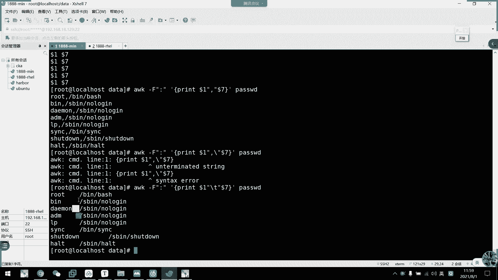
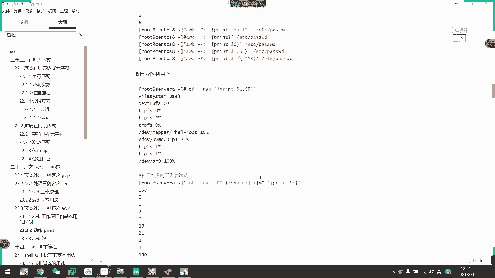
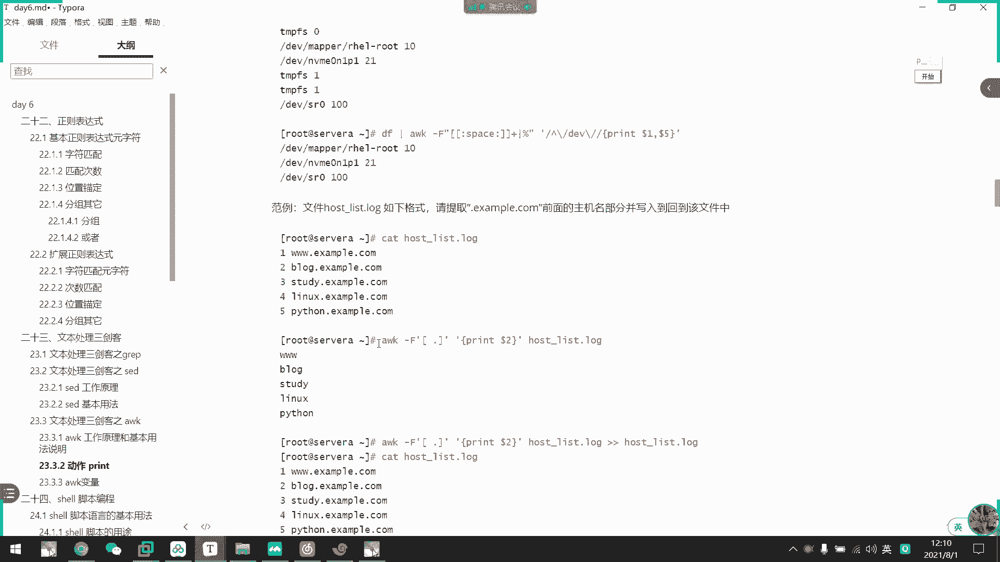

# 2021年7月新版-----RHCE8.2 RH124 RH134 RH294 认证课程 - P42：day8-2 文本三剑客之awk - bili_15701050454 - BV1Gy4y1T7ug

好，我们盖下你都不O。啊，我问上节课最后一个AWK。呃，首先我们看一下它的一个工作原理啊。先来了解一下它的版本。首先啊我们AWK有多种版本，一个是T板，一个是M码。啊，然后。但是我们采用的是G版啊。

但是呃也不需要管它，只要在Nlinux中啊，不用管它是什么版本啊，都是GAWK啊，它是完美兼用的完美兼用的。啊，然后去AWK里面呢有什么呢？呃，可以作为文本处理啊，可以作为我们输入格式化的文本报表。

也可以执行一个运算的。所以说还可以执行一个字符串的操作。它的格式啊就是我们的AWK加选项啊。啊，然后加我们的一个程序啊，program程序。啊，然后是可以用变量，然后再加文件啊。

另一种啊也可以是啊把程序写到我们文件当中用F来指定啊。然我们学AWK之前，我们要了解一下它的有呃呃多少个模块啊。啊，首先是我们的程序啊要放在单引号中啊，注意单引号中，然后呢可以由三个部分组成。

一个是开始语快啊，一个是匹配图种语环啊，就是我们用这张这张表是或者是用变相来匹配的啊，又后是结束语快。结束愉快。有了他的一个选项啊，我不选。通常是。刚符大写来分指定分割符啊，双引号指定个分割符。啊。

然后它会自动压缩，如果是连续的啊默认默呃如果不不写啊不写不写的话，它是以连续的空白符啊压缩为一个作为我们的一个分割符。然后这里是杠V，可以指定一个变量啊。可直定个变量。L后它的一个。

program的格式啊，首先是我们那个模式匹配。然后他就做什么？那他要做什么？首先是模式匹配啊，比如说be end啊正对表老师等。然后是我们那个对数据进行处理啊，中考令啊，我们采用的还是pin啊。

还是pin。这个可能啊目前还没。太大的一个。印象啊，我们等一下。做呃，写写出来以后可能会好一点点。好，那么我们看一下ABK的一个工作模式啊啊，首先它是。啊，通过我们的一个开始语语语语句。

然后交给我们的内存进行下一步分析。然后是先也是逐行处理啊，首先是读第一行。啊。通过我们输入啊，它会读取我们一行一行一行读啊。它也是含处理工具来的啊。大家要注意啊，也是焊处理工具啊。好。

然后再按照我们的a来进行处理啊，H来处理啊，以后结续呃结束啊，直接结束了。最后呢他会把它给打印出来啊，打印出来。这个三个都是在我们的一个内存空间中。呃，做做做做工做的。如果他啊。它会自带循环。

如果它没结束的话，它会就自动返回第二行、第三行、第四行这样子啊，一呃把所有行都弄弄完之后再打印结果啊。他这里有它的一个。啊，文字描述啊文字描述。大家可以客后看一下吧，其实啊也跟刚才那个差不多。哎。

后是分割符啊，分割符分隔以后呢，它可以。分成多个字段啊，然后我们字段可以用多少一多少2多少M来表示啊。多少零呢代表所有啊多少零代表所有。然后呢，这里要注意一点的是它跟我们效中的这个变量是不一样的。它。

嗯。可以把它当做是位知变量吧，可以把它当做是一个位置变量吧啊，但是你们也不知道什么叫位置变量。所以可以不当的话还是不当啊，反正这里是指第一列、第二列第三列的意思啊。然后文这里每一行都会记录一个VQ啊。

啊，如果忽略了这个，它默认会进行打印所有啊，默认打印所有。系我打应。I等一就是我们的多少页啊。然后这里可以自建分割服。自己经分个符啊，也可以是输入字符串也可以作为数数字也可以啊。

然后当建记录的一个字段啊，它会可以记录成我们的AWK的一个变量啊。啊，然后是。如果我们省略了这个艾特啊，就是多少一多啊，它也被默认变成了一个多少零啊，多少零。好，然后是固定字符。

需要用我们的双引号引起来啊，然后变量的数字不需要变量数字不需要。那我们先开看一下AWK的一个工作模式啊。啊一 w跟踪模式。

所以是我们的AWK。然后我们这里不加选项了啊，我们加programprogram直接是PIIT，对不对？然后呢啊这边是a啊 action，比如说我要打印一个hello world。这里要用。嗯。好。

然后呢他这里目前还不知道要干嘛啊，所以我们说个一可。

咗好险。

来出问题。他怎么没有替换呢？啊我们。这里呢。重过来。你就是。Print， hello， walk。简单银行。

回再说一个问题。嗯。

什么鬼？为什么？哦，我是里面字符错没有破起来。啊要打印这一个啊，然后我们不加这个啊，不加这个加这个他等待输入啊，等待输入。然后我们输个A啊。AC。12345。67。这是什么意思？啊，这什么意思？

他会把我们那个输入的函。处理成打印。

好喽。这就要处理。就跟我们刚刚这个图是一样，他在等待读取我们的一个。行啊等待读取我们那个行，然后呢把那个行进行处理啊啊把那个行进行处理。

我们我们这个处理就是打印成hello啊，所以他会把这个行打印成这个。啊，明白吗？所以我们刚刚另1个啊SEQ10SEQ什么我们可以看一下。CK是啊，就是它会打一死行出来啊，打一死行出来。然后呢。

我们加1个AWK。

他就把这个每一行，我们打呃，他它相当于是一个文本嘛，对不对？文本，然后是用十行，然后他把第一行。

进行操作，打印成这个。第二行进行操作，打印成这个。第三行进行操作，打一成这个。所以呢我们最后得出的结果就是10个hello的10个hello。啊，这是LOK的一个工作模式啊，简单的工工作模式。好，然后。

那继续往下看继续往下看。

🤧嗯，他还可以运算啊，刚刚说了，他还可以作为运算，在哪里写。呃。啊，这个啊可以执行运算，对不对？

那我就一样。改成。这应该不需要算一它，它不是字符错了啊。打你看就变成6了，得出结果得有结果。所以这个也没他的一这只是知道他一个工作模式而已。这个美他的EAWP不是这样用的。

但是我要通过这里去了解他的一个。呃。也有他的一个。工作模式啊，然后是字符状的一个设顶啊，我们这里加上一个分割符。

🎼比如说AWK。大F。用。呃，然后要做什么呢？Crent。有时他说。

看到没有？

好，然后是什么都不加，什么都不加，他就默认动了0嘛，对不对？嗯，全要打印出来啊全要打印出来。啊，然后我们这里再加一个多少斤，看一下是不是效果一样。然后我们这里用多少一。所就是地段了。几度。啊。

然后第三我这里先不讲啊啊，我们先看这个多少0啊，多少亿啊，多少亿。呃，我们这里可以看到我们这里用F指定的分割符，然后我们再看这个文件啊，文件内容是不是可以有多个分号啊，多多个冒号，多个冒号作为分割符。

那么我们就可以把它分字段嘛，对不对？啊，这里一个字段这里一个字段这里一个字段这里一个字段，然后这里一个字段，这里也是一个字段，这里也是一个字段啊，是不是可以把它分为这么多个字段啊。

然后呢它每个字段是什么呢？按照分格符分开以后呢，这里为多少一。第二个为多少2。啊，然后是34567，然后入此类推啊，34567入此类推。所以我们这里pre多少亿的话，他就打印第一个知道吗？

要它组行处理嘛？一行一行一行处理打印出来打印出来打印出来打印出来打印出来打印出来。打印出来啊。明白吗？嗯。然后比如我这里现在不打滴呀啊。是不是他我密码多了？当然这个没有啊。所以他空了两行。打人。啊。

L后是3。是啊。我先把那个删了。或这是。删掉。这里还有3点。第三段第三个字段是不是我们的。呃。UID第四个字状。啊，第四个字段是不我们的GID，然后多少个字段，1234567啊。

我们看一下第七个字段是是否我们的笑啊，对，这是我们的项目。所以我们早上那一提。

嗯。找到那一题。然后题了点。啊，真的小程序是不是AW可一做搞定了。嗯。那个还没到啊那个还没到，等一下再讲，我们先直接笑。那个要用两个分割符啊。我觉得这个笑啊，看到没有嗯。是不是？直接把这一行解有出来。

用AWK一做就可搞定了啊，我们看一下。

是把这项截出来。把这样解出来，然后直接用AWOK。大概付。然后。打印。我总是把这两个以后忘掉。多少期。啊，搞定了，这不就可以解取他的那个。呃。借他的那个笑笑程序嘛，对不对？

好，然后我们继续往下啊。然后呢，我们这里可以加修饰符啊，加指表符啊，或者是加分割符也可以的啊。比如说我们这里啊要打印第一行跟第七行。

I'错。一个T对。

不对，是这里。

啊，逗号的话呢它是不是以这个作为符号啊，这里要注意啊。转移啊转移也不行，再说。他就说我要取第一行跟第七行的意思啊，他并不是说他并不是说我作为作为分割服的。呃。如果作为分割服的话，我看看一下这样行不行。

不行。不要抢移物。这个也可以。啊，这个可以啊。我们把这个一起来啊。其实是要把这个字符作为单个字符引起来啊，因为它外面是强音嘛，所以我引起来以后，它才会自能作为字符啊。它本来是一个逗号的话呢。

它是作为呃我的字段分割的啊，字段分割的意思。那我们这里啊如果要好开一点的话，我也可以用这个哎。嗯，有。他就自己加个table。So짝个 table。

啊，这是我们的一个啊AWOK的一个基本用法啊，然后这里是取我们的一个分区利用率啊，当然它可以。要这个，但是我们一般把百分号都不要了，百百分号都不要。我们看一下怎么做啊，虽是我们DF。

别把它列出来，然后。就AWK。我们看一下有多少列啊，然后是干。这个不用车けど。啊，它默认是以空空白字符嘛，因为我们多个它会压缩成一个，所以它这里为一个洞，这里有一段，这里一个段，这里一个洞，这里一个洞。

这里也有一个洞啊，所以12345第五段啊。那我们直出来看一下。Greatreed。多少。好了。这样可以给予它的个分析利用率。但是我们一般写在规呃，写写写那个监控规则，一般都不不要这个的。啊。

也不要摆放号了，还要数据就可以了。

那我怎么搞？我们开车往下看。

我们直接这个也指定。空格摆分号。已经不是第五列了啊。看一下啊。12。34。应该还是第五遍哦，知道。嗯。哦，我知道这个不行。就。哦。在这里。六。It what you。那么就不能用这个了。只能用。

spaceace。应该。哦，好像是。要加个加啊，对，真的啊要加个加。你搬过了。打我，这里可以了，没有外分号了。没有哈他他这里会以单个。非答的是我这里要加个假，要加个假。

，让它作为多个啊多个空格为分割符。哎我这里就可以去到数据利用率。诶。然后加15。然后我们一般会把那个。

取消掉啊，那么我们就可以。要选择只有。牛逼的。那就是。第V开到。嗯。指かと？厨师。

仲到后嘛？

挂0。嗯。TEV开头，然后打印。

二说题。

哦哦哦还少了一个。关机它跟下的是一样的，跟现的是一样的。他要把模式写在两个根号里面，然后这个。我可以不要这个BV开头这可看。啊，这就可以取出我们的真正想要的东西啊，取出我们真正想要的东西。

真正的分析利用率啊是第一V的啊哇这。有100%啊，应该是光盘的，这个应该是光盘的。我看一下是不是光盘。那我就加个多了一。对不对。也还是这个光盘啊，然后这里是我们的。跟的。啊，然后这是P1的。

都做出来了啊。所以我觉得这里。这样子会不会好一点？哎，哦，不行。百分放在这里做一个风格服。DF杠TH这里要改一下。总期利用率。已经不是第五列了啊，1234。6第六6啊。可地了。这里就是说。

百分什么意思是吧？我为了不要这个版块号，我就把它多当成一个分割符。所以我现在是可以两个分割符啊，这里我一个分割符。这里有一个分化炉。这里有一个风合符，这里有一个风合服，然后版方也作为一个风合服。

然后控制也是一个轴作为一个风合符。好有。然后我现在打于第七列开下，你就知道了。Yeah，空白。所以他用作。多等一个打于第八列。啊，就是我们的这个对不对？就乖点啊，乖点。括，这个是。阔。

那你们要补一下郑策啊，真的是。首先这里是连续的空格的意思啊，这里才是一个整体啊，连续的空格。然后竖线是一个扩的意思啊，扩百分号啊，连续空个扩百分号作为一分客服啊。啊，不是做起来。啊。这个正则表达式。

这波脚本身正确表达是。嗯。space啊，你看到吗？space啊是不是正能表示啊，然后加个加号是不是这在表示啊，为什么用两个竖现在这表示里面的扩。啊，在这个表示里面的扩。对呀。昨天不是把作业都做出来吗？

这里。

不是用的扣了吗？来看下。这里啊这个不是扩了吗？

嗯。

好，然我继续啊。再往下。啊，这里就可以取消那一个分曲率用品了。然后呢。嗯，他现在要提与这一个啊，我们做一个这个这个例子啊做一个这个例子。

就到了。你用的好不好？你自己看一下吧。

来随便叫什么吧。啊，我们把这个。好。你是没理解。打你嚟个广客服。好，我们先K一下这个。

好，然后呢我们想干嘛呢啊。他要提取主机名啊，就是提取这个3W啊3W，对不对？3W。

S。那么我们现在可以这么做怎么做啊，我们直接可以。A w k 啊。干F。手机分割服。风格。或者电。呃，然后是许迪杰。全体几啲啊。多少多少多少饿吧，我的。Yio。那就。那不行啊，这个点一定要用。嗯。😊。

这个风格会有问题。看看怎么做啊。他要这个点做分割服务。然后空格做风格服，为什么刚才不行呢？这个为什么不行呢？pre的多了一，然后这里应该多少2啊，但是多少2，我这里没打印出东西呀。嗯。控的不行。呃。

如果不要他不行的。你看。都别这样子。你用space盖下。

两变空。佢以。

唉，我刚才不是空点吗？我4吗？嗯。空调不试了吗？这里啊。

为什么我是错了？嗯。为什么我是错的？

可能是吧。说你号当你号哦，我知道了哦，我知道我知道啊，是是以后的问题啊啊是以后的问题，我知道。好的我知道了，你们知道吗？那，你们知道。哪你们知道吧？诶。还是不行诶。还是不行呢。Hongb。

P多2。H。

哦，我知道。不得不的不的。不是。啊，要这样啊。不是不是，以后呃，他刚刚是作为若引用的啊啊作为弱引用的点它代表任意支符了。所以我刚刚这里。前面的这个他把一个W也作为一个符号了。也作为一列最后一列啊。

然后这里啊我刚刚忘了把中括加上了，它这里是啊空格和点都可以作为风格符啊啊，这个是真正的空格点作为风格符啊。刚刚刚刚做错了，刚才做错了。

我会说。OK然后继续往下啊。这好像他要取什么了？嗯。追加到loggo。哦。他就把这个追加追加回去，他整一个道题啊，就是要做这个东西啊，他要把前面走一部分要追加到文件当中啊，追加到文件当中。

那我们直接追加就好了。

知到。诶我企一下。嗯咁，可以追加出去啦。啊，所以这个复复个符啊，这个要注意一下。

好。接下来是我们的呃AWK的一个备量啊。AWK备量。首先。第一个变段是FS啊啊，其实也是一个分割符啊，它等于是我们该服，但是它的用途是为了在里面引用啊，为了在里面引用啊。我们看一下AWK杠V。

啊，指定分割服。是等号吧。我们好。呃。主要是。Print。多少一。要是。多了拜不。好像不用说了。就是多少期吧。然后打个出来看下。🎼9也钟说。他可以直接把我们前面的风格符作为里面的风格符打印出来啊。

啊，所以这个是盖夫做不了的东西啊，盖F做不了东西。所以例子也是一样啊。啊，可以用逗号，我们看下逗号显示出来结果是什么。

哎呀，加多少就多个空格。就嗰度喺度佢好。可能1选4。

O然后继续往下啊，还有一个。在外面先定义一个全局的变量啊。先建一个群里面，这个没有什么意义了，这个没有什么意义的。我直接复制吧，没有什么意义。

到这里把3感7啊。呀他打印出来的还是第一行跟第七行，他什么意思？首先他这里弄了个全局变量叫做呃SSS的，然后它是一个冒号啊，然后呢他把这个S的复值给我们的FS就是FS。变成冒号而已啊，说没什么意义啊。

然后后面这里。这个注意啊，刚F和有我们那个FS的个变量功能是一样的，不能同时使用啊，不能同时使用。所以这里要注意的看，这里就不用分个符合，把它追加到后面去了。把QQ押到后面去了。啊，会出问题了。

所我就不演示了。反正这两个不能同时出现啊，要是OFS啊输出啊输出我们的一个。F。其实就是让他输出出来的时候，把以以这个以这个为我们的一个风客服而已。

啊，我们看一下吧。嗯。先把这个F。不要了。啊，我现在打出来是这样子的啊。加个空格吧啊，打出来是这样子。然后我们再加一个。OFS。等于什么呢？我不用这个。需下更梯醒不行。不行啊不。呃，那个是嗯，我来充。

com on耐2。Kengyu。哦。这里然后试一下干迪行不行啊？加啲嘢可啊加啲嘢。要少一点。啊，能明白什么意思吗？这个。啊，他每定一个变量都要一个杠V啊，每第一个变量的杠V。

首先它第一个啊是FS以冒号为分割符。啊，然后我这里以我们的一个字表符为输出啊，然后是打印第一列跟第七列啊，然后所以他就就以这个打印出来的时候，是以杠T制表符为我们的一个分割符。这个意思。

好，继续往下。嗯。啊，然后最常用的是这两个啊，一个是NF。一个是N2F跟N2F呢是。

最后一列啊最后一列。

这是最后一列的意思。我们这里直接呃多少一。然后是FF。对啊。这样子是呃，不是不是。哦，弄错了弄错了。它是一个把作业链打出来一个数字啊。把它一共多少列打出来，然后我们加个do少，他就可以打赢最后一列。

最后一段不是注意力，最后一段。啊，所以它无论是哪一个字动放在最后，它都会打印出来啊啊，比如说我要打印导呃。倒数第。六列啊。到呃就到第二个到第二个字段啊，再减1A。跑起来了。啊，这是第理位知道，对不对？

还，扩起来预算。其以这个直接可以取出我们最后一段，或者是7啊，不或者是它F就可以得到我一共有多少个字段啊，一共有多少个字段。

然后它产重是什么呢？财务也不是这个。反正他这里常用还是取出最后一个字段吧。还有得到我们的一个总共的这道树啊，总共收棵树。啊，用于我们自己来分析啊分析。啊，这是FFL是NR啊NR。

可。这个怎么辨示好吧？这样吧。嗯。看一下能不能。啊的呀。NR它是可以打印我们的行号，每一行都打印出来。啊，替换出来在哪，这是R说我们NR可以怎么用呢？输可指定特定的行。那我就。变成NR。咁等于生。

要打印。我们最后一个知导。呃，第一个知道。嗯。😊，其实哦。忘记加分。有啊。我指定的啊用NR指定多少行，第三行，我看一下第三行是不是这个。你看第三就是我们demo嘛，对不对？要我们做出来答案是demo。

O。老不人啊。有了这个AWK，我们看一下。IP。最一练习取IP怎么取啊？IPAEN。一六六点。啊，AWK截取IP的一个。比较简单，或者说。这些谁AWK。然后刚才说了。取到他多少行？啊，需要他多少？

直接是NR。沙到咧。比如说我现在先直接print出来。到时不打印这一行了，对不对？啊，通过这个可以截到我们第三。啊，然后子弟分割符啊子弟分割符。然后我们要截的是这一个，那么我们就可以用空格。

还有这个做风格口，对不对？お。那就。不用不用多。这是。还有。这个。然后是第一栋啊。一二三第三段啊。Hei。分割不了。对，不能这样的。还是用。Space。加。或者。或者是我们的。这个。嗯。😊。

不多少三打不出来。没呀。每分更好。1035打印多少。10个多了。他不是十多。答えだ通り。哪有分丝多多骗我。应该肯定要生啲生行。分割问题啊。分割。怎么还是把整盘打印出来？他要是用空格分割都分隔不了。

改打你号看一下。哦，我知道了，是这里没有打印吗。真的是。

呃第三代。搞啲。啊总是拼这里忘记用单一号啊。是不简到AWK区。呃A。我看一下这里用我们的。好か。不是啊。还是要用。都也可啊。喂。搞定了是不是A可以很容易取啊。而且还比较短。

它主要还是一个它它这则主要还是用在我们的一个分割符里面。对不对？

啊，这是我们的AWK，有AWK更蓝的东西，我这里没有加。他有很还有很多很难来还可以用宿主啊什么之类的。这个有没有讲。这里已经够用了已经够用了。呃，所以还是采用单一号吧。

我这里一个座以号搞搞搞得自己那个时间都出出问题了。好了，我AWKK也讲完了啊，AWK讲完了。😊，嗯，大家有什么问题吗？啊，还有什么问题吗？就一个强引用还做引用。其实这里我说了，这是AW可以强制要求的啊。

强制要求的。呃，前面有写了前面要求看的应该是在啊这里啊。program啊同样是被放在单一号中。Program。我们那里就是program，这个就是program。嗯，这个啊这个就是普馆。啊。

所以他一般用大引号总是用的双引号，所以刚才导致错误了。在其他地方的话，那单引号跟双引号就是一步骤应用啊强应用啊。这里一定要注意啊，才优惠多应用。好，如果没什么问题，我们早团就上到这里啊。去干饭吧。

