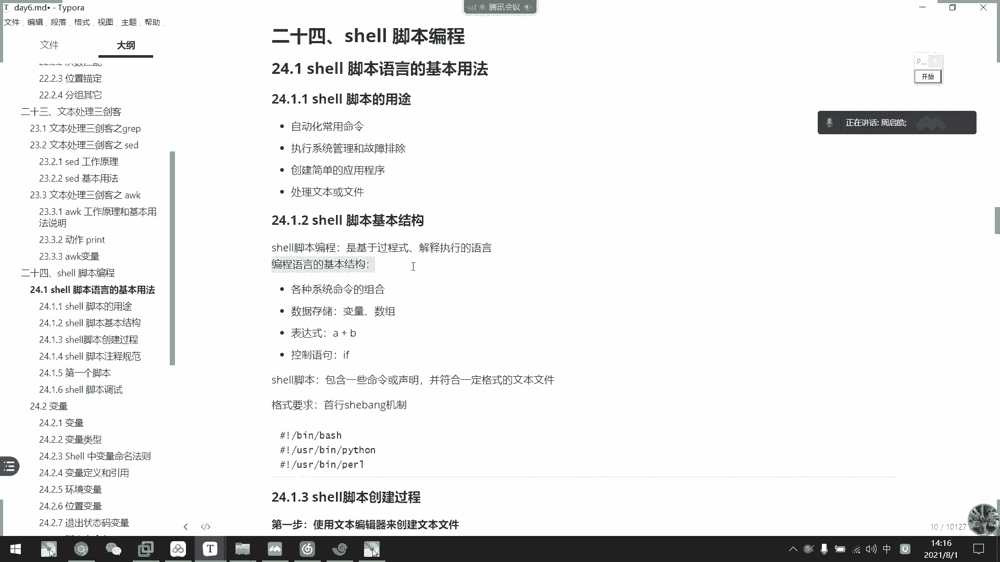
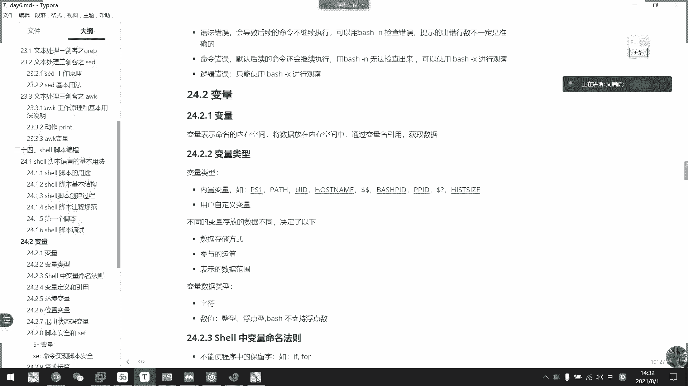
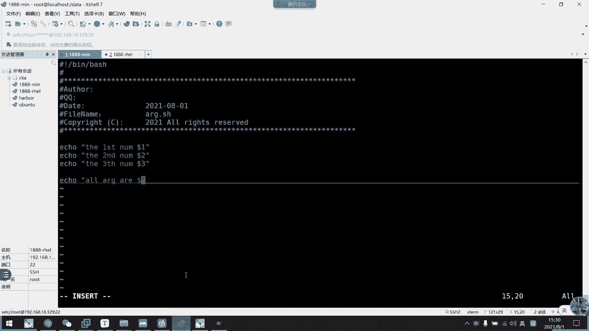
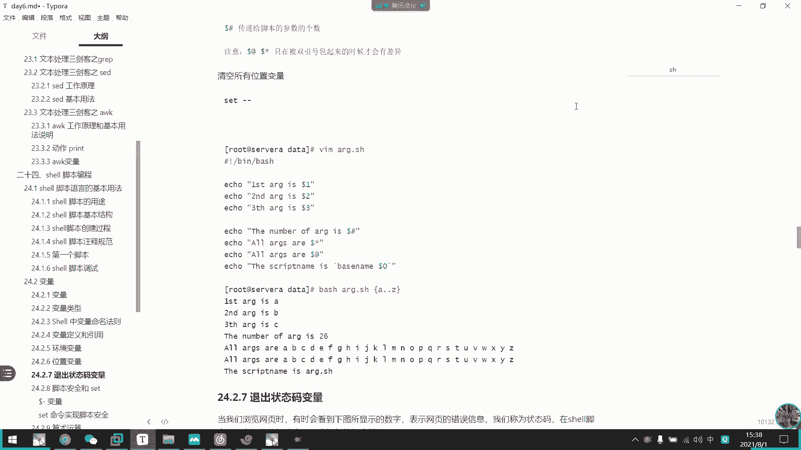
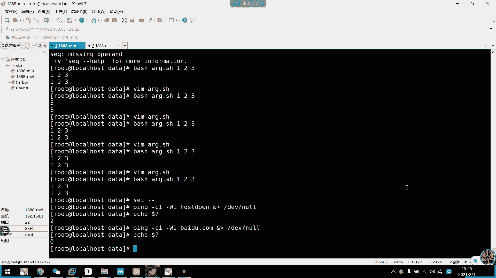

# 2021年7月新版-----RHCE8.2 RH124 RH134 RH294 认证课程 - P43：day8-3 脚本介绍和变量类型1 - bili_15701050454 - BV1Gy4y1T7ug

先回顾一下上我内啊。

好。我早上主要是两个啊。对8。表示。So。上午好，上午主要是讲的赛跟AWK啊AWK然后赛et德我们一般啊是作为含变电器啊。嗯，然后它的一个格式。sad然后加一个脚本啊。嗯。这个脚本中呢。我，想想走近。

还要加呃。我说。啊，然后是我们的fer啊，然后这个脚本呢。啊，也分为几个段啊。嗯。一个是。位置。定件。然后是他的一个。啊，匹配就是未置定界了嗯。然后是动作啊。啊，比如说我们的sad。啊，然后。交不了。

我们双一套吧。呃。然后匹配1个KR。He1一。啊，模式匹配啊，这里就是我们的一个位置定键啊，位置定键。然后动作呢可以是P。啊这是动作动作工作asction。嗯，X算。打钥匙8啊。好。

我们的一个动作呢可以是P啊。工作呢可以是P啊打印。啊，然后是I。完毕。忽略。大小写。打一。嗯，要低啊。删除。删除呃，还有什么呢？A。追加。B呃。前面。插入。是不是还有个I来着？啊屎啊。修改。嗯。

还有什么呢？嗯。看。呃，反选。啊，基本上就这些啊啊W。发了。呃，保存到。有定文件啊。啊。读。读取。文件到。嗯，打印空间。啊，基本上就这么多。啊，这是我的a你port啊。啊，是我们的一个。嗯，用。郑哲。

很多种很多种啊，一个是呃。指定函。或者是。指定。行。指定行。到。模式。K啊吧。飞机吧。啊，然后是。指定。KAT到KAT啊。啊，基本上就这些。嗯。常用。郑哲。表达式为。没是。然后是选项。这少了个选项。呃。

学校。这个选项。然后选项我们有什么呢？OBT。是实。嘴上有杠恩啊。不打印。匹配空间。对内容。嗯。杠一。嗯。指定多个。周过。不会多个脚本吧，只定多个。看你叫什么好了？这里看一下给他一个名字吧。

呃为他证明一下自己。嗯。嗯，叫什么好了，跟一啊，多点编辑啊啊，多点编辑。呃，然后是杠I。点BAK啊。也要修改。就本内由。并。被告。他说啊干啥啊使用我们的一个。呃，扩展的这个表示啊。啊或者是杠一都可以。

使用扩展。正则。不要。OK啊，基本上就这样了。啊，基本就个。放力我就不给了，好像是AWK啊，AWK。嗯。他是赣F。指定分割服。然后就是它的一个叫什么来？program。Program程序。这些。

或者 a w k。然后是obtion。O P T I O M。然后是pro。我了发了。完了不管了。又分为什么？呃。也是我们的一个。叫什么范围？位置定界。不是微业登记，这个不能叫微胁登记。嗯。叫什么好啊。

叫parttter。模式啊。模式然后加也是。来选不要这么做啊。然后是ACTL。是。Print。Ping。嗯。通常用。当你后。引起。然后。用于打印了。第应。对。Priring。TR IN G。

字符串或者是运算啊。等等。O。然后是。它的变量。变量有三种啊，一个是FS。多腐啊。Feng。和。需钥匙。杠V复制。可以啊。所有所有岗位复制啊，还有1个OFS啊。指定。输出的分割图。需要。但无异。啊。

我们有一个F。显示。最后一个字动。是。诶啊。就是。是定。其AWK基本上就这么点啊，就这么点。啊，主要还是关于这个表达式的一个应用啊，主要还是关于这个表达式的一个应用。好嘅。😊，那我们如我没什么问题的话。

就继续了。进入我们。交不得。就有我们的脚本呢。疑问的话，直接做一下翻例就可以了啊。好OK那我们进入新的。篇章啊。啊，这是我们的shop脚本编程啊。啊，首先我们来。写一个。

简单的脚本。好，谢一个简单这位。好，我们写脚本呢啊通常。文件名以SHH呃与SH结尾啊，以SH。与以点SS取为后缀名结尾的文件啊，虽然它在呃这里面是没有特定意义，但是啊用于我们自己区分啊。好。

OK然后我们第一行啊写一个叫做警探。并。然后是做什么的呢？一口hello。好，O。😊，然后呢，我们要给他一个证据学序啊moode。A一个X吧，随便吧。那么我们一个简单的脚本就写起来了。嗯。

那么我们看一下。呃，脚本。

的结构啊结构的结构。啊，首先是看一下它的用途啊。啊，脚本。啊，是我们一个自动化采用的命令啊，然后是执行系统管理或者是步骤排除。然后是创建一个简单的应用程序啊，最后还是一个处理文本或者文件啊。

都是用用用用于这样子啊，其实就是一个呃自动化运维啊，说是自动化运维吧啊。就是按照我们自己定好的。啊，定好的一些命令。顺序，然后让他执行啊。啊，达到自己想要的结果。🤧好。刚刚我们写了一个简单的脚本啊。

然后我们来看一下脚本的基本结构啊。啊，首先是我们的脚本的一个bitter啊，是基于我们的过程式啊解释解释执行的一个语言啊啊，就是一边解释一边执行的语言啊，它跟我们序语不一同啊，我们序语言是编译执啊编译。

解释解解释型编译语啊，这一边要解释一遍要编译的啊。好，然后呢编程的语言那个基本结构啊，首先是我们的各种命令的组合。

啊，比如说这样讲啊，这是一个简单的命ing啊，一口。这里并没有组合啊这里并没有组合，我们写得比较简单一点啊，并没有组合啊。然后是我们的一个数据权储变量或者数组啊啊，大家这里也没有用上啊也没有用上。

变量还没用上啊。

好，然后是我们的表达式A加B啊，当然目前还没用上啊，也还没用上。表达示。啊，最后是控制语句。这些我们都没有说啊，只有一个简单的命令啊，也没有做组合。但是呢我们后面讲完这一章，我们就知道那些表示啊。

变量的复值啊，还有控制语句的使用啊等等。好。😊，然后呢啊我们看一下那个脚本的一个。🤧其他的。可是啊比如说他要有一些命令或者是声明啊，比如说我们这里。

这个为命令，然后这个为声明啊，声明是叫做舍办机制啊啊，为什么叫舍判指制啊？因为英文啊井号舌，然后这里叹号是半啊，是半啊，所以说失半。好，然后我们这里声明他使用的是我们baba程序。啊。

有序语言用过序语源的应该都知道啊，井看，然后是哎我系语言是include点D嘛，对不对啊，inre点D或者是pyython3啊这样子啊，用个十0分7势把它给定义好。棒啊，他要是棒。啊，这个是舍啊。

这个是棒啊，所以叫舍拌机子啊。

啥意思。啊，你看啊像这个us是或sup一样。啊，都是这样子的，就是第一行啊，我们教盟的第一行都是用来声明我们使用的语言啊，声明我们使用的语言。好。要了我们创建脚本的一个推荐过程啊。啊。

所以是实明首么机制，然后添加执询权限。我们刚才已经做了啊，添加执询权限啊，在命令函上指定脚本或者是绝对或相对路径。然后是我们的一个运行脚本啊，运行脚本怎么做呢？啊，直接运行我们的背解着器啊。

有两种方式啊。

啊，一种是我们已经拥有了。我们已经拥有了执行权限，他可以。以觉对路径。执行也可以以三个路径执行。🎼你3都要进就行。嗯。还可以以我们的一个。解析器执行。啊，而且解释解约器执行的话不需要他有执行权限啊。

比如说我们现在。啊，A减个就是。好，谢谢他了啊，我这个已经没有执行权限，用消毒入径。啊，他已经执行不了了，他说啊全身被拒绝。那么我们直接用解示器啊。大家一样可以执行的啊。啊。

所以我们解解析解析器执行的话呢，啊，它可以直接执行啊，不需要加我们的执行权限。

好。啊，然后呢，我们这里有一些脚本的一个注册规范啊，首先第一行啊是我们电用使用的语言，所以就作为实放机制声明啊。啊，上份这是声明。然后呢是我们的一个程序名。可以备注一下，写了程世名。啊，就像。啊。

前面给你们给过你们的一个。啊，VIM的脚本啊，不是VIM的一个。特性啊。我们可以啊把它。

Yeah。换过嚟。

好，那我们现在。少佢啲。好，我们现在再创建一个。啊，O那么啊我们这里就可以读取到我们的程序名啊，然后这里呢可以啊在刚刚的那个VIMRC上面呢啊加入自己的一些相关信息啊啊，老师可以你这个是模板来的啊。

可以做制作修改啊，做作修改。啊，然后它可以读取我们的时间啊，可以知道我们这个到底是什么时候创建的啊一个脚本。然后是他的一个。嗯。点读信息主要还是这个啊，要知道是他只市名。啊，然后呢我们写这个呢。

也跟我们的一个建议啊建议啊还是跟我们的一个。呃，开发样啊经常写注释啊经常写注释。

啊，就主要是强调这个步骤是做什么的啊，我们注释就直接用井号就可以了。大盘注释。啊，这个应该是没有多少注射的，只有单杆注射。那当初是我也没用过，不知道有没有。啊问主主要是注册啊，比如说我这里吧。

这里是要打印。Hello。😊，对不对？那么我们就直接一个喽。就是让人家知道你这个程序到底是做了什么东西啊。

啊这里。还有一些注意点啊什么之类的啊，都要写写明白啊。啊，然后呢，如果你这个常用更新的话呢啊，最好就加啊一些更新说明啊，加一些更新说明。然后我们。的第一个脚本啊，所以是手法机制，然后是我们的一个。呃。

Reio both。Congration， valuable。Fation。differs然后是mand code主要程序。然后这里是。嗯。啊，程序的一个作用嘛，然后这里是一个函数啊。啊。

虽然这些都没关系。啊，然后我们看一下第一个脚板，其实我刚刚已经写完了啊啊，我们已经学学会写脚本了，可以下课了啊。是不是啊？啊，我们刚刚简单呃写了一个简单的脚本啊，一个基段写法也有啊，然后是刘星的写法。

也有啊，就是hello wordhello world。啊，我们学一门语言啊。每一门语言都是一样，都第一第一第一个啊基本上都是用于打E哈lo的，打hel喽的。对，等一下吧。😊。

然后执行方法刚刚已经说了啊刚已经说了啊，所以我们这里啊已经学会。学会用效了啊，已经精通了精通了啊，精通了操。然后呢。脚本啊它是一个命令的组合啊。很少说它只有一个命令啊。

所以呢我们需要有一个叫做啊调试工具啊，调试工具所谓的debug啊debug。嗯，还好我们写的校啊就不算。真正的一个开发商内程序啊啊，所以我们一般都不会被人家说，哎，你又在写bug啊是吧？好。😊。

我检测的有两个文卷，一个是杠N，一个是X啊，他们有什么用呢？我看一下啊。

我看一下，然后这里啊继续往下写啊，往下写我们的L。查3。还有是。嗯。再一口一个word吧。播了歌曲。我们保全一下，然后呢我们用bech杠N。叫testSH啊可以检测啊，然后他现在没什么显示啊。

就证明我们这个预防是正常的啊。

目前是正常的。然后呢我们看一下X啊，它会执行起来啊。

那直学。然后呢，我们脚本。他不会检测我们的命令是否正确啊，不会检查命令是否正确。啊，只会检查语法正是否正确啊，包括我们这个MS检压语法的啊。然后X呢是其语法也都啊是讲语法也会执行。

然后还有给你分布显示啊。怎么显示结果啊？那么我们看一下什么叫语法错误啊。🎼我写一个啊，比如说我在I插插这里啊，再加一行。用我们的。K。处理一下啊。EUF。啊然后写到哪里去呢？

比如说是写到我们data下的。呃。有几钟。好，然后我们写一个nine nine。2。9さ。啊，然后是结束啊，注意这里结束EOF。EOF我这里加个空格啊，加个空格。好，完上退出，当后我们ca杠A啊。

t点H去，可以看到啊，这里有个空格，对不对？这有个空格。然后呢。那我们就。再检验一次啊，我们来个bach。干M test下去啊，你看他这里就有。一个报出来，说我们。啊，可能在十九行啊可能在十9行。

然后也可能是十4行啊，其实十4行的话应该是这个啊，他说在这个程序里面，他实几上出了问题了。所以我们一般报错信息呢都是要找他一个相近的，就是他在哪个程序块里面啊，我们就要找那个程序块，它不一定是标准的啊。

他这个指指向不一定是标准的啊，我们可能要找找到那个程序块啊，可能是程序块的问题啊，包括我们后面选SS的语法检测也是一样的啊。好，那么我们。就可以看到啊，然后我们X再看一下，看到一边执行你看。对。

他说到开这里就停停停停掉了啊。啊，首以是呃一个helo可以正常随然输出，对不对？啊，LLX啊LS叉叉叉啊，也可以正常的一个执行啊，但是它有一个标准的错误输出啊，然后就到我们这里了啊。

到K这里继续不下去了啊，继续不下去了。啊，所以它语法错误是会停止的啊，语法错误是会停止的啊。那我先在执行一下看一下啊。这式执行啊败。对，他是。跑不了了逃不了。好，这就时呃ge。杠N还有杠叉这两个。

的作用只能检测语法是否有问题啊，它不能检测我们程序是否。出现了错误啊，这里要注意这一点啊。

啊，大家聚这一点啊。好，那么这里有一个总结的啊。啊，首先是啊我们脚本常见的错误有三种啊，一种是我们的语法错误啊，会导致后续的命令不不继续执行啊，对吧？对吧？我们这里啊，你看。

啊，去到K这里，后面就不再执行了，对不对啊，不再执行。好，然后呢可以用我们的besh杠N检测错误了，但是提示的错误还是不一定是准确的啊。刚刚说的它可能是它的一个程序快啊，程序快的一个错误。

然后第二个是命令错误，命令错误呢是会自行提行的啊，比如说我们刚刚的叫LK小下，它有它会自行执行啊，会继续执行。

然后呢，它会有一个标准的错误输出啊。

啊，用杠S检测不出来，我们只能用be杠X来看啊。好，然后是逻辑错误啊，逻辑错误的话只能用bechX来观察啊，这个逻辑错误呢，这边还没。讲到啊我们要讲到ifR那些才能知道我。你错我吧。啊。

我们先有个大概了解啊，有个大概优势就可以了啊啊，这就是我们的。啊，脚本调试啊脚本调试。那么接下来就是我们那个。关于变量的认识了啊关于变量的认识。好，首先是什么叫变量啊？变量就是表示我们那个命名。

的一个内存空间将速入存放进内存空间中，通过变量名来引用。会模非常引用，然后扩取数据啊，什么意思？

就是说。变量。啊，不是一个定制啊不是一个定制，它是可变的它是可变的。然后呢。是通过我们人为复值啊，复制给我们的一个呃你确，比如说早上的一个S等于。马号。Yeah。啊，我们就把这个冒号存放在联源空间中啊。

然后把它复制给我们S啊。然后要调用的话呢啊我们可以这样子。一口。调用啊，直接do加变量名称。这不打出来吗？啊，这就是所谓的移种啊，为什么说它变量呢？我现在重新复制S等于一。哎，我再一口。它又变成一啊。

这个叫变量啊，是可变的是可变的。

好。啊，然后我们变量类型有两种啊两种啊，一种是我们的内置变量。怎么了？你寄哪里了？嗯，你进哪里啊？怎么可能。我都没有这样啊。你是不是做了什么其他奇奇怪怪的东西？

啊，我们是刚完全没有转换啊。啊。哦，你就直接按了一个不锈钢啊。我还没进去过，不用啊，说一下。呃，be就好。啊，说一下被诉求。ESC也可以啊，ESD不行，修改是吧。诶。切不过去呢。OK可以出去了。

可能你也是退出啊，为什么X不行呢？肯乐迪其实是个推出众包嘛。

啲哎呀，这推有众多啊。前面我们第一章的时候讲过啊，它那个ctrl地还有可用C的一个指标。好，然后我们继续啊啊，变量的类型有两种啊，一个是内置变量，还有一个用户机的页面啊。像我们刚才的那个S啊。

像我们刚才那个S。

好，现在已经没有了，那个变态器没有了。呃，重新来啊，等于一啊，这个就是我们用户的一个自定义变量啊，自定义变量我们自定义变量呢一般不要用我们系统关键字啊，还有内置变量的名称啊。

啊，明白吗？我们等一下再讲那个，然后是那个变量，我有有什么呢？有我们的一个PSE啊pa啊UID啊ho link啊啊ba IDD啊啊两个两个dora，然后多少问号啊啊。

然后是his size啊PPID等等啊，这些都是我们一个类似变量来的啊。啊，所以我前面我们接触过了啊，是这些都接触过了，对不对？

我们可以看一下A口。多了多了。回来一次吧。这是应该是当前的BID，我们看下是不是。一个。多少。Flash。第笔。就当前的PID嘛，当前我们的be的PID嘛，对不对？

不说多了。好，然后我们自定V刚刚已经说过了。好，然后呢不同的数据存放的一个数据不同决定的下面的一些。🤧嗯。啊，比如是我们这个数据存储的方式啊，参与的运算啊，或者是表示数据的范围啊。

然后呃我们一个变量的一个数据类型，有字负型，还有数字型啊，它跟。开发语言不一样，它不支提我呃，不支持f的5点数啊。啊，不只是 fruit的素。啊，它只是浮点型，但是不支持浮点数啊。或者行呃或者行的话。

它就只是是小数啊。然后整芯的话就是int嘛，大家都知道。就整数吗？啊，还可以支持我们的制服就骏嘛。好。然后呢，我们的一个命名法则刚刚说了啊，不能使用保留字和关键字啊，比如我们的if four啊。

或者是一些类似变量等等啊。然后我们命名的话呢一般是使用数字字母下划线啊，其实加起来就是一个单词啊，就这个单词，但是不能以数字开头的，不能呃以数字开头，然后呢不能使用短航线啊不能用横杠啊。

跟我们主机屏相反，前面说过了，主机屏是不支持下划线的啊，然后变量是不支持横杠啊，两个相反。然后我们定义变量名的话，最好就键名字一啊，键名字一。啊，就尽量用当词英文拼写啊，不要用拼音啊，那样很low啊。

不要用拼音啊这很low。啊，然后是并体现出实际的作用啊，不要接写，有我们的ATM啊。好，命名规则啊可以用大头风法或者是小头风法啊。做公寓吧，就所谓投公寓吧啊，我们叫student，然后。

令啊两个单词首字母大写，叫个大头风，小头风的话就前面是小写啊，第一个单词小写，第一个单词的首字母大写啊，就是小头风啊，或者是统一用大写啊，统一用大写也可以啊。啊，如果是局部变量，尽量要小写啊。

然后函数名也是小写啊。什么叫局部变量？局部变量？就是说呃我终于可能就中于这一个脚本啊之类的啊，或者说。嗯。话说我用完就退出那些用消息没没所谓啊，没所谓。啊，只做住于氛围就在这里啊，像我刚刚。

呃。这些也是局部的啊也是局部的，它只是捉于我的效啊，如果是在直校，它已经不行了。比如说我现在开一个新的ba，然后我们啊一口一下。PS去看一下吧。PST啊杠P。啊，我们可以看到呃。

目前我刚刚是从2437嘛，然后当前这个应该是274，我们看下是不是啥。多少啊blash。PID等一下我我们在2474。然后呢，我们在2437那里定义了一个叫S的变量，对不对？让我们看一下这里有没有。

你看这不是这就不是全局的啊。一般所谓的全局啊，我们一般的较为它是一个环境面量啊。啊，不是不是不是不是不是不就。😊，啊，全球变量都是啊全职可用的，就是说我切切过来的话，他都可以。比如。

比如说业务啊呃那个也叫环环境变量，我没记错了话啊，也叫环境变量。啊，对啊 예전번未啊。只是说我们的pa也是一个环境变量啊，只是我们的PSE也是环境变量UID这这些也也也是一个环境变量来的啊。啊，不对。

不对不对不对不对啊，这是类是面料啊，pas的话是环金面料。环面呢我们等于可以看啊，等一下讲到环境面上再看吧啊。然后我们负职啊，刚刚已经是做是一个建设对嘛啊，所以是我们的G肋啊，等于我们的re啊。啊。

剑子队啊剑子队KM等个。好。然后呢，我们可以。呃，那个viro可以是多种形式啊，一种是我们直接。呃，用字符串啊，又是我们的变量引用。啊。然后最后一种是我们的命令引用啊。

那我们来看一下啊啊，比如说我现在定义一个内啊，等于。谢学有。那我们现在一口出来多少内？是HO对不对？好，然后我们来个内。一等于腾科。啊，不得不用不。另一等于我们的。多ra令。

多少类啊，是不是我们呃第二种啊非常复制啊，非常引用啊非常引用。

好，那么我们现在一口那。一还有link啊，都是HO对不对？嗯，你们李欣他们之间的关系了没有？有没有理清他们之间的关系？啊，就是说我这个HO复值给了那个。然后呢啊我多了。就把引用了这一个值了，对不对？

因为这个变量要复制给他啊，复制给他，所以他们是一样的。那么同学们，我问一下，name等于乘克。啊，认得嘅同哥。那么我现在一口令。啊，一个多月内。啊，是同个对不对？那么我现在一口多了另一啊，是什么呢？嗯。

是什么了？而且有。本科。腾哥。呃，自己你为什么会想的是HU啊？😊，啊，CHAO啊CHO。

为什么呢？哦，K我们看一下他们之间的关系啊。哎呀。我们看一下他们之间的关系。嗯。啊，所以就。为什么他会是HA而不是腾科呢？好。诶这还有个技续。我们先跨一下，首先这个是我们的内。啊，这是我们的内。然后呃。

这个是我们的。我想想那个逻辑都怎么化了。那。啊，然后这个是。请求。啊，所以是我们的HO复制给他，对不对？然后呢。我们的类再负责给他。啊，第一次我们。就是啊令。呃，内为HO了啊，认为HO。然后第二次。

这个坦克。啊，我们腾科。负责给了他。啊。但是这里要注意了啊当然这里要注意了啊，第二次我并不会复制啊并不会复制，为什么呢？因为它是一个备常引用，其实它中间只是一个多类。多令。啊。

这个步骤出来啊这个步骤出来，其实是一个。多了。多了命。裤子。明白了。然后哆啦A类是怎么来的？是从这里来的？对不对？能不能理解这个逻辑？有冇你意见。所以他第二次他没有再重新复制。啊，已经是没关系的人了啊。

已经是没关系的人啊，你可以这样想啊，你可以这样想，把它当成是。

呢个系诶。嗯。可以这样想啊，就多了那。对不对？然后再多要练。负责给我们的。哪一个。对不对？可以把它想象成是一个重景下。本来想象说是一个处理侠。其实就是我。多拉令复制的时候。

它可以把它当成是e颗哆拉令打出来的东西啊，e颗多拉令打出来的东西。然后再。重地上。嗯。就他一个表尔输出作为我们的另一个表输入啊。这样能理解吧？啊，其实我要的是HA的值啊，并不是说他坦克啊，他他重新复制。

我就我就我就会改变啊，并不是的，他们类的空间中不是这样子的啊。

希望大家能明白，其实他最后是这样子的，最后是这样子，也是HAO。这个是HO。复制给了我们的密。他最后是这样子的。背后逻辑是这样子啊，其实也没有跟经过我们的那个，只是他读取了这个值而已，读取了这个值而已。

希望你们能理解啊。按错了。对。

啊，第三种就是命令的引用啊。我们前面说了啊，命令可以用反反云啊，也可以用我们的多lo。小括号啊，多是小括号。

帮我看一下。呃，比如说我这边弄一个。后。问1个IP吧。啊那个IP等于我的什么呢？Post the link。隔佢啊。然后我们一口。ID。呃。这不就可以把我们的IP都读出来吗？怎么有那么多网卡。

怎么有那么多地址呢？我睇有个独年。还有一个T啊，难怪。俺了不管。啊，正常就读这个嘛啊反正我现在现在三个读出来也没所谓啊啊，他就是有。三个字啊三个字。

ok。啊，那么啊还有用我们的一个多了括号啊。

🎼比如说我现在做什么了。嗯。呃。那啲不行。一干 you。啊 이家钟。所以我PID已经是类似变量了，对不对？我们看一下是不是。一口。PD。啊，啊，目前没有这个，那我就创建1个PID等于。海啲甘肉。系继肉。

那么我们这在一口。那 p i d 。那不是直接起来了吗？把预算的结果存放到我们的。好吧，把运行的结果啊存放在我们的编量当中啊，就用这个啊，或者是我们的一个do括号。多少小括号啊。

我记得这两个的回去看一下第一天的视频啊，改一下第一天的笔记啊。

嗯。那么我们现在先休息一会吧啊，现在15分钟吧。好，我们来继续这改。然后呢，我们刚刚说了一个变量的负值啊，变量负值。然后呢，变量引用这边就不多说了啊，其实就是呃两种方式啊，一个是直接一个dora啊。

一个是加括括号啊，夸括号。我们来看一下嗯。嗯。😊。

eco。多少。PID或者是多少。那个跑不。联样方式都可以啊。你不要说夸括号，这个很麻烦啊。有一些特定情况下，我们是要用到夸括号的。啊，我们稍后就会讲到有一个用到夸括号。

我们讲到位置变量的时候就要用到夸括号啊。

我们继续先往下啊啊，首先是。变量的一个强引用和弱引用啊，我们说过了，早上啊讲wind档的时候已经说过了，它一个用双引号引住是一个弱引用啊，它依然会可以。显示变量值。然后呢，如果用的单引号是强银啊。

然后它每一个字符都作呃作为一个字单个字符，然后形成一个字符串啊啊会保持原有的字符串。然后这些有个方你自己回去看一下。要不看一下。啊，什么抬头啊，然后。啊，这是一个变量引用之类的。嗯，双引号单引号啊。

然后这里是。变量的负值。重复复制啊。然后是啊我们一个 link。

这个时候反过来了。我看一下。一口。啊是说类似类似变量来的吧。都是。

它是类似变量来的，类似变量。啊，然后也可以通过贵安来给他。呃，重新复责也可以啊。然后这是啊我们命令复制啊，通过命令复制。把命令的结果复制到里面去啊，但是要注意一点啊，你看这里直接输出。

它就按照我们的12345678910这样子打横一个一个参数把它给。列出来。啊，然后是如果加了双引号了，他就会按照我们命令行输出来输出啊。啊，然后他还可以是。都含复制啊，只要我们这里没结束，他都可以啊。

我们可以看一下啊呃类啊等于比如说啊我这边叫腾科。要规车啊，继续复制啊，1888。好后是HC。SO还要 just。到一后结束。让我们。看一下用。这样子就会把竖向竖向输出啊，然后如果不加双引号呢。

啊，就会横向输出啊横向输。た。嗯。间天复值刚才已经说过了，这些复值的一个关系啊，刚才已经说过了。好，然后是。利用命令实现一个呃利利用被带的实现一个动态命令啊。

他可以。把我们存啊把一个命令存到里面去啊。CND。啊，比如说呃就些你 command。等于他要做什么啊，比如说我们的一个。ホト。令。我们用音号引起来，因为它有空格。那我们直接一个多限定啊。

那他就会啊冲单是一个命令执行起来了啊，充当是一个命令执行起来。啊，我过这个可能很少用了，我们一般都是用函数啊。

好，OK然后呢呃用set命令呢可以查看到我们定义的所有的变量啊。我们看一下set。

说的别亮。都喺这里。呃，比如我们像刚才第一的。不是这。嗯，这些都是内置备量，已经是钉在这里了。还有PS1啊PS2啊什么的。嗯， p w d。呃啊就这个啊令音啊，然后我们刚刚那啊。我们刚刚的那个令啊。呃。

先低。CND在哪里。啊，先定啊，你看这是我们自己定的啊，然后这些是系统已经定定好的。虽然它显示这里，其实它也是可以被替Y的啊，因为它是利用我们的一个开机启动的一些脚本来复制的啊，然后这些是函数啊。

这些是函数。

啊用到我们的AWK的笔记模块，还有and模块。

好，然后呢呃上周变量我们用NC就可以了。比如说啊我们刚刚不是有一个。

任一吗？那你也在这里啊。在另一在这里，那我们现在取消它啊，就嗯 sad。表示那一。不用再多了啊，注意啊不要用再多了。然后我们再看一下s。啊，你看那个内衣已经没有了，那衣已经没有了。嗯。啊，另个在这里啊。

另一经没有了。

🤧咳。啊，然后这边的话呢有一个脚本啊，是用于我们显示一个系统信息的脚本啊。大家可以。玩一下。我记得这里好像有问题啊。不记得是不是啊，我记得这里好像有问题，看一下。啊，不是这里应该是这个位置。

我这里用的AND steam啊，你们可以改一下这个位置。我们看一下LCCPU。

啊，这个位置出问题了。嗯。先不截取。嗯，是model link model link。要是CPU和指数。啊，其实就不要前面那一段而已。不起回来了，所以我们这里出问题了啊，怎么搞的？啊，我们出问题怎么搞。

怎么怎么才能取到后面后面的值？我取这一多。想想我们用这个表示啊，用gra来截取后面这一道。前面那一段不一样啊前面那一段不一样。数佢有救衣啊。刚然后还是募多那个。不对吧。不对。那忘了怎么结了这个。

我觉得 grape是可以的。啊，你们。也搞一下这个咯。我开一下吧。怎么可才可以解到后面那一波呢？用回跑像不行用 set吧。

或者使用AWK吧。AWK。然后是。用我们的。是。好像也不行哦。因为他。果用空格做风割图的话，这些都没有了啊，这些都没有。So was said的。在的。嗯。这一块是什么来着？排出他的他档模式。分组。

啊分做。退这。就在这里用。AL。PHA吧。是不是所有大家减字母。家然是。被以。讲。然后这里扩起来啊。嗯，然后还是。谢决。可家。对对不对？多少2。嗯，用猫好。不行不行，他最后结果还有一些空格在前面啊。

这个不行。行。对。没异议。你。多了个令啊，这里。哦，我知道。那我们就直接啊就一个冒号，对不对啊，有一个冒号就好办了。有个。不要这里。典心。搞定。还有这个啊。你们试一下行不行？我试一下。

其实我现在已经不需要这个mod录人也可以了。我们直接把这个modle令。直接改成brare。把它复制过来吧。做一个定界。啊，是是。我也不都审了。我们试一下啊，如果是英特尔CPU的试一下行不行？嗯。

有没有同学敲一下。如果这AND的话，可能。跟我刚才那个有点冲突啊。那个只能用于。AD的。如我觉得这里写的的附加可以改一下。这可以改成是。A到Z，然后是A到Z。啊，这以可以。啊，又用的这个表示对不对？

这表示很好用的。也不说太复杂。再填写的话，这里改成是。啊。志有你那个电脑是什么CPU的？啊，你写一下给我可以不？啊，大家都写一下。我这改了，然后你们。

对着敲一下啊。对，小一下。所以改。直接敲这个脚本啊，你们写一个脚本啊，把这个脚本写出来。啊，呢嘢 a n d 啊哦，啲嘢系 a n d 。把这个交给写一下啊，把这个交给写一下。

把那个运行结果啊发到群上啊。法院结果发到群上。这边不方便。我不想在这里登录微信吗？So。嗯。好，大家回去看一下这个脚板啊，回去好好看一下这个脚板好好研究一下。好，然后呢。我们刚刚说完了一个制定变量。

然后我们看一下环境变量啊，环境变量，什么叫环境变量呢啊？它指禁层还有数性层都可以继承负近层的一个变量啊，但是无法让附金层使用我们那个指金层的变量。然后一旦指禁层修改了附形层的一个变量啊，会。

将会新的值传列给我们设进行。然后呢，一般在我们的一个系统配置文件中使用啊，在脚本中很少使用啊。啊，这我就会常使用。那我们怎么定义呢？啊，用export或者是deeclar杠X啊，deecre x。

来来定义啊，我们来看一下啊，我们来定一下。反正两步都也分开也可以啊，两步分开也可以啊。

好，我们来看一下啊呃。我们先看一下两步分开。呃，比如说。问你啊多少钱啊，比如说我这里有。

1000块啊，作为我们的一个。

8。

好，我们。🎼作为父亲啊，有1000块钱啊，遗产啊，100000万遗产吧，或者1000块钱啊，1000万遗产。好，然后呢，我传给了下一代啊，我们先看一下当前的beID啊。呃。

嗯。

后PID。啊，是2474，对不对？然后我们现在开一个新的进程啊。

啊，看有新的历程，然后我们再一口一下。

啊，是2557，对不对？257，然后我们看一下PS7杠P。

啊，你看257是不是我们2474的紫金层啊，是我们2474啊。哎呦啊这里还有一个啊。啊，273更好吧，那样都更好啊，让我看一下这个2557有没有集成到我们的那个附近城的一个变量啊，我们来一口一下。多了。

问你。我以千0块对不对？啊，我10块。那么啊我这个257没有花掉任何一块呃一分钱啊，没有花掉任何一分钱。然后我再传给下一代啊，再传给下一代。然后我们再看一下PS。那么我当前啊是在这个2575这个进程的。

对不对？我们看看是不是。Flash P ID。啊，对我们在2575，然后呢。我们来看一下。257传下来有多少啊？传下来的啊，我们一口。说呢问你。啊还是1000。那么我们在这一代2575这边夸掉了。

200块钱。修改mon里。等于800。好，那么我们现在传给下一代了啊。再送给下一代。Fish。然后看一下啊HPID。啊，现在是2594了，对不对？2594来，我们一口一下啊，哆了梦你。有。

那就真的存了800块钱下来了，存了800块钱下来。那么我们看一下。那我们看一下啊，到目前为止。他这个啊人牙是可用啊，对不对？啊，这个变量是原量可用的啊音量可用的啊，那么我们来。回到上一个技能啊。

现要退出了，看到没有？退出。啊，那么同学们，我们现在这里是多少呢？好，我们刚改成800了，那么现在吃多少了？好，我们回到附近城了啊，现在是在呃。2575了啊，现在是2575。那么我们现在手上有多少钱？

啊，在575手剩下多少钱呢？啊，同学们。拜拜。啊，1000万对，那不是1000块啊啊，是800啊，因为这800块是是我这边花的啊，这边是我这边花的，然后我再退。再退，那么我一退就会回到2557。

对不对啊，我们回到257。嗯。好，回到2557。那么我们现在有多少？啊。我这有多少？啊以前。啊，对啊，是以000嗯。一0的都对啊，八00的不对啊啊，因为我们啊200块钱是在我们的2575上面花的啊。

我们现在在2554啊，我啊啊在257啊，我们看一下是不是。一口豆肉。Flash。我在257啊，然后这个。200块是在我们的2575上面花掉的啊，然后他传给下一代了还是800。回到上面啊，就不是了啊。

就回到我这里手上啊，还是在这手上的话，还是1000啊，还是1000。那么再回到这里啊，我们现在回到202474啊。这里啊我就不强调了啊，他应该还是100，对不对？他应该还是一些，对不对？啊。

还是1000。那么我们再退。退到他的复籍者。这附进程啊，是我们的2437的啊，2437。那么我们来看一下一口模。是多少啊，你们说。多少。Wu。好，好。大家都跟得上啊大家都跟得上啊。

因为我们这个呃环境变量是在我们的二次提示上面定义的啊，所以它这个变量跟我们的附近程一点关系都没有啊。但跟这个对啊，没有这个变量，不是这个函数啊，没有这个变量，所以它它只为空啊，是一个空值。

OK啊大家都跟得上很好很好。😊，好，那么嗯。我们定义了环节变量以后呢。啊，第一个环节变论以后呢，它这里啊可以通过这些。

命令去查看我们的所有的环境变量，比如说继续弄一个命令出来啊。呃，也是破的。或者是用discript。し。听楚了吗？第意啊 be亏了。刚才个。他跟expo是一样的。第一个变量就做mon拟。

等于100啊1000吧，还是1000吧。啊正我在一口也下这个门铃。所以先对吧？那么我们可以通过export。啊，而且是我们所有的。反닙没了。啊，所有的同学们啊，这里就有一个啊，我们刚才定义的模拟啊。

然后是他的一个passpen啊。P俾。啊，比如PWD之类的啊。嗯。然后呢，我们现在啊还用EMV看一下啊，也是一样的啊，还有一个deeccra。看下可行啊，也能看到啊，最后还有一个什么PP什么管理。

Print。Y we啊。也可以打印出我们的环境面啊。

就这些。

啊，就这些。然后呢，它一样可以un set啊，直接取消掉啊，我们用un set。啊，门里。好，那我们再看一下，已经没有了。对吧已经没有了。听见没有？啊，我们往上看啊，这里。阴阳还有带不不热的。再聊聊啊。

这里啊原来是有的嘛，现在已经没有了。谢谢你没有，对不对？这里。诶。不对，然后这里啊这里开始已经没有了，对不对？啊，已经没有了。好N set啊，他可以把这个环境变量都取消。

好，那么我们讲完一些啊关于自定义的变量，还有。呃，类似变量，还有一些环境变量。那么我们再看一下啊一些新的概念啊，叫做环境变量环境变量。啊，不是不是。就个位置被了啊这个位置被了啊。😊，然后我这边的呢啊。

它是相当于是把我们的参数位置传给我们的。变量啊，我们来看一下。我们看一下啊，有多少一多少2呃多少M，然后是多少零呢，代表我们的命令本身啊包括路径啊，然后是多少星啊，多少新跟多少都是一样的啊。

多少新多少它打印出来的东西都是一样的啊，是传递给脚本所有参数啊，就是显示把把所有把所有的。参数都显示出来，然后呢整合为一个字符串，然后。艾的是每一个参数作为独立的字母串啊，独立的字母串。好。

我们来看一下。呃。就用这个例子就可以了呃。

我手写吧VVR。然后我想看一下。我这里有改了啊，你看P标D这个环境变的会跟着改。啊，O不管他。呃，主要是我们写1个AR去点SH。可。表是一口。的。First。啊ESP了啊。Number。是我们的多尔亿。

一口。都。Second。这可能是异地啊。Second。ND啊ND。那umb么是我们的多少2。然后是。依个。的。第3个number。无论我们多少3。好，我们先写这么几个啊，那么我们现在执行。啊。

然后我们加个参数。看到没有？一。他就代入了多少亿啊，一就代入了多少亿，然后后面两个没有复值。为空，然后现在加一个2你看。第二个就复制了。2。呃，要注意啊，他这个跟这个数字无关啊。

它是跟顺序有关跟顺序有关，然后再写个四啊，你看。跟跟位置有关，这所以这个位置变凉了。啊，插数位置它排第三，所以它是多了3啊。排第一，所以它是多少一啊，排第二所以它是多少2。O。然后继续写啊。一口。哦。

ARG。啊。多然。说什么好了。哆了M。

多啦啊哆啦 a 唔哆啦 睇多啦仙啊哆啦 a 啊。

多了心。主要是一口。哦。多了。我这个。嗯，123。诶。傻了傻了傻了。傻了。question。看到没。一二三。好，那，我们继续啊。呃。嗯。A亚居。我拥有。用多少口贝。多了几个。不ラチ。个ARG啊。呃。

多少个参数啊？我。这保证不了。在资金。一共3个，对不对？啊，还有呃，我我有三个啊，我有三个参数。啊，然后这里把参数打印出来了，把打印出来了。🎼好，继着写。那么我们再看啊一口。嗯。多少里卡。嗯。

等我绑证不了，每次都这样。哦，我知道了。他每次都写了三个文件。还好没吧这个啊，知行。You know。他就把这个给显示出来了，哎，它不是应该显示全路径才对啊。

年啊。包括路径吗？我对。嗯。算了他没有路径就没有路径吧。

到时候我们最好还是像。在这里啊给他一个base内板啊。再最前一遍。对不对？到目前为止能理解吗？对。到目前为止，理解不？同志么。到目前为止，这里能掌握不？啊，能不能掌握啊？Mmhm。😊，没有人回应吗？

可他么这个。啊，没问题是吧，其他同学呢？其他同学有没有问题？啊，证人。自杰。有没有问题？还行。😊，还行是吧？啊，没问题。OO那我们继续啊。继续。那么。🎼我们这里啊还是单位数的，然后我们现在一口啊。的。

第11个number。是。多少C1。那么我现在给他11个参数啊。我们直接A到EZ吧。好吧。那么第11个是不是Z啊啊，是JSK啊。我们看一下。看一下会不会有问题啊。回出。啊，你睇。

有没有问题有没有发现问题？啊，有没有发现问题？啊，对啊，观察力甚好啊。🎼就是这里啊出现了个AE。那么这里怎么解决呢？啊，这里就要用到我们的括括号了。火起来。啊，其实我们刚才都可以观察到颜色。我们看一下。

4K啊。你是一个。那么我们总结。总结一下。啊，什么时候这个在这个范围内，什么时候要用画括号括起来啊。啊，你们总结一下什么时候要用画框画起画起来。我这里再加一个。啊，同学们。对啊，两位数以上啊。

🎼其实可以刮察到这里颜色不一样，对不对？好，没错啊，就是两位数以上啊。不能。

不可以啊不可以。我们变电已用只有两种方式啊，一个是直接。door link啊，然后是多括括号 link啊，没有其他方式啊没有其他方式。千万不要乱来啊。不同的话有不同的方式啊。

让我们来观察一下他这个所谓的呃一个字符串，还有独立字符串是什么意思啊。

嗯。这个是一个字不算，对不对？我们这里就要123。123。住诶。我这个不要了。看下他们去练区别。

啊，这个是作为一个是播说，对不对？啊，作为一个直播商。

我是新的，对不对？4心是作为一个字符创。那么我们可以这样子。Bash。AR g。给个社取。传给我们的一个。嗯。哦阿影吧。不行。传过来的值。我觉得 s e q 啊点。直接是不行啊，直接不行。那我们看一下。

把它改一下。用我们都按。收到了有。哦，刚刚好。刚刚是没有值啊。喂。存不了。那很难搞啊，这样子存不了。

我看下这里有个翻例。也没有翻面。很能给你们看清他的一个意义是什么东西。

传不了。哦，有办法。呃，比如说。我这里还是。123对不对？啊，现在是单个的啊，我们用否。ID。执行。然后是。到。嗯绿色还吧。就是哎。然后是。开始。多了哎。掉下热诶做好熟。语法错误。哦，杜啊这些档啊。

我们看一下呃。我们的啊随用跳了。跳我的EDC pass。你看我这边就可以创建1个123，对不对啊，电使123的用户啊。那么我们现在改一下啊。把这个ARG改成我们的。多少。什么来着？

多啦。多师嘛多师。

多了星啊对多了星。🎼，它是做为一个字母装，对不对？让我们继续看fre。看一下。嗯。😊，他不是整一个字不错吗？哦，他货区分不开来呀，货区分不开来。那就麻烦了。因为他就算一个字母的话传过来，它有空格。

它读取出来也是按顺序读取的。还这有读取。嗯。怎么办呢？怎么办呢怎么办呢怎。看一下这样子行不行。看一下这子行不行。嗯。啊，不对。아不得不得。不行，哎，要写到里面去才行。嗯。我要把它复制给我们的一个。

大家这样行不行？看这个兄弟。没区别。我们现在是哆拉星对吧？那我们现在改成哆啦。也不道多少钱。哆啦A特。还是没区别啊，那没办法，我。找不到案地。我找不到案例。我找不到案例。啊。

🎼他他把它传输过去过来还是一样啊。我们正常这样子打印出来，如果它是一个字母胸的话，他它会有一个是打数的嘛，对不对？打游波会打输的吗？我实在是找不到案例了。

反馈的结果是一样，但是它一个是作为单单一字符串，一个是作为我们的一个独立字符串啊。我找不到安妮来区分他们的。好惨啊。是吧这个知道就可以啊，这个知道就可以。哎呃，他们在被双引号包起来。到时候才会有差异啊。

那我有双引号啊。我说银行，对不对？我有说银行。要不这样子。是我的问题吗？还没有问题啊，这里。要是。Yes。

不行。区分不了啊区分不了，那不管了。他反馈出来就打印出来，你觉得是一样，但是实际上它是一个整合的啊，一个是独立的啊，这里要注意啊，这里要注意。She。那么我这一个清除所有的位置变量。

我们直接卸盖干就可以了。

啊，这想看啊，那就没有了。

好，O。好，这是我的位置边啊。不管他了。好，然后呢啊这是我们昨天说的一个退货状态码，就我们的一个多罗文号，多罗文号它值是1到255啊啊，不啊，0到255啊，一共256个数字啊。然后呢，他。代表的值。啊。

只有零为执行，反馈结果为真啊，然后是非零。全都为甲，零打标成功啊，非零代表失败啊。好，我们来看一下，通常它用于什么呢？就我们来呃作为一些数字反馈啊啊就是。

反馈嗯，比如说我这个拼一下这个。啊，拼一次。啊 이 있어。怎么那么久了？啊，还没通啊，因为他还没通。因为我这里根本不存在这个呃host down嘛，是不是不存在这个主题嘛。好，可以了。

然我们来可以看一下这个反馈的结果，多软问号。好呀，他是二他是2。然后如给我们拼一个正常的值。啊，比如说我这里经。百度。对是的。啊，马上可以。那我们是不是可以用这个用于测试网络，对不对？厕吗。

后面我们讲到if服的时候了啊，什么价个条件，什么if这个多少零等于零啊啊，然后要做什么，对不对？

就证明那个网络是通的，然后我要做什么，对不对？O。呃，然后呢是我们这个特殊码啊，特殊码。因为呢有时候他这个。呃，运行结果。不这样，然后。他退出来的一个。状态码不是我想要的啊。

那么我们就可以用is and这个去定义我们的一个状态码。

啊，比如说我们刚刚这个脚本啊，我们刚刚这个脚本。🎼啊，它正正常执行起来啊，我们看一下beash。杠呃但我们的ARG等下先选啊一。3。好像我问一口。多了我靠。哎呀，他是正常的，对不对？但是我。

让它退出的时候啊，为一些错误结束啊，我们可以定义啊EXIT比如说我这里定一个一啊。我看一下啊。好，然后我们再一口多少问道。

他就俾你一啊，还俾你。

啊，这是我们一个退出状代码啊，退出状代码。呃，然后呢，他只要遇到ea这个命令它就会终止啊，脚本就会终止，不会继续往下延。呃，不会继续往下去。执行啊，然后。

我们多少0啊多少问号反馈的就是我们eat定义的值啊。啊，如果没没没给我们这个脚本定义指定的退回状态码呢，那么整个脚本的退回状态码会取决于我们执行的最后一条命令的状态码，这是什么意思呢？啊，这是什么意思？

我们看一下啊。

啊，比如说我这在退出。啊，我们正常这样子运行是正确的，对不对？是0，对不对？2323。我这有一个失败的啊。啊。由于个失败，然后我们看一下反馈啊。多了。有。他就。不是正常的值，它是取决于最后一条啊。

因为我们现在把那个范围啊把它个位置改一下啊。比如说我改到这里了啊。叫我们执行一下。然后再看。你呀，到是频啊是取决于最后一个任务啊，取决于最后一个任务。

啊，所以呢啊有一些情况呢，他不能用。正常的退出方式啊，一定要用我们的X杠N来。把它错误退出啊，把它这个错误退出。好，那么我们就先休息一下啊休息一下。

