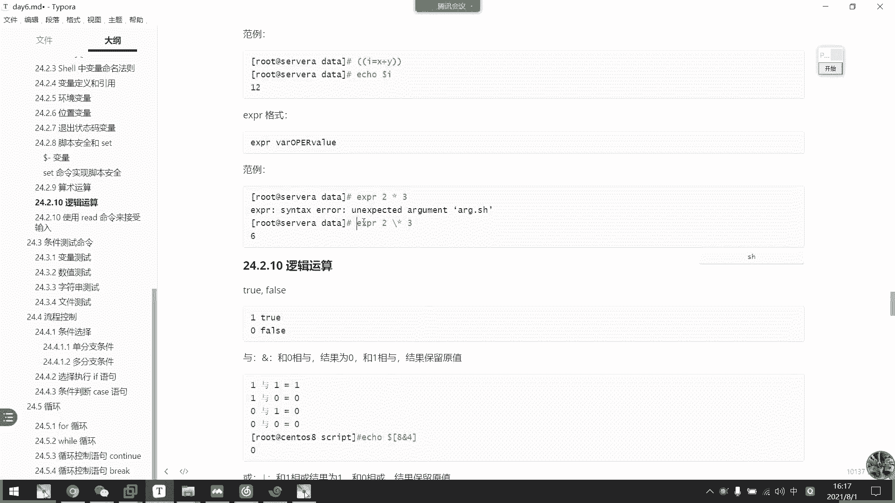
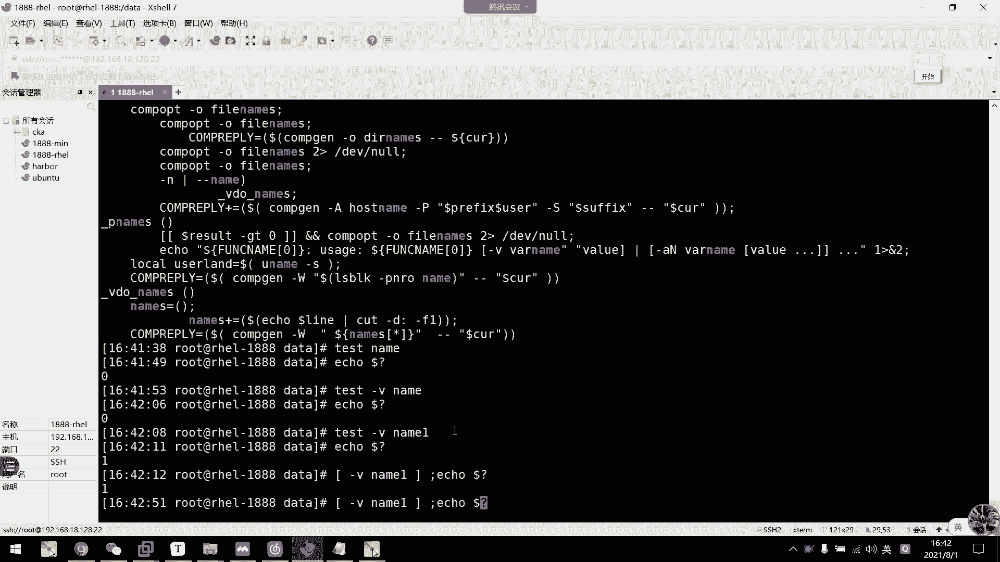
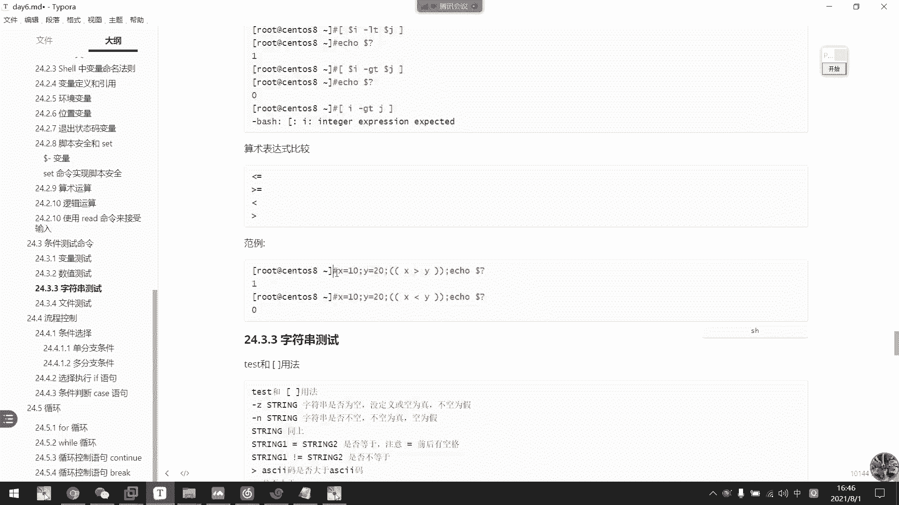

# 2021年7月新版-----RHCE8.2 RH124 RH134 RH294 认证课程 - P44：day8-4 变量类型2与条件测试 - bili_15701050454 - BV1Gy4y1T7ug

哎回来上课了啊，同学们。什么意思？嗯。怎么让自己VI编的内容出现在上面呢？不会因为退出VIM模式小失，什么意思啊？用for是没意义了这个。刚刚他就没有区分区别嘛。哦，写在里面可以啊，写在里面哦。

我明白你什么意思了。O。大家可以参考一下啊。啊，先在里面，因为它在吹呃，外面的话呢，它打已经打印出来了，打印出来以后呢。打印出来以后呢，他就啊把那个变输出作为它的一个for的一个输入。

所以它还是一节一节的啊。啊，他这个不是，下面那个才是执行啊，上面那个是脚本啊。呃，加辉那个应该可以啊加辉那个可以区分他们的一个区别。好，那我们继续啊。我们看一下呃脚本的安全和我们那个s啊，set命令啊。

其实我们刚刚的一个撤销啊，撤销所有的一个位置变量啊，这个已经是我们那个s命令其中之一了啊。然后我们继续看啊，首先是呃。🤧S meaning。可以用来制定我们的小环节啊，但是我们也不会用太多。

首先是我们先来了解一下这呃其他一些安全的变量啊，首要是我们的多肉横杆啊，多横杆。我们来看一下啊，多肉横杆。

多人感啊，它叫做HINBHS。啊。其实它不是一个单词来的，它是多种变量来的，它是多种变量。

好。啊，我们通过set可以修改。首先第一个小H啊是哈西啊，是哈西啊，这是我们的一个。外部。命令保存的那个哈息表啊。如果我们呃通过set加H就可以把它给关掉了。我们可以看一下set。

再去。哎，我们再看这个这个字，你看是不是没有来取啊，然后我们看一下现在哈西北有没有啊。哈西表已经没有了，没有开啊没有开。好，然后呢如果要把它开回来，我们再减H去就可以了。

啊所有。啊，你看哈记表已经啊又回来了啊。好，然后。I这个是。🤧呃，把那个。嗯，有一些选项说明是个效是一个交互室的效。然后如果把它这个关掉，它就没有一个交互了，没有交互了。比如说我们的一个呃IM。

诶唔讲哎。有什么东西在这里？F一吧，对呀，他会交互的问，对不对？教互的问啊，然后我们来看一下。把这个关掉啊。

嗯。对。现的叫爱不是爱吗？

嗯。Useer set。兜是的。

HIMB address应该是I呀。

换不了这个。AB。KMMBCHP啊，没有I，它只有这么多啊，它只有这么多。那关这个应该是什么来着？

这里没有血啊。这里没有事。这个应该是关不了了，这个是。通不了。啊，I选项是关闭的，可以看到啊。好，然后是M啊，是打开接控模式啊。啊，这个也也受不了也受不了。

啊 droprop controllert来控制我们的进程的一个停止后代执行啊，就是我们的那个ds吧。啊，我们看一下行不行吧。

加片。对啊一口我们现在M已经关掉了，也已经关掉。然后呢，我们看一下呃拼百度点CM，然后把它丢到后台。丢不了了丢不了，看到没有？丢不了了。听不了。还有是ds。被OB的。你看不行了，他不能丢到后台啊。

让我们把它开过来啊。这。这接开起来了。这开起来LB啊，这个是大括号获展啊，大括号获展就是我们。这个啊。一点点。录少一点。啊，这在大货扩展好，然后我们现把它关掉啊，嗯，再讲。B。要不加B。

然后我们现在扩展啊，你看扩展不了了。他要把它当做一个字不错了。然后我们把它开过来啊，然后袋厨。大就是我们的H啊。So我们 history啊。然后我们先把它关掉。啊，我们看一下。人家能用，但是我们不能在。

这样子。呃，就诶。984。等下不行了啊，已经不行了，它关的是这一个HV的一个调用啊。

屌。

把它关掉。开回来啊。基本上就这些吧啊，其他没讲的就无关重要了。

好。下面要求无关重要。好，OK。😊，这里看车。嗯。都讲了还是讲的我刚刚说的那些啊。好，ok那么我们继续往下，然后set命令呢啊还可以实现我们那个脚本安全的。因为写在脚本里面啊，我们来看一下啊。呃。

首先是一个。UEO啊，这个其实OO没什么所谓啊。啊，后面什么说呀，然后是X啊，它执行的话可以打印我们的一个参数啊。我们先看E优保护啊，EU保护啊，同学们我们可以看一下啊。

我要写一个脚本。呃，就是这的嘛。是对。啊，所有找过来，然后O。四十么好咯。

嗯。我看看。

我们来。呃，定义一个。值呃数额被。啊，送我们的 data。然后我们RN杠R。不小心把这个变量写错了。那么同学们我们这个脚本会出现什么问题？我这个脚本会出现什么问题？嗯，你们知道吗？啊。

我们这个脚本柜出现什么问题，你们猜一下。好，我现在用bech刚才是检测不出它的一个语版错误的啊。保出。不不不没那么简单。哎，我想一下他这个情况是什么？有同学知道吗？啊，他这个情况会很严重。你可以跑路啊。

所谓的商户跑路就是从这里来的啊。为什么会商户了？啊，这个为什么会导致仓商库呢？首先我们。定义的是这一个倍量，是不是？正常来说，如果是大写的多了。第二。那么他就会删除我们DIR下面所的内容。

但是这边写了一个小写的第二。我们现在D2R是没有做定义，对不对啊？没没定义。系统上面有没有定义的的一个小DIR这个变量。我们前面一口。一口一个没有被定义的变量，它是输出什么啊，输出的是什么。

是不是空白啊？是不是空，那么这里是一个空，那么我这个命令删除的就是更下的心。他最后的结果就RM。G。R。Genxin。啊，商务跑步啊。那么为了防止这种情况出现呢，我们可以在这里加一个。Se。

杠U啊再杠U。那么我先跑一下。刚我没有做。坏照，所以我不敢跑啊，现在我敢跑啊。嗯，你看他这里说啊，我们这个DI行没有值啊，第十二行。这个没有值啊。所以没有被定义的变亮呢他。概如可以保护，不让他执行啊。

不让它执行。这就是我们的干部。好，然后呢我们这里L。叉叉车。然后在一口hello。我们正常的情况下，他是不是哎。这里得注册掉。我们正常情况下。他这里是不是可以执行？啊，一直会执行下去。那么。有时候我们。

🎼脚本之间每个命令可能都有关联性的啊可能都有关联性。那么这里错错了，然后后面呢可能会一直错一直错，一直错啊，然后可能会导致呃一些更改一些。呃。🎼不是自己想改的配置，导致我们的一个结果出现了重大的漏洞啊。

那么这个错误我们能怎么把它给限制掉呢？啊，我们可以用一个杠一的选项啊。好，那么我们可以这样子。他到这里它会执执行到我们一个错误啊，我们用beX看一下吧。哪你看他首先。执行这个啊。

然后是复制啊复制以后直接到这个啊，然后到这里啊后面就不再执行了啊，后面就不再执行了。会错误停止啊，这是所谓的错误停止。啊，明白吗？这是我们的啊一个。明天错误签字啊。🎼但是再多的安全问题啊。

还是敌不过我们自己的不小心啊。所以大家写甲板还是要小心一点点啊。知道不？啊，必须加上啊，正常来说必须加上，就把这两箱都加上去啊，直接干衣用这样子就可以了啊。对啊，就这把这两个都加上。

这是一个安全风险问题啊。啊，这次玩金英随便你自己怎么玩。Ha。啊，这是我们的一个 set的安全啊，对，还要选的是一个小脚本。😀呵呵呵。😊，肯定啊，你们在测试环境得得得删一次库啊，不删的话啊。

永远都不知道啊，自己在生产环境中不小心删了，或者是测试生呃在在公司的测试环境中把库删了也。很严重的测试法，因为我们测试环境相当于是一个备份啊。下到这个地方。好，来。

然后我们接下来讲的是我们那个算术运算啊。所以说啊然后呢。😊，我们校啊是允许在某些情况下呢，对算数表达师进行一个求职的啊。然后呢，我们要运算的话呢，有一些规定的。呃，表达式啊呼跃表达式。可能要用let啊。

然后加一个变量。再加我们的一个搜索表达式啊，然后是或者是两个中括号啊，两个中括号。嗯。或者是dora中括号啊呃，这两个小括号谁对啊，说错了，不好意思啊啊，然后是dora。多了两个小花。然后是。呃。

exper啊ex也可以啊。exper。啊，这个好像是求。什么来着？忘记了，我等一下看一下，好像是deecred杠I也可以啊。でこれかあ。啊，然后是一口双字表达是盗文的BC啊，作为计算。啊。

然后我们的被选只是只能说故事小说啊，这个要注意啊啊，不然它会除零的啊，把把那个小说给除掉的。让我们来看一下这个刷表它是怎么用啊。虽然是我们来个。

嗯。let吧啊。是的。我们要。呃，你先等于一加一这样子。打我冇结。这样就预算出来了，这就预算出来。不加这些是验收不了的。比如说呃我不要累我不要累。它就变成我们的一个呃字物窗了啊，字物窗啊，加里的。

是声明它是一个双手表示啊。然后。嗯。第二种是。我们的两个中花把两个小括。然后也是一 said。所而且对于。2乘以3。预算起来了。然后是我们的。多了，小括号啊。嗯，也是饿。一就等于2乘以3。嗯。

怎么出问题了？嗯哦他这里。

有问题。嗯，写在外面才对啊，这里要写在外边啊。

是我。也就等于。啊，这里改一下272，你看这样就可以了。他刚才为什么能读出来啊，是因为它啊以下还是保存着前面这个6啊，保存着前面这个6啊。

呃，然后是中中括号啊中括号啊也是一样的。改种卡已。从括号有是1加3啊，1加4吧，那就变成5，对不对？

然后是。exper看一下这个exper什么意思来，我也忘了。是袜的。直接的那个一先等于。多了。

多了。perS PRR。哦，我记得了啊，这个也是运算的意思而已。然后我们。嗯，多少。对。诶诶诶诶。

哦。嗯。😊，多了括号。

复制过去。没有什么呢？

ARG1ARG2ARG3。我们等一下再看一下exper，上面有翻例的啊exper啊这里。

哦，我用错符括号文改。多了小括号，诶，没错啊。他多少小括号是执行了这个命令而已，它exper是一个单个命令啊。per1加1。

啊，是一个诶。什么鬼是我输错吗？哦，EPREPR没输错啊。Yes， PR。USP。

我喺睇度。啊，这个月怎能双吗？怎么一加一送哦，少了个空格，是我的啊，我的问点少了个空格。啊，他是其实这里是执行啊，是执行要一个命令。啊，然后执行以后呢啊大家注意啊，多了小括号。是执行里面的口怕啊。

跟我们的房应还是一样的。我这边直接改成方向。

对不对？它的等值啊这里要注意啊，啊然后最后是一个BC这里呃degrade杠IBECLARE杠I。

嗯，要是一加1。一些等于。然后我们。🎼不要一加一啊。看一下它的区别，不然他二的话，不知道他是不是真有运算对不对。来面试啊。啊，所以我们运算方式是有这这么几种嘛，但是我个人常用的还是用led的。

我采用还是用ledda或者是这种。

两个综合啊。啊，有应用场景的，我们随后啊用用上的时候，我们再看啊。那这个BC我就不说了，前面已经呃讲课的时候啊经常用的，经常的啊，L是redom早上说过了啊，是0到32767啊，我早上早讲错了啊。

早上讲的是65534啊，6534是端孔的范围啊，是端孔范围。啊，32767啊32767。好，然后。啊，这里取膜啊取膜。啊，0到49嘛啊，所以是50嘛，对不对？啊，其实它这里余50，它最大的数啊。

正常来说我们运算起来它是等于50啊。但是余数的话，它可以啊是有一个范围的变成啊。AMGE啊rangerange454。啊，是变成是0到49啊，一共50个数啊。好的，0到50。0到50。

记得这个什么意思吧啊。啊，中括号是代表啊，零开始啊，然后小括号是不包括这个50啊，所以是0到49。还有早上都说问过这个了。我这边。我我早上也写过出来了，这个早上已经写过出来了。

嗯。对吧。手机颜色啊31到30。7啊31到37。我们的颜色啊，自己可以看一下啊，每个颜色是什么数字啊，可能是31到37，然后是一是高亮啊，还有其他的，我记得啊。还有。嗯，5三。好像还有3。呵呵。😊。

哎2。呃好像没什么变化啊。嗯。少分开，至少个分开。呃，没什么变化，有没有什么变化？3。3。嗯。被说变化。这个没什么作用啊，花里胡哨的，对不对？啊，所以。

我们一般都不用，一般用高亮加颜色就可以啊，用高亮加颜色就可以了。好。然后let运算刚才已经做过了啊，lett运算啊，然后是呃括号形式啊，括号形式。啊，export刚刚说了啊，注意export这个一定要。

转移啊一定要转移。啊，他这这的新不是新的意思啊。啊，新代表所有啊。他这里是代表了他的文件了，给我看一下呃，你。

其哪里，我们这里就有1个F一的文件对。诶，也不是。啊，他是从F一开始找起啊，我们把其他删掉啊。是。嗯，稍到F一。我们再看。他友会取一个。啊谁就这么来的。所以呢我们需要转译啊，用ex的时候用成需要转移。

Okay。然后是我们的逻辑运算啊，逻辑运算啊。这两个命令的了，一个是 truee，一个是for啊啊，出的话它永远等于一啊，forse的话永远等于你啊，明白吗？啊。

然后逻辑啊还是我们前面讲过的一些呃命令运。我们前面不是讲过了一个运行命令的一个运行顺序吗？我们又讲到了一个啊。呃，雨阔飞对不对？好的。且破飞啊嗯且啊就是雨祸飞嘛啊且破飞嘛。三种。三种。然后呢。

我们这里也是啊。啊，也是，然后是一与一与等于一啊，然后是。雨是相当于纯啊雨是相当于沉了，然后一乘于零是0嘛，零乘于一也是0嘛，然后零乘有0是零嘛，对不对？啊，这是啊我们的鱼啊我们的鱼。然后呢。

我们看一下啊。8与4。我们运算一下，不好意思。你们坐一下，鲍鱼事。为什么等于0啊，你们做一下。那，你们写一下。为什么能因？这个可以运送的。呃，我希望你们自己写。啊，它的相关其实我这前面上课好像讲过吧啊。

这个相关用二进制的80，我们二进制写一下就好了。八是多少啊，是不是1000啊？L4是不是100啊？有没有写错，这个是一，这个是2，这个是1，没错啊。那么我们我们补齐啊我们补齐。我补齐。

那我这里是不是0100啊？有后两个3与，一与零雨是不是零零与1是不是零啊，零与零雨零雨雨，最后得出一个0，对不对？啊，这个我记得是我们讲那个权限的时候讲过啊。然后我们看一下六鱼四鱼啊，六鱼四。可以啊。

我开下吧。

可以啊。但是他这里要有一个变量啊。肯定啊它有一个变量吗？啊，不对。8。是啊。走了。嗯。系语法错误啊 echo e c h o。嗯。那真的不行。分开问题哦，对。诶。刚刚用的中文封号啊啊，那不就可以了吗？

原来他说我的语法错误是这个。我都没注意啊我都没注意。

ok。😊，它不是不行啊，它是需要我们的一个有一个变量值啊，有一个个它它要复制到袜里面。看到了？运算跟那个没关系的。好。然后我们看一下说的不不远啊，然后是括啊括啊，括就相当于是加啊。

但是它最大值不超过一啊，那么一加一肯定是一嘛，对不对？然后一加0也是一嘛，0加一也是一嘛，0加0等于0嘛，对不对？好，我们看一下巴霍4，巴霍4为什么12。加嘛，刚刚说了，对不对？二零零年。要是0100。

最后得出不是1100嘛，对不对？是不是？106612。啊。说实啊。好，要是飞啊。飞。就是。明明是对的啊，别认错的啊，明明是错的，别认是对的啊。然后我们可以看一下出尔 four两个命例啊。

PRUUE啊，对啊，处啊，要我们看一下它返回词啊。ECHO啊多少不。对呀他是必须是零的啊。1入E啊。要是。一口。不我。他是你的，然后我们forth啊。标写。我不好。必须是一的啊，这个必须是一。

然处啊永远为0。ft永远为。一。啊，当然也要注意啊，它这个零啊这个零是我们多少问号的值啊，我们多少问号零是是是出，对不对啊，但是它真正的出入是啊，在在我们这个逻辑运算里面是一啊，一定要注意啊啊。

在底层是一啊啊，所以你这个啊如果思路转不过来的话，可能会觉得啊它多少问号是零，它是为什么出出出是为为什么正确啊？为什么出是一啊。

啊，这里你们要明白这一点啊。你有要这个。好，然后呢是我们的那一个短路啊，什么叫短路？短路就是我们两个命令呃合并起来。它的一个呃这里还不是抖罗，这是雨啊，两个两个命令之间互语啊，就是说如果。

我第一个命令是真的，我要通过第二个命令来取。这个运行结果。是否为真？啊，如果com一已经是错了，他这个结果必定是。啊，不一定是。错的，所以他就不需要再执行了，对不对啊，就不需要再执行了。

然后我们看一下抖路语啊啊，我们懂路语抖路语呢它一般都是要有。呃。两个命令啊就我刚才说的，如果第一个命令啊结果为真啊，第一个结果为真，那么第二个就肯定要参与啊，看一下第二个返回的是true还是for啊。

我才可以得到最终的结果是true或是for啊。啊，然后如果第一个是假的，那么必竟是假的，就这个就不执行了啊，这个不执行了。还要是短路扣啊。多过也是一样的啊，如果是第一个是处的，那么结果就会错。

那么啊com二就不需要执行了，com2就不是执行。哎要如果是假的，我们还是要通过我们科目二去。判断到底结果是真还是假啊，这是短路啊，这是短路。比我们来看一下这个呃比我们来看一下这个范例啊。

我们看一下这个范例。好，那么我们这里。啊。运算那个window。啊，这里啊有一个判断条件啊，我们判断还没讲，等下再讲，我们先。呃，了解一下这可以啊，这个是test的意思啊，作为判断的read。

运算取模6，那么我们值是不是1到5啊1到5啊，证明我有5个子弹啊，5个子弹。好吧，六个子弹啊六个子弹啊。呃，就是俄罗斯卢行啊，是不是？啊，然后呢，如果我这个reow取出来等于0。等于0。

那么它就是这个结果啊，这个结果就为一嘛，对不对？唯一。那么就执行。第二个呃，我要通过第二个命令才知道。啊刚才说的懂路懂懂路懂路货嘛，对不对？懂路过啊，如果前面的唯一。

那么我需要这个命令去判断我是否需要执行，对不对？还要执行这个看他是零还是一才能得到我最终的结果是零还是一啊，对不对？所以如果质疑他必须会运行这一个。然后再这个短路扩呢。懂了过了啊，如果这个是你。

您的话他就不执行这个嘛，您的话他不执行这个嘛，他就会看执行这一个，对不对？啊，您的话他的就会只有这一个。啊，他也有一个运行顺序啊，这是我们要短录啊。啊，又是00的话，他这个就没必要执行了啊。

然后就判断到我们的货了啊，要是0啊，就要执行这一个啊，对不对？看它是名额是一嘛，然后再得到结果是名额是一吗？其实我们最终要得到的结果还是一啊。我们这些。资金起来，我们在脚本当中啊。

资金的结果必须要得得到意义。所以。为了得到一。我这个是正确的，没必要运行第二个。对不对？OK不对不对不对啊，这个证确必须要运行第二个才可以知道他。为什么等于一啊？如果这个是零的话啊，一与零与等于0嘛。

对不对啊，一与零等于0。好，那我们看一下。我运气好不好啊，如果上过我们下过啊。

上课我们就下课对哦，下课。哎，我攒了三次颗，就这一次中招了啊，可以下课了啊，我那哭没有了啊，哭没有了。开玩笑的。看一下，还有一个系统，对不对？还有一个系统，我没做快照啊，不要想，我没做快照。没说坏套啊。

😊，没得救啦，这个真的没得救了。美做开罩。没有我懒得关机做拍照而已，我想着还有一个系统嘛，对不对？好，我们换个系统继续玩。

没事，还有个系统。😀Yeah。😊，啊，如果是真的打枪，我已经死掉了嗯。诶，有啦。他这种。那么我这种方式呢就像我刚才说过的啊。开玩笑的，不要那么认真的啊，可以判断我们的一个网络啊是否联通啊，是否连通。啊。

如果通的话，他要。继续做什么啊？如果不通的话，我们就返回一个字啊。给我看一下。

我可百度啊。诶。什么鬼？我看一下哪里出问题了。哦，我知道了，这里出出问题了，这里出问题。呃，是一口啊。这接解一下。我是。一口。竟然被你们看到我伤酷了。啊，OK对了。他能通啊，就是ready。然后呢。

如果我拼一个不存在的地址啊。拼一个不存再地址，比如是法络CO啊，通不了啊，他就说网络漏问题嘛，对不对？好了罗问。系啊需啊啦。反正他要得到一个短路短路结果为一啊，短路结果为一。ok。能明白吗？这个。嗯。

我脚本上好像也有这个啊，有有用到这一个吧，看一下有没有。

脚本。看下没有。我这个脚本好像没有。另一个脚本应该有啊，这里有啊这里有看到没有？而且我还加了一个退回状态码，因为它这里失败了。然后退出来。要要让他退出，然后C的话就让他拼一次吧。啊。

CNW呃1秒啊4P1秒。

这hel一下就知道了。我们通过拼一次来判断他是否同嘛啊，就不用太太长。呃，C。cloud啊一次啊，这个是一次啊，LW是太奥啊，对不对？啊，如果一一秒不通，就直接。就是接因为他网络是有问题的，我没加W。

这里直接细啊，直接细了。啊，就一次。啊，一次的确少一次的确少。😊，一般windows都是拼4次，对不对啊？windows拼4次。

好，我这里就用到了短络了，看到没有？这有个东东。啊，所以大家好好研究啊，这个经常用的，这个经常用的。

嗯，好。要懂懂文家们啊，接下来我们看一下read啊，用read命令来接受我们的一个输入啊，接受输入。啊，这是。其实就是一个定义变了啊，然后wi杠P呃指定要显示的提示。S就寂末输入啊，一般用于密码。LM。

啊，就是定义我们那个字符强度啊，然后降低啊，就是要字符啊，输要需要需要需要输入解束符。啊，一般这个不用了啊，然后踢的话就结束多少秒啊，就如果多少秒没有输的话，那就自动退出啊。啊，比如说我们看一下这个啊。

看一下这个脚本。

我就不手写了啊，时间问题了。哎。又没了一个系统。好惨。嗯。为的。来，我们粘一下，我们看一下这个脚本是干嘛的。啊，首先他是杠P。看别有什么了啊，指定要。显示的一个提示啊，就是说呃这一句话写出来啊，刚坯。

啊，他可以不加，这个不加，就是说直接read answerer，然后呢，它会根据你输入的东西来复制给我们answer这个变量啊。然后在下面调用啊，刚刚说的这个还是测试啊，这个还是测试啊，这还测试。啊。

两个中呃两个两个中号也是测试啊啊，然后这里用了我们正在表达式的判断啊啊，我们先不需要知道它这个是什么是什么东西啊。但是我们要知道的是它这个正在表达式写的是什么啊。啊，是Y大写Y或者小Y开头啊或者。

我 x。大巴小歪啊。可以啊，竖其他就不行了啊。啊，说其他都不行。我们看一下这个脚板。呃说I richach啊y and啊啊就说了这两个y索 and。然后我们就判断y就可以了。除了y以后，我们都输这个。

啊，所以它等于Y或者是等于yes，我们就这个就等于一嘛，对不对啊，我们这个就等于一嘛啊，只要我们说Y或者是E，这个就等于一啊。得于一以后呢啊我们还就就要执行这个嘛，要得于一才对等于一嘛，对不对？哎。

呵说错了。啊，两个两个执循环得到的最后结果是一吗。啊，然后如果输漏呢啊速 no这个就是零嘛，零的话呢，我们这个就不执行了，然后执行这一个嘛啊这个一嘛，然后是在等于一嘛，对不对？OK，我看一下。啊。

主要是为的，刚刚刚刚那个逻辑我们应该再说了。对RAD啊。呀他要等待我输啊，他要等待我输。那我这边就输一个Y。还要输一个要输一下其他东西啊，比如是3啊，你看。啊，要你好好学习啊，故s大点点点啊啊。

好好学习，天天向上啊。

okK这是我们的win道，等待出入。啊，但是说。记得我们read后面要给一个变量值啊，然后他把输入哦我所头输入的东西呢复制给这个变量的啊，大家要注意这一点。好，然后呢呃。我们就讲到这个。

条件说施命令了条件测施命令。条件测试就是我们刚刚的一个中括号啊，其实。他一般啊其实他是一个ts。对呀。一般用于脚苯啊一般用脚苯。你是语言没玩过吗？虚语言玩s嘛，对不对？s。让我们看一下测试啊。

体测试我们有三种啊有三种，一个是tests啊，一个是中括号加我们的呃表达式。🤧嗯。然后他跟我们这是等价的，我们建议用这个。啊，然后是两个中号啊，然后呢注意啊。

这个中括号里面的前后啊表达式前后一定要有一个空格，有一个空格。好。我们看一下这两个命令啊，首先是我们的type。

Tpo test。啊，你看它是一个内部命令，然后其实这个框。也是一个命令啊。宽也是明密。这啊是一个掉的关键词啊。

好，然后我们继续往下呃一个是。测试变量是否被复制啊？啊，不啊，这是辨量变量是否被定义啊。比如说啊我们这里。

好，我这里。那个内等于。然后我一口多了那个。啊，一口0你。Yeah， set a real。先看一下摄头有没有啊。嗯。怎么那么多东西了？这个。系好嘅。刚刚删这个库就算了，干嘛要删那个库？这么多东西。哇。

全都是韩数啊。哦，没了。其实为的它也是一个函数来。怎么办？看不到啊。那走吧。これ不能。这有没有。啊，没定义到，他没有词就没定义到。那我们现在测试一下tests。唔明。然后我们一口。

多了。诶，怎么是您呢？To。

啊，也要一个V啊。开始干无了。诶，怎么是你们？啊，这个是一啊啊，这那么我们这个类啊是被定义了的。哦，这里有啊这里有啊，它不是翻一起的，我以为翻译起，不好意思啊啊，所以他在这里啊，我们在上面试用啊。

在上面试用。但是内衣是真的没有别定义啊，所以一个是0是1。就算他没有被复制。就算他是一个控制啊，他都认为他已经被有被定义了。啊，这个t了我们可以用。方宽也可以啊。啊，然后是。一口。多少我。这一对不对？

这是零度的。啊，就是说我们这个有定义啊。呃，这个R的话不用管，我也没搞清楚啊。并用。我是被告你做。啊，O啊，注一下这里如果没有加。空格它就会说可不能放啊，可不能放。其实因为它这里是一个命令。

所以命令与参数之间啊，还有选择之间需要一个空格。好，然后是数值测试啊，是EQ是等于M1不等于。表示GD大于啊G一是大于等于。LT。就是小于啊，然后是L一，就是小于等于啊。等于是一块嘛，啊。

然后是呃捞一块嘛，然后是gradere啊，然后是gradere一块嘛，然后是 little嘛啊小于是 little嘛，对不对？

哎，我们在测试啊。首先我给I负值等于10啊，给J负值等于8。那么我们测试啊。嗯，I。江二晓。谁。然后是一口。包邮了。我就知道出问题了。H。😊，啊，你睇。是不等于吗？肯定不等于吗？所以是错的，对不对？

人说对不对？好，然后是NM1。那么让赢嘛，肯定是不能赢嘛。你要他I是否大于它，那就GP嘛。对不对？大约等于。嗯，也是一样的。然后是小于等于。那就肯定不小嘛，对不对？啊，这是我们的数字测试啊，数字测试。

搞定。说的是。我刚刚又做了这个错误了啊。然后还可以用我们的一个数字表表达式来比较，但是它。这个好像不能放在。

变量使这样子使用的，我看一下。哦，可以啊。可以。低利。啊那就不行。

这样其实不行。

🤧。他只只能是判断我们这个。啊肯等于。啊，等于等于的话一定要用很等于啊。他这个做不了。他这受不了。只能大于等于还等于呃大于。小于。还有横等于。诶。等等。大于为增值。怎么小月也为真执？嗯。啊。

那就是他这个只能运算。他运算出的一个结果啊，他不关心这个结果，只是关心他有没有一个正常的输出。啊，所以我们没有返回值啊，这里要注意啊。所以我们一般不这样做啊，但是很等于是肯定可以的。跟本。

只有恒等于可以用啊，这样子这个情况只有恒等于可以用。

嗯，所以我们一般都是放在这里。这一一般是在算数。表达是里面用的。啊，在双诉表达师里面用的。啊技术对不对技术。

嗯。对吧。X大于Y肯定是错的啊，然后是改X和小于Y。嗯，那就零嘛。对。ok。🤧咳。嗯，还有一个很等于啊。表示。大于等于。也是错的。表示小于等于。啊，那就对吧，对不对？O啊，这就是我们那个。啊，说了了事。

好，然后是我们那个字符错测试啊，字符测试呃，这里。呃，T还有一个。花的用法。嗯，首先我们看一下这里以下啊是定义我们字符说是符为空啊。

啊，首先我们刚刚那个link啊那个 link。呃，是定义了的，对不对？这个等。啊，这个是定义了的，是不是？

啊，那么我们可以看一下啊。接下来可以用这个去判断它是否为空啊，是为空。

我看下。

用杠一塞，然后这里多少。0看一下零是不是空啊。啊，没定义为空。是真的，所以我们这里是0，对不对？所以是0。然后我们现在再复制一个啊。

零一等于少，随便吧。系我们判断一下另。你看它有值，所以它是错的啊，然后它跟我们的杠M是相反的。啊，如果他不空，为真啊。一真。啊，又是空为甲。诶。

什么意思？空为甲，为什么任？另另不是空吗？啊，那不是空吗？

杠N。多少定。失控哦，我知道了。他这个是这样子的，我们一口。不对。另。等于。然后一口多了。哎，我再判断那啊。

那怎么还是真的？不空为增。

为什么他这个不是空？他们也是空啊。嗯。对不对？出问题了。啊，你动了。

🤧出问题的这个。

啊，他不会这样用的。是这样用的。这是为讲了，我们这里是没有啊，然后加个空格啊，空格也是值啊也是值。所以我们刚才那个控值也是一个值啊。

这是判断这么创的啊，行。呃，然后报照两个字符错是否相等啊？

到到两个周围都是不下的。啊，比如说。呃。等于。肯定是错了嘛啊，一个是空格，一个是非空的。然后是。嗯。Doling。这个判断不了。空格前后好吧，等号前后有空格有啊。这不行。哦，这个可能要用这个了。啊。

因为他这个算是预算了，所以我们要啊用两个中框括起来。

🤧嗯。啊，下面会有一个这个用法，一般。呃，判断两两侧字符稍是会相同啊啊，这里有写这里有写啊，然后这里还可以用这些把它试啊。而他只是使用这表。🤧哎要不等于这个就不讲了。因阿克斯马判断这里都不讲。啊。

这回去测试一下啊啊，这个我们的字母算测试啊。啊，这里刚刚的。仪式。啊，你看嗯现在被取消了，就没有定义啊。这那么这样子他判断起来他就唯空啊。啊，然后这样子飞空啊啊，所以我们刚才有定义，所以是飞空啊。

其实它这里唯空的唯空的一定要是要呃没定义啊，一定是没定义啊。我们定义了他都为帧了，定义了他就围这个，他为这个，他都他这样子，他都说是有支付穿的。嗯。Bai。啊，记实不对，大家回去看一下吧。啊。

它定义了啊，这个唯空啊，这个算是空，所以它是比啊，以下是空为0嘛，对不对？然后对于M来说，我们M来说，它没有定义才是唯空啊，没有定义才是唯空啊，所以这个才是假的。这个才是假的。然后这个是比较支不错啊。

感觉这次比不了。啊，然后我们那个两个中括号的一个应用啊，它可以使用通配符啊，也可以使用我们的一个浙表达4啊。再回去看一下，这边就不做详细的讲解了。啊，这是我们的一个测试啊，调节测试。

啊像是我们那个文件测试啊，文件测试就是看它的一个文件类型啊，文件类型。啊，所以是杠A啊杠A加文件啊。呃，同同个概一，我们看一下干一个什么啊，看这次测试，我们文件从不存在的，这个很重要，常用的常用的。

就好像比如。我装了个docker。仲有 do。啊。我要不对。你不是要装到那个，我脚本上写了一个装docker，是不是我脚本上写了一个要安docker。但是我要判断他是否。存在这个我才要执行，对不对？

那我就可以干。一、判断一下啊是否存在这个。嗯。ETC价格。直接是ETC下的。ETC下的docker下的啊demo。点专属啊，或者是另一个真的有会生成文件，它这个可以没有啊，它这个可以没有啊。啊。

他这个没可以没有，然后啊判断结束以后呢，我们这里加一个留呃条件控制啊，如果如果他。啊，得知。为啊字不存在，不存在的话，我就安装docker这样子啊。

有。啊，这个判断文件是否存在，然后判断这个设备是否。为快设备啊，存在且为快设备啊后是存在且为字符设备，然后是存在且为目录文件啊，这几大文件类型我就不多说了啊，几大文件类型我就不多说了。啊。

但是我注意套一这文件是大写的S啊大写的S。啊，然后这里是HH，我看一下啊，H啊是我们的连接文件啊。就大L或者小H啊，这里要注意啊要注意。啊，这是对我们的文件类型是否存在，而且跟呃是否为当前类型做判断呢。

我也不想讲，不详细的讲不想讲。详细的讲啊，我说的不想讲是详细的讲。好，然后这里你看W呃，是判断权限的，这个是啊。这个是放到水限的。啊，W是判断我是否有写的权限啊。判是否有缺示，呃，X是否有执行缺陷？呃。

然后这里加了一，我们再看W你看。就说我有写的权限啊，他都不没有没，到最后他还是没有。写了全写啊，因为我加了个I，我无无法修改，对不对啊，它放到起来，我是一啊就无法修改了。这里可以回去看一下。啊。

然后是我们的一个文件属性测试啊啊刚开始。

看那个文件是否为空啊，我们可以看一下。呃。我们。喂。我们先创建一个文件啊，touchF1。然后是杠S。小S的呗啊，该14F1。以个。多少公分。嗯，你看。S啊应该是没空，我们写个东西继续啊。然后再看。

呀这问题吗？就是说它是空的就唯一啊非后为0啊。

🤧啊，好像是杠T。嗯，这个。很难碰到啊UFD文件文件你们也会很少用啊，是否在终端打开了一下。好像是刚恩呃，刚恩就看他有没有维修改，过去他就是。看那个。呃，M态啊。大家好。啊，就是说他是否为他的属主。

该据是不是他呃有是属主啊，就判断该用户是不是他的属主的啊，该文件属主，然后是两个文件。互相判断啊，主要是EF的判断是它是不是一链接啊，又是NT啊，这个是判断M态啊。这两个的M胎做作为判断啊。

然后是OD啊，这个是是否9月啊，这是。呃，两个都是判断M胎的啊，是否新或者是否旧啊。那么条件判断，我们就讲到这里啊，讲到这里啊，这个要多用才记住的啊，多用才记住的。好了，那我们今天就讲到这里吧。

留些工资我们留到下周再讲啊，留到下周再讲。好，那我们呃今天上到这里。同学们有问题可以问啊。

考试你不要问这个问题。