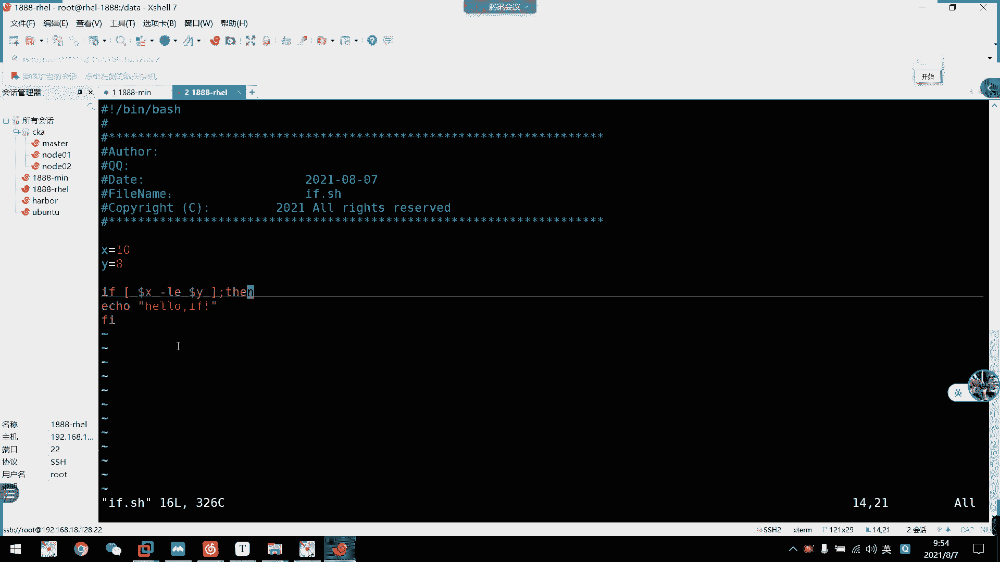

# 2021年7月新版-----RHCE8.2 RH124 RH134 RH294 认证课程 - P45：day9-1条件选择控制(1) - bili_15701050454 - BV1Gy4y1T7ug

好，那我们先回顾一下上周的内容啊，简单的回顾一下啊。首先呢呃我们学了一下关于。脚本。编写。嗯。脚本。脚本把文件后缀。啊，一般使用。点XS结尾啊。然后文件。第一行。需要死班机制。什么机制是什么呢？啊。

是我们的井探，然后是冰。不是。啊，然后是。不。🤢，脚本的内容。嗯。结束后。同存。然后是文件的。权限。设置。序后。有执行权限。C是 move。要是。여제겠어。又是哪一个这个文件？好，OK。执行脚本。

的方式。有我们的啊。相对路径。就是。掉，然后是。我们的交本文件啊，因为是绝对路径。呃，追入地。什么。啊，比如是 rootot下的。边。下的。文件这子。好，也可以是解析器。这是我们的be。然是。谢谢据。

好。这里。姐姐是运气的。可以。没有。执行权限。我这边。你们听得过网络有没有什么其他问题啊，它一直提示我网络异常的。怎么6毫秒2毫秒啦。都说网络不好了。但是听起来有有没有什么问题？换一个wifi。

啊这个应该。现在应该断开了是吧？🤧我切了一下wifi啊。嗯，好。然后。脚本的测试啊。有我们的。B。加等。加我们的。这本文件还有besh。刚开可始加我们的加布文件啊。可以。啊，该人可以。嗯。测试。

小粉语法。是否出现问题？可以测试脚本。运行情况。啊，就是说。显示每一步。结后。并。执行。啊。脚本。测试啊。只能。检查。语法。啊。不能。检查。命令。是否。正确。这个。要注意啊。诶。😊，好。然后是。有说。

有。变量声明啊。呃，首先是辩论声明啊。今定说明。这个T。等于不。嗯。K为变量名。变亮名的定义啊。可使用。英文大写。或者。是。陀婚法。不能。使用保留至。呃，换电子啊。不要用。静音。不。嗯，英文缩写。

需要见明之意。Okay。🤧咳。然后是复制。Orello。可以是。字不错了。数字。明令。🤧嗯。但是。呃，不。小。不支持。说啊。OK啊，然后是运算。啊，有我们的let。我后是EC，哎呀，按错了。你识。等于。

诶。郊Y啊。可以是两个小括号啊，一下等于X加Y。一个是多ra。括号。是不是？好吧。我想想。中过后吧。你是等于。郊外。是。啊，这里少了点东西啊。还有一个常面的。黄金变量啊。少了个环境变凉。可以可以用。

Is proud。啊，然后是K。等给不了。会收益。E表示定义不了，只能查看。只要一一个就可以了，只有常用的就可以了。运输还有什么还有一个。不。嗯。然后是。A加B之类的啊。还有1个BC啊，那不用说了啊。

啊，然后是测试啊。这是有开始。我是。中国好，我是。两个中国号。这个是与。Test本意啊。啊，这个是。测试条件。调。借。使用通配服务。或。正则表达式。すご。这也不写太多了，因为一一写太多的话。

他可能又要上上多一次课。因为他测试条件实在是太多啊。呃。W比。差不多了。多钱。有我们的EQ为。等于。嗯。N1啊不等于。具体。大于。据一。大于等于。OK啊，小鱼。还有一个。抖音。小于等于。怎么用呢？

就比如说我们用这个。🤧嗯。啊，这里还有一个。使用。还有。要注意。全漏有空格。嗯，X。这了。二q。喂hy。这个多是。啊。好，还有什么上周。嗯。变量运算逻辑运算。罗辑就说这里主要是短路与短路破啊。

其实这个我们之前也讲过吧。放们一起写啊。如果。CMBE为真。则执行。CM第2。如果。CMD一A甲。则。执行。兄弟。要一个什么呃。呃，readd钢笔啊还一个readd。接收。输入。变掉啊。

用法是呃read。等批。然后这里是一些。提示。信息。是。一个变量名称啊。比如说安省。那是怎么天？And。二次作片。ASWER。啊。好，然后就可以读出安手的值了啊。好OK上周的话基本上就是这些内容啊。啊。

当然一些条件测试的话，大家还是要回去好好看一下有什么测试啊。刚刚因为这里太多了，我就没有做一些比较多的。介束啊。啊，所以还要可以看一下啊，比如那些位置变量啊。退殊状态码编量啊。

还有一些脚本安全的set啊。这些都要可去看一下啊，那个dora问号啊是什么东西啊，然后是。嗯。多容问号它零才是真的，然后跟我们的处，还有force是不一样啊。我们处的话呢。啊，我们出的话呢是一为真嘛。

对不对？因为甲嘛啊，所以这里不要弄弄弄捆了啊不要弄捆了。好，那么我们来开始一下啊这一周的内容。我们先把这个保存一下，退出来。好。嗯，没事啊。呃。我们可以看一下这周一个内容啊。

是我们的一些关于效的一个语法使用啊，就是一个。流程控制啊，以及我们的一个循环控制啊，循环作业控制。好，这里我们可以看一下啊，首先是原控制的话呢啊，第一个是叫做条件选择啊，条件选择啊，这跟我们以前。

初中还是高中已经学过的一个啊判断啊，我记得是初中吧，初中的时候呢。他会考一个题是吧，让我们去填啊，是否正确，然后选择分支。这里就是有一个叫什么关键是叫是否啊就是否正确啊。啊，这个也是一样的啊。

就是说我这里啊进入一个。程序入口啊，接下来我加了一个条件啊，加了一个条件啊，就比如说A大于B啊，A大于B这是不是一个条件啊？嗯。呃，比如说我们这里呃。A就等于一啊，B就等于2啊。

那么呃我们A大于B肯定是假的，对不对？肯定是假的啊，然后呢，他又通过我们这个结果啊，返回了值去看下它到底要走到哪里去啊。好，如果这里是真的话呢，我们就加一个。一句快。如果是假的话呢，直接退出啊。

这种叫什么呢？这叫单分支条件。啊，它只有一种情况啊，不呃它只有两种情况，要不是对，要不就错啊。对了的话，我就执行错了后就结束啊，所以它叫单分制啊，单分制。啊，然后是双分支啊双分支，我们先看一下双分支。

啊，说分之也是一样的，就是。通过这个条件判断啊，我们用if啊条件判断。然后呢，如果它是真的，我就执行这个语句话啊，如果是假的，我就执行这一条路啊，就两条不相同的路啊，然后执行完之后就结束啊。

执行完之后就结束啊，然后呢他这里肯定啊还有更加多的啊更加多的。啊，我们等一下再看啊。啊。这些。多分支啊，还有多分支啊，我们是通过我们的一个学之星的。if语句来控制啊if啊首先我们来看一下啊。呃。

它可以写在我们的一个命令函中啊，但是我觉得写在命令函的话是有点复杂的啊。所以我一般不演示这个啊，大家可以回去试一下。我们水小本啊一般也都是用在脚本上，我见过命令行的话呢啊多数都是用于循环啊。

例如是我们的Y或者是我们等一下要讲的Y或者是for。这两个才会是在我们的命令行中使用。我先看一下大分之啊，先看一下达分之。就刚才那个简单的例子，我们来看一下。

我刚刚把这个装回来了，看一下行不行。哎呀，可以了。还生。说的还是么。还是不用做个，这个要装点东西。都有点短。这个CD。到呢个。好，我们写一个啊。对。H社区。啊，那么这个怎么来呢？我们来看一下。

在这里定义两个面量啊，首先是X等于10。啊，Y等于8。So if。多罗X。啊，我们先来一个杠EQ吧。等于多少万？啊，接着。这数是应该要。た。然后是这里可以写在上面，也可以写在上面啊。

记得我们这里写完if语句以后呢，接后面接一个分号啊。代表它一个条件判断解锁，要是d。电就是养控嘛啊要做什么呢？要做什么呢？百分之开的。啊，如果它是等于的话呢，我们就输出一个啊hello。对。到说以后吧。

然后结束啊，我们用FI。就可以了。这大分之我们看一下行不行。好，对。直接结束了，我们看一下它的一个返馈值啊。Yeah， so니까。啊一为直接解锁了，没没办法啊。然后来我们这里改一下啊。

首先我们呃X是大于Y的，我们现在那个大于。没有异吧。然后我们执行A。再说题啊那个。他是不没付的值？

怎么不行？

屌，没错。哦。啊，杀了我。是G啊。这可以啊，可以了。G1距1都可以啊，大约等于他自己。啊，可以了可以了。他会这看看杀了，怎么输入个L。还没注意上。啊，OK啊，这就是我们的一个单分支啊，如果它是正确的。

就执行我们的语句快啊。让我们看一下多分支。多分之啊也是一样的。我们双分之随着双分之啊，我们衣服的话呢。🤧有一个语句叫什么呢啊。我们英文也学过if。钥匙。走吧。If else。啊，就。如果否则啊。否则。

然后这里直接加个。Those。嗯。一口。Else。啊，这里真的是要改。再改上是LD。我看一下啊。对呀，他又执行了我们的一个alse了L一句。啊，就是说啊如果是真的。对。如果这个条件是真的。

那么我们就执行这个，否则就执行这个。他有一个叫做el if。

可以的。这多分制啊叫else if啊，就是说呃条件还有多种的话，我们就不能一直用if啊，或者是啊一直用else这样子。它还有一个叫做Lse if啊，就它的条件2抛到条件3判断条件M啊。

然后最后一个呢我们都写一个else啊，可虽然可以不写，虽然可以不写，但是建议大家一个好习惯，就是对最后一个条件呢，我们都写上一个L啊。

，我们来看一下啊。嗯。这里。El see。多了。这写么了。F一吧。我可以继续加。X。更GP。这个是真的啊。多了威。说两不对。就是点。这里我们呃。给一些空格。这里没有写那个东西。就4个吧。依co。呃。

这里写什么好嘞？L2啊。就这样吧。来，我们执行一下啊。看到没有？可以执行我们这一个了啊可执行我们这一个了。呃。呃。这样吧。把这个。啊，我执新一下。嗯，首先我们输这个等于8吧。啊，然后这里等于1吧啊。

你看它是真的，对不对？啊，我们要记住我们刚刚的条件啊。我们基合条件啊啊，首先是如果它小于，我们就输入这个啊。然后呢，如果它是小于等于。好吧呃，如果他是小于等于就出这个啊。如果是小于等于。

是只小于就说这个哎。这个条件是不是有点冲突啊？没有冲突。然他就说也服了，只是小玉。我这里是小于等于音，他就输这个这里有点冲突啊这个。这跟这跟上面这个有点冲突啊。我看看怎么解比下。就等于吧。

弄个等于出来吧。但是我是等于。大于等于什，他这个L基本上就不会作用了，钥匙就不会有作用了。因为当时有情况嘛，一个是小于，一个是大于要不就等于嘛。啊，没有其他情况了，所以要匙就执行不出来。

我们就直接三个条件吧，好吧？对他要不就等于啊要不小于，然后就。如果他不是等于也不是小于的话，那肯定是大于，对不对？🎼那我们就用三个条件啊，表示多分之了啊，已经是多多分之了。嗯。这边执行一下。

刚刚啊重复吧，重复一下。X等于8，然后是10。啊，那么他就走到我们的L。LF1了啊。2是F1小于嘛，对不对？啊如是等于。🤧O。一。等于的话他要走我们第一个分支，对不对？要追最一个啊。10。

对他两个条件都。不行，那么就是大鱼嘛，对不对啊，他就走这个吧啊，要不就大鱼嘛。也这里可以理解吗？这三个。啊，同学们。可不可以？啊，可以说。

呃，这是简单的一个if语法不拉啊不拉。那记得我们结结尾的时候，记得要加1个FI啊啊，记得要加FI。好，然后呢，我们if语句是可以嵌套的啊，if语句可以签套。呃，我们来看一下。签套。

那其实刚才。啊啊，对对对，这个就只返返回一个结果。然后呢，我们看一下嵌套啊。啊，这些都不要了啊，先不要。我们先来个大文字的啊，直接用大文字的讲出全套就算了。啊，所以说 if啊如果他。🤧X。这样的呃。

改成是。G一啊大于等于2。大于等于。那么我们就判断它是否等于2。🤧。嗯。都。然后是L。说了这个下。弄好可。我们刚刚是先大于等于对吧？X。大于外。好，我们注意啊，这里。

我们只要嵌套了一个if啊啊只要嵌到了一个if啊，记得我们结尾还是要一个结束啊。啊，要结束啊。记住了。嗯。然后还是加个条件吧。做了先当分字吧。我们先看一下啊，这个脚本的啊，主要是。判断X是否大于等于Y啊。

是否大于等于Y。如果它不是的话，它会直接退出啊。如果它是大大于等于Y的话呢，然后第二个条件就会判断它。啊，是否等于UI啊，如果等UY的话，那，它就输出S等于Y。如果它不等于Y，它就输出我们的X大UY啊。

必须是要给大UY啊啊，因为我们这里条件本来就是大于等于嘛啊，它不等于的话，肯定是大于没有小于的情况啊。虽然这里是自己写的啊。但是啊速度一定要明确啊速度一定要明确。好，然后我们执行一下哈。

比如说我们这里输1个18，然后是1个17。啊看他就会输出我们这个S大UY了啊，对不对？啊，如果我这里输这一个1。他就会输入我们X等UY。然后最后。如果。啊，那个是小于Y的。他直接退出。对对。水了。

可以自己定义分制，如果它是正确的，然后进来再做一个其他判断啊。啊，但是一定要有关关联关系啊，而且啊尽量去写一些啊，少写一些无关系的欠套，能不用签套的时候不用签套。啊，这。虽然笑的话。

它加厚不不是他的内内存，也没有太多的这个。呃，内存的一个控制。但是呢。保持一个良好的习惯，还是一个好的啊。

好，这是我们的衣服啊。它，这里也有一个F千套，它加了个预算啊。我自己回去看一下练习啊。现到的衣服啊。啊，其实也是一样的啊。他我我只是用的为了干P来自行输出啊，然后他这里用的是VC变量，等待输入啊。嗯。

对啊，他这种还算少，有一些系统的。

脚本的话它更多啊。就脚本有一个好像嵌套了十几个牵套十几个，然后那个FI是这样子的。F I， F I， F I。If I。If I。他他基本上这一块都是FI一直斜小上去。还真的有这个角伙这个系统。

我呢就系不管不走。好。啊，然后是第二个啊就说。啊，第二个叫做条件判断选择语句。啊，这个case。The case。啊，他这样子的语法。还有什么的case。然后呢，这里我们定义一个变量啊，定一个变量。

然后定。啊，然后是一个硬。啊，不对，是个讲错了。Not word。我看一下吧。嗯。突然间忘记这个case了。啊，他是。啊，是变料啊是变量。哦，是等值啊，这个等于这个啊记得。

，我们看看case吧。

，我们来看一下。嗯。Case。我们直接用这个范例吧，呃，这个我也不好想那个分支，就是说啊我用case做选择啊，然后呢它这个值。

被下面引用啊，是一个语法，我们直接看这个啊是一个语法，它这个值被下面这个引用啊，如果它等于这个值，它就执行这个啊，如果它等于这个值，它就执行这个啊，如果它等于这个值，它就执行这个。啊。

如此类推一直往下啊。如果都不等于的话，我们可以设定一个默认分值啊，或者是让他直接退出也可以。然后结束语句啊是啊ESAC就反过来写，它跟我们也是一样，就反过来写。我们看一下。嗯。

然后它支持一个啊我们的group风格的一个通配符啊，首以是C啊，适音强度的任意字符，然后问号是任意单个字符，然后是框框啊，然后是指定里面的一个单个字符。括啊就书干扩是A和B。让我们看一下发力吧，啊。

他又建了一个。菜汤的一个实验版本啊，我们看一下嗯。首先这个脚本。他前面。啊，那前面啊定义了一个颜色啊，随机颜色记得吗？这个啊记得吗？随机颜色。啊，然后这里是结束了，就是说他会打印这个菜单，打印这个菜单。

它只是英文本出来啊，就是说。嗯，打印出来的东西就是什么一备份数据库。2清理就是3容件升级，1后4软件给口干5这个商户法络啊，这个都是自己定义的一个啊随以菜单。然后呢。这个都是我们本来用来看的而已啊啊。

用来看的而已。啊，三不跑罗啊啊，然后我们通过read干P来给他一个值也可以啊，给他一个值啊，就是我们的菜单的一个数字。然后呢，比如说我这里如果输入一啊，这输入一。

它就可以获取到我们这个值就一码到case，然后一引一的话，它就对应这个值了啊，对应这个值，然后它又做了这个系统备份了，对不对？啊是湖备份。能你这个逻辑吗？啊，就是说我们case这个值啊。

如果等于它的一个选择的。选择的值啊就是我们的多。Mute。等于我们的。这个叫什么好了？case吧。ケース2。啊，那么他就执行相关的分录啊。啊，这行登录。好，我们来看一下是否这样子。嗯。我这边。

还是改一下。

这样吧。

所嗰先。会社が？

把它改简往简单一改啊，因为那里要加一些脚本。一口。这以就写hel都。Case。嗯。就这样吧，三个吧。这价的。

好像不用冒号吧，我也忘了。哎呀。

阿波猫。对这两个封套底锁。🎼我们来仔细一下看一下。不是那里使用。睇看。

嗯，然后我们输入E看一下啊，来打一个hello这个表达示使用在这个位置啊。就在这个位置。就他匹配的下来，所以他就是要匹配这一这个东西而已。匹配完，他就按照自己匹配的一个分支去执行啊。

里面的一个对应的内容啊。

，我继续看一下啊，那是22啊，你看他又输helloki了，对不对？还像是初三啊，还有hello同哥，对不对？是不是很简单这个东西。

啊オ。啊，记个我们结束的话就是用case。Okay。啊，就是我们的一个条件选择啊条件选择。一个条件判断，一个是条件选择。反正case的话，我看的话，一般都是用于做这种菜单的。if的话就用于运维等等。

也有我们在cases里面签套for吧，或者签套if服啊，也很正常啊也很正常。好，那我们先休息15分钟啊。现在是5分钟，然后我们接下来又讲虚话了啊。

