# Shell脚本编程：第9章：条件选择控制(1)

## 概述
在本节课中，我们将要学习Shell脚本编程中的流程控制，特别是条件选择控制语句。我们将重点介绍`if`条件判断和`case`条件选择语句的语法和使用方法，并通过实例演示如何编写具有逻辑分支的脚本。

---

## 回顾上周内容

上一节我们介绍了脚本的基础知识，本节中我们来看看上周的核心内容总结。

脚本文件后缀一般使用`.sh`结尾。

文件第一行需要指定解释器，格式是`#!/bin/bash`。

脚本编写完成后，需要保存。

文件的权限设置需要有执行权限，命令是`chmod +x 脚本文件名`。

执行脚本的方式有以下几种。

以下是执行脚本的几种方式：
*   相对路径执行：`./脚本文件`
*   绝对路径执行：例如 `/root/bin/下的文件`
*   使用解释器直接运行：`bash 脚本文件`

使用解释器运行脚本时，可以没有执行权限。

脚本的测试有以下方法。

以下是脚本测试的方法：
*   `bash -n 脚本文件`：测试脚本语法是否正确。
*   `bash -x 脚本文件`：测试脚本运行情况，显示每一步执行结果。

脚本测试只能检查语法，不能检查命令是否正确。

然后是变量声明。

变量名的定义可使用英文大写或下划线，不能使用保留字。

变量赋值可以是字符串、数字或命令。

但是Shell默认不支持小数运算。

运算有以下几种方式。

以下是变量运算的方式：
*   `let`命令：`let sum=$x+$y`
*   `$(( ))`：`sum=$((x+y))`
*   `$[ ]`：`sum=$[x+y]`

还有环境变量，可以用`export`定义，用`env`查看。

然后是测试命令。

测试命令有`test`和`[ ]`，`[[ ]]`支持使用通配符或正则表达式。

测试条件有很多。

以下是常用的测试条件：
*   `-eq`：等于
*   `-ne`：不等于
*   `-gt`：大于
*   `-ge`：大于等于
*   `-lt`：小于
*   `-le`：小于等于

使用中括号测试时，要注意括号内必须有空格，例如 `[ $x -eq $y ]`。

上周还学习了变量运算和逻辑运算。

逻辑运算主要是短路与`&&`和短路或`||`。

如果`CMD1`为真，则执行`CMD2`，格式是`CMD1 && CMD2`。

如果`CMD1`为假，则执行`CMD2`，格式是`CMD1 || CMD2`。

还有一个`read`命令用于接收输入变量。

用法是`read -p "提示信息" 变量名称`，例如 `read -p "Please input answer: " ANSWER`。

上周基本上就是这些内容。

一些条件测试，例如位置变量、特殊状态码变量、脚本安全的`set`命令，需要回去查看。

`$?`的值为0表示真，这与通常的1为真、0为假不同。

---

## 本周内容：流程控制与循环

上一节我们回顾了脚本基础，本节中我们来看看本周的核心内容：流程控制与循环。

流程控制第一个内容是条件选择。

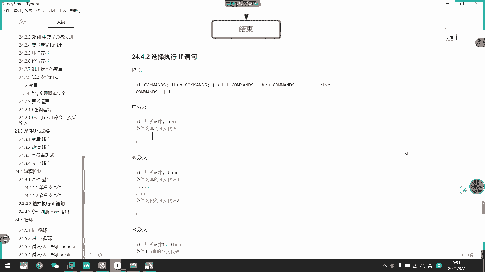

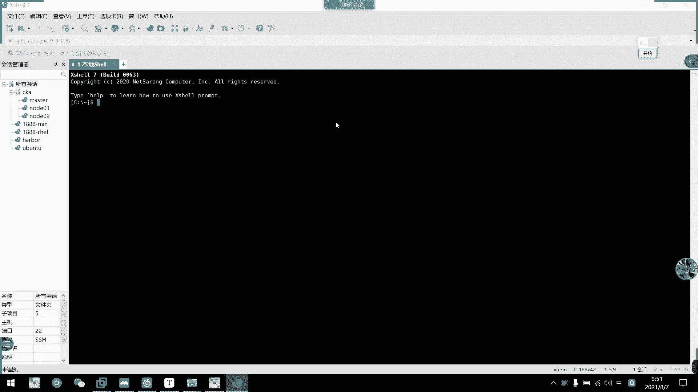

条件选择就像初中时学过的判断题，根据条件是否正确来选择分支。

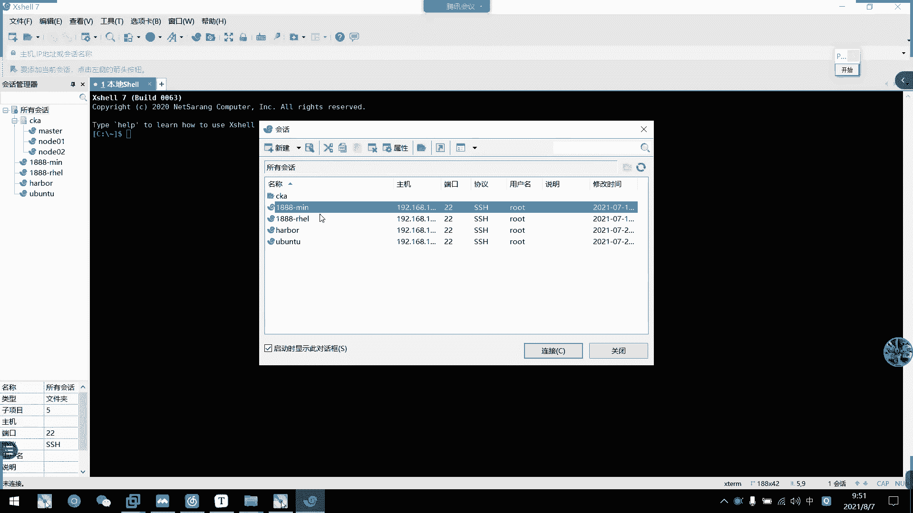

程序有一个入口，然后加入一个条件，例如 `A > B`。

如果条件为真，就执行一个语句块；如果为假，就直接退出。

这叫做单分支条件，它只有两种情况：对或错。

然后是双分支条件。

双分支也是一样，通过`if`进行条件判断。

如果为真，执行一条路；如果为假，执行另一条路，执行完后结束。

还有更多的分支，即多分支条件。

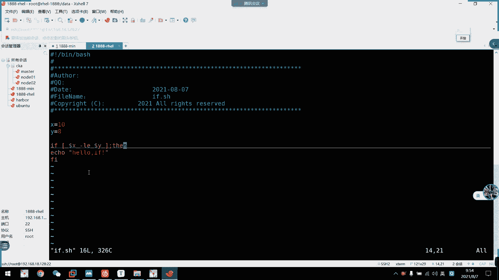

我们通过`if-elif-else`语句来控制多分支。

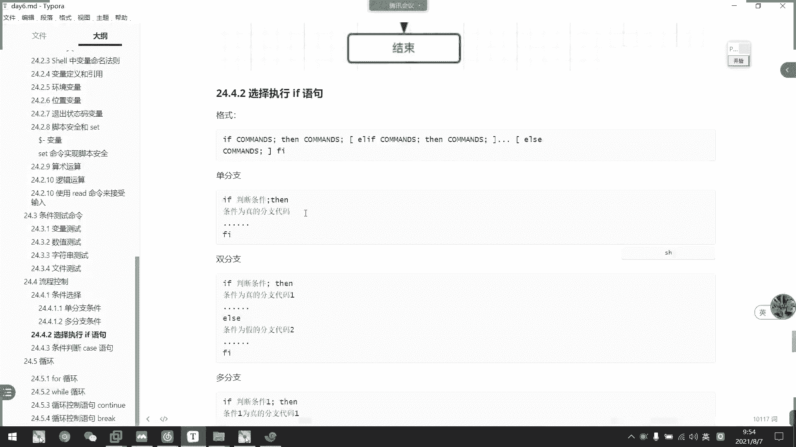

`if`语句可以写在命令行中，但命令行中使用`if`有点复杂。

Shell脚本一般用在脚本文件里，命令行中多数使用循环，例如`while`或`for`。

---

## 单分支if语句

我们先看一下单分支`if`语句。

我们来看一个简单的例子。

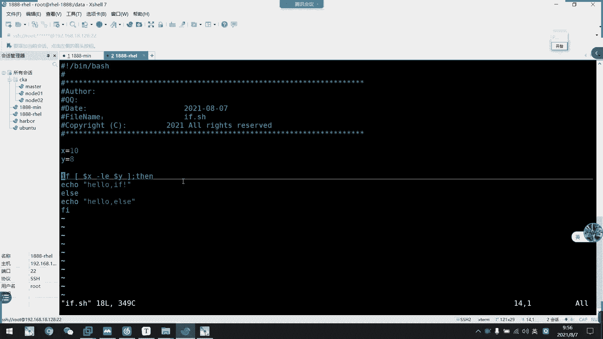

首先定义两个变量：`x=10`，`y=8`。

然后使用`if`语句判断。

`if`语句写完条件后，需要一个分号，代表条件判断结束，然后是`then`。

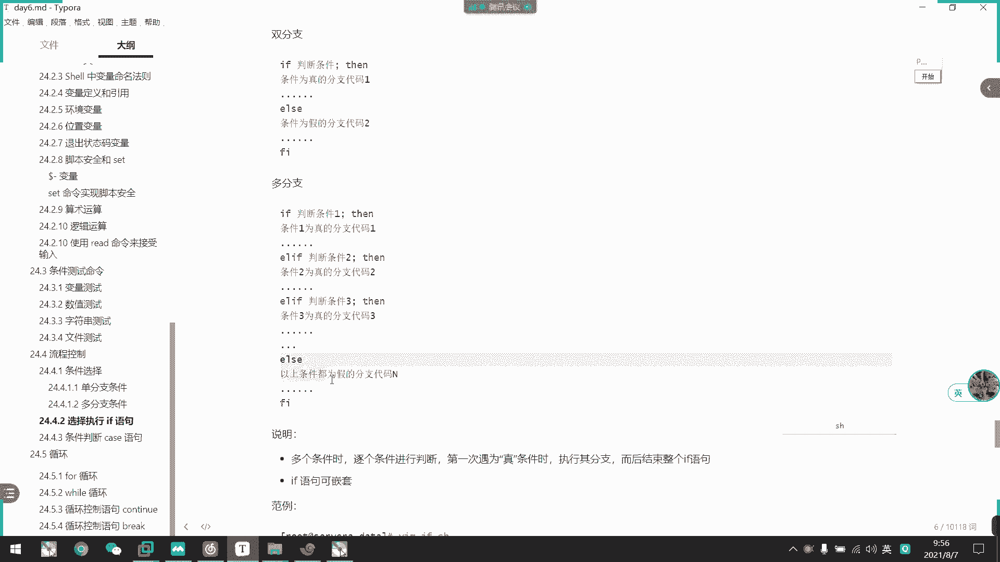

如果条件为真，就输出一个`hello`。

最后用`fi`结束。

我们执行一下这个单分支脚本。

```bash
x=10
y=8
if [ $x -eq $y ]; then
    echo "hello"
fi
```

脚本直接结束了，我们查看它的返回值。

`$?`的值为1，表示条件为假，直接退出。

我们修改一下条件，让`x`大于`y`。

```bash
if [ $x -gt $y ]; then
    echo "hello"
fi
```

现在条件为真，执行了`echo "hello"`。

这就是单分支`if`语句，如果条件正确，就执行语句块。

---

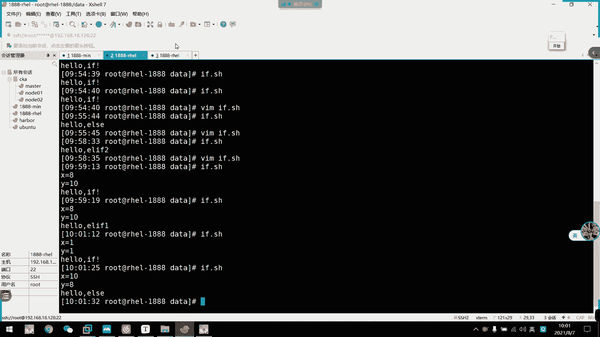

## 双分支与多分支if语句

接下来我们看看双分支`if`语句。

双分支使用`if-else`结构。

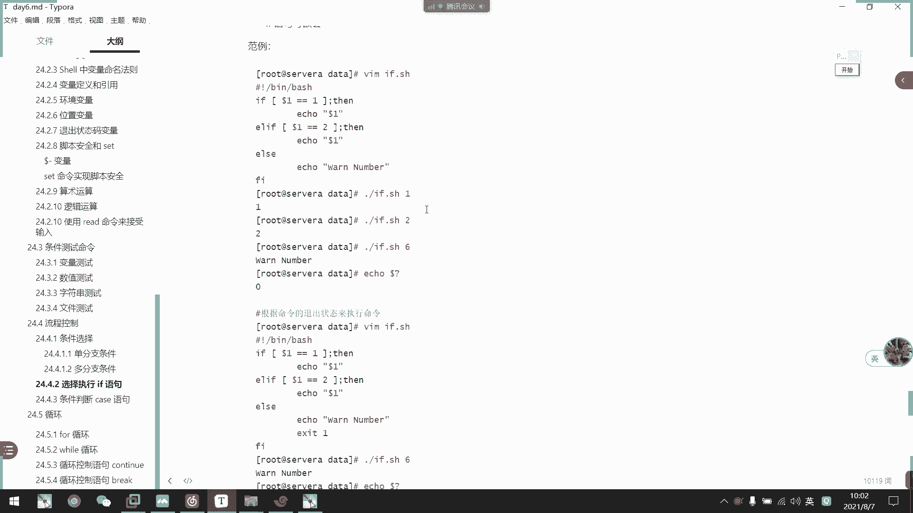

如果条件为真，执行`then`后面的语句；否则，执行`else`后面的语句。

```bash
if [ $x -gt $y ]; then
    echo "x is greater than y"
else
    echo "x is not greater than y"
fi
```

如果条件为真，输出`x is greater than y`；否则输出`x is not greater than y`。

对于多分支条件，我们不能一直用`if`或`else`。

多分支使用`if-elif-else`结构。

最后一个条件建议写上`else`，这是一个好习惯。

我们来看一个多分支的例子。

```bash
if [ $x -lt $y ]; then
    echo "x is less than y"
elif [ $x -eq $y ]; then
    echo "x is equal to y"
else
    echo "x is greater than y"
fi
```

首先判断`x`是否小于`y`，如果是，输出对应信息。

然后判断`x`是否等于`y`，如果是，输出对应信息。

如果以上都不满足，那么`x`肯定大于`y`，执行`else`分支。

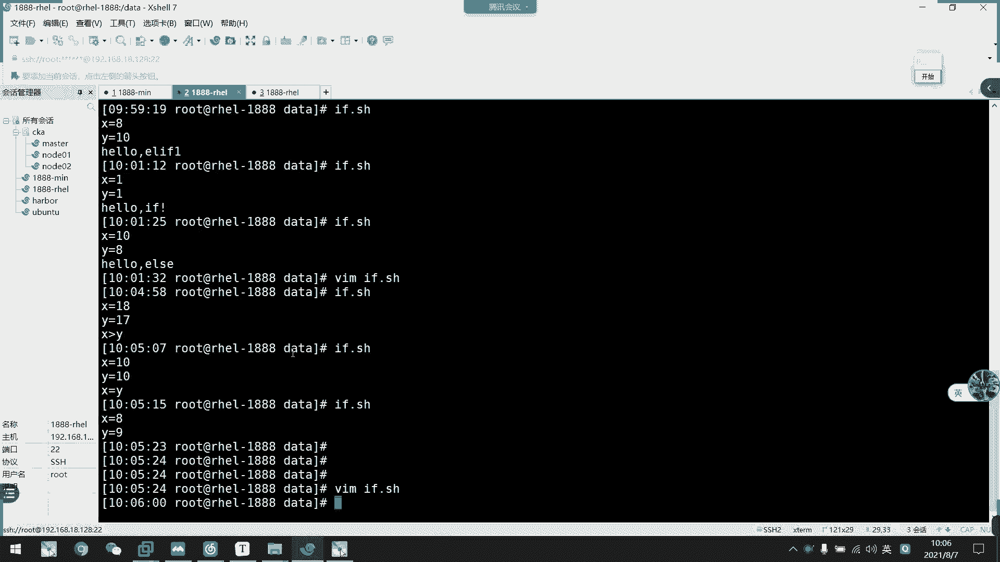

这是一个简单的`if`语法。

记住，`if`语句结束时必须加上`fi`。

---

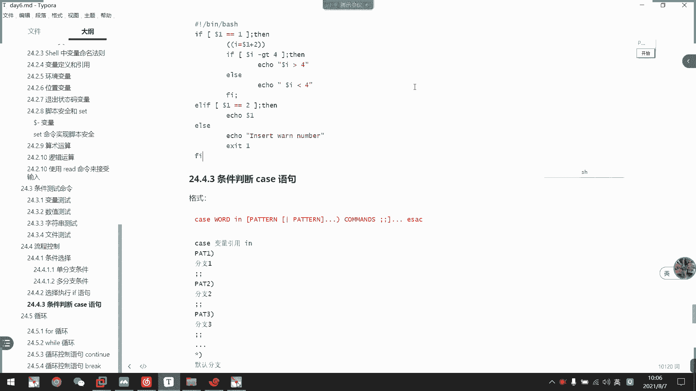

## if语句的嵌套

`if`语句是可以嵌套的。

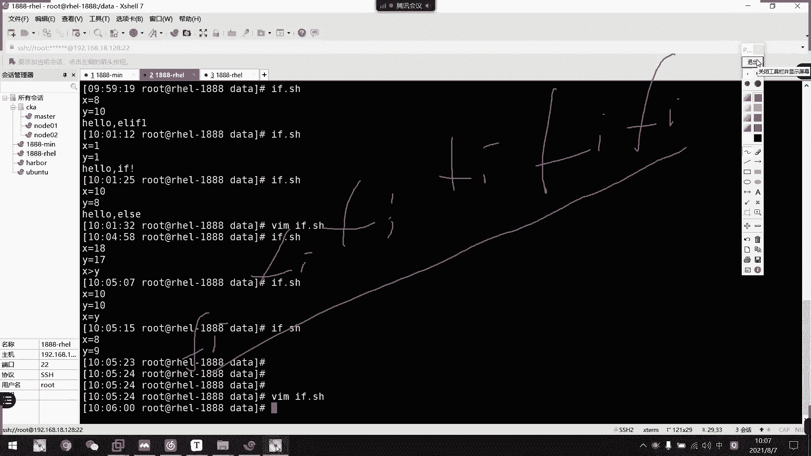

我们来看一个嵌套的例子。

```bash
if [ $x -ge $y ]; then
    if [ $x -eq $y ]; then
        echo "x equals y"
    else
        echo "x is greater than y"
    fi
fi
```

这个脚本首先判断`x`是否大于等于`y`。

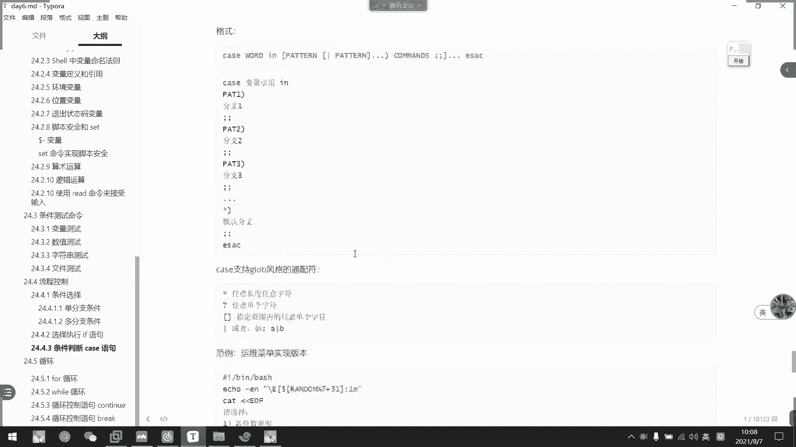

如果不是，直接退出。

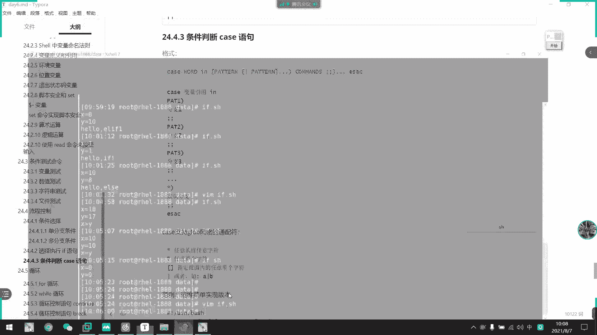

如果是，则进入第二个条件判断`x`是否等于`y`。

如果等于，输出`x equals y`；如果不等于，则输出`x is greater than y`。

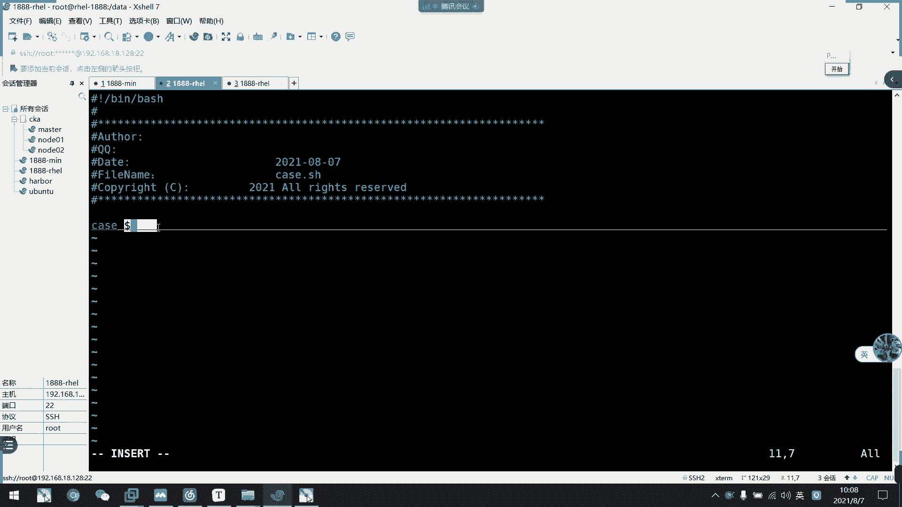

注意，只要嵌套了一个`if`，结尾就必须有一个对应的`fi`。

嵌套`if`时，条件之间一定要有关联，并且尽量少写无关的嵌套，保持代码简洁。

---

## case条件选择语句

第二个内容是条件判断选择语句：`case`。

`case`的语法如下。

首先，`case`后面跟一个变量。

然后使用`in`关键字开始匹配。

如果变量的值等于某个模式，就执行对应的语句。

如果都不匹配，可以设定一个默认分支或直接退出。

结束语句是`esac`（`case`反过来写）。

`case`支持通配符风格：`*`匹配任意字符串，`?`匹配任意单个字符，`[ ]`匹配指定范围内的单个字符。

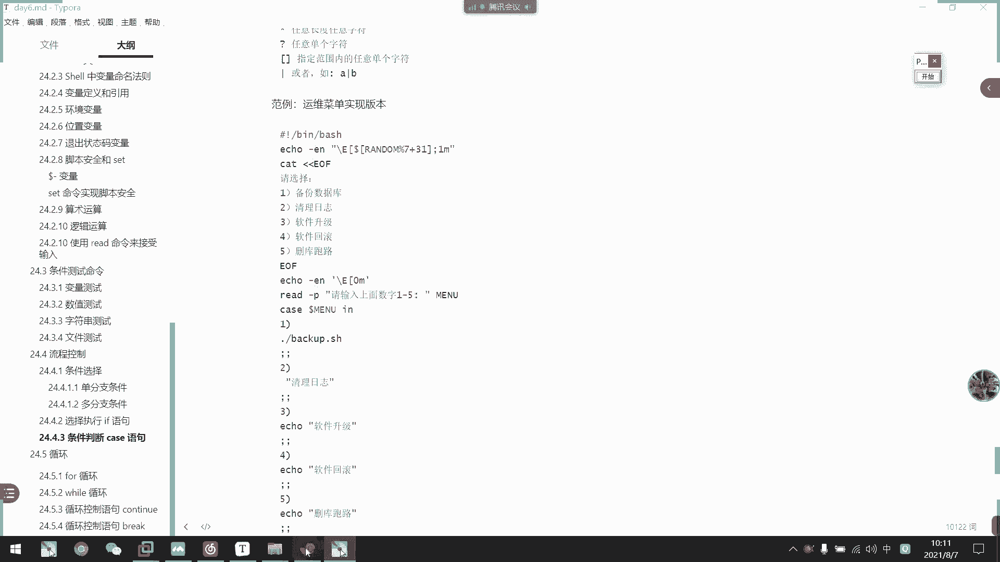

我们来看一个范例。

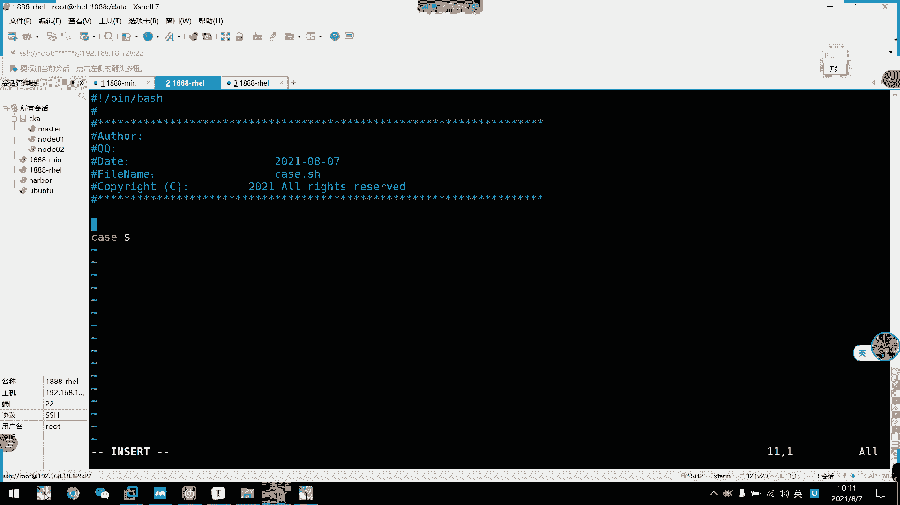

这个脚本首先定义了一个随机颜色，然后打印一个菜单。

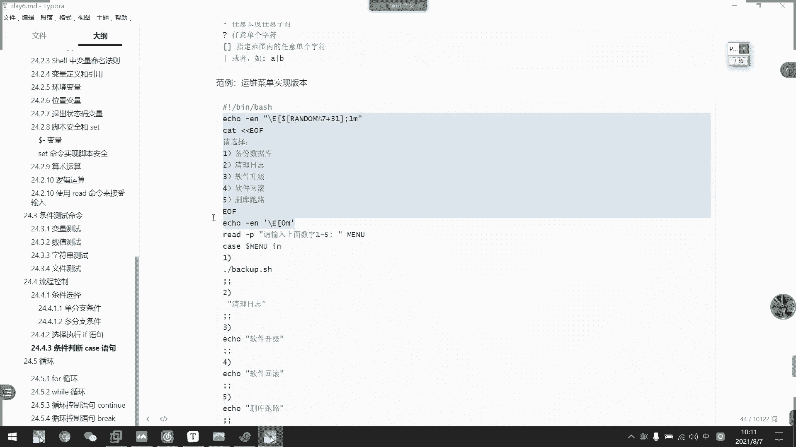

菜单选项有：1备份数据库，2清理日志，3软件升级等。

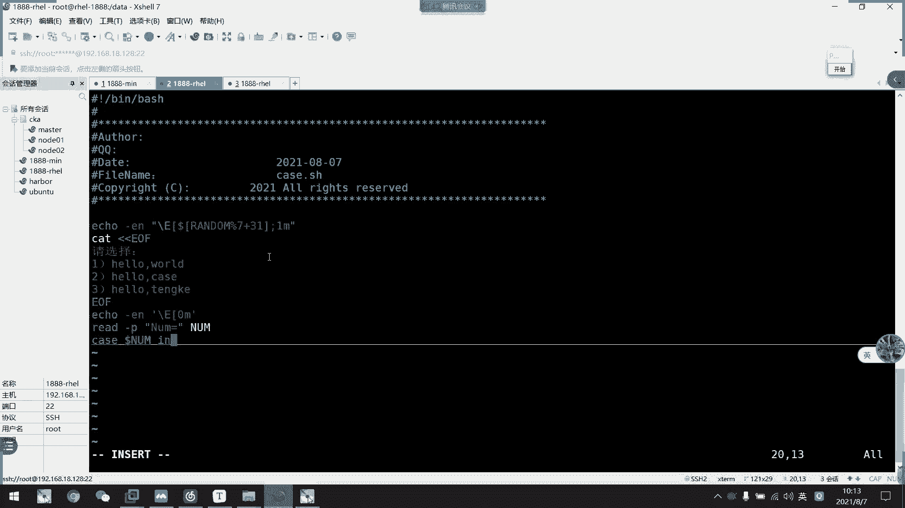

然后通过`read -p`接收用户输入的数字。

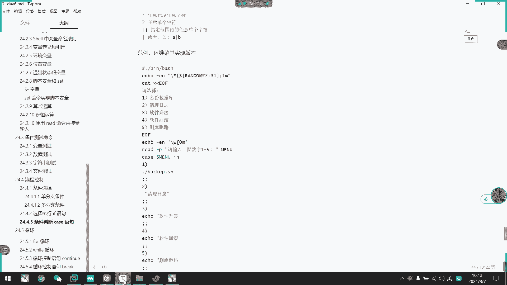

用户输入的值会传递给`case`语句进行匹配。

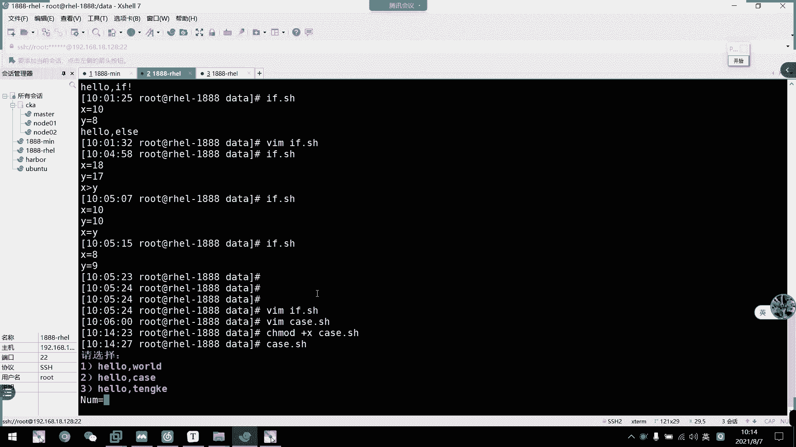

如果输入`1`，就匹配到`1)`，然后执行系统备份的命令。

`case`语句通常用于制作菜单，而`if`语句多用于运维逻辑判断。

当然，在`case`中嵌套`for`或`if`也很常见。

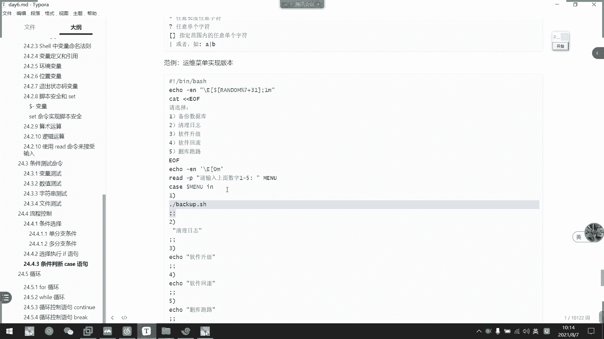

---

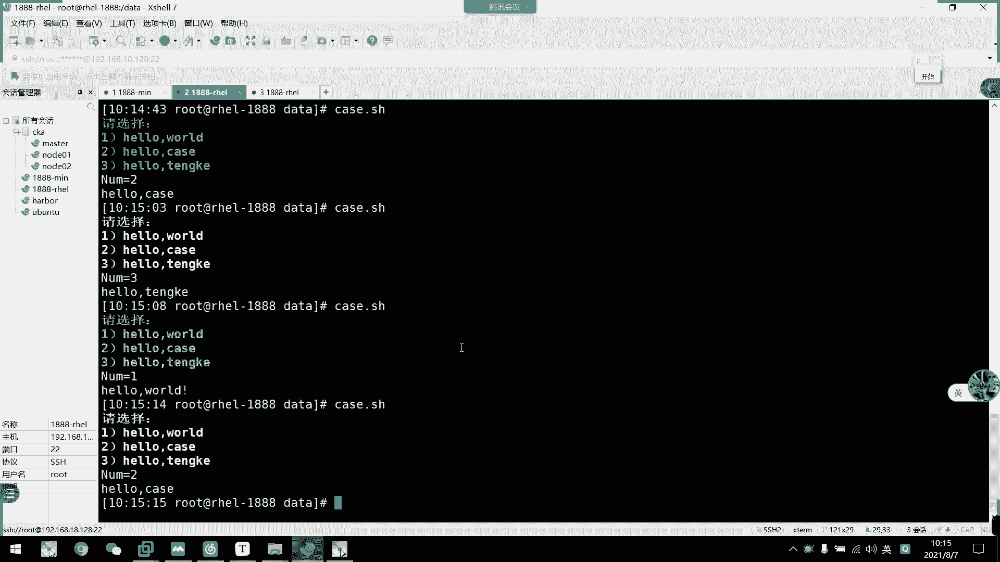

## 总结

本节课中我们一起学习了Shell脚本中的条件选择控制。

我们详细介绍了`if`语句的单分支、双分支、多分支以及嵌套用法，并通过实例演示了其编写方式。

接着，我们学习了`case`条件选择语句，了解了其语法结构以及它在制作交互式菜单时的典型应用。

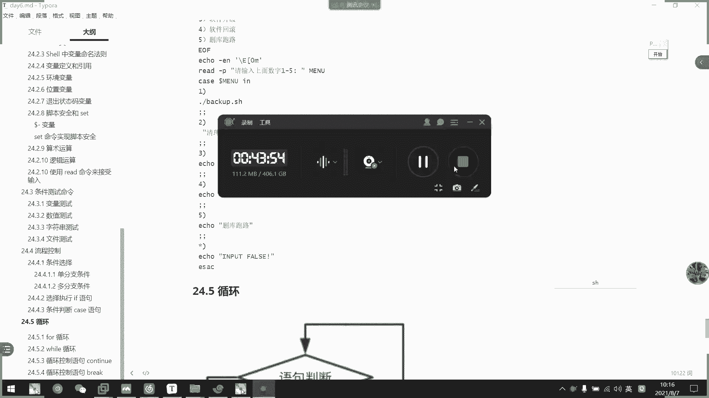

掌握这些流程控制语句是编写复杂、智能脚本的基础。