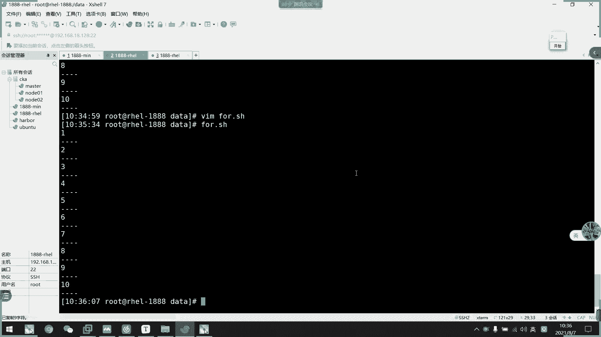
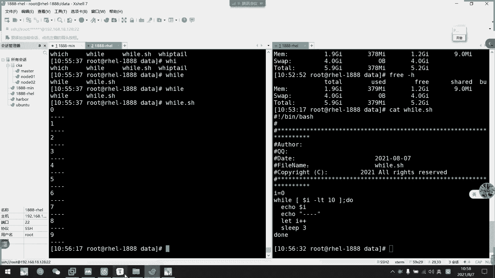

# 2021年7月新版-----RHCE8.2 RH124 RH134 RH294 认证课程 - P47：day9-2 循环控制 - bili_15701050454 - BV1Gy4y1T7ug

好，那么我们刚才讲了一个。呃，流程的控制。那么我们接下看一下这个啊循环啊，循环循环它无论是什么循环也好啊，它都一样的啊，是我们的一个也是一个。条件判断啊条判断。如果。这个条件是真的。

它就会进入我们的一个循环体啊，循环体。然后。徐文题。运行完之后呢，如果买它不买呃那个循环体。运行完之后呢，它会返回到我们的一个语句判断啊，返回过来。执行结束反过来啊，如果他判断啊还是真的。

那么他会继续执行啊，然后一直重复这个动作啊，直到循环到这个。判断语句是错的啊，是fort的。那么他就会。进入到我们的结束阶段啊。🤧啊，所以呢这里我们的一个语句判断是非常重要的。嗯。你看他每一次执行结束。

循环题，每次执循环结束，他都要回到我们的一个语句判断。啊，这说明什么情况呢？如果我们的一个语句判断。写都有问题。就一。无论他无论他怎么执行，他都是真的啊他都是真的。那么我们就会介入一个叫做什么呢？

是循环啊。这是有问题的一个循环啊。啊，但是有些方面呢也是需要使用到实循环的。啊，我们使用的话一般都用。啊，我们接下要讲的一个外文for的话一般不会写成呃，不会不会把它写成实循环。啊，我们先看一下啊。

我们的一个循环工资。好，首先是我们的一个for循环啊，for循环有两种格式啊啊，这个for循环有两种格式啊。首先第一种啊是forour。给我定一个变的名称。啊，然后一个是in什么什么什么什么啊。

这是我们的一个复值啊复值。就是说我们把这个wordors复制给那啊。然后呢我们的word。啊，主要这里是S啊，就说明它是复数啊，复形式。那么。啊，就可以把它们看作是一个列表啊，它是一个列表。🤧好。

然后呢。第完以后呢，它就会啊用do啊do啊就是做什么啊，do加commerce啊，然后是d完成啊完成。啊，这是命令行格式啊。然后呢我们看一下啊，在我们的一个。呃，脚本中怎么写啊。

是也是一样的wl呃 for，然后是do啊com，然后是down啊。我开车。

好。F。科选。For。I。好，这里是一个辩认屏啊，这是一个变认屏。我给他一个范围吧。一点点。是。那么。

这里是不是要加那个中括号来着忘记。

不用吧。后是度啊。做什么了？一口吧。然后在闭口。分割起来标示结束啊。我们仔细一下看一下啊。看到没有？啊，他首先执行第一次啊，然后返回执行第二次。嗯。😊，不用了。不用。我看一下啊，第二种写法。对不用啊。

我这个意。🎼要他慢一点。硬透面。加条件。嗯。不是这么说啊，也不是这么说，因后面就是复值给I啊啊复值给I，然后他就按照我们的列表循环。我们先那个啊。然后这里让呢。慢一点这行。过来看一下。要他追第一次啊。

第二次。第三次。第四次。对。第五次。第六次。第七次。第八次。我们这里很明显可可以可以看到它一个循环体啊。他第一次就执行了这个呀，对不对啊，这是我们的一个复选嘛啊，因为前面太快了啊。

我们根本不知道他做了什么东西，是不是不是？但是我们经过刚才的一个啊，让他sleep3秒之后呢，再执行第二次，我们就可以清晰的看出了啊。首先他第一遍。

我们的定义。啊，我们的定义啊，它这个f。啊，I。引我们的1到10对不对啊，这是1到10，那么它就会1234。跌1点跌1到10啊。一次一次复值啊，所以我一。运行进到里面去啊约到里面去。🤧咳。

就复制给I啊一复制给I，然后呢我们就可以啊执行一个东西，它不一定要打印我们多少I，他可以做其他动作啊，只是说我们这里把它写示出来啊，让大家看的清楚明白一点啊，然后是。呃，这里结束了。

然后我们就把二复制进去啊，也是执行一遍啊，也执行一遍。然后直到呢它到了10。那么他就直接结束了，对不对？那直接结束了。这里这这个能不明白吧啊。可意见吧。它变成一步一步做了。

我们刚才通过上面啊睡眠上面的例子，我们就可以看得出啊，它是先执行一杠杠干啊，然后再执行二杠杠干，然后是三杠刚干这样子对不对？啊，这是我们的一个for循款啊。不习惯。呃。那么我们接下来看一下。呃。

🎼我做定制。我定制。我这里第一个。啊，不行，这个做不了。

要用另一种写法啊，就是我们的一个方法2啊。等等啊。格式2。好播同时这里大家可以看一下呃。这是计算我们1到100，其实跟刚才是一样的啊。所以它呃定义了一个值啊。就说明你一个值啊，要用于存放我们的盒啊。

用于存放我们的盒。那么我们第一个就是哎。然后这里是100，对不对？啊，1到1001到100，然后他一开始0嘛，然后0加1，那么它就等于一嘛。然后第二次循环，第二次循环就是。I就变成变成二了嘛。

就变成一加2啊，然后等于3啊，由此类推啊。有啲睇。有是2加3啊，有2加3。等于我然后继续啊上降5。啊，一直往下往下往下，然后直到我们的一个呃上，我也不知道等于多少了啊，加100这样子。

等于我们的5050。嗯。然了我们看一下第二种格式啊，第一种格式呢是我们。呃。一些在命令行中常用的啊，就好像老师上周不是用过一个呃。

创建账号吗？嗯。推荐账号就是说我们那个phone。I think。比如说我这里要创建三个账号，一个是。呃，张三。你是。1五。啊，如果我们平常自己。去一个一个创建的话，我们是不是要。

对他们啊每个都要写一遍他们的一个min令行啊。就是说啊比如说我要创建张三，我就loer。带的什么张山。然后。在UC add。你是在个右色ad的。五这样子啊，正常来说我们是发了三个命令他去写嘛。

然后我们区块的话，他会就可以直接用。这里。过来。啊，这样子一条命令让他们自动执行起来啊，当然啊他这么一个短命令的话，感觉还是这样子比较舒服，对不对啊啊，如果我们是要用到很长的命令了啊。

后面那个那个那个水管体很长的很长的。有没有想啊？就肯定是要用到放水嘛，这样子比较舒服啊。哎，等就创级出来了，我们来填一下。啊里看这是创底出来三个字号。啊，然后我们看一下第二种。

说实话的第二种。啊，就是双小双小括号方法。说小波分吧。🤧。好，然后呢他这个双小括号呢是用于运算的啊，双运算。然后。他这个死多文那可需要了实现我们的一个戏园风格。戏风格。

其实它这个第二种风格就是我们的一个戏有风格。如果你们学过戏园的话，可能会觉得很类似啊很类似。好，我们来看一下。啊，首先它是一个运算是一啊，只有到运算是2啊，然后是运算是二的，如果它条件为呃错误的话。

那就会呃结束我们的循环。如果它是真的话呢，它就会啊。认为是真的，然后进入到循霸体啊，然后循环体结。我们习管你结束以后呢，它再加一个运算商运三的结果。负值给我们的运运算2，然后再判断啊，再判断。

一直判断一直判到一直判断这样子。我们看一下范例。先看下歌手吧。啊，所以是from。这不是写的有问题。这些的问题。对下的是预算一预算二运算3。啊，其实一的话呢就是一个。开始语句吧啊。然后这里二才是判断。

三就是真正的一个运算啊。还要他做什么大把。

我来看一下。我们看一下。啊，叫做。送下四用佢剂噶啦。4our。🤧呵。写什么好了。I等于。0。小鱼。L是。在这。啊，这个要注意I加加啊，I加这什么东西啊？阿加加意思就是。没开发基础的话，很难跟你们说。

但是在这里下午的话，我们就讲一两种嘛，就I等于。I加一啊字加一的意思啊，I加加。啊啊把它放回来就是。怎么说，那个等号。😊，呃。还有一个叫做什么I加等于。E啊，对不对？说还有一个加等于一。都不一样的。

它一个是还有一个I。谢谢个鱼。啊，这个不好说啊，我就。家的鱼的话啊，我也弄没没没弄好，还还有一个。叫什么？呃，加等于I啊，还有一个加等于I。啊，它这里顺序是有关系的啊。如如果是我们I加等于的话呢啊。

它是先执行I啊，先执行I。如果是加等于I的话，它是先执行我们的前面的，然后最后执行I的，最后才复制I啊。啊，对啊，加加II加加加加I也是一样啊，显实是E加I呀或者是I加一这样子。

它是有它是有它的一个执行顺序的啊，有一个执行顺序。但我们这边啊只讲述这个I加加。如果有兴趣的话，这大家要学习一下这个系语言啊，在校其实没有讲述到这个东西啊。但是系语言会讲述到这个啊一些。约束表达式啊。

对啊，I要加的话呢就I等于。I加一啊字加一，反正就字加一啊。应该说是开发基础吧。他基本上所有的。语言他都要有这个东西了。

。是不是不用。

第二，为什么他。这里是白色的。怎么说把这一把说。哎要做什么呢？呃，还是一口多了挨吧。就别个风格 say sleepep。两秒吧一秒吧，不要太强了。我们来看一下啊。先执行一遍，然后再分析。哎呀，什么鬼？

Tomorrow， from。哪个什么老板。哦。咋了。不是不是不是。这里。0123。4。67。啊。就是哎没有事啊。特别有事。对啊，他刚刚那没有一口啊，三个杠，他说没有这个命令啊，没有这个命令。好。

聊后到刚才我们做了什么东西。刚才啊我们做了什么东西啊？首先是第一个I等于你。R等于0啊，它进入判断啊进入判断。就换到，然后呢就是啊等于0嘛，零就等于10，对不对？十就是为处嘛。为错他就打印这个东西。

回说他要打印这个东西。就执行我们的循环体啊，所以是0杠杠杠，对不对？啊，然后是睡眠一秒，睡眠一秒以后呢，他就执行这一个啊。这是一个。I加加，那么就是I等于I加一吗？那么就等于一嘛，然后第二次执行啊。

就是就变成一了，不不要这里了啊，记注意啊，不要这里了。不要这个啊后。就是一还是小于十0，对不对？一小于10。然后他继时执行这一个啊。就这个那个打印一啊，然后是刚刚干，然后如出来可倒9。到9。一直到9。

那么九还要小于什么呀？所以他还是打应个9点点点点啊，然后。再回来加加加。加加啊就等于十了，对不对？十的话它就等于了不小于了啊，十等于十0对不对？所以是for了嘛。fs然后就退出去不航了啊。

那就当退回去款了啊。啊，所以这里我们要注意一下，这里要注意一下。🤧。好。啊，这是我们的if服的第二种写法。if服的第二种写法。啊，他这种的话就灵活一点了，比较灵活啊，比较灵活。嗯。那么for的两种写法。

大家啊有没有什么问题啊，有没有什么问题？

我觉得他第种写法也可以这样做。啊，后的两种写法有没有什么问题？同学们。两种写法都很常用的啊。那样解法它很常用。那么如果。没有问题的话，我们就看一下wi循环啊。W循环。W呢它的一个循环就比较。呃。

简单一点就是直接wl，然后加一个com啊。不这个可吗。这个卡怕呢是我们的一个叫做条件判断卡。调节不动。他跟也不是类似的。这个条件是跟以说类似的。那么如果他这个为出呢。它会进入循管底啊，就会进入水管底。

接水花底，然后去做我们的这个水花底。然后呢，直到他一个结束啊。有他的一个。脚本写法啊脚本写法就是w，然后加我们的一个条验判断啊，然后是do续环题啊，然后是续环结束。那么。啊，我们说了，如果他只要是处了。

他都会进入去嘛，对不对？啊，所以我们Y是比较具有时序化的。我们就简单这样讲啊YO。Shu。额度啊。嗯。hello，同学们，我们这个直播就是死循卡了。我们上前面是不是说过啊，有一个呃。有一个逻辑预算。

它就是一个处。错觉是一个命令啊，它就永远等于你，对不对？热抖音。意味着嘛。那么我们这里输入一个入。其实其实它就是一个迷你科曼啊。

它就是一个口板，我们可以看一下啊，上周其实我们讲过的处啊。那我们看一下这款位置啊。你他是不是永远都是为真啊，记住啊，我们处。真唯一啊，但是多ra问号0才是真啊。

所以他有冲多刚刚回顾的时候已经讲过这个问题了，对不对？啊，所以我们这里要注意一下。打触。所以它永远是为帧的啊是为帧的。所以我们这里可以看一下。あそ。杜什么？我们就。一口个。看到吗？他钥匙到。Well。

Shu。哦，就是写错了。对啊。死去快乐。我们可以观察一下它的一个变量啊。呃，他的一个那个。这婚。还好他这里。用的不会太多。这实情况，他只打印哈lo的话，它没消耗掉要太多的内存了，还是比较好的。

说37839，那就。比较稳定一些啊，但是如果是。碰到函数那个先先有炸到的话，那可能就直接会AOM了。啊，那倒不会，他如果只是这个小小小的死循环，他执行的东西不多，他。

那个命令啊主要是它这个命令啊对内存的消耗不大，对内个消耗不大的话呢，它。影响也不会很大啊，影响也不会大。啊，但是尽量不要写这个这个啊，有一些呢他会测压啊，就要写一些啊就在测试环境上面测压。

就要写一些呃比较压力比较稍微大一点点的死循环去进行测压的啊。啊，所以啊他这个使使用它也不是说完全没有用啊。

啊，我也循环啊，这个写了1循环。啊，然后我们看一下这个w啊，看一下这个w。

哇，然后呢我们说这里是可曼，那么我们条件判断是不是属于可曼啊？那么我这里加一个条件叫做I。小于。这是多少？今天。到二。聊T吧，我就。然后是度。那我们前面这里啊得复制啊。i 等于呢 啊 i等于。都什么了。

我就直接一口一口。嗯，还是一样，一个多少爱啊。然后这里在。一个横线。呃，是记说这里也要加一个I加加。大这时只是不聊了。最后。现他睡3秒钟。一个结束。我看一下这个行不行啊。好，休息一下。就边有个歪在这里。

L。啊，睡了太久。这个睡眠一秒就够了。可以追意到他现在是。加一对不对？啊，这里应该要结束了。也是到9也是到9。那我们来看一下。看一下这个。啊，我们看一下。脚本它为什么执行会是这样子的啊。

首先我们给它定义了I的初始值为0，对不对？数始为0，那么它就进入到我们的一个填方段啊。well然后呢多少I一开始是零，对不对？零肯定是小于10。所以说那么它就为tro嘛。

为 two的话呢就进入我们的循环体直行这一个步骤啊。所以是打印我们的do了I啊，然后呢打印分个符啊，打印分割符。然后呢呃这两个可以随呃随意加在哪里都可以啊，随随先随后都可以啊。我们来看一下量。啊。

然后我们看一下呃letI加加。I加加，然后这里运算结束以后，是不是I会等于一啊，I等于一，然后顺备。🎼然后呢，他会继续把结果交还给到我们的。🎼因为我们IC在是等于一的嘛啊，I等于一。如果不运算I的话。

它就会执行其他的啊。其实我们这两个要有一个关联性啊有一个关联性。不然也会进入一个市情吧。因为我们在脚本当中我们I的话等于零的话，你不让它做一个变值，不变值的话呢，它就永远都是处的啊，永远都是处的。

那么又进入了一个死循环，对不对？好。那么我们基呃这里运算为I加加以后呢，就I就等于一了，它就复制过来。那么一还是小于1嘛，对不对？一还是小于10，然后呢，它也要打印打印一，然后三成杠，然后再运算啊。

变成I等于2了嘛，对不对？I等于2了。第二次。然后也顺便消灭，再把I的值付给来，付回来Y继续运算，于此类啊，于此类推一一直到1啊，那么到十以后呢，它就等于了嘛，等于了。那不就结束了吗？啊，对不对？

他就会force了嘛。啊，结果for，然后他就结束了啊，这是我的w循环啊。不好循环呃，一定意义餐呢还是比我们的for牌要简单一点点，但是他们的用途不一样啊。

啊，我也这里也不好说他们的一个他们之间的一个。呃。他们之间的一个。采用之处吧。大看这里也是一样的一个。就不啊。跟我刚刚实验的是一模一样的啊，基本上是一模一样的。只不是我就用了let。

它这里啊它也是用了let的。我这里用的风割服，他没有。好，那么我们。for循环跟well循环都介绍完了。那我们看一下一个关于一个循环的控制控制语句啊。呃，会有就有两个啊，一个是continue。

一个是我们的break啊。朋友们看一下肯定留有什么东西啊。

我们先看一下客厅里。左P来着修NTIMUE。这个先把它拉回来啊。啊，我们说他是一个循环工资，那么我们直接就写个Y循环吧。还是要多少。杠交替室吧。嗯。えと。后来哎。There's a。还是分割服。

谁在哪里。我觉得他要一个条件判断嘛，对吧？

在这里就去吧啊，哆哎。O了哎。等于4。然后我们来个。有没名做啊肖恩。TRU NE。

肯定有。So你说了COM。

T， IMUE T， IMUE。然后还是sleep。有秒。然后再一个let。姐姐。都来个大把。呃。好，我们支行一下，看一下这个脚本。0啊，没问题啊一也没问题。You。什么 you。看到没有？啊。

他进入了一个死循环。所刚才我们。我我练了污了。可能是比赛的问题。Gillian Yu。U哎也不会练就练油。好，刚刚有没有发现什么问题啊，他一直在是这里进入了实循环。在是这里进入实区环。有注意到问题吗？

大家。嗯。那同学们有注意到问题吗？啊，对，每次性爱佳佳。每次就爱家家。IE的是4没加。对对对对对。但是我们不应该用wi，wi耳的话没那么清晰啊，是这样子的啊，break啊不啊，这个是contin了。

continuecontinue呢，它就是等于是。请假了。请假。就是说当我等于是的时候，我就请假，但是我接下来还是要。继续工作，对不对？还是要继续工作。那么。我们这里。他等于是要请假吗？所以是0123。

我还是有执行，然后4到这里我就请假了，后面就不做了。然后他还是等于4他又返回这里啊，然后I等于是是不是记录死刑嘛，了后他又打印到这里，然后请假又就是运行请假技续运行请假技续运行。嗯。所以我们这里。

这个例子不太好，我换一个。感觉就。I。I等于0。就是哎。小于10，然后是。这这。那我这里这里还就不要了。这个空格给不给都可以啊，自己喜欢就可以。我们再看一次啊，重新看一遍。我们重新看一次啊。

🎼用for环会比较好看一些。最啊言月。嗯。3。Sn。你没注意到。看有没有注意到是这里执行了什么东西啊？大家有没有注意到，有没有同学注意到世界里自己的什么东西？有没有同学注意到？可以看一下。他这里应该。

没有人注意到吗？啊，美瞳都注意到吗？打印了是打印了，但是。他就没有做实力2秒啊。对啊对对对对对啊，所以他后面就请交了。然后它这个循环还是会结束的。就是说我肯定扭的话呢。

在它等于是我就把它这里后面是后续的给停掉了，给停掉了，然后它会继续运行，继续运行，继续运行这样子。啊，这是一个大学问题啊，所以我们可能看的不是。很理解啊。

我们再跨一个例子啊再换一个例子，就多签到一程，我们多签到一程。多了个阶层。不熟悉，我直接复制啊。

再书写就没时间了。放这里不需要加睡眠了。好，我们执行一下。好，我们直接回头看。直接回头看。好，首先我们这里呃最后才打印一个多尔海嘛，对不对？俩。签到循环啊这个。我我看一下。啊。

首先我们看一下他做了什么东西。啊，所以是。I等于0，我们进入循环啊啊III小于10，我们进入循环，对不对？肌肉循环，然后呢。那么金入循管新循管里为一个嵌套的for啊，嵌套的for。

那么我了这个for啊就是要把这个Z正常来说要把Z给运行完。所以我们这里是1234。啊，然后五没有了啊五没有了。啊，我没有了。啊，一要正常来说啊正常来说我没有这个的时候啊没有这个的时候啊。啊。

我就一定要一直往下吧，对不对？啊，123456789。带出来啊，然后就都来。啊，后面也是一样的啊，后续也是一样的，它没有了5，为什么呢？我刚说了五等于提交了，那么我1到5。后续的就不不做了啊。

后续的都不做了啊，后续的不做了啊，不好意思啊，这里少多了，我们要注意啊这个f对应的是这个down啊，后面的就不做了嘛，对不对？像我们刚才啊sleep啊没有了。就说他请假了。提交。

然后但是我们这个循环并不会结束，它会直接进入到下一个循环。那么我们就进入到6啊17啊，8910。啊，89然后打印出来，然I是不受遗产的，注意啊，I是不受影产，对不对？啊，I等于4。6。Qi。对。酒啊。

别看爱吃不是影响的。因为我们肯定就控制的是啊他所在的城啊，如果我这里。灯呃改成是2，我看一下啊。Okay了。好，感说啊啊。那我们执询一下。你看就变成这个样子。我看一下他做了什么东西啊。

先贴一下这个给你们可。好，我现在是改的是2，对不对？那么我还是一。啊，01234都能执行出来，对不对？01234这样作用出来，但是呢它下一个循环就变成01234啊，又是01234，它Z没有5了啊。

5以后都没有了，包括I它都没有打印出来，是为什么了啊，I也没有打印出来，是为什么呢？是这样的，它的一个执行顺序啊，首先是我们I等于0啊，对的吗？对不对？I等于0。啊，210它是对的。

所以它进啊还是进入我们G循环啊，J循环。然后呢。呃，Z循环也是有J等于零开始。然后小于10以后呢，我们接下加正常来说，我们也是达到0到呃0到9嘛，对不对？但是我们这来加了一个条件，就Z等于5的时候呢。

我们就执行这个contin2啊没有2，那么我们就1234还没问题啊，1234还没问题。那么当是我们Z循环没有结束，既证明我们的f的循环题还没结束，所以它不会打用我们这个啊多了II等于多少哎。

那么当我们Z等于5的时候，它就执行了肯定肯定什么意思啊？就是把第二层。第二就循环嘅。肯定留到了啊，就暂停了。降停了还是那一句话，但虽然降停，但是不代表它结束啊，所以我们这个I加加还是有工作的啊。

I加加是有工作的啊。但是我们这里啊后续的都停掉了啊，包括一口一口J啊。包括A口I，还有风割线都没有了，后面这里都不做嘛，单它等于5的时候，后面这里都不做嘛，但是它曲部还是要继续的。爱的序求还是要继续的。

所以他又进来了。然后是从56781直开始，所以我们啊J0到4是打印了4次。这个明白不？啊能明白不。就我们肯定也是可以通过数字来控制它是停止来一层。啊，我定义在这一层说明我是最内层，所以可以忽略不写。

其其实它是等于一的，可以忽略不写。但是我二的话，那就是它的上一层。所以说。这个可以理解不？啊，同学们。我擦一下给你们看一下。没懂那个2啊。呃，2的话就是我们把G层停掉嘛。

他就控制了这一层嘛啊啊控制I层嘛，说错了，控制I层嘛。追类成为一啊追类成为一。然后。它的上一层就这一层嘛，对不对？那不就是2吗？最求为一，然后再求为2。明白吗？因为我这里还有一个嵌套的话。

它外外还有一个外圈的话，那不就三吗？啊，对呀对呀对呀对呀对。这是异常循环啊。啊，其实我这里已经有解释啊。

呃，你看提前结束这一次。Continue。啊，M啊这个提前结束DM层的一个本轮循盘。最要适本的去吧，然后是。进入下一轮判断啊，然后这里车为我们的第一层啊。最内层注意啊，是最内层。并不是说他写到哪里。

就是哪里是最个钱。如果我。里面还有一层的话，那这里也是代表他借力车而已。它这里也是一个第一前解锁I。肯定是饿啊。对不。好，这是我们的肯t定。它是提前结束啊，提前结束。然后我们看break。

break我们看先看一下效果，先不讲它是什么样，我们先。看一下效果。就break这个车我们不陌生了，常见到了。应该吧，我们。要不就测试一下先。我们把这个肯定扭。是的。はい。分开价。嗯。

等到现在停止是哪一次啊？嗯。你呀他写到哪一层，他就他就是最内存啊。他想要来一生，他要追一层，现在这里就停掉了啊，我没有了，对不对？然后我写到这里。他就是最内存啊，把他自己I停止掉了啊，把I停止掉了。

反正他想到哪里，就是从外一层开始锁啊，然后它第二呃外一层就是第二层这样子U水啊。Okay。我们那么继续看我们的breakak啊。还是一样好，用我们的火手棒。嗯。还是先看。那个。这个。写到上面去吧。

我们这里。价格调件啊。I。EQ啊排45吧。那么我们就执行这个bra。直接上。小温度。可以了啊。让我们来加个权限。嗯，我们可以看到啊break。他当它等于5的时候，它只系了我们的break，对不对？

他叫什么啊？对啊，我就直接退出了。这叫做。提前退出询问题啊。提前退出去问题。break就停停止啊。提前结结束循环，coninual是结束本能循环break是。直接结束掉循环。能看出啊能听出他们的。啊。

不同知出对吧？啊，break他就直接是退了啊，以后都不来了啊，肯定的事请假了，我下一周还来啊。对啊，我就直接跳出。那么我们还是刚刚那个例子在加。4。C等于0。在。呃，也是一个。Z加加。赌吧。一样吧。

要多少斤。有一个分割线吧。到，这里结束app。我们先看一下。好，那么目前的话我是把它放在这层的啊，我们看一下啊。执行。对。是不是这里写的有问题了？Ling。谁谁谁留问题了，不应该写在这里啊。改一下。

是在这里可以。再执询一下，看一下这果。对啊。啊，营样设题验结束啊。可以看到我们01234啊，然后当它J等于5的时候，我们就结束掉这个J的循环，对不对？就束到这的循环。

但是我们的安循环还要继续啊啊安循环要继续啊，对不对？所以它I等于0。啊，I等于一。2。02。I等于3啊，UC列一直到I等于9，但是Z。他从来不会出现我。啊，包括5以后啊包括5以后。啊，所以。

规壳是直接把它给遮掩掉，直接退出啊。然后呢，肯定你们是指提前结束当当前一轮的循环啊，这是他们有两个的区别啊。

好了，那么我们这个校的一个流程控制跟学控制我们。讲完了。啊，包括它的一个控制，我都讲完了。所以我们校这边呢我们就结课了啊，校校这边我们就结课了。啊，如果有问题可以在客人这里提一下，我们现在休息啊。

说15分钟啊。

