# Linux Shell脚本编程：循环控制

在本节课中，我们将要学习Shell脚本中的循环控制结构。循环是编程中用于重复执行一系列命令的强大工具。我们将详细介绍`for`循环和`while`循环的语法、工作原理以及如何控制循环的执行流程。

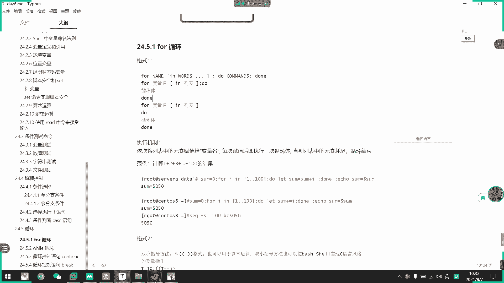

## 循环的基本概念

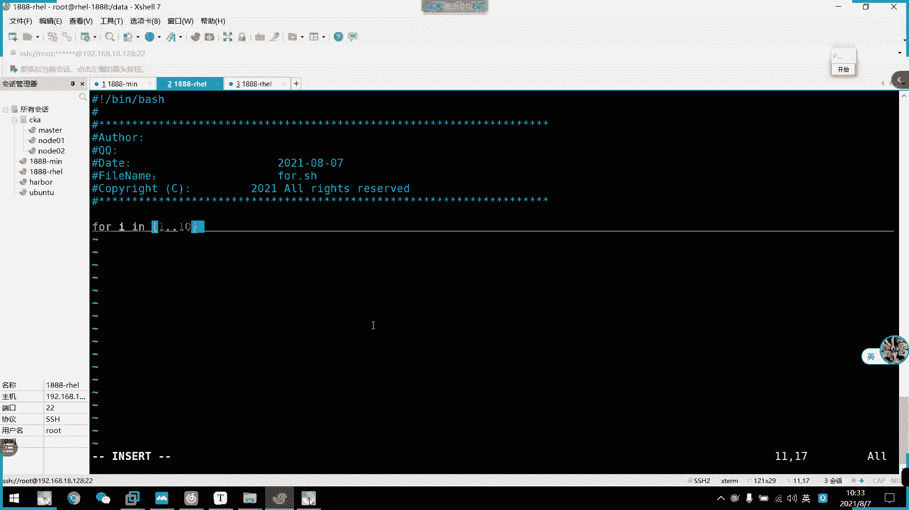

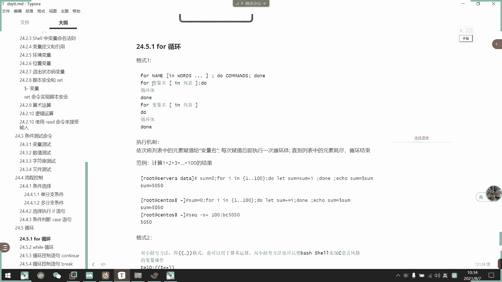

上一节我们介绍了流程控制，本节中我们来看看循环。循环，无论是什么类型，其核心逻辑都是基于条件判断。如果条件判断为真，程序就会进入循环体执行命令。循环体执行完毕后，会再次返回到条件判断语句。如果条件依然为真，则继续执行循环体，如此重复，直到条件判断为假，循环才会结束。

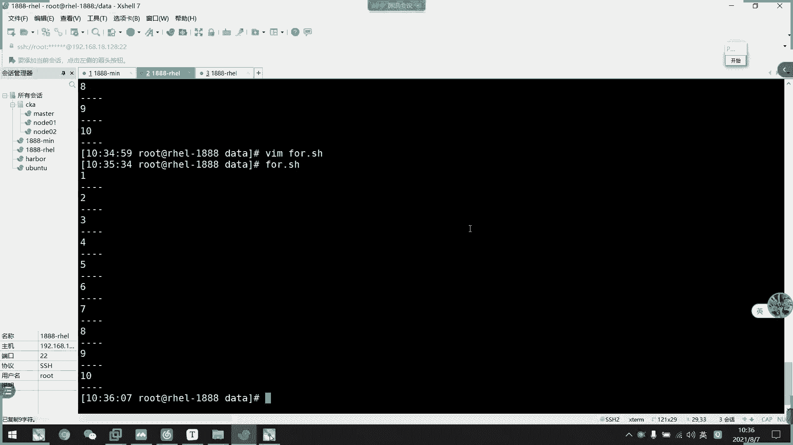

这个过程中，条件判断语句至关重要。每次循环体执行结束，都要回到这里重新判断。如果条件判断语句编写不当，导致其永远为真，程序就会陷入“死循环”。虽然某些特定场景（如压力测试）可能需要死循环，但在`for`和`while`循环中，我们通常应避免这种情况。

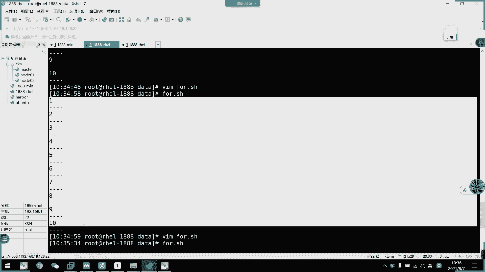

## For循环

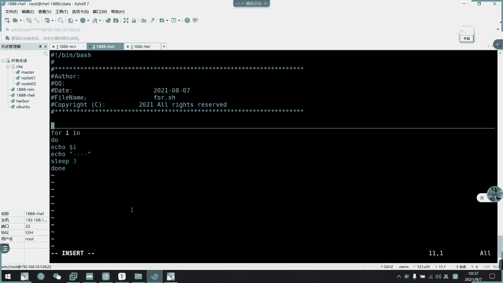

`for`循环有两种常见的格式，用于遍历一个列表中的值。

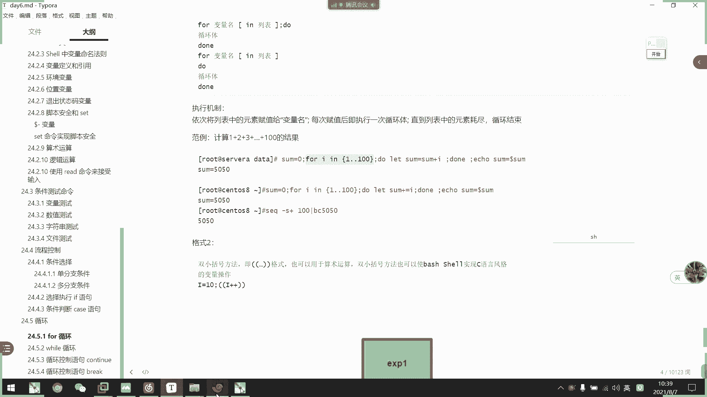

### 格式一：列表遍历

这种格式常用于命令行或脚本中，用于遍历一个给定的项目列表。

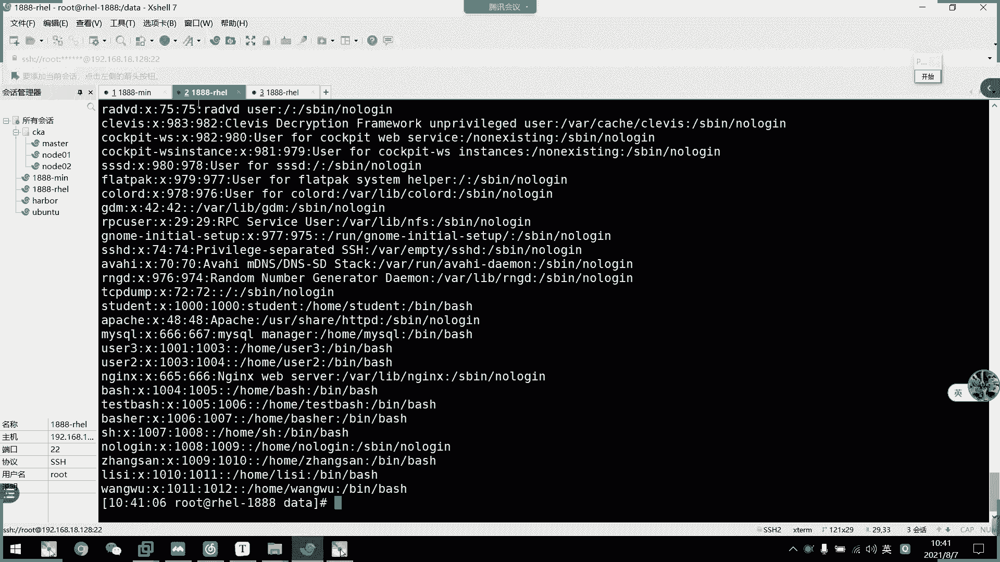

其基本语法如下：
```bash
for 变量名 in 项目列表
do
    命令序列
done
```
在这里，`项目列表`可以看作是一系列值的集合，`for`循环会依次将每个值赋给`变量名`，然后执行`do`和`done`之间的命令。

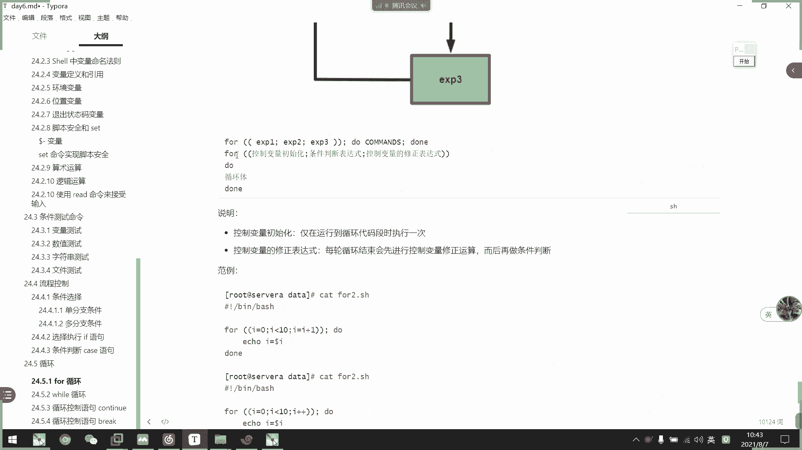

以下是一个在脚本中使用的例子：
```bash
#!/bin/bash
for i in 1 2 3 4 5 6 7 8 9 10
do
    echo $i
    sleep 1
done
```
这个脚本会依次输出数字1到10，每个数字间隔1秒。它清晰地展示了循环的过程：先将列表中的第一个值`1`赋给变量`i`，执行循环体（打印`i`并等待），然后返回，将下一个值`2`赋给`i`，继续执行，直到列表中的所有值都被遍历完毕。

这种格式非常实用。例如，如果需要批量创建用户，可以这样写：
```bash
for user in zhangsan lisi wangwu
do
    useradd $user
done
```
一条命令就完成了三个用户的创建，尤其在循环体命令很长时，能极大提升效率。

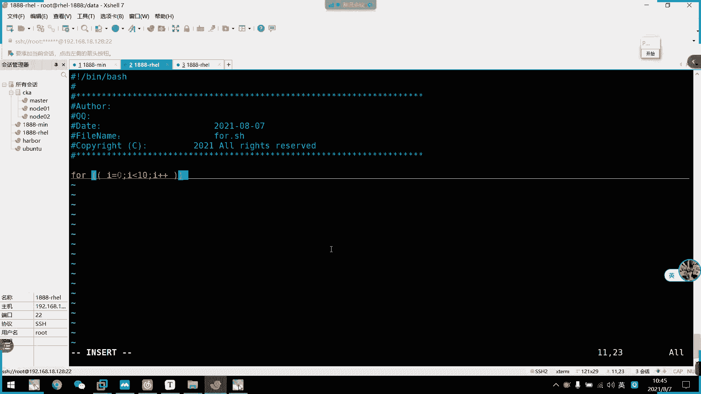

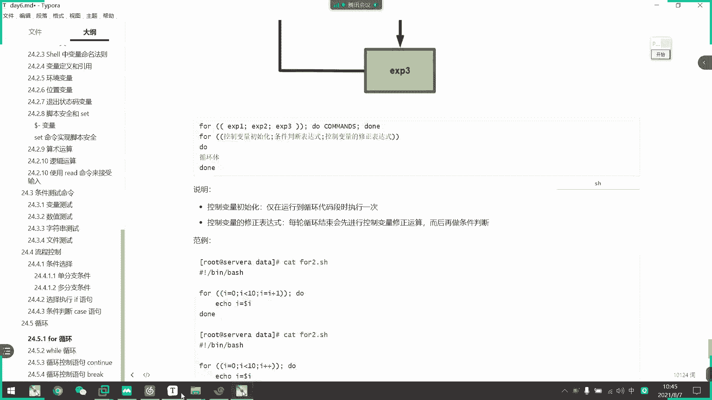

### 格式二：C语言风格

`for`循环的第二种格式模仿了C语言的风格，使用双小括号`(( ))`进行算术运算，提供了更灵活的控制能力。

其语法结构为：
```bash
for (( 表达式1; 表达式2; 表达式3 ))
do
    命令序列
done
```
*   **表达式1**：通常用于初始化循环变量（例如 `i=0`）。
*   **表达式2**：是循环继续执行的条件判断（例如 `i<10`）。只要结果为真，循环就会继续。
*   **表达式3**：在每次循环体执行结束后运行，通常用于更新循环变量（例如 `i++`，表示 `i=i+1`）。

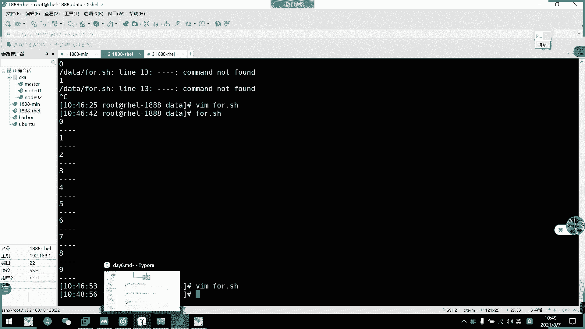

让我们看一个范例：
```bash
#!/bin/bash
for (( i=0; i<10; i++ ))
do
    echo “$i---”
    sleep 1
done
```
脚本执行过程分析：
1.  首先执行`表达式1`，初始化 `i=0`。
2.  然后判断`表达式2`：`i<10` 为真，进入循环体，打印“0---”，并睡眠1秒。
3.  循环体结束后，执行`表达式3`：`i++`，此时 `i` 的值变为1。
4.  程序返回判断`表达式2`：`1<10` 为真，继续执行循环体。
5.  此过程一直重复，直到 `i` 的值变为10，此时 `10<10` 为假，循环终止。

这种格式通过三个表达式精确控制了循环的起始、条件和步进，在需要复杂计数或条件时非常有用。

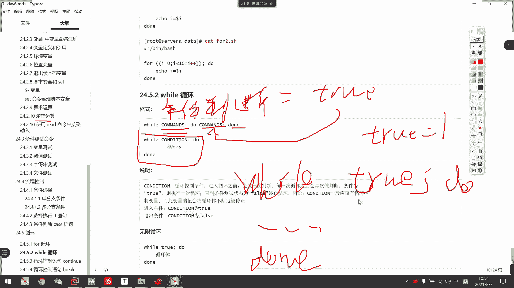

## While循环

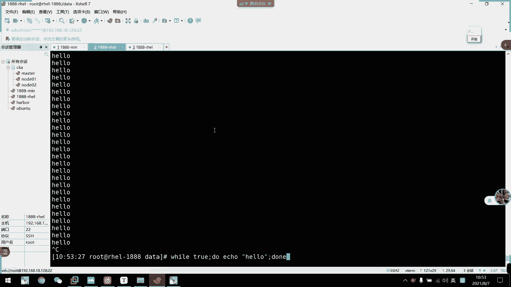

`while`循环的结构相对简单，它会在条件判断为真时，持续执行循环体内的命令。

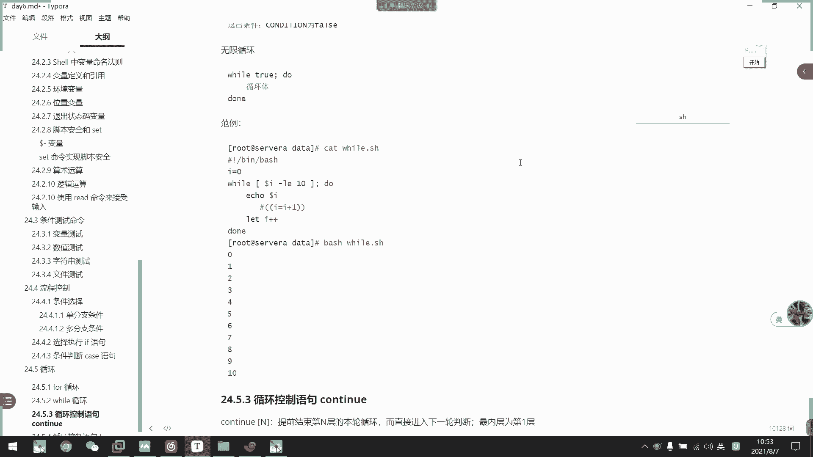

其语法如下：
```bash
while 条件测试命令
do
    命令序列
done
```
这里的`条件测试命令`与`if`语句中使用的类似。只要该命令的返回值为真（退出状态码为0），就会执行循环体。

一个典型的例子是利用`true`命令制造一个死循环，因为`true`命令永远返回真：
```bash
while true
do
    echo “hello”
done
```
这个脚本会不停地打印“hello”。死循环在某些测试场景下有用，但通常应谨慎使用。

让我们看一个正常的、会结束的`while`循环示例：
```bash
#!/bin/bash
i=0
while [ $i -lt 10 ]
do
    echo $i
    let i++
    sleep 1
done
```
脚本执行过程分析：
1.  初始化 `i=0`。
2.  进入`while`判断：`[ 0 -lt 10 ]` 为真，执行循环体。
3.  循环体内打印 `i` 的值（0），然后通过 `let i++` 将 `i` 增加为1，最后睡眠1秒。
4.  循环体结束，返回条件判断：`[ 1 -lt 10 ]` 为真，继续循环。
5.  此过程持续，直到 `i` 增加到10，条件 `[ 10 -lt 10 ]` 为假，循环结束。

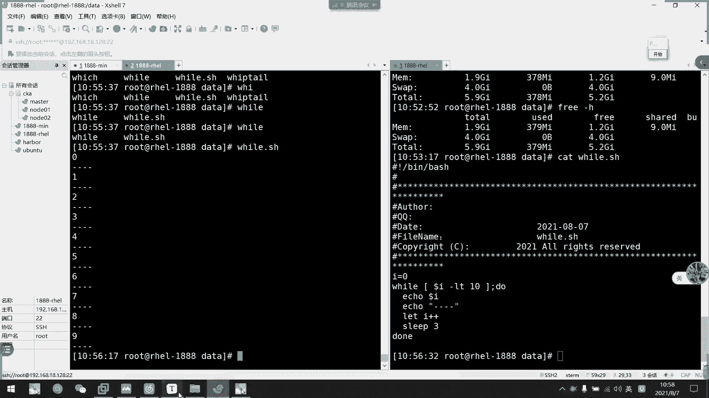

`while`循环在条件判断逻辑较为直接时非常适用。

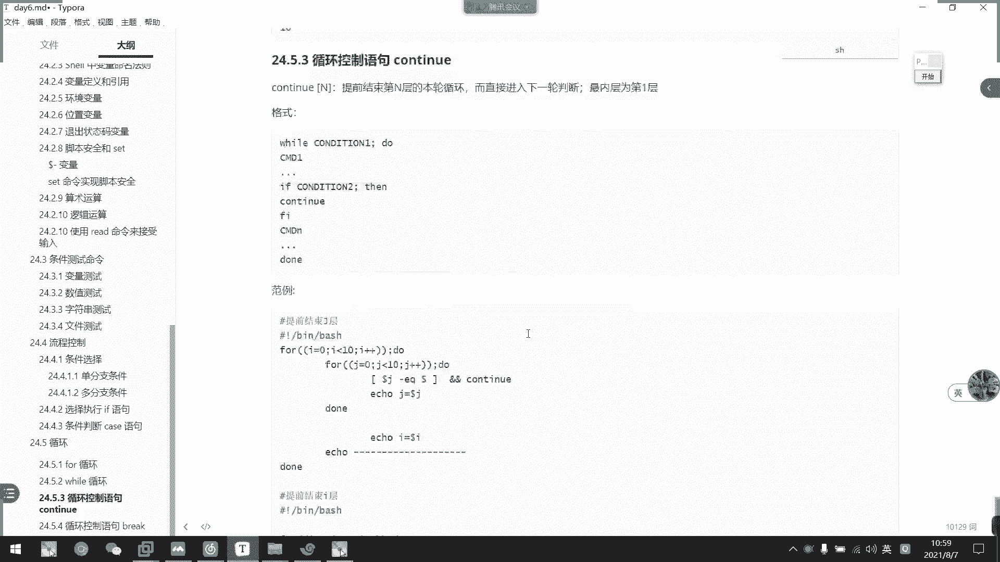

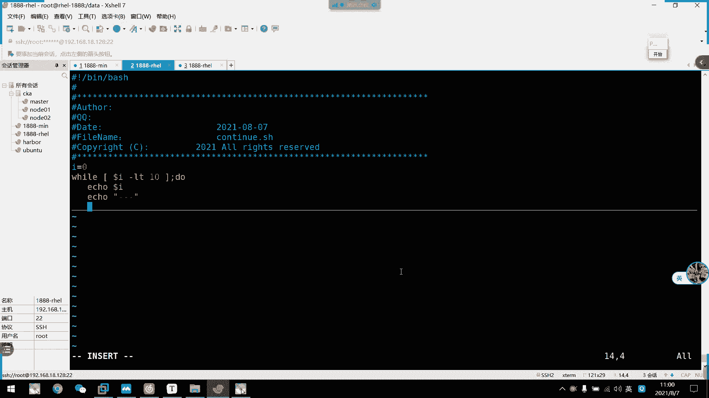

## 循环控制语句：continue 与 break

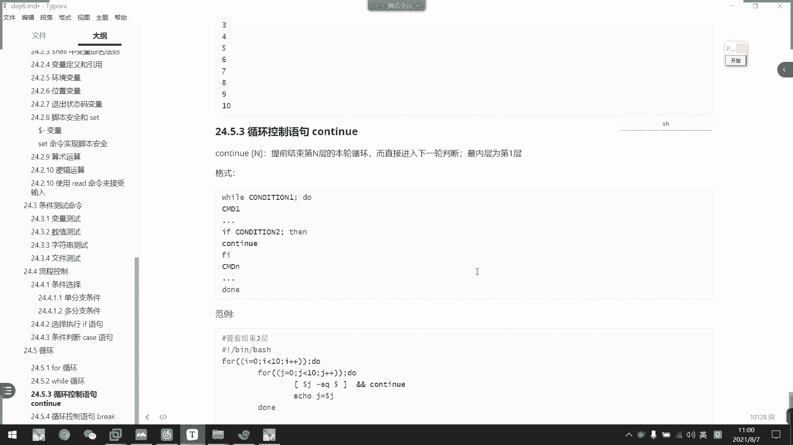

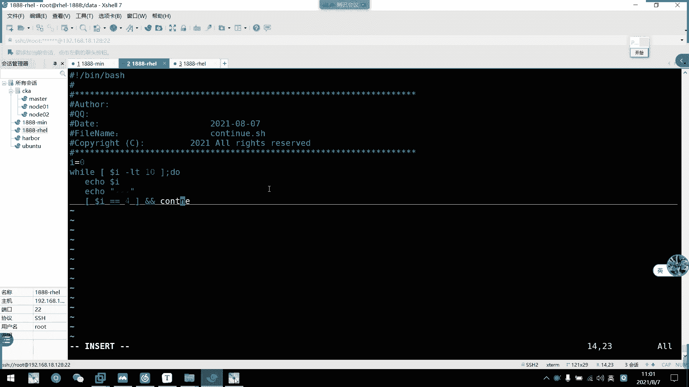

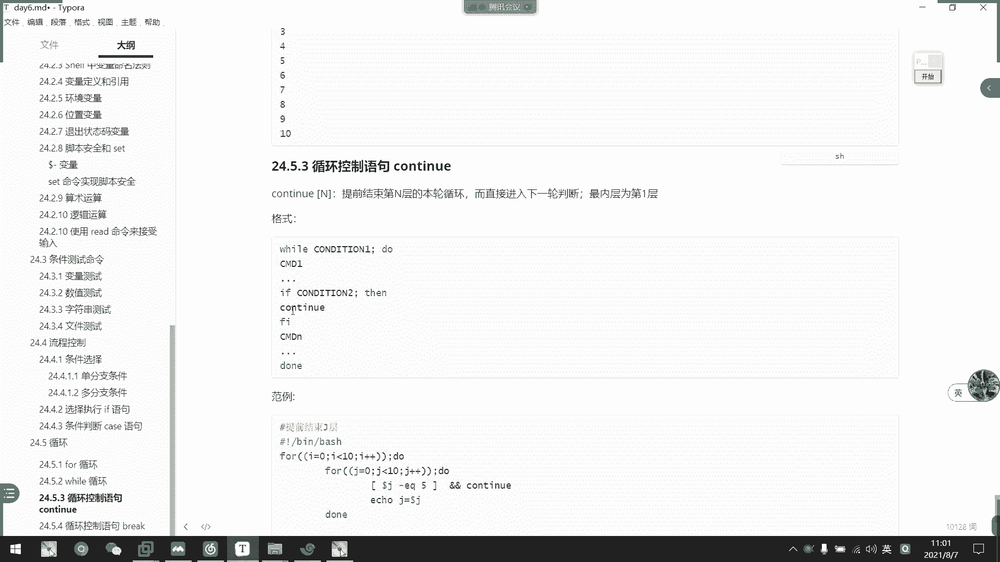

在循环中，我们有时需要更精细地控制流程，比如跳过某次循环或提前终止循环。这时就需要用到 `continue` 和 `break` 语句。

### Continue 语句

`continue` 语句用于跳过当前循环中剩余的代码，直接开始下一次循环。可以把它理解为“本轮请假，但下次还来”。


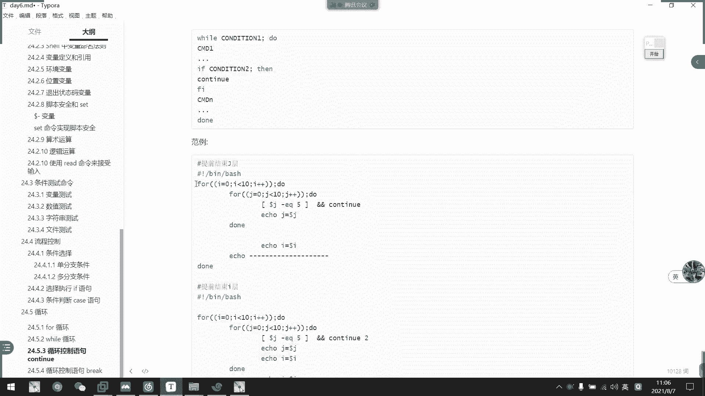

它的语法是 `continue [n]`，其中可选的 `n` 表示跳出第几层循环（从内向外数），默认是1（当前最内层循环）。

请看以下示例：
```bash
#!/bin/bash
for (( i=0; i<3; i++ ))
do
    echo “Outer loop: i=$i”
    for (( j=0; j<5; j++ ))
    do
        if [ $j -eq 2 ]; then
            continue 2 # 跳出当前循环以及上一层循环的本轮剩余部分
        fi
        echo “  Inner loop: j=$j”
    done
    echo “--- End of outer loop iteration $i ---”
done
```
在这个嵌套循环中，当内层循环变量 `j` 等于2时，执行 `continue 2`。这意味着不仅跳过了内层循环本次剩余部分（打印j），还跳出了外层循环本次的剩余部分（打印结束分割线），直接开始外层循环的下一次迭代（`i` 加1）。因此，输出中不会出现 `j=2` 及之后的内容，并且每个外层循环迭代后的分割线也只在 `j` 未达到2时才会打印。

### Break 语句

`break` 语句用于立即终止整个循环的执行。可以把它理解为“直接退出，不再继续”。

它的语法是 `break [n]`，其中可选的 `n` 表示终止第几层循环（从内向外数），默认是1（终止当前最内层循环）。

请看以下示例：
```bash
#!/bin/bash
for (( i=0; i<3; i++ ))
do
    echo “Outer loop: i=$i”
    for (( j=0; j<5; j++ ))
    do
        if [ $j -eq 2 ]; then
            break 2 # 完全终止两层循环
        fi
        echo “  Inner loop: j=$j”
    done
    echo “This line will not be printed if break is executed.”
done
echo “Loop finished.”
```
在这个例子中，当内层循环变量 `j` 等于2时，执行 `break 2`。这会立即终止整个嵌套循环（两层都结束），程序直接跳到循环外的 `echo “Loop finished.”` 语句执行。因此，输出只会显示 `i=0` 时，`j=0` 和 `j=1` 的内容。

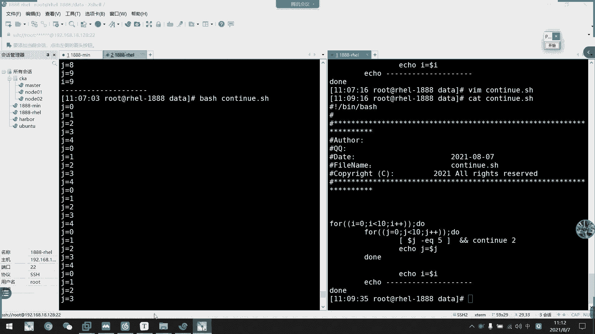

**核心区别总结**：
*   `continue` 是“跳过本轮，继续下一轮”。
*   `break` 是“立即停止，退出循环”。

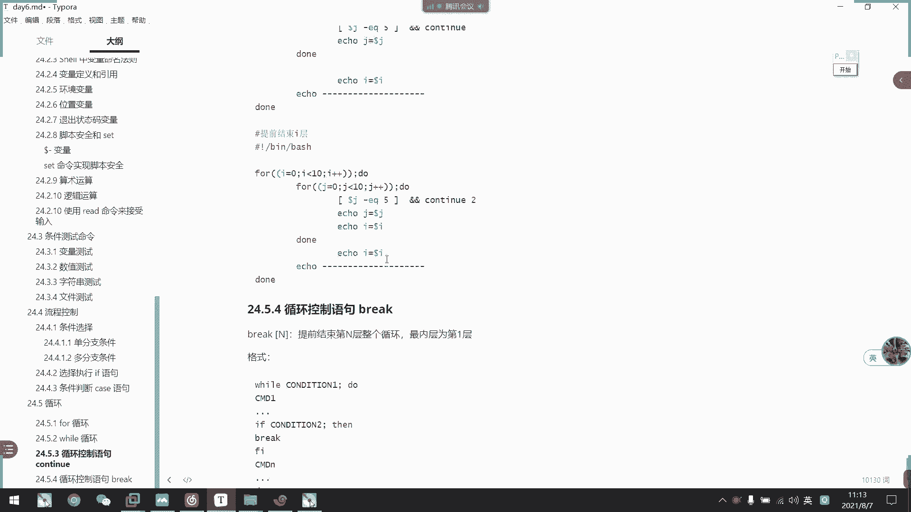

## 课程总结

本节课中我们一起学习了Shell脚本中循环控制的核心知识。

我们首先理解了循环基于条件判断重复执行的基本原理。然后，深入探讨了两种主要的循环结构：`for`循环（包括列表遍历和C语言风格）和`while`循环，并通过实例分析了它们的执行流程。最后，我们掌握了`continue`和`break`这两个强大的循环控制语句，它们允许我们更灵活地管理循环的跳过与终止。

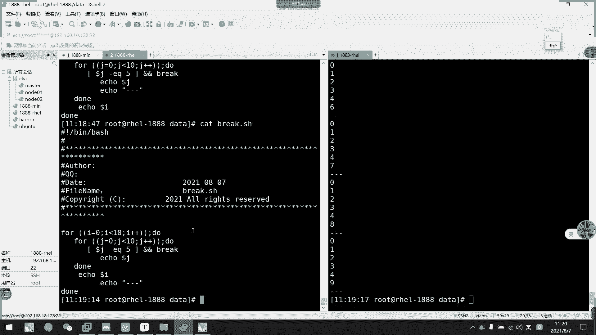

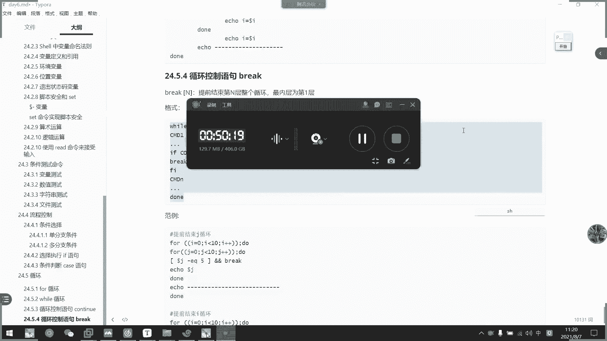

熟练掌握这些循环和控制技巧，是编写高效、复杂Shell脚本的基石。