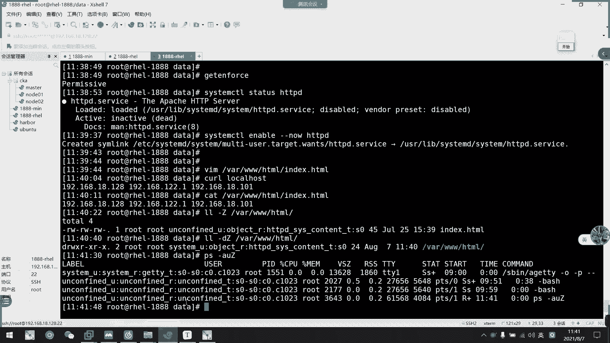
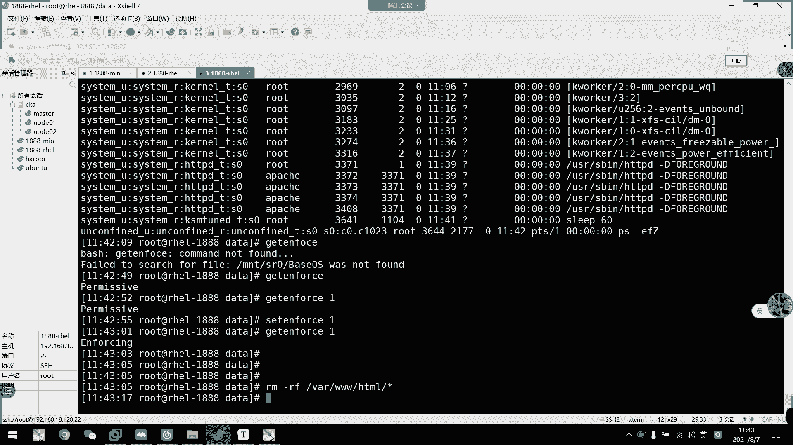
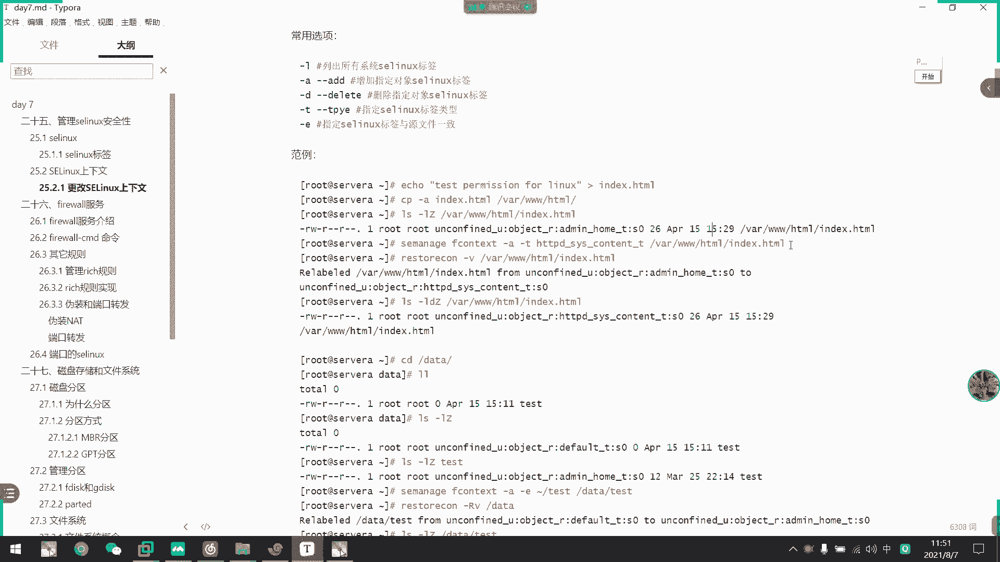
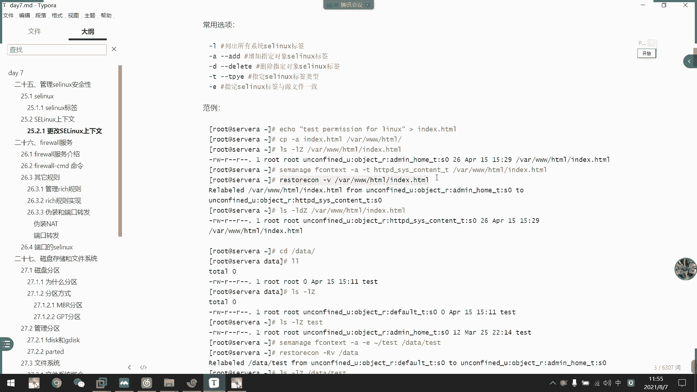
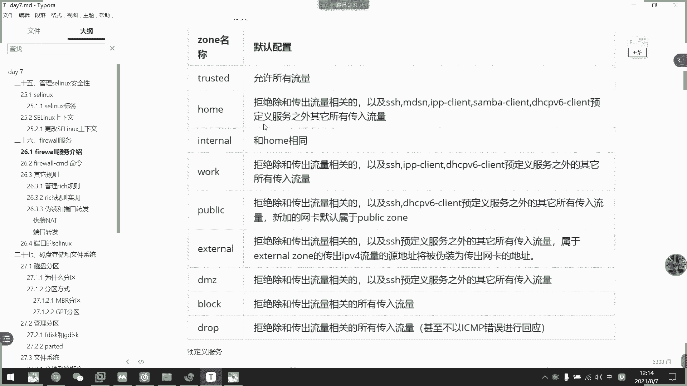

# 2021年7月新版-----RHCE8.2 RH124 RH134 RH294 认证课程 - P48：day9-3 selinux以及firewall1 - bili_15701050454 - BV1Gy4y1T7ug

好，我们开始新的内容啊，叫做SElinux啊。啊，我们系统当中啊常用的一个安全。控制就是我们的一个叫做权限控制啊。全击控制。那呢呃那个是认为呢仅仅是一个文件权限控制啊，是不足以保护我们的一个记录安全啊。

所以我那个叫做S1linux。等一下再说吧。啊，新的SClinux的一个概念啊，它是一个什么概念呢？啊，就是我们传统的权对控制就是。他的主体。是对文件啊。S6的主体。4。进程了。是听济。呃。

这个了解一下就可以了啊。SCin我们的工作上啊其实是一个很麻烦的东西。所以我们在生场环境通常都是把它给关掉了。但是我们考试环境是不能不能关的。但是啊所以我们也有一个学习的必要，但是学习的也没有太深入啊。

在课本当中的介绍只有一个开关以及真上改查啊。我们先看一下。S Linux。它的配置文件是在我们的1个EDCSlinuxfi下啊。但我呃我们之前也。

用经常用的这个文件去做示例啊。

啊，这就是我们的啊Slin的配置文件。

那么我们备注文件等一下再看啊，我们先看一个开关啊。它三种模式介绍啊。所以是强制啊，叫做er enforcing啊enforcing。就是强制这个规则使用。要是许可，许可的话就是处于活动状态。

但是不会强制执行。呃，但是会记录这个违法的一个警告啊。啊，第三个是禁用啊，我们常经常都是禁用的。你如果是要问我许可，他存放在哪里，我也不知道。啊，应该是记录在日志吧。好那个效果们看一下。好，我们先。

看看怎么查看当前。

系统中。S呢个ス的 걸어状态啊。啊，我们有一个命令叫做get。Kten force。对啊，这里。啊，这里一个invol啊代表我们Slink系统中的SClink。目前是强制启用啊。

强制启用状态啊强制启用状态。那么。如何去把它给临时关闭呢？啊，我们可以用set。也。Fth。然后沃尔兹啊。零代表光一代表开啊。一代表开，那我们苏林就把它关掉啊。关掉，然后呢，我们现在gap。

enforcing。可以看到啊，他就是。Permises。こイズ。

那么就是我们的第二种啊，叫做许可啊，就是许可。

那我们现在就无需要去。那个。呃，根据我们的。啊，根据我们的这个。规则去啊SC Linux规则去执行一些。啊，命你了。那么。我们这里是一个临时开临时关，那么SD到底怎么用呢？啊。

比如说我们现在装应该有装过啊。被一下。没看啊。先把我们的HTPD服务给开起来。多住啊。然后呢，我们去TVD它要访问的一个静态页面是在哪里啊？哇。哇哇，啥都有点HKL对吧？啊，是这个文件嘛，对不对？啊。

这是它的一个页面文件我们克一下。K呃。哎你好，我8080现在就读取到我们的这个index的文件，对不对？拍一下诉讼完全一样的。看一下，我现在访问的就是这个页面啊，我问的就是这个页面啊。好。

那么我们现在可以看一下。我们通过LL杠大Z啊大Z。可以去看。这一个目录的。I limitters。嗯，可以看到啊，我这里。主要注意到这个位置啊。做HTVDSY contentD啊。

这就是我们的linux标签啊，这个就是我们linux标签。这里笔京应该有介绍，我看一下有没有啊，这里有啊，首先是SDus啊，什么角色啊，什么type啊，然后是等级啊。

啊，然后是文件啊，然后呢我们这主要的是课本主要讲述的是我们的type这个类型我叫做标签啊，我叫标签。

我们现现在是通过啊文件。查看它的1个Slinux标签。然后呢，我们。啊，已经有了这个inice啊呃in HDNL啊，那我们看目录啊。加一个底看目录啊，你看它的负极目录啊也是这一个。标签啊。

所以他们是有上上纹啊安全上纹的一个关联性啊，有一上消关性。然后呢我们还可以看一下PS杠。A。AU大J吧，看一下是不行。看下有没有嗯，A大Z。Un confront。

我睇一下。

啊 e f g 啊。哦，我用了干了，不好意思。

打这用干衣。o k 噶。啊，这里可以看到我们进程的Slinux标签啊。你看我现在SHTVT呃HTTVD的话呢，它的一个进程的是HTPT。

所以呢它进程要有这一个标签呢才能控制我们刚才的呃才能控制我们刚才的一个ins的那种contest啊，est。允许通过吧啊，所以contest。Pi。月蜂过的标签的意思啊的类型。好。OK然后呢我们来。

接下来做个实验啊，我们现在get。Forer。诶。啊，哎我不是开回来了吗？我们现在把它给开回来啊。Se。现在已经开过来了，那么我们先把这个删掉啊。5啊。3WHDL。你们的删掉啊，那我我现在刻不到了。

对不对？

现在是客户大，他是找不到页面的意思。

刚R又可以看到。有是40上口币的还是找不到啊，客户都找不到。啊ok那么我们来。在当前路径上data啊，我们来看一下data。11杠。D大J。然后是就这里吧，对呀我这里是哎怎么是EDCone态的？

你是万蛋诶，怎么是一DC万蛋？说了一 least问他就问一 easy细问题。好了，我们现在写一个啊inex。你在上面突然间忘记了，I am。DEX吧。我们先写一个，就说hello。好。

然后我们现在看一下这个文件的一个。啊，这个文件啊，你看它也是EDCwin type的。你是问态的啊标签啊，然后我们先复制。把它复制到我们的。🤧咳。就。注意，我这里加了个杠A啊，我这里加了个杠A。

So我们的 rock。3WHTL。把它复制到这里来。好，复制过去了啊，然后我们看一下现在冷不能嗑啊。诶。什么鬼啊？为什么可以喝的？伊利斯文泰。什么鬼，为什么可以刻可以克？没有我我我开了。我把它开回来了。

Enforcing啊。我重启一下。我真的是服了。你风城。然后再刻一下看一下。Her。嗯。玩不下去了，我觉得。为什么？为什么呢？😊，我这还没挂载。先写下来。292点168点。有。嗯。😊。

好，先装一下工具啊。好现在有点炸裂的感觉，为什么他能。发问。还还要不让人家好好的去。讲课了。我再看一下。这个data。也以 this是 one time嘛。怎么会是EDC状态呢？算了，我们回到家木路吧。

啊，这个是我的米虹钢T啊。然后我们在这里创建一个indexice吧。啊，然后是呃还是hellowood。然后。先把服务启动起来。啊，然后把这个拷贝过去啊。うは。三W。好，现在我们刻一下看一下要不讲。

好的。不行了不行了。那它这里啊提示的是403伏币等。啊，第一个是是及上否律的。我现在看我们来看一下是否有这个工具啊，是否有这个文件在这里啊，我来。要是5啊。三个月。啊。

我们可以看到啊index的确在这里啊。然后呢，他。啊，正常来说也是可以访问的。我们看一下大这啊，你看但是它这个SD6标签是为我们的admi home杠体啊。然后我们看一下它副目录啊。

是我们的ATVD啊SY contestD啊啊，它的复公路的1个S定的标签。所以呢他们上下文安全有风险了啊，有风险级别了啊。然后我们先看一下啊set。ENFORC把它关掉啊，临时关掉。好，可以看到啊。

现在是允许了，允许了，然后我们再刻一下，看一下能不能回答。啊，非成200ok啊，反馈码200ok啊。啊，证明是我们已经。可以访问。这是Slinux的一个安全控制啊。S Linux安全控制。啊。

就是说它的上下文如果不一致的话就不行啊，但是我把它关掉了，它还是可以访问的啊。

好，接下来我们继续往下看。如何更改它的一个上下文啊啊，是我们的MSSE managerSE manager，然后是改掉它的一个type，叫做fo啊。然后是L呢可以列出系统所有的S呃Slin标签。

然后杠A呢是添加标签，杠D的话呢是删除标签啊，杠T的话呢是指定类型啊，然后是杠一的话呢呃指定Slin标签语原文件一致啊，就是我用其他文件的Slin标签把它给替换掉。然后这里其实是我刚才的一个实验啊。

就是说啊我们一口的一个就创建了一个inex文件，要后复制过去。所以他跟我们付目录啊跟这个目录的一个。按照上路文标签是不一致的啊，可以看到啊。然后我们现要用SSE manager for去更改它的标签啊。

更改它的标签。

好，我们来试一下C manager。关掉了，先开起来。呃。

没这个工具吧。

Yes to you。

It may。MAG E。

难搞哦。怎没有这工具呢？可是又不带这个包。啊，OK了。SC manager，然后是。ポテ。

我的评错了。

FCOM。Conts of contents。14杠L，我们先查看一下系统中所有的标签。这边都是对呀。那么如果我们忘记HTVD。是怎么写的，反正就grave嘛，直接1个HTPD吧。

书记。是不是把我们HDPD相关的都列出来了？然后呢，我们就可以找到我们SY contest的。T的那个标签把它给贴上去就可以了，对不对啊，大家也可以直接查看附目录也可以啊。然后增加了我们就杠A。

然后是杠T啊。然后指定这个啊。然后给到哪个文件啊，就哇3WSKNL indexdes，对不对？啊，回这就可以了。也没留那么久了吧。这个表情都那么久。O那我们现在看一下这个标签啊。哇。哇3WHTL。嗯。

还没改过来啊，对，注意还没改过来。那么我们接下来还要输入这个命例啊。啊，就说是restone杠V啊，叫做标签重定向啊，这个叫做标签重重定向啊。

但无V啊。然后直接复制这个文件就可以了。我让他撬了。好，别看。然 from这个啊，然后 to我们的这个system。踢了，拜拜。从什么改成什么啊，那么我们现在再看一次。对呀他就变了了。太别了。

那我现在课可以了吗？嗰。已经可以了。啊，这也是我们的啊标签上下文的一个呃SClink下下文标签的一个安全。

保库啊。啊，就这么多了啊就这么多。好，接下来是刚刚说的这个重一下RV的话呢是根据目录直接重一下，根据目录直接重一下。啊，然后还有一个呢，它是可以直接改的啊，它是可以直接改。但是呢可以被我们的re。

还越啊可以被这个团越。啊，所以呢我们能用的还是尽量用我们这一个啊，尽量我们这个。啊，这是我们的关于进程的Slinux标签啊，文件啊进程使用的Slinux标签。所以呢啊我们。

之前讲到那个更改密码，为什么要标重新一下，大家知道了吧啊。鳌头。有这吧。因为它这个保护的是基存啊，所以我加这个把他们整个系统的一个标签直接自动重重打一次啊，直接重打一次啊，根据自己服目录一直打下去。

打完之后呢。啊，他就可以让我们访问。因为我们在那个呃就算模式上面改了文件啊，改了文件，它会清掉我们的标签的啊，所以我们那个需要的文件啊，所有文件就没有了安全上效网了。

所以呢它就不能被我们这个开机时候给读取出来啊。啊，所以。要做这个autoreable，让它再重启的时候啊，自动打上标签。好。🎼那么刚才说到的是一个临时开临时光啊，临时开临时关Slin啊。

但是这个配置是永久的啊，大家要注意啊。大家要注意，临时开例18，那么我们想永久关怎么办呢？我们永久关只能去修改我的配送文件啊，叫做Slinux。是这个。

我们要把这个啊这一行改掉就可以了啊。另后他说Hlinux保护规则就是我们他可的这个不用管它就个不用管他。然后呢，我们直接感觉聊，其实上面已经有提示啊，infor就是强制的啊。

然后promise就是啊允许的。🎼要后是D直接关闭啊，我们通桥都是直接把它关掉了，怎么关？对。关掉啊，然后直接重启就可以了。关掉直接重启。

诶诶出问题出问题出问题了。

按错了。

我改一下东西啊，稍等一下。

这开起来了。是吧。然后我们现在看一下get。course。哪里啊哎。怎么是permiss？哦，我拼错了，2怪。评错。在抽血。拼错了，不好意思啊。他怎么可能。迎接带风吹。好，那么。好。

我们这里现在再看一下啊。哎呀他这个叫di disabled。那我们现在把它给。克一下啊。哎呀目前是可以克的啊，然我们L杠。大Z。哇， someWHDL吧。可以看到他的标签是。正常的，所以他可以访问。

对不对？我现在把它删掉啊。好，然后呢继续拷贝我们当前目录像的。index啊到里面去啊。然后我们再查看再查看它现在应该是我们的B。啊，你看是我min加目录的一个。标钱，那我们现在在刻啊。啊。

你看还是一样认可啊，就是说它一样能访问到这个文件。啊，就是这个进程一样能访问到这个文件。啊，就是把我们SC6关掉了，把S6关掉了。好，那么这就是我们的IClin的一个开关，以及它的一个增山改插啊。

增山改插。

那么接下来我们来看一下下一个符叫做呃。翻过墙啊，就是防过墙。呃，在我们这个。呵呵。😊，其实就是查出来的它不一致，跟分目录不一致，他就不能访问而已，跟进程不一致，这就不能访问而已。嗯。re家度。

没搞懂的话，我也不知道怎么讲给讲给你讲懂。就要注意这个态度就可以了，把它给修改啊，把它给修改，然后再表演重新上一次啊就可以了。反正他不一致就不能访问啊。对啊，他。操作也不是很多啊，操作也不是很多。啊。

这是进程对文件的。然后等一下我们防火墙后面呢。还有一个关于端口的写的名字啊，这个也不难啊，这个也不难，放心啊，这个也不难。好。🤧那我们接下来呃看一下firework吧，我们开一下头吧，还有半个小时。

我们开一下头啊。这是fi word啊，这是一个。七版本啊好像是7样门后的啊新增的一个服务啊，翻么墙。不过这个东西呢可能有点。激烈但是它挺好用的，说实话它是挺好用的。用是很好用啊，然后。他8版本的话呢。

引入以后呢。他又开始用了，就研发了另一个叫做MFW的东西吧，好像是。所以他这个好像没什么更新性了。然后在用777版本之前呢，他又我们又原原用那个IIIP tables嘛，对不对？

IP tables是写防火墙规则，所以它这个flow出来以后呢可能。感觉上有点少用啊啊，不过不管他他课本既然要我们学，我就直接看这个f沃就好啊。好，首先是for word啊。

是re7新推出的一个防火墙的一个空用户空间软件工具啊。它是用于我们配置和监控防火墙规则的一个系统锁护进程，可以实现IPtables啊IPV6的1个tables啊，然后还有一个etables的功能。啊。

然后他这个服务是由我们的fwork这个包提供的这个包提供的。然后呢，它fire word是支持我们的分区域。划分啊划分区域啊是叫做重啊。我们这个。就定义到重。

然后我们的每一个规则啊定义都是与我们的重有关系啊，所以重啊这个是一个重点啊，空前啊重。然么每个钟可以设置独立的一个防火消费者啊。首先它一个归入重的一个顺序啊啊。先根据数据包中的一个原地子。

然后再将其纳为某个众。然后呢，那为网络接口所孰众，最后呢是纳入默认中啊，那认默认中啊，它什么意思呢？我们先不用管这个，我们先看一下。呃，它的一个规则啊，我们先看一下它一个规则，看一下图。Yeah。嗯。

Should佢都。啊就随便一个图都可以。好，然后我们先画一个。好，这是我们的服务器啊。啊，这是我的服务器。嗯。没有。啊，这是我们的网卡。我这里再多快一张。啊，这是网卡这是网卡。啊，然后呢。在这里面有个。

发布潜规则。这是我们的firear word。啊，for word好，for word里面呢啊。他有。很多个。Joong。我就随便花4个吧。一嗯一 broke。Oh。3。是。好。比如我现在有4个种。

那么我们客户端。随便一台吧。好，我们客户端通过他的网卡。访问到啊通过网络。然后经过这个网卡，然后呢它访问到呃我们的。他他不是有个IP吗？比如说这里啊有个IP断给以个IP断啊。19哎诶，怎么写不了。嗯。

比如说我这里是192。168点18点。就129吧。打こす。这个IP，然后他进入哎。这选不中这个字。嗯说。然后他通过这个IP看一下他这个IP是属于哪一个中的，然后呢，它就会。指定到哪个种里面的一个规长。

匹配里面的规则。别你们的规则。啊，这要就。啊，第一次搜索为员啊微员。如果他这个IP没有设啊没有设，那么就是。跟网卡有关啊。网卡。啊，我们可以设定网卡到某个设备啊，如果它不是这个圆。

我可以把这个网卡设定在中艺啊。就是说其他机器啊其他PC。通过这个网卡进来啊，我们就。可以到我们的中医啊。当然不是这个IP啊，当然是排有这个IP。然后第三种是什么呢？第三种就是呃玫规则就随便一个网卡记入。

随便一个网卡啊，随便一个网卡记入啊，玫规则，它有一个叫做public。啊，默认是public。P will P or I C。public的重啊。啊，是我的默认中，所以他所有规则都会指向那里啊。

就是说前面两种没有匹配到，没有匹配到，它就会进入我们的啊默认中匹配里面的规则啊。如果这里都public都没有的话呢，那么它就会被拒绝掉啊。啊，daily啊或者是说我们的一个觉。开是我都会着。ok。

其实差不多啊差不多。😊，好，这是我们的一个firearwood的一个工作规则啊。好，首先我们看一下重啊，看一下重。那么。

我们先从命令行调解啊，我们看一下啊。啊，他的服务刚刚说了是叫fa world啊。啊，它是开始运行的一个状态啊，开始运行的一个状态。好。这是我们的发货钱啊，这。千万没学的话，我们都是直接把它给关掉。

对不对？好，然后呢，我们它的命台工具是哪一个呢？叫做fire word。咁 c m d 啊。For a world。没有地啊。杠CND啊，然后我们查看中的话是刚杠list杠。中。看播吧。诶，不对吧。

そかニ。そう。哦，我知道了。哦，是我点是or重死啊。File world。这CNG，然后是刚刚miss。哦。啊中实。他在耍我。嗯。😊，F沃先低。哦，历史拼做了。我裂别住了。最白。如果他嫁了这个。

种子的话呢，他就会把规则都写出来。我们先不加这个。他不加啊，不加的话，它是显示我们默认的中啊，默认的中。默认中啊，我们说的是public啊，然后这些是它里面的一个规则，规则是这里啊。

首先是sourcece啊原刚刚说的是source啊原，然后in the phrase啊 interface the就是我们的网卡，对不对？第二个啊第二个。优先级为2啊，然后是这个service啊。

是匹配的服务啊，然后呢，这里可以定义它的一个叫什么来着？端口啊，然后呢是协议啊端口的协议类型啊。然后呢，下面还有一个叫做复规则的东西，我们现在当前啊还不讲了，这个是啊伪装啊也不会呃当前也不讲。

然后他给了这里可以注意一下杠看。啊，这个是他的一个默认状。他规然说的是主负责在活动中啊活动中。好，这是我的后，然后加个粽子的话，就可以看到全部。攞多这个粥啊都可以啊。啊，我们有什么brolock中啊。

然后DM一些钟啊，然后d中啊。jo是等于ding啊。啊，什么tra啊。然然后是 home呢。嗯，要是inlow啊。啊，然后这里是public。啊，然后是。I also work。啊。

但是我们这里注意到他们很他给了个der啊是什么意思呢？我们后面再解释啊这个。

我们后面再解释啊。那么我们这里可以看到st啊是允许所有流量。然后后面的话呢。所是拒绝我们那个和传出数流量的一个相关的啊。然后in龙啊和后面相同。其实这个我们做好不用管它啊，主要我们要注意是一个dr啊。

注意的是一个d啊，还有一个叫做。

醒不来的。啊，这个这个吧应该是啊允许所有嘛，就就是说呃漏所有都允许啊，然就不需要匹配规则。

然后呢，这不是所有都拒绝嘛啊，注意这这两个还有一些public也可以啊，worker也可以。就是说我们直接可以指定一个重，他是要干嘛的就干嘛了，不用管它这些预设的是什么东西啊，不用管它。

那我们现在看一下啊一个简单的用法吧。

呃。我知道佢以 set folder。谁不管这些。因为这些都不用管的啊不用管的。我们直接看这个。看这个。min你行啊，所以是get join啊，应该是get。

查看的时候中啊。list史的话，他都列出列表。哎呀，这是他的一个所有的重本内储了啊，所有的重备内出。

好，然后是查看默认中啊。

关注我我现在是。十门诶。好，你看是public。然后呢我们可以把它给改掉。我们先看一下这个。默认中是有什么东西来着？啊，默认这么规则啊，所以是允许我们的coookie的，还有1个DSCP的。

然后是允许SSH啊。然后进来的网卡是EX160。呃。然了我们可以更改啊更改，就是set default。s对吧，然后我们把它改成。系。呃，让我们看一下现在的一个get four。啊，是我们后。

然后我们啊插一下 home。的那个规则啊，控制规则会多一点点啊。啊，首先他的网卡也是ES1160，所以我们现在不怕它会断卡，然后是cookie的，然后是他做了个MDMS，这个还有一个上门可能。

即系商品一般都封多佢嘅。ISSH啊，但是我们测试我就不管它了，对不对？虽以说我们现在是都不允许HTEVDE的一个访问啊。

外部流量访问。然后是呃chi种植，就是当前正在使用的，就就跟默认是一样的嘛，对不对？要去分。

看一下吧。反正。先D啊，然后是。get achi，是是。可开下吧。そうです。啊，然后啊然后他的一个。进来的话是interface啊，是从我们的是从我们的网卡定义的啊，网卡定义的啊。

O。然后呢，它可以加一个语啊，就是说我们刚刚说的一个原IP地址啊，然后删除。啊，添加一个网卡啊，或者是更改的更改一个啊网卡，把把设备给换掉，把设备给换掉，然后是增加服务啊，然后是增加端口啊。

删除服务删个端口啊。然后是重新加载啊。然后是查看它的一个服务啊，然后是查看端口，然后是查看所有。

那么我们现在可以测试一下啊。克192。168。18。129。他是被拒绝掉啊被拒绝掉可了。然后呢，我们通过这个IP指定的，是不是我的网卡地址？啊，所以他就是意思就是说从这个网卡进来了。🎼啊。

我们通过访问这个IP，那就是访问这个网卡嘛，对不对？对不对？那么网卡进来以后呢。他说他就会通过这个网卡。投这个网卡进掉进到我们的这个 home啊，进到我们这个 home。混到一个重里面。

然后再从这个里面匹配规则啊，从这个里面匹配规则。然后他看到cookie啊没有啊。不不，他先查看service啊，有没有service没有HTVD服务，对不对？然后他就会查看我的pos，没有80到口。

对不对？协议更加不用说了啊，协议更更加不用说。啊，也没有，所以他。这里就会被拒绝掉了啊，被我们的防火墙给挡掉啊，被挡掉了。那我现在看一下。呃，我这边设一个。我这边设一个什么好了？M。work的中了。

F work。写啲得得。좀。刚刚。对。source等于。192。168。18。对。1班吧。然我们注意这里啊要加一个选项，我找一下啊。

加一个选项。啊，叫做啊promon啊永久啊，这个是永久生效的意思啊，永久生效的意思。因为我们定义完它都要遗漏啊，它都要遗漏。如果要重新加载，它没有加永久的话，那就不会更这更新。

我们一般都是加一个刚刚prom啊。

直些可以缩写啊，刚才克。可然后是。可以吧，应该。他说是s死了，看到没有？即实有遇到雨晒。啊，记得定定完，我没要遗录啊。好，然后我们先看一下啊这个worker的一个规则啊。好。

你看我们语言就加进来了128。然后呢，它这里依然还是没有我们的一个服务啊。啊，这里我们注意一下service，我们现在增加一个service到里面去啊。啊，是用这个。应该增加一个service。啊。

但是这里要注意一点啊，如果是我们的1个HTTP服务呢，它是直接HTTVD啊HTTP啊，并不是HTVD啊，它只有HTP或者HTPS啊，是通过协议啊通过协议的啊。大家注意一下啊，但是我们现在是HDVD啊。

是再预漏一次啊。然后我们再查看这个。啊，就有1个HTP协议的啊，要我们看一下我们128现在访问过去，能访问吗？对啊。可以吧了。它的会源啊，通过我们的源就直接访问到这个work下面了啊，work下面了。

啊，然后触播卡下面匹配到规则啊，如果这里匹配不到，他就从网卡匹配了啊，那就从网卡匹配。然后我们现在。看一下我们的默认中啊，默认中看你下他一样是没有的。Yes没有。但是我们通过圆啊拖圆。

所以这里可能还没看出他们的一个区别。呃，这样吧，我加一个网卡，我加一个网卡。

好，掉下去了啊。嗯。还有个224的。这个有没有？啊，13你我拼一下看一下啊。可以通了啊，那我现在把这个规则更改一下。等一下叫做fire word。那些低。这个P。尴尬他有没有劝阻我们的一个员呢？

Double a change。 A changeren interface。他说明我只有删除啊，就删除。

啊，其实没关系啊。打不要去。好，直接删把把把那个语给删掉吧。啊，不对，还是没关系。我刚129。刚刚沃的那个重手。他是直接。到我这边来。啊，这不是啊，你看它这里自动添加了一个20，因为它是默认的。

所以他把我们的网卡都加进来了。我开车我可有没有？啊，我还 shall要 work。你看他目前还是没有啊。要我们现在要把这个给。移除掉移除掉。都已除掉了。呃。K。Re move interface。

いいえで。嗯。😊，In the phrase is under control of。Already brand to the different for too。也可以吧。移不开。诶，为什么不能删呢？

我觉得可以了。我先把它增加到我们的。加到我们的worker里面。Set不。对的。要是那个重的。对于。Is under control。为什么？我被控制。啊已经没有啦，即啊医做啦已经被医咗啦。

然后我们看一下。work有没有啊work有啊，然后work有的话，我们先把那个。原IP给删掉啊。M。

这什你有说什么？

写错了。啊，可以了，好后我们先重读了。F world。CMD reload。好，我们现在看一下。沃可的。这个重啊这个重。

好，我先看一下这个钟啊。对看如果他是从我们EX24进来的啊，这个挖g进来了，他就匹配我们这个规则。

啊，然后否则的话呢。他就匹配我们了。默认位置啊默认位置。我们先在看一下是不是。那么当前我们看了一下。129你看它是被拒绝，对不对？因为我们1129这个网卡是在我们的home啊，在我们home这个中。

所以说里面没有HTVD对不对啊，没有HTV。那么我现在刻一下224这个IP啊，从这个网卡进来看一下啊。

诶。怎么回事？20。4130啊，有什么问题吗？P你的。嗯。Es。Yeah对 he。有啊。为什么呢？为什么会被拒绝掉呢？我者看一下。130难道是group问题吗？224。Gropo。麻烦又来了。唉。

刚刚有遗漏啊，对吧？六过啊。怎么会被绝掉了？224。网卡是24没错吧。没错啊。😀诶嘿。😊，他应该是这个gl影响的全局。但是没理由啊。开了的。在今天八点门口。叫老我。看下。这里加一个。

Let the proof。等于80TCP啊。这估计肯定会通啊。看一下吧。笔录一下。还是不通。是不是磕着地铁的？跟你没关系啊。我开车。你看我80TCP进来，他都不行，现在。为什么呢？我都不知道为什么。

从这个网卡进来也不行。serviceHTP没问题啊，对不对？有就说没有servvicice，但是我端口也对啊。我这个是。不知道什么问题。什么叫首先是IP啊。我不知道你说的是什么 successI啊。

Of source I。不用啊，我现在从网卡进来啊。抽网卡进来啊。Does是。追了我。重启一下看一下，是不是发火器有问题。唉。为什么会被挡掉呢？我想知道。贵州不是写在这里了吗？

呃是我觉得就从这个网卡进来。比喻到我们worker。我去服。这个没关系啊，我反回过去跟他没关系的。我这个直接关掉就可以。

啊，对，等一下啊。我应该。时间过了，要不下午再排这个。我们先那个吧我们先那个吧，下午再排吧。我中午也顺便看一下吧，因天时间过了，不好意思啊。我们先下课吧啊。

