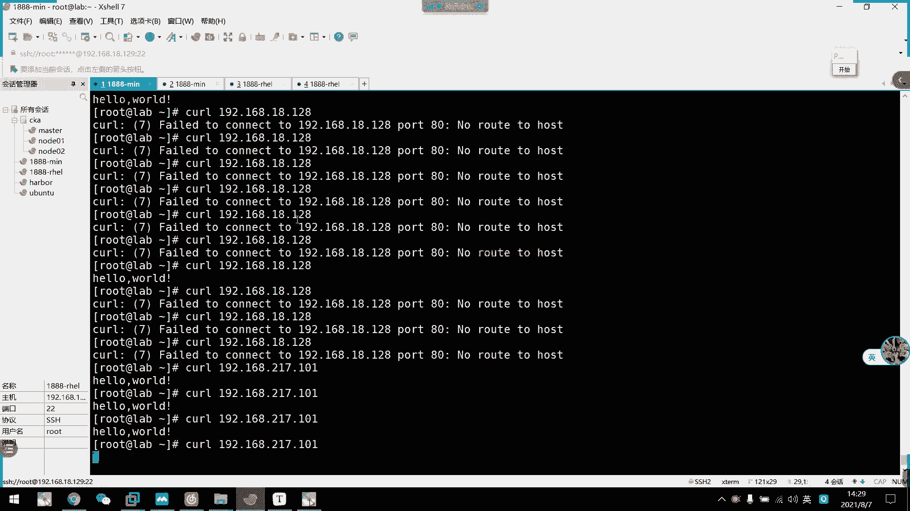

# 2021年7月新版-----RHCE8.2 RH124 RH134 RH294 认证课程 - P49：day9-4 firewall基本规则 - bili_15701050454 - BV1Gy4y1T7ug

好。我们早上啊首先是。流程控制。员工者啊原工者有两点啊1。4。条件控制。一个是循环。啊，田控制我们有啊一幅。啊，也分据还有一个case选择。If there are awake。条件判断。呃。

语法一般说if呃然后是加一个测试。再一个测试。然后是杜吧。丰数的话L if。啊，S也加一个条件啊，然后是。度高，然后是大。还有一个L。🤧嗯。最后是一个什么来着？到。OK啊，这是我们的条件多分制判断啊。

啊，L是case啊，case我们呃是通过case。顶一个值啊，我这边数I吧啊。啊，然后呢这个。什么。是与匹配啊A匹配的啊与I匹配列值啊，或比如是我这里是一啊，然后这里是做什么东西的啊，好吗？啊。

然后结束。把要2。就是那推啊。然后呢，也可以返回一个没有啊，就不匹配啊，不匹配任语长度。这是呃可以显示输出什么东西呢，或者是一个。一个。Freud ina。啊，提醒一下啊，输入错误的仪失啊。

然后结束语句是我们的case反过来写啊。到这里不是大码写错了啊。这个味道是FI啊。就没人提醒。在法院啊。O然后是循环啊，循环我们也有两种啊。呃，一个是for循环啊，一个是well循环。啊。

For循环有两个。写法啊，一个是forour I in。然是。Works。然后是做什么do。什么问题啊。要是大。另一种是我们的for。I等于。0呃，然后是I等。小于10。就是I加加。也是度。好吧。

都是大。有是Y啊。W他就比较简单，就是是我。嗯。Y加一个。头慢判断啊。啊，然后是备注一下。可以注一下，可慢了。喂。True。则。Xing路。熏上机。然后是度com么。啊就是大啊。O。啊，然后是循环控制。

啊，有我们的本田鸟。啊，因为我们的f。停止该轮。循团进入下一轮。停止。循航。然后是我们的。Let's see mini best。安全。笑午笑午。首先是我们的一个Slin。好，是我们的get。放死啊。

然后是。Ning。好的。呃。如果是。invocing啊就是。启动。Perming。是。允许通过。D。把速关闭了。好。好，临时关闭。S limitters。这是我们的promiss。啊。

就是用我们的set。Yeah， false it。0啊手关掉啊。嗯，然后呢，永久。关闭。还要写我们的。这是文件呢？啊，S1linux。等于。Disable。主是重启。那就可以永久完毕了。🤧好。

查看SEmin。标签。就是LL杠8Z。或者加个D。看目录啊。O好。更改文件的SNlinux。再加一个。查看进存的。这是你的就是。用我们的PS杠DF到Z啊。更改文件的SD那个标签。这怎么做呢？

用我们的SE manager。然后是。fteen8，然后是杠A。行不对不对不对。查看。文件。文件的私シリク。标签。我们的。明罪。

我说拼错了FROM吧，应该是看一下。还有没有诉错啊？啊，还有真的没说错。So。那它有很多用法。是 fCO l啊 fCO n t x t啊。

CFFC TX。还有啊。好，然后这里修改就是。CF。F是FTST杠A，然后是杠T然后是我们的S那标签。TYP1吧。好像是fi。啊这个文件。啊，然后是。标签重定向。But我们的 we。Set。

忘记叫什么？S see。E。你什么来着？We don啊。这个啊。

然后选项杠V。That。更容易啊。Te me J file。I was should got our week。接。目录吧。那就可以了。好，然后是防火墙。Fire。给地。为。So。工作为。规则定义于。

每一个总。不同的。中。可以。定义。不同意。规则。嗯。呃，如何。选择。勝か。首先第一个是通过原。啊，第二个是通过网。啊，最后一个是。啊，都没有的话，就通过默认。就。匹配。规则。O基本上就这样子。

然后他那些操作的话得要看笔记啊。

然要访问不了的话，我这边看了一下啊，它估计是。啊，也可以用。provisise啊去查这个包。大家要访问不到的话呢啊应该是我们的一个。叫什么来着？啊，Rro底层的一个网卡虚拟化出现问题了。

我这边呃中午做了个测试啊，只要我160。放在对应的重里面呢啊，它这个224也同样可以被。呃，访问啊。我们可以看一下。啊，我开一下。哎呀，我现在把这个160放在我们的work下面啊，work下面。

然后呢呃在work下面呢，它有一个规则啊，就是可以通过我们HTTV。然后呢，224的我就放在public里面啊，public壳是没有HDP的。然后我们先访问过来啊。奇把的个。192。168点18。

128。18。对，他是可以访问的，128是我们160的地址啊。嗯。是我们160的值啊，目前是可以访问是正常的嘛，对不对？我们放在work下面嘛，他访问160进来。因为我们现在看一下啊。

224224这里这里是111啊，111，我来看一下。他同样能访问到，只要我160。他有这个规则，他其他网卡都可以啊。如果是反过来就不行了，他是按照160来的。

所以他这个可能是他的一个啊raro的一个虚拟化的问题啊。我们先在看一下。话筒方式看一下。呃。好，我们把这个改成警主机模式啊。转机模式，然后我看一下地址。217。217。其没有。我改一下对。嗯。诶。

改错了。诶。这台机器啊。然后224这里干脆都没有了那个。中了。该删的人看一下能删什么。Yeah。217是吧，诶，怎么变成101了？这个。神奇哇。明明是11。哦，刚刚。2176。吐血。嗯，怎么没有了？

But no collision。就边 a b c 。颜色4。对也。不し。最前我做了什么东西那的。呵呵。😊，我看能2244连到ABC的，我现在换回来啊。中没有这个连接的可水。等下。ling。E24没错。

这个是也没错啊。欢迎BDDR，我多了个18。等一下。现在这个是101啊11然后这个也改一下啊。

让他们都去到。

进入机模式。这个已经打开了，那正好。我去什么鬼。160出问题了吗？呃，是。或对里。改成217就好。前面这些都不要了。看一下改了没有，217130，然后我们这里是。217101拼一下通不通啊？啊，可以通。

那我们现在看一下能不能通过这个网卡访问啊。可。哎，现在不通了。然后我们把温回原来的128看一下。啊，18是通的那我们现在把规则改一下啊。嗯。劝举。Interface。ENS160把它改回我们的默认中啊。

赶快去了啊。有是。重刺一下。好，我们再查看一下状态。好，现在我们roer了是没有interface了，也没有原啊，所以它目前还没有匹配到。那我等一下把224翻过来看一下行不行啊。我把二0放过来。

work然后这里把它饿死。然后是遗漏一下。然后我们看一下。现在是什么情况？24过来了啊，24过来了，然后160在上面，然后我们现在刻一下，看一下行不行。呃，目前我们刻的是160的啊。那我们现在看一下。

这个行不行啊，可以了啊。看到没有？啊，这是经过网卡的。呃，选择中啊选择中。啊，这我们早上出现的情况啊，应该是他那个re world的一个虚拟网卡的问题啊。所以我现在把它们设在不一样的啊设在不一样的。

有看呃有看明白操作吗啊，一个他们的扩架IP方式不一样，一个呃不对。他们的相当于是交换机不一样啊，这个是用的laote模式啊，这个是用的金融机模式啊。嗯，这个用的机油机模式啊。

把他们隔离出来了啊隔离出来了。啊，所以我们现在这这一次就正常了，对不对？好，我们可以看一下啊规则。有。通过访问224啊，它才可以访问到我们的HTP。这个规则。所以呢我们刚刚课。

ES24是我们的217111，对不对？摇了这个刻过来啊，他通了啊，他通了。好了，合通了。然后呢，如果我扣回以前的啊160。啊，100。我们规则110是匹配到我的public，对不对？

public11pub上面没有我们的1个HTTB协议。APP服务啊。所以呢他现在刻过来是不同的，看到没有？我把网卡改了一下就好了啊。

Okay。我们继续往下了啊。继接往下了。

🤧嗯。好，那么我们这里啊除了可以添加服务啊，可以更改我们的源啊啊更改我们的网卡inface网卡。然后我们还可以用port我们。

用이자pot的吧。有什不懂。把它改一下。那我现在把它放在我们的一个默认中里面啊，默认中，那么就是什么来着？刚干碰儿。这个艾。Pot。等于我们巴0啊，注意这里要加协议啊。默认中的话。

我们不需要加种指定的啊，这样子就可以了。摇了fire word。啊CND刚刚娱look。加载一下。然后我们现在看规则啊。好。那没看到我们这里啊，可以通过80TCB这个端口过来啊。办理端口啊。

然后协议是TCP的啊，那我反问一下。马上就通了啊。本来就固通啊，因为贵则它本来固通啊。

啊，这就是我们的三种啊，一个是添加源去匹配位置啊，一个是。通过啊in的face是选择我们的重啊。最后一个是可以。规则可以第一次通过服务啊，也可以第一次通过啊我们的端口啊。

那我这边基本规则的话，还有一点要提的啊。好。快一点要提。为什么要有一个默认中啊？为什么要有一个默认中？啊，观众它的用途就是说当我们指定的网卡或者是指定的原IP。进入到自己的一个。啊。

接入到自己的一个呃重里面，然后匹配规则匹配不到了，他就会按照我们的他给。按照我们他给去到默认呃，按照这个他给。去匹配啊，就是说我这里本身的重没有，然后呢，他就会按照这个 target给去搜索对应的重啊。

然后这个 target给现在是deer default，它就会去我们的deer中去面去匹配。然后呢，如果这里也匹配，没有，它就会。

啊，他就会。

说没有这个规则被拦截掉了啊，所以就连不通了。

呃，那么我们现在可以看一下怎么修改这个t。我又忘记怎么修改能不能修改。能修改，但是看一下怎么修改。我想美食俾子啦。说了。呃修改差点。

呃。啊都要啊 send target啊。我们改一下啊。嗯。Said。特点。等于。呃 set是不是ACCCECP啊。ACCEPT啊。Aet通过啊，然后是刚尬。我。嗯。说了。等于。回录一下啊。好。

然后我们先看一下规展。啊，可以看到我们这边是到了asse set set。然了我们先把这个给关掉啊，关掉。呃。限定。嗯。serverice等于HP。刚刚就等于。再重新再载一0遍。大家可以看啊啊。

目前没有了啊，目前我们二4这个通口啊，这个这个这个这个规则就没有HTP了，所以它访问不了的。然后呢，我现在啊还要把这个给端掉，因为我们本来如果去到默认中的话，它也匹配这里。为了啊演示效果。

我把这个也去掉啊，我把这个也去掉啊。PORD。80TCB。不加了。一个。好。那么我们现在啊24进到这里来的话，它没有HDDP啊，然后默认中呢啊也没有HDP呃对应的一个连接口了，对不对？

所以我们正常来说是不通的啊是不同的。那么我先反问一下。呃，217。对101看一下通不通啊，对是可以动的啊。

佢讨啦。为什么了？啊，就是因为我们刚才定义了标签啊，定义了标签为as set。

我要 said。而是我就是允许啊。就是说呃当我在这里搜索不到任何的相关条件。操邮件啊，匹配规则，如果都匹配不上的话呢，我就通过这个他给去搜索我们的set啊et的话就是直接会跳动到我们的这个什么来着？呃。

调整到我们的这个啊trans允许啊。

啊，这是我们的as。呃，而的中啊这个是默认的。

就我现在的话就是其实到这里来，然后让他什么都能通过啊，什么都能通过的意思啊，然后我们先把这个标签改一下。🎼呃。啊，比如说我现在把这个加回去，我们默认中啊，加回去。加回去。呃，带着。我先加回去。然后呢。

我把这个work的它给也改回去啊啊work的他给。嗯，叫什么来着？那CND啊要是。S。set等于我们的deport。AULT。Sure， they youう。我们先在笔录一下。然后我们看一下位置。啊。

你看我现在是指向回我们的deour了啊，de，那么我现在没这个规则，对不对？然后呢啊它会从我们这里搜索啊，从我们这里搜索。那我们看下哎嘿。为什么呢？没有没有这会的，然后是 defaultDFAULT。

拼错了吗？DFE题没拼错啊。就是巴黎路口。他应该要回去我们deer中去匹配啊。奇怪。又厨师了吗？八年多后。巴里多。A。改成acs又可以，但是改成de，为什么不行呢？我们这里有啊。呃。For。C啲。对。

Duban没错啊 P U B LIC。走不通了。上头什么接口啊？这不用了，我记得。我就是要他，如果我删了，他就直接是从我们默认中去搜索嘛。不对不对。嗯。Yeah。

🎼如果他删了的话，那他是直接找我们这里的，直接找我们这里的。

嗯。问下行不行。目前我这里HDP加了啊。还是不行。哎为什么asss可以了？Uet。然，这里就不行。嗯，他应该是要匹配到这个规则。我们看一下。感爱然后是。谁是TCP的？装口是。A。如个错。ちっと。그じな。

能进来。没有返回。没有返回。长度。奇了个怪哦。那怎么去不了dDFAT。试一下。那个。Fwood。CMD。Before4。为我们的。为这个。那这个不。有是。啊，是这个啊。现在开一下程行。还是不行。嗯。嗯。

觉得这个是允许所有流量，看下是不是。嗯，允许说流量吗？这都不可以。一全都是的。

그 더 된다。说好的。标签选择他怎么没有选择到这里？

没有跳到这里来没有跳到这里来。

哎。那么三。上一下看一下。We路虎。Remove。Okay。多谢。这里没服。一删它就会把那个这里一删，它就会把这个网卡放回到我们的那个默认中里面的。不信，我给你们看一下。他要把它放回我们默认中的。嗯。

现在没有了这里他放回来了，那么我现在肯定能通啊。这个说。把它也从默认中删掉，看下行不行。不行。他一定要把一个。他一定要把这个。应该也可以看一下。所以把它移除掉。不能移不了。那这样吧，我们。他这个能克。

冷科儿。把160发过来吧。然后先把160发过来，然后我们现在刻这个是可以通的啊，刻160呢。18。128啊。目前还是不通的，目前这个还是不通。嗯。他怎么没有去到这里匹配的，好奇怪。我醉了，咋搞？

早道不给你们获展讲这个东西了啊，一讲就炸掉啊，一讲就炸掉。好似我。他正常应该要。捅到那边去了。我们这样子。看一下添加一个语行不行。我这有个月啊。呃再退一个。那个不行啊。还都不行。过不去呀。

这里感觉asseet就可以啊，这里感觉asseet可以。但是dere他不知道为什么。这里也不行。他夺取不了这个规则，咋搞咋整啊？我先过了这里吧，先过了这里啊，然我们再看其他标签啊。下表见。先过这里吧。

呃。我们看一下。是大概。等于。Drop。诶。不第二批吗。看一下。第二题没错。在大写。哦，对比大写。你录一下啊。好，我们现在是在做吧。那么呃只要从我们160这个网卡。

或者是从这个原进来的那它都会被拒绝掉啊。都会被拒绝掉。啊，就是呃不匹配这些的啊，不匹这些都会被拒绝掉。啊，这里又测试不了啊，只能。呃，坐包啊这个坐包。或者没说。TCP。BMP。杠I0S160。可。食品。

注意啊这里。系你啊。情况不一样啊呀他会一直发请求啊，但是我们这边没有做拒绝。所以说他等一下会太2啊会太2。That。他会一直放请求过来的。就这个两个标签没什么要讲的。

我只是要给你们演示一下这个区别在哪里啊。虽然同为拒绝啊同为拒绝。还没太好吧，那么那么。坚持了那么久。算了，这个呃我直接断开吧，时间关系啊，直接断开。这边就啊没有再请求了，然后我们继续装那个包。

先不要让它提啊，要我们先改个标签啊。把这个改成是。Weject A JECP。没有这个吗？你拼种了吗？左右吧。哦，大写了，不好意思。这波我记得是小写。我要直 c。还不能加。

I always再 get一下。到时啊睇下再 re 啊，再 re。啊，然后我们再克一下。然后他就直接拒绝了直接拒绝。然后呢这边啊。直接给他不要他继续请求了啊，相当于是。

db啊跟我们的redress啊两种区别就是什么呢？啊，d的是不会给可啊，不会给回应啊，就好像没那么残忍啊啊，你向我表白，但是我不给你回应啊，然后也继续坚持啊，然后reject的话是直接拒绝了。

就是你向我表白，我就告诉你，我不喜欢你啊，让你放弃啊，对不对？

好，这是他们两者之间的区别啊两这的区别。啊，然后我们试一下那个。还是把它改改为我们的一个。呃。先把它标签改回来啊。改成de方啊。再试一下，不行的话就算了。🎼有 defaultro，然后呢。

我们先把 default 改成其他的。嗯。嗯。怎么。But是。我看一下。public现在已经没有网卡了。哎，他又跳过来了。我想着不让他跳过来。然后我们这里添加一下看看。嗯，叫什么呀？发。CND刚刚。

Service。嗯。回漏一下。再看一下有没有。啊，目前我们 homeme中有没有啊？后证已经有了。有们再反问一下看一下。不需要。没办法不行，我也没办法。直接拒绝掉了，我也不知道为什么拒绝掉。

Maybe B total S power。唉，他没有要走过去。😔，我们刚刚accept的时候是可以的对吧？就他给是asse set的时候是可以的。他跳到dero就不可以了，不知道为什么。

잘的 거 좀 뭐。

那不行。就说了这个。

反正知道他会搜索就行了啊。啊，我们通过呃。这个修改成aset drop还有 reject啊啊可以看出它这里是匹配不了的啊，就会通过它给以去选择啊去选择。啊，知道这个就可以了。那我们先休息啊，休到三点吧。

啊，我们前面的话呢是我们的发货的基本规则啊，基本规则的话基本上都讲完了啊。

