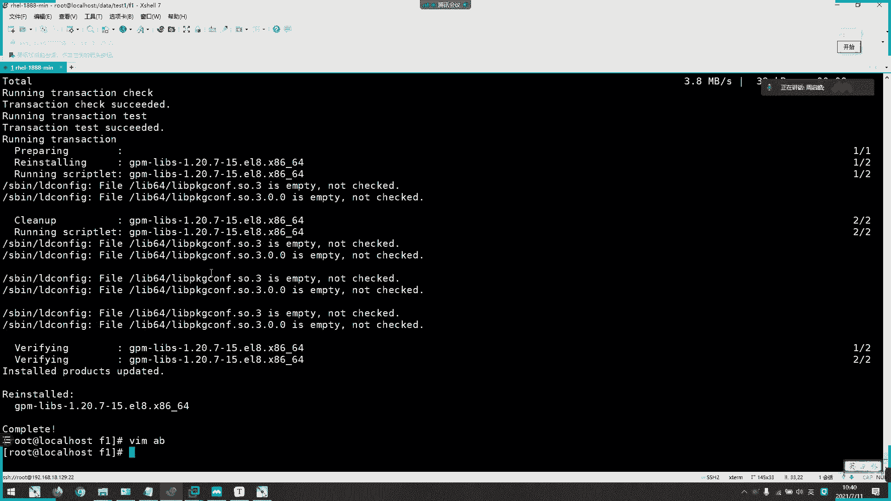
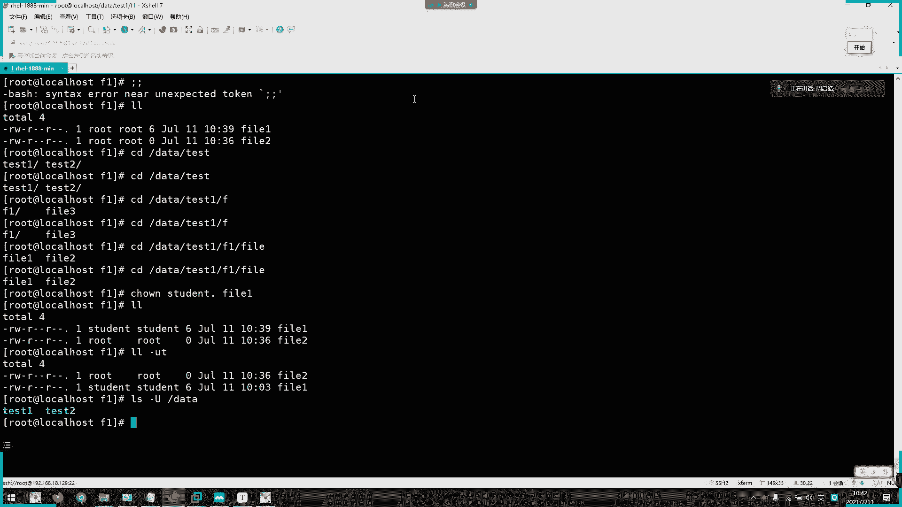
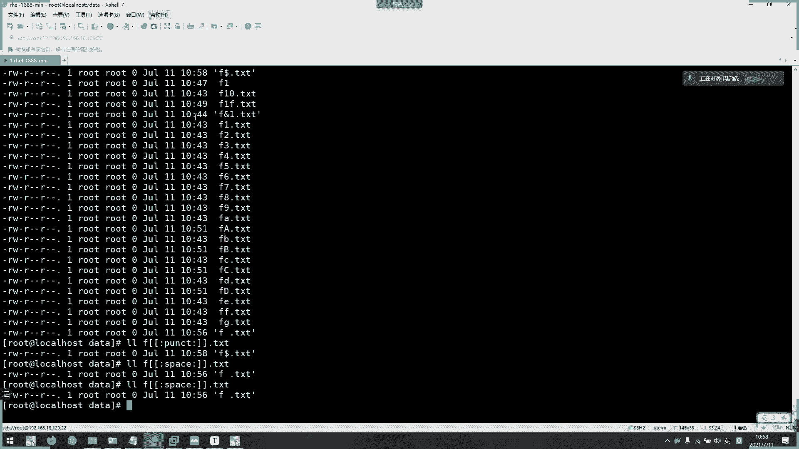

# 2021年7月新版-----RHCE8.2 RH124 RH134 RH294 认证课程 - P4：day2-2 文件操作命令2 - bili_15701050454 - BV1Gy4y1T7ug

那我们讲了一些相关于呃目录，还有文件的一些。操作啊，那我接下来啊再看一下。

列出目录的泪容吧。列出目录的6有啊，我们其实昨天第一天已经用的不少了，这个面料叫L啊这L。S，然后它可以加选下，然后再加我们的一个文件或者目录啊，它的参数啊一般就是装于文件或者是目录啊。

然后呢它的选项啊，我们有杠A杠A呢是可以查看所有文件，就包含以藏文件。

啊，比如说呃我现在加目录。🎼然后呢，可能账目录像是有隐藏文件的，你看我这里就可以列出了啊，S杠A样。啊，这个产景啊。这啊隐藏目录啊，然后隐藏文件啊。都是点开头，叫做隐藏文件。是。好。

然后呢啊该取就跟我们fH是一样，就是以人类译读方式显示啊。啊，就是把它你。

呃，我们的大小单位显示。哎，要加个L吧。对呀它本来是显示1693，然后到这边就显示我们1。7K啊，1。7K。

啊，L8L就显示显示额外的信息详示信息嘛啊，这个是常用的啊，L反而没那么常用啊。LLL条件常用的啊。L杠R呃是目录递归啊，目录递归。比如说我们来L杠R刚刚data，我们是不是创建了很多个目录文件啊。

你看它递归啊，你看显示出来的data第一级。

然后呢，下面有什么呢？有我们的test一t2，然后再查看test一。t一下面有F1，还有fi3。然后呢F一下面呢啊有fi一啊，然后就到t2了。啊，这说。它说道下面有一个波萝叫F2啊，然后是F2。

下面有一个范2，这递规。阿罗巴地V。什么叫递柜啊啊，就是迭代吧一层一层往下啊，一层一层往下低柜。

啊，然后是ILD啊。

可以看到我们那个目录，还有符号连接的信息啊啊，比如说我L1。Publy。诶更啲啊。这里没有。嗯。🎼第三B。等一下。这里可以看到它的一个软连接进去啊。你看这里有个二啊啊二代表它的链接数啊。

二代表它的链接数。

然后是数字一啊，文件分行显示啊文件分行显示。咱可以看一下。嗯。这里面有分台。W。呃，改成L吧。啊，这样就可以了。因为我们本来LL它就是分开显示的，所以它没有显示出来啊。这样行不行？对呀，这边方常解测啊。

看一下二行不行。那，不行啊，只只有一啊，只有一。

啊。

好，然后呢该s呃是按文件大小排序啊。🎼文定大小，我们看一下它是倒序还是正序啊。我们加入入吧吧。啊。

大小发学啊，是倒叙的啊是倒叙的。啊，杠T啊是按照我们的M态啊，modify time啊，modify time。

啊，可以了啊。首先看一下。啊，看这是早上9点的啊，然后这些都是18年的啊，这样排序。

而且时间是由新到旧啊，从新到旧。

然后呃比如。

这个不好弄哎。

我是现在改文件也。看不出效果。呃，我CD到da塔。这死一。嗯。F it。嗯。啊，这里有个foE啊，它10。03分创建出来了。然后我现在踏取一个。空文件。喂。啊，你看。😊，我现在时间一个是03分。

一个是36分啊，一个是36分。那么。啊，我现在用L杠。第一。😊，开楼T吧。看这个啊，呀它新的是fi a。然后是撞一啊，这是M态啊。🎼然后呢，我现在修改一下范E的内容。嗯。😊，嗯。什么鬼？怎么写不了东西？

嗯。哦，我要摁出什么事情呢？都写过了东西啊。嗯。我去。感就可以了嗯。嗯。how to sort，我觉太懂了。什么鬼啊？最少放没有，但是我自己装了。2。While loading。

 share libraries。库有问题。奇怪啊，算了。那就不用再用。先讲课吧。不行。啊。嗯。Yeah。刚刚是F1啊。啊，两个文件。对。那么我现在。응。L杠LS呃杠杠LT啊。性有问题啊，很明显啊。

你看我CD。🎼呼噜。🎼没事有个问题啊。你他可以读文件出来的CD。所以正常他走读读到目录名嘛。啊，奇怪。好。我们都要E口。好不对。L。但LT。它是啊以我们的M态来排序的啊。我在。改一下F一上面的内容。

然后我们来L一下，看一下，你看时间它从零上分缩啊刷新到。看一下。是我写错了吧。没洲包。哦。那C土多啊啊，你隐知到啊。Yeah。🎼可以了啊，不错，渗透的啊，做做挖坑的果然是不一样啊。

😀H。😊，挖看的广就回大。然后是我们的M台啊。

哎。你看我刚刚F1。啊，F1啊，它修改内容以后呢，就变成4点39分了。原来他。403分，对不对？找一下有没有啊，原来是03分的啊，然后呢，现在修改后啊，就变成39分了啊，这是我们的M大。

等一下我们会详细的讲一下什么叫N态C态啊，N态系态。

啊，以及A态A态。哦我现在实力正常了没有啊。嗯。嗯。🎼还是这样。🎼啊不管。🤧好。😊，等一下我们会详细的讲什么叫A胎M态，还还有C胎啊。啊，M派的话啊。我试一下，现在改一下它的原数据啊。呀。啊。

它这里没有变化没有变化啊，只是改了，里面要利用它去变化了。

Oh。等一下我们讲一下啊，桂晓要讲一下什么叫M台。啊，然后啊是我们的一个杠U啊，需要跟我们啊杠T选出来，然后按A台来重新到9排去啊。

Yeah。LL杠。不如题吧。Yeah。你看这里时间又返回了啊，又返回成03分了，看到没有啊，又返回成零3分了啊。

重新倒旧啊重新倒旧。你睇啊。好像是RU呃按目录的一个全面顺序显示啊。

找个。🎼算了，不行。你看。

其实这里看不出效果。那不管看不有效果。跟阿目录名那个排序一样啊。X啊按文件后续排排序，我们没有后续啊，后缀啊我们没有后缀，那就不管了啊，然后呢。关于。文件匹配啊，列出内容的一个文件匹配的。

我们有一个对应的叫做文件通配符啊，文件通配符啊，它可以通过模糊的名称或者是特定的形式来搜索文件啊去匹配文件。

啊，怎么做呢？我们看一下啊，先回到da塔下啊，把这些都删了，不要了。啊，你看心啊星代表所有啊心代表所有。

啊，你看由零个或者更多个字符啊组成的一个任何字符串啊。然后呢，现在呃插取一些文件啊。

F。1到10吧。啊，不对。然后再加个TXT啊后觉。好，OK1到10，然后啊我再加。A到C啊对。错太多了啊，A到几个太多了。啥意思啊。嗯。新一些。嗯。这个渠道这。呀呀其实我这里已经用了通倍服了。

已经用通倍服了。是。啊，等一下再讲起这一个啊。还是有点多感觉算不要紧啊，再他去。呃，一些。测试制服吧啊测试制服。嗯。嗯。都演起啊。嗯。懒觉咯。你上好。downF。好，O。那么我们看一下新。LL新。啊。

要看出吗？啊，心有所有啊。或者是呃。我这边再插取一些其他字字母啊，数字母。嗯，这里就少一点了啊。啊，就做了1个A1AA3。我现在啊LC啊都列出来了啊，所有都列出来了。然后呢，我现在是FC。对啊。

AVC又不见了，对不对？他什么意思呢？啊顺。以F开头的啊，后面用一个字符。这所有文件都列出来啊都列出来。

然后刚刚早知道不删除了。

然后问他啊是任何一个字符啊一个字符。注意啊是一个字符。你看。😊，我们这里没有列出1啊，还有一个特殊字符，对不对？啊，只有一个字符的啊。F后面就一个字符。点TST。啊，这是我规定了它的一个格式啊。

我目前刚刚他说low such file or delivery啊，就找不到文件扩展目录。为什么这样报错呢？因为我当前目录下所有的。开头的文件都是F。点啊若干个字符对不对？若干个字符。刚刚的那种F问号。

它的意思是我要匹配当前目录下。F后紧接着一个字符的文件啊。那么我没有啊啊，没有，只有一个，都是5个啊，是那6个，对不对？所以他就报没有啊。啊，我现获取1个F1。再用这个打对呀，那就出来了。

只要我后面不加东西，就是F加用意字符的意思用意字符的意思。

好，然后是呃括起来啊，阔起的累。然后呢，是。对于两个括号之间的一个任何字符啊，虽然它这里是ABC啊，这是ABC其实它不是顺序来的啊。

啊，比如说我在F。呃。点TXT。这里加点东西啊。呃，叫做。一。F 你看。你不要换成ABC就把它当成是26个字母啊，但是。

代表字符的意思啊，代表字符意思。你看我这里都没有顺序的，一个是一，一个是F啊，就个括号里面它以单个单个字符为匹配条件啊。比如说我现在是EF对不对？EF。

那么我第一个匹配的啊就是F51点TXT。第二个匹配就是FF点TSD。能理解吗？这个。啊。这个理解吧。啊，不如说，我就帮你们力贴了。好。

再往下啊，然后呢是叹号啊，在里面加个叹号，就是不包括我里面的字符啊，不包括我中号里面的字符啊，以刚刚的为例啊，这里加个大号。

对。说没有了一和F。啊，不是没有了啊，对对对啊，是没有一和F，对不对啊，你看从F2开始。啊，这月F开始。是。腰呢这里啊。ABCD1。到局了啊，是不是没有这两个啊。

所以学法的意思啊就不包括中括号里面的支付啊，不包括中户号里面支付。那同学们，我问一下，我现在他取一个啊F。F 呃 f e f 点 t s t。我这样子说。这1个FEF点TST这个文件我能不能搜出来？

能不能匹配？啊，同学们。回到一下。能不能匹配出来？不能。不能是吧。啊，如果说不能的话，应该学到了啊。啊，如果说不能的话，就学到啊。因为我们是以单个支付，对不对？啊，它不能作为整体的它。就让通括号括起来。

它不是整体啊，不是整体啊，它就是一个单个字符。啊，所以啊你们理解的啊，W不仑的是理解啊。

好，然后呃通视图也是一样啊，跟我们参照是一样的，我就不演示了啊。

啊，然后是呃。apple啊不代表任何字符啊啊字母字符啊任何字母字符。那我现在先。啊，先不讲。嗱做个黑啡。A p。第二款。哎，PLV啊。嗯。啊，PH。对好，那就排有数字了啊，排有数字。

然后只有ABCDEFG啊。然后我现在在踏取。F。2写的A到。第一。对 test。那同学们，我现在。说这一个。我匹配的是大写还是小写啊？啊，O匹配的是大钱还是小写？一定要多个思考啊。啊，我匹配的是大型小。

哪个思考才容易学进去啊，跟你们说。小写小写。其他同学呢？你觉得呢？56个同学。部分。都有。啊，对啊。啊，是全部字母，不区分大小写。对对对对对。🤧嗯。那么我现在。对改成upper。啊。你们觉得是什么？

U是什么意思啊？U。啊，大写对啊。那么感觉落了。啊。啊。对啊 up哎 no啊。😊，啊，就大小写的意思啊。这个呢。😀呵。😊，所以卡到了，哎呀，可以啊，同学们有基础啊啊。😊，So。我拼错了啊。应该是第二句。

也许吧。很少的吧。

啊，都不对。没有，他们的意思是对的，只是我拼错了。😊。

呃，第IGIT啊DIGIT啊，而且还是单个数字啊。

啊。改是单个数字啊单个数字。所我觉得如果是单个数字，我用1到9不好吗？Okay。啊，0到9。这样不好不像吗？各位。

啊，O。😊，呃，大家。

啊，来个。L numberL number。啊。两个字母你就得加加一位了啊，这个呢。这个你们觉得输出什么了啊，AL加数字哎。吓。A是不是numbber的意思？变个字母。字母数字。啊，对啊。

字母数这个钱啊。😀Yeah。😊，而且是单个的，对啊，一定是单个。啊，刚刚问到两个两个怎么说，两个。两个我这里再加一个。你看是不是啊，那不要出了个词出来嘛。Good。

好。嗯。

看一下这个能不能打出来。打个符号。我呀。Pu。🎼譬如什么MCP啊，这个真的少用啊，这个有没有东西打出来啊，你们觉得这个有没有东西打出来？我刚刚有一个特殊文特殊符号的文件啊，有一个。

但是它这个啊叫做可打印字符啊。能不能打出来，我也不知道我没试过，很少用这个东西。啊，看做了没有啊？看一下space行不行啊，pa有啥用的？

啊，也没有。诶。😊。

可打印字符哎。啊，有个一啊，这里还有个一，难怪不行。加个一啊，打出来啊，然后是space啊。spacepa就没有了。

space啊，它就设自了符啊，框换符回射符，还有框境符等等。然后咧。两个区别就在于。space包括空格，然后这个是可打印字符啊，所有的可打印字符都给。

啊，A那些不算是支付啊。就是字母不是字符啊。🎼怎么不算那舒服，但我现在加加取一个空格出来啊。服这里弄不出来呀。对不对啊，有一个，那么我现在用这个。能不能打出来？啊，能不能打出来？啊，同学们。啊，不能。

ふ呵呵。😊，space啊space，我们空格键的英文叫什么啊，空格键的英文。😊，空过这的因为是不space啊。空间吗？啊，对啊，空格吗？空格吗？呵。😊，斯贝它那个引号是它的一个强景用而已啊。

因为特斯祝符昨天说了，特斯制符的文件名啊，必须要有双引号引住啊。所以号引入那个算引号不算不不算在我们那个文件名的啊，只是它系统中显示不出来这个文件名啊，所以它一定要用才应用把它作为字符，明白吗？

你看这里也是一样啊。啊，这也是一样的。打 space子。打开成BONCP。没有了啊平行CD就没有了，因为它不包括空格，对不对？它不包括空格。哎呀，我们他取一下一个F。And TXT。呀它会自动引起来。

看到哎我我弄么多了啊，那么多了，多了就这可能打不出来了。啊，打得出，low space你们觉得打不打得出来啊？啊，研究space能不能打出这一个文件来？啊，你们觉得能不能？啊，冷啊。对。啊，对。

😀呵呵呵呵。😊。

是。那我觉得冷，因为多人说是话服啊。

但他这里面啊不叫换，我也没办法，我也没办法。啊，他说是算是最表符了啊，不算是可以可可打印字符了啊，它不算在最表符内啊。

自己注意一点啊space跟这个put其实space用的还比较多一点啊。space的话一般是用于空白字符。很少很少会有什么可打印字符作文件名的，所以我们了解一下就可以了。啊。

空白字符space呢其实这个也在通配符上面也不常用啊，在通配服上面也不常用啊，我们后面要学到这些表达式啊，这在表达式是对文件内容的啊，通配符是对文件名，这表达示对文件内容的啊。

这文件内容的话呢sspacease被常用了啊，space被常用的。啊，包括我们多少次宽环符啊好OK。😊，可能是刚刚那个跨栏幅dora，它在这里显示多ra，但是它实际上。

啊，就是以。倒近视形形式打印出来了。但是我们的宽幅在文件中的框幅呢，它叫做以阿克斯码的形式打印出来啊，它有一个对应的数字的，有一个阿克斯表对应的，所以可能是不同啊好。

这里是一些啊比较小气的比较小气的。啊，其是一样的这是我们课本的这是我们课本。然后这下面那些是。从其他地方总结过来的。啊。然后呢，这里可以才才有一些特定的符号表示特定的含义。我们叫做圆美的字符啊。

叫mate字付啊，元数据有意思啊，原字符原字付。啊，了解一下就可以了。好。🤧还有更多啊可打印字服pre啊啊什么非打印字符啊啊。conttrol啊哎什么图形字符啊，图形字符什么东西，然后1六进制字符啊。

啊，什么水平空白字符那些啊，其实不用管了都不常用的啊，了天一下就可以了，了解一下就可以了。然后呢，最主要的是我们的一个夸括号。跟中括号的一个区别啊，我们来看一下。

呃，我现在删几个啊。呃呃呃。三。应点是，其实不用这样子。好像没有三次，对不对？没上市。然后我们现在LLF。一点点。嗯。那么我们现在。是什么呢？F一大夫。有F3F4吗？啊。F3不4吗？啊，没有。

虽然是没有，但是他。会有自情。啊喺。啊，但是他会有执情啊，要注意啊。好不好？括框代表范围啊，就它把里面的元素。啊，从1到51个个都。给我们一个整体去执行啊，所以他会执行50啊，会执行50。那么。

中国好啦。啊，注意啊，冲号表示范围是很杠啊。Yeah。🤧。啊。这个输出是什么了？啊，他执行次速是多少啊，执行测速。看一下你们前面有没有把把握好。啊。同学们。你们觉得他输出是什么？啊，对啊。

If we ever。为什么呢？它这个意义是怎样来的？我给你们说一下意义啊。但是。画不号1。5。他包含执行的是12345。啊，知道就行，中括号。1到5。啊，但是呢我们可以把它看作成是。12345。

那么中号或者。里面的字符啊。这是什么了吧。不需要再往下讲解了吧。啊，同学们。还需要大家讲解吗？这里到这里了啊，到这个位置还需要讲解吗？Yeah。能理解没有？啊，这表示范围，其实它里面是12345。

然后在中号里面都是相当于每一次匹配里面的单个字符啊，单个字。所以他有就有没有就没有了，对不对？

明白了吗？啊，框号跟中号的一个区别啊。好啊，接着啊是我们刚刚提到的一个。呃，M它A它还有C type啊C态。他们都什么东西呢，分别是什么东西的，所以提到了一个三个时间戳，三个时间戳。

对于同一个文件有长时间说。我们刚才说到了。在mininux系统中。啊，文件的数据。文件数据其实。两个合为一才交一个文件数据啊。这是我们的mate data。1后是一个是对的，昨天是不是提到这个东西？

它分开群放了，两个分开群放，但是两个读取在一起才超出11个文件。啊。下是存放文件内容。可以操作。真实数据。这个数据啊。啊，字不是写的有点丑啊，用电脑写。啊，然后meta data原数据。啊。

存放文件属性的。嗯。那么什么叫语言数据？什么叫文件属性呢？啊，其实我们一点都不陌生啊，这个东西一点都不陌生啊。

包括在windows系统下，其实它的风格也是这样子的。他的。

它的它的它的原理也是这样子。我们来看一下，顺便找个文件吧啊这个。啊，我点击属性。Yeah。はい。即对。这对。都是该文件的。原数据啊看这里也有它的一个时间啊，什么。Yes。春紧时间啊啊。

退款时间是我们的modify它啊，然后访问时间搜搜A它呀查看时间嘛，对不对？し。但我早上打开过，所以它变成了今天9点30分，对不对？然后它的一个大小。存放位置。什么位置啊，还有它的一个权限啊权限。

然后安全这理。啊，所有者所有组。然后他们之间的权限内容啊。这些都是原数据啊，这些都是原数据。啊，所以回回到我们lininux，说的一点都不陌生啊，说一点都不陌生啊，关于这个。原数据的内容。那么我们主要。

目前啊先关注一下什个时间戳啊，我们可以通过STAD。

啊，这个去查看文件的一员数据啊。比如说呃我现在传F1点TXT。你看。这会有时间。嗯。到时候有时间。啊，A他长的时间。我没看过吧，就出现的时候，他们三个是同步的，创建的时候是同步的。那么。问一下同学们。

我们的modify time是改变文件内容的时间。

那么我现在啊写一个东西到里面去啊。嗯。F1吧，是不是F1点TST。好，大家注意啊，目前size40啊，目前size40。Yeah。你们觉得我现在是大小是多少？😡，啊。啊，你们觉得是多少？

我刚才写了5个字不进去。5啊。我看一下是不是我。啊，16啊。😊，啊，这不外礼拜还没学到啊。😀Yeah。😊，🎼为什么是6啊？然后明明五个字符嘛，对不对？😊，但是我们。在winux里面呢表现啊有个表现。

有个。夸幅。比较宽富。🎼兜了啊，所以它是6个字符。没学的啊，不怪你们。那么我现在写了利用进去实际。我们改的是哪个时间啊，猜一下，猜一下modify它是修改数据，然后圈子它是修改原数据。

然后at time是图文件的时间，看一下哪个时间发生了变化。

安排安排。啊，A态M态。几睇饮睇。啊，没有人。觉得C态有改变吗？啊，有冇人觉得有 c态有改变啊。你觉得有？😊，大胆说出来。😊，访问时间。A态啊都觉得是A态跟T呃跟跟M态，我觉得三个时间都有改变啊。

我觉得三个时间都有改变。有没有？ふ。😊，嗯。啊。同学们。刚刚我说了。😊，原数据包括什么东西？其是我们这里DATT查看到的都是原数据啊，首先是它的文件名，然后我还指定了这个赛事市名啊，特意指出来了啊。

特意指出来的。😊，然后呢，还包括它的权限。啊，说着说走。啊，然后是他的1个IO block啊，这些我们一般都指定不了LL得知啊I知这些目前我们指定不了。但是我改了大小。在改实际内容。

算是改实际内容是默认费他改了，对不对？你看他们是同时改的啊，同时改的，因为我大小变了，对不对？大小变了。然后刚刚进去看了，所以又有A台。如果不进去看，A台是肯定不会变。对不对？😊，理解没有？

像我自改了大小啊，M是必须改的，他说他大小改了。😊，啊，大家改，所以他这里也也说是也要改。那么。我们看一下。啊。嗯。🎼我这个也不确定啊，我忘记了。我之前问过啊。🎼呃，对，我之前问过，就上上一期问过。

我也我也忘记了，我们这里改一下哎。🎼么出事了。嗯。嗯。😮，Yeah。什么回事？但我写不了东西呢。Yeah。🎼今天这干嘛了呢？Yeah。怎么进入不了超越模式？录取。什么回事啊？去。Yeah。Yeah。嗯。

😊，我在按方向键，它居然变成这样子。1后下面有没有显示采购模式，用VI吧。🎼对，U娃应该可以。Weby。不然有问题。啊，那么这里改成。rod啊，我忘了啊。也是5个直播，对不对？也5个直播。那么。

他这一次。是。改的是什么时间？啊，同学们。变态烟态C态啊，A他肯定有改，因为我进去VIM了。只MC对比，我看一下。心态到底有没有改变呢？그죠。有的。是吧。就他大小没有改，其实他实际内容也改了。死你要紧。

等等。是。怎么按lo只改了。好怪，今天做事。怎么安lo的遮盖。嗯。唯一的应该。0134再改一下。응。哎。呃。可是他会不会把L值再改一遍啊？啊，对。就内用不同的Ilo只会更换。因为他。上字符没有变啊。

跟你们说一下啊，算字符没有变。但是。他在我们。嗯，磁盘上那个磁图数据已经不是同一个位置了，不是同一个位置。所以啊原路就改了Ilo值改了。然后我来看一下。啊，目前还是A碳M还其他。那么我现在把。

这个文件的所有者。改了。大家觉得。这一次改的什么时间？是。啊，对啊，C态啊。修改时态。因为L太啊是。实质数据做修改C态是原数据啊，原数据。比如这个 childrendren。所于原数据不属于实际数据。

对不对？所以我们只改了原数据的时间啊，所以是题台时间啊，好很好啊。

好，那么我们先休息15分钟啊。

