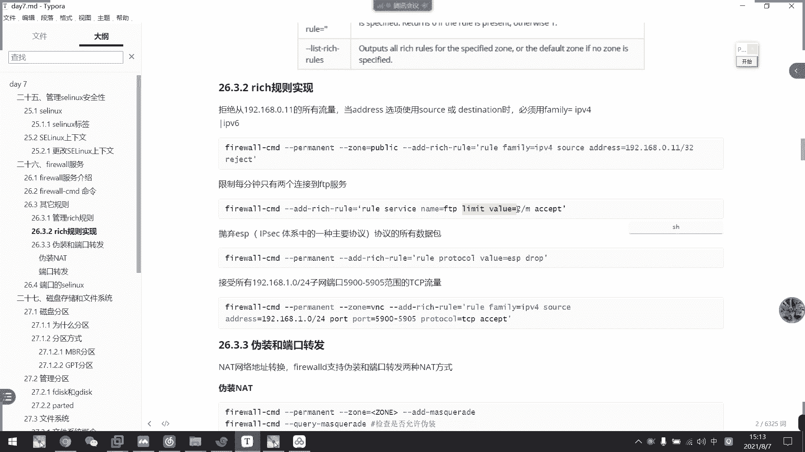

# 2021年7月新版-----RHCE8.2 RH124 RH134 RH294 认证课程 - P50：day9-5 firewall的rich规则以及端口的selinux - bili_15701050454 - BV1Gy4y1T7ug

呃，刚才我们一个。简单的了解到了它的一个基本规则啊，觉得也不难啊，大家多写一下就可以了。多写下就可以了。啊，然后我们看一下它的一个其他规则啊，它还有三种规则组要，一个是富贵则啊，一个叫做。呃。

复卫者一个是伪装，还有一个端口转发。那伪装的话，我这边就不讲啊，因为这边的话需要其他虚拟机才能做到啊，然后端口转发还是可以讲一下。那么我们先看一下复位者啊。谁要的复会长？呃，我们可以看下。

附规则的一个语法，首先是word，然后是圆啊，然后是木地。啊，然后它通过了可以是我们的一个service airport啊，或者是协议啊，然后是IICMP块啊，或者是伪装啊，或者是我们的一个断货转发。

啊，然后可以选择什么日志啊，或者是呃通过啊拒绝啊，或者是jo。刚刚我们已经讲过了这三种的区别啊。然后复会程我们可以通过我们那个啊m第五章的一个which language啊，那里可以看到啊。

那我们可以看一下副位式的选项啊，复位选项啊有一个。呃，添加是ad。啊，whichach and which ruleer就它叫复则，然后删除，就是remove which ruleer啊。

然后这个是什么来着？Qy外。speakak at to the。Oh。这个什么意思啊？Q路压坏。我英文不好。QEIY我在讲QEIY。你翻译一下QQEIY什么东西。因为这个很少用到。嗯。疑问啊查询啊查询。

啊，然后这个是列出啊列出。所以呢其实我们也是自身改造的意思。真商，然后是查。好，然后我们看一下复贵则的一个实现啊，复贵则的一个曲线。嗯。

比如我们现在把这个。规则全删掉，基本规则我们全删掉了。啊，其实也不需要。他有一个读取的顺序的。啊，反正这里啊不用删了，反正这里都没有了。我把这个语删掉啊。う。注意木。Remove。

source等于192。168。18。129，先把这个删掉啊。弄一下。好，那么现在现在只是可获得到我们ENS160这个规则啊，然后啊通过这个网卡访问这个网卡，它会进入到这个重类匹配规则。

然后我们现在写一个。

呃，付贵则啊这个付规则。嗯。😊。

我们就写这个。啊，对。per啊，然后选择它的重啊，我们这边用worker。啊，我然后。啊，at rich ruleler啊天下复贵者啊，然后去发 ruleler。farimily啊为我们的IPV4啊。

然后sourcece。address就是呃原IP啊，就是谁过来访问啊，谁过来访问。我这边试一下啊。嗯。18。129。走啊这里。啊，写他一个拒绝吧啊，写他一个拒绝吧。然后再加一个啊。刚刚是改什么来着？

217。Dian。多少嚟啫。是。哦，不通咯我两个发告。他网两个网络本来就不通的。啊不好意思。怎么办呢？他两个网络不通。那也有办法啊。不行不行不行。不行不行不行。怎么办呢？他lo头又有问题啊。

他没问题的话，我就。不用这么复杂。算了，我们先补那个。🤧好。反正我们现在啊。其实已经拒绝掉1喝酒的请求，对不对？那么我们现在。看一下啊，没笔录啊。对呀，富贵则在这里。啊，主要它是IPV4的。

然后是来自于这个IP的，我们全部拒绝。那么我们这里本来是可以。你这SSHHH对不对？我们现在可以在直播间先拼一下吧。拼已经不通了，看到没有？因为只要是他我们都拒绝啊，所以拼已经评不什了。

更不用说SSH啊，对不对？18点。12。啊。对看直接。被拒绝掉了。好，那么我们。把这个规则给删掉啊。先把这个位置给删掉。啊，沙条肉笔墨法。嗯，对。So。所以。文毕啊职业啊已经可以聊，对不对？啊。

所以呢我们可以得出一个什么结论啊？啊。它的一个重类的匹配顺序啊，先匹配负规则。再匹配基本规则。他们有一个新后取长，先匹配副会者，然后再匹配我们的进会者。

🤧好。那么继续往下啊。要不它可以限制每分钟呃，只有两个连接可以到。FTV服务啊，但是我们这里没FTV。

呃。改成是我们的那个。

SSH吧。service。

还是这个做啊。啊，还是ES160。盖的。Which。不。是有个等于吧。放个 우。But way。忘记了service那个。Servic。零等于。这谁谁区。嗯。

然后是。Lit water。

我。啊就这个。嗯。s有 v i c。

平o S C RV I C。

Rle。我试有 v i c。S啊小了个啊。可过来了，因后我们。回弄一下。好，然后再查看一下这个部位的。那我现在应该是已经连了两个了，对不对？看一下能不能连第三个了。怎了年呢？为什么能连呢？这两个。哦。

可能他。这边把它当做是一个机器啊。一个机器。他都不关心下，他按照服务来算的呀。160。在CC社区。Your service a set limit。Volume 2。

🤧没两分钟。每分钟只有两个连接。

再来。有八点。诶。每天制上午。没录过了，对不对？嗯。每分钟。没限制上哦，你没有发现没限制上。那就。

是不是机器的他他他说mark的。

我看一下，我开多几台机器看一下。随便开点啊。So。2点168。18。128啊。输密码在哪。呃。两台了。没分就上啊。咪先生啊。🤧嗯。

是不是写的有问题？Wural service name。U SH。然后是limit。

That said the。那个顺序怎么？不し。

Yeah。是有问题。

他规则自动改成是SSH。然后是的色的。

每分钟2个。

我先看一下。设会是是否有问题啊。我掉啊。所以我就不服掉。这是真的有点东西。嗯直接。把这个。你交掉了。L。Enable。对呢个。等于是他不能。控制这个。

嗯，咋搞？

为准。Just。Not in allo so recently。他这个不能单纯的去关闭这个SSH。

我看一下。让他不能访问22号端口。啊，应该是这个。这个是结束的，我这个要拒绝啊。

嗯。做分享。都分享。而不是艾，我这里是分行的。

那，问题不大，因为我粘上去，它直接运行了，我就知道什么事。不是FI的问题，是他分行了，让他直接就行。我都需要要改的。还有是这个source address改一下啊。嗯，18吧，然后整个网络吧。ほ。

1追322啊。是TCP的啊，不多go啊。要是。说掉了。这样就可以。嗯。😊，I没 re。那我现在做掉它的一个。呃，20号端口啊TCB然后是这个网络的那我们肯定现在是全部连不上了啊。对，连不上了。

啊有冇晒啦。A。都连不上，看到没有？然后我那个是做掉了。并不是违卷。呃，他不能直接拒绝一个服务啊，只能通过语言啊，通过IP这样子。看行不行。这规则看下重西。不要这个。表示service。零。谢谢谢。啊。

这个也可以啊，那我们先把前面那个删掉啊。一十六个二啊。啊，一个是通过端口工资啊，一个是通过服务工资啊。睇下行唔先，诶。还没没动啊。嗯，你看我现在把那个复位则改了啊。感觉这个啊SHH。依样是不行啊。

依样不行。因为呃我现在拒绝的是这一个网断了。这个文道，所以他们都不写。

所以啊这里可以啊那个是可以接受动幅范围的。我这在是刚刚是指定的啊，刚刚是指定。啊，这是我们的附规则的一个基本实现啊基本实现。啊，也可以是呃。设定那个相关相关的协议啊，指定协议拒绝也可以啊，指定协议直选。

呃，比如说。嗯。我都要协议。Sieyi。他说不好理。Did you do me it。呃。H TV sheet。没有其他协议的，只有这几个。

不好做实验啊。啊，算了，那就不做这个了。大家看到这个就可以，什么EP啊等等啊。

好，那么接下来我们就看那个。呃，伪装这个做不了的做不了，大家了解一下也可以回家了解一下可以。其实就是lot而已啊，就是lot而已啊，文章就是lot而已好，然后我们这边主要是看一个多货转发，多户转发。

注意一下啊。到的话有什么呢？啊，就是这个。把他反还过来。就是说比如说我这个A。访问我们的B的22号端呃，不对。Be的。1013。你当学啊。就是说我这个B它有一个安全风险啊。

就说我不能把那个真实的端口暴露出去啊，然后呢只给了我们A10130这个端口。然后呢，它B的话呢会通过这个10130。转播到自己的啊，比如说他SSH的啊，然后转播到22号do口这样子。好，我们试一下啊。

嗯。我试一下。那个重，然后是。这里。for to pot，然后。或等于什么什么，然后是不to协议。我们看一下放地怎么做。O再翻你怎么做。首先是我们的一个指定它的一个呃指定它的一个重啊。我来参家。

这复制不过去。好，先复制过来慢慢看啊。啊，首先他这里是发呃是是指定了在我们的work中里面添加一个复位者。复位者内容是什么呢？啊，原IP原IP我还没改啊。查一下。这改成188，整个网豆嘛，整个网豆。

然后呢。for products是80。KVV然后突破的8080就把他反过来的80端口。

转播到我们的1个8080啊，我们看一下是不是。

我要反过来。八点计上八点八点。그죠。然后我们语录一下。好，让我们现在看一下规展。Hei。总冇有了。他不是s死了吗？Family， I P。哦。我会注一到没有破。一重新加载就没有啊，现在加了啊，现加了。

呃，然后我们试一下呃，先在160，我们看一下。Co。巴黎是有的，我试一下。克192。168点118。128。然后是。有。看明白了吧？嗯，看明白了吗？🤧我们看一下。我这里是没有开通8080logo了。

980。走发点，那么我们断后转发就是说。只要是这一个网洞。访问到我本地的8080端口，他接收到这个请求以后呢，他就会啊而而且这个要TCP协议啊，注意啊，要TCP协议。然后呢。

他就会把这个转发到我们的80端go啊。所以我们只接进的80端go。然后呢，他们这边是要访问我们的8080。你看访问80的话呢应该是拒绝的啊，看到没有？这个是不是可以啊保护好我们的一个内网的IP啊。

内内网的端口啊？啊，虽然说其实这样一般都不会这样转，其是一般都不会这样装，一般的时候都是改动口啊。或者是用我们的副均衡啊，都是用外部的啊，都是用外部的去虚拟1个IP出来。然后它从外网再进入到内网的。

一般不会这样做，但是到少发这个了解一下就可以了。啊要明白这什么意思就行了。8080，然后转播到我们的80啊，或者是我们专销包。如果这样子就会冲突啊。如果这样子就会冲突。如果有8080。

他就会访问到8080去。嗯。😊。

也不会这样说嗯。伪装的话，你也一样可以全伪装，只是我这里机器不够啊。有候积器不够，不想做这个了。嗯。这里也有。就是说其实。也没必要对着伪装，因为一般到。工作上用到的都已经是伪装过的了。

怎么可能会暴露一个内网地址给外面了，对不对？嗯。都说了啊工作上一般都是使用了一个一些负载的，或者是加个呃VIP啊，VIP，然后他都发现不了。其实这个真的没什么意义思，只是告诉你们有这个功能而已啊。对啊。

就是告诉你们有这个功能而已。啊，如果他有刀口的话，会冲突啊啊如果刀口的话会冲突啊。

啊，比如说我们这里。不行了。不行不行。22号端口本来就那个。只要说一个是克。开下吧。调了。I make wrong。调的可以噶。但是这样确认不了他是否。对啊我也我本来想这样子，所以但一个是刻。

一个是SSDH的话，呃，那个很难作用起来啊，很难作用起来。重们改一下这个规则。先做一次报啊先做一次包。诶到两号山啦。对。做什么东西哦，对。全全拒绝掉。连不上去了。然后先把那个柜子烧掉了。赶紧把规则删掉。

哪个。就是这个。是的啊。诶我싼。怎么还有我？我那个 link。We move。令等于SH。嗯。😊，删掉了。笔录一下。其实我很不喜欢敲这个，他什么都要两个人干两个人干，烦死人。是不是？很不喜欢这个。好。

我们现在做一下包价。杠I啊这就我们的ES160。TCP的。二零八年。Hm。😊，他就不能提示我阿里输错吧。我们看一下。这里有做到啊。可以看到看一下做了什么东西。呃，从这个主机过来的啊。

555270访问到这个。组织。嗯。没有写东口。直接把端口都隐藏掉了。把都扣都隐藏掉了。Don开啦开。玩锤子，端口都隐藏掉了。课看一下啊。但是隐藏掉了。没看到他反问到哪个端口。我们做豆腐吧。做多口。

系八零八年。指定端口。其实我是什么职弟来着？没有。没有。啊，809。80鉴定的都是HTTP服务的。🤧咳。那做不了这个包。8080都没有。啊做不了这个包。诶。刚刚。啊，应该是我语法写错了。

可是我语法写错了。再跳出去啦。有吗。有地址啊有8黎8黎啊有。啊都要通过八年八年沟通嘅，睇到未都系通过八年八年沟通。啊，就没看到帮黎呢。没了吧你。都要通过百点帮你沟通。刚才是我语法写错了。

我以为M不能加在这里。那就。我们这个隐藏掉了。就说明了。啊，说明了我们啊是。他真正的沟通啊都是8080的都是8080的。啊。虽然我们真的没有启用8080logo啊，但是他们之间的一个沟通啊，都是被引。

呃，被被隐藏掉了被隐藏掉了，都是通过呃8080反问过来的。那个就数字化数字化数字化。我叫A，你看一下。啊，不再嗯。

啊，这里可以注意到啊，刚才地址全都是数字嘛，对不对？全都是数字。其实这里啊刚刚哦这里是一个端口碟，刚刚没注意啊。啊，就说web cage啊。取消了。好，那就说明他这个转发啊是可以隐传调。

然后他真正沟通的啊，还是8080与。他这个沟通。啊，他过来反问过来的是什么都口没所谓的啊，之前我们已经讲过了啊。好，O。那就是我们的一个。呃，当我转发的一个复位制事现。好，那么我们继续看往下看。是。呃。

往下看啊，又回到1个SClin啊，又回到1个SClin啊，我也不知道苏本为什么要把它分成两个站起来。来来讲讲完防火墙又又回来讲ICD。好，所以我们早上说了呃。我们。呃，这个主体。早早早早上的那个文件啊。

是主体为进程，然后是啊是用户啊，客体是用户。然后们现在这一次呢是课体为端口啊，客体为端口。啊，那么我们这边就可以看到啊。也是SC image，然后是可以看到我们po的标签啊，po标签。

呃，SE manager。Hot。

嗯。啊，这里啊就可以看到我们那些啊相关的一些。标签啊，还有它1个TCP，还有一个端口范围啊啊协议还有端口范围。然后呢嗯它这边的是端口的标签啊。比如说我们看一下HCP。啊，graHTTP。

啊我们HTV的那个。啊。真正的一个安全窗口啊，就是808143488008啊，然后是8009843，还有9000啊这些。然后呢这些是我们刚才做的一些。东西啊，所以啊那个8080可以反回过来啊。

然后呢端口的S6是什么有什么用呢？啊，我们来看一下。我们现在看一下有没有那个。开启啊。啊，是开启的了。然后呢，我这边啊HDport。杠T啊，这是我们HPP服务的嘛，对不对？啊HDP服相关啊对不对？

那么他可用的就这些装端口啊，目前可用的是这些这些端口啊。让我们来看改一下啊。HTV。🎼都是控。啲啊。叫什么来着？我觉得是靠谱。要我们先把这个豆肉改。啊，就简单这，改成薄了。1了我现在重启这个服务啊。啊。

你看直接起不来啊，直接起不来。我们可以看一下他的一个日志啊。啊，他就会认为这个是非安全动啊。这个permission decline啊，主要是permission decline。

然后可 not buy to address。呃。对啊八度。🎼他不能使用这个I啊S6保护了这个东西啊，保护了这个东西。那么这个怎么做呢？那么这个怎么做呢？呃，我们直接。呃，改一下。不要证据。

然后是port。也是加暂停。嗰啲。叫什么APP。第一。The ten。皮。呃，加个82吧。不好意思哦。调皮。嗯。😊，For apple。Proda or is need for the other。

这不是立德吗？一。系啦。🤧嗯。起个怪。Po的。The total。哦，P4pro。流水是。Modify at。2杠T。不能填写吗？就可以填写了。可以这些。哦，知道。诶。🎼那我没错啊，是，这是杠T。

你要是杠P。要是82多狗。

这不行，我看一下笔记吧。我放弃了，来看一下笔记本。破的。哦，首先是端口啊，然后P4协议啊啊，我知道。

他这里端口不用那个啊。这里加一个协议，就做PCP然后这里。port的后面直接加端口啊。什么他说我这个态度有问题啊。我刚下是不是有1个SY啊。呵。说个什意思哦，直接是port啊，不好意思，是我错了。

他他跟文件不一样。こかか。嗯。😊，我多了个啲。好像加在加了，现在在加了。啊，所在加然后我们看一下啊。再重新看一遍HVP的。你看8个多我们就加进来了啊，8个多我们加进来。然后我们看一下tus。🤧咳。

一直续B例。有了，大下是是关了，我们现在看一下能不能启动啊。

看一下能不能启动啊啊。烧出来啦啊，所以呢个当我都一千年你。他这就这就是了。用他对应的是哪一个进程，我们就加到哪一个进程就好了。

跟齐权。没有什么其他东西了，没有需要什么其提示了。对不对？啊，启动起来了。感像你色网的port82啊。那我现在肯定发问不了了。呃，因为。呃，这个80已经被拉个掉了被拉个掉了。然后82的话又没有规则啊。

目前没有规则。除非我们把防火墙关掉啊。两百喺要几十。就是说他就保护了这个进程如果它那个端口。啊，开通的那个端口跟他。不是相符的那些你的标签，那么它就不能给你更改啊，不能给你启动，你更改完就启动不了啊。

更改完就启动不了啊，明白这个意思吧？

啊，那么我们S00的一个端口呃6的话话，我们就讲到这里啊。对安全机制。这实没什么用啊。3点钟还是要把它给关掉啊，该关掉的还是要关掉啊。算了，我们下一节。啊，对，开来干嘛，我们下一节是又是其他东西了。

我们就先休息吧。

先休息吧。4分钟也差不多。