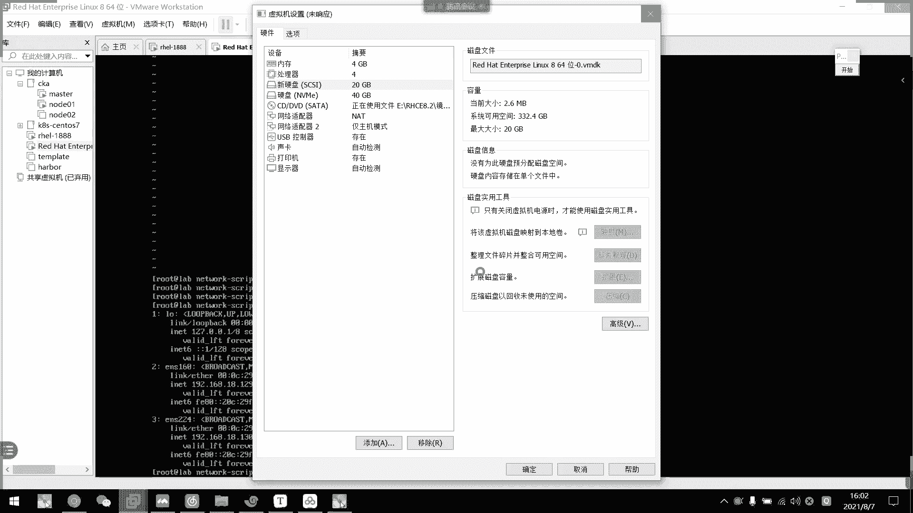
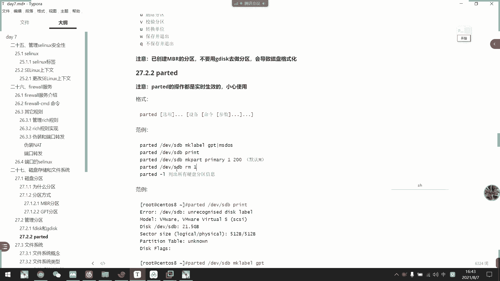
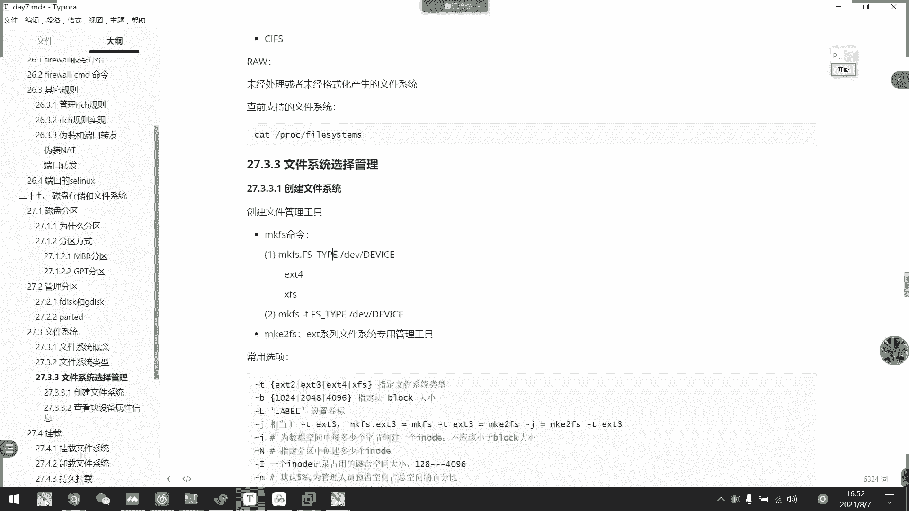

# 2021年7月新版-----RHCE8.2 RH124 RH134 RH294 认证课程 - P51：day9-6 分区操作以及文件系统选择 - bili_15701050454 - BV1Gy4y1T7ug

继续上今天最后一节课。好。我们进入新的篇章啊，进入新的篇章啊，是我们的一个磁盘存储与文件系统。首先我们来看一下磁盘的分区啊，为什么要分区呢？首先是优化我们的IO性能。

然后呢可以实现我们的一个磁盘空间配合限制，还可以提高我们的一个修复速度啊、隔离系统和程序啊，可以安装多个程序啊啊，多个系统啊，啊可以采用不同的文件系统等等。然后我们。分区的方式有两种啊。🤧嗯。

一个是MBR格式的，一个是GPT格式的。呃，MBR格式的话是比较传统老旧的一种啊，包括我们windows也是一样啊，也是MBR还有GPT。大家不知道有没有6批。啊，有没有用P去装过这个呃。系统啊。

然后我们做分区的时候，也可以选择MBA还有GPT啊。呃，站在他那里好像不叫GPT啊，叫什么来着？就ID啊，是不是叫Gide。他整个系统来那里关什么呢啊，有什么用？对不对？啊。

然后我们先看一下MBR分区啊，MBR分区。呃，AR分区。他。的一个格式什么呢？允许有。主分区。主分区啊MBR分为主分区。啊，然后是一个是我们的扩展分区。或者不去。然后呢，主分区。主分加扩分。啊。

最多是4个啊最多是4个。所以呢我们可以怎么做呢？一个可以是有三个组分区或者是4个组分区。啊，也可以是。呃，一没有主分区，整个直接是这样吧啊，13啊，不对不对不对不不不不对不对不对啊，一。

一啊是最多4个啊是最多4个，但是扩展分析只能有一个。注意啊，这扩展分析只能有一个，可以是一啊，或者是21，也可以是31。也可以40啊也可以40啊，也可以401啊。这样子。反正他最多只能40个啊。

最多只能40个。好，然后呢我们这个MBR的话呢，它是使用32位表示我们的一个上去数啊，所以它那一个分区不能超过2T啊，不能超过2T。呃，关于我们那个。关于我们的一个。划分分区的一个单位啊。

就是说W标5之前啊，它是按照我们的一个整珠面划分。在标6之前呢可以按照我们的一个上区划分啊啊，这个很抽象的一个东西啊，什么叫上区啊？呃，比如说我们花。啊，这是一个有没有看过我们的一个机械机机械机械硬盘。

它是不是一个长方形，然后它中间有一个转啊啊，有一个转啊，转的话呢，然后它。其实里面有很多个圈圈，就像我们一个呃以前的那种叫什么来着？呃，黑黑胶黑胶带黑胶带啊，你看。是这样子的，然后呢数据呢。🤧是。

分布在各个位置的，可能是同一个文件的，它都是不同位不同位置。然后它通过一个磁头针。哎哎啊通过一个出头证。里，然后他一直转一直转一直转啊，就是说啊所以呢我们以前的机械硬盘有什么叫做7200转啊。

什么5400转啊啊。呃，这个来算出他们的一个实盘的读取速度啊，它转转一直在读取数据啊，转动要转。然后读取一个文文件呢，它可能是分布在各个位置啊。可能在分分布这个位置，然后一直转一直转转转到那里。

读读出一个数据，转到这里，读出读读呃读出一个数据，转到这里读出一个数据这样子。好，然后我们MBR呢它的一个分区，首先它会有一个上区啊有一个上区。比如说啊我们后面都是啊现在都是vivo6这些之后呢。

就按上区去多一数据的啊，这样子就叫一个上区啊，这样子就叫一个上区好。🤧然后上去呢，在MPR里面呢啊它有一个。呃。表啊叫做呃我们的什么临迟到啊呃临迟到临临临山区啊这个东西啊，临迟到临山区这是什么东西呢？

啊，首先我们讲述到那个系统修复的时候，我提到了一下叫做load load啊。这个bo load啊，就是说我们446个字节是存放我们的一个叫什么来着？引导的数据啊，group2啊group2的一个数据啊。

啊，然后。后面64个字节64个字节啊，是啊我们的一个分区啊，作为我们的分区。所以它啊一共是64个字节。我们等一下做一个主分区，看一下它粘独整个字节啊。然后呢，另外有两个字节叫做5AA校验位啊。

5AA校验位啊，这个是固定的不变的啊。啊，所以他一共是512个字节啊，一共是512个字节。呃。你他最多可以有4个组分区，我们刚才说了，然后最有三个呃我呃可以可以有三个组分区，一个换分区。

反正他加起来总共等于4啊。然后呢，我们现在看一下分区。开一下MBR分区。呵呵。😊。

好，我们来看一下。就用这一台做吧，我们加一个新的啊，加一个新的。睇个新的音盘。

添加，然后是硬盘摔布。So。Soable。啊，就弄个20G了吧。下步下。哎呀，我。不应该这样讲。我们先关机啊，所以这个不对啊，这个不对。应该是关机啊。他现在是直接死机。

其实他家死该死的话，应该不死机才对。他V也模拟出了一个热插阀，但是我不知道为什么会死机。正常来说不会死机下对。

第一次遇上叫叫一盘死机。嗯。我先把这个关一下机啊。

给他加进来了，我先把它删掉啊。算他支持热车吧。那我们不不用这个讲，先把它移除掉。要添加，由于时间关系，我直接把它添加几个过来。嗯，好。先加一个啊，然后再加。多加两个。再下一个。用3个。呃，算了。

这个我加其他的。其他类型的啊，我们装个沙塔的。

这两个机器我先关掉了。啊，看有几个。那么我们。连回来之后呢，我们可以通过LBOK看一下啊。对啊，这个命令OSBOK啊去查看我们的那个呃硬盘，还有分区的啊。

那么我们这里看到啊我们刚刚加的啊，有两个MVME协议的啊，两个MVME协议的，还有一个沙塔的，所以它是SDA开头。

呃，这个关于这个我们的一下讲，好像下面会有提到的，我看一下有没有啊。啊，如果是scars的话，这里也有啊啊，这里有写到啊，我等一下再讲这个东西。

🤧哎，我们先分析一下磁盘。嗯，分析一下硬盘啊。那么我们可以现在L要看一下。🤧DV啊，然后是我们的MVM10M2啊。啊，你看这是它一个块文件，然后呢还是跟上次一样，我们用HEXDMP。Go。算了。

不干洗了，直接看这个。电位。M2。你看他目前全都是你。啊，所以因为它里面目前还没有数据，是新的，对不对？是新的。要不那我们可以看一下。嗯。当前没有引导。

说了。我们现在可以看到它全是零的。那么。我们继续往下等一下，讲到分区，我再给你们看啊。这个先做一个了解吧，你看这是叫做MMBR的那个。呃，表师傅他占的是500。12个质检啊就是存放在这里了。

512个质检。然后呢，他。有64位是我们的一个四个分区的一个分区表，全放分区表，还有两个字检是说交易了。由于我们现在还没有分区啊，所以我们现在做个了解就好了。啊，然后是GPT分区啊。

GPT分区它支持128个主分区啊，它没有扩展分区，但是它支持128个主分区。啊，它是属于64位的啊。然后呢，它的一个分区表的一个结构为啊一个是GPT图，一个是分区表，一个是GPD分区，还有一被分区域啊。

这个的话。我们。也是等一下用呃1616字制去读一下它的一个文件类型就可以了。好，然后刚刚说的管理分就我们用LBOK啊。2BK可以列出我们的一个快点快快设备。然后呢，我这里刚刚列出来的。

有什么东西啊？有个SDA啊SR0啊，SR0是我们的办法们管的，然后用LME0N开头的啊。啊，还。

还有一些其他的叫做VD啊VD。啊，我们可以看一下BD是什么来着？首先是。KVN虚拟化来的设备啊都是DV，然后是A到EC的A到ECC，然后是ss还有sta，就是我们刚家的一个啊这些都是支支持热传发协议的。

啊，然后是啊他们是SDA到EZ啊SDA到EZ。然后的是我们刚刚看到的MVME啊，是好像是15版本才有的吧啊，它是相当于是我们的MVME协议固态的，支持固态，所以它要关机才能加。然后呢。

它的一个命名方式是MVME0N开头，然后是12345678910啊，我们能看到啊1234567890。

好。如果呢我们这里添加了一个沙场，它没读出来了，我们可以通过这4个去扫描出来啊。但是我前只是上课扫描都不成功了，不知道为什么。🤧好。那么我们现在有。磁盘啊，有磁盘的，然后他也了解了有两有两种。分区。

方式，那么。怎么分呢啊？分区我们有三个工具啊，我们有三个工具。其实这三个东具呢。课本只介绍了这个part啊，但是这个是特别难用的啊，我们。一些小弹琴啊，就是说只要我们那个分区少于两T的啊。

小于两T的都可以用这两个啊。都有这两个1Fdi呢是用于MBR分区的啊。然后Gdi是用于GPT的啊，所以这个一定要注意一一点啊一定要注意一点。如果我用了Fdi去做了分区，千万不能用Gdi继续分区。明白吗？

明白吗明白吗？因为它本来是MBR的，你用的GPT的话，它会把分区破坏啊。然后你可以三户跑路了。没得救了。所以一定要注意啊，如果它是GPT的，我们就要用GD是MBR的就OFD啊。但呃。

但是这两个工具还好一点点啊，这两个工具还好一点点，它要保存退出才会保存你的操作啊，part就死了啊，part。它是实时记录的啊，你做了什么东西，只要你敢确定，我就敢保存啊。

所以如果你把那个MBR转换成GPT的话，你就走吧走吧。老李饭好吃啊。啊，不开玩笑啊，然后呢这个purple啊p是可以刷新出来啊。呃，目前的话八我都没用过这个啊，七八都没用过这个啊，我觉得它。他。

这个呃有时候。反正有时候读不出来，我们就用这个去刷新分区表就可以了。啊，对啊啊可以去穿我们的吴亦凡同款啊。😀呵呵。😊，好，然后我们接下来看一下这个工具啊啊这两个工具很好用的啊，很简单啊很简单。

首先呢我们呃Fdi呢是可以查看分区啊，Gdi也是一样，但是呢系统默认不安装gdi，只有Fdi，我们先看Fdi，先看MBR分区啊。我们看一下啊啊是Fdi。

但然然后指定。呃，指定。🎼啊，比如说我们现在有的就是LME0M。那么我们就是不是有1个P1P2P1P2。所以这个PE依据的是我们的bo嘛，对不对？一句嘛。还后是另一个是LVM，就存放我们的根嘛。对不对？

啊，不更才有我们的一个word data。它下面还有用用上的LVL啊，所以我们LVI还没学，但是我们只知道他现在创建两个主分区啊，两个都是循分区来的啊。啊，不对不对不对不对。啊，也是吧。

是组合去组是主合军啊，是组合军。啊，四组分具啊说错了，4组分具。那么。我们先在看一下Fdi怎么去操作这一个东西啊。呃，我们用。刚刚新增的LVMV0M2啊是吧？好。进入了啊，我们用F disk加我们的。

设备文件。那么就可以。进来这里了，你看welcome to f disk啊。然后呢，它这里啊有一个科盘啊。可以说啊，然后提示你输入M或者是help，可以查到帮助啊。说M，然后其实选项多。

但是我们也没有太多要注意的啊。他没有太多要注意的。比如说呃我这边的话呢。主要要看一个。N啊是添加新的分区。然后是P在哪里啊？PPPPP。打拼啊打印当前的一个分区表。呃，提了个修改它的标签。嗯，这样的话。

刚刚帮助打呃帮助菜刀嘛，对不对？好像没有了。好像没有。啊，还有一个W保存。和退出然后这个不保证退出啊。不那种。常注意的就是这些啊。嗯。就是这些没错了啊，然后我们输入P打印啊，你看当前没有分局啊。嗯。

等一下再告诉你这个东西啊，等一下再告诉你这个东西。因为我们现在还没分区，这个分区是空的。你告你你你你叫我怎么告诉你啊，现在是空的。对不对？好，然后我们来输M。弄错了，是M。好，你看说M，我们刚刚说了M。

呃，是增加一个系统分区，对不对？所以新的不去有了他又进度这里了。什么分区的类型啊，一个是P，一个是一，对不对？刚才说了P主分区嘛。他说啊大家可以用4个啊，大家可以用4个11就是我们扩享程序。

然后到这里啊，问你说什么，他默认是主文区嘛，那我就。出个屁。可以不数了，然后这里是给我们那个分区编号啊。他数据是1234，所以他默认是一。啊，王思你聊到这里。上区的选择啊上区选择啊。

它这里是从2048开始啊，2048为什么2048前面说过了。他前面的2042呃2047就是我们的1个NBR的那个东西啊。所以不用管啊。啊，我们直接回个从这里开始啊，然后是这个分区设到多大啊，缩到多大。

然后呢它默认是全部啊，默认是全部。你要注意，这里是它的一个上区啊，这是它的一个上区，而不是它的大小啊。所以呢它这个工具好是好处是什么呢？它可以有多大啊？从这个上去开始，我们可以加一个大小，对啊。

可以是K啊、M啊G啊、T啊、P啊。然后我们来看一下。呃，我们这里直接加5G。补车。啊，你看他说啊cle妞。

P问 of the type Linux and of the size5GB然后我们P打印一下。这不又创建了一个出来吗？啊，就个出来吧。嗯。啊，他又创了一个主位句，然后保存W退出。

然后我们LB我可以看一下。他就有1个MVME。0M2P1了啊。那个分区我们就创出来是是不是很简单？FD是不很简单？Ofデスク。🤧好，然后我们现在看一下啊。呃HEXDYB。杠C512。第11。诶。

MVME。2。对看这不就有分区表了吗？对不对？然后我们注意到这里5A啊5A。啊，由于我们这里没有那个group，所以它全部是零啊，全部是零。然后我们做了第一个分区表，你看。就在这里。是不是16啊。

12345678910111213151516对看。16位作为一个分区表，对不对？

他说死6个字己。それ。在哪里啊？16个字节对不对？每16个字节识别一个分区啊，这是记录上的一个分区表，然后两个字节是5AA。

5A没有做吧。那我们退回这个。好，然后呢继续。呃，继续。对，这个。🤧做一下。好，然后呢我们。继续去做这个分区啊，就是M。MM的话呢，它你看它默认又是P啊，默认又是P。但是如果我们只是想要一个主分区。

然后其他是都是扩展分区啊，这个是我们以前用windows的时候经常用到的一个方式，对不对？这样的。啊，除了C盘是主分区以外，有没有什么那什么D啊EF啊，那些盘全都是弄在坏文件，对不对？

所以我们啊也可以这样做啊，这接一个一，但是这里要注意啊。如果。🤧呵。用了扩展工具以后呢。要把所有的内存。剩下所有的容容量都给到郭阳峰去啊，一定啊一定。一定一定要把所有的剩余的空间都给到我们科去。

因为它不存在这一种。他不能在这一种PEP的一个。分区了不存在的，这个是不存在的。也不是不存在可定会出问题啊，只能是跟跟你说。啊，不能。不是不是不是不是，只要是MBR，你都不能转换过去啊。

只要是APBR都不能转了，过去。😊，你想看吗？P一P我就说。我们的一个分区啊，分区数字啊，然后PPPE嘛，对不对？对，主分区主分区啊扩展分区啊哦，没事啊，P代表主分区，然后扩呃一是扩展分区。

就是说如果我们有个主分区，然后要创建扩展分区以后呢，所有的容量都要给全给到我们的扩展分区啊，全给他了，就没有剩余的空间了啊，所以就是有剩余的话，它不存在一个P了啊。那个空间只能浪费了啊。

因为它一个分区的一个顺序。对啊，只个PPP1啊。可以PPPP可以PPPE啊也可以PPE。那个是PE。明白吗？啊，但是不存在啊EP啊不存在EP的啊。好，现在保存下来了啊，那我们看一下。这个表一。

虽然说我们用用了15G，你看。他这里只占了1K而已啊，只占了1K。这EK呢也是用于存放我们扩展分区的一个分区表啊。也是用有我们不分就分工去吧。我看一下后面16位。从这里开始。好不。从这里开始。Yeah。

呃，所以他这里我就觉得他有点问题啊。嗯。😊，哦，这里你看呃。这个是相当于是他的那个换氧分区啊，你看它里面又有1个5AA的，对吧？所以我们现在再创建一个怪文区啊，怪文区。

呃。

不是。所所以呢我们这里只能看到我们的括分区只有一1个K啊，1个K其实它只是一个分据表，我们进入里面了啊。对，其实它是一个15局啊，是一个15局，然后怎么做呢？我们要注意一点，就是说再来个F。

他这里已经没有了，他说后面就是一个叫做逻辑分区的东西啊，扩展分区里面呢是创创建我们的逻辑分区啊，裸辑的。峰区我也没说过他可以做多少个啊，这都没说过。

这里也没有说。没有写。也没有人告诉我，我也没实验过。啊，在在windows上，我们都是什么D盘一盘F盘就够了，是不是？

啊，所以我这里也没做，他没有没有做过。反正我记得他可以是大于4个的，可以大于4个，我们试一下吧，好不。所以会说啊。呃，这果修的话，他是从这里开始的，从开始开始开始。这里开始，然后他过了他的那个什么来着？

嗯。那个64。是不是64？加一下。呃。我都有。56减848。为怎么是48？怎么说吧。啊，不管了。不要刷，反正他这个默认就对了，这个默认就对了。哦咁。火车好，然后我们先加一居看一下。食备主。

这不打印出来了吗？大家注意啊，我们这个快啊逻辑分区看到数字啊，无论什么时候建的，他第一个也好，第二第几个也好，他都是啊从五开始啊，都是从五开始。错误开哦，刚刚是2048吧。都有都有。2对48。

那就没错了。这里也是2648啊86。好OK然后继续做哎。哎，继续做一个出来溜了。我们看一下可以做几个。一两个啦，对不对？大好再送嚟咧点。加依据。三个了，看一下能不能突破4个啊。加依据。是的对不对？啊。

这后面都是逻辑分区。继续。加一句。🤧嗯。678956789。继续你看逻辑分区可以做很多个，对不对？嗯。即系就业诶。而只依于。又做出来。啊，你们可以回去看一下他到底能写多少个扩展文区，反正我这边。啊。

因于时间关系我就不继续做下去了啊。🤧嗯。我保证一下。LBO看一下你看。然后他存都存部在我们的这里啊，都在我们花尔分学下了啊。啊，这就是我们的一个快播具。然后呢呃我们继续。对，如果呢我现在不需要了啊。

要删除了，怎么做呢？我们可以用D。然后呢，他就问我要删哪一个啊，要删哪一个？我们注业快小分区呃，他不能先删掉这个分区表了啊。我们要先删掉里面的啊，比如说他默认死啊，当然我可以不删死，我可以删5啊。

对不对？走掉了。has been deleted那我又说删掉了哦哦哦删了删了，不是他往前移了啊往前移了往前移了。我们注意这里就呃，刚刚我删五个不对？我们刚刚这里开始是104什么什么88多少，然。

后是56嘛，对不对？现在还收。那就十没有了。啊，20秒，我上6岁一下啊。36。他往前移了，估计是。那我们大概六是多少？8256。然后现58256了，看到没有？所以他中间那个删了。

然后把他名字给往前移了啊。这个就不多也是了。名字往前移了。没有我说他名是晚天一了啊，他那个大小肯定没有一啊，大小没有E。对对对对，空间控制啊空间控制。其实我们看末尾就知道了。末尾是顺着的。

末尾是顺着加一的，顺着加一的。我们。他这里也没有数加一加了2048。嗯。正常的顺了加一啊，主分区的话应该会顺成加一，我们现在把它都删光啊。第一。然后我在在打印啊，现在只有一个主分区啊。🤧然后是这里。呃。

7807，然后我们现在借一个主播去看看看一下。有没有加？把，你看主分区的话，它只加一的啊，看到没有？只加一。那我们这里再加一个5G吧。这是一个5G。哎，我们P一个对。呃，那么他结束了就到这里。

只有3567啊3567。哪里看啊，就个问起我。只能出去看。直接这啊，一个P1个一啊，是我选择了，不是看他是出去，是自己选择了，好不好啊，我选了个P。对不对？选的吗？还有是3呀他开始我注意他开始啊68。

对吧你看六七对不对？它总分区会接着呢，总分局会接着它逻辑分区啊，应该他会自自动创建一个分区表出来啊，所以它的头的话呃都要2。48个大小嘛，头也没研究过逻辑分区啊。毕竟我不是做硬盘的啊。对啊，这个是。

直接看我们的一个结束位开始呃。上一个分区的结束位啊，还有这下一个的开始位。对我是说20都是2048瓦，刚刚发现。所以我也没有研究过，毕竟我不是做硬盘的。啊，我们这里再加5句啊。嗯啊，超过大小了。

我不是20G吗？内存。不哦，不是不是哦，这里。又加了。啊，最后再做一个。呃，做一个过危机吧。全给啊，直接回收就可以。啊 ok。春电冇机分去啊。你看在这里已经没得选了啊，已经没得选。啊。

不会再这要你去穿点什么主合具啊，如果我这里空着的话呢，肯定可以做一个主机啊。我先把这个。串一个出来吧。就。好，我们再P一下。啊，你看注意ID的话呢，可以看出它这是一个呃快学分据表了。哎哟。

我们现在删一个啊三个4吧，哎，不对。三个三个三三个三滴。O然后我们看一下。上删了，呀他就不会往前移了，数字也不会往前移了。然后我们现在再创建啊，呀他又能创建主分区了。刚刚已经说过了。

就说他有我们都不能创建了啊，不能再创建了啊，现在操作是有误的啊，要要得先把那个快数据删了。才可以再创建了。不然数据会有误啊。🤧咳。所以我们现在。不创建了啊，不上建。只能3。第。啊，不用了，这里不用了。

周公生。然后再创回来吧。P啊，然后是开始，然后是不用选了，加午去。就来个。快不去就好了。好。然后我们创一个破分析算了啊啊，创一个逻辑分间就算了啊。然后我们来看这频啊就推手吧。这样我们。

🤧嗯。啊，N标格式的一个分区啊，大概就这样子划分好了啊。

好，那么。接下来我们看一下GPT啊GPT的话那个。不限制组合区的个数啊，它不是下组合区的个数。那么GDT也是一样的啊，GBT。呃。啊，不对呃，Gdis也是一样的，但是它不一定大有啊。

把盒要自己装啊。具体是。Get them8 어。大家肯定要装GPT。好像这里会有吧，呃我看一下。啊啊，通形化安装它会自带转啊，它会自带转。那么我们现在装上了，我们就Gdis。给我看一下吧啊。

因为是DVMVM10N2，这是我们刚刚做了。ABR格式的分区啊。他会报错的，他有一个警告啊。🤧嗯。他会有其高的。什么你看MBR only啊，目前是MBR only。

You front in right of G and。Y的MBR。然是 for in memory， this operation is。他让你退出啊。

说如果你if you don't want to go your MBR person。就是你。不建议你的NBR分局变成我们的GPD，你就继续啊，你就继续。啊，你不想啊你不想的话。

他说呃如果你不想把MBR改成是GPT的话，你就按退出啊，按这按Q退出啊。大家看错啊，然后如果我们这里做的话呢啊就不行了。这个。虽然他现在能打印出来。对他的一个扩展不均就没有了，对不对？

因为我们GPT没有换分去啊，他打印没什么问题了，还有没有什么问题。但是如果你一座分居。啊，就。没得弯了啊没得弯了，它的用法也是一样的啊。什么PM啊PM啊。P14W。LQ啊也是这几个啊，超的也是这几个。

呃。但是我现在容量都用光了哦，我们删一个删。打14保证。行，如果保存了。啊，我们这个就变成GPT了。我。打几啫。对重写了，看到没有？重写。出谢。来后我们看一下啊。Of disk。呃。啊。

那个郑人刚刚问了一下啊。怎么区分它是啊GPD还是MVR，这里可以看到this label。看了没有，他现在变成GPT了。他原来是什么样的？O就晚上噶原来。看下表啊，这里。NBSdo士ABS dos士。

啊，GPT就写GPT但是呢这个标签啊是在这两个工具啊，到我们partpart呃part那里呢又不一样了part那里又不一样了。那么我现在就编变了啊，变了数据已经全都读不了了，读不了。🤧所以这个分区。

可以说是废了。都是就是NBR嘛。到死就是NB啊，你要我怎么跟你说？啊，你你用PE去啊，你你你你进去，你用U盘进去PE，然后你看一下G在windows里面的GPT，你找不找到GPT。你试一下啊。

应该叫做GUID的。🤧嗯。就是他们的标签啊，都是代表MBR，然后GPT就是GPT嘛。然后我们这边。没没得回去了啊，全都删掉了。啊，没有了。全三关了啊全三观了。然后我们这里。怎么搞呢啊，就重新创建啊。

你看。这边我就不一一创建了呃，给你们看一下这里啊有多少就可以了。等下它是一共可以创建128个。哎然后我说这一个G分用法一样的。加依据。这一句。

好，这边我就不详细。卡了。好，然后我们往下啊往下。呃，这是我们那个那个。啊，会导致我们磁场格受耗的磁盘格受化。我试过这个我试过。啊，还好是自己的电脑。😊，我以为我一直用的都是GPT格式。

然后然后然后把两个。电脑啊，就我台式电脑跟我们跟我的笔记本电脑那个系统啊想想换过来啊，就把他们两个固态硬盘换过来，然后就死掉了。一个是M啊，我我我那个台式脚上用的MBI，然后笔记本是用的GPD的，然后。

搞了一天之后呢，发现哎。他们竟然一个是NBI，1个GPT，然后两个电脑一起重装了。好，然，我们看一下下一个。啊，拜的这个是实时生效的，一定要小心使用啊，小心使用啊。但是它支持非交互的啊。

这个支持非交互破裂的支持非交互。呃，他怎么用呢？首先我们来用一个新的吧啊，用一个新的就用我们的1个SDA吧，好吧，SDA。

KRT。你可的。啊，它自动选择SDA啊，对啊。我都还没输了。谁他说。Q。KRT。一笔。DV SDA。啊，这个好一点，自己舒合一点啊。然后他说输入 help过去帮助啊。啊，退出Q啊。

然后RM的话是删除分区。嗯。啊，还可以resize啊，resize也可以啊，但是res我们一般不用这个ress啊。要是print打印啊print打印。嗯，然后这里注意是一个read label啊。

read label是。🤧咳。这里是创建它的一个标签。标签的话呢是一个是我们的MS dos，还有一个是GPT啊。在我们使用前呢，一定要用这个m label把它给打好啊。打。怕有的它不会自动啊。

他它支持GPT也支持MBR，所以他要自己打标签啊，自己打标签。呃。创建是哪里啊？可吗？没有啊。啊，make part啊创建分区啊，用m make part啊m8这很难用啊。啊。

而且还是只接用大小很难计算的。好，我们先print看一下。Great。它大小它的算法不一样，所以它有21。5G啊，它算法不一样，然后是scars的。呃，label and啊目前的label no。

所以我们第一步。🤧嗯。啊，你看这里也有一个啊load呃，没有没有没有label啊，没有 labelbel。但是我们现在先不做了。我们把这个pi去MVM10M2啊。然后我们做过的。啊。

做过他应该就有一个label啊，那个他现在有一个分区分区，刚刚我们做的嘛，对不对？诶呢部。啊，这是model。啊，lavel啊在这里啊，part labell也是GPT，对不对？GPT。

那我们先退出这个，不做这个了。还是用我们CDA去做分区。然后呢呃目前没有这呃没有label，我们怎么做呢？就是MKlabel嘛，对吧？啊后是M boss。嗯，ok。

啊 print你看就譬只 m s do s do。所以呢我们一定要注意啊。用palet打打开，一定要注意我们到底操作的是MPT呃，GPT还是MBR啊啊，一定要注意啊，然后。创建分区啊。

make part。你看他会问你是租分区还是扩尔分区啊？然后我就。他说错了。啊，主剧。啊，然后这里是问你那个文件系统啊，这个没关系的啊没关系的啊，所以跟着他出就可以了。我的系统我们是分区做完之后呢。

我们呃再再再再重新格式化了，不用不用管了啊，要开始，他现在就问你开始。开始。呃，我们这里选1024。k b 吧。啊，要艾艾多多少。呃，就5GB吧。啊，是很难就我这。还去帅呀。什么来着？呃，他说有错误啊。

警告。呃。直接挑过吧。你睇过有冇偏睇噶。还没做出来。哦，他说这里冲突了，不好意思。太冲突了。哦，没有没有没有，我们这个是。是空的，我这个是空的，别关急。啊，就是1024KV开始，然后到500MB。哦。

这里应该有问题啊。他应该是2048开始才对啊，对不对？5000B是等于5G的吧？把都保存下来了，不管。然后我们直接Q了就可以了。That was feel okay。都没有，是不是这个？是不是这个？有。

他算法不一样，可能是给提局而已。说法不一样。所以我不不是很喜欢用这个，我也不是很喜欢用这个。呃。对啊对对，他是两000算的嘛？Yeah对。所以我不喜欢用这个，但是有时候超过2T的分区，它只能用这个啊。

啊，如果如果分居是超过两天就可以用这个了。好，ok。

啊，这是我们的快递点。坏了啊，然后。啊，这个默认是造的默认是照。

然后呢删除啊删除。杀手就RM嘛。诶。刚是是啊，然后我们先再创建一个吧，到时一定要记住这个开始是哪里啊，star是哪里啊？好，我们在MKpl。好，开始。开始。5001吧。然后结束。结束这里又要算了。啊。

我要5G。5G设的一五千是吧？那就1。01了。啊一年年。二。有没有说没说吧，加5000。啊，然后我们来配的看一下。而且又是诶，怎么是死狙？哦，开始大小。开下大小。哦。

我现在都弄不清楚他那个分区是怎么搞了。头都大。我就十句。那我到到底还有多少空间？他不是这样算的，它应该是开着大小的，还有结束大小。我看一下吧啊，我们直接用IM2可以删除。第二个分区啊。

那我们看一下行不行呃，MKpl。是 PR I N A RY。要开始。开始也是1024吧。可以。要到5000。看一下。哦，那就是的，刚才没错啊刚才没错啊刚才没错，要接着这个end啊，要接着这个end。

这没错啊。然后他说如果你这样子就会把它给替换掉啊。上去是冲突了，上路是冲突了。

ok。那不的他退出啊，亏色了就保持了，亏了就保持啊，这里看一下放力吧啊，没la啊，然后是print打印出来。然后。这里都没有一个分区的操作，其实操座都在这里了啊，操作都在这里。

坐在这里。然后他支持不进来啊，他一样支持那个。呃。什么来着？PARTED。都是DEVSDA。然后是MKpart。PR。IMAR。E下T4。然后是大。是。5001。结束是10001。看一下有没有。对啊。

是不是？出了5G出来。呵。😊，啊，测试用命令和非加固模式啊。啊有没你下。好了，我们现在。😊，呃。Yin。不把它换作是GPT了，就这样吧。啊，就这样吧啊，这非交互模式的去分区而已。

默是M啊，记得MM是MB啊，所以它也是4。7啊。他以200算的。好，那么我们继续往下。啊，就是文字系统啊啊，首先是文字系统概念啊系统概念呃。

就是说我这系统是我们交售系统用于明确存储设备的或者分区上的一个文件的存放方法啊，还有一个数据结构啊。啊，记在我们所有设备上的一个组织文件的方法。啊，其实是就是存放毒入啊，还有复制拷贝之类的那些。

有我们的文文字系统去控制啊，去控制别看啊，这里有。他负责用户建立的文件啊，存入读出修改转储文件啊，控制文件的一个存储，存储，还有安全控制。啊，日志啊，压缩加密等等啊。那么我们可以看一下啊文件系统类型啊。

啊，linux的一个常用的一个文件系完啊，所以是我们的E叉T2啊，还有E叉T3个E加T4啊，这是我们的E叉T四列啊。E叉0系列啊系列，然的是叉FS啊。啊，他这个最大支持我们的8EB的文件系统。

1了1叉04的呃。功能相呃就是性能相符啊，这也是。呃，最大16TP，但是最大111EB啊EEB。但实实际上已经够用了，对不对？现在已经够了，他都说了。1是是外北交换分区。I手9660是我们的光盘啊。

这个是我们的一个oracle用的。这个我也不知道什么。呵。一个是vi，也不是V不需要这个。好像是其他文件系统嘛，那常用的。当然我们最常见的还是这三啊，还是这这这这这些啊，还是这些啊，包括光盘啊都这些。

啊，Oacle的话如果。呃，公司让你们去运维的话，可以看一下，我这边没有学过Oac啊。好，然后还有一个网络的文件系统呢是呃比如说我们的AFS啊，我们要学的这个AFS啊。然后是下FS啊啊等等啊。

然后是IW是未经处理或未经格式化产生的一个文件系统。啊就是还没有啊，大体还没有。啊，我们可以通过这个查看我们商业系统支持什么稳件系吗。

大姐支支持这个。

么叉。他现说现在没有device啊，其实刚刚说的C group是我们荣资最喜欢用的，对不对？🤧呵。啊，所以我们目前啊。E叉T都还没有E叉T还没有。呃，E叉T好像是。把它放放到内核里面去了，所以它没有。

What more。

没有，不是这样说的，我也不知道怎么说。好，然来我们看一下啊。文件系统格式化啊文件系统格式化。首先呢是我们那个。创建文件的一个管理工具啊啊叫做MKFS啊。啊，我们用这个。呃。

可以有两种类型去用这个格式块啊。但是我们先看选项吧，是T啊，选择它的一个文字系统类型，要是B啊指定一个每个brolock块的大小啊，bro块的大小。而其实这个不用都可以啊，他还有默认等值。要杠L了。

可以设置卷标，但是这个很少用的。干觉一样，其实这个没什么用啊，主要是。呃。这些我一般都。不咋用的。啊，指定分区中可以创建多少个Iload啊啊，然后是一个Ilo记录，占用磁盘工约大小时多大啊，然后是。呃。

管理人员预留空间，还有总空间的一个百分比啊啊，然后是大O指定。特性啊，然后是关闭特性啊。我们可以看一下呃，怎么分区啊，主要是分区啊MKFS这个命令啊，MKFS。

首先RSBL可以看一下我们有什么问题吧。好。然的是MKFS。啊。我们table其实它有两种方式啊，一个是直接点接我们的文件系统啊，一个是杠T接我们的文件系统啊，比如说我这里创1个1304的。

有分大噶 s d a o 。别一了。呃。是。我是不是太久没用，不知道怎么用。

看下他庭。现在都不用这种。

少了个D一V啊。难怪。然后接文件啊，大家接文件你看这样就可以了。等一下到现在是。呃，4K blocks。没有快到找4K啊。要是可以3万0。1216个alload。啊。

然后是它的一个V系统UUID啊我系统UID。好，然后呢么我们可以通过B。呃。比OK啊。标配ID啊，可以看到我们的一个呃刚刚那个UIUID啊。然后也可以看到它一个文件类型。呃，是哪一个来着？标个ID。

498。好像没看到。498。498。到这里啊，谢谢8。是一下第四了一亚第四了。那我们先看一下。还有没有那个？以下第四了。还是没有啊lo device啊都。他这个放在内盒里面了，已经。

关键是gri哪一个东西啊，gra慢。有不是。就是。我其是来一个了真个。Sure。She。You have有 IO F S这些。80本以后就把他们写到里面了。说了没有就没有了，这个不重要啊这个不重要。

然后我们继续。啊，不要给ID那么我们格式化以后呢，它就有1个ID了。然后我们文件系统选失是一叉第1啊。

这就格式化好了，这就格式化。好，然后第二种方式就是用MK。啊屋。🎼E2FS这个是意哈里系列的专用的管0工具啊，可以就不用这个啊，这个也不用。第二种方式是我刚刚说的啊MKFS然后是点。

叉FS选择我们的国辑系统插FS。然后呢是对哪一个呢？呃，就SDV啊DVsDA2。又可是发掉了。压D的话，它是这样显示出来的，叉F叉F。呃，一样的也是什么快大小啊，SS啊。等等等，其实这个东西我都。

做出来我都不看的，不会看。那他这里没提供UID啊，没有提供UID那我直接也是BRKID看就可以了。你看SDK2就在这个。啊，你想要踩 first 对对？

🤧嗯。好，然后。继续往下就是挂载了，挂载我们就是用慢的。まだ的个。他有些选项我时间不够讲，我们明天讲吧，慢的话要讲一下选项啊。我明天讲吧我明天讲。我们今天就上到这里吧，提前5分钟下课。

