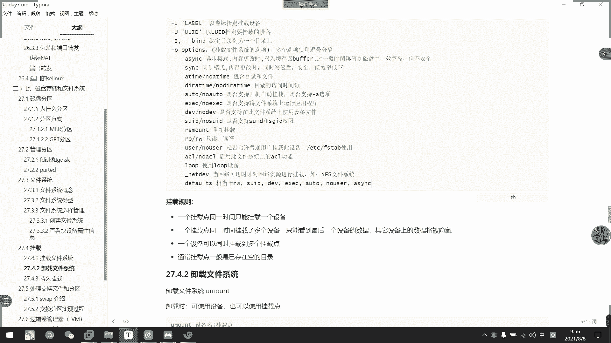
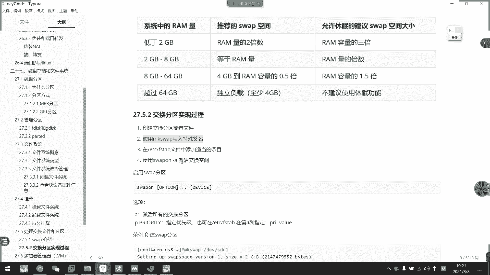
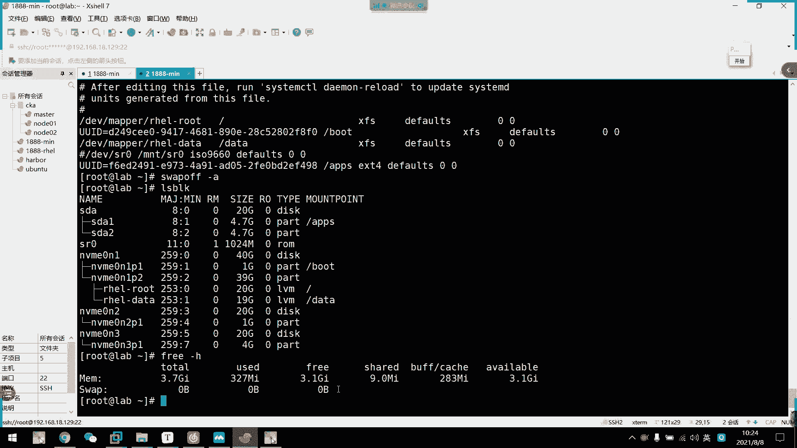

# 2021年7月新版-----RHCE8.2 RH124 RH134 RH294 认证课程 - P52：day10-1 持久挂载和交换分区 - bili_15701050454 - BV1Gy4y1T7ug

好，然后先回顾一下。昨天上午内容啊啊，这天下午的内容啊，所以是我们的一个。还是把我强啊。放。嗯。防火墙的基本规则啊。🤧咳。呃。我们可以通过基本规则啊设定是有关。端口。的流量。啊，以及是服务的流量。

端口啊，我们用什么呢？fire word。先啲。嗯，刚刚不口啊。然是刚刚艾的。咁。等于。哦。光括号。说的是中文版。端口号，然后是。协议啊。🤧咳。如果有。需要指定重的话，我们要加个刚看做啊。

这是按按照东口的，然后是按照我们的一个服务啊。🤧呵呵。嗯，比如是呃说了是。服务名册。啊，这里要注意一点是。注意点。嗯。并不是所部进程的。啊，比如是HTTB。啊，或者是我们这个KTPSS。啊。

不好思SSH啊，都没有带D的啊，都没有带D的。然后也是。刚刚中。佢。就累。然后是复贵者。语法是什么呢？F沃。杠CND刚刚。不到。位举。不冷。等于。我人。然后啊比如是IPV4的啊。Family。O。V4。

So I不。好像不是I是IP4吧。还4。要是ADDRESS。这个是family的。然后指定网段了，比如是192。168。0。0。2支持啊，或者是直接是1个IP要让他做什么呢？嗯。

比如说我把他们全都通过啊。呃，是个。其6不写太多。我是。多个总罚。这个我就复制一下吧。啊东我老发这里有点差，我看一下还始。因为太少用了这个东西。嗯。family啊等于IP14啊。等于IPV4。

有没有ss啊？有说死。原来IP地址。圆。用等号是不是？呵呵。😊，犯法的。所以。也是一样。然后就复制了。然后是访问端口pro。不的。port等于呃哪一个端口啊，比如是80，然后是。我头co。语。TCP。

总发到哪里呢？这个不是。是 for a product。For a bottle。You FO W ALD for port。

What the bargain。要是。

这行另外。这里注意事啊。原。都ぞ了。都是突破。To port。停语八点。这是木地端的。🤧好，然后是分区啊。分区。分区格式。格式有两种，一个是MBR。一个是。举PT。分开系吧。MPR。嗯。最多四个主分区。

嗯。可以有。可以创建。扩展分区。如果。创建了。或者回去。如果创现扩展问题呃，那么必须在。而且不是必须啊。嗯。在。再有。主分区。的情况下。啊，一定要。创建在主分区后。啊。所有。剩余。的空间。全部。分给。

获得规去。嗯。说。啊，也可以。没有。分区。只有一个。不住。但。所有空间。都分嘅。或者回去啊。有了获得分区。可以创建。🤧嗯。若干。个逻辑分取吧。要是GPT啊，可以。分。可以关建。128个。评问区啊。没有。

或者回去。🤧嗯。好，然后呃分区工具。啊，一个是F disk。呃，注意第四个。还有一个parting。好下区别了。啊，如果分区。合适。有边啊。Well。则。而且。大小。小于两T。则用。呃迪科。比较方便。

这个。复制一下吧。啊，如果分区格式为MGPT。啊，而且大小小于2T的，然后用句dis比较方便。好。P列啊可以划分。MBR。也可以划分。GPT。嗯。但不能。会用啊。Party的。是。实时。更新。差不多。

啊，要注意的是什么呢？注意。若。分区已经。是MB2。こ。GPT。那么。不能分钟啊。不要。数据。对，丢失。然后他们的一个使用方式的话，这边就不回顾了啊，大家回去。B须开一下。嗯。然后还有一个是。格式化。

随着。文件系统。还有我们的MKFS啊，然后是杠T。选择我们的。我这是什。F system。然后是DV下的。呃，不。啊，也可以是MKFS点。But file system。I后是DVprofi。好。啊。

就这么。多。哦，还有一个。还有一个还有一个。这里忘了。还一个。多口的。えシにです。啊，我们可以通过。I see manager。啊，对啊啊不是呃，party。P不需要啊Plet不需要啊。

只有这两个只有这两个。泡头它多大都可以啊。没有大少。呃，asim，然后是port。打标吧。列出。🤧咳。port的SDlin标0。好像是更改标签manager。呃SMMAG。Pot。然后是。端口号啊。

高括号。嗯。1后4杠A杠T啊，然后是SAim的。太。好像是杠批指定协议啊。到。昨天的话主要是讲述了这么多东西啊，但是那些操作的啊，我们要看笔记啊，看视频来回顾一下啊。然后我们继续往下啊。嗯。这个这个。

还有两个。命令啊，一个是L标K和有1个标KID啊。嗯。It was。BO。可。列出。当前。食盘。我是分区信息。主后是BLKID打。可以。查看。文件系统的。有有ID啊。

okK然后我们啊这是真的开始新的内容啊啊就是挂载挂载。其挂载也没什么好讲的，我们挂载的话呢，其实前面也有一些相关的操作了啊，就比如说我们挂载我们的那个。

嗯。好，我们挂着我们那个。光盘啊光盘我们直接用。慢DV320。也要过来到指定的地方啊。啊，这就是挂点啊，这就是呃。我们的一个文件系统。也，可以说它是一个磁盘文件吧，然后是挂在点啊。用慢，然后是接我们的。

示范分区，然后是高家点。指定分区，然后改到巴里啊，快一点。那我们现现在看一下嗯。哦，们现在可以看到啊。S20目前是没有东西的啊，然后挂载上以后呢，好它就可以把我们唉。收的。要推一下先。标我都知了。

不是阿里。啊，我们挂载以以后呢，他就可以把我们在分区上存储的数据呃。挂载到我们的一个指定的目录当中。啊，然后我们就可以查阅到里面的数据了啊，这就叫挂载。

然后呢，我们刚才那种挂载的是什么系统啊，是什什么选项都没有加的啊，什么选项都没有加啊。我们这里也可以看一下，现在看一下它的一个介绍啊，就是说要指明挂载的设备啊，就是我们刚刚的那个。快文件啊就是分区。啊。

比如是我们的DVSDA我，然后刚才那个是SR0嘛，对不对？我们的官盘文件啊，然后是杠L可以设定卷标啊，可以设定卷标。然后我们挂载的时候呢，可以不选择device啊，可以直接输入我们的UUID也可以啊。

但是这个用慢的话，一般用UID比较麻烦。我们UID啊是用在什么情情况呢？我们等一下再讲啊。要是还有一些未文件系统的名称啊，需要呃如果用到这些的话，可能也需要指定一下。好。

然后呢我们杠T啊一些常用选项我们看一下，首先是杠T。啊，杠T了可以。啊，指定我们的一个文件系统啊，指定一个呃文件系统，其实这个也。不采用上。如果我们那个呃文件系统其实已经。做过格性化处理的话呢。

它已经选择了一个是对应的文件系统了。我们一般不需要钢贴，但是用钢贴的话就会保守一点点啊。也要是干R啊，干R是可以只读挂载，只读挂载以后呢，我们就不能修改里面的内容啊，然后是干W啊，就可以读写挂载啊。

读写挂载。然后是盖就不更新我们的1个EVCM table啊，就是慢的不可见。啊，杠A的或者自动扩载啊，然后我们需要把它那个定义到我们的ETCFSFS table里面啊，等一下我们再讲啊，我们再讲。呃。

刚才刚刚说了指定选标概率是指定入IDIL是杠B是绑定目录到另一个目录上啊，这个没意义啊啊。然后主要的话我们要看一下我们的一个关键选项啊，杠O。啊，刚的话其实在慢的上面也用的不多。

我们一般这个选项啊为什么？啊，要这样列出来。嗯，主要是这些选项啊，它除了在这里用啊，我我昨天说啊，这个可能几分钟讲不完啊。就因为这些选项我们也经常会写入到我们的FStable里面啊。

到时我们啊要看一下啊。呃。其实这些都是默认选项来的啊，有一些是默认选项呃，多数都是同步的。啊，不多数都是异部的多数都是异部的，他默认是异部的，我们记错的话都是异步的，然后是n a time啊。

n a time嗯。然后默认是Oto啊。嗯，还有什么呢？啊，这个let device啊letV啊let device。呃，defos啊等啊。

这这就刚刚个dos我们挂载的时候通常会写上一个deffors啊，defossce就会有读写啊，SUID啊device啊啊，然后是EXEC啊。然后是Oto啊，no user啊，还有一个异步。义步更改。啊。

然后我们要挂载的规则要注意一下啊。首先一个挂一点呢，同一时间只能挂载一个设备。啊，就是一对一的啊。你可以换啊，但是换了以后那个数据就不一致了。

啊，就是就是说呃比如说我这个MNTSR0这个目录啊啊它就是一个区壳啊，它就是一个区壳。然后呢，我们的磁盘这的数据啊才是把它给填充到里面去了啊，就好像我们的USB啊，或者是叫呃内存卡。

我们是不是插入以后呢，它才能读读数据。然后我把它拔出来框另一张，它读读取了，又设定一张卡的数据，对不对？

就相你于是这个。啊，你看一个挂点，同时挂掉多个设备，那么只能看到最后一个设备的数据啊，然后其他设备上的数据将会被隐藏。然后呢，一个设备可以同时挂载到多个挂有点啊，就是说它一个设备可以被多个目录挂载。啊。

然后通常快点一般是已存在的空目录啊，就是如果有数据的话，我不建议去霸掉它啊。所以我们一般呢呃有新的目录。要挂载的话呢，就是说如果这个目录。

啊，比如说我这个data。啊，比如说我这个可。比如说我这个dta啊，它是存在我们第三方应用的啊，然后它单独挂载了一个硬盘。然后他后后面满了，我们只能做扩展啊，只能做扩展，不能做替换。如果他替换了的话呢。

他就数据都没有了，就读取不了。

啊，所以如果我这个。磁盘本来是有东西的话呢，我不建议大家去挂下我们的那个有数据的目录啊，有数有目录的啊，我们一般是用扩容啊，一般是用扩容。还要是卸载文件系统的话，我们用U慢的就可以了。U man啊。

比如说啊它可以使用设备，也可以使用快一点，但是这里要注意点。呃，后面讲到LVN的话可能会有点要求。其实也没有要求啊，这也没有要求。

用设微名挂屏都可以。我们试一下优曼。然后是MND。在上里。The URL M， and stunninguning。那我就卸载了吗？

啊，就是卸载。啊，接来我们看一下那个19块钱，就永久块钱。啊，叫做EDCFS的 table。

啊。我们用慢的。去挂展。啊后是NDS20。我们可以通过LBOK。啊，可以看到我们本地磁房的一个扩载情况啊。然后我这个光盘目前就不来到我们ADS20，所以它。可以都取到数据啊，但是。

这只是一个临时性的挂展，临时性的话展啊，如果我们重启了。啊，他就没有了。我重新看一下。连进来了，那我们在LBO开一下。你看我们S20。我们要审啊，现在不就是啊没有挂的情况吗？

那么如果我们想用它这种坏耳怎么办呢？我们直接把它写入到我们的。FS stable。怎么写呢？就呃跟慢腾一样，可以写我们的路径。因为文这明。然后呢。第一个是设备的路径啊，然后是我们的坏载点啊坏载点。

然后是。第三列啊就是它的一个文件系统啊，我们光盘是IS手。9660啊。接着这里是deforce啊。就是我们刚刚的一个选项。再选dorce的话呢，它就是一个呃默认的选项。就我们刚刚说的这个啊dforce。

但是呃。这个光盘的话呢。

好像会。那个啊000，我们等一下啊，00和0，我们等一下再讲。光盘的话呢，我们现在呃用慢的杠A啊。啊，我们说了有Oto的话，它会以用慢的刚A这个选项来自动挂载，对不对？我们默认选项就有一个Oto嘛。

所以它可以实现我们的自动挂载。

我们看一下。挂也散了啊挂也散了。那么我们看一下光盘挂载会不会导致它找不到设备，然后去。进入我们的一个就业模式啊，我们看一下实现一下。要都不启动。

那然后我们再重启一下。看下能不能开机。

啊，你看他开不了机了。还有耳机。啊，这种情况我们前面说过，对不对？哎呀，光盘的一个挂载，导致它进入就援模式，然后我们啊是连不上去的啊，它的一个很多服务都没有开起来的。要会唔有写写少啲你家。IP我没有。

你看IP也没有啊，就是说他这个网络服务也没有开。呃，网络服务是什么来着？也也没有开的。那么我们如果记录到这个样子的话呢，只能说通过。呃，服务器的远程口啊，或者是。直接走到机器面前啊，然后进行操作。

啊，然后他就会发现是我们。啊，没有了。啊，我们只能自己排插，只能自己排插。通常这种情况，我们直接看这个文件就可以了，然后识别一下试。什么情况导致的？自己去啊分析一下啊，然后把这个注册掉。

我们再重新看一下啊。好，作位方现啊，现在已经可以正常开机了。然后我们看这里啊已经连上了，对不对？啊，所以这一点要注意了呃，无论是在工作中还是考试的时候啊，一定要注意啊，我们的自动化载这个文件。

如果他找不到挂点，或者是找不到设备的话，他都会进入就援模式啊。如果。在考试的时候啊，发现开不了机啊，机乎这援模式连不上网的话呢，这是啊临分情况啊。然后呢，如果工作中如果遇到这种情况，开不了机呢。

造造成的损损失的可能啊也要减减半袱走人的啊。所以大家要注意一点。测试环境好一点啊，如果是呃这是环境导致这样子的情况呢啊。啊，这就。是挺严重的问题的。啊，所以我们挂载这个一定要注意啊，自动挂载。啊。

所以我们一般来说呢都用mod子盖A去确认一下这个是否。🎼呃，正常啊是不正常。如果他挂耳上的话呢，基本上都没有问题了。因为我们工作中不可能说啊说重启电脑是吧，重启服务器又重启服务器，对不对？好。

那我们这里先不开它了啊，我们继续往下面看，等一下我们挂载一下我们的一个昨天分好的一些主分区也可以。

好，我们继续往下谈。啊，然后我们可以通过DF杠TH是可以看查看我们的一个分区情况的。还没讲到啊还没抢到。啊，是这里啊，我们写完以后呢呃。😊。

呃，也可以通过我们m第5章的FStable去看一下，它有一些画载的实例的啊。欢迎帮助啊，是这个文件的一些帮助啊。呃，我看一下有哪些要注意一点。

啊，这里啊有介绍我们的一些选项啊。

感一下我们一的学校。🎼BTCFS没有了。呃。然后是。编写我们文件系统的类型啊。对啊，也可以去看我们慢的第八章。然后是加换分区啊，有个suppro第八章。

🤧嗯。

🎼这没有太多东西。然后我们看一下啊。第八章。唔问。然我再看。

刚刚说到的慢。

啊，这是慢的视例啊，然后这里啊可以看到我们的1个CD。就是关管区的一个例子。看一下这里慢慢好像没有给我们的挂的选项，看一下有没有？这里有对他那个啊分别介绍啊那个选项啊。

啊，这里有啊挂在选项。

应个的学实。这里介绍，然后还后面还有呢。后面看一下还有什么。要注意的。开始。

啊，有了，这些啊，这是我们的X啊X杠啊，这些一般都是用于一些服务请求的啊，我们后面会学到NFS啊或者是。什么刷s啊，还有1个VDO啊，可能都要用到这一个东西啊，但是呃。

很多同学说这个很难很难记啊，其实我觉得也还好吧，就X加一个request，然后。呃，写上我们的服务名称就好了。这里没有提示的啊，只能说是X什么之类的啊。啊，我们这个时候后面再看吧啊。

好，然后呢，我们这里。刚刚说的。嗯，快选项啊，我们一般就直接输dorce就可以了，一般输dorce就可以了。啊游是文件系统类型啊。然后后面呢两个0啊，我们刚才说到后面两个0，第一个零呢叫做啊转储频率啊。

主要是备份啊备份。啊，其实他这个备份没什么用，而且他那个。导致速度比较慢啊，我们现在因为有了re啊，或者是啊不是不是，是瑞啊，是re啊，是re。有了read的啊，或者是说呃分布式存储。

然后去让他们自动备份的话呢啊，所以我们这个转储频率呢一般都不使用了。嗯，这个我也不清楚，在我学的开始，他已经都是零了啊。在我学这个东西的时候啊，它已经是零了。啊，大家可以上网搜一下啊。啊，然后是质检啊。

这也是质检，现在也。不会开启质检的啊，也不会开启质质检的，它它有问题啊，估计都是自己去。啊，去排查的质检的话，其实他也给不了什么东西。而且它会导致我们的运音速度比较慢啊，开速度比较慢。

所以说012这个是这远速度。首以是临时不是减啊，然后是一的话就首先质减啊，然后就有一般是啊我们的ro FS才会用啊。word FS就是我们ro那个。呃。姜目录啊。然后是二啊，就给其他磁盘使用的啊。

想想什么是吧，要问了，刚刚刚已经说过了。只要天线的外向。然后呢挂载以后呢，我们可以通过DF杠TH可以查看到我们的分区使用率啊，我们看一下。

啊，你看这里啊有我们的文件系统啊，后面是我们的一个怪点啊，怪到哪里去了啊，比如说我们的boat啊，比如说我们的bo。啊，我们在安装系统的时候，不是已经把他们。呃。

自动划分一个啊EGB的分区给我们的boat吗啊，这就是。然后呢，这里啊是可以看到它用了多少啊，用了多少。呃，然后是还可以用多少，然后是它使用的18%。反正是吧水工了多少。然后呢这是它的一个Y系统类型啊。

Y系统比型。然后是它的总大小总大小。这就是我们的电覆杠DH啊。如后挂载的话，哪里。呃，杠T。杠T好像是多了个太吧，我看一下。他多了一列啊啊，对，就是多了一多了一多了个ti，多了个t。

要H的话就是我们的一个呃人力一读嘛，之前不是说过吗？对不对？啊，跟我们的一个face一样的H通常说是一个严力度啊，除了是帮助以外。啊，如果他设临时帮助的话，那么这个就是人的遗读了。通常是这样啊。

我们可以通过help去看他的一个呃选项的啊。

好，然后这里是我们的呃。FStable的一个写法写法。嗯，所以这个选项呢我们回去一定得好好看一下，其实现在没多没没什么东西啊，但是。主要是这个。啊。HO这个是默认的，不用管。嗯。

然后是这个let deviceice啊，let TVV啊letDV。这这个到时候我们讲到MFS再讲吧。啊，以前的话我都没有注意过选项啊，就我学的时候老师也没有介绍过选项，这些都是后面啊这里。

在别的地方总结下来的啊。才知道啊，原来学生还有这么多东西，以前呢就够我学习的时候，他老师就说。

呃，这就说啊这里啊往上面敲就对了啊，上面是这个是文件系统，你要对照自己的那个文件系统，然后这什么啊是defforsse写dforsse就没错了。然后0跟0搞定这样教的也是这样教的啊，因为我们挂在这里啊。

再看一下其他的我们尝试一下，挂载我们的一个。昨天做的分区啊，我们看一下。第一。LBO。啊是不O哦，我们看一下SDA1SDA2做了格式化，没有啊，看一下啊。那我们通过BLK。还有边个。看一下有没有啊。

有啊，已经做了啊，这里已经做了一个是E叉T4的啊，然后一个是叉FS的叉FS我们刚刚看过了，所以我们现在挂载一个。呃，SDAE吧，那我们来用UUID去挂载啊，用UIUUID挂载。嗯。我钻进一个西目录。

哎是的。就这个吧。好，然后我们把它粘到这里来，然后引号去掉啊，注意引号去掉。啊，然后我们这里输入我们的一个文件系统嘛，1加T4。哦，不对不对不对。挂在点啊APP。L4E叉T4。啊，然后挂学上我们的确是。

常用的还是dros，没有特别要求。有特别要求的情况下，真的是dforsse就够了。要板得住，然后我们慢的干一看一下。这不能挂上了？你看我们SDAE不就挂到F3啊，是挂载啊，是不是很简单啊，是不很简单。

但是也有一些特殊情况啊啊，进入救援模式就大家聚聚啊。所以考试一定要注意啊，就算慢了该呃可以验证嘛，建议大家还是重启一下机器啊，确认一下。然后我们来看看。D杠DH。你看啊这里显示了我们的一个文字系统。

然后呢它通过UID可以识别出它的一个呃分区是哪一个。然后使用率好啊。使用率呃1%这里呢啊为什么要1%啊啊，他因为他我系统要写入一些系统相关的东西啊。啊，所以它肯定会有占用内存啊。就好像我们的U盘啊。

比如说我买个U盘啊，它是。呃，他是32G的，我们拿到手是29G，对不对啊，他并不是吃了我们的数据啊，他是文件系统需要啊，还有预装一些协议之类的啊协议之类的，所以这个就不多讲了。

好。然后呢，我们来接下来。看一下我们的一个。交换分区相关的。交换分区，我们看一下什么叫交换分区啊。首先是啊交换分区呢，是我们的一个RAM的一个补充啊，RAM就是我们的内存啊内存。🤧嗯。这个空具。

然后呢spe就是我们的一个虚内存啊，虚域内存啊，就是说呃同学们以前有没有用过一些比较老旧的windows系统啊？在他只有两G4G的情况下呢。啊，两个社区的内存情况下呢。

它有时候会弹出一个什么叫做啊虚拟内存不足啊，有没有遇到过同学们？啊，他就swe就是相当于是我们。呃，windows上面的一个虚拟历是吧？他可以在。内存空间不不够的时候呢啊可以使用我们的swepe啊。啊。

然后呢如果它缺乏这个s空间呢，就为何会因为我们那个呃内存消耗殆尽而终止型程序啊，那个叫做OOOM嘛，就会自动杀死进程啊，我们可以看一下是不OM是什么东西啊。好像是out什么me啊。哦。啊。

首以是我们内存分配小啊，然后是应用太多的。然后呃而且它没次没有完全释释放啊，这个是我们的开发要注意一点的东西啊，比比较要注需要注意的东西啊。啊OM啊哦our of memory啊没没说错啊。

是our of memory，就是内存用完了。然后呢如果它用完了的话呢，它就会自动杀进程了，然后导致我们系统直接崩溃啊直接崩溃。啊，这就是我们啊，我们用维的时候也要注意这个东西啊。系好啦诶。

但是也不能把它配置过多啊，不能把它配置过多啊，如果配置过多的话呢，会造成我们那个存储设备处于分配状态。然后然后它又。很闲置，就会造成我们的一个硬盘乱浪费啊。

因为因为我们虚拟内存都是从硬盘中抽取部分出来的。即系苦切中啊。硬盘是很贵的一个成本来的啊。然后呢而而且我们的sp。用多了，它还会掩盖我们的一个内存泄漏啊，然后就说嗯。

我们少了一个资本跟开发确实很牛皮的啊，明明是他写的啊。代码有问题，然后他偏要说是我的问题是吧？啊，然后呢为了性能优化呢，可以将我们的spe分布存放啊，然后是或者是使用我们的高性的磁盘存放啊。

例如是我们的一个固态硬盘啊。但是啊我很少见到人家用固态硬盘去做的，因为关联硬盘也是一个啊在服务箱啊，也是很昂贵的一个资源来的啊。呃，就是说多建几个，他不一定要只在一个分区中啊，给抽出抽出空间来啊。

它可以设定多个的啊，其实也只只是我们的一个好像创建分区一样的啊。等一下我们再讲啊，首先呢是我们看一下一个呃官方推荐的1个12表空间啊。首先是系统中。我的一个rap量啊，如果是低于两G的话呢。就是说。呃。

一G或者2G啊，这个现在比较少了，对不对？现在比较少了啊，我们就会是两倍啊。就是说如果我我我物理内存是2G，那么我能认数量，我们设置4G。啊，然后因休眠的啊，建议。建议10万吧。然后就是说三倍了。

就是说如果是两G，我们就设备6G啊，设备设备6G。物理2G，然后推荐4G，然后女允时休眠的话就6G，好像是2到8G啊，2到8G的话就等等于啊等于。呃，如果是倍数的话呢，也可以啊，直接是两倍啊两倍。

不需要太多。好像是8到64G啊，8到44G我们就呃按0。5去划分啊，0。5。就说啊如果是64G，我们就给32G这样子。啊，也可以试它的1。5倍啊。1。5倍就也可以比较大啊也可以比较大啊。

然后是超过64G。哦，我们一般都不加了啊。或者是。也不是说不加或者是啊对对对对对啊，或者是直接给他一个4G啊，至少是4G。反正是多少就写多少啊，也不用说太太大了。不是说太大。664G的话啊。

看业务需要啊看业务需要。一般我们64G的话，这些机器我们一般都是。做成碎拟机了，对不对？做为虚拟机的输入机啊。让他分出来了，呃，很少说一个服务器跑6个时G了，那得装多少个APP给他去夸才夸的完了。

对不对？啊，不过也不是这么爽，其实一个呃高并发的一个高并发的可能就可以把它给压完了。ok。那肯定啊我我说了，高病发另说啊，高病发另说。而且大数据还不只是普通的高频法啊。好。

然后我们看一下这个交换分区的一个实现过程。首先啊我们要创建。交换分区或者是文件。

嗯，这个不难啊呃，我们拿一个新的吧，就用我们的MVM10M3啊，这个去做啊，直接用F disk就可以了。还有di。DV下载MVME0M。3。好，然后我们。诶。创建啊，直接创个主分区出来就可以了打一。

然后呢，我们这里啊是多大就多大啊，多大就多大。嗯。我这里试了两句，我就创个4G吧，好不好？啊，OK那我们就创了一个出来了啊，创了一个出来以后呢啊我们可以用。先看桌啊，我们可以用哪个呢？呃。

我记得好像是T吧，还是啊是T。啊。啊，不是T不是T不是T啊。这个是。呃。没有大1楼啊，那就是T啊，那就T。用TE来更改它的一个类型啊，其实改不改都行啊，这个东西啊改不改都行。我们先看一下MT。

然后我们输个大写L楼，他说大写L楼呢可以看到所有的一个类型啊。哦，要。哎，其实有这么多类型，一个是空啊什么之类的啊，一啊，这些大家工作需要上我们再去看啊。我们这里的话课程呢一个是spe啊，一个是spe。

啊，一个是要用到我们的LVM之类的。虽然这个设不是都可以啊，但是这个分区是呃type设定的是告诉自己这个分区是用用于做什么的。那么我们这里可以看到是82说为swe，我们这里就输1个82就可以了啊。

让我们可以看一下诶。我大姐。好，别看一下，你看它这里就标标记着是我们的一个linux wrap了inux wrap，然后我们就把它对准啊。だめ度。然后是LBOK。啊，我们创出来了。

然后他并没有啊并没有说。花展到哪里了？啊，其实是就现在它就是一个空洞分区，什么都没有做，也也没有做我们的一个文件系统啊。

好，然后我们接下来看一下。呃，然后呢用MKweb去创建这个呃，相当于是创建文件系统一样的啊啊，我们来看一下MK。

看到没有？微生。然后我们决定DV。mVM10。M3P。啊，这样就错出来了。对他说啊s斯就是4G嘛，对不对？啊，是low labelUID就这个。🎼然后我们把它写入到我们的文件中，自动挂载啊，怎么挂呢？

啊，我们就把UID写下来，然后这边呃我们就不用写那个什么了啊，然后我这里。可我这个装机昨天装机。这些实外可能没有写。哎呀，我这里直接写个10块。再加1个10么。挂在学箱。要すに。打吧那种，然后慢。啊。

不对。

啊，是激活啊激活叫做suppro杠A。

，没错吧，support干A啊，让我们看一下有没有你看，这就有，然后它会写示交换分区啊。所以然后大小为4G，然后我们来。DM杠铁血好像看不到的。啊，对啊，时间不到，我们用肺。去看，然后我们这里就。

然后我们这里就。OK这也是我们的一个交灌分区的一个春节啊。先做分区，然后打标签，然后是呃设定它的一个特殊的文件系统。然后写入到我们的。嗯，自动挂载文件中。啊最后。

我们用support杠A。激活啊，这就可以了。然后禁用啊，我们看一下禁用啊，禁用的话就sp off就可以了啊。呃，静问全部啊，就直接是。啊，这个是可以进入存复，然后。啊，还要把那个注释取消掉啊，不是啊。

不是啊，他他这里是直接把那一行给删掉了啊。然后我们通常是做注释啊，通常是做注释，看自己个人吧。啊，删了也可以啊，删了也可以。

🎼那我们看一下呃，就 set的。刚才给B给他备份一下吧。叫什么叫SW。a p 吧。这一下，然后删掉。嗯，然后是哪个文件，EDCFStable对不对？大家我企一下。他又删掉了，对不对？So啥的。

然后是suppri。S W A P。哦。2 a。啊，然后我们LP可以看一下，你看这就卸载了，然后废。杠H。啊，飞过去。这就没有了。

O。呃，这个也不是说没有的话，我们一般在K8里面呢是关闭交换分区的啊。好了我们现在休息15分钟，然后我们接下来讲LVM吧啊我们接下来讲LVM。

