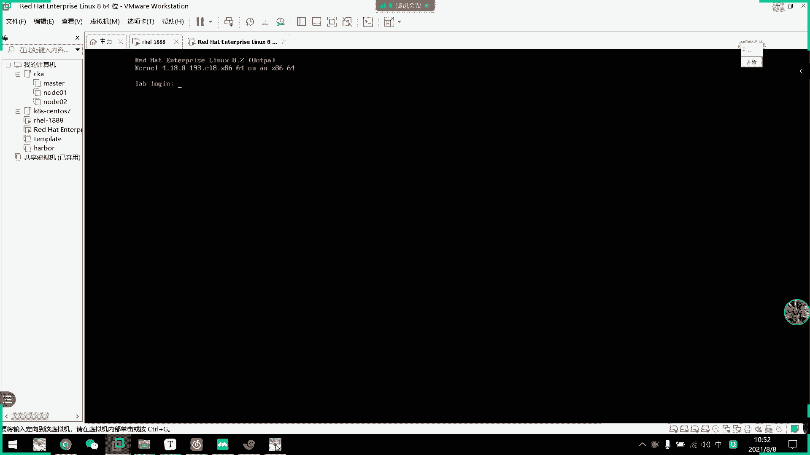
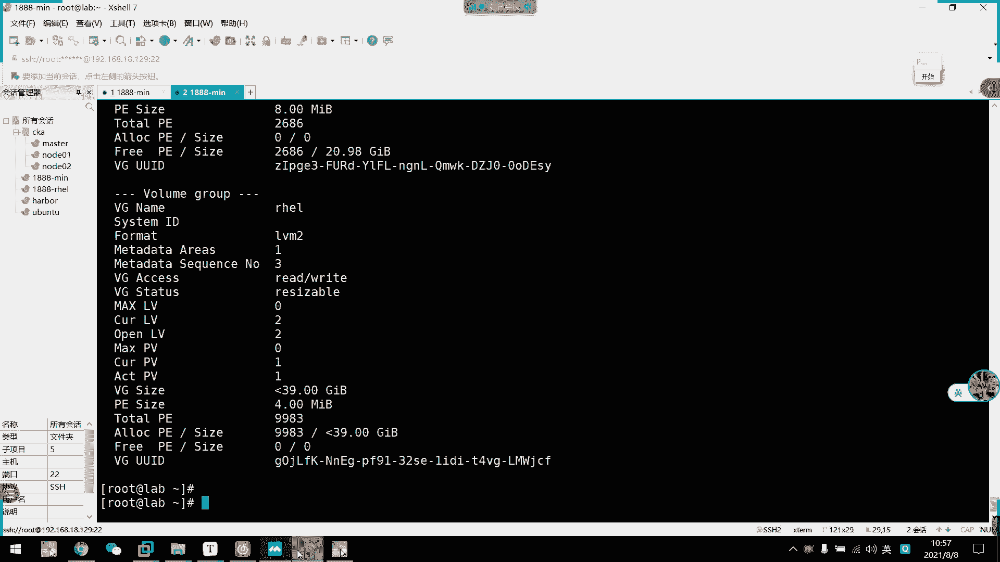
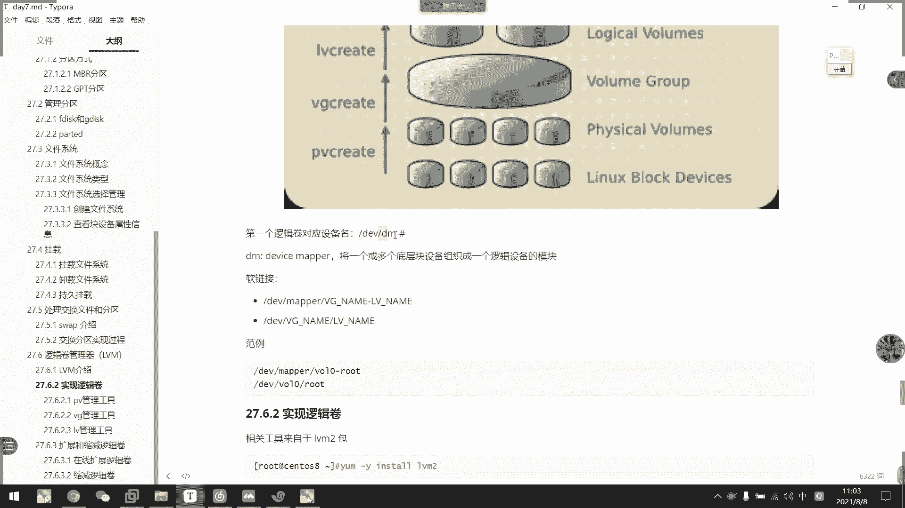
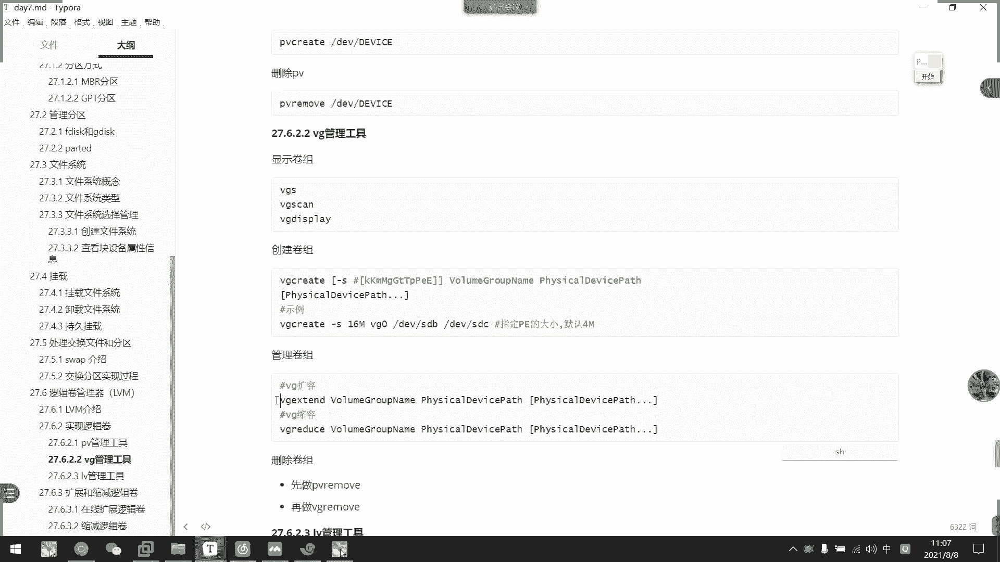

# 2021年7月新版-----RHCE8.2 RH124 RH134 RH294 认证课程 - P53：day10-2 lvm管理 - bili_15701050454 - BV1Gy4y1T7ug

好，我们接下来讲述一下叫做逻辑卷的一个概念啊，这个是我们那个学习重点来的啊。呃，为什么说他是个悬习数点呢？因为他。是一个很传统的技术。但是没人用到至今啊依然是。比较流行的一种。呃。

设定方式啊啊也是开始重点。没错啊，也是一个使用重点啊，面试重点啊，或者是说运维重点啊都是这个啊。啊，所以是我们的一个逻辑卷管理器LVM啊，叫 logical word manager啊。然后呢。

它是对我们的一个券进行方面操作的一个抽象层啊，是一个逻辑上的东西，所以是比较抽象的一个东西啊。嗯。是可以设出来的，我没有说不可以设置，但是这样子呢会有问题，这样子会有问题。我昨天讲课的车候已经说过了。

我说只能这样子创建，它肯定可以是PPEP的啊。啊，然后呢，它这个包括重新设定文件系统的大小都可以了。就是我们的ress啊，然后允许多个物理设备间重新组织文件系统。啊，这是什么意思啊，等一下我们再讲啊。

然后我们来看一下。这个跟我们的LVM的一个组成原理有关系啊。我们LVM它是可以弹性的更改我们的容容量的啊。他是怎么做到的？首先我我们的LV啊是一个图像层，它分为呃好几个时候。我们往下面这个图看啊。

首先是它的一个实验过程。是我们要把设备指定为我们的一个物理卷啊，它可以是指呃直接是一个磁盘，也可以是分区啊。但是我这边我们建议使用是空的啊，一定要空的新的啊。然后呢。

我们用一个或者是多个物理卷来创建一个卷组啊，这是我们的一个微距啊微距。呃，然后呢物理卷上创建的一个逻辑卷呢，它的一个物理区区域由我们的PE组成，可以在逻辑卷上创建文件系统，并且画载。好。

刚刚那些跨是什么意思呢？啊，而且它的一个抽象成也是什么一个意思呢？好，我们接下来往这一个图看一下。这个图。啊，这些都是我们的一些快设备啊，它可以是分区。啊，不啊，一个是磁盘啊，一个是磁盘。可以试回去。

可以试吃盘。要么我们。通过。呃，命令把他们定义为PV。定位PV。啊，其实这个定不定义没所谓啊，定位没所谓啊，PV的定义是没所谓啊。但是我建议啊还是按照我们的一个常规操作去做啊，常规操作去做。

因为我们最主要的是VG啊，VG这个步骤呢是把我们这些PV所谓的物理卷形成一个卷组啊。叫做VG什么呢？叫woland group。叫卷助。卷组呢，它是由这些分区。的大小。逻辑组成出来一个抽象层啊。

你可以想象把它他们都把自己的空间拿出来组成一个组。然后呢，他们的最小单位叫做PE啊叫PE。做PE呃，比如说我每个PE定义为4兆。啊，美美国为4兆，然后呢它有多少个啊有多少个P组成啊，就是我们的微G啊。

然后到最后呢啊叫做我们的LV啊，我们的逻辑专叫做logical啊， logical world，所以叫。老几句。然了我们这个。操作啊是对我们的LV进行啊，也不是说LV啊是对这三个层进行管理的。

所以叫做 logicalical world manager。然后它LV呢是从我们的VG上面抽取啊，部分PE组成一个卷啊，组成一个卷，也可以把它们想象成是分区啊，想象是分区想象啊，因为它是逻辑的啊。

因为它是逻辑的。然后它的大小由我们的P1确定啊，比如说呃我从这个卷组。啊，抽取100个P。100个屁。来创建1个LV啊创建个LV。那么。我们设定每个PE为4兆，然后。

他抽取100个PE出来做我们LV的话呢，我们这个券就400兆空间了啊，400兆。是不是有点抽象啊？啊，但是你们可以这样想啊，他。这个。有我们啊他他他他这个是。一个壶啊湖有很多个。地方的水灌进去啊。

灌进去以后呢，我们用水桶提出来啊。倒在另一个词里面。就作为我们的LV啦。好，然后呢我们。🤧嗯。LV的一些相关啊，我们等一下再讲这些啊，我们等一下再讲这些。我们先看完往下的，先先看一下LV的一个创建啊。

LV的一个实现过程。啊，首先呢我们要安装一个工具叫做LVM2的包啊，但是一般来说，系统已经默认安装上了这个啊，我们看一下有没有。

我双面关仔。有关仔。看一下。你挂仔。

他他说已经有了就可以了。没关事噶。好，然后呢啊PV的一个管理工具啊啊我们。PV的管理工具呢。嗯，有3个，一个是创建PV的是PV create啊，然后是上PV是PV removemove啊。

然后是啊查看PV的信息啊，查看PV的信息啊，这里大家一定要注意啊PV跟PE不是一个东西啊，一定要注意这一点啊。好，首先创建PV呃，怎么做呢？就直接。指向我们的分区或者是啊指向我们的磁盘就可以了啊。

比如说我这里嗯我现在这个不用，我先把它删掉啊，让它作为一个全新的物理券。

啊，全新的磁盘。我们来看一下。嗯。Ds科。M v m一二。So。好，没有了啊，那我打盘最出。好，那么我们现在这个相当于是一个全新的券。然后呃我们等一下用SDA2，还有这个LME0。

2P1这两个分区作为我们的一个啊PV啊啊，这个我们先不先不加，我们就用这两个这两个创建我们的PV啊，用这两个创建我们的PV啊，PV看一下PV。Cate要指定。MVM1。M三。好，然后还可以继续加啊。

叫做MVM10。L2PE确定。诶体有东师啊。嗯。删除吧。好，OK然后到时候这里就创建成功了啊，然后呢查看啊我们的PVS。那么我们就可以看到我们有多少个PPR，这个我们不用管。

因为这是我们创建系统的时候啊，它创建的两个。就这个创建的那个。LVM啊，因为我们呃创业系统的时候选择了添加LVM对不对？啊，这个我们先不用看，我们看刚刚的啊这两个是我们刚刚加上来的。

是我们刚刚加上来的啊，然后还有1个PV scan。佢嘅。啊，它可以更加详细的列出它的相关信息啊，好像还有一个。PV。可吧。没有恨。🎼PVPV什么来着？Or display。

desplay啊这个更加详细啊更加详细。啊什么SG啊啊，这里就EG啊。然后这里。这个是呃我们另一个的不管它，我们主要还是关注我们自己创建的啊，而些new physical world。嗯。

基本上就这几个啊，用这几个scaamp啊。PV还有PV display啊去查看。好，那么我们PV就创建成功了，PP就创建成功了。

然后呢到我们的VG啊，VGVG的话呢会多一点点操作啊，也是啊虽然它也是真三啊，真三，但是它还可以支持我们的扩容和缩容啊。不要所有。啊，这个或者说用我们先不讲，我们先把1个LVM。呃，LV创作出来再说。

好，然后我们来。看一下创建卷组啊，创建组也是VGcreate就可以了啊。which create，然后呢可以加个杠S去指定我们的PE的大小啊，PE的大小默认为是兆啊，默认为是兆。

然后呢后面这里是我们的vi name啊，V name。啊，后面就是我们的选择添加的PV啊，就是说把哪些物理券。

添加到我们的卷组里面啊。我来看一下。微居。Pray。啊，该是指定一个8兆吧啊8兆，然后是DV的MVM10M3啊，以及我们的DVMVM1。M2P啊。嗯。And we am unique and some。

有问题吗？然，他有一个文件系统。啊仲我签过啲先。嗯。这个分区已经文件系统了。哎，为为什么它有文件系统？Ker。没有啊。L meeting and so。当然都是异步导致的。好少。

那我们创建一个新的磁盘吧。拿个新的硬盘过来吧。问题不大。

有没有啊有了啊。创建1个PVc。嗯。DVSDV啊。本这个吧。后我们创建微G啊。因V。SDB。嗯。😊，怎么。都这样了，现在。应该可以的。哦我知道我知道我知道什么问题了，我知道什么问题了啊。

其实这个也没问题。他以为我用这个去做我们的卷组了，我这里少了个选啊少了个东西啊，叫做VG那个啊，我们VG link呃一般定义为我们项目名称啊。比如我这个啊是用于做xico。

我们这边就改成myxicoV句啊。什么问题啊，刚刚少了少了个选项，难怪啊。好，那么我们的V机就创建出来了。We啊然来。

然后我们来看一下它的一个。选项啊好吧，呃，查看命令啊，也是VGSVG scanVG display啊。其实就我们三个PVVG到LV也好啊，都是这三个命令，然后把它名字改掉就可以了。

好，我们 just看一下。然后我们可以看到我们刚刚创建的证据啊，你看就21G嘛啊，我们我们我们我们呃M3M3的那个20G嘛，然后是P1啊，M2P1那一个是EG嘛，所以它组成起来就是20G嘛，对不对？

然后我们详细看一下啊，叫VGs啊。所用是gepe。这里可以看到啊，他找到两个卷组啊，一个是我们的呃myxicoVG啊，然后是。呃，类型是LVL2。我后有个 vg displayer。所以用这个就够了啊。

用这个呢啊我们可以看到。详见信息。嗯，首先是它的一个主要的。用分区创建PV收多多啊。哦哦，你论分解分区不多，说说实话分区不多，也不是说不多。就是说如果你那个硬盘有一些空间啊，是用于在别的地方的时候呢。

你可能就。呃，用他的剩余空间想做的话，就得用那个分区，对不对？啊，他可以对对对对对。啊像是啊但是一般来说有一些比较有钱的公司就不喜欢这样子，他可以扩就可以直接加硬盘的时候，直接加硬盘了。好。

然后他的个是可以读起来，然后V距大小。然后主要我们要注意这里是PV sizeize啊。八杂然后咧。8兆以后让它除除出来一共有多少个PE啊，叫做2686个啊，我们注意这个就可以了。好，我要注意这个啊。

剩余的啊剩余的，因为我们现在没有用没有用，所以它呃是100%的啊100%的。那么VG这样子就创建好啊，V须这样子个创建好。

好，接下来我们来。嗯。做我们的1个LV了啊，上叔我这边先不讲啊上叔我这边先不讲啊，首先也是一样的啊，叫做。Great。everrere，但是它这里两个小选项啊，两个小选项，一个是大L，一个是小L。大L。

PV。PV说实话呢，就是给他一个标记而已啊，把那个。

分区或者磁盘啊，标记为我们是将要使用到微G里面的一个标识。

它可以没有啊，但是建议还是要加加上啊，明白吗？它只是一个标示，我可以直接不用啊，我可以直接不用。啊，但是我建议要用啊，建议要用方便管理嘛，到时候我们可以通过PVca就可以收到出来嘛。啊，对啊，没错。

方便管理。好，然后我们继续往这边看啊啊，创建LV我们就LV create啊，然后是两个选项，一个大L，一个小L大L呢是可以指定我们这个LV的大小啊。直接是按照存储来设定。啊，容量大小来设定。

然后小L的话呢，是指定我们的PE数量啊，指定我们PV数量。呃，要是杠灯。咁。是指定我们这个LV卷的卷名啊，最后呢是从哪个卷组抽出来的啊，就是从哪个卷组抽出来啊，我们来看一下啊，翻例。对呀。

这里可以是抽60%微距或者是啊100% free啊，我们通常是用100% free啊，或者是用大L啊，指定它的大小。但是呢如果用大小的话呢，可能。很难的去充分利用我们的PPE啊。

所以它两个呢其实是混合使用的啊，混合使用的啊，我们先看一下创建LV啊。

A we great。然后我们先用大L啊指定一个两G吧，然后是该N叫做myxico。我们这边存放他的。审么好了。说问它的数据吧，叫data吧啊。后是我们的卷筑啊，myciqco位距。卡这就创新出来了吧。

他说我这里没有没有没有没有swepe而已啊，不管他。然后我们来创建出来以后呢，我们就可以通过LVS看到了。啊，对。啊，然后我们这里可以看到啊，他这里啊。嗯，哦，不对，是这个啊啊两句啊。

我们也创建出来了啊，因为它这个。算法跟我们叉FS那个算法的差呃是是是一样的，它有一个误差。我们标准算法是1024嘛，他们可能是算1000的啊，他们可能是算一000的。啊。

所以到时候考试这里也有一个提示叫做啊有误差值啊，允许存在误差值啊。好，我们继续往这边看啊，那么那么这边我们就创立一个两G的东西了，两G的。啊。然后我们继续看一下scan啊。啊，s也是一样的啊。

然后是LV display。好，那么我们这边就可以看到一个呃。嗯，新建的啊叫做。我们的myxico data这个。卷啊。然后呢，它有它的1个LV名称啊，也有它的一个券名称啊，包括它LVUID啊。啊。

但是这个UID要注意啊，挂载我们不是用这个的，挂载不是用这个，它是我们的一个相当于是分区UID一样。我们挂载都不是用这个啊啊是磁盘UID说错了。啊，跟我们磁盘UID一样啊，是不用这个的。

或载是用分区的UID啊，注意啊啊，不是文件系统的UID啊。好，然后他说的呃every size啊ever size大小。然后那些其他的什么呃。上区啊。什么之类的，不用管它。好，然后我们现在。呃。

查看到了LV也出现出来了。那么我们回头看一下VG。Its great。啊，回头看一下这个。呃，我们找到刚才这个位置啊，就是这个啊。free这里我们已经少了一些啊，然后剩余是18。8，98啊是18。98。

对不对？什么是吧。然后这里可以看到它原有是2686个，然后剩余2430个啊。所以我觉得呃一般情况下都用PE是比较好的。就有剩余的时头用P也没关系啊。好，然后我们再换一个。比如说。嗯。A we pray。

大小L了啊，我们这里选择30%fr吧。注意啊30%非什么意思呢？啊，就是我这里剩余的30%啊，剩余的30%注意啊是剩余的30%。如果选择30%VG呢，又是什么意思呢？是微距的总大小。得30%啊。

这里要注意啊，我们一般用fr啊，我们一般用 free啊。然后是杠N，然后这里是存放我的马西co。找什么好了啊，BB了，好不好？嗯。然后是。Mycycl不 region啊。啊，又创建一个主来。

我们看一下IV。I was。这边就有一个啊小于等于啊小于小于为了七局啊。哎呀，我们去看。You describe。所以。啊，就剩余1000多个了，又除储他的30%了啊。

好，然后其他例子我先不说了啊。然后我们晚上看啊晚上看晚上看晚上看啊，到这里。罗辑证名称。啊，人件圈对应的设命名称啊，叫做DM啊叫做DM。

我们看一下L。LLDVDM杠。我们现在有4个了啊有40个。从零开始啊，0123。但是啊我们虽然有这个嗯，这才是他真实的呃真实的一个。快设备啊。所以我们可以通过格式化这个然后再。再再挂着这个也可以。

但是我们一般不这么挂载，因为从DN0123这样子，我们很难识别它是哪一个。啊，是哪一个分区，对不对啊？是哪一个券啊是哪一个卷？我问零啊零应该是我们的这个root的啊，0应该是我们的root啊。

等一下再解释吧。好。

啊，然后DN什么意思？叫dicem啊，就将一个或者多个底层块设备组织成一个逻辑设备的模块啊。

后其实他是。呃，它存在的软软链接啊啊。比如说我们来LSLL看一下BV迈下。那我们这边就可以更加的看清楚了它对应的是哪1个LV了。我们连第一个啊是对应我们的root，对不对？

一第二个是对于我们data然后。12是我们刚刚创建的啊叫马西克VG。哦。啊，它的啊它的名字的组成是先是卷名啊，先是是VG内啊，然后是LV那啊。这样子，然后这是第四个对不对？按按照按这个流水创建下去了。

所以我们一般挂载很难看哪一个是哪一个，我们一般都是从这里看啊。有人接，还有一个有链接有两个。或是买气口。从卷上面啊从卷上面。VG微G上面啊，它也有对应的软连接啊，就是我们马xico data。

还有一个马xicoDB。他都会指向那里。所以我们挂载方式有有有好几个，一个是直接挂这个啊，一个是挂这个软链接，也可以挂这个软链接啊。

系我出出来嗯。

接下来我们来看一下啊，如果。

我们VG用关了啊，VG用关了，我现在再创建一个把它用关掉啊。传递一个LB。啊，我们用法怎么用呢？只接一个100%。对呀。反正一把飞，然后是。感恩。叫什么好了，叫kiss吧。就 됐吧。

还后是卷是myxicoVG。嗯。少了个选项。所有选项。然后我们微居。Be free。啊，你看这里fr的，已经是名的啊。哦，不是是也是你导。아겠습니다。那么我们在用完情况下呢。就可以对我们的一个V距扩展。

所以为什么现在说这个是一个重点啊？而且。生产商也喜欢用这个啊，因为它这个技术比较成熟，而且它支持扩展。我们如果VG用完了，我们直接扩展VG就可以了。怎么做呢？啊，比如说我这边在。啊，刚刚弄了个SDB。

对不对？我们直接把SDB给扩进来就可以了啊，那个命令叫estendV do extendend啊V do extend。

VG eXT AN啊。좋아。🎼END啊听错了，这样的。啊，然后呢。这边。选择我们的VG啊，叫my西co。微居。然后就水的设备了啊。Gd D V， S D B。搞定了啊，就这么扩展了就这么扩展了。

让我们看一下啊呃还是VGdiplay。啊，这里可以看到。呀我的VG又有大小20G对不对？然后总共的它加起来。啊，现在已经用了是刚才的啊2600多个啊。

啊，然现在又是源啊，这就扩容啊扩容。那么我现在想删除逻辑卷啊，删除逻辑卷啊，一直把VG都。删掉。我们怎么做了，直接LVreve。首先删的ever move啊。How we move。

呃。我们三个t吧，就。直接。呃 we remove move。然后是。

开始。是不是。

啊，这像设备啊DV然后是我们的myscoVG啊，随便选一个软链接都可以啊。然后是哪个？T。这就删除了啊，然后LVS看一下。是不是没有了，但是已经没有了。啊开始没有，让我们查看一下VG啊。

VGdiplay。啊你看，他就变成4000多个了啊。剩余的是呃13G啊，33G啊33句他又多了13G啊。好，然后我们把呃。

VG缩容或者是直接删除VG也可以啊，我们先说容吧。啊，魏业说怎么说了啊，excuse，然后是选择卷属名称，然后是选择我们的。

Pi。看一下是不是VG。Is。丢死。喂。Rduce。Redduce。要是买新口VG啊。把这个VG，然后是DV下的SDB。他这个已经从我们的卷组删除了啊，移除了。然后我们来看一下啊VG display。

啊，可以看一下，你看它要变成十3G了。没了22就。🤧咳。买没有20句啊，少了20句，对不对？

啊，这就是说容。那么如果要删除VG的话呢，我们要删除PV啊。啊，但是我们现在都创了LV出来，那么我们只能全三了，我们只能全三了。

，就说。那么LE继续删了。我。第EV下的。Myicco。依据。然后是。可以扩容啊，这个还没讲到啊。🤧咳。它就是可扩容才好用啊。呃。叫什么嚟着 my 。B逼。然后把这个da塔也删了。打上关了，然后是。啊。

我们VG已经不需要缩容了啊，VG display。我们没有LV的话，呢，我们直接直接删除了。那么。叫PV。被告。He move。A一V。MVM10M3。DVMVME0M。0A2PD。

他骗我。他骗我。

说好了，先做这个。他现在就反过来啊。那就反过来。If you are setting you need，你要需要删除这个。那么就要哦哦强制删除啊就强制删除。都不行的。

对啊，我也觉得是。但他这里啊应该是我写错了。

我们看一下吧，三个组。VGwe move可能是我笔记有问题了啊。咪。C口。

是我这里有问题啊。咩理由啊。哦，这里我知道写错什么了啊。先做LOV。再好粤猪。我知道这个情求什么了。好。😊，那么我们这个关于LVM的创建啊，以及删除已经。讲述完了啊。呃。但是这时间好像有点多。

我们把那个。嗯。使用啊，先先把使用讲完了，然后我们休息完再做一个扩容，还有缩用啊。

先继续往下做一下啊。呃，那么我们继续。啊，我们PVS啊应该还有一个啊叫做SDB，对不对？因为我们现在用SDP去做卷啊。呃，这接VG create。Would you create。呃，然后是微军令。

刚开始我就不定义了，我直接用4兆啊，直接用4兆默认的呃。叫什么好？还是马sco吧，还是马scoVG吧好像DVSDV。创新出来啊，然后ever phrase。Very great。嗯。哎有。50%。

Free。呃，然后是杠M叫做买CQ data塔。VG是myxicoVG。手啲灯。LVS啊。这里可以看到一个是10G的券啊，1就券。🤧好，那么我们接下来是要给他创建文件系统啊，就是NKFS啊，我们这边。

再创进一个吧。再重建一个。这个叫做什么呢？还是刚才一样的，叫DB。啊就呢边。好，然后我们现在。看一下啊。重进来两个。啊，最后两个这里看也可以啊，就后两个。那我们先。一个是做我们的。一下第四。104。

🎼有第V。M Y， S， Q L。予以居下的。Mycyclco data。好，另一个我们做叉FS啊。然后我们BOK。ID。这就可以看到了。啊，一个是叉FS。一个是E加第4。然后挂载也可以用UID挂载。

有UI 거的。嗯。我们错定吧。DR啊，然后是。是口下的。出两个啊不。这个APVS下吧，有个是马Ccodata。有什么这个DB啊。那我们还要看一下。那就有两个数，两两两个目录了啊，那就两个目录了。好。

然后呢我们看看把它挂载。CanC have as stable。哦。然后把他们。DB就挂载为DB。呃 my。这个是DB还是什么来着？啊，这D表啊。举笔。然后是叉FS。然后把另一个也挂上。A， P。

 B S， my。被子。14E叉T4。是。不直接，不备份。都K。然后是慢。好，然后我们LB要可以看一下。这不就挂在上了吗？是不是很简单啊是不是很简单？🤧咳。好，那么我们先休息10分钟。

然后我们再剪那个扩作用。

不好意思啊。啊，我们LVM啊是支持在线扩展的啊在线扩展。然后呢，它扩展的话就一个mini就是extend啊exend，然后是啊也是干大妖或小要是加多少G啊啊，不就大妖啊，是加多少G。

加多大是是M啊M啊G啊GT啊啊T啊这样子啊，然后是呃哪个卷啊，哪个卷。

好，我们看一下实验一下。那么我们现在是VG没有了，VG没有了，所以我要加一下。那么我们创建一个吧啊，在MVF。Bisk。嗯，不行。你。我完记这个是。GPT的还是NBR的。啊，这是GPT的。

我们用Gdi吧。MVM10M0L2。然后是。嗯。哦创建一个比较大的吧。十句吧。直接是。我P一下。重建一个专说。MW保存一下啊。哦，我们昨天这个是用part说的，那没关系。好，然后呢。我先把它创建成。

PV啊。PV cr。是DV下的MVM10M2P2。嗯。And we。算出来，然后是VGistend。St my。表示。PV4DV下的。MVM10。M2P2啊。好，转出来啊，那我们VGdiplay。

那么我们现在就有一个。视觉大小可用啊实月大小可用。那么我们怎么做啊，就LV is ten。L杠L。我们看一下杠小L行不行啊，加。100%。ree要是。DV下的。my西coVG下的。Mixico。

好50%吧。先搬50吧。🎼马系 go。对他。嗯。啊， ok。啊，他说我们这个V距已经resize了。啊，不啊，说我们的LLE已经resize了，我们看一下L。Was biopsy。啊。

是LV display啊。好，我们来看一下这个。呃，我们刚刚或者是da塔这个是吧，你看它已经没有15G了啊，已经没有15G了。那我把另外一个也扩嘛。也是一样的，都是。100飞了。滴滴。

ok大家都是四五局。好，那么我们现在LV已经扩容了啊，LV已经扩容了。那么我们看一下LSBOK。啊，不对啊，D看TH啊，看一下。啊，我们LV虽然扩容了，但是我们的文件系统并没有扩容啊，看到没有？

他们还是十局啊，他们还4局。那么怎么做呢？啊，我们要对文件系统啊也要扩用。怎么做？呃，他们不同的文字系统有不同的做法，我们看一下E叉T系列的。

看一下。针对E叉T，我们有一个resize2FS啊，然后呢，它后面接的是我们的券啊。这个是我们券要叉FS呢，它是叫做叉FS Gro FS啊，然后是m point啊m point。是挂在点是对挂在点或吗。

好，那么我们来做一下啊。

首先是we sizeize。Besidess2FS。啊要是对我们的DV下的。My cycle。依主。嗯。表示data。冇事糕。被告。嗯，搞定。我看下。他就变手觉。他边有数据。🎼好，然后到我们叉FS啊。

叉是什么叉FS。叫什么来着？忘记了。古 f啊。GR乳品。OOWFS然后它是对对块的点叫APB下的my。DB。我再睇下。两个都扩容的啊两个都扩容。好。但是我们分两步做是不是很麻烦呢？啊。

同学们有没有觉得很麻烦呢？这个分两步做。啊，有时候我忘记了个呃res的命令怎么办呢？啊，忘记这个re命令。那么我们有一个命令啊，它可以直接。对LV扩容啊，也可以直接对我们的文件系统扩容啊。

它叫做LVresize杠R啊，然后是杠L大L或者小L指定同间大小，然后给它扩用啊，我们看一下。

但我现在没有。谈的吗？呃，BLKI。我看一下。SDA2也做了。没有可能的味儿。看下这里还有多少容量，20G呃。11G还有5G，我再创建1个5G了吧。就只做一11个吧啊也不用。呃，居di。

EV下的MVME你ever吧。没有。然是。加。重建个5G的。L4W。小了。然后我们拿LB要可以看一下啊，是有个5G的。嗯。喂。怎么没穿出来？诶，这里有啊。没有。那么我们就要用。P什么来着？重新再等一下。

看下。读出来没有啊，读出来了啊。昨天就说要刷刷新分区表。这回就用上了啊。好，我们看一下啊5G。那么我们现在把它创建为PV啊，PVplay。表示MVM10。N2P3。落实到 d咋。然后是。微居。

Exendder。呃。My circle。Yingy。2。okK转出来。那我们现在呃两个文献我们试一下啊，叫做LV besides sizeize啊。杠R，然后是杠L加50%的。容亮。

然后。好像要指定那个什么。不用了。

直接就是指定我们的呃LV。叫什么来着？myxicoVG下的myxico DB。对。直接把我们的维修结果重置了啊，然后。你看加了2。5G，对不对？我们LP要分看一下。哦，不DF刚刚提个去。

没看叉FS这个已经扩到18G了啊。又加了2。5G吧。啊，然后我们再看一下。嗯。对塔。DF杠TH。呀两个都扩容吧两个都扩容。好了多变189。但是他们中间是有误差值的，中间是误差值。啊，你看我们一个命令啊。

两个两种文件系统它都支持啊，一个命令，两种文件系统我支持。

，然后我们接下来看一下缩容啊。啊，假方扩容我们讲缩容缩容的话呢，它就麻烦一点。但是呃注意一点是叉FS系统是不支持缩容的啊，而且如果没有特别的需要，不建议缩容缩容可能会导致数据丢丢失啊。啊。

而且我们的一个缩容不支持在线啊，所以什么叫在线？在线的话就挂载在使用中我们都可。操作啊，然后是离线的话，我们是要先把它卸载掉啊。我养头瓜仔生。啊，一共5个步骤啊，首先是卸载啊，然后是检验完全完整性。

然后是设定重置啊，然后是。啊，不是重建文件系统大小，然后再重置我们的LV大小，然后最后重新挂载啊。我们呃叉是呃E第4是这个啊data啊，那我们用data做把它缩回15G啊，所有税务组。那我先卸载啊。

卸谢诶有万。要是。D v shut my v g。下的my。知谢啊。是不是谁的。谢谢了。你看他做了几个几个盘。啊，不对，我怎么卸了DV啊。是DB吗？我 do。是对的啊，算了。

都谢了吧。好，然后这个啊是检测它的一个完整性啊。

12F。SCK啊check就这个意思，然后是刚F。DV下的。复制懒得敲。好，你看啊全都pas啊全都pas。没有没有问题。

好，然后呢就直接resize了啊，像刚才resize啊，我们一家第一次接我们的设备名啊。

We。Size。Yusai。V I S E。

不都有。我看下。是不是从比赛就要指定大小，我看一下。啊，是啊，直定大小。ok。

2FS，然后是DEV下的myxicoVG下的myxico datata。然后缩成15G。这车。啊 ok。我们现在看一下啊DF。TH。是不是说了？好，没我卸载了。现在现在看不到。嗯。

这里能不能看？不能开了，那算了。指定大小啊，然后是。

啊，可以看看LVSLVS应该看不到啊。他还没说，对不对？还没说，然后我们就LV。

てさ。🎼60，然后是。唔系 circle。DV。Mycycl。回据下的。

然后是减多少吧，我没记错的话。呃，不用。不用了。

应该要啊。然后减两句。

然后是对这个VP就行了，对不对？

呃Re住啊没错。回家。喂。然后是慢的。啊挂几回啊。是不是变成数5G？是不是减了两句啊，减两句啊。啊，然后是看他的文定系统吧。是是表示5G。

搞定了，说做完了。所以一定要离线操作。这个操作时间是太危险了，说实话。啊，它可以直接直行到机聚啊。好，那么我们LV这边就讲完了啊，LV。AM， AM。大家回去记得要多看啊这个。

