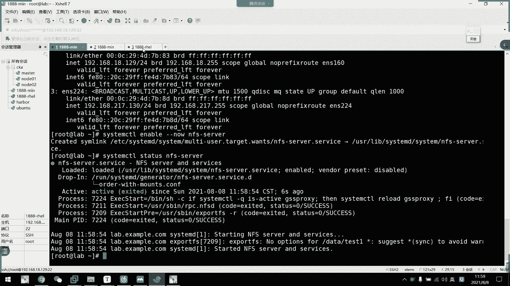
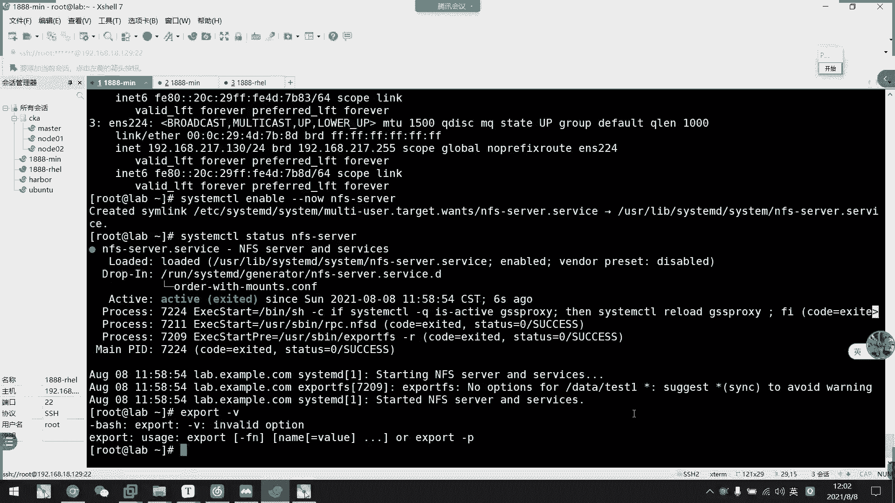
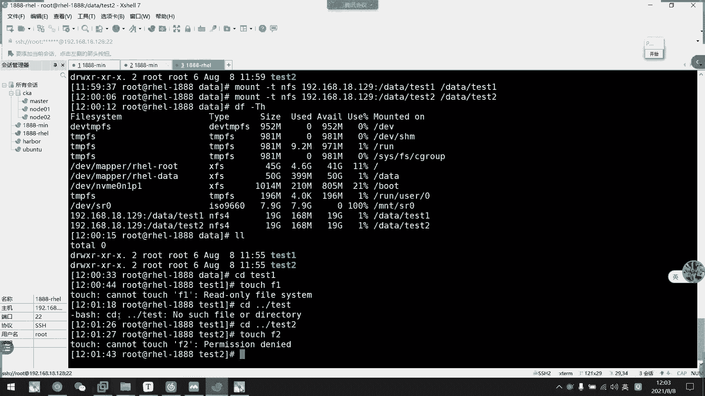

# 2021年7月新版-----RHCE8.2 RH124 RH134 RH294 认证课程 - P54：day10-3 网络存储nfs1 - bili_15701050454 - BV1Gy4y1T7ug

好。啊，我们刚刚都。呃，前面都说了一些关于本地的。啊，本地的。🎼一些存储啊，但是我们很多情况下呢嗯都是通过网络存储来挂载的啊。然后呢，我们这边就介绍一个叫做啊NFS的一个网络存储服务啊，我全服务。

那他的实践过程是怎样的呢？啊，比如说我在本地啊有1个APP。S的目录。然了我要挂载到。嗯，我们的。这个。他的他的数据是从我们这个服务器啊AFS。服务器上面的AVVS都取道。而且他名字可以不相同啊。

名字可以不相同，就是我这样写而已啊。就说我的数据其实是存放在这里的APPS里面。这就是我们的NFS啊，直接挂载上去，然后直接写入啊同步进行啊写入和删除啊。好， ok。它1个NF作用就是这样子。

但是它底层原理是怎样的？我们稍互分析啊。好，我们看一下。啊，FFS。它需要两个机器都装上我们的一个to啊啊，就FFS的tos啊啊相关工具吧，你可以这样说啊，相关工具，然后。我。

网络服务器上面NF服务器上面呢啊。创建这个服务，然后。让服务去访问我的本地文件。然后返问本地文件以后呢，他通过RPC。服务。传输给我们的1个TCVIP协议站，然后再通过啊网络传输到我们的客户端。扣到。

然后话呢也是通过我们的这个协议站呢啊也是通过我们的IRPC服务啊。来获取到我们的一个数据啊。要把它通过NFS的一个进程。把它挂载到我们的。把你吃饭上。啊，所以呢我们除了学NFS服务。

但是我们要知道它有1个RPC败的的东西啊。还有个IVpi的服务啊。好，那么我们看一下它是如何实现的啊。🎼啊，它的优势啊是节省本地的存储空间啊，然后将强有数据啊。

可以把我们那个用户的加目录挂载到我们的NFS的服务器上。然后本地终端可以减少自身的一个存储空间。所以呢有这个功能，我们就可以使用一些。分布式存储啊，有一些啊例如我们的s啊啊呃N啊那些。所谓的正点。

然后那个是专用于做存储的服务器啊，然后通过网络换到我们的一个。嗯。服务器上啊。好，然后我们来看看一下稳件介绍。啊，我们需要做的包就是NF and tus啊 ands。然后呢，注意我们渗透石。

或者是vi8啊，最些话安装是没啊，是没有安装的。然后呢，它的一个三光软件包是RRPC sp，它应该有依赖装的话就直接装上了啊，装的话就应该直接装上了。然后他一个主要进程我们这个了解一下就可以了啊。

就了个。啊，这个是啊慢的是控制它挂载的啊，包括权限管理的，然后是look的，就非必要啊文件锁。要是是也是非必要的，是检查文件的一致性啊，可以修复文件。然后是RPC的1个FSD啊。

这个是我们的一个主要进程。还一个 month。扩载全球管理，然后它的配置文件啊就两个。啊，其实。嗯，他们写法一样的，就是一个包含关系而已啊，我们等一下再看吧。好，那么我们先把这个服装上。

那我需要两台机器啊，需要两台机器，我看了没有？啊，系啦。那我把188也开起来。Oh。不对，不是你。发 real。这两台然后呢我们。一起装上这个。公住噶。圆慢的。第EV。S20。M问题S。

Mt be okay。哦，我我我我我把它拔出来了。把连回来。八谢三啊。这边应该也挂得上了。我记得我写了哦，没有写。我就发一下。慢点。DV SR name。The that's sorry。

然后我们就装了啊。这个同步输入应该没关系。看一下啊，这里也一样。好，然后我们装一下啊DNF。Can I install NP。You呃不。FS UT U TILSR。啊，坐上了，然后我们。

我们用这个作为服务端吧，用这个作为服务端。那我们就开以播了。应一个。그个唔 no。That at course。还有该回。他没有这个图，那就不用开啊，那就不用开。呃。在做这个之前。我要想一个问题。

我要不要先把它。算了，我们先把防火墙关掉吧，后面再开吧。潘晓强。スと。85。啊，先关掉。这边挂掉没有啊，这边挂掉了。好。

然后我们直接管理配置文件就可以了啊，我们应这个文件应该当前是一个空文件吧。我们看一下RBN杠QL我们的NFS。

有TIL啊。哎有这是让我们找到ETC。录一下了。呃，这里是他的配软件，不用管。呃，export他只有这个目录啊，就这个目录。那没关系，我们可以自行创建啊，手动创建啊。好，那么我现在啊。啊，先等等啊。

这个作为服务器啊，我现在做两个挂者目录啊，一个是我们的。对。好，虽然这没东西啊啊，我现在是MKBR，一个是t一。一会儿啊。好，所有两个目录了啊。那么我现在写两个啊，一个是。行。行。嗯。

表是data下的K一啊用是新。data下的t。2然后括号。对这个RW。好。那么我们现在。写写完了啊，需要加载配置，怎么加载呢啊，要用我们的export。F是。干。啊啊，是service施吧。

我刚刚table补table补不出来。哦，我知道了，我这里。哦，我写错了这个。哦，我写错了写错了。🎼写写反了写反了写反了。呃。查查。🎼是先先把目录写下去啊，然后啊这里我们先写一个心啊。

不用管它是什么意思啊啊，这里也是一样啊，先写个心。要后激活啊-2啊-2。嗯。哦，没关系啊，1后4杠V看一下啊。这里我们就可以查看到我们目前的一些购享情况啊，购享情况。好。

那么我们可以到客户端来检验一下啊，叫做呃s。五万。杠一。嗯。😊，哦。加地址。这个不可以啊。18。129。为什么呢？我这关到防我看了吗？Sts。关掉了。怎么连不过来了？不是行吗？

这边19也没错。

缩慢。

Cend cr。寂しい broken板の。Register。

寂しい。

我这里怎么没有吗？做本 stay就是。2BC办的。

开了呀。叫什么来着？N F S server。这个不开没关系。

可能是我这边没有开。点一部。刚刚闹NFS。S。

我以为他默认开启呢，有来没开。

好，我们看一下。啊，有了啊。那么我们这里呢。也做两个。啊，这边做一个惯的操作啊这边做一个挂的操作。呃，我们也MKDIR。生。看一下这里有没有东西，这些全删了啊。哎有我们NKDR。嗯，也是一样啊，开始。

你多少？好。那么我先挂载一下。慢。啊，这边啊其实也不用。我要啊。慢的杠T，然后是NFS啊MFS。然后是设备是从我们192。168。18点。129的。对ta开始。然后我们刚刚我们本地的data太始一了。

好像是2。好，我们看一下。DH杠DH看一下有没有挂得上。晚上啊晚上。

让我们来看看这个。换算了。我们来看一下。L。啊，当前我在这里是T一，这里是T2，然后它的。师傅怎么说，这个先不要管。等我们CD到推袭仪里面。那么我现在能在这里创建文件吗？啊，同学们。

你觉得我现在可以创建文件吗？在这11上面里面。呵呵。😊，没人回答你们积极性比之前差了点啊，是不是我。可是我太久没有问过了。我看一下。穿不了啊，我来看一下他提示什么啊，他是一个紫读的，我键知道。

那么我们看一下。我们现在可以在TS2上面创建文件吗？嗯。可以充进吗？可以的啊。😀。😊，不写啊，全都被拒绝，为什么全都被拒绝了啊，为什么全都被拒绝？知道原因吗？啊，知道为什么全对病约吗？

的确啊我写的RW啊，没错，是可都可写啊。我们继续看一下啊export。

啊。

FS。的确是RW啊科写啊。然后刚刚那个子读是因为它是RO啊。我没有加水项，所以它默认是RO啊，那是RW。系。😊，阿德吗？为什么是阿德啊？我我我我这个也是root啊，我看一下。

对。直接去逮他吧。

嗯，我这个也是root啊。然后他这个也是root啊。为什么不行啊？嗯。

为什么不行啊？嗯。有一点基础啊。😊，啊。先不管这个选项啊，先不要管他是不是压缩啊。先不要管了，是不要说啊。我和大家。

嗯。呃，我们中国的主席去到美国，他还是主席吗？

啊，他是美国的主席吗？他在美国有话语权吗？嗯。啊。比如说我这个呃mini的机器。你不要觉得你不要觉得要以事实说话啊，以事实说话啊，比如说我们这个是美国啊，然后这个rold是他的美国总统啊。😊。

然后我们这个是中国，他是中国人。他是中国总统嘛，所以他中国总统去到美国啊，肯定没有一个啊交有权限。

啊，虽然国情的问题啊是其他我们其其他东西啊，就是做个比如而呀。

OK那么。🤧我们这个root。中国的word啊去到美国的word。那吗。啊，他们都。不是同一个人啊，所以。此若的非皮味啊。他只是一个啊普通的用户啊，普通用户。那么我们过到这里来啊，可以看到。

我们中中国的root来到美国的领土上，面对这个root，他是不是客人？客人的话呢，他也没有对应的组给他，那么他是不是对对于我们的这个root。啊，是阿斗，对不对？是阿的。所以说他这个没有写的权限。

所以刚刚这个没有写的权限，所以刚刚他。不能写进去。那么我们试一下。C取modode，然后是。嗯，O加。啊，OK啊，加了。好，那么我们现在看一下。应该能写的对吧？应该能写。而且然后这个文件。아지요。

这个文件一定有。那么同学们我问大家。他现在这个文件所有者是谁？啊，这文件说的是。或者你们把ID说出来也可以啊。呃，会把I丽做最那一个若什么？我们看看是不是root。啊。啊，是落点落点。啊。

到我们这边来看啊，也是萝么的。啊，不对。LK色。对也说度不点。为什么呢？啊，因为我们的默认选项啊因为我们的默认选项。这里有一个叫做ro scratch。ro description就是ro用户压缩啊。

mod用户压缩。就是说如果你是从这呃比如说啊我们从中国去到美国，那么我们的中国公民身份去到美国的人，也不是美国公民嘛，所以他要被压缩，对不对？所不要说，所以他权限是啊。没有那么高了啊。

但是呢他要因为这里有有一个root跟我们的root冲突，所以它啊就会把它给压缩成一个lobo底个用户啊，把它压缩给一个lobo的用户。呃，在好像是六版本以前吧。啊，7版本好像已经改成洛底了。

6版本已经叫FFS洛底了。大家要注意这一点啊。大家注意这一点。好。那么我们现在是作为其他人了。嗯，那么我这边。切换到st用户。啊，然后在CED到da塔下。系。尴尬。呃，CH mode。777。すって。

好。那么我们现在这个t2是有一个写的权限，对不对？啊，然后我们st等过去那边也是一个。普通用户。啊，那就作为其他人啊，也是作为其他人。那么我们现在踏取一个文件到K2。叫student。好。

出来这个问题出来。那么我问同学们这个文件。他的所有者所有主是谁？啊，到了所有者说入组织谁。St的啊。😊，不好玩的，你们有基础了是吧？啊，这了。Student。好，我们在这看也是student啊。

这也是实的，为什么呢？为什么？啊，是因为我们这里。所我们这里有一个叫做no all scratch。no all question就是啊全部不压缩，但是指定root压缩。好了，我们现在继续看。啊。

我们的配置文件啊。好。好，我们现在简述一下这个别文件的格式啊。首先我们第一个是我们的一个指定网络设备，就是让它发布到网上让别人挂载的目录。第一个，然后第二个是可以访问这个目录的IP地址网段啊。

新代表所有人都可以访问啊。如果你要指定IP或者是指定IP网动的话呢，这里把它改成是网动就可以了。🎼好，然后后面括号后加一个选项。啊，是我们NFS的一个挂载选啊，共享选项啊共享选项。就这些啊就这些。

然后我们这里呢默认的跨乐是指读的，所以我们一般要把它改成RW。呃。岂不是会把分享的文件写坏吗？可啊。但是这里。啊，等一下我再纠正你这一个这一个问题啊。等一下我再纠正你这个问题。你这个问题是馈的。

但是你这里有个问题啊，这里有问题。挂载的时候弄啊。

这不是有吗？你这个问题都会出现啊，说实话你这个问题都会出现。但是。

但是他这个东西啊。又又要涉及到我们的1个RPCB，我们看一下。然后我现在是多了很多个光口。然后这里不不加A。对，可以看到我们这里是慢的啊，什么PC啊。很多都是由我们呃这个RP啊呃什么来着？呃。

RPCb这个服务提供的。端口号啊，他要坚听啊，就是为了有相同ID的人反问过来。但是他们啊如果处理同一个文件，他一一样有一个文件锁啊。啊，他不可能会同时去处理这一个的，他开了这个文件肯定会关你的呃。

就占用一个端口，对不对？但是你这个问题啊，这个问题有有漏洞啊，等一下再给你介绍这个问题。我先讲还有20分钟。好，然后到这里啊，我们可以写一个RW就。让他可写了啊让他可写。好，然后我们。

接着是啊ro square。啊，压缩。那么。我们如果想root不压缩，就是说我这边过来了，还是root的话啊，我们在前面加个n啊。然后我们同时这里啊也用个no or。Scralash。好。

然后要重新加载啊，记得EXPORT。I first。然后呢，我们直接可以看RV啊，但干RV看不到它的一个选择，这里有问题啊。No road。10块钱SQ U ASH。那刚刚我用擦屁股就好了。好，可以。

好，那么我们这边现在在用。root就是创建文件啊。中建个F3。那么。全身就是root，他没被压锁，没被压锁，然后这里。呃。🎼也没被亚索啊，是root的啊是root的。好，那么我现在。把这个。去掉。

其他要说不得不要说啊，那么我们现在这里。创建1个F4。那么同学们这个F4到底是谁的？他的所者所者是谁？快点快点。马上回答3秒钟，123。漏啲。Okay。Right。所以他这个优先级别很很奇怪的啊。

我跟你们说优先级别对吧？啊，如果这边全部压缩了啊，它就全部压缩，这个控制不了。如果他全部不压缩，设置的root压缩，要wordot就要压缩啊，你要这样想就可以了啊。如果全部就是他的优先级高。

就有全部压缩的话，它的优先级高嘛。如果是全无压缩的话，那是前面这个优先级杆啊。啊，是我们的root优先级搞啊ok。最近。没用啊，他不是前后的问题啊，他不是写的前后问题啊。注意啊，不是写的全问题啊。

但是这个其实也没必要。大家注意这个是否压缩我们的ro选限就好了啊。其实一般来说全部都压缩的啊，一般来说全部都压缩的。啊，不对。不是一般来说全部都要缩。不会全部压成落底的不会全部都压成落底。

它通常要看你的那个目录到底是干嘛用的啊，这个要涉及到一个一些架构了。比如说啊我这里是1个呃AP服务器啊，AP服务器。AP然后这里是。啊，通过网络服务共享的1个啊NFS。应该够时间给你们介绍吧。

再加一个吧AB服务器。好，首先给你们讲一下什么叫AP啊。有没有跳个ALAMP啊？啊，VVP。然后我们AP就是里面的一个阿帕奇。啊，以及我们的PHP啊。其实后端的意思不一定是配区别，可能是拍摄。好。

那么我们啊是APAPAP那么我们要管理这个rapb的服务。它里面的用户就是阿巴奇嘛，对不对？阿巴奇。都是阿巴奇亚。但是我们有一点要注意的是什么呢？我们三者的阿帕奇。啊，这个问题刚好也是刚刚。呃呃呃张玉。

是不是。不会读你名字啊，怪我。啊，小魏同学问的啊。诶CH。11啊这三个，还有这里啊，那么我要反过来啊，我们这里也要把它那个目录啊。访问的目录啊，比如说我们的这个共享成我们的哇。哇。3W。HTL。好能鞋。

HTML这个目录。那么他的所有者所有组也是这个机器啊，也这个机器的阿帕西，是不是？好，那么问题来了，他们名字相同。他民事相同，我就能反问吗？啊，我就问好问吗？大家有没有注意过一点啊？刚刚张同学问的啊。

啊，如果是student同为student同事存在会出现什么情况？那么我这边反过来阿巴奇，但是他的。ID是631，这个是632，这个是633啊，这个也是632。你们猜一下这个是什么情况来着？嗯。最终。

只有632可以访问。为什么呢？因为我们的系统另那个系统，它不认名字的啊，不认名字，认的是你的UID啊，这个我前面已经说过，我们讲讲用户的时候，我已经讲过了啊，我们只用ID啊，不认名字的啊。

所以他最后只有这个可以可以可以反问过来。然后呢。如果前面在这个RVS加呃作为我们那一个负载均衡代理。啊，作为负负句可像阿巴其实只只是做一个代理。然后呢，用户如果是轮虚算法啊，第一个用户第一次访问。

访问到这里啊，他读取不了他的一个图片。然后对到这里是才能拿到他的图片啊，然后又又第三次访问又读不了，对不对？又走不了。啊，所以。我们是认ID的，所以我们压缩采用的是要看它的一个使用情况啊。刚刚你说。呃。

林同学说。正常用哪种多一点。正常的话呢我们。像这一种，我们要指定。根据特定的目录去一个特定选择，叫做啊指定ID压缩。指定他们压缩成这个ID我不管你来的是谁，我都压成632。那我们是不是就正常了，对不对？

我管你是631还是633啊，反正你来访问我就是632。啊，把它压缩过来就可以了啊，反正他们有可读权限啊，能进入有可读就可以了。啊，如果你真的是可写的话，只能真的得那个呃加权啊，加全就行。明白吗？

要看特殊场景，要了我刚刚说的指定。UID或者是GID怎么做啊？我毕竟上面有。

这里。嗯。这个啊。指定指令我压缩成什么用户啊，指令我压缩成什么用户。

那我这里直接来个。保持关系。然后这里。加个。AM什么来着？AO uID等于。200。1是杠V啊。不需要区要反反问用化。就是说。虽然他们名字是一样的，其实我刚刚说你那个问题啊，我说名字是一样的。

但是他们的ID是不一样的，明白吗？我们是的是IB啊，就算我这里有个student。他是1002，这里的sudder。是1001。🎼他们一样吗？啊，你那个问题我只是回答这个啊。

我说你刚刚那个问题是是说的ID要刚刚呃严生问的问题，我我呃回答的是呃，他那个问题是用于哪一种的，就是特殊情况，特殊使用啊。就个这个意思而已。那么我们现在t始2啊，不不对不对啊，也可以也可以。

我要现在踏取一个。He。T O switch kilo。Can not touch诶。handder。处理。好，我们这个目录有问题吗。我想退出去都不行。我不是回压缩了吗？我全部压缩啊。不腿也要说啊。

这个不能缺吗？试一下，我都没试过去。我觉得直接是全部压缩啊。这个应该能缺吧，我记得是可以缺的吧。呃，这里写错了SQUASS吧。

哦。A no key war。L o u。

AMONU啊找了个N啊。他这个很讨厌的，就算你输对了，它是红色，所以我以为我输对了。呵。😊，我也没注意他的报错啊。O这可以的啊，可以。他这个。可以啊，让我们看一下。到时不是压成200。

哎因为我指的是用户啊，我指的是用户。然后这边也是200，对不对？这个要说这个要索。一副200。呃，刚才我说那个情况是毒的情况啊，是毒的情况啊，如果你这边。呃。有这个写的就不一样了啊，有这个写就不一样了。

好，ok。😊。

呃。这个配置上的应该没有什么好讲的了啊，就一个压缩不压缩。啊，然后是同步异步。可都可惜。啊，没什么好讲。这里有一些事例，大家可以回去看一下啊。海欧是刚刚的export FS啊已经讲过了啊，VR啊。

这个AU很少用，我们还是用VR就可以了。啊像是防火墙啊，防火墙爆火墙要把这个把这三个加上，或者是。到时候看一下考像辅导师是谁讲的，如果是我讲的，我就用这种方式啊。如果是邓老师讲的，他会他给你们。

弄服务的啊，直接弄他给他把我们的IBC他给改的。还后是查看啊，我能挂载的目录啊，就用售卖的干衣，然后加我们的hosice就可以了。诶有关于挂载啊，主要是挂载。怪来的话，其实这些不用管了。

我主要是要关注这一个啊，关注这两个可以指定他的一个。版本啊版本。然后这个一定要加啊，这个记住一定要加。这什么意思呢？我们前面说慢的的时候呢啊已经说过了，这个是。指定设备为网络设备。🎼啊。

直接设备为网络设备。那么如果断网了，断网了，我们就收不到搜不到它的设备嘛，对不对？那就挂在不上了嘛，就等于我好像把呃把光盘拔出来一样，对不对？

我冇得 f s table 都就冇得啦。

那么再没有这个。没有这个选项的情况下。网络真的断了啊，我挂载不上了那我们是不是会进入就业模式啊？啊，会进入就援模式。那么我们加了这一个以后呢，他就要断网找不到这一个了，他都可以。啊，怎么说他都可以。

让啊不会报错，让他挑过啊让他挑过。基于安全考虑啊，使用我们的这个。呃，然后科技挂载也是写到我们这个里面去就可以了。我们直接写一下啊。

呃，先把它卸载掉吧。我是随便卸了一个吧，然后把这二卸了，然后把它写回来。我下午来做一下那个。咁刚诶。还不能卸载。咋算了，直接写。再签一下。或者现在说。呃，我们直接写吧呃，VM。DVCFS0。

刚刚做了什么东西。好，我们这里挂载怎么会挂呢？直接是直接写1个192。168。18。129，把目标写啊，写上就可以了啊。da塔下的T2。好，然后挂到那里da塔下的铁使。好，然后这里注意啊ANFS。

加热选项啊DEFAULD。S逗号VER。开始我们写个三吧。还要多啊。嗯，再加个ledBUV啊，要40敏的。然后是慢的。看一下有没有什么问题，DF杠DH。

他还不能写300本，还是AS4啊。有什么用？没有作用啊。

ros没拼错吧，VERS如果拼错了，了要挂不上啊。

那。

我试一下，又4。2。是这个。这里话也会写个4吧，应该。

啊，也是死哎也不管他了。反正用视眼睛就对了，用视点睛就没错了。啊，然后自动挂载，我们下午再讲吧。走咗就。这挂载也要讲嗯演示的话十来分钟啊，我们下午来个演示一下呃，刚刚说的。而H去访问我们的一个后端的。

那个啊。进他页面吧，我们这边就。不演示那个PHPI有点麻烦，LMP这个有点麻烦，在课程外的东西就不演示了。

好，我们先下课吧。