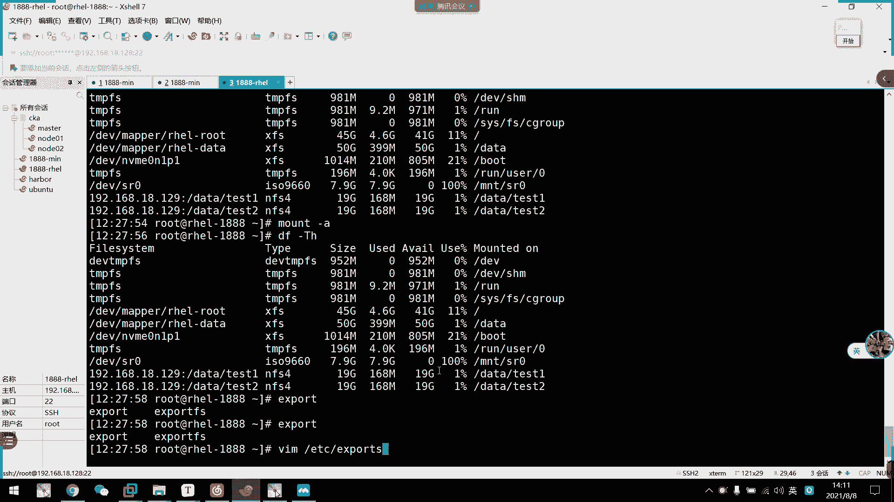
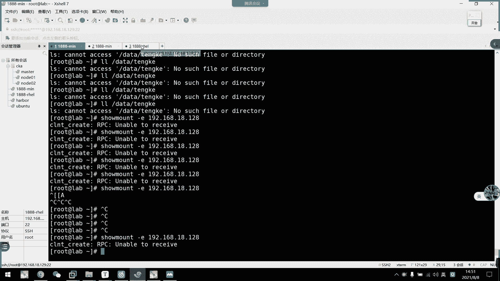
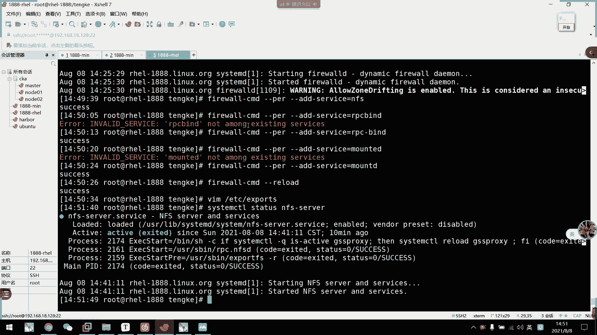
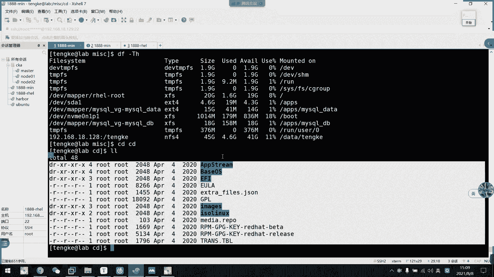

# 2021年7月新版-----RHCE8.2 RH124 RH134 RH294 认证课程 - P55：day10-4 nfs2自动挂载autofs - bili_15701050454 - BV1Gy4y1T7ug

呃，同学们。都来了没有？好，我们先回顾一下上午的内容啊。好，上午我们先讲了挂载。🤧嗯。主要是临时挂载。也是挂载啊，是我们的man，然后是device。这也是我们的molly friend。要是永久霸展。

有果载啊，我们要编写到我们的VIM下呃VIMETC下的FStable。啊，怎么挂了？嗯，可以先写我们的device。路径，然后是mipy。好，接着是我们的文件系统。嗯，然后是怪的选项。就是。质检啊。

备份和质检啊备份质检。啊，然后呢也可以使用我们的UUID。要是m point。Frow system。加选项。这也是不计检呃，不质检不备份啊。呃。然后我们的open选项啊。用默认就可以啊。啊。

然后要注意一些啊网络设备啊，用我们的let。DV。等等。🤧嗯。好，紧接着我们讲述了啊LVM关情啊，然后有3个点，一个是PV啊，一个是VG啊，就是我们的LV。呃PV我们来创建。So PV cr。

然后加我们的。block文件。啊，然后是查看。有我们的PVSPV scan。啊，1个PV display。删除。3除呃。用我们的PV remove。加我们的。Deice啊。好，然后是VG啊。创建微居。

中觉了。啊是VG cr。嗯，然后是。杠S指定我们的PV sizeize。今件大师，算消费也。可 sizeize啊，然后是我们的VG link。啊，最后是我们的PP。好，然后是。嗯。啊，是我们的VG。

VGSVG。つけ。Well， we。还有我们的VGdiplay。然后是VG扩容。就是会用。啊，这是我们的VGist。啊，然后是。李军令。啊，这个是我们的PV。有VG缩容。VG reduce。你住你。

这是P。呃。删除微距啊。规据。We move。然后就去转的。There we啊。创建。So， are we great。L是杠大L。大好然后是选择我们的什么K。M g p。有可是小L。嗯。嗯。

百分之多少？不异议。啊，或者是微G。然后是杠M指定我们的LV内。然后是我们的微距那个。不是阴领吧。嗯。应该是VG的路径啊。好，然后是。查看。相上也是LVS。然 we scan。L we display。

主是LV。货用。啊，ever可能就。LV extend10。然后是杠。有。加啊，所以是加。多少克？KMGT啊。啊要42是杠。没有。加。百分之多少的fr的或者是VG。是ever啊。啊，然后呃。文件。

系统货用。啊，用是E叉T系列。还有我们的resize。To F S。然后是。DV pest。然后是叉FS。还有我们的。叉FS。G。R OW。

这我总忘记怎么拼啊。XS。

去。去啊。FS啊。需W没拼错啊，然后是m。好，然后是LV的缩绒。好，我的。啊，还可以有一个命令啊，会员命令。会有可可以。一个命。啊，这是我们的LVresize。3R啊L4杠L。最后复制过来了。啊。

后是LV缩容。不支持。在线说容。那就呃五个步骤啊。啊，这边就不详细讲讲了，蒜容的话不算是重点。好，然后是我们的LV删除啊。删除啊用。LVmo。然后是我们的LV内。呃微p。改微的路径啊。嗯。然后是网络。

嗯。嗯，你叫网络什么网络设备吧，而不是网络设。网络存储。啊，大月S。Ephone。怎么做啊啊。就是说啊。服务端与客户端。需要安装。NFSUTS。🤧嗯。啊，然后是服务端启动服务。是我们的。CDL然后是。

AFS server。还需要依赖。RBCRPC freight。🤧好。服务多配置啊。到。编写我们的ETC。I post。

有评错ESPO。SPORT吧。I part。是以。B1X。

PORTS啊。PO。poL格式啊格式是首先是。购享目录啊，然后是我们的。嗯。Poste啊。远树。访问的。IP断。4。good idea。然后是。括号。是我们的选项啊。好，学校有什么了？损失啊。

有我们的可读可写。然后是。是否压缩？然后还有是。No。多。Squi。啊，或者是no。Road。Ssh。还有什么呢？哦。啊，怎么了？啊，A。好险。UID等于。什么。还，1个AMOMGID等于什么？

基本上常用的就这些啊。那我们下午来看一下啊。我们下午来看一下嗯，咱上说的一种。啊，如果没有指定压缩，会不会导致访问不上？那么我们就还是用这个。

服务器作为我们的IFS服务器啊。嗯。我们这样吧。做USTV服务。啊，应该装过了啊。Stious。t vD。啊，经起用了。那么我们现在。去看一下这个目录。哇，3WHTML。系这个目。啊，嗯怎么是ro？

我是。把这个改一下。可能是我们的阿玛提。好，那么我们看一下ID啊。48。那我们这里。看一下。嗯。这个已经没关系了。呃。行，那么我们现在试一下挂载。Where is post。对算。来得来来得。

这个是48，这个也48吗？这个我们要改一下才行。Useer。Modify。我是猛。Gangyu。可觉是。50吧，有没有50？就。先看一下。K别。一定下的怕死我。看一下。有501450。60。那60秒。

我就改成是60了。Useer mode。我都忘记怎么用了啊。看一下能不能更改个ID。Newu of the user account。嗯。主要是60，然后又过是阿帕7啊。This called buy。

能不能开下啊。呃。好，然我们。磕一下。嗯。目前是可以的。那我们先把这个文件删了。欢迎杠杆夫。哇，3WHTL。Xing。好，目前没有东西了。那我们现在写这里。呃，3W。HT NL。哇。3W。HTNL。

要是直接新吧。给他一个可多块钱，也没所谓呢。嗯。SQ A S here。AMOMUID等于。4实万。然是。FS杠。是上逼看一下啊。有没有。

Okay。那我这边看一下sold。Mth。3D啊，是我们的哪个啦？嗯。192。168。18。129。啊，可以的啊，有这个了啊，然后我们现在挂载一下。慢的。523WHTL。好的。地址忘记加168。18。

129。没好。🎼快到我们的523WHTL。Oh。嗯。刚才应该做错了。嗯。要一下。啊，行，是阿玛7的。48，然后是887。那我现在应该可以访问了。我们看一下有没有东西。CD到里面去。

呀这边就一个root roof。这边也改一下吧。嗯。然后我们看一下能不能访问了。哦。403伏壁的。奇怪。嗯。我说做反。他权限去读那个。然后但是我现在阿巴奇没有权限去读这一个。我是不做法？嗯。

这个是磕不到这个我是不是做反了，我想想。还说这个文件不改了。应该我去访问这个。所有都要缩成这一个。我看下我。主かエピエス。他不能登录。我想想。48这个是60。4860。我跟说过去访问他。那么我这个身份。

过来以后他是其他人，所以我们要给其他人一个权限啊。摄取mod。A家。但是他已经有可补权限了应该。有个多。对吧有可度吧。写不到。课才对啊，可以了啊，啊，不对，不行，视频上伏笔的。403否冰动。

哪里出问题了？我想想啊，我这边访问过去。还有目录。Mlu。🎼当然这个目录我现在过来，他就是阿帕奇用户啊，我反应过来，所以跟目录的全身应该没关系啊。对不对？我现在就48，相当于是48，我过来访问他。

四8全限。拉回来，然后读这个文件。嗯。奇怪哪里出问题了。所以他这种样板安装的没有。固定权限。我这里写笔了。插举一下。呃。啊，应该是logo。好像是0上伏壁的。诶，怎么个学生被拒绝？现在以这个G分份。

他应该可以访问到这个文件啊，他有权限啊。为什么是找不到了？我看一下。

怎么是生头的，可以啊。哦，不对。防不了。他在出来这个页面是什么呢？

阿帕奇的默认页面来的。啊这个哦，知道。user group都是我们的阿帕奇。有3pro都是我们的喇8器。S will me your address。

Yeah are problem with the be。や。我先不让他挂上去。先卸载掉。系挂生吗？奇怪。他不是便安装。很难指定啊。现在的情况是什么呢？48。他这识识别不了。

是发回我们的阿巴7所以它访问不了。啊像什么东西啊。好像是root跟物头的。还有访问权限的问题。嗯，这写多少？这样就可以收入。F。嗯。还是我说的。应该是287。看看什么情。摄取报毒嘅。正材应该可以。嗯。

但是果它变成48。这里又访问不了了。那他就用主有权限应该也可以啊。是吧我说反过来我应该是要把它压缩成我们这一边的才对。但后动服务器我们应该是啊压缩成互动服务器，然后让它可以访问才对。没用。ICL。

不是行里那个是。看不懂，我问你，现在是权限访问的问题。但是我现在正常情况下，不管他是谁的。你看我原来是ro的，我都能访问。然后是执行权限。啊，不是不是是。都是可读嘛，对不对？可读就可以了。嗯。

我把这个也改了啊。C去。Moode。要是。3W点BL。某个锤子。欧洲欧。表示。阿玛7阿玛7就可以，但是他一过来。一挂载上来，它就不是普通的阿87了，它就变成48了。48。48。没关系没关系没关系。

不是这个问题啊。有什么关系？我克自己的，关对面什么事，他这边只是传了个文件过来啊。相当于我把这个文件拿到本地了，但是它的一个访问权限不一样啊，这边的阿巴7跟那边的阿87不一样，我改成60了吗。

记不记录啊，记不记得我改成60了嘛？如果是这样应该就没问题。但如果改成这样的话呢。感这样的话呢。就没太大意义了。感觉这样就没太大意义了。报点钱序。叫什么来着？报上了。要再刻看一下。你看又回到这个页面了。

嗯，不压缩都不行，为什么呢？我要是布压缩都不行。那实体上火逼的。我是不加速。そが 아버지白ボで。然后这里这里诶。文件不同吗。我不压缩，怎么变成48了？我这不要说吗？No哦。就不要说还是这样。啊。

还没权限。合同。有权限进来呀，只是会先改而已呀。企全。行行行。我是。哇。3W的点L。这就重写一个。俾你捞啲捞过啲。看家能不能磕，应该不能磕的这个。啊，这个不认可。本来开始爱发企。邪取。Moode。哦。

这是O的。表是ABAHE点ABA。都是 indexex。嗯。一选生杯。拒绝了。在这里干这个就可以了。😀呵呵。😊，对下。那这里还是48。我不压缩还是48。403发对的。那奇怪了喔。嗯，我想想。我现在。

是要用这个作为我的。脚过录。考试的话那他让他是GID相同的。他要求GID三同。但实际情况下。我应该要说。嗯。不对呀。这不对劲啊。的确是这样的。应该把它压制死。60块钱。要跟他们一样。那就讲错了哦。60。

那就不能统一了。对吧。那就不能统一了。这就变诶怎么还没变？但其实lobo底我应该也能反问才对啊。对吧。好，像是阿87的。那我们先刻一下。嗯。有问题啊有问题。我觉得你自己访问嗯。这里不是77的吗？

但是我当前这个。阿巴奇对于他是一个。我看一下，把这个文件也改一下。不行的话，我先。不管他了。我现在学限都是满了。还是是连下伏币的。选择被拒绝。他这个样子做不了这个实验啊。要你做做不了这个实验。

他要用编译安装才行。这个实验。Fan。到时候我们换一个吧。换一个。还有个先讲OFS那个实验要先讲OFS啊。

我们换一个吧。好，首先我们看一下构做FS。啊，OF是什么呢？叫自动挂载器啊，自动挂载器就根据需要自动挂载NFS的共享。有了并将在。不再使用FF共享时自动会卸载啊自动卸载。

所以呢啊我们到时候就不需要我们的那个。呃，编写我们FStable啊，这是要编写到我们的op o to FS上面啊。然后它是一个服务来的啊。然后它的一个管理方式跟我们管理其他服务是一致的。

然后我们要先做这个包，就OFS啊。

好，我们装一下啊。呃，还是以这个还是以这个作为我们的。这个主题作为我们的。呃，叫什么？刚该不要是服务器啊。Yeah。嗯。然后呢我们这边装个工具啊。ATOF。好，然我们看一下。那实际我要。我上编译看一下。

啊，我们这里看一下，这里有一个master啊，master就是我们的主配置文件啊，我们先看一下主配置文件啊。🎼好，准备文字，我们就注意这一个就可以了。嗯。这是什么意思？🎼这一行啊，他说监听这个目录。

🎼然后呢，这个目录的配置由我们这个文件控制啊，由我们这个控文件控制。那我们现在改一下啊，叫对塔，往件听对塔，然后是ETC下的。做个 home。那么我们再看一下刚才的。🎼啊MC文件啊，你看他写的什么啊。

其他注释可以不管。行，然后这里是它的一个目录啊，然后是它的一个挂家选项啊。S type看到没有？🎼要素地址。那我们怎么写？我们找把这个copy一份啊，copyETC下的Oto MISC啊。

改的是我们ETC刚才改的那个叫什么名字？Oto。home对不对？欧洲 home。啊，后我们编写一下这个文件啊。我都 home。啊，这里。嗯。把它删过来。这里改成是我们的一个子目录啊。

就要存放在data下的一个子目录啊。比如我这边。叫做什么好lo？嗯。随便改个名字叫腾柯吧。啊，要怪学校啊，我由于我们是呃NFS这里就写NFS了。啊，文件系统嘛对不对？不然了可读可行。再加个。

其不要那么复杂，也可以直接NF，然后就它默认就可以了啊，然后地址。或者。啊，是我们的我们什么都不写的话，他就默认为我们的dera选项啊，所以我们还是加一个吧，叫做let。这不用啊不用let外。

它它也不是写在F里面啊，就FFS就可以了。要我们这里写一个192。168点。哎呦。好像弄错了。弄错了算一样。18对128，我们这个作为客户端的啊，侧个别人偷客户端的。嗯。data下的叫什么？同科吧。

然后我们这边变成服务端了啊这。呃。开起来，然后我们C一到。啊，我们AKDIR一个叫腾科的目录。其实这边没所谓。这边我建下来里没所谓啊，但是我这边写，其实我们这边就挂载到哪个位置啊，就就说我本地的乘客呃。

D塔下的乘客目录要挂载到这个服务器的哪一个目录啊，我就设设为一样而已啊，设为一样而已。要不我们色程不一样吧。我就直接叫粉克。是不是。涉道。我要给。那我们这边就要改了，这边就叫。按得说叫腾课。嗯。

然后要怎么做呢？我想想啊。这边要共享出来。E d c。Is plus。PORPFS。はい。要我们这个目录叫藤。和共享给谁？要求2点。168。1。129吧。有。可多个谢。おお。craible。然后。

腾科这个我们要改一下。S mode。嗯。先创建个账号。You是 add。腾可。要指定他的。看下水泥加目录。直下目是不是干低呀？Gumpam low cr home我加。创建加目录。

指定招目录是哪一个来着？谢。不是股。😔，呃呃M是呃是是另外创建。那我直接创建这个用户就好了。等科I等科。啊，是1013啊，记住啊1013，然后我们把这个改一下。可如科。UID是1012吧。没关系。

🎼腾哥点腾哥，然后是。文科这个目录啊。可以了，师同哥同哥，但是我们啊要看的是ID啊，1012。那么我们这边啊想让这个。目录。啊，像然这个目录作为我们腾科这个用户的加目录，那么怎么做呢？嗯。

我这边先创建一个用户啊。有是。不对。都是爱的。然后是干U。有。012杠G。10。13。然后睡觉疼。先冲这个组。好退出来了。哎呀。错了错了。那迪例啊，然后是我们的。没有。扫了个杠R。现在杀了怎么办？

食冲佢啊洗一格啊。这个主也没有。这是啊没有加目录啊没有加目录。嗯。是不是做错什么东西了？

我想想。我想想。

我想想。我是做错什么东西了？我们先。看看。被告。要是看下面有没有这个。叫什么来着？嗯。

现在还没用得上，咋整？我觉得我出了点问题。天庭主目录。自动挂掉。然后我们挂的腾科。我觉得我出了点问题。没错啊。应该是。子幕路监听啊。我觉得这个目录是不需要创建出来的，然后我们写到副目录里面去。

需要服里面去master。要是这个文件。

嗯。是我这边没共享吗？Low far system is plus。USB R T。是这个吧。写错了原来。到底 f。啊，可以了，ex。然后我这边可以找问了没有？还是没有。So。慢杠1192。168。

18。128。是没有。防火墙开了吗？啊，公安市。那我们呃早上说了呃，他有3要要要加4个服务啊，我们看一下哪四个啊。

一个是RRPsp啊，一个是NFS啊，还有一个慢，我们加一下这几个。

5沃。杠CND杠杠客杠杠adserv。等于啊LFS。So emphasis。啊，然后第二个是RBsp。L PC freight。嗯，你这个啊。回了。有一个横杠啊。啊，第三个是我们的mount。多个亿。

好。尴尬娱漏。成功了。然后我们再。怎么还没有呢？129没问题啊，腾克。A PC unable to receive。

128没错啊。胸慢的肝衣。那主要点168。对18。19。

咋整了？开了。放的放的都不行。

启动了吧。我刚点了。

就。

先关帮我查开一下。嗯一关就可以。为什么会拦截掉呢？这都开放了。我看一下。是不是昨天做实验，我把这个拦截了所有流量了。

感く。看看下是不是。防火墙这个必须要弄一下。啊，对呀。他家只通这个了。难怪。要把这个删掉啊。嗯。要我们入口这里也有问题哎。又口。不。要把它加回来。冇认中。32767。啊，这个没关系。然。

看一下摸中啊在后重啊，我要把它加回来这里。加回来。嗯。呃，昨天玩坏了这个东西。三杠。Change in the face。对于。EX16。要是尴杠。受。再说。这个规则怎么没删掉呢？算了没删掉就没删掉了。

已经跟他没关系。我刚看还没有遗漏，应该是。啊，回漏了就没有了啊。那我们试一下了。可以。看到没有？嗯，刚刚就是防火墙打了啊，昨天写了一些乱七八糟的规则，把他给打了。啊，行，那我已经可以挂载了。

然后我们现在看一下能不能挂了啊。要再。可以。嗯。我头有点大。

怎目录写在这里就可以了。是我那里出了问题吗？musster再加上musster。

我们有个鉴定data。对吧。然后EDC。Outto home。然后再写一下。本当？后。🎼难道我这里出了问题。腾科。F， S type等于 NFS。

然后。挂载到对面的乘客。哪个没问题啊。至少一只。此目录。

咋整啊？原告的。都没有这个目。That lies is same。The city又 also stable。本地挂到DV的C，然后是CD。哦。进不去。那老师这个服务有问题啊。Oto F S。没启用啊。

😊，我们说。行了，我们看一下大家的。这个能不能用？我们LLMISC啊，目前没有东西，然后进去看一下MISC。还是没东西，然后我们CD到。CD可以了。可以了啊可以了，然了我们回到C塔。

目前我们对塔没有东西啊目前我们对塔没有东西，其实他现在是零的话，证明他已经挂上了啊，已经挂上了。然我们在CD到。看下现在是零啊，我惊到他们的腾课。Yeah。然后DF干TH看。然后我这里自动挂载上了。

看到没有？自外3。要我要指定这个。目录为他的。假目录。应该可以。そか。找不到，他说。我刮错了。不对。我现在要指定这个目录为他的加目录。

指定加目录我记得是有一个选项的呀。你们记得吗？指定加目录。move home吧，对吧？我觉得有一个杠第一选项的。都是艾。应该有杠第一选项的。在这里轰电啊。红点啊。啊，就可以指定他的加目录。

那我先改一下喽。马腾科。这个。歌。这个ID。用Uer mode。然后把它降低，指定到我们的。da塔下的乘克。然后是。这就可以。那我们树干。哎，怎么还是找不到data呃写错了。啊，有了。有了有了。啊。

我们现在就把这个作为它的一个加目录了啊。我们看一下啊。呃。我写个东西。Touch。都必有。两啊诶，怎么是入读的？啊，真的是。我在这里创建吧。我们现在是在佳木路了啊，看到没有？对塔坦哥。

然后呢呃我们套取一个目录。是属于腾科腾科的，然后我们这边看一下。Yeah。那我们就可以把呃外部存储啊，通过MF。创建了一个属于他自己的一个加目录啊，属于他自己一个账目录。啊，就不需要他装建。

然后我们指定。这个实验有没有看不明白的？😀呵呵呵呵。😊，我真得你们看不明白。啊，我们再演示分析一次啊。主要我们这边呃。的腾科。我在这边这个服务器创建了一个啊UID为。1012的用户啊1012用户。

然后呢，这边创建了一个目录啊，这边创建了一个目录叫做啊跟下的很客啊。啊，从前一个叫跟下个陈科。好，然后呢我把这个目录啊通过NF共享出去了啊，共享给我们的。啊，就只有这个地址啊，就是这个地址给以看。

然后呢啊不压缩。啊不要说，然后呢是可读可写的啊，可读可写的。好。把这个目录给出来了。然后呢，我们这边通过Oto。我的FS。啊，欧洲F。让它自动挂载上的这个目录啊，让它挂自动挂载这上这个目录了。

逻辑是怎么样呢？逻辑首先我们看一下它的主配置文一切啊。呃，准备的文件是什么来着？Oto and master。啊，这个它的主配置文件。好，我们这个Oto FS的这个文件呢。怎么写？首先是他监听的目录啊。

监听的目录啊，注意是监听的目录，然后啊自己创建一个备注文件。这个备注文件呢叫什么不要紧，但是他一定要otto开头啊，otto点C啊，otto点C。在纸箱。好，然后呢这样写完就可以把它退出了。

所以我们商后是根据这个文件来配置的啊，根据这个文件来配置好，然后我们写一下这个文件啊，AOTO。好，要个文件呢又做了什么东西呢？首要是把我们的子目录写进来啊，其实这个就是挂载的目录啊，挂载的目录。呃。

这里腾科直接写的腾科，其实他的路径是什么呢？是我们。data下的腾克啊。这个是我们对档下的乘客啊，是这个。好，然后这边啊是FS type啊，就挂载的类型。嗯所以MF啊，然后挂到哪里啊？

就挂到我们的MF服务器，共享出来腾科这个目录啊，刚刚排说是因为。它连不上了，所以只能排啊只能排。好，就就这样子啊。然后我们就可以自动监听了啊。我们现在可以看一下呃。CD点点。他播一段时间后。

它会消失的这个目录啊。啊，现在还在我们重启一下啊，重启确认。

嗯。

就这个。他应该快来家了。啊，这是。好，那么我们现在看一下DF杠TH。

你看他现在目前我们没有挂载网络服务，对不对？没有一个是NFS的，对不对？

好，然后我们。CD到da塔。🎼包括对塔目前也是空的啊，我也是空。但是呢由于是O to FS的作用啊，我们继续进一个看不到的目录，或者说我先不进直接切换用户啊。腾科。你。让我们PW。哎呀出来了没有？

我们都看一下。但是没配，都不知道能不能看了。直接第二幅钢贴去看一下能不能看啊，可以啊，你看。这是不是自动挂载上了？嗯。自通挂有伤的啊。要我们。K一下。FS stable。并没有这一个啊并没有这一个。

所以呢。它现在能自动挂载，是因为我们配置的Oto FS啊，配置Oto FS。所以它能自动关上。然后呢，我最后一个操作是什么呢？啊，是创建了一个跟。这个。这个服务器的腾合是一样的ID的一个账号。

然后让他作为他的江目录啊，让他作为他的江目录。嗯。啊，你看我这边创作1个UID相同的一个账号。反过来他就没有权限关系了，对不对啊，他就想就是就是系统会把它想做成是同一个人来的啊，是同一个人来的。

所以他就可以直接访问了。啊，这方案。就可以好啦。呃，通过我们Oto F。他一登录。就会自动连接上去。然后我们可以看到啊，他的家目录就是对塔坦克。一口。呃，到了后。对不对？这就什么他的加目录啊。

我从来这边用过的时候，通过杠D去指定的啊，对啊是通过杠D去指定的。有一点要注意的是啊，他们的ID要相同啊，ID点要相同。啊，不相同的话啊，又像刚才那个呃被置访问的问题一样。明白了吗？同学们。啊。

明白了吗？第二次慢慢重新解释一遍，能明白吗？其实你主要是结合着O to FS跟我们NFS的结合啊，说是明白是吧？嗯，其实这个Oto FS呢，它也不需要这样子做。我们是不是有个模板。我刚刚是有个模板。

Oto M S ice。啊，他默认有一个这样子的东西，他其实它是什么来的呢？其实它这个是什么来着？我们看一下，虽然它有一个副目录叫MSIC刚刚没有啊，我创建出来了。

我们就MIMSIC我们主配置文件就是要监听主呃。腐目露啊，鸡肉是腐目露。SIC让我们去看一下这个文件啊，VMEBC。好图。MIT。应为SCO有写错啦。好，这样。实际上呢做的是什么呢？就是挂载到CD。

CD就就就是说要把我们的呃CD room，就是我们的SR0，其实这个就是SSR0，它就是用了这个CD room来表示啊。啊，挂载到我们CD上啊，你看然后它的文件系统是ISO。7660，然后是只读的啊。

什么lowus IDD这些选项啊，可有可无。只是我刚才没有加选项，只是加了AF的一个默认选项啊。好，那么我们串起来，然后CD到MISC。啊，没东西对不对？没东西，然后DF。杠TH。也没有。呃。

关于我们这个光驱的画载，对不对？然后我们现在在CD到CD。

看到没有？看懂没有？啊，我们坚定就是说有需要我访问的时候，它就会自动挂载上来啊。

啊，其实欧的F就是做的这个东西，我是结合我们的NI。给你们做一个实验而已。好呀，直接挂的上的DV阿里的，然后挂载到我们LSCCD啊。啊，stos的话呢，它会自带Oto FS的。

所以sles它有这两个目录的MSCCD有有这个目录的。但是我们这里re它默认没有啊，re默认没有，所以没那么好玩。不然前面讲课的时候，我就讲过这个话载的吧。但是他没有啊，如果用sd的话。

我就可以用这种方式给你们讲。我我我会说啊，这个是一个神奇的目录啊，这是一个神奇目录，我会这样说。靠。所就这样子。啊，监听副目录。然后把。紫目露挂载就这个意思而已。

🎼O啊，你们回头啊再理一下吧啊，捋一下，回头。你看这里一样的。啊，记到这个笔记我早上已经发过了啊，大家可以回去看一下。啊，自动挂载子配制嘛，对不对？你们捋一下这个思路就好。

