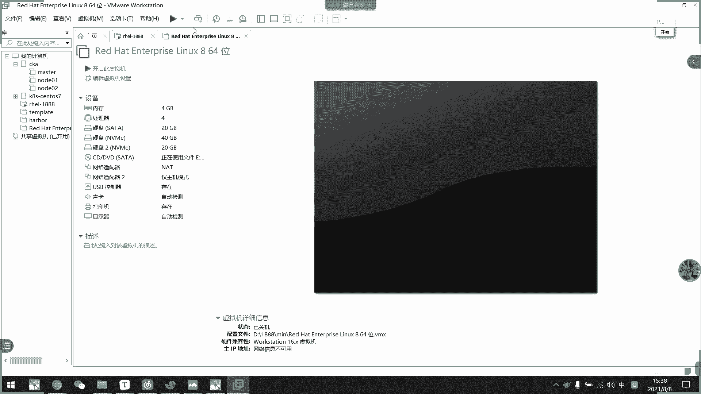

# 2021年7月新版-----RHCE8.2 RH124 RH134 RH294 认证课程 - P56：day10-5 高级实施存储 - bili_15701050454 - BV1Gy4y1T7ug

我去看这两个。高级存储功能啊。好，首先。第一个是我们的strs啊，strs跟我们早上学的LVM是类似的啊，它是类似的。呃。它的概念是什么呢？它的概念啊就是把我们的一个分区或者磁盘。

加入到一个词类啊加入一个词类，然后从这个词划分文件系统。关文件系统。换完键自动啊，然后呢，如果这个词用完了，然后呢继续往里面加设备就可以了，继续往里面加加加分区或者磁盘就可以了啊。

这跟我们的LV是有点类似。那么。我们。看一下这个怎么用。但是他要通。它跟我们LVM不一样的地方是什么呢？啊，就是他需要有一个服务作为首护进程来提供服务的啊。如果没有服务的话，他就用不了。

所以它没我们LVM稳定。所以。这个东西呢。目前在生产环境中啊没有人敢使用啊，没有人去敢使用。然后它这里也有一个呃每个词最说创建二的24次方个文件使用，其实也够用啊，其实也亏。好。

我们看一下他的是怎么做的啊，是怎么做的。

呃，我们先做个环境吧。生活环境。嗯，先把这些都删掉。

我要重新添加磁盘。X死了。哪个大拉哥。看一下3。40G这个啊，行，把20G的都删掉。33。

San。对。然后我们这里要。卸载一下啊。嗯。V I M，BVC F， S T。这都删一下。然后我们关机。

关键要继续删这些。然后添加。嗯，还是两个吧。看一下哪些人删的，8月8号。确实其。00不312345。然继续添加。哎呀要死。我怕删错。Yeah yeah。看下能不能开机。唱错了。诶，应该没有吧。

为什么要有5了？没有五不行吗？

关掉。

重新打开。嗯。嗯。我不是删了吗？这文件没有了吗？这文件应该有啊。6有思位。居居。对，狙居。应该可以删才对呀。怎么删了，还不能那个。看一下他的信息表。对啊，我删了。应该没问题啊，那个又不是什么来着？

没了还原了。需要这个。我不能生。算了嗯。我没打拍照啊。没打开走。

这移除掉。😀呵呵。😊。

他为什么要读那个？说吧。开不了就开不了了。把次法2。哦，这个哦怎么来了个这样的东西？刚刚没有保存吗？我刚刚没注意到这个里个还有个磁盘2啊。然后这里。然后连接上个。

啊，现在应该可以了。我没看到磁盘2，为什么也能看到？不过说跟那个没关系，5的话，是早上建出来。

还差一个吧，我是不是只加了一个？到师傅只家里的。再加一个，我们热插拔吧用。

SDA吧。还是跟早上一样啊，一个用分区，一个用硬盘。啊，一个啊对一个分分区一个用硬盘。

可啊。That was beO。好，有个MVME002，还有一个哎。唉好烦啊。

热茶盘没扫出来呀。扫一下那看。忘记命令的。这命令谁记住啊？应该是第几天。这个命令谁去记住他？

Stema。哦都有 s d a ，我以为 s d b 。

好了就不用扫了。啊，如果没有的话，我们在这里扫就0123。

少试次就可以。如果没有的话，就重启电脑也可以啊。CSDA啊OK那我们做分区啊，F disk。呃DV SDA。给他充个主分区出来。呃，就。加5局吧。再弄一个。把一首呗。哎送据，那就可以了。

那么我们有一个分区，两个啊不一个磁盘，两个分区。然后我们看下怎么做啊。

那你们野神真好。啊，首先是需要装两个包，叫sts啊，一个是叫sts啊，一个是st的1个CNCI。那我们装一下。

STR。A。Sap cheeseese。

举张。关掉。刷体4有没有拼装啊？TI A I。

，没明错。D还有1个STRARS。C L I collect， call on。没挂的。VVS20。也没问题，那是20。做了。然后我们齐动服务啊。呃，音。刚刚notTRA A TIS。Okay。

好，启动起来了啊。好，那么我们继续往下啊。主要是我们要将磁盘或者是分区添加到磁啊。怎么贴呢？嗯。不对。然后是要创建文件时候，然后挂载，然后是创建坏快照，它的只是坏照，然后先创建词啊，说先创建词啊。

这要是刷ies approve，然后是指命令。比如说create啊，然后是pdding啊。要是。

Diss。我看一下啊。呃，刷des。Yes。吐。Great。😊，然后叫什么？直接叫库洛一吧。Lber DV SDAE。好，然后我们刷 this。W。listist。你看这就有一个啊5G的。

我觉得词啊5觉得词，那我们怎么做呢？

呃，呃，list史已经用过了。啊，然后呢它可以增加磁盘的词啊，我们用ad啊我们用ad。直接复制过来吧。

SDA。2啊也加进来，然后我们再查看此。

不要10G了啊不要4G。呃，他还可以用这个brolock。device去查看呃，每个词有什么东西啊，每个词有什么东西啊bro device啊。

Let。然后呢，每个词有什么在里面啊，分别是两个分区啊，那么这个是不是类似于我们的VG啊啊，是不是类似于我们的VG好，上个词的话呢，等一下再讲。

好，然后呢我们要创建一个文件系统啊。专业文件是什么呢？啊，说 this file system啊，然后是呃指命令，然后加我们词的名称，然后是我们的fi system名称。

我们就直接按照发例案子做啊啊刷 this。F system。Great。标识的名称。1是。我这系统名称，我这边名字就叫FSE。他跟LV是类似的SS1。

然后我们可以list啊看一下啊。

呃。STRAIS。File system。Inlist。我们就这也只就创建了一个。啊，名字叫。If we either。文件系统它存放的位置是在我们shop。这个目录里面啊看。

其实它跟我们AVS是类似的，你看变成DM7了啊，早上我们是不是DN0123啊，现在是DN7的。

好，紧接着呃，我们往下看。怎么挂载它？嗯，其实这个好像已经是可以使用了，但是。啊。要看KFS啊。在下是不是。嗯。好像不用。She。哦，它本来就是叉F的文件系统，我们看一下是不是BOKID。

这太少用了我也记不住了。它本身就是一个叉X的。然后这里才是他的入ID。我们是8F8A是不是8F8A，那就可以了。要我们把它挂载一下吧。

呃。呃。让他写那么多东西。呃。我们挂载一下嗯。对。EDC F2。哦。表示。复制过来吧。好长的东西啊。你们放心啊，目前考试还没考过这个东西。拐到哪里？发到我们的APPS吧。要示查FS。DFALD S。

然后0个0这样子肯定会死啊，跟你们说这样子挂肯定会死。啊，虽然它现在是挂上了啊，现在是挂上了，但是我们看一下重启行不行啊。我要重启机器有没有问题？好像没问题我。好的这没问题吧。嗯。嗯。有没有啊？

已经死掉了。哎诶，在这里诶。怎么奇怪了？这样子挂了肯定有应该会有问题啊。他因为需要服务提供啊。

然后是我en我的问题。当然这里应该也是应联波。一波了。诶。神奇哇。Yeah。😊，说了。啊，我们这里要加一个选项，叫做早上说过的啊X新啊X新。然后它是从我们的服务提供的，然后我们服务服务是。没发车。

但是它正常应该启动不了才对啊。

我试一下能不能写东西。那他又都写东西哦。

啥玩意？啥玩意？为什么他能直接挂在上？啊，反正反正他如果不加这个使使用危险，我们要把这个啊他从。他这句话的意思是什么了？啊，他这句话的意思是。呃，当。系统启动起来之的时候呢，它可能会搜索不了这个服务啊。

会可能搜索不了这个服务。如果我没写啊啊，我没有写，它可能会在服务启动之前啊，就搜索我们这个挂载啊，会搜索我们这个挂载。然后呢。他就找不到我们这个UID了。啊，挂在不上了。所以他是有问题的。然后呢。

我如果加了这个选项呢啊，我知道它是一个服务啊，它就会等待这个服务启动起来，然后再搜索这个服务是是否正常，是不正常啊，然后他才会去挂这个东西啊。才才会去挂这个东西啊，我知道为什么现在可以了。

我到现在为什么是可以啊，我们现在把这个服务besable掉啊。

Please。给不。呃。谁我的啊，然后我们再重启。呃，不是营比较高，它是启动起来。要他他这个提示到底是什么东西呢？是告诉他是一个服务，就算他如果服务失效了就不挂载的意思啊，像我们的。

呃，letDV是类似的，我们先在看一下能不能开啊，估计已经死掉了。变成这个样子。

左边这个样子。

这不是优先级的问题啊。

如果再能开，我就。无语啦。啊，开不了，很明显已经开不了，对不对？死机了。那我们。嗯。那我咋整，只能去就援模式。他有毒啊。😊，他这起码要我进救援模式啊，他救援模式进不去，真的是。

因为我经济模式。无语。邓吴宇。呃，然后我们加上选项看一下。叫什么？SY S TEMD。要点re快。

呃有没有D呀？Quice。

I E Q U I yes没有 data。等于我们的tro。第一。查个service吧。然后是touch。点Oto。reable。我关记关。啊，压根没有开SA吧，那就好。连接来。哎呀，直接开机了。

看到没有？直接开机了。挂点上。啊，服务自动启动了。所以他居。关了它，他也可以把它给拉起来啊，通过我们这个学项把它给拉起来。明白吗？同学们，这个选项到底要干嘛用啊？就是让他一定要访问这个服务啊。

不访问服务机器都起不来啊。啊连我们竞援模式呃，单用户都进不去啊，单用户进不去。

啊，呃那么这边的话基本上它的使用就讲完了，创建使用就讲完了。然后呢呃我们还要看一下删除啊，查值啊或者删除词或者重命名词啊。这开词呃我们刚刚已经讲过了啊，这样是刚刚已经讲过了。

那么我们继续看一下删除怎么删。嗯，说有。忘记了这个。他这个不支持扩容啊。他这个不只货容。不对。

啊，支持扩容的它词大词有多大，它的文件系统应该就有多大了是吧？我们创建的时候就按照词的大小去创建。

TRASTRA TRS。说 this for system。

512兆目前使用的512兆。那我再创建一个二行不行？还是可以。要确认不了他的大小啊。说的是。刷点就出现不了大小嘛。我们再历史一下铺。呃。ho。的确确认不了它的大小。那就是他们一起用光了就用光了啊。

一起用光了就用光了。啊ll说一下。我也是。今天才找到它的一个区别，而且我们DF杠TH是看不了它的那个大小的。

你看他虚拟大小出来的。实际上看不了他有多大的。

对不对？所以这个很麻烦，一点都不好用，所以谁敢用。而且还要服务支持。好，那么我们看一下删除啊，上文是什么啊，就第。Tall is。2。啊，先不删了啊，删吧删吧删。

叫什么来着？对啊，他说虚虚年我们我们等下要讲两个都是虚拟的。说 this。然后是f。表示ditop。嗯。やばいす啊。嗯。😊，听错了。The first link。这不就是FS类吗？坡哦少了个玻璃啊。

算了，要我再历史一次。系啊。那个又删掉了删掉了。

那我们看一下快照，看一下快照。啊，重新会照。现然关叫这个实验。我们先。呃，把它挂在上对吧？挂在上的。

好，那直接穿就可以。然后我们现在看取一个呃。PPS2，然后再他取1个F2吧。系。啊，先有两个文件，然后我们现在创建一个快照啊。呃。Ss。快。Sys？死了。嗯。开张明春。

可则。Pro1。

哦，还有一个还要名村。FS1。

怎么查？直接从这里查就可以了。啊，应该是直接从这里查也可以。

啊，对，这些所以拆也可以。

他有另外一个 u d啊。另外个 u i。然后呢呃我们可查一下他的地址。

所以他又创建了一个新的出来而啊，然后把数据复写了一份。然后我们现在把这个I杠RAPP。Yes。哎，破坏掉了。对不对？那就破坏掉了。没有东西了。要我们就另外挂上就可以了。EZFS6。把这个UID改一下。

The。上多了。应该是这个。唔満かけ。诶。Not fun。BLK， I。不这干嘛？哦，有杠有横杠的。真的是。

啊关卫生又会者诶诶。没动计出来力。啊，有了有了有了啊，要退回去刷新一下。吓死我了，我以为又翻车。啊，这又恢复了这又恢复了，然后把原来的那个删的就可以了。

好，这就快做声。然后我们删除词啊。上次的话。直接删吧。

不行。我觉得不行，试一下吧。啊，不行啊，你看。啊，因为它有一个文件系统，所以我们要先把文件系统删一下这个。直接把这一个不要了坏掉。弄弄弄完。还是要挂来着，然后我们把那个。呃，f系怎么删掉啊？不能删了。

不要我删了。问题。Thank you。哦，真的是。好难用啊。Yeah关都没人管。嗯，关都不让关。你够吧。唉。威定那个就不讲了，重命名的没什么好讲。啊，这在没有挂展了。13掉它。

Ma nu strategy is unable to collect to the sh。Service。我刚刚输错了啊，删掉了啊。要把这个再删掉。好，然后我们看一下啊。

STRADRS file system。In least。没有东西了啊，130。杀掉了。没有东西了，我们现在就。玩玩。玩玩玩呢刷底死就这么简单了。

啊，跟我们LVM是类似的跟我们LVM是类似的。没什么好讲的，一点都不好用了。是底下这样跟你们说没用啊。你们不要往外面说啊。😀H。😊，好先。那我们继续往下面看一个。啊，叫做VDO的压缩存储设备啊。

其实它这个东西在红帽里面啊也说它很好的。啊，也说的很好了。因为为什么好了，他可以。怎么说呢？省好多空间，好像我们用容器一样，但是也没有生产环境可改用啊，也没有生产环环境改用啊。主要是我们看一下他介绍啊。

他有两呃他V丢。viel券呢它是。使用我们两个内核模块，一个叫做KVDO，一个叫UDS。然后KDVD呃KVDO呢是用于以透明的方式控制数据的压缩。就是说啊如果是相同的东西呢，它就会把它给压缩掉。

就存存在里面的东西啊。如果是相当它就会进行压缩啊。然后如果是数据重复的话，它就删除，共享同样的数据啊，共享同样的数据，那么就可以减轻我们的一个硬盘的。呃，负载量。然后我们看一下它的一个逻辑图啊啊，你看。

哎呀啊你看他这里是我们的快设备快设备快设备。快位，然后呢。通过啊。其实它就放在readd里面啊，这个不用管它，就就就是它的一个物理底层磁盘啊，物理底层磁盘。然后呢把它挂到我们的video上面啊。

像我们videideo，然后video。上了装了个系统啊，这里可以看出是一个数读器。然后上面装了很多个虚机，很多个虚机，很多个虚机啊，比如说我们的KVM啊啊也可以把它当做我们的VM窝啊。

把这个KVM当成是我们的VM窝啊。就是搜数机而已啊，其实它就是个数机，然后在数据机上面呢起很多个。虚拟机。那么我们虚拟机很多东西是一样的嘛，它底层是一样的嘛。所以呢除了系统化的一些东西不一样以外呢。

他们是共用一个内核。所以呢他这个重复的数据都删掉，把他们这个每个系统里面的一个重复的数据都删掉，共享一个。共享一个。啊，你做到我们的一个存储的示范。然后呃KV啊，我们等于现在的KV这里加不了，它就把。

就把存放的同一样的数据对它进行压缩啊，我们等一下看就知道了。他有个压缩率。好，然后呢左件包是video，还有一个K幕的video啊，我们要装上这两个东西啊，然后我们装一下。

啊，什么的发上，然后我们装一下啊。

这句话在课本上啊，这个图在课本上面截出来，你们可以看一下课本。啊，所谓零块消除啊。要示重复数据删除。

找个表。要启动一下。呃，应该able。刚刚嗯那VD。C T L Stas。b b o。启动起来了。嗯，启起来以后呢。我看一下L mode的。给以。一方。嗯。

对，没有了。没没有。我看下怎么查。查不了。我们看这两个就可以了。

看一下。应该在内核上面，他应该启用才对。什么意思？哦，还没见，我现在还没见，不行。

大家启动起来应该可以查到我们内核模块啊，是这个。

又是这个。K mode。给。还是没有。怎么查不到？What。

可能我这里。有可能我这里会出问题啊。有出问题了，我们要用环境去做了。好，我们先不管它。然后我们看一下怎么创建呃video券啊，video卷的创建呢，它的命令行工具是我们的video，然后是cra的意思。

然后看刚那刚刚那。啊，是我们的卷宗名称。要是哪一个。磁盘，然后我们要给他一个逻辑大小啊，给他一个逻辑大小啊，好像不能小于3G啊，好像不能小于3G啊，但是这个没说啊，一定要大呃，弄个5G啊。

50G都没问题的。哎看这里直接回去，因为它是一个逻辑大小来的，逻辑大小，所以这个也不好用的，我跟你们说也不好用。刚好我们我们也是002，直接不是拐就可以了。

嗯，你看这就创建出来了，对不对？看他现在加载上没有，还没加载上。嗯。Yeah， as suppose。

 the video volumes can address 3G B in the bar data label。两举兵。It can grow to address。

Most s TV of the physical storage inn。会背书了。然后启动这个预留。有这个 video。是名字叫videoE啊，名字叫videE啊。

要后我们查看它是否启用了这两个内核啊，这两个功能叫做K video啊，以及我们UDS啊，怎么看呢啊，就用我们tudus啊ts要杠IE去查这两个东西。

一个叫做duceuceplication一个是comp啊，压缩嘛，这压缩英文啊，这去重的英文啊，对不对？

啊，你看应该两个都启用啊，两个都启用。好。

要看到那个使用情况，我们现在看不出什么所以扬的。啊，看没有什么说一样的，你看它实际大小是20G，然后这已经说你用的4G了，这里已经用的是说你用了4G啊，20%。然后这个是压缩比啊。

压缩比就给你呃给你给你给你。就是省了多少空间的意思啊，要我们看一下呃，现在看不了。

现在看不了，因为我们还没挂载，我们先挂载好吧。呃，换而且我们要创建文件系统啊，全文件系统这个呢就需要用一个杠K选项要不然它会很久啊，注意啊，这里加个杠K，就让它那个命令返回的速度更快啊。

就可以防止纹件系统中未使用的那个快被丢弃啊。我们要加一个钢铁就行。

呃，再见。我们就把它做成叉就可以了啊，考试的时候好像会指定它的块大小的，我们注意一下，好像又没有忘记了。好，这样子。这样子就搞定了啊，我们看一下BKID。有没有这个？嗯。

DV map videodeo一你看在这里啊。我们可L看一下啊。有。他只是又创建了一个。呃。所谓的DN2啊。指向了我们的一个啊也是DM设备啊，也是DM设备。

The外 manager。啊，然后挂载就可以了啊，挂载也是写在这里。然后呢同样的也是由服务支持的。

我们都要写上这一个啊，有服务支持，我们都要写上这个怎么写？就把服务名称改一下就可以了。好。呃，我这边直接写他的。那个。B b o。然后挂到APPSS上。查FS。De force。

DF A U L T S。表后示XC等B。请求IQIRES等于。VBO点。什么来着？service。然后是不记这样。不备份。That would be okay。不要挂一上了，比刚刚刷的时好看很多。哎。

我们看一下DF钢贴去。更加可怕啊更加可怕的是，它逻具大小50G啊，他会再写上来。所以我们不知道我们用了多大的啊，我们用了多少空间，我们就不知道了。只能通过这个humanre去看它的使用情况。

有睇边有四边。99%啊，使用了99%。好，那么我们现在把一些大文件拿过来看一下。

我要随便拉一个视频。我们拉一下我们的视频。我视频。我们这个是什么来着？192。168。18。129对吧？去到我们的。APP下。A比较哪里。

，拿过来。顺便拿一个了。拉过去再改名吧。还有300多兆啊。什么了种。我看不应该做20G那么大。诶。好。改一下名吧。就叫A吧。他有300多兆啊。还我的账，因为我们现在呃copy一份啊，copy杠AA。

A一。要我们再看一下它的一个字。没有26%了。完成实力，让我们再。弄一份。还是26，因为它是相同的啊，所以它没有没有没有把往里面写数据啊。我们再扣屏。其实。刚刚我不应该把这个弄的那么大。这负责那么久了。

啊，有问题。不了那么久。他要重写估计。谁得的。反正这两个东西没什么好讲的，一个是刷历史，一个是video，没什么好讲？都是一定要懂它的原理。因为考试要考啊，大家注意一点。操作一定要亏的。哇复制那么久。

有明路。复责完。哎，我们再看一下啊，你看这边这回就变成54了。什么使候证据？嗯，我也不知道怎么跟你解释，它都是逻辑的东西来的。其实它是逻辑的东西，它底层的一个虚拟化啊，我也不知道怎么跟你说。

你看我这里还用的4军，对不对？但我现在一直写东西，他都不会那个。所以我也觉得这个东西。没啥用。我也不知道。😊，他的机制我也不知道。跟文件系统一样，它底层有很厉要点东西。没用的，没人敢用啊。

主要是没有人敢用了。

课本也没介绍啊，所以我也不知道他到底。怎么计算？

反正我试过把文件放到里面去，直接把它给抄了。啊，就就比如说我这里设了一G嘛，我大小是一G嘛，然后我把它给超了都没事。一点事都没有。就放相同的软件进去。呃，放统上传种文件进去，一点事都没有啊。

算我们不等了，这个呃其实做下去也是看这个版本比较严，我们不等了。呃，我们先休息。10分钟吧。啊，15分上课，然后上周一就好。也课应该讲不完游气的啊，放心，我们开个头吧。他偏偏。现在要做完了。好。

我们再看。要不要急死。但我试过超了也没问题。然后我们现在大小可能都不止这个。빠 얘기很大。两G的这个显示。但是这里还是4。4G。所以我这里它最小应该是要5G啊。最时应该有五住。上句好像不行。呃。

试一下吧。逻辑大小，那个是log volumess啊log。S思。

他。