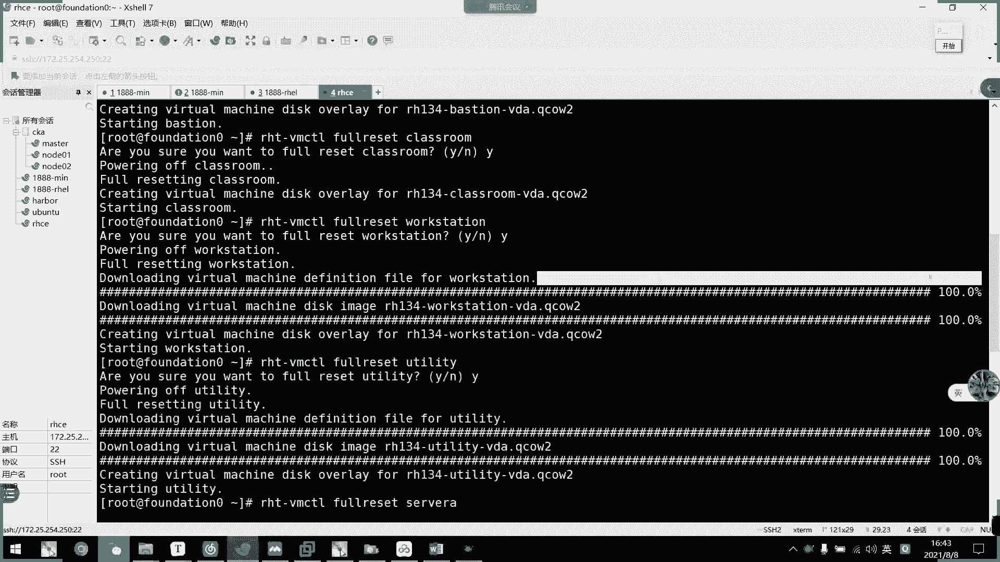

# 2021年7月新版-----RHCE8.2 RH124 RH134 RH294 认证课程 - P57：day10-6 课程环境使用以及容器介绍 - bili_15701050454 - BV1Gy4y1T7ug

好，那我们现在开始啊。那么呃由于后面呢我们从后同面开始呢，都需要需要用到我们这个官方提供的实验环境啊。所以我这边啊先给这个环境做一个介绍啊。首先我们开机。我写个文档。嗯。呃。官方学习。王静。啊。

我小小小小文他啊，所以我们开机啊，它有两个用户啊，有两个用户，一个是。啊，一个是我们的ro用户。啊，一个是我们的KIOSK啊两个用户。然后它这个密码呢。他个密码。密码加过密码密码。root密码呢是A。

Yes。哦，我我都忘记了。SILOV啊。F后这个。呃，怎么变？啊，讨厌它自动变大写这个东西。KOSK这个密码应该是。应该是不是等一下打？

我试一下是不是。

啊，4啊。不太。

呃，然后呢，不管你是用哪个用户进来以后啊，不管用哪个用户进来以后呢啊都可以操作的。估计我们先看IP啊呃我们IPA它网络里面比较复杂，我没有我们没有水果网桥，所以有多的东西我不说了啊，多的东西我不说。

所以我建议大家呃去找到一个地址啊，就这个呃B20。力啊，它是做了网桥的啊，通过我们的ENS啊，还有里面的一些。呃，虚拟网卡。因为它要连接到我们的1个KVM里面去啊，所以它主要的一个I呃主要的一个。

网卡设备啊是我们的BR里啊，然后这个地址是我们的一个。呃，连接用的地址啊叫172。25254。250啊。

我写一下啊。网卡设备。我们的B20。10，然后是地址。为192点要不。172点。25。254。25元。然后呢。建议。使用。进主机模式。然后是设置。作为。172点。25点。25。对。查。2是4。好。

我们来看一下怎么操作啊。

好，我们先右键设置。然后把它那个网络适配性啊。改成我们的计手机模式。交音模式。好，然后接着我们这里改这里。编辑。帮我们进手机。🎼的网道改一下。呃，感觉是。172。25。254。1。是。

好，然后我们试一下能不能人进来了啊。

叫做啊去。172。25。250。都是。

不。254。25。那我是不是写错了，刚才。

确认一下有没有写错。

啊，没有说2254。那我们试一下能不能连。哎，怎么名字没有保存下来？呃。好，能连上了啊能连上。然后这里呃。你们喜欢用root也可以用KLK也可以啊。这边就用录子吧，没关系的，它只是一个跳板机而已。

然后密码是ASILOV啊。选这来。也连进来了。

还是回到这里窗口。好有我们。这边。能不能改这里大小？我记得可以。能不能改这体大小？说服吗？给了我。不行。哦。不行。这个是编码而已。识睇毒系啫。这个是标题。vi里面吗？看一下。cl加啊。

可能加我刚才输输了都不行，不知道为什么。让我们这里往往小了跳。OK差不多了，就这样吧。好，OK那么啊我们进来以后呢啊，有一个命令。啊。叫做IT啊。We am。说了。我们先那个cat。DBCR群。不要。

RED吧。这一题。不是这个。发询。ST。这个。好，这个。我们要看贴到这个。

啊，输入命令。Cat。BPC。RHT。注意哪一类呢啊，注意哪里呢？

注意。哎，我没有截图工具啊。我登一下。我微信在这边登吧。왜。这张图。

好，我们要注意这个位置啊。

我们就这个位置啊，这个位置呢呃HT cross是我们的课程代码啊，课程代码要这边写一下啊，我们基础课程。有。嗯，而。呃。IHCSA。有两个基础。Does it mean。TRAQR。

12一是我们的HH124。啊，取席。I a are the mean。是我们的H。134。然后呢，我们这个二9是什么东西？我也是啊。I294。其实他这里写的这stem。呃，先生抚养，但是其实不是啊。

这是我们的。它命名是这样命名，其实它是我们的什么来着？RH。C啊visible。没。啊，就是S5。H9294。啊，三个菜代码三个代码啊，这个要记住啊。这个记住三个的答码。好，为什么要记住它呢？

因为我们不同的练习要在不同的课程环境做啊，比如是我们等一下啊。啊，往后要讲那个port man啊，我们就要切换到134啊效。切换到。对应的课程。

好。那么我们这里有一个命令啊，叫做RT。不是。Set。Coner。啊，然后这里直接输RH134啊。看到没。怎么是错误了，出现错误了呢？哦，我没关机算。好，现在这道情况不是了。这是开班前的邮件。

老师发给你们预习视频里面的工具里面有啊。好，切过来了，然后我们再K一下。EDC。呃，HT。是不是变成134了，对不对？

え不。

Set。什么命令来着？Xi。O， U R， S， E， C， U， R， E。

CO表8。然后4。有。HH134。啊，然后。这里要注意啊。需要。8。拟机都。关机后。才。后。再再切换。这是什么意思呢？我们等一下看啊。我们现在还不知道什么叫防水拟机。好，那么我们接下来看下一个命令啊。

下一个命令。

小售V。IT VMCTL。🤧嗯。要到我们这里。先不看这个。叫VIRTmanager。这是我们KVI数理器管理器啊。我们打开这个之后呢啊你可能。拿到环境以后啊，这里什么都没有的，你可能拿到环境以后。

这里什么都没有啊，一个虚拟记录没有的。但是我们啊要开这个确认一下有什么机器。

到时候呃你们启动完毕以后呢，它都会有这个的啊，它都会有这个这些这些个虚拟机啊，这些个虚拟机啊，只要你启动过，它就有了。好，我们先把这个图截一下啊。记住啊，不要问了，后面。

啊，我讲过了，不要后面又问了，为什么说你这里空了空了这样子啊。

如果。我等一下再重新共享一遍吧，因为这个不是我共享的。我整理过，但是。他们共享给你的是另一个东西我就不管。

这个命令。落主啊。查看。虚拟机管理器。就VRT。没女据。好，那么。我们怎么管理这个机器呢？首先我们要初始化啊初始化。

那个名字叫什么呢？在这边开了，我现在啊。好。呃，我们有一个名女叫RHT。VMCTL然后呢看一下，好像可以tus吧。啊，对。啊，这里可以列出我们的一些虚例题啊。是我们这个mini可以控制的虚拟机啊。

默认控制的虚拟机啊。但是也可以通过手手动指听啊，我们有多少个碎据机，一个是呃brareasstorm。一个是work stationation啊，一个是unitityity啊，有个是 HB。

然后还有设备C设备D，还有一个叫做class room的机器啊。这个是用RHVN做的啊，RHVN。是红帽自己的KVM风作版本啊。好，然后我们TVMCTL好foot。注意啊fo reset。有喽。

我们用这个命令去重置的时候呢，我建议大家。一个一个去做啊。啊，除非你性能可以啊，16G的话没问题啊，我们先从这它开始啊，这个b呃b啊。它是提供我们的一个。啊，在环境里面的一个软路由啊。所以是提供网络的。

所以我们先从网络着手。那重启后可以把机器拉起来了，应该我们开一始啊，你看拉起来了，对不对？拉起来了。

啊，然后我建议大家切换块钱以后呢，也重置一下class5啊。啊，你重新一下，他这里没有，但是我们要手动去重置一下classroom。其实第一步应该先重置我们的开斯路。

也充止了是吧？

有没有再重置耶。

好垃圾啊，这个八的虚拟话。怎么跳不过去这里。

完了。好，我们继续啊。继续我们是重置我们的workert。work克的这呢是我们的工作站啊，基本上呃后面。的操作都是从我们克work克斯出去做的。

我们Sible的时候就常用work啊呃那个R。

我们前面这10天学的基础啊，可以不用work station啊。好，然后unitity啊unityity这个是提供我们的一个。容器仓库的啊。呃。我们除了切换课程以后，要呃要要要要要这样子付一下。

平常我不建议大家付一下啊，因为付一下的话，它时间比较久，我们有一个命令直接一下就可以了，可以一下。

复一下是我们这些切换课程啊，要让它完全重置的情况下才用复一下。

要就收为。

就是收据。那我们134切换过来以后呢，这些机器都。呃，重置完了，等他我们开起来就可以。C1的话在294才有的。

啊，全都这样子，好垃圾呀。我们看时龙开起来了。

啊，不系统也看起来了。但如果注意到呃，像这样子，它一直卡在这里不跳动的话呢，啊我们拼一下通不通，如果痛了的话就。

没所谓啊，通过的话直接SSHH不影响的，不影响我们练习的。

对看这个有有内点里已经开启来了。

嗰个 station 也开始来了。就等这两台了。啊，注意顺序啊。

我们先关机。好。然后呢呃切换课程后。重置环境。HT。We have CL foot。Was set。说了。先给你们看一下环境里面有多少台机器啊。放在写在前面吧，好吧。写在这里吧。环境。共有。

OK12345678。虚拟机。然后是分别是classroom。提供课程。软件。仓。嗯。搅棍等。啊，然后是brasto。这个是。提供。黄金内部。然后是UT。

优品这个不会拼啊，好尴尬呀。

U T， I， L， I， T， Y。提供容器仓库。啊，所以啊。54134。不需要开。好要是 worker station。我有红的跳舞。工作。好像是s。被。S。B。怎么。那怎么把我这个AB删掉？嗯。

为什么呢？工作节点。工作节点。要s。嗯。他这动修正的。BST。不是空白机器，会还原成原来那个。BST吗。也也是工作节点啊。还有1个42B。也是工作结段。回到它这个环境的一个初始状态啊。

他目前的话已经是一个处处理状态了啊，就是说。呃，红帽做好这个环境以后，打包成的相相当于是最后一个坏照吧啊相当于是最后一个坏照。

呃，差不多。这么多个4个过去也得好，然后呢。嗯。294用吧。这个也是啊，我只是用的。啊，所以说不是2级4不需要开啊，我们啊目前的话要用这个4路报达12345678。好，然后付一下。嗯。可以是哦啊。

直接全部啊。直接。全部。不包括。克速。需要。这。就要手动。视频。投资。好。然后呢呃手动单一重置。是实。所以是我们的class。荣ong。然是。Best term。

然后是我们的worker station。显是有那给你们。オステーショ？表示s。ABCD没有顺序啊。诶。怎么又自动修复了？真的是。这不自动停止更踪了吗？好像未用过。Sui。可以。CB。

这几几个数据随意啊，这几个数据随意。好。然后啊。嗯。非。切换环境。或。环境底层问题没。底层没问题。对。情况下不建议。使用复一线。We。建议。使用意色。尾赛的话呢相当于是一个小坏照啊，它呃速度比较快。

它不会我们刚刚那个副雨赛啊。

他直接把那个盘啊。

那我也看到他直接把这个硬盘都重新给。

加载过就就相当于是把盘都全新了。但是于次的话，他就把那个。真的像快照一样，把它回对到呃那个。那个那个样子而已啊，它不会那么久就会快一点。但是如果是机器底层出了问题呢。我们就用付一下啊啊。

这个环境很垃圾的。所以呃有时候它出现一些问题，我们只能用付一下。

就收一上。嗯，基本上没有什么。东西了吧。

好像没有什么东西了。然后呢，如果要连过去的话，我们用SSH就可以了。

他们做了做好了解析的啊，就是说啊WYKSTAT。做好了解析的。直接连过就可以了。好。基本上他的操作没什么好讲的。操作没想好讲噶。我保存一下，等一下发给你。有没有补充的啊，前面上的课的同学们。

你们觉得有没有什么要补充的呢？嗯。好，上面有什么要补充的吧，对不对？啊，海龙，你觉得有没有什么需要补充的海龙？我觉得差不多了。

好，那我们。等一下发给你们。然后继续看我们。

这节课啊。剩下15分钟我们了解一下什么叫勇气吧啊。好。融进虚拟化技术啊，我们这一。将主要讲述的是port man这个容器虚拟化引擎啊啊，但是我们容器。刚刚不是说了吗？直接重置就可以了。

刚刚我在视频上说了，大家。我说如果他什么都没有的话，我们直接做重置啊，然后他就会把它给拉出来了。拉出来以后呢啊我这里讲过了，如果你们后面再问的话，我就不回答了啊。嘿嘿好。😊，容器。啊。

容器这个东西呢其实。啊，并不是与我们的port man有关啊啊，不是这个概念不是跟我们pot man有关啊，也不是这个工具的，它它容器是大众化的东西啊，然后我们P man只是一个启动容器啊。

或者是创建容器的一个工具啊。然后我们学容器跨技术的时候呢，我们先要了解一下什么叫容器啊，容器啊，英文叫做container啊，container。然后呢。它就是啊指我们生活中可以用它装东西的工具。

例如是。箱子啊、碗啊、杯子啊这些。啊，都是我们所谓的勇气。是方便于人类归纳、放置物品存储，还有异地运输。就比如人类使用的衣柜、行李箱、背包等都可以成为容器。那么这个概念。呃，就就就有人把这个概念。

搞成是我们的一个用器虚拟化技术啊，他就这样想，他就把一个。啊，这这样子呃。构想出来，就是说我一个。模拟出一个箱子。啊，然后把我们的系统底层存到里面去。What always imagine。好。

然后呢下面再加一层。可录。啊，不是。嗯。APP啊 app stationation应用。陈en。好，然后在前上面下再加一些什么呃文件之料。它这个应用层呢可以说是一也可以是2。

两个是互相依赖的啊啊不是说两个互相依赖，是应该说AB241依赖APP1啊。好，把它们放在一个箱子里面，然后把它给封装起来。有后了。我们的真正的系统。可能。啊。把容器跑在上面，然后我这里还有一个容器。

容气。勇气。他们都。啊，跑着不同的应用啊，跑着不同的应用。可能它这个几个A image打起来以后啊，封装到里面去以后，它其实是执行了一个engs啊。啊，这里可能是执行了一个tonkeyR。啊。

或者这里是做了我们的服务器啊啊呃呃数据库啊啊，这个是跑了我们阿巴奇亚。HTTB。跌对不对？有了。他们之间是互相隔离的啊互相隔离的。啊，没有说。呃，有什么依赖？他们唯一的。共同支处就是共享一个内核。

共享一个内容。然后我们是不是可以把这颗楼当成是我们的这个。啊，游轮啊，货轮货轮一样，然了这些打包成容器的，就好像一个集装箱。然后我们集装箱搭在游轮下面整整齐齐的啊，然后我们就可以出海。发晕了，对不对？

这就是我们一个勇气的概念啊，为什么要有勇气？为是会有勇气啊，让他们啊按照一定的规格存放到我们的。集2商里面，然后集1商搭载在我们。科楼的这个大货轮里面共同运行又互相隔离啊。

我们箱子与箱子之间啊是不是有隔离啊，你的东西不会丢到我身子里，我的东西也不会丢到你的身里，对不对？啊，所以说我们这个容器的概念啊。那我继续往下看。奇奇怪状啊，其实没所谓啊。所以呢。呃。

容器它只是一个通用概念。那么如果我们要执行。要。要要么让他们装在我们的船上面。我们有不同的工具把它给放进去，对不对？比如说我们。容器化的一个龙头docker。或者是我们等一下要学的。啊。

我们等一下要学的或面。啊，或者是其他的什么RKT啊啊proach啊啊之类的。如果他们想要使用这个容器，那么他们是不是需要把容器做一个规范化，还有标准化啊，所以呢后面。这些大佬啊这些大佬。

成立了一个叫做open container的一个主机组织啊，叫做OCI啊，然后呢，它这里。实实现了我们这个容器标准化啊以及规范化啊，由OCI发布了两个规范，一个是win space。

一个是imagage from space啊。有了这两个规范啊，我们不同的工具，不同工具啊，比如说portman啊，比如我们docker啊都能。只要他这个容器遵守了这两个规范。

我无论用dooc还是 program面，我都能执行啊运行这一个容器。好。完转间用这两个回放就可以了。然后呢，而且还确保了我们的一个容器的可移植性，还有互相操作性。好。

然呢我们看一下什么叫容器运行时啊啊容器运行时是真正运行容容器的地方啊。因此，为了不同的一个运行不同容器。运行时需要和操作系统内核紧密合作。互相再支持，然后以便我们的一个容器提供相应的运行环境。

目前主流的三种云云器意术是啊有什么呢？有我们的L叉C啊，这是。比docker还要早期的一个用器运啊。啊，不是不是比多卡还早。😊，do德是调用它的啊啊这是调用它的啊。

首先是docker是用这个L17作为套的呃一个邮机运势。然后后面呢。都可以就换成我们的RUMC啊，现在大多数都是用我们的winC的啊，都是用我们的winC。啊，我是遵守我们OCI规范啊。

因因此也可以建用我们的L加C。还后是RKT，这是我们sles的啊sles的一个ren啊。啊，也符合我们的OCI规范啊，所以这个RKTrun time呢也可以运行docker的勇气啊。啊。

这个了解一下可以了。永金时我们都不需要啊去更改它什么之类的。我们也不用做选择。对啊，目前听到的都是docker啊。好，那么我我们这里看一下啊什么叫putman啊。

put man就是port manager to。啊改个名字啊，都要跟我们K80给。更加轻啊更加轻。因为我们啊在容器编排技术上面呢哈。呃，平台啊不是记住啊，在容器编排平台上面呢。

比如说我们现在比较火的cole let啊，还有。呃，红帽自行的open shift啊啊他们。最小的单位是破的啊，你看最小的单位是破的。你看我们的po里面多么亲他啊，名字都以他来来改，对不对？破，然后呢。

在这些编排平台上面呢。或者是一个po里面可以跑很多个coner啊啊，这个了解一下就可以了。我们目前的话呢，put man还有docker啊，作为一个启动引擎，他们都是呃一个镜像启动一个。肯定的啊。好。

但是。吃。从名字上呢就看到他们很亲密，但是实际上是什么呢？啊，功能上来说啊，pro特曼简直就是啊docker的一个别名而已啊啊docker的别名而已。呃。

他们认为呢我们port man呢在不久的将来可以取代docker。他们认为要演。好。还有port man呢是为了co而生的一个太源容器管理工具啊。呃，原来是呃RCIO这个接口。啊，预行时结果啊啊。啊。

C。运行时接口CRI啊，还有开放容器计划啊OCI。然后项目的一部分。后来被分离成一个单独的项目，叫做啊me呃 live pro。Po裤。然后它大多数在linux的平台上面使用啊。

它是一种没有锁护进程的一个容件引擎啊啊，所以它直接是靠我们的win呃。呃，叫什么？啊，肯定的地产就可以启用起来了。然后呢用。用于在linux上开发。

管理和运行任何符合我们的OCI标准的一个容器和有容器镜像。啊，put man提供了一个与docker兼用的命令行前端啊，port man里面的百分87%的指令都跟我们的一个do可啊可能是相同的。

所以呢啊portd man也可以使使用的库也是docker的一部分啊。就是他啊。没有使用我们do的库啊。好，所以说他。经常被网上的人戏称啊啊，port面就是docker的一个边名啊。

但是我们docker需要提供一个首护精神。破的面不需要锁扶进去啊，它是无无锁库的一个。呃。用计划技术啊。而且它可以把一个容器单独作为一个服务啊。到到后面我们会讲到这个容器及服务技术。好。

然后这里就是我们那个容器与虚拟机主机之间的关系啊。我翻到卡页。伐木得。我就觉得我的解问题。好，我们看一下这个图啊啊，这就是我们一个虚拟机与我们容器的一个比较啊。啊，首先他这个图。呃。

这是我们的一个比较传统的。啊，就是没有用虚拟化的平台。然后这里是用我们虚拟主机的平台啊，然后这是用我们的一个勇气的平台啊，我们可以看一下啊，传统我们就是底层物理。硬件，然后在上面装一个呃操作系统。

然后经过系统以后，就是我们的用户空间啊。就像我这台电脑啊，就像我现在现在这台电脑啊，没有用VM的情况下，我操作这台电脑，就是我们的一个user space啊。啊，系统没被隔离啊，然后是。呃。

传统的虚拟化技术。啊，由我们的底层硬件提供，再安装上一个手手机手机里面呢啊装上了1个VM word，对不对啊，装上个VN wordVM里面呢啊又装了两个操作系统。然后系统之间是隔离的啊。

系统之间是隔离的，对不对？我的精争影响不到你，你的精神影响不了我。好，然后最后是我们的容气化，容气更简大啊，就是一个物理底层加物理主机。然后呢，通过我们的con地。执行。我们的勇气。他们是不同的APP。

啊，不能APP，但是他们共享一个内核啊，共享一个内核。好写嗰啲。啊，这个我就不多说介绍了啊，所以呢传统虚拟机是虚拟出一个主机硬件，并且运行一个完整的操作系统，完成操作系统啊。

然后在这个系统上安装和运行软件。然后容器内的应用啊，直接运行在数数机的一个内核之上，容器并没有自己的内核啊，也不需要虚拟硬件，所以很轻量化啊，轻量化。然后每个容器间是相互隔离的。

每个容器内都有一个属于自己的独立文件系统啊，独立的竞争空间、网络空间、用户空间等。所以在同一个手机上，多个容器之间彼此。不相互影响。啊，所以是勇气间相互隔离。但是他们又共享一个内核啊，就好像。啊。

你可以这样想，每个容器是一个静枕啊，一个容器是一个静枕就可以了。然后是我们的一个呃容器和虚拟机一个表现。对比较啊，首先VN就是呃虚拟OS嘛，对不对？要是我们的docker，这是我们的conter嘛。

呢个。啊，大小。我们一个镜吓都几居，对不对？然后我们。我们一个IS手，这样子二手。然后我们的容器呢，它一个im。啊，最小的有一兆左右的。然后深透石的那个系统镜像呢可能是200多兆啊，所以它算是比较大的。

所以很少人会用它用它来做镜像的，用它来做我们底层镜像的，要是速度比较啊啊。这个慢成乌龟啊，这个是快成。肥料。然后用户体验啊，这个用着升起啊，这个感觉很棒，对不对？他们一个比较啊，然后资源利用啊。

资源利用率更高啊，开销更小，然后不需要单独。不需要启动单独的虚拟机OS内核占用硬件资源可以。呃，可以将服务器性能压榨到极致啊，血机一般。都会有5到百呃5%到20%的一个损耗啊，容器运行基本没有损耗。

所以生产中一台物理机只能运行十几个虚拟机，但是可以运行数百个容器啊，所东。然后呢启动速度更加快啊，可以在数秒之内完成啊。所以所以我们这里是非两一样啊，然后占的空间更小。刚刚说了。

它张用的磁房空间是MB1单位的，然后税计镜像都是GB每个单位，对不对？好，然后提成性更好。然后呢，他。可以与我们的CICD技术结合。啊，它的一个亲和性更好。啊。

这个我们到时候呃你们到时候有有有要学co的话，你们就知道了。然后实现打包镜像发布测试一键运行啊。已经。啊，做到自动化并快速部署管理，实现高效的开发生命周期啊。因为我们J啊啊CID工具啊Jck。

那么我容器的介绍就到这里，然后我们今天也讲到这里吧。或怎面样的一个使用，我们下一周继续介绍啊。那我们今天的课就上到这里啊。

