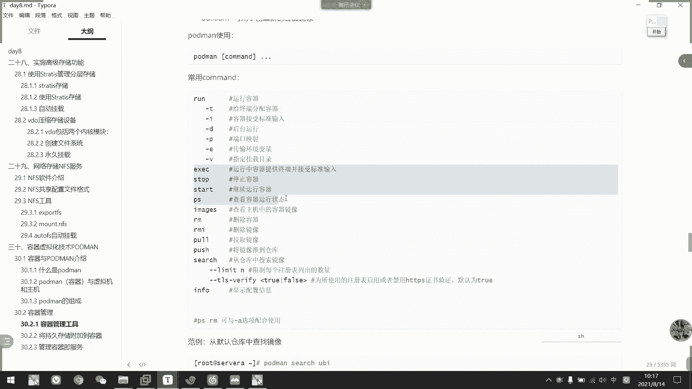
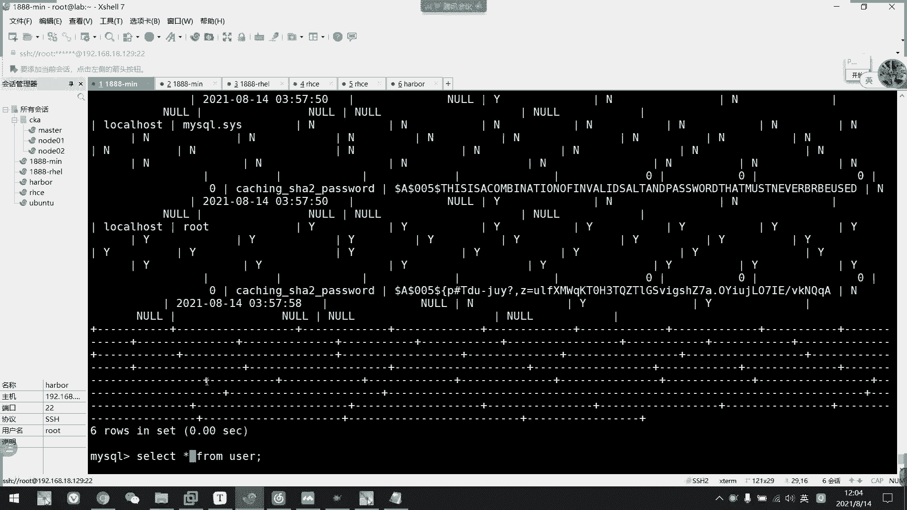
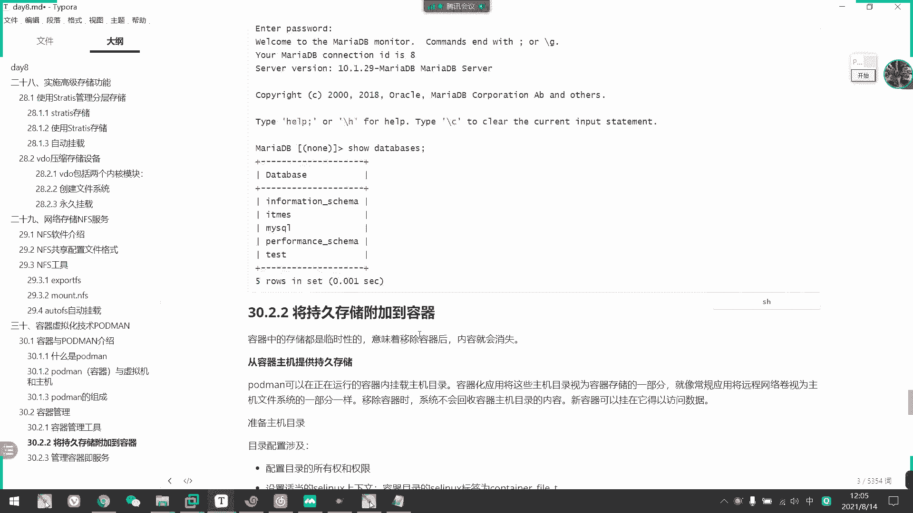
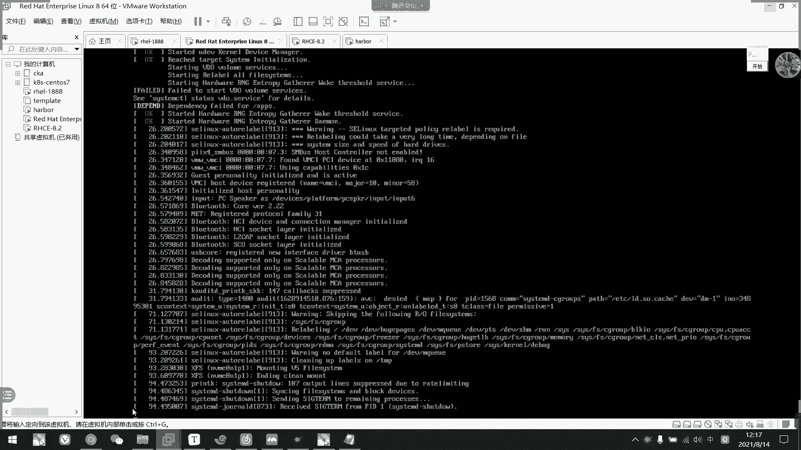
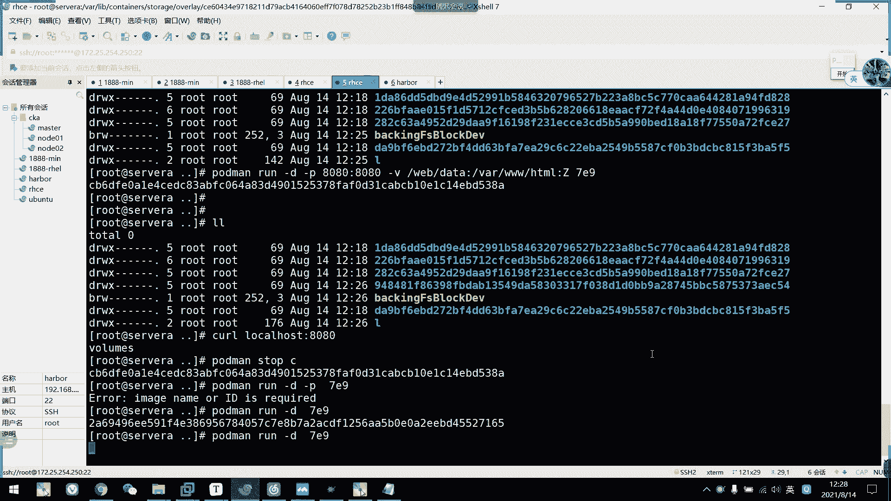

# 2021年7月新版-----RHCE8.2 RH124 RH134 RH294 认证课程 - P58：day11-1 podman运行容器 - bili_15701050454 - BV1Gy4y1T7ug

啊，高要设的设备啊，一个是structs啊，一个是video刷s啊是嗯。类似于。功能。类似于LVM。但需要。Shor thisす。提供首术进程。🤧咳。嗯，那么他是怎么做到的呢？啊，首先是将。

那个叫什么物理。食盘。或者是分区。添加到10。然后从时尚。啊，然后从池。呃。抽出部分。创建文件系统。嗯。要不我看一下。怎么做啊tras。Cate。wo。啊，然后是我们的。物理实拍。也不好意思吧。

Dice。啊，然后是。忽略。然后是。扩展。或者。Truckies。然后是。这个表是。Devicice啊。我记得不是那么ad，好像还有一个字母。你记清楚了。嗯，扩展是看下。呃A data。好。

然后是创建池哦，不不对不对不对。创建文件是吧。啊，就是tras。Great。File。System。嗯。要是酷。然后是我们的flow system内。这个改一下。扣这个。啊，然后是。关于。

文件系统的挂载啊。啊，主要是我们的一个永久挂载。🤧嗯。啊，就是说啊。写在。E t c。FStable下的。嗯。😊，首先是我们的一个。Fl system。的 VID。啊，然后是挂在点。

接在选项是beford。啊，然后的话也加一个啊X。シスト？第一。Yeah required。等于什么？Tuppies。然后是。不备份不自检啊。接下来是我们的vio啊vio。有。两大。模块。提高。压缩。

去求。呃，一个是K videoO。又是哪个，我又忘了。C什么？嗯。UDS啊。也是U点S。啊。那么啊我们创建。Video jack。这格式什么呢？GDO。Great。刚刚那。等于VDO令。但是杠杠。

Devicice。是不是？啊，是我们的物理子谈。然后是刚刚。我这个。Roz。Size。啊，逻辑大小。看一下有没有问题啊，device，我觉得dice这里好像没那么短。你咗。啊，没错啊。没错。

好像是哦还有一个video logical size啊。有时候没那么短，那里很奇怪呀，感觉。O so videode knowledgeical size啊，就逻辑大小。好。啊，然后是。创建。

选择文件系统。那么就MKFS。嗯。插FS。然后是我们要加杠K选项，让它换个返回啊。🤧嗯。然后是我们的。它的一个log。应该是Vdeo link。He。那么挂载。也是19挂载啊，然后是会写在我们的ETC。

拜不te我下啊。怎么写？也是我们的一个。可以用入ID啊，也可以直接用这个。但是我觉得还是用录入ID吧。有ID然后是ma坏。然后是。选项啊。No X system。D。对。The price。等于VD。

然后是不非粉不质检。🎼好，回头差不多这2块差不多就是这样啊。看下有没有问题。然后查看那些自己回去看笔记啊。嗯。杠K应该是打血。그 다시。不在。🎼看下没问题。

system D requiress video service啊，勾享了service。都要写取啊。啊，O。啊，那么我们还有啊。减速了。🎼简单介绍了。勇气。相翻的。内容。嗯。🎼这里就不看不惑开讲了。

就只做了介绍啊，没有什么要回顾的知识啊。好了，那我们继续往下看。上周的内容。🎼啊，我们上周呢就介绍到啊我们的一个容器与虚拟机。🎼之间的一个区别，还有他们之间的关系啊。

那我们接下来呢就看一下我们啊正课要学的。工具啊就是说我们的一个容器引擎。后的面。嗯。看到没有？那我们先看一下它的组成啊，首先是啊hosice啊，就是我们的一个物理机或者是虚拟机，就是它这个底层的数架。

啊，这个机器呢是用于运行容器的啊，也称为是我们的输主机，然后是热节点。啊，然后是仓库啊，re取就用于保存镜像的仓库。然后呢，我们这边的话官方仓库有哪两个了啊，一个是wehead点IO。

然后还有一个叫做visconect we点com。然后他现在默认的。虽然说逐渐淘，但是他默认使用的还是这个GHS点com，稍等一下开下啊，然后是是有仓库啊，可以是自己搭建的仓库。但是我们的这个不讲啊。

这个我们一般用哈ber去搭就可以了，或者是直接从阿里云那边申请一个呃免费的仓库就行了。啊，然后是imagine啊，我们说镜像，然后镜像呢可以理解为创建实力使用的模板。啊。

相当于是我们BN或者是第一B包啊。然后它的一个标签呢是我们的一个仓库名称，然后加用户名称，然后是我们的一个镜像名称，加它的标签。Mahata。啊，这个有点。需以我们等一下再往下看。啊。

所以是我们那个枪关名称。啊，就是我们那个存有镜上的。啊，注册表其实就是我们的常国，它只是呃我们的课本，我们的课本它翻译过来，要么具体翻译过来，就翻译成注册表而已，其实它是仓库的意思啊。

I要是通常是仓库的1个FQDI啊，完全先定域域名。啊，然后是优是内。啊，us是令就是说我们那个新下所属的一个用户主机主主机。组织吧。组织啊是ag link啊email link啊。

是在我们这个用户命名空间中必须唯一啊。就是我们的一个t啊，是标识我们镜像的版本啊，就是如果镜像名称不包含镜像标签，那么就假定为latice啊，就最新的最新的。啊，然后是最后它的组成是我们的肯定的容器啊。

容器是从我们镜像生成对外提供的一个。或者是一组服务啊，相当于是RPM包的一个容器呃呃RPRPM包中的一个程序运行起来。呃，这个镜像呢如果是自己做的话呢，它可以部署很多个应用。

但是我们一般都不会在里面部署太的应用，除非它是有一个依赖关系啊。比如说我们的一个top票，还有JDK啊，它才会部署在一起啊。一般来说啊。因为我们。有一个宗旨叫什么呢？就容器啊尽量小，容器尽量小。

不要太大。因为他啊过了100兆，觉得他是大的一个金山了。还后是关于我们这个镜像的管理啊，我们镜像有两种的运行方式，一种是由我们的一个wordot用户直接运行，一种是由我们的一个普通用户身份运行啊。

他们两者之间是有区别的啊啊，如果是root用户运行的话呢，它。执行起来就有。对系统的一个完成操作权限。啊，然后呢还可以使用到里面的1个1024端口以下的啊以下的端口啊，所以是不安全的。

就反控方面也不安全。啊，然后呢是我们的非特权用户运行容器的话呢啊就会成为我们的一个road next容器啊。这个容器呢啊是无法使用DV1024的端口的。啊，所以我们那个roness啊是更加安全的啊。

就是用普通用户去执行支笔安全啊。啊，那么我们看一下，就关于我们那个容器管理工具啊啊容器管理工具。然后呢，它从我们这边提供的话呢啊其实它工具啊是port man啊，但是从8以后它有了一个模块流的部分嘛。

所以呢它会把它们集合在这个工具上面啊，叫做肯entto啊。我们来看一下啊，目前的话呢我这个啊还是用。

啊，我先还是用我们的一个镜像那，就是说啊ISOISO的一个自己装的一个系统来看一下啊那我先在挂着。看下不有刮展。啊，没发展。不事。让我们来看一下。model。B历。还有我们的盆田的。Toth。啊。

你看这个就是我们的一个容器的模块流。然后呢，如果要装的话，我们就啊把它装上就可以了。我们可以看一下这里目前。还没看到版本。啊，有这里啊，这里可以注意到我们的玻璃面版本呢是1。6。4的。哎这点是。

然后同时也开一下这个字器啊。嗯。😊，啊，问年到134。然后我们那个开机。I后依赖排yon3。02点四。啊。我们先都等这边开机。嗯，这就可以看到啊。刚刚我们做的版本的确是我们的1个1。6。4啊。啊。

这个真的。我们先连过去设为，然后我们这边也看一下。啊，这里看不出它那个不等面版本。那我们直接装了吧。🤧。Okay죠。哎，也是1。0。4啊。奇怪呀。等一下。按错了。对。啊，这里要提一下我们。

这个虚拟机里面的所有机器啊，它的stuuddent用户的密码都是studden，上次忘记说了。st用户的密码都是s。来，我们看始下它的插壶。嗯。看一下。没问题啊。为什么是。1。6。4。有点事。奇과。

算以我们先往下等一下要更新的时候再跟大家讲。

好，那么我们先看到这里用1。6。4的。目前的话还没有问题啊，只是我们讲到容器器服务的时候，它版本就过低就做不了啊。但是我们啊在这个课本的面上呢，它啊。在这个环境下呢，它有一个脚本的啊，它有个脚本的。

我们到时候le一下，它呃换载到镜像里面呢，它就可以更新这个版本了。我说我们能先。啊，用1。6。4继续往下线。我们先看一下啊。呃。东西快工具啊，刚刚说了一个是port man啊，一个是还没啊。

后面呢两个还没讲，一个是我们的。有的。一个是。s you啊。这个是用于检查复制、删除和修镜像的。其实这个用的不多，因为也不会看。还还不如去我们的一个。哎去去去去去。自己做一个。因为它这个呢用于检查啊。

常用于检查我们从docker墙部下下来的，看一下这个镜像是否借用于我们的一个putm啊，能能不能能不能正常运行啊，看一下它是不是啊一一样的1个OCR标准，然后。跟我们的一个库面是否兼容？

用于检查这一个的。好，我们看一下关于put man的一个使用啊，put man使用。嗯，首以我们分几个部分吧啊，一个是。执行啊运行我们的容器啊，然后是停止容器啊。然后呢停止后继续运行。嗯。

然后是删除容器，还有删除上除镜像啊，删除容器啊，删除镜像，还有拉取镜像，还有。推。接下推荐价这可能讲不到，因因为没有穿库。啊，然后一个搜索镜像啊，搜索镜像的话，这个是通用的。嗯。我们先从运气容器开始啊。

啊吧，先从搜索容器开始啊，因为我们不搜索也没有容器镜像在这里啊，也没有容器镜像镜像在这里。那么怎么做呢？

啊，我们可以用。做怎么样？设置啊这个UBI。呃，基本上是一样啊。唯一不同的话，那就是没有一个首付进程。然后呢，他也可以给每个游由器自己做一个相关的一个进成管理。L妈。好，说说好。

然后我们可以看到这些都是我们的一个啊。各位，加关注这里啊，就是说。呃，off啊就是官方啊，就是说这些下面的全都是官方的竞箱。然后我们。他跟都很不一样，可能有有点很很少人用啊很少人用。呃，如果人多的话呢。

啊，他可能会对绩效有评价。我们又如过多口的同学都知道他应该是大啊，所以说我们的一个呃用户的点赞数啊。那么我们不管了，就直接先拉取一个。拿个八的吧，拿个8的。好，啦，我们用hold man。

库然后加我们刚刚复制的啊，刚刚说了也是仓库的FQDN，然后是用户啊，然后是我们镜像。然后呢，后面不加他给啊，就是我们没有后后面的他给啊。他默认就是拉取最新的啊。啊，我们扑一下。

它就会自动啊这样子往下拉下来。🤧。好。然后呢我们来看一下。嗯。不的呗。你咩就。啊，这也是可以看到我们刚刚拉群。所以这些镜像呢。作为容器的基础金算的话呢，很少人用的。为什么因为差太大了。啊，在我们。呃。

多cker的项目上面呢，它有几个底层镜像挺好的啊，一个叫做呃apply啊，一个叫做我们的一个B boss啊，这些都是比较常用于做一个容容器的一个底层镜像的啊。啊，但是这个题外话就不说。

因为我们这个课程上面呢啊也没有讲述说啊，去做一个呃镜像。就简单提到了一个关于容器的增善改查。啊，不是现在感觉就是真相和运行啊，还要执行啊，然后。还有把它一个容器作为我们的一个所谓进程啊，让它开自启。好。

那后我们可以看到红包这个啊是不合格的啊，勇气底现镜下啊，要我们看一下能不能执行。不准备。Right。然后是我们的一个。UBI。对虽然这样子看。他好像是执行的，然后我们看一下啊ho map。우问。啊。

我们PSS啊可以看到我们的一个关于容器的进程啊，我们看一下。在这里什么显示都没有，要我们加一个杠A呢，它就可以显示出所有啊。啊，我们等一下看到怪入标应该是一个is状态的，这个退游状态啊，我们来看一下。

看到没？然后是退出的，然后状态为0。啊，是25秒之前执行过啊。这为什么执行不了了？是因为我它是一个底镜像，它没有一个就是他这个镜像啊。没有一个。可以执行的前端程序啊，如果没有的话呢，它。

🎼交给我们不man以后。🤧嗯。他这个程序啊没有一个前台程序啊。前台。啊，占用前台就好像我们挑杠F那种叫做呃占用前台的程序嘛，对不对？🤧咳。他没有啊，所以说他。通过。immagine啊。

要我们的或者或者没有跑。跑跑完以后呢，它是运行一遍了啊，就直接退出。这是ID啊，直接退出。🤧咳。就啊虽然我们prob的确是运行了，但是他退出，因为它没有一个啊前台进程，让它保留在这里啊。好。

然后我们继续看一下。看到没有？我们搜一个叫HCV。还下有没有？这外国的仓库好慢啊。我们执行一个。七百蚊。呃，不是这样说，目前我没有配置过，他肯定是默认的啊。呃，下个啊下下这个吧。啊，它是UBI8底层的。

我们看一下。嗯。😊，喝者卖了。好，我们也追到。呃，他这个意思虽然他这个是用户组织啊，但是UVI8的话啊，说明他这个是用UBI8，就是我们的re8的版本。镜下作为底层做出了1个HTAD的一个。嗯。嗯。

定下。要到这个镜像的主要执行的啊。主要是运行的是我们的一个网络服务啊。啊，么啊叫做叫做weber服务啊。太大，然后他拉底层镜像60多兆。还没有下面还有。提出。

嗯。

要整合在一起的，搞定了哎，我们还是pro map image。啊，可以看到多了一个镜角。好，然后我们来看一下port man。不。啊，然后就是啊我们这个镜像哦。这里的话我们用他的ID去执行啊。

我们直接选择三位等ID就可以了。859。让他执行了。啊，然后是占用了我们的前端啊，他占用了我们前端，然后我们。多开一个吧。通画有要规以画去查看一下啊。然后我们来看一下啊DS杠A。喝的咩。Yes。系呀。

那我们这边。啊，那我们这边。啊，可以看到它执行起来了。啊，首先我们这里可以看到了，这就是我刚才说的，他要执行的一个前端前台程序。啊，前台进程。然后这里是它的一个开机的一个时间啊，就21秒的前。

后它这状态啊tus呃，要是状态是起来了的。呃，然后我们这边还有一个lims啊，就是它的一个啊容器名称。嗯。那么这里才是我们的一个。定下来名称，然后我们这个ORTS感觉肯定的ID哦，我看错了，不好意思。

这个是下下一行的。这个是下一个啊，就说什么po那个啊，就是它的一个呃暴露的端口的名称嘛，应该是。然后我们第一个要注意的是肯定的D啊，肯定的ID啊肯定ID啊，这是它的一个容器的ID啊，容器的ID然后呢。

我们也不用关注那么长的，像刚才镜镜镜像一样，我们来关注它前三位就可以了啊。这个叫做它是个短ID啊，这个是唯一的啊这个是唯一的。所以我们每一次执行，它都会改更改这一个就相当于是一个新的容器啊，新的容器。

啊，但是如果这个没有停的话呢，它继续执行起来呢，它不会有重复的。啊。啊，然后第二个是镜像，这个是镜像。然后命令刚才啊状态那些都已经讲过了啊。要他。需要有前台进程。啊，他需要有钱的精神，然后呢。他也能。

保证执行状态啊，保持运行状态不退出啊，但是它占用了我们的终端啊，但是他占用了我们的终端，那么我们怎么办呢？可口区。啊，我们先退出啊，你看一退出，我们看一下这里。啊，没有问题。好了。

他这里就变成我们的一个。退进去啦。我们把前台退出了，它就退出了。但是他又占用了我们的前端。我们说了容器，它的方便的数就是可以在一个数据上部署多容器啊，我没理由。每执行一个容器啊，都打开一个终端。

然后让他执行，对不对？给你用了吧啊，那我们可以看下一个选项啊，就是杠低啊，让它去从后台执行啊。我怎么样？word降低。嗯，我们这里起个名字啊，叫做we一吧。啊，然后镜像是。有没有人记得是不是859啊？

不是859。啊。包走了，然后是那个。做怎么。Yes got it。你别退出。诶不래。怎么是退殊呢？5秒前。执行不起来呢。

等一下。给他一个名字不行吗？Lqu。这是进入的。执行没问题，但是我怎么给不了他名称呢？是可以低于容器名的呀。

哦。不行，他不是K80，我也是。啊，然后我们来运行一下。CS是859。让我看一下。嗯他目前的话就运行起来了。We话这语。啊，然后我们啊。可以看到啊。他也没有占用我们的前端啊。

但是它的确是在后台运行状态啊啊，所以我们加杠低杠低的意思就是啊后台执行啊，后台执行。发这些。好，那么我们想。让他。执行的时候呢，就金入容器让我们啊去运行它啊那怎么怎么做呢？啊，就是说。

hold man run啊，然后我们杠T杠I啊，什么意思呢？🎼T啊就是啊给容器提供一个终端啊，做一个虚拟终端出来。I的话呢是交互的意思啊，交互的意思。然后我们再执行镜下啊发过去。需要加个命令吗？

我们加个冰bsh啊。我们目前的话呢啊就进入到我们的一个容器里面啊啊进入到容器里面。然后呢它这个前台进程了，它就不会运行了啊，相当于是被替代。别厉害了，然后我们进到这里来的话呢，看一下。啊。

看一下他有没有。那个大0啊。多了啊。好，我们可以看到。啊，这是我们容器里面的。他说这个文件。啊，然后我们。这是我们。🎼数机里面的文件。那么我们对比可以看到。

啊，这样对比。啊，就可以看出。容器。跟我们数机里面的文件是。下过隔离了。啊，是相互隔离啊，它有自己的一个文件系统啊，我们有我们自己的文件系统啊，相互隔离的啊。然后我们退出。就是他的word是他的啊。

我的word是我的。然后我的阿帕奇是我自己的，然后你的阿帕奇是你自己的啊，是由自己自己的。啊，所以呢我们在做计箱的时候呢，就可以定义玩这些东西啊，要装什么东西啊，注意什么用户啊啊。

指定IDL它执行的前端进行什么啊，或者是它的一个暴露的端口啊。看一下这里能不能看到半路灯况。啊，没这个咪咪。都没有。那就没办法。看不到。嗯，但是呃通常的话还是。🎼不到出分钟而已。咁最未到先。

我要找他那个。帮好找，应该是在W。是他文件的加目录啊，所以不如这里。我们要看一下它是放在哪里啊。就关于我们阿帕奇的配置文件，我们平常装我们阿帕奇，它一般是放在我们的一个。ETT下载HTVD对不对？啊。

但是我们勇气他不一定在哪里，我们看一下它存分在哪里。我该是在ED下。私？是啊。嗯，这里可以看到它的一个端口啊，但是。🎼这不不代表着它就是我们容器暴露出来端口啊。但是我们先记着那个8080。

然后我们测试一下。啊，我们测试一下。啊，就克lo。没没有。好。8080。是不是有个Ilogo。I seeよ。能不能看IP啊。Com不了。哦，好了啊。应该是。我今天老子好像DI了一样，是logo吧。

应该没拼错吧。他说那个失败。写一个东西在里面。刚刚的一个哇。3WH点L。です。食都好似。为什么呢？是808你弄过吧。0。0。0。0。怎么8080杯。被被拒绝。Servicice the world。

你说。Butぱ。地点没错。你可一下。啊，不是不是。它容器里面没有防火墙。他怎么不让我坑他自己？啊，他克他自自身的，所以跟我们防火枪是没有关系的。就他现在暴露出来端口。我们磕不了。喝不了。啊。

那个能浏关器啊，我们等一下看一下，讲到我们的一个倒音射的时候啊，能不能刻啊。好，先不管它。那我们还是因为我们目前的话是关于一个容器的运行而已啊。我有个勇气的预警。啊，这个退出了啊这个退出了。

我们看一下刚才他的1个ID是多少来着。没有ID给我没有ID给我。呃，那我们看一下。刚刚退出的是哪一个？啊，是这个的啊，这是我。把它暴露出来啊，不对啊，把它预定预设的一个前台。

进程替换成我们的一个beback啊。要我们退出了，他就退出了，记得啊啊给他一个前台的一个呃前端的一个。选项是我们的1个TI啊。

T啊T是虚拟的。一个终端啊，I的话是接受标准输入啊，就是交互啊。然后第次O的运行。这三个好了，我们先休息15分钟啊，然后我们再讲。这三个先不讲了，然后我们再往后讲一些其他的一个指命令啊。

好，我们继续啊。那么我现在啊刚刚把所有容器都删掉了。え。啊，我现在是没有执行一样的一个容器啊啊，要我们现在执行一个容器看一下。后台运行吧。嗯。然后ID是什么859。嗯。哦，刚刚把镜像都删了。诶。

有听下啦。嗯。金赛也删一下上镜赛RMI呀。然后是直接干A，所以全都删掉啊。来我们。重新下一个。我 the咩。ho。好上。是不是删错东西了，他这个跟dock不一样了。

But thearrow was flat。它定向也是全部在这里。OK然后我们看一下执行一下。说怎么样？Run。嗯。后台运行啊。接ビ。嗯。看一下啊，也是859。那我们看一下会怎么样PS杠A。好。

那么我们目前执行的一个容器啊，然后我们看一下这里。啊，我们对比一下，刚才我在执行之前呢，它这里存放了一些数据啊，应该是我们倾向的相关数据啊。好，然后呢我们这里除了我们的brolock文件以外呢。

看一下多少个目录啊，123455个啊。5个。

刚好这里也是5个，让他们整合在一起。啊，然后我们现在运行的一个容器啊，现在运行的一个容器。所以我们可以看到这里编多少个1234566个。所以说呢啊我们这个地方啊。啊。

就说hy live container storage over there。啊，这个路径。它的文件夹呢是存放着我们的一个。容器的临时数据啊临时数据。啊，我们现在多了一个叫什么来着？

42C5195EA139。啊，那么我这里多了1个ET3的啊，那么我们这里这个目录就是问我们的一个啊游戏的数据啊。但是。我这眼不知道他。然后我们现在。运行的一个容器，然后呢它的数据都是临时生成的啊。

只要我们把这个容器删除掉呢，那么它这个目录也会跟着删除。我们看一下是不是啊啊叫做啊一。173啊173，然后我们现在把这个容气删掉，那么怎么删呢？啊，我们用pho man。啊，RM啊RM。IM是3容器的。

然后呢也是加它的一个容器的短ID我们看一下。三说啊，什么BB啊，3个B。

啊，但是我这样子呢是删不了的。呀删不了啊，因为我这个容器呢，他说不能删除啊，因为我这个容器呢是在正在运行状态，那么怎么做呢？我们要先把这个容器给停掉啊，叫port man。到。stop。

然后也是BBB啊指定它的一个懂ID。好，那么我们这个勇气又停掉了啊，我们可以通过B杠呃bo man。PS杠A啊可以看到啊，你看它状态就变成意思啊，是77元钱啊，那么7元钱就是老师的一个操作，对不对？

啊基本一下，要我们啊要追意到啊，这个是173这个目录啊，173这个目录。然后我们现在把这个容器给删掉啊ho man。그러면。哎呀。听。啊，容器要停掉才能上啊，然后我们CD。

啊，可以看到我们ET3就没有了。那么说明什么呢？啊，我们容器在运行时期间呢啊在没有任何配置情况下啊，它是在我们这个目录啊。

在one live container storage away内啊这个目录下面呢，它会生成一个临时的文件夹，用于存放我们的一个容器里面相关的文件。啊，如果我们删除了，那么它的数据就没有了啊。

这是不是会造成一个数于流失？那么关于这一个税丢师。呃，我们后面会讲到一个啊，叫做把它挂载到我们的一个物理群流箱啊，我们先要知道我们上路容器啊，它会数入丢失就可以了啊，然后存放的目录是这一个。大家记住啊。

就上容器呃上游容器它会把它相应的数据删除掉啊，所以呃再没有。映射的情况下啊，就是纯储映射的情况下呢啊，我们删除容器的操作是很危险啊，都会造成我们的数据丢失啊。所以我们后面会有一个叫做呃把。

数据的。相关录录啊映射到我们的一个物理示范上啊。就在数以上配置。好，那么我们刚刚啊讲了一个stop容器啊，停止容器啊，还有删除容器。算容器。那么我们目前啊先这样子。我们。多执行。几个勇气啊。

多次行几个容器。一个。

两个。3个。就三个吧。我们看一下啊。

啊，我们当前运行了3个，你看他们的一个短ID完全不一样。然后呢。

啊，我们也看一下这里是不是多了三个目录啊，你看就多了三个目录，对不对？

啊，123456。788个。8减50分3啊，有3个，但是我也不知道他加了哪几个，应该是前面这三个吧啊，应该是前面这三个。好。那我们现在啊执行了三个容器。然后呢，如果。我们。执行的容器。

但是我想进去配置它怎么办呢？啊，像我们刚才在我们运行的时候啊，或者没问杠TI啊，我可以在运行的时候啊，让它执行一个命令啊，替代它镜像默认的前台进程。那么我现在。它在运行状态，我想进去怎么办呢？啊。

我们有一个指命令叫EXEC啊。到。是不是广道意思？懂不到我的意思啊。然后我们来看再一个啊杠PI也是一个提供终端，还有提供一个交互啊。啊，然后我们选择我们对应的ID啊，比如说我们这个081啊。啊。

然后做什么呢？给他一个迷你的。应该是。我们这不进来了吗？嗯。好，那么。我这边。好，我这边。🤧咳。现在进第二个啊现在进第一第二个抓不什们EXEC啊。当天。啊，F28，然后也是执行我们的bebsh命令啊。

哎一下我又进来了。那么我们现在这样子啊，一口一个这里一口一个。呃，F28吧。然后。存部到我们的哇3WHTL下载index文件啊。啊，这是我们的1个TVP的1个访问静态页面的文件啊。

好，然后这边呢我们来一口一个。081。啊，也是他这些ID啊，也是。哇 live3W。HDNL我的叉WHDNL啊，然后是inex。

点个心啊。啊。那么现在看一下看。哇。三ダルエで。好，你看这里是显示我们刚刚的1个081，对不对？让我们看这里。

切。哇3WHTL in death。对，这是F28。啊，这说明什么呢？

这说明什么呢？啊，我们在介绍容器的时候啊，这说明我们介绍容器的时候啊，看到这里看这个图。啊。我们通过它的continD运行多容器啊。对啊，没错，容器之间相互隔离啊，非常好啊，就是我们容器之间相互隔离。

啊，虽然他们用的是同一个imagage。啊，用的是同一样 image，但是呢他们运行在我们的。操作系统中啊，他们是共享内核，但是它们不是同1个APP啊，不是同1个APP。他们每运行一个镜像呢。执行。

在诶。运行成容器呢。他们之间是相互隔离的，没有关联性。啊，所以他们文件之间也有隔离啊，文件之间也有隔离。不好，比如说邮辑这间有隔离性统。

啊是相互不管的，无关的。啊，然后刚刚啊同任说他加个要克制他的话，要加个HVP啊。呃，127。点。1啊，然后是端口是8080啊啊，这个是冷科的啊。我这边也开了一下。文科的好后我们现在退出来。

退出来也不会影响我们的那个呃。容器的一个运行状态啊，你看啊它还是在运行中的，退出来也不会影响。好，让我们现在看一下能不能收到这个东西啊，不然刚那。把这个给。就在这里搜。

是有的，但是他。

呃。怎么都存了？

呃，519这个不是啊，519这个是我们倾向的。

我要指持我们其身。但是还一还是3个。

Yeah yeah。不要就。139有没有139没有？嗯。预3气。啊，这里可以注意到啊，我们的一个3亿4啊，我们刚刚不是有三个容器吗？啊，3亿4应该是他们其中一个啊，然后呢啊我们这里可以看到啊。

0啊38A还有37A3837A。我们刚刚在他们的Y下3WSDL下创建了一个index啊。对不对？然后呢，他现在就存放到我们这里overlay里面了啊。看到没有啊，所以它是有临时数据的啊。

我们在里面创建了的话呢，它就会在这个文件夹上面呢创建对应的一个数据啊，让它啊映射到我们的一个数据机上。不然的话他它容器啊容器没有自己的硬件，对不对啊，所以它的这个数据全分在这里啊，就是存分在这里了。

这个实验就可以告诉我们它的一个啊数据生成啊，需生成。好，那么我们现在。

啊，继续看回一些基本的命令啊，看回我们基本命令啊，还有一个叫做什么啊，stop啊，stop刚刚说过了，就停止容器嘛，对不对？

或怎么样啊，刚刚老师是指定停止了一个，对不对？刚刚我是只定评止来一个，但其实他。也可以配合我们的单位选项啊，把所有的都停止啊，看到没？进醒所有啊，如果想要指定的话，我们加个短ID就可以了。比如说081。

我停留个就可以。你看我们现在0拜一是不是。

已经。停止。对吧啊，然后我们看一下加个啊用杠A看一下另一个另外两个是不是直接退出，你看。好，那把三个列出来了，让我们看一下PSS杠的。哎，全都退出了。呃，注一点是什么呢？PS啊。

PS啊在不加选项的情况下呢，它只能查看我们运行中的。如果要看退出状态的话，我们要加一个大黑啊，就显示所有啊显示所有。这里要注意点。好，然后我们现在停止了。然后呢，我们不是有一个star吗继续运行。

对不对？

Start。

去运行。目前的话呢，他这个数据啊还在的啊，数据还在的，我们再搜一遍。

所以诶。数据还在。就刚刚的3期还有3倍，但是他现在停醒状态呢，把那些呃资金状态的先删掉了它，然后我们运行回来看一下。乐习我们用。スタ？

star，然后我们直接弄个什么081，对不对？啊，我们先启动一个，我们看一下Yes。它是不是运行啊，就4秒之前重新启动。

然后看一下过的VPS啊。等一下它只只显示啊，我们运行中的一个作勇器啊，那我们再换一下啊。

呀它一运行起来了就多了一个。啊，妹儿。mage的一个。目录啊就多了这两个目录。对不对。这三个才对这三个。好，那么我们啊。star啊也可以配合钢位使用了，直接启动哦，不行啊，start不能啊。

star不能。呃，那就只能加ID了，就F28。大只能一个一个来了。然后还有1个292。🎼那么我们现在全都执行起来啊。对啊，全都支起来。St度都是 up都是 up。好。那么啊这三个我们都讲了啊。

ESEC啊就是说啊提供通道啊，并且接触我们的一个标输入。它也是JTI的啊。好边也讲了，然后imagages也讲了，上周容器也讲了，就IM我这边重新讲一遍啊。删除一定要先停止啊，删除一定要停止啊。

运行中的容器是无法删除的啊。要后是。

哎来，那我们随便删一个吧。啊，我们删最后一个吧，他没有数据，对不对啊，他没有数据，那么我们就holdman。そ。喝酒。然后是IM。啊，这就删掉了我们。或特曼PS开一下。呀他是不是少了一个？啊。

那么我们IM也可以配合A使用的，我们看一下或怎么样啊，直接把它们都删框。

stopA都停止掉了啊，然后我们IM。

喂。

那就把所有都删掉了啊，碰到没？Yes by。一个勇气都没有了，对不对？啊。🤧要乐我们先。运气一个。嗯。好，我们先进行一个好，然后呢我们有个选项啊。

就是IMIIMI啊是杀除镜像，就是IM image的意思啊啊，remove image的意思。

那我们先看一下呃，我们hold man。啊，不对不对。啊，后面 image。啊，这也可以看到我们当前系用中啊已经下载下来的一个。呃，镜像。那我们现在把它删掉。看一下能不能三个。I am， I。

然后是85。呀他是删不了。啊，为什么他就说啊我这个。镜像啊啊有人在使用啊，就used by一个contains啊。啊，就是说我们如果。容器没删除的话呢，镜像也是不能删除。那我们看一下怎么删。

不怎么样也把它停掉啊，stop。大爷。我家庭。好，那么我们现在就没有。容器在运行的啊。那我们现在就哎I把这个删掉。呀啊这样就可以删了，这样就可以删。啊，这些删除容器镜像啊。

好，那么基础命令我们都讲的差不多啊，然后还得看配件信息啊，但是这个。

我们开一下吧。呃，没什么要关注的。那首先是它的一个。🤧存储。举动啊OV例O为0。呃，然后是我们内核信息啊，然后是当前的ho是那啊啊，多少个内核这个不用管。我们看一下啊，这个是。OCI的一个运行时啊。

我们用的是win C啊，用的是win C版本是这一个。啊，不发发不都是他这个提供包，然后他的路径。Butbble。1。0。1DV。好。嗯。我看一下。文系统叉。哎，这里没有他那个哦跟doock不一样的。

那这个还是一样跟dock不一样。docker的话可以看到它的C group啊是呃由哪个引擎来启动啊。算了，没有就没有了，就这可以可以看一下他的一个详业信息吧。啊，你看这里它的一个仓库啊设置啊。

因为我们没有改过它的一个仓库地址啊，所以它就是这两个。

好，那我们。这些基础面料都讲完了，我们继续往下的话呢，还有一个杠P杠一，还有杠V啊，这三个我们慢慢分开讲。把到经上执行清上，这些刚刚都已经做过了啊。好。所以是一个。关于仓库。是我参过我的指定啊。

刚才说啊刚才有同学提问了，就是说他能够。地址是不是默认的啊啊，这里可以看到。它有相关的配置文件，配置文件呢，然后可以编辑他的一个搜索的仓库地址啊，搜索仓库地址。

我们看一下啊。🎼呃，VECC下的containers的。Re just should。啊，我们把这个改了就可以了。啊，把它改成自己的设D就行了。🤧咳。啊，但是他现在默认是这一个。嗯。

或者是我们到时候往后面讲的话呢。他可以提到有一个配置啊，可以直接写配置纸箱到那里就可以了。然后我们就登录到了一个人。他默认搜索这个我们改不改是没所谓的，改不改没所谓的。只要我们配置好了。

然后啊所有仓库都是需要登录的，登录完以后呢啊我们直接。呃，直接从那边拉取，或者是用我们的一个项目名称纳取。如果他是公开，你知道地址的话，那他他也是可以通过我们的一个。金山他可直接拉取下来了。

他们搜索的话是在我们这里定义的。然后下面这里要低一它的一个安全长度。啊，就是说比如它是HTPS的啊，你要定义为它为安全才可以啊。嗯，这个我没弄过啊，我试一下行不行啊？

梅龙过。

因为之前做的时候我都没有搭仓过。虽然我现在搭了，但是里面也没有清下。把这个这个。拿来玩呢。

看一下能不能改。

没有做过这个实验。我看下。Uly。然后用不用这里登就好了。그ょ。嗯。我看一下。我忘记我的玩游戏的域名是什么。

So这的。

好像登不上。阿里弄头的。我记得没开防火墙吧。

打开了。

连不上去哦。嗯。device对吧？看下有没有写解析。X。18254。

8850没错啊。我连盟三。

哦容器有问题吗？没有啊。全都开了的呀。

抽一下。

刚刚关了刚刚操作关了。对。嗯，这样吧。

跟阿里那个吧。菜单。咩。

然后是是你个是。都开了的。他应该不影响了。需把它关掉吧。叫什么来着？算了，直以这样就行。呃。可能是这些定有问题吧。

但我觉得应该没问题啊。怎么发那么慢的嘞。阿里那个地址又不好备。算。然后这里它有一个镜像呃容易镜像服务啊，你们可以在他们的服务上面搜啊，搜这个，然后把它点上啊。如果你们学docker的话。

它这里可以提供一个镜像加速器啊。对，提供一个G静压消售器，它可以拉取的快一点。但是呃我们铺的面没有啊，后面没有。呃。我这边。不在这里吗。그。他应该有一个仓库吧。就得啊。仓库。进山仓库。

在哪一个是全都是分开的。呃，阿里这里可以免费申请一个，这是我的仓库地址。做牛网络。经典网络。So意思。Let's这个。但是要登录过来的话。

试一下能不能登呀。

哎。我账号0万呢。😊，打整。看一下他怎么拉，这也可以看的。呃。随不这一个吧。哇，这么复杂吗？

看一下什用情。我么感觉不怎么样。密码是什么回事？

密码密码不知道什么东西。算了算了算了算了。

我看他这里人脸没有啊。

咩下。

还是不行，感觉。全都是健康的呀，为什么不行？

解析也写了呀。这个也没开呀。否则。总说知道了。这个密码。乜咩。OK那我们这边登录一下看一下。

呃。192。168。18。点多少来着？254。Soa。呃斯拼多克味秩。哎，怎么试试3哦，我这里没有加安全中火。到我们这里写一下，看一下行不行欢。这个时间我都没弄过。叫什么来着？我感觉血权他比较。

🎼那么这里把仓库。写进去吧。看一下行不行。还是不行。So I lost the problem。那就。应该不用加。捞 such。Host。look up hub啊解析不了。53。DNS的。

反正他现在安全仓库我是添加了，当然是他登录不上。Of fun。说这个时间就这样吧。为什么了？加个洞不会。还是这样子。是吧TCP43。不能加动口，加动口，它就自动跳过去43了。不论家当好。怎么解析不了了。

这么奇怪。怎么又变成43？不行啊，不是我不想。连上去。🎼啊，但是他是真的连不了啊，但是这里啊也是Q啊，就是说啊是安全的啊，就是说我们把那个所有地址写到这里。但是他现在不知道为什么解析不了。啊。

我也不知道。刚刚还好。然后他说。没有记录啊，no suchuch host。就是在呃10153do口这里。找不到他的解析。算了。我们先不管它了，反正全部定义就那两个啊。

啊。我们继续往下吧。嗯，检查佣基金上啊，这里是可以看到它的一个。诶。就反正检查我们那个docker能不能使用而已啊，但是其其实一般都不会那样子，因为他们OCI标准是一样的。说还是。I the San除。

啊，我们用户的mail inspect其实比这个啊shopP会好一点点了。我们看看一下他们的区别吧。

Hold man， imagine。好，我没有记下了，刚刚删掉了。我的呗。顺便拿一个吧。嗯。야언미가这速度。诶系。完了，大哥。把它改回来。是删错了。我娃他原来长什么样子的，你们记得吗？好，没有空格了。

我多了一个空格。

系啊。Report no friend。然后它它就会自动跳到这个。下面。然来他刚刚像从他的默认仓库啊，是没有找到啊，就是说嗯Acess这个仓库啊，没有。然后他现在是从我们的一个Vhead I。

我们看一下当前的仓务，刚刚是怎么说的。仓库。呀哦，这个是在淘汰啊，现在是转转为这个，好像没错啊。

呃。你看他这个全部docker上面的。连不上呢。嗯。头大。锁定一下吧。

真的是。有比I8这是吧？所以他。比我们dooc更人性化。docker的话，它直接自动会搜索这个东西。

对这样就可以。都可的话给了你没指定它就会自动搜索。说默认仓库的。哎，因为他哦可能是多克，他自己有他自己一个官方仓库吧。嗯。我们也下个do口上do口的。静香下来吧。Okay the C a。

我们试一下行不行？加了个加速器都那么慢的。啊，人家不需要的，看到没有？啊不도요。我拉不过来哦。把 나么能进呢。随便吧。好对不对。诶，s shift怎么用了，忘记了。我跟水里面。把它这种打到。

Docker， Steve， O。Imaging。Safe phone or more imaging tool time。我去。都比如说。先名字吗？It没 you。何选香。可以。用反了，刚才这个。

SCP到我们的。点168。18。19是吧？把它更上去。我，今天。这些我都没用过。哎呀，我刚刚放到更加的。呃，ro杠I是把它加载到我们的经销仓库里面啊。local host它只能打标签的，我们看一下吧。

Pold the map。 Yes， right。啊，不是PS的。好，那我们看到这一个是刚刚从do的仓库下下来的，然后这个是我们从我们那个re下面下下来的啊。然后我们看一下呃，用我们刚刚的一个校验。

啊就。什么来着啊，或了 my inspect。

然后是。BBE啊。嗯，这里可以看到。这些信息。可以啊可以。只要他们的OCR标准是一样的就可以了。也不是所有的所以需要校业啊，所以需要校业。Bolii。嗯这些信息都。

不会娇艳。就应该。哦，这是它的一个创建历史啊。Bumbble。

然后堆不起来的。ro FS啊也是。Yes。然后就就主要是这个O文类。这他是在我们docker的2010。7下下来的。然后它的一个包路端口是80。我试一下执行。要不要借个ID啊？我不记得。BB1呀。

这不运气起来了吗？其实他在校验而已没什么没什么用的。这个商业信息。这个给你们看，你们也拿看，还不如用些血，对不对？我看一下不的配有没有。那个。We will build。都だ。

B哔B是吧？

差不多一血米。

Whoold the man。Build。是不是直接强A取V的哦，直接取取B就可以了。

啊，各以可以看到啊，运选你是可以看到它那个容器啊在。做的时候呢，它是一层一层做的，可以这也可以看到它一个运行的min令啊版本信息。让他按了一个文件啊，什么画了他的一个。呃。

环境变量啊啊暴露端口是80啊啊，然后复制一些文件啊。要缩的是文件啊。啊后这是它的一个。切后面你吧。嗯。我者是用那个。怎么做的呢？用户把堵住了吗？

啊所系。没看到什么东西啊。啊，觉得这些东西啊就相当于是我们刚刚从信息上面看到的那那那一串动起来，就是这一串啊。

啊，他运行的时候做的只候一双东西。啊。啊，我说这个主要是给你们看这个而已。

那么啊小业信息这边。

啊背开一下吧。

什么。M it。不是BTE吗？4比第1。对。所以。我觉得。会都可。就。破的面也没什么问题啊，破的面我们的难点就是在于这个考试的难点啊，就在于这个啊用管理容器寄服务啊，其实这个也不难，说实话这个也不难。

就两个命令的事情。我这个看不到 inspectpect。

In。咁啊我俾 sir点样转你。

刚不是加那个你没训练的吗？So点。F。Oatia。What' you。Maric， I D。我说了。

我看了。呃，他影响我们政客了啊，我们先那呃刚刚收了一下相关的一些存储啊，还有一些呃校验啊，还有docker实验啊，或者是仓库的定义啊。啊，对。因为这些都是体外的检验，其实没什么意义啊。

然后他呃也实验了一个呃在put面上面运行我们do口的image啊。啊。好，那么。这个动午音色我们还是休息一下再讲吧。我们早上就讲口d面霜了，下午才开enserible吧。好，休10分钟啊。

11点半上课吧。没有正题啊。呃，刚刚三个选项首先啊一个是杠低。更低。啊，就是说把我们容器暴露的端口映射到容器当中啊，我们。

呃，运行一个容器啊。啊，它是有它一个端口，但是我们访问不摇到里面去啊，而且我们不能卖呢。呃。不知道有哪一个但OCI。呃，CNICNI插件。再运行你看一下呃。不怎咩啊？杠D，然后是859。呃。

我们再看一下有没有多。啊，应该。显示是IPV6的。就不知道他的那个地址是多少了。啊，它do口不一样，docker我们直接可以通过网桥去查。那我们现在只知道他暴露的。一个是80，一个是8080端口。

那么如果我们。啊，想。把它。呃。映射出来，然后呢，我们其他。同网段的一个啊，直接说外网嘛啊。访问到我们的一个容器页面当中怎么做呢？我们可以是这样啊，在知道它暴露的端口的前前提下啊。啊。

还是或者卖有继须面。好，我们可以看一下我们这个。呃，859。这个镜像啊，他没做什么东西，看不到他。编译后它还装了异层了，所以我们这里看不到啊。但我们刚刚进去里面呢可以看到它是暴露了8080，对不对？

然后这个呢我们刚刚。呃，看到他是暴露的是。啊，这个是80啊。那这里我们可以看到他报的是80弄口。啊，一该是8080，一个是80啊。那么呃我们只能从里面访问吗？啊，我们看一下啊，后里面EXEC杠PI。

然后先进我们的。HTP吧啊，多口能那个719啊，然后是冰。开始。啊，大家注意点啊，它不一定所有都是冰备水的，它有一些是直接是冰SHH的。BSH。啊，因为他如果是用其他做的。

他可能会把这个呃默认效率用给我们的呃SH的。因为它底层镜像不一定响同啊，但是。那如果他并备水能进的话我们就用必要去就可以了。🤧嗯。这个又是一个蓝点，STbo死了。知道吧。但是我现在要看他的。有没有啊？

これ这个。呃，阿巴西2，他这个是乌班图底层的。这里有没有？他这个也不是阿帕奇装的话。配置文件写到哪里去了？嗯，这些都是工具来的。冰丝工具啊。哦，是空了。🎼嗯，就在面前都看不到啊。啊，这里有。烦死他。啊。

VI都没有啊。这个编辑不了。嗯。嗯，没有。🤧嗯。我再看一下呃，配送件，刚刚我一取，它这里都没有显示啊。这么多的吗？啊，80啊终于找到这个关键了。80。好，K。啊我圈是80，然后呃对，还有一个。嗯。

Or the directlyy。对不是个啊ipT2的啊，这是它的个dos。应该是坚定这一个了啊。我们改一下看一下。呃。改不了，只能一口了。If it was。It was。呃，L的克。课都没有。

又没有他的IP，我好烦。好。反正我们知道它暴露了，如果它正常的话呢，它是要显个这个页面啊。那么我们现在看一下啊。嗯。😊，我们直接重新运行一个port man。问我们让他后台运行啊，让他后台运行。然后呢。

端口映射我们看一下是用什么啊，用干P选项啊，干P选项呢，然后是我们物理机的端口，然后是。

容器映射出来端口啊，然后可以呃。给这个容器啊改个名字啊改个名字啊，刚刚那个。

哦，比如说我们现在是80。80。映射到我们的蚂蚁logo吧。要是。我们这边叫web一吧。会不一。然后镜像是什么来着？对。你要多口的话，一看就可以看到了吧？哦，对，水流干片啊，等一下。

我要找记一下水流干品看片。找一下金像。呃，BDE啊。啊，这执行起来了。我们可以勾咩咩。啊，这里可以看到它就多了一行，就是说。呃，本地的啊0。0。0啊，就VIP4的本地的意思啊。

要是8080端口映射到里面的1个80端口啊。我们看一下科。投こ？然是8080。看到没有啊，就是刚刚我说的那个is watch。这是我们的do意思啊，就是杠P啊就可以了。杠P。

然后是物理机端口加我们的一个容器端口。这个名字改不改都可以看自己喜个人喜欢吧。但是如果题目有要求的话，要有啊啊，如果题题目有要求的话，我们要。呃，改用器名称啊就考试的时候啊，工作中可以不加了。

但是你要知道它是什么啊，因为过程中。单独用docker或者是port面，这个是比较少，一般都是用我们的一个变卖工具啊，变卖工具一般都会啊给他起的好的名字的。好，那么我们这个已经弄好了呃。

那么另一个呢呃就是我们的一个。呃。稳地的。用我们本地仓库下的这一个嗯。我们也试一下啊hold man。问杠D啊杠P。呃，这个是8081吧。你收到他们的8080。刚刚那。我们叫we2吧。啊，对比一下嘛。

对不对？6边，然后是859。睡起来了。我怎么？哎呀，这个是刚刚执行的。就8081映射到我们的8080啊，然后也是一样刻一下。呃，这个我呃没没没做那个啊没做那个index啊。啊，那肯定有点问题啦。

🤧这个不是啊。呃，我们这个下的HDD的24是8080端口啊。呃，先进去写一个文件啊。goman eXEC c杠 p i。呃，然后是冰。Yes。然后我们一口。Hello。我们的哇。3WL index。

要我再磕一下。也可以了。Oh。这就我们多口意啊道口意思。什么没有那么多命令啊。什么意思？

所以就没有那么多兵。哦，你说他删除以后呃，我的。你就说他进去以后没有那么多命令是吧？啊，有些更少你都不知道，因为。嗯，一般来说呢两两三种方法吧，一种是直接。映映射到物理磁盘。

然后在物理磁盘上面呃保存数据，然后直接把邮件删掉也可以。一个是直接也是映射到物理师法，然后把配置文件都。啊，映射到那里，然后杀出容器。正常来说呢直接容容器不会临临时运行的。

他会把那个数据呢都映射到物理中。都映射到这里啊，然后把它删除掉也没什么关系啊，直接把它重启了，然后它会自动自动重新挂载回那个。啊，重新挂展回那个。目录的啊。只要我们加了映射，它都会自动挂载的。啊。

这是他的维护啊。好，刚刚这里是都好意思啊。对啊。然后呢，如果到了K80编排的话呢。他是。怎么说呢？啊，直接用。嗯一些。存储方式啊啊。也是把它画出来，然后直接维护它就可以了。耳朵这样的容器。

它有问题直接重启的，或者是直接删除的。数据它都会有一个对应的保留方式的。不需要我们去人为的进入到我们的一个容器里面去做维护啊，而且。啊，回来的时候，它会自动有一个。啊，service去。反问他的啊啊。

这个你们自己去学到时候再说吧。我这这里的两三句话也讲不清楚啊。对不对？好。啊，然后是第二个呃，是我们的一个钢衣学项啊，是可以指定环境面料啊，指定环金面料。呃，那么我们这边呢就拿一个。数据库啊。

来演示一下。

我们先把机架拉起来。嗯嗯嗯嗯。随便一个。上个买DV吧。怎么总是。

嗯，不是一样吗。

所以刚才那个不是一样吗？你要不도 put。仓会有问题呀。他登录什鬼。看一下还有没有。这是讨厌死的这东西。10。5。

系。听不上。M。咋整？想做实验都那么难吗？

我为是文件没改呀，为什么？懂不了。呃，有马C口5。7的吧，看一下行不行。他让我登录。做计啦你。呃，没得网络。咋整了。看我登录仓库。唉。我有问题啊。社区就是两个仓库啊，为什么要这？这里没有张过第页。嗯。

我放了。为什么呢？为什么拿不了，为什么要我登录？Happ with install store。P and be in store。嗯。那个。不太好。那个做这个效果不太好，我直接。弄一个环境变量在里面。

这样替换的话效果不太好。好多客吧。没得玩了。会有这边装一对吧。这长度啥啥的。In store。哇，这么多。等这里搞完，我觉得我都。哪个。这就就下完了。我直接生气，我直接用docker去运行这个东西了。

不回去，回不去了，是吧？My。今天整个TL1用到。都渴。系用到多嘅。静下去往乎都没有。好烦不好烦。哎。嗯。Z没u。诶。哦，发错了。这边应该都中。看一下这能不能拿。说有没。他是不是傻了？哇。

怎么是好后面后面的是道cker了，我说怎么。那这里直接太 out了。是不是他今天红包这里突然间维护啊。有。应该是维护啊这软件。对啊。他本来就很弱。然，后他本来就很多啊。啊，我们看一下啊。啊，不对。好。

哎。😊，好，我们可以看到啊，刚刚拉了个买气口的一个提箱过来。这个是用。セリs。对这是用什么做底层的？那么大呢？As do you love。Come around。那先不管了，大就大吧。

这些一肯定是不合格的机下了。过了好，那我们现在拉了个DN下来呃，然后呢我们现在看一下啊。呃咁。hold的妹。run杠低。呃，然后直接是。用这个吧。要示我们的一个。足込み。DBE吧。我们现在执行一个。

然后我们看一下hold man。PS杠A。嗯，可以看到。哎，怎么变成这个？可慢。那我不改名字了。要不你是。아 저번 이。好，我们可以看到啊，我们执行这个数据库啊。他会直接退出。他。呃。

并不是没有前台的进程啊，它不是没有前端的命令啊，我们可以看一下。C66。

，我们可以看一下它的一个com。还真的是没有监端。明。那他该有才对。그만 그만。收集。うん。😊，所以他这个应该是弄了命令的其他。有但他这个的确是一个全大运行，但是呢。他为什么运行不起来？

因为他这里的一些。相关的信息啊。

还有一些相关的变量，就是说我们要运行数据库啊。啊，就我们自己在物理机上面做数去会也好。是不是要改改完密码或者是创建账号，我们才能访问到数据库啊啊，它这里是一样的，就是说他没有我们的一个用户，也没有密码。

所以他这里会直接退出掉。所以我们需要一个啊。映射。把环境变套映射到里面去啊。怎么做呢？你看我们现在一运行，他就退出，对不对？啊，因定是他就退出了，然后如何让它直接升起来了，我们需要映射啊变量到里面去啊。

哪几个变量呢啊可以是直接是我们的一个。嗯。Password， I I wrote。好的啊，昨天ro busword。啊，但是我们一般呢啊都会把他们都加上啊，就是说这里建了一个用户。然后建了一个表。啊。

然后这个用户的密码啊，还有呃root用户的密码啊。刚刚我们都没有密码啊，所以它一登就退出了啊。那我们现在看一下。

好。我运行。然后呢啊这里有一个杠P选项。啊，就把我们的3206端口啊，本机的3106映收到容器的3206啊。啊，然后杠一啊就传输我们的一个环境面量啊，环境面量，所以是myuser啊。

叫userE go databaseabase啊，叫iteunes啊，这些都不是随便定义的啊，是他数据库要求要有这些环境面量啊。对的话有没了。好，然后我们把绩价改一下，叫做。C60的吧。嗯。我去溜吗。

是C60啊。

Imagine name， I D。Or， I D is correct。啊，我头都大了，真的是。

你打名字了。两个一不止吧，12344个。是10个。它每一个环节变量都要都要重输一遍啊，都要都要定义一遍啊。那可以。跟怎么刚刚您刚刚扔这里。

弄不上。这里他都没有定义镜向哦，刚刚那是指指定我们的那个。

勇气的。记下名字吧。好，我们看一下，现在看一下它有没有执行起来，或者 manPSS杠A。Tinxian。刚刚马西欧迪他呃是要通过我们刚才的那个环间变量。的选项它才可以。啊，传传传传给他他才可以运行起来。

然后呢，如果这里没有定义的，他就那个作为命令错误嘛，对不对啊？作为一个错误命令执行失败嘛，所以他就会直接回除啊，然后我们传了过来了，你看它又运行起来了啊，通过这个com码啊，它就运行起来了，对不对？好。

然后我们先看一下。呃。我们反问一下啊。哎走咯，我都。随便装一个吧。没有吗。这个不是。这个不是。面谈工具吗。啊，真的没有。我为了做个工具。把数据裤子装到里面去。真的是头都大了。哦，我们在做完了。

宝宝看一下啊。呃。好，我们当前装完了呢啊，我没有在本机运行数据库啊，所以它是访问不了的。那么啊我们看一下。K。喝了什么？🎼我为了有个工具而已。登录啊。嗯。弹啊，用我们的word用户啊。

MP是我们刚刚的wifi啊。是不是？嗯。

要加刚才曲吗？不用吧，看家。

有。127。127。0。0。1。哎，他现在访问到直接访问到我们数据库里面了，我真的是。

不用空格的不用空格。我觉得是头都大了。

哦，少了个端口啊。嗯。他这个现在是要初始化我的这个。明南工具。因为我做了。

好烦啊。为什么会这样子？之前做实验都不会，主要我拉不了这个镜像。

对。直接复这个吧。

没关系的。那我刚刚应该。充个马气口，让他不冲突吧。那就没意义啊，我不是映射出来吗？不行。冰色的呀。伊色莱呀3306啊。嗯。是吧。我现在就是这样登录啊。🎼这指定的port啊，没有密码，密码手动输。

但是他直接。说拒绝。我这就手动输密码。不是。😊，这样子吧。可以。不用了，我直接不要它胶铺了。登进来了，看到没有？嗯。啊，糟了，我忘记命令了。要不得说了什么东西呀。Dataface。啊。

这里是不是我们刚刚创建的ites啊？啊，我们 useriphone。So。空表。啊我就。系手表。So tables。看一下有没有用户表。啊，右手。死la的。嗯。是什么来着忘记。优势。对。好不的。呃。

他的。

另有什么来着？呃，我刚刚第一个什么？

Yes是 user host。诶。😊，就hos最后没有luer。要分开啊，他说了啊，然后呢啊就以看到我们刚刚登录的普通用户用手E，对不对啊。

那个证明我们现在连进来的是我们容器里面的呃容器容器做出来的一个数据库啊。

啊，这里刚刚其实我们说的呃dabbase啊，我们已经可以看到我们只有创建了一个ites啊，这里啊我们是通过环境变量定义的一个dabase。包括这个用户啊，也是我们刚刚定义的。不？

有谁音。好，O。啊，命令呃命令是。登录命令，我这边直接用杠P指定的他的密码登录了。如果你们也也是一样登录不了的话，我们直接用这个就可以了。好，那么。

这个月。가기나 아죠。床输环境变量啊床环境没量。啊。接下来往下我们啊就说到我们的一个数据化持持久数呃。持久数据啊持久数据。其实就是说啊所谓的一个呃用。容器挂载啊。呃。或者面的话。

油机或者还是比较好一点点的啊，而且。我觉得其实是一样的啊，也是杠V啊，跟跟dock其实是一样的，杠V是窝的意思啊，我看一下。呃，比如说啊用我们那个刚刚的HTV。

这个去做啊。我们看一下命令。嗯。

啊，不是讲排系口，就映射我。啊，音乐效果而已，这个买戏我肯定不会讲。啊，我们先看一下。

还是做那个吧。holdold the咩 in matches。哦，我们还是用这个吧啊。啊，用用用这个啊，因为他没有指定他的一个。路径特别复杂啊，我们用这个吧。嗯，89。我们foot妹。不了。降低。卡低。

然后是。真的。我们先确认一下。哇 live。肯定冷。然后是stor。啊overlay。赢经这波东西了啊。嗯看一下。graperape。WC加。啊。

我们现在统计到有30个数据在里面啊我统计到30个数据在里面。这样吧，我先。把其他一些已经做完的删掉了。不会有那么多数据的。So。我加油加油了，怎么还有23个？我惊吓了。我最讨厌他这个镜像也放在这里。

把镜像的数据也放在这里。啊，我们整一下对一下吧，看看时间吧。呃，5112。08。38。行，那我们先运行一个游戏啊好。我们要把要先D你可是开掉啊，开起来啊啊，因为考试也要开啊，所以我这边也要开啊。呃。

再说了，直接改名就吧。我先把它开起来。这边有没有开啊？这边方错。嗯。

这个机子开起来很慢的。哦，对他在打标签。呃，反正我们看来SCD那啊。

啊，它比较方便的一个是什么呢？啊，它不需要我们自己去定义我们的一个标签啊，它有一个选项啊，也不是叫选项。就它在定义我们的一个。挂载的时候呢，我们在目录后面加一个漫号语大大写的一字啊，大写的一字。

然后它就会自动匹配我们的一个对应的Slin标签啊。啊，这样的话就不用管它是什么上下文啊。啊，其实也是肯定的低而已啊。所以说肯定也低。还没到啊。What do we label。Sttle friend。

什么意思？再回难打。先间轻，然后。全部重打。🤧。其实这个跟docker也是一样的，直接杠V就是多了个冒号大写一些而已。

啊，我本来想两节课讲完。提了很多题外话。哦。我感觉我出四了。你没有感觉到吗？Not enable able。他说没有这个otto vla。出示。😀呵呵呵。😊，能不能让人家好好讲？说了。我们用官方的吧。

也是一样的，用换慢的。我们现在在试维。呃。我把它。被道了。去worktation。它版本有点问题啊，所以它可能拉不拉拉不动。我们跑一下这个lab。

啊，你们练习的时候也排一这个列表。这个列表呢首先是啊更改我们的仓库证书，然后呢，他给我们那个。

呃，设A啊会安装1个1。9。4版本的。啊，会装1个1。4。8版本的什么来着？啊，肯定的吐槽进是我们的不doman啊。啊，真的是烦死我了。今天。他现是在安装了那个直接一个脚。

所以它是配置我们的一个收藏库啊。配容的时候像部。等后在装那个。工具。

啊，这个是本来是应该是在我们的那个。呃。管理游器去服务的时候才讲啊，才要用到。因为他有一个。呃，1。6。4是没有的东西啊，就有我们这个336啊。啊，我们往后讲到这里再说吧。

下午还要讲一点点。

那早上是讲不完了。

或者这里能不能让我围label一下。呃，AUTO。都回れ不。

好了没有啊啊，装好了啊，因后我们现在是连过去受人啊。我们可以看到。呀啊，是10903的吧。好，这个不要紧，然后我们。登录个仓库看一下能不能登上。

全货地址有多少人？因为这里访问不了外网，它只能用我们里面的一个私有仓库啊，就这个。啊，账号密码这里都给以了啊。

顺是等下3个一吧。度上，然后我们看一下。嗯。还没有后。

昨晚他没有这个。我个进吓了。应该有才对呀。

可以啊。容易去服务。不用讲那么久。啊好多状况啊。

最后一打。

没有啊。他在打标签而野现在。

现在是真正的在打配京。

刚刚他说没读到那个reable。

我这里没理由，收不了金山的，我看一下。看一下下面的实验。这里应该也要拉近下吧。啊像真都没半年哦。

他连不上外网。我的的已经loging了。

O了。这里这个题应该有需要下载的。Leper，登录进来创建了一个。啊啊，这里有。

这里有这里我拉这个啊。差点就哎开机了，这里。那我完成了，他就能开机。说。随便吧，哪里游哪里都一样，啊还是用个这个吧。嗯。但这个不明显。这个不理解。我来看一下呃，C到。哇，下的烂了下的。

containers啊，然后是OYA。有没有？A storager。I要是 over呢。啊，这个比较少，经销的可能。目录会少一点啊，我们现在当前的话是123是5个啊，5个目录啊，5个目录。呃，然后。啊。

只有一个镜像啊，现在5个目录，一个镜像。啊，那么我们现在。嗯。创建一个。挂他。哎，不知道的工作目录，先进去看一下。呃。我准备。问感。TI。还是。7一。嗯，进不去。不是739吗？有没选啊719。好。

我们进来了啊，L。啊，这先目前没东西啊，然后再看一下端口。就不月谢谢。BD线下。呃。home下的。有VI吗？Hi， can you Ri I。我看一下8080啊，也是一样的啊。

跟我们刚才自己下的那个是一样的啊。好，那么我们现在的工作目录是啊等一下它的index要换这个目录，对不对？啊，那我们先把这个映射出来，怎么说我们先NKDIR。弄个rapb data吧。好。

然后呢我们现在挂载怎么挂呢？直接是。hold的。咩。one杠D啊，然后是杠B让它映射出来啊，8080映射到8080。嗯。啊，没有那个环面量啊杠V啊，我们用杠V就可以了啊，然后是本地的。本地的。路径。

映射到cont里面啊，哇3WHDNL啊，注意这里要加个大写的ex啊，大写的。然后是进赛次哪个来着？719啊。运行，那我们现在就运行的啊，我们看一下。これ面でか那个。这是我们刚刚运行起来的。这个。

那么我们同时也可以看一下。等一下，他AM杀一个。A一。啊O。

啊。可以看到啊，是不是多了1个123456啊，6个。我们前面ED2228DA。啊，那就C这个了啊，那就C这个我们进到里面去吧。

好，先不管了。好，那么我们现在啊CD。先放一下吧，放一下干M。令。In。

D。Itで。嗯诶。啊，这是他。啊，在入册渲里面的，我们现在在Y3W3W点HDL上面是没有的。好，那么我们这边先吸到我们的rapb data下。

啊。这里给大家看一下这个。标签是否。呃，这己已经有了。啊，你看container file钢体啊，这是它的原因。我们用冒号大J以后，它就自定自动自动绑定了它的一个。呃，安全上噪文档。好。

然后我们现在在这里弄一个文件啊，一口啊，比如说。Wills。In past。我放在这里个对位。它的一个呃S啊也是我们contcon ferty啊。好，然后我们这边。可以再发一次啊。哎，还没有啊。

也是没有，因为他呃我没点中吧啊，吓死我了啊，因为他现在已经不放在这里啊啊现在已经不放在这里了。要我们现在看一下课。啊，loc。Host。然后是8080，对不对？啊，过了是啊，已经出来了。Yeah。

然后我们现在进到游器里面去啊。holdold的咩。EXEC杠加嗯。ID是多少来着？DD2。嗯。😊，冰 dash。进来了。然后我们CD到哇3WH点2下。看一下。呀，文件已经出来了。看到没？让我看一下。

K in该。就这个对不对？对，我们这样子就挂下。然后呢。我们就直接。把这个容器停掉。然后再删掉。啊。好，那么我们大仙啊没有勇气，对不对？啊，没有容器。但是我们这个数据。🎼啊，不对，等我去这个T议干嘛？

😊，啊，我们这个数据应该还在啊。啊，我刚才就两个字嘛，滴滴嘛。但是他如果有相同的话，就那个了。一个一个我真的没试过，一个应该设频不了，等一下试一下好不好啊，AS等HDR。呃，你看这个数据依样还在啊。

这个数据还在。那么然后我们现在呢。直接再执行一遍。这个目录应该应该已经没有了。我们看一下是C16，对不对？嗯，直接没有了。C6就没有了，C16没有。然后我们再再一支运行啊，再运行一遍啊。好。现在是。

ID是CB6啊，CB6。啊，然后我们再要看一下，又又多了一个目录了，对不对？诶。啊，应该是这个98啊98。好，那么我们看一下cur local。8080。伊人制。验在就是说只要我们运行的时候直接挂载。

它就会把那个对应的目录啊，把数呃对应的数据写入到那个对应的目录啊，就是说。

，我们这里。哇web data下的原有的数据啊，原有的数据啊应该已经在了嘛，对不对？会自动写入到这个目录里面去啊，我们挂到哪里才要写到哪里啊，挂哪里就写到哪里。啊，这个就是我们的一个呃持有化群组啊。

持有化群主。容积的刺级化成中。啊，那么我们早上的课就讲到这里啊。啊，整天课就讲到这里，下午的话再讲那个佣GG服务吧。好烦啊。

太有状况了，今天。呃，还演示了一些题外化，如果不演示题外话的话，就。应该。不用讲那么多。哦，我看一下吧。呃，C。还真可以。啊，但是他要没有冲突的情况下吧，应该。

我能跑多几个。多少几个。嗯。

他不会有相同我吧。诶有啊有有个一啊有个一啊有一。我睡觉了。啊，不行，你看。啊，不行。

，一个不行啊。我以为他会把一开头的都删掉啊，原来不是好，行，那我们早上就上到这里啊。两个的话如果有相同，应该也不行，我觉得。

对啊。