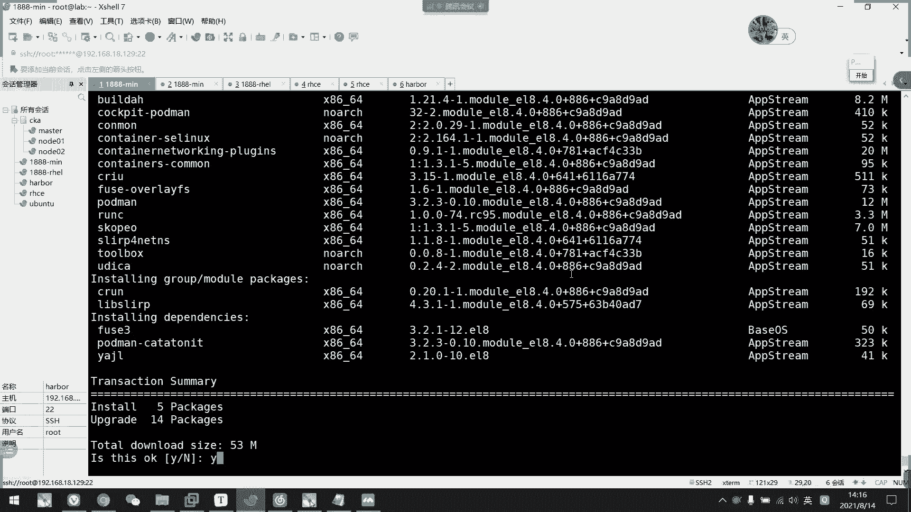
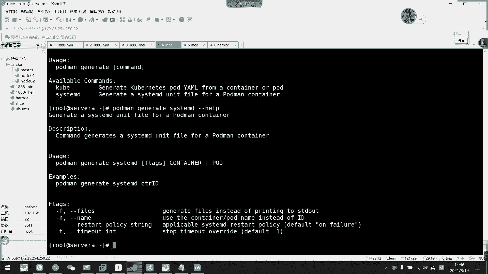
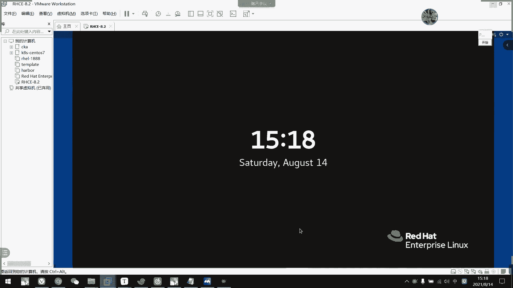

# 2021年7月新版-----RHCE8.2 RH124 RH134 RH294 认证课程 - P59：day11-2 管理容器即服务 - bili_15701050454 - BV1Gy4y1T7ug

A。好，上午啊我们主要讲述了ho man的应用啊。破东吧。tom应用。好，首先是我们的一个命令工具。哦，对。呃。真的。这里加一行码。说怎么？安说。DF。Model， install。整天的。吐死了。啊。

聊应用。面箱工具啊或怎么。采用选项。啊，首以是。强制命令。以及选项。啊，首先是。润的。运行容气。然后他的命令有什么呢？啊，有我们的杠低啊。后台运行。嗯。杠T啊。提供终端。刚才。你不知我加空格干嘛？提供。

小故事。嗯，然后是杠P。端口映射。Gang。一。定义。环境变量。呃，但无一。19。数据。啊，就是我们的一个。挂载到物理。私盆。物理机目录啊。这是我们运行的。呃，然后是。搜索。进一下。兔。拉取镜箱。

push。推送镜像。嗯，还什么。I am。删除容器的可与。🤧嗯杠A。删除所有。呃，stop。停止运行。游戏。我也是。可与杠A。停止所有。Start。继续运行勇器啊。🤧う。然后是imagages。

查看当前。拥有。静一下。打人排。删除。镜像。依家嘅意思。Well。进入如器。啊，基本上就这些了。还有1个PS。查看。容气状态。可以。杠A。かかって。O。那么我们。就这样吧，我就不演示了。啊。

你看早上讲的这些内容啊，5分钟就总结完。我种女啊。

好，那么我们继续早上的内容。

还有一个啊嗯。容器的。临时数据存报。嗯。这在我们的哇li。整天的。你定到。Storage。主后是olalay。下。如果。容器没有做。嗯。数据。持久。那么。删除。容气啊，会吧。对应的临时。目录。上一个。

啊，O就这。好，那我们继续下午的内容啊。呃，早上的话我们都把。呃，全球化啊、投数啊。呃，储出环境变量，还有还有还有还有后台运行啊啊动路映射啊这些都做了啊。喂，都没印思我这里哦有都没印思，O。

那我们下午啊。

那么下午就讲那个。管理。容器技服务啊。啊，我们docker是提供了一个所谓进程来呃维护我们的容器状态。那么我们port man呢啊它并没有啊我们的一个所谓进程啊。

但是呢它可以给我们每个容器呢啊都作为一个服务。那么我们可以通过啊后面的一个命令呢，把我们这个容器啊。啊，做成一个单元文件模板啊，让它保存到。啊，我们的一个存放单元文件的目录当中。

然了我们开机自启或者是启动服务。的时候的那个勇气就会启动起来啊。那么怎么做呢？我们看一下。啊，首先这里要注意一点啊。我们这个呃要做邮件机服务啊。一定要在1呃port man的版本一定要在1。9以上啊。

1。6。4就是我们。那个I手提供的版本呢是1。6。4啊，所以它做不了。我们有版本问题啊，就在随机上面操作啊。随机呢我们跑一个lab。系噶咧。它这个呢会定义一个内部的私有仓库啊，还有一个会帮我们安装1。

9。3版本的put man。呃。还有就是他那个私有仓库的一个呃安全证书。如果我们不跑这个的话呢，登录人是私能登录啊，登录是能登录。但是呢他那个。呃，证书会显示过期啊，会出现问题的。

所以我们最好就先跑一下这个。啊，后来的话有我们我我们要我们要安装的话呢，呃，好像阿里云那边会提供1个3。0版本以上的赫面板，我看一下啊。呃，阿里云。一冇啊啊。あ。我玩意思。但这是不是一批要原地供啊？

But。I see。P。Contain的。那一下是不是。So C M。这里吧。Conul。COM没有，那就不是这里。那就是圣斗士，我看一下。呃18。都是。被是我死。Ps。看一下这里有没有。Xiuan。

诶，也不是啊。Soa。Of C， O， C， C， mailo。他这的模块。模块的话，它是存放在哪里？苏 is在 F3里。那这里有个。或者是看一下铺的 mail有没有。应该不会放在这里啊。我题全蚊都来。

CN啊，在这里containers S Linux。今天呢。😔，没有to啊，to的话它是整合在一起，应该是这个了，我们写一下。把这挂到里面去啊。

这里有没有？没有。然后是。H。Chuning。都找不到这个。

不是OS吗？对对。OS S。是我想。

有数据。

社区TPP的。

看一下。下不了这个P去。Can单。怎么访问不了那个啥来着？

这个不行。

这么突然间兼容不了了。没有我直接拷这里应该是HTPD的。呃呵。

为什么读取不了这个语数据？诶迅。K 단。哦哦，我知道，不对不对，用错了。对，用错服务器了。

呵呵。😊，那在这里写一个。我都没注意啊，刚刚我也看了一下。🎼这有没有这里没有。あり？欢U。去表示。Base。对。跟就停啲咯。Container tools。我装那个3。0的啊。啊，怎么选择这个来着？

呃呀，怎么请求这个来着？ちと。这个不会网了。Mouhui。模块选择版本。冇开水咗斑本。那他是不能卖3。0的。

On this style。キの田の目です。他有依赖呀，我要把依赖也写上去。啊，这的烦死。哎。

啊即系自一更先。嗯。我们这里是装了10116对吧？对。怎么这个是。3。2。3呢。哦，我知道。少个样。这里是做阿里云的。然后他直接装了我们3。2。3。那就难受了。那算也是。反正我们早上装的是1。6的。

对不对啊？我这里。先退出一下。But。视为重置的啊。我们对比一下两个版本。跟他连回来。

全没所谓啊，先先开始装完高版本的，我们先看一下，它就少了个杠杠6而已啊啊，少了个杠杠6。那我看一下怎么做啊，首先我们要先运行一个容器啊，我们先要运行一个容器，然后呢通过这个命令啊把它。呃，生成啊。

就是通过这个模板作为模呃，通过这个容器作为模板了，然后他通过这个命令，按照这个容器为模板啊，是生成一个呃service文件出来的。然后呃。我弱用户了是发在这里了。我们要移动到这个目录下面。

要移动到这个目录上面。我们先看一下。呃。root用户的怎么做？

现在啊它装完了。我と咩。He。刚刚我笋。啊，设3。2。3。要这边空的吗？谁谁去。到我们的。4维。然后这边再装一个。主要我这里没有跑脚本啊。肯定他吐死。那，我先那个继续。我看一下现在能不能收。

搜说下镜像啊。早上我们出问题了，下不定下是吧？看一下啊。而且说HPD这个已经有在这里哦。

有的话，我们用HTPD做都可以。

这么慢估计都不行。没装好。这里该洞开。东嘅。嗯，是不是他今天仓库维护啊？好，我们这边这边做完了。hold the面杠杠。我审。哎，我们光盘自带是1。6。4啊。那么我们现在呢啊。查一下这个。

抽old the man。这子儿。然后是。刚刚好。那我们这里啊。命令只有这么点啊，命令只这么点。然后我们等一下这个。呃，就这里吧好。抽怎么样？刚刚 help。诶。哦哦我知道了，少了少少少输了一个。

我们先输一个s统嘛，s统D啊，当这个跟gax没关系啊，所以我们不用酷比啊。呃。好，看这里，然后它只有这么点啊选项啊。然后我们这里。再看。TE点D。啊，你看他这里学校又多很多了，是不是然后刚刚那。

然后刚刚6啊。我们这里要管理容器器服务的话呢，它一定要有杠杠6啊。会让它生成一个sst统低文件的。不然的话没有刚刚6，其实本来也可以。因为我们看一下这个选项是作文是什么了啊。

所以我们主要用的是这三个选项一，一个刚刚那啊。

啊，是指定现有的一个容器啊，所以说我们要改名啊，容器运行的时候要改名字啊。然后是刚刚fis啊啊，就是说让他以这个容器作为模板生成一个。呃，文件比后是刚刚6，其是说他不创建这个选项的话呢。

我们停止服务的话呢，就会停止容器。き。他这个是什么呢？啊？服务控制，反正我启动服务的时候，它就会创建一个啊，T也是会删除。如果不加的话呢，它停的话是停止容器，不会删除掉，不会删除掉，就不会释放出来。

所以呢正常来说吧。不加这个我运行应该也是正常，但是后面标点就。有漏洞，不加这个就出了问题，运行不了。

我这个。大哥呵。😊，问题很大。我直接这样子吧。呃。早上有有这个金箱，对不对？我们等一下直接用这个吧。问题很大呀。

那我们看一下。先从ro运行，我们看一下roro这个。啊，注意啊我们files它会创建一个文件，它这个文件会当只在当前目录创建。所以我们要做的时候要移动到我们的一个service文件呃的一个启动目录啊啊。

比如说这个ETC systemem d啊stem或者是user live。system 啊系啊系统 d system 啊都可以。我建议还是放在这里啊，因为这是我们用户放的一个开机运行的程序啊。

一般都是放在这里。那我们直接来。

做一个。时间啊。Yeah。先创建一个。什哦，data不行，data我做了NFS。嗯。我们做个APP吧。AS。然后1个时间。说出来。啊，然后我们运行啊hold man。🤧稳干低。嗯。镜像。

然后是刚刚那个于。我们叫mywe。然后我们看一下load man。Yes。嗯，准备我。那个顺序又犯法的。他现在把我这个当成命令了，当成什慢。那改名字。是不可以了，看一下。没有名字的。嗯，最后。

Imagine。아你再再见。嗯确认一下。

啊买。是。

哎呀，我忘了做映射了。我做映射了，算了哎。😊，Pll away呃top。表示。家你。啊ok。什么也没有了。那我重新来一遍啊，port man。run干低。要是刚刚那。My wrappper。呃，杠P。

然后是80映射到8080吧。然后是杠V。看V是我们的APP。S。的一个data。意识到哇。那不对。3W。HKL。注意冒号大一些啊，让它自动选择我们的Slinux。还有没有什么东西想想。没有了。

然后是镜像啊，镜像用。

这个。嗯。🎼什鬼。为什么有东西在里面呢？因为我们刚刚。Kxo。哦，挂了HTL，写错了，不好意思啊。啊并起来了，要put man。PS。啊，就一个要后挂酸的，然后我们磕一下。目前应该是没有东西的啊。

那么我们现在。八点钟后。啊，听得的，所以那个80啊是我们端口映射出来的80n口。好，然后我们现在写一个东西到里面去啊。Eco， hello。有没有。到我们的inex点HPL。哎，我们看一下。啊。

可以了啊。我们写到里面去了。好。啊，前面都是我们上文内容啊，下文内容现在才开才是开始啊，我们先怎么做呢？

嗯。直接创建一下这个文件啊，直接创建一下这个文件，我们CD到EDC下stem。

D system。好，然后是port man。这没有。他最小话没有没有股权。没部权我也不会拼啊。觉得跳舞了。叫什么来着？genle。Wait。Quu。You me see the year your。

偷old the man。这个system D啊。降低，然后直接刚刚令啊，指定容器啊，指定4来个容器，然后是刚刚fire刚按就就可以了。

呃，是myrap，对不对？刚刚bis。刚刚6。你看它家做了一个单元文件叫做container my web service。我们可以看一下这个文件。其实它就是把它写成一is大。所以说在开启容器的时候。

我们要执行这个开开启服务的时候，我们要执行这个啊执行这个。对不对？就是我们刚才那个命令而已。啊，然后删除容器的时候干嘛呢？啊，stop boost啊，不是啊是停你服务的时候要干嘛呢啊。就这个。删除了。

But。Its a store。Pman stop。然后这是停止服务。啊，那就删除容器啊。好。那我们现在把这个。删掉。啊，把它删掉。然后是hold man。8M5-6。哦。啊，那么我们现在就没有东西了。

对不对？我们来个。シスさ。So T， E F C L。先重新加载一下da梦米露啊。啊，等会重新下载一下我们的那个大文件，嗯，然后是看一下tus。很天冷。So is。好了，现在是没有开起来，然后呢。

我们也没有没有容器。那我们现在system。呃，enable刚刚 now表示。You下来。让我们看一下。Hold the man。PSか。看到没有？我们开启服务，它就运把把我们的这个运行起来了啊。啊。

能明白吗？啊，然后这个就可以让它开机自启啊。现在开机事行。啊，我们现在先把它。停掉了。我不对。要不先先验证一下，我们看一下刚刚的还在不在。我们克一下，看一下还通不通，一样一样可以，对不对？一样可以的。

那我们现在停止服务啊。スト。呃，本天的。My river service。让我们看一下hold man。ピかえ。呀他是直接删掉，不是停掉啊，是删掉了。把我们容器给删掉。

然后我们现在呃注意一下这个刚刚的ID是DAD啊，刚刚是DAD啊。Wa。那我们现在重启一下。因为我刚刚。那个服务呢我设置的是开机日期啊。所以它等一下就会自动启动服务啊。那我看一下开业启动以后呢。

服务会自动启动嘛，对不对？然后我看一下勇气会不会自动启动。然后跟我们刚刚的ID是不是相同啊，我们刚刚是DID对不对啊，DAD对不对？我现在看一下。Stays。嗯，很甜的。My。嗯。So。

Fail to stople to make waves。为什么？

看到为什么不行。Resources。V디オ没关系。他没有错误信息。Es month。哦。我这个app。啊，晕死。我们S是挂载到VDO上面的。你说晕不晕？帮我们改一下吧。现在没有记录吧。哦，不得不得。

Thisト。第一。改一下吧。挂载的。我放在这里。直接放在app。我们能给DIR。1个AVP。Iftail。好，我们放在这里吧，然后一口一个。嗯。还是一样吧。Hello。Container。啊，再重启。

真的是无语，我对这个东西啊。阮这道 we路啊。等一下重启看一下它会自会不会自动遗漏。我这边做了3。06。这边没有镜像。好烦啊。咋搞？让我们看再看一下。诶还是没起来哦。看一下他又报什么错来着。

嗯，没报错。아对。嗯。Shuttting down。Schedule container by rapid service。Schedule。Fil to star。这里。

Can not listen on T CP product。80。Already。嗯。喂 house4。怎么不是有个偶。Already in use。在被使用。这个怎么变人开起了，我真的是。😊。

他都没有开机自起呀。这么神的吗？呵。对啊，刚刚我们不是重启过吗？都没有开机自起。🎼真的真的不是我的问题啊，这都不是我的问题。😊，嗯，我还确认过我才用80刀口。嗯，用8080吧。再重启一个。然一波三折。

好。喂。啊，起来了啊，终于好了他，他终于好了，是不是？啊，8点半了已经接近了，我们看一下。啊，可以。嗯，然后还是。啊，刚刚是DAD，对不对啊？我们现在已经是CFF了啊，然后注意一下那个时间啊。

38秒以前创建的啊，38秒也是这之前创建的。好，那么我们root的这个用完了，我们。做一个啊普通用户的啊，握者是比较简单。但是我们考试是要求用普通用户的，而且呢是普通用户也是比较安全的啊。

普通用户的比较安全。普通用户的话呢我们要注意一下。

操作也是类似的，但他呃要注意它的一个配置文件的存放位置啊，首先是放在我们家务录上的。啊，这是存放我们计算仓库的一个配置。然后。服务文件我们要放在这里啊。在加目录下创建一个点confire文件啊，然后。

文件夹啊目录啊，然后再往下的话呢，建一个stemD啊，然后是user。消售。我们可以看一下这个嗯。真的是入手不是入色那个这个要注意啊，真的是入手。好，然后呢它的一个命令啊，我们看一下。嗯。

两者之间的对比。首先加载答案文件呢啊，我们root的话呢是直接对mon语录。然后然后是普通用户的话呢，我们用stemCTL刚刚us啊对mon语录。啊，然后是停止啊，其动会停止。呃。

我们的用户呢也是加一个刚刚用手就可以了。然后是自动启动的时就。不一样。我们用户服务的需要先加一个叫做log loging。loging CTTL啊啊logingCTL，然后是enablelinger。

啊。然后呢，再inmail我才可以啊。这个下面我有解释的，我记得。啊，这其实就是它开机以后呃，可以自动启动啊，就允许它。允许我们呃user里面的。usse里面的服务啊。启动起来。啊，就等于授权嘛。

这个命令等于是授权。好，我们来看一下。怎么做？啊，如果是三点多的话，我们直接。用这个就可以了。下后版本。那就不用去我们的一个呃练习环境了啊，不用去我们练习环境。啊，我们先创建一个这个啊。

但是一定要注意一个，普通户登录终端不能用数或的0度啊。一定要是以普通用户身份登录啊。

不能用输5个速度啊，不然是不行的，我等一下演示一下。那我先创建一个用户吧。有蛇。嗯，就加要修的嘛。有没有什么要加的？呃，已经有了。我忘记他密码是不是。一定。Still的O。那我现在连过去啊。啊。

我们先用数啊用竖去连过去看一下做出来是什么效果。好。那么我们刚才说了啊，要创建一两个目录啊，分配DRR。嗯。点抗嘅。然后是。这是怎么地吧。然是user。

对不对？确认一下。劝一下可不可系统的us啊。对，没错啊。

商品。O。那我们现在抛的 man。运行一个。run降低啊不对。在这里再建一个。呃。就放在这里吧。换1个HDNL的目录啊。哎，我们一口一下。呃。啊，hellos student吧，就这样吧。对。

把它放到我们的ex里面。啊，然后我们。跑游去，拖的慢。不论。降低降。近令。呃，丢的。Rber。太长了。就S外。太长了。呃，然后是端口映射。8081。到8080。或的。과장。嗯。多少。红。下的。

Just天 up。坏者到哪里啊？不知道用变量行不行？啊，我是第一次用面料的。呃。哇，3WHDNR。まだぜ。呃。然后镜像。精山就量搞。859。高警。什么来着？Please， select and。

🎼我要水。哎，怎么有3个？811啦。不拉行不行啊？他拉不了，主要是。不是我。因为什么他。他有没有镜像啊？玩不了。玩不了。咋整的，管不了。玩不了，那我只能用这个了，只用这个隐示了。

那我先把那个脚本跑起来啊。我们跑这个啊leb啊一定要在work station上面跑啊。

le都是跑work station的。又要等。那我先休息15分钟吧，休息完我们再演示这个。啊。不。那我们直接用关配的文档，换文档的话呢，我们要用到他自己的仓库呃。我先这边先登一下。哦哦，已经在stu了。

我们已经是不通用过了。嗯，登一下。

好配的。嗯，不用看他也可以。

就说什么hold的呗。looking。然后是。不需求。点 left dis symbol。合这，然后是we pad321。

登录成功啊，然后我们就直接执行这个了。

哦，不对。刚刚的那个还没执行起来。忘记创建了，我们看一下MKDRR。呃，就这天聊吧。然后是在MKDR。电 convic。Systemム。D啊L是优色。嗯。创新出来了，然后是。就要运行容器了。做怎么样？

不从这边拉不行。嗯。这个容气。

然后这里。这不是一个。holdold man one杠D后台运行杠杠那。Swe啊，表示杠P8080映射到我们的8080。然后是钢威。刚维就是。多 home的。H。映算到我们的。哇，3W点R啊。

冒号大贼啊。然后是经常名称。走你。没有啊，现在put面好像都出到四版本的那fe上面。你可以去官网了解一下。好，我们看一下做什曼BS杠A。好，它运习起来了啊。然后我们先在一口一个文件到里面去。Hello。

 student。呃，先要下的inex。对行。嗯。😊，等会我们刻一下。Local。Host。バリバリ？嗯。😊，可以了啊。可以了。🤧嗯。😊，因我们现在可以看一下。啊，我们那个仓库他其实已经帮我们定义好了。

老放在这里，那个仓库的配置没去吃嗯。呃。我们可以看一下。啊，这就是安全。I是 broke force。然后是他的这个搜索。地址。都是 locationation。那这又没什么。然后我们可以也可以看一下。

ETC下的coner。对。你看他社区呃默认也是这样子，但是他用了那个配置以后呢，他就自动登录到那边去了啊，所以他已经脱离这个配置文件了。啊，同理这个票据。我们看一下他有没有直配者。啊，也没有了。诶过他。

OK那我们就。这样。啊，容器运行起来了。让我们继续往下啊呃怎么说，我们CD到。先回家目录，谢一道对。我用三对目录，我怕你们不知道我去了哪里。啊，到我们user里面。当前没有东西啊啊。

然后我们还是拖怎么样。呃，不是jery cable。Id。啊，然后是systemB。命令应该是一样的。要是刚刚那个是Swe。刚刚发了。先不是这个。我忘记了给你们演示什么啊，我们先用呃竖干的方式啊。那我。

Rod。我先用树干的是是？啊，这并不影响我们刚刚的实验啊。啊，页还在啊，我们现在是速干登录的啊，注意啊。好，然后我们C到里面去啊。呃。到里面来了，然后做的么样。呃。还是P错了吧。ER哦，少了个一。嗯。

stdent。要不是个。第。胜地啊，然后是刚刚那。Let's grab。呃。看看froze。好，我们现在杠杠音6。啊，先不加啊先不加。等一下，他把这个文件创译出来了啊，我看一下。啊，有是有的啊。呃。

对呀，嗯我们也看到他多的快就是停止了，少了少了。我们刚才一句删除，对不对？啊，他这个版本可能没有刚刚就会正常啊，然后我们继续啊。嗯。好子妹。きっと？呃，然后是删除啊。删掉了。好，然后我们。

Service。尴尬的user。地冇。鱼漏。嗯，你看他直接找不到了路径啊。走啦。直接找到。文件明名在大大都找不到。啊，这是树干的原因啊。那我们现在退出。在退出。那我怎么可以登录进面，我们给CC去啊。

一定要用他这个用户登录啊。然后我们再来一次。来看这样就可以了，对不对？呃。Start子。诶。可能还是不行。别行要密码嗯。所以他还是有问题了。不行啊。不行，那我们就进去删掉啊。看一下这个成国人在啊。

啊叶存在了，然后我把它删掉了。然后我们重新来过啊。有没有历史记录了？我这一吧。好，我们再执行一遍。好，现在应该可以了。本当？对。C等CD杠杠user。DA E MO M。水漏。试一下开不开的了。

刚刚user哦，我刚刚是不是少了，刚刚user。他可能可以的，但是我嫂子刚刚入手。等看他直接登读出来了。哦。他这个问题是什么呢？啊，是因为我那个容器被停掉啊。要把它删掉，因为它同同名呢。

我们一个机器里面啊一个名字的服务啊的容器只能有一个啊。So。什么鬼呀？中老CDO。刚刚右手杠叉一。He， you are。Not image from the system or tapling Y。

plus Q挑拨。那我们就只能这样子了。

看一下啊。Fil to star。🎼这里又看不到错误级别日志。什么不行。这里没有错误级别啊。头多大？对。看一下有没有错误级别啊，这里有一个unable tof container。没有这个名字。

你没有这个名字。看下。た？因为发现这少很多东西。St。🎼所以没有刚刚6，它始终还是有点问题啊。然后它star的话就等于恢复运行而已，只把我们停止掉的容器运行啊，所以它这里还是有问题的。

我们要加还是要加个刚刚6才行。哎。然后现在可以把这个删掉了。所以呢我这边就演示的话是为了演示那个没有刚才6。会造成什么原因？但我特意没有刚刚6啊，但是他。最终结果是这样子的，我也没想到。啊。

我们再做一遍啊，那么我们这边就加一个刚6啊。嗯，做一个对。呃。刚刚user。可。让我们这回。真的是。嗯。真的是。关掉了啊。啊，没有勇气了啊，这位真的是没有勇气了。好，然后我们先。启动起来了。啊。

出问题感觉。啊，启动起来了。对不对？啊，所以这个杠刚6这个学校挺重要的。好了，我们看到这里啊。把容器运行起来了。

然后呢，设定开业日起啊，设定开开业日起，算开业日期我们就算是完成了。呃。对。lockin c t l 啊另一部 log。

然后是。

啊，起来。嗯。Container S rubber。😀呵呵呵。😊，所以听这里听的有点。我uyu。Stats。嗯。叫什么？Best。看到啊营业状态啊，那我们直接。重新。还不让我重启。对啊。ばっかり？

所以要注意啊，我们不能用树干啊，一定要。呃，征集登录啊。当然我们这边只能SSH啊啊SHH选择是stuuddent连接过去就可以了啊。所以这个不然，就一个命令就把它设计出来啊，主要是一个路径问题而已。嗯。

主要是一个路径问题而已。把电通了啊。呃。嗯。😊，什么鬼。到时候通我怎么。我连呢。玩什么呢？嗯。

真的。

多状况。

他要拼得通。啊，对啊。

说A对吧？卡住了。22号出了。

我刚刚卡住了。他能拼通，但是没连上啊，让我们看一下。啊，邮件已经运行了啊，在3分钟之前已经运行了。是。啊行。我们刻一下。是8980对吧？是。Local horse。为什么呢？有东西的呀。为什么呢？

8080。我真的是。醉了。加了呀。看一下吧。呃。润。Youai。有啊。808013到8080没错啊。头。是这服务器有问题。18080到口没有开啊。没有鉴定中。就这个服务器有问题。哦，我知道了。我知道了。

这里没有。我这里没有充电啊。对啊，勇气没起来。

是他这个重启的时候出问题了。

嗯，我试一下。他一下吧。哦吼。又报错什么鬼呀？不行，一定要看日志才行。我们刚刚重启的时候，它已经卡了很久了。现在什么问题？呃， earthquaketh create它创建错误而已。

is already a。In。那我停止，它不会删除吗？他卡住了。咋整的？不是不是，如果他音色的话，他会报错。这个机子从事过没做任何东西啊。先玩的三光吧。我们现在开始了。啊，因为刚刚开机的时候卡住了。

精神卡住了，他状态没到啊。你原谅他吧，这个东西真的有点垃圾啊。你原谅他吧啊，那我们直接过了我直接过了。😊，今天出现的状况真的是有点多啊。首先他这个破 man真的很多bug的。喂。肯定得用啊。呃。

考试的话环境一般不会有问题啊。但是这个。练习环境说实话的很多bug的，而且put同面的版本也有很多bugbubug的。嗯，所以我也不敢说考试的port man没有问题，但是他环境没问题啊。

port没有问题而已。你明白我的意思吗？嗯。可以，如果是真的是环境问题，你可以找他问啊。但是他如果给你判断成不是。环境问题啊，那就没办法。我们再试一期吧。

再试一次。嗯。用个机器。只是8出现这个问题啊，他以前呃CA那个7不会这样子的。啊，应该没问题了。现在8080dogo已经开了，看到没有？

啊，这回就没问题了。

那我们看一下。在这里是看不到的。啊，在这里看不到了，他因为他在stuiel那里。这里好像可以。这不行。我案怎么指定的？我们这边。确实丢在那里。啊，或者问。呀可以啊，所以99没以前啊。

然后他会重重新开一个新的。呃，容器啊，那么我们这边的话直间就可以了，刚刚没卡，开机很快，然后开监听这个桩端口了。啊，所以它是环境问题，我也不想啊，又浪费大家时间。

那我们直接。哦。

就。