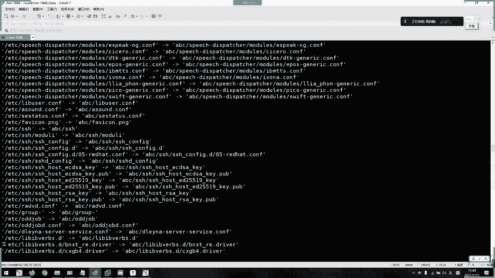
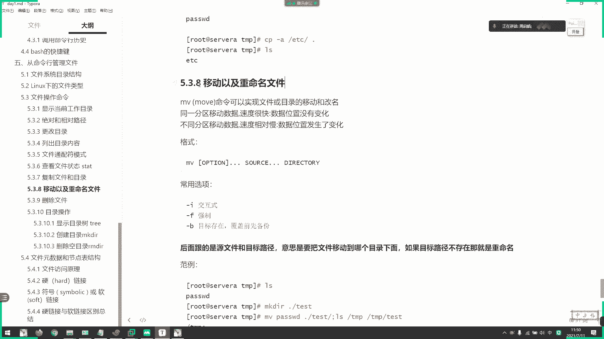

# 2021年7月新版-----RHCE8.2 RH124 RH134 RH294 认证课程 - P5：day2-3 文件操作命令3 - bili_15701050454 - BV1Gy4y1T7ug

好，那么我们刚刚联耳到了原数据啊。接下来呢是我们一个复制文件，还有目录的一些操作啊，复类文件和目录的操作。那我们看一下啊。我们复制啊送CP啊CP啊后屏的意思啊不是主CP的意思啊。不要想着去找女朋友啊。

男朋友那些啊啊，是父子啊，是把自己备份了一份。啊，我们工作中啊采用的备份啊，一定要经常备份，要改为这个星期的备份啊，不然数据丢失了就没得恢复了啊。得吧。命令呢可以实现我们的一个文件或者目录的复制啊。

那么我们现在先看一下啊。

哦，我现在有一个hello的脚本啊，hello的脚本。那么它的原数据。啊，有去是我们昨天下午啊3点02分03分04分。那么我现在把它拷贝一份啊，拷贝一份到我的加目录啊。命令格式啊注意啊。

copy啊原文件啊。路径这是绝对路径，这也是销售路径啊。我现在意思就是把哈lo的SH复制到。加入录续，然后保存的文件也叫hello点SH啊。默认啊这里是默认，如果要改名怎么改？🎼啊。

我这里改成test点SH啊，这样子就可以改名啊，就备份以后的名字。如果不输的话，它就默认你原文件的名字啊，我两份吧。先复制一份。Yeah。Sa吧。你找testH，然后我再复制一份啊。不。对。응。

就你看就叫hello dance去了，这就是复制文件复制文件。但是我们要注意一下啊。注意一下。啊，他们两个。时间。进步相同啊进步相同，就说明我们这样子复制，它相当于是创建了一个新文件啊。

带有了它的一个新的原数据啊。嗯。嗯， yeah。啊，他们的hello子啊。当然按折是唯一的，只要它不是链接啊。它的L值都是唯一的。我们看一下。STATdata下的helloSH。啊，24个。自己，然后。

犹率是这样子的。好。复制过来那一份啊，这是我们复制的时间啊，创建的时间啊。Yeah。包括testSH。那么我有没有办法去保存它的一个原数据啊，复制时候保留原数据啊。怎么说？

有时候我们是需要它的保留原数据啊。就popy杠R定位。但是我们一般一般用杠A啊杠A。该比如说。hello，哎。😊，data下的。hello，点H保存到。加目录下等。嗯。😊，叫车1一吧。哦，我现在看一下。

好。O大了。是不是跟我们原来是一样。加02分看到没有？modic time，它显示就是我的安排啊。啊，默认在LL显示的所的M态。🎼那么我这个STAT看一下SE。对。是不是一样的啊。ちと。这里再给一个吧。

data塔其他的hello下去。Yeah。除了艾lo字不一样。其他啊这个Dice也不用说，它们不在同一个块里面。不在同一个分区啊不在同一个分区。所以啊题目相同的爱罗职也题目相同。好。

但这三个时间没有变化啊，包括它的一个。呃，后面学到的1个IC的那个上效果标签。也是一样的。链接处。呃，它的一个收支收主权限。啊，文件边不一样，但是他。这个三个时间是一样的啊，三个时间是一样。

这样时接保留它的一些基本的元素去熟悉啊。

啊，O这是口一个A啊。啊，这是复制。CDCD变了吗？看一下。

啊，事体有没有变？啊，对，随机变了啊啊，这元素就变了这元素就变了。来个A他A他表表啊。把他那个实际属性保留了。杨树平。因为它这个是相当于创建了一个新文件。对，相当于是创建了一个新文件啊。

所以它的形态是改变的。啊，是那种不加的。啊，对。还有其他DYDY也变。ち？啊，然后包括刚刚我们的tests hello啊，ts hello这两个直间。都改变了啊都改变。这种是不复制原数据。

它是以新建的一个原数据。它这种呢复制的原数据。的内容。然后呢，由于它安load的只是分区为一，所以它也只能改变C台啊。

去。

它的标签是没有变啊，标签也没有变。我们可以看一下啊。呃，hello，大下下去。Yeah。不。咦。😊，奇怪哦，我知道了。😮，あち。难怪我这个是昨天复制过来，所以它标签是anme home的啊。

因为我们写在加固录里面了这个文件啊，这样子就不好搞了。那就不好搞。所是合并。datahello，然后改成。Data test。我们看一下这个dta架驶有没有变啊。他正常要。跟着我们的上面身吧，你看。

变咗。EDC温态啊，因为这天这个呢是我昨天。

啊，纠记得。我们这个hello点HH一开始写在加布录上面的，然后通过move移动到我们的data下。所以它的那个呃标签是我们的be home的啊。那如果我在data下新签的写的是ETC文。

啊，一直是问题。啊，对对对，这是安全销售文。这不用关注这一点，我主要的目的是给你们看一下啊，copy杠A过来的这个是不会变化而已。关注点关住这个就可以了。

啊，然后是复制目录啊。

She。呃，比如我们要copy。什么咧？四啲多几头。啊，可以。🎼就EBC。🎼S一ミです。啊，不知到当天目录。你看复制不了，因为我们。EDCS呃，那SC下还有子文件夹啊，子目录啊，还有子目录。

我们可以看一下啊。Yeah。看它有一个子目录，对不对？这样子复制不过来。那么我们就。下一个杠2啊杠2选项，刚刚说了一个大写L。🎼啊，在前面讲了一个大小要逻出LLL杠大R啊L杠大R代表地位城市。

我们小R啊也是一个定位扶持。嗯。😊，啊，我我聊聊吧。😊，后边啊后边。啊，那就卡过来了，看到没有？SCD那个。啊，但是他原数据没变。我们可以直接杠A复制过来。嗯。🎼改成ABC吧。看到没有？啊。约数据。

都有。啊，杠A的话还包括递归了啊包括地归递归了。对不对？啊，所以一般来说啊。用。🤧一般来说还是用杠A来修改，因为它已经包含了递归，还有保留原数据啊。🤧。但是一般来说啊，因为。

他这样只会把那个安全上纹复制过来，再开启来Slinux的情况下，肯定有问题的啊肯定有问题的。但是我们生产一般都直接会把那个Slink关掉的，太麻烦了这个东西啊。啊。100以上要随那个时直接发了。

所以我们不不需要在意它的一个。安全上的文标签啊，不需要关注啊不需要关注。所以一般直接看A把它复制过来。

卡闭。啊，你看相当于是第二啊。啊，可以小写阿龙还有大写阿。

张涛同学们，我问一下。我把这些都删掉啊。问一下，我现在可以。啊，对。区别卡你。EDC有个目录。到大前目录下的ABC。然后再cobe。继。ETC到。大前目录ABC。然后 copy别加A。E c。到。

他线目录的ABC。那，同学们我问一下。他这样子三次。资金结果是怎样？三次。第一次做了什么，第二次做了什么，第三次做什么。能想到吗？可能是我这个。可能会出问题，我这样写可能会出问题。응。呃。

我们看一下结果啊。这次显示不出来。漏吧，取消吧。啊，但是他是在应该。这样子看不出来，我分开分开做吧。啊，第一次啊。第一次。对呀。那么我现在再做一次。这次是什么结果？就我刚刚应该加个V。我加个V吧。

Vvis。我调个V。

啊，AV啊同学们应该最喜欢的。啊，回。

啊，诶。那么我们选下这个AV啊，AV什么意思啊？啊，V是wes啊，详细列出啊。

1A是我们的地位负值。

好，OK这是第一张啊，太多了。还是减少一点吧。还是USE Linuxux是吧？诶。😊。

， I have you like。啊，这是第一次啊，做不多。啊，第二次了啊第二次你们觉得。是会覆盖，对不对？提示覆盖，对不对？啊，你们是不是这样想，是不是会提提示覆盖？啊，覆盖我看一下是不是。系呀。

😊，不是我。为说不是。那么我们再看第三次。第三证。这次是不是复解？😡，第二次没覆盖啊，为什么呢？啊，第三次为会不会覆盖呢？那么？😊，啊，同学们。覆盖啊，第三次看一下是不是覆盖。对啊，第三个提示覆盖。

那么第二次为什么不提示覆盖？啊。第二次为什么不提示覆盖？😀He。😊，其实我给出提示的啊，我给出题示的。我我把杠V都给出来了啊啊，AV都给你们看了，AV都给你们看了啊，我是扩出去了啊，给你们看AV了啊。

啊，不是不对。😀へへ。😊，你们就好了，上课有AV看。嗯，我已经上课了没有。Okay。啊，不好意思，我又开车了。嗯。啊，那你们都想不到对吧？来，我来揭一下啊，我来揭晓。😊，我来揭绍。啊，我们第一次。

co比。东说什么了？啊。特别的动作。

啊，该有我就不加了啊，该有我就不加。我们第一次EBC下的。エスいビニです。这复制道当前目录的ABC项。同学们。刚刚说过了。我复制。如果我不加APBC，他是不是以原文件名字来。归我们的目录。

我现在加的ABC是不是相当于我 copy别的时候，把SClin。呃，U啊改名为ABC。所以我们看依次复制它的word显示的信息是不是被ABC吓的。本件。啊。是不是啊？那么第二次啊第二次。

当前目录下是不是已存在ABC？🤧嗯。当前目录上是不是已存在ABC。那么我已存在ABC，我拷贝过来，是不是要把它放在ABC下的SElinux了？所以我第二次。会有ABCSlinux这1个目录。

然后第三次我还是放在ABC下，然后Slin这个目录已经存在了。对提速覆盖。能理解了没有？还没懂。还没懂。啊。这这个还没懂是吧？😊，对。对。保用文件。诶？我用个文件做比喻啊啊，我现在拷贝。

🎼ETC下的一个文件。他8sword。啊。然后到当前目录下，我要改名为pass。是不是一个文件？然后。第二次我不加。卡位啊大屏目录。你看不会覆盖，对不对？然后它就原原文件的名称复制过来。

这样能看明白没有啊，对啊，你看这里刚刚说了看V，我都说我给出提示的啊，我给出提示的，他创建的H00就是这个。根据文件这个例子能不能理解？啊。啊。这样。怎么算，那就可以了。目录啊也是一样啊，目录也是一样。

跟我在第一次他大前目录上。在ABC相当于我复制过来，然后把复制过来的目录改名成ABC保存。对。对对对对对对对对对对。我现在LLABC你就可以看到里面有1个SDlink文件夹。嘿嘿。😊。

那么正场我们的EDT下Slink是没有这个文件夹，对不对？所以这一个是我们第二次生成的。第二次生成的。啊，搞定。

啊，这个理解一下操作就可以了啊。不用太糟了嗯。啊，就是以后注意一下，因为要懂得这个复制的原理啊。啊，就这一个考的就是你一个复制的原理啊。能不能懂？啊，先等一下啊，然后呢呃拷贝讲完了，我们来讲一下啊。

移动。😊，以及同命名啊。我们。linux里面呢啊是没有。像windows11样F2，然后修改文件名字的啊。我们移动器重命米啊，移动器重命米。比如。

为什么送移动技术秘密呢？啊，我了。呃，先删除所有吧。留个呃说了。卡过来吧。好，卡过来。🎼因为下了怕说。え？诶。😊，改名了。啊，行，没关系。是。啊，也没关系啊，就就叫这个名字吧啊就叫这个名字吧。然后。

我们要把这个文件从呃移动啊移动。从这个目录啊插取一个呃不。新建一个test很紧找啊，test。🎼啊，我复制错了，我把它复制到我们黑塔下了。那么我怎么把它移动到这里呢？啊。

那么我就用momo就是MOVE移动的意思，对不对？移动。那么我觉得原文件。El是。目的路径啊，source andd啊这一个这两个单词啊，你们要好好理解SOUCE。O， sauce。S r c。啊。

没错SOURCE。啊，叫做圆。Deest。这种目标目的啊目的地啊。啊，这两个单词一定要记住啊。这在我们目前的。这样子。命令含里中你理解它的含义就可以了。但是大概什么？这种动作还有啊，他要要求你写SRC。

是什么dest是什么？啊，这里面呃里面查有的，他把ss给缩起来了啊，然后d。就说比如我在S么操作啊，我移动这个东西啊，比如说我现在原文件在data下。多然后我的目的地是哪里啊？是da塔下。Test。

想啊对不对啊，所以我们前面列行只需要理解。原和目的，但是他S是要写出来的，是要写出来的。啊，其实也不难了，其实也不难，就给你们提个起。那么我们现在也跟copy是一样啊。沿科比试一样，直接回车。那么。

它就以原文件名称移动到tex里面去了啊，看到没有啊，已经没有了。那么我看一下调查里有啊，已经有了啊，而且它还保留它的原数据啊。看到没有？原来是11点50分，这样也是11点50分啊，所以移动它并没有删除。

不并没有删除原文件，然后再新建一个文件啊，它就把原原来的原源版本移动过去，但是它的其态应该会变了啊。啊，也不一定。你。看下时间就知道了。啊，四遍啊四遍了。用数据识别了。啊，因为他这个块肯定有变化啊。

这个块肯定有变化。放去。OK那我们现在。😊，回到t里面去啊，刚刚误效错啊，把名字改成这样子了。那么我们要重命名怎么做呢？就目对，然后我把它目的路径改成当前要加个名字。歌声。是的。移动基础命名啊。

这个操作叫做移动基础命名。最我把名字写上去。다 이숍 입니다。因为我本来就是把这个文件移动啊，我们的操作好像科比一样，他没有。会按照我指定的名字去对吗？如果我没有写，他就按照他原文件的名字去。

创建对不对？嗯。这叫做移动寄球秘密啊，移动寄球秘啊，这就是不符。

然后呢呃幕的话，我们注意几个选项啊，杠开是交互式的会提问。标呢F啊是强制。要后干B，如果是目录存在覆盖前先备份。

什么意思呢？我们看一下当前。喉咙木虎。嗯。太。不呀他当前其实是一个。便秘啊。Mo。是MI啊已经跳到杠I了。呵呵。😊，没事啊，你这里有就可以了。我都导出的啊。刚好提醒我导出一下。

Yeah。并没有改名的话嗯。

没得说。😊，好。他已经是有一个杠碍了。那么我们现在用原有的。命令。去复制啊，去运弄一下啊，改为为pass看一下。啊，他不会提示啊。只有。要覆盖的时候，它才会有提示啊啊。

比如说我这在 move在一个pass，在一个pass。嗯，他老是同意问题啊，这样不行。呃，我现在cobe刚A一分到。我们给塔家。那么我现在移动过取啊。Yeah。不提问了啊，对不对？不提问了。

是不是没有了，移过去要了。那边也被覆盖了啊，那边也被覆盖。我先把它先移过来啊，先把它移过来。嗯。😊，模糊 data。Hos。什么意思？Mising to the question。

🎼File after data pass。と啊。好，可以了。啊，把它移过来，这些da塔消也没有了，然后了我他取一个。对到下一个pass。🎼好，两个文件不一样的吧，两个文件不一样的，所以这个是data。

刷到pass。按我当前的pass。啊，你个诶。有有。嗯，为什么没有了 why。哎，谁在对太始下了。系。谁开麦啦？啊，周指的周同学。哎，怎么开呢？我也没放权啊，为什么？啊又一个呢。唱。刚刚弄错了。

🎼重新来。Touch。🎼da塔下的pass。啊。我们推迟率的pass啊O加油。data下等pass。哎有怕。啊，两个文件不一样的名字相同。但是它随性不一样啊，大小都不一样。

所以这个是存班在我电脑下的pa是一个后文件。然后我现在还是幕。可啊。🎼不用原来的相当于是加了个干白水箱算干白。啊，pass到我 data塔下的pass。你看他这样子就可以提问了啊，这样大家看I就会提问。

如果我们不加杠癌。他直接覆盖了。不已经不提温了，直接覆盖了。🎼啊，我们看一下。啊，你看我们data下的pass本来是零的，现在就变成。合离主期了。腰这里没东西，对不对？好。

🎼我记呃我记得经用了经用看一下效果再改一下吧。🎼把复制过来。复悠过来吧啊，移个过来吧。这个情况啊。啊，下个情况。啊，没有了啊。然后。嗯。Yeah。data pass啊，又是同名的，对不对啊，又是同名的。

🎼啊，又是同名的要同名的，但是它实际上不是同一个工具啊。那么我们现在。然后加一个杠B。pas到data。Ca。え。要覆盖啊，注意啊，覆盖。那我们进来看一下。好像有多少个叫pass的。

pass C啊叫pass C啊，不叫pas，叫pas C。投背服帕纸巾有多少个？啊同学们。有多少干？两个对不对？啊，我看一下是不是两个。啊，对， person行。然后了，这个。了个波浪号的。加个拉了啊。

就是我们原来的文件，加了杠B备份啊，杠B备份再来一次。嗯，有我对友移动啊，移动了。那就touch取一个pass吧啊，通的啊。Mo。か比。到地头。那么。我们敲完。它的一个命名顺序看一下唉。这个就不会了。

肯定是三个了。诶。😊，2个5。啊，他他直接覆盖了。那就没得玩。再来一个。嗯。可能是一样。他只保留一个备份吗？那就只保留一个了啊。他直接把原有的直接覆盖掉了啊覆盖掉。啊，有一种它这里会有流水的。

是说pass波号一pass波号2这样子的有一种有流水的。啊，应该不是move啊，应该是copy的。

好，就不要样啊，知道没问就好了。

他你就创建一个空文件，他就就要创创建一个空文件。

嗯，TU下啊2。저희가 그런 게。他。那么移动。学到了。就到删除啊删除文件。其实我们IT学习这个东西啊，学习一个新的系统啊，或者是新的应用啊，或者数据库啊都离不开四个字。3。对。好。离不开这四个字啊。

对不对？C完毕啊。这边改一下。加我们刚刚他学了些啊，或者是。啊，移动啊就不不是移动啊，是这不是我们那一个真的动作啊。删这个比例码删除嘛。还没讲，现在讲要后改就是我们的modifier嘛。改变有数据。

还有它的data啊LL嘛，对不对？离不开的啊，离不开。这这个动作。对对对。这怎感觉。好。然后我那我就看三啊，看三。下周我天怎么走啊。有幕府。move是移动，那么remove就直接丢弃嘛。啊。直接丢弃。

命令呢可以删除文件啊，包括目录啊。发红包。所以呢这个命令是非常危险的，也一定要谨慎使用啊啊，建议我们写一个脚本啊，用mo去代替掉RIM啊，用move代替IM。🤧然后。格子啊，我是希望你们用幕代替I呀。

我是希望你们用I代替幕。啊，你们昨天说的那些什么啊，反木斧的别名感觉爱爱爱不，是不是？😊，啊。不要不要挖坑啊不要挖坑别人给别人啊。有同罪了啊。好，那么我们看一下它的一个呃。啊，看一下它的一个格式啊。

就是啊我们IM加文件啊，IN加文件啊，可选项啊，昨天说了有括号的都是可选项，可以确省的，可以确省，但是一般都要。就不能讲。我看一下直接。

🎼当然我们现在这个RM也是一个。别秘啊。可以了，这是个I自动加了交互室的。啊，比如说我现在这里，哎，就么有个哦，刚刚他取了，我要不要把这个删了？对啊。不会问的啊不会问的，直接删掉了，看到没有？啊。

这在我重新回来，然后呢，我用别名。啊，不用别别，直接该谁在I啊，他会问啊。诶？哦，忘了加我朋间啊，问我师否真的要删掉啊。啊，问我是不是的也这的，如果全Y他就确定了啊。好，那第三个。🎼呃。🎼先发出。え。

嗯。今天干嘛？I am。说IM加 i f。这个有没有I已经没关系了啊。他现在是强制删除啊。有没有阿姨经没关系啊，他就是强制强强强制删除啊，强制删除。要嘎了不用说了，第柜呀。

🎼啊地轨就是说如果删除目录的话，他就把目录以下的所有东西都删了啊。所以。🎼常用的啊就是IM杠F。啊，然后加。啊。扩展。是我们的发那个。啊，这样杀除就可以。🤧。但其实我们这个删除啊并没有真正的删除文件。

还可以寄回来啊，还可以寄回来。我我。看下。啊，大家需要用到一些特定工具，我这里也不会讲，但是我会讲它的原理啊。哦，我们讲到Ilo的时候就知道了。颗粒了可粒可粒。特定率空气是可以恢复的啊，你看你。

🎼windows的功的的的的那个硬盘给格式化掉都可以恢复。我跟你说有没有试过？

上数据恢复啊。这个可以立的啊。R元杠F是可可以可以进回来啊，但是要借助特定的工具啊。这不用啊，再P可以吗？windows。不是服务器啊，就是自己的系统的，在PE上面可以恢复的。它有一个文件回复工具啊。

好，我知道这是IN杠F就可以了。好，行，那I讲完了啊。然后。接下来是目录小组啊，谁是目录取啊。好。写字目录器。不是说因重央业务都有备份，一般来说他会整怎常备用的。呵呵。😊，肯定得备份系统啊，对不对？啊。

写生不录去。比如不说。😊，啊，一般。业务。一般业务他们是这样的，首先我这里是一个操作系统。我这个操作系统啊有一个目录啊，工作目录呃，TR工作目录。然后呢，我首先要把整个系统备份。啊。

整个系统备份一份出来。然后呢，他这个工作目录一般是通过网络。系呀。通过网络去备份。这里有一个它真正的读取文件那里。文件的目录啊，它通过网络去读取这个文件过来。

然后这个文件呢一般来说啊还有一个服务器中备本啊。啊，一般正常操作是这样子的。所要我们。工作工作电脑了啊，工作服务期呢其实。这个是要备份服务呃，备份它的一个。系统系统，然后呢一万。

数据重要业务数据啊是存放在我们其他地方的。例是啊谁啊，然后试试或者是las啊啊那些。什么叫三个一V吗。哦。原来是0浩说的。所以我现在先不聊这个问题。先不聊这个话题。啊，继续回来。😊，啊，你虚拟机也有啊。

一样可以挂载到物物理机上面的啊物理磁盘嘛。你看容器它都可以映射啦，合化虚拟机，对不对？一样有映色的我们的we味。啊，先不提这个东西。小你要我好好上课好吗？😊，好，现在是我们的目录操作啊目录操作啊。😊。

这是我们那个显示目录数啊，去啊，早上我们已经用过了啊，早上已经用过了。

啊，我们这个东西啊这个工具呢在。粗心块啊已经是大了的啊。啊，再重新话已经带了了加E啊，去啊明经带了。如果没有啊，如果没有的话，我们就装啊安装。哦，当然我现在是没有包啊，没有没有没有没有做仓过。

没有做仓过。所以啊我就直接玩自有。好，去这个工具怎么样了？它可以指定目录啊，指定目录，然后。可以不加选项，我直接去再。然后他就以目录数写出来啊，以数形结构写出来。你看。我指定的位置就是它的根啊。

首先位置是它根，然后开支商页开始商页。比如说我现在在ts下面。🎼呃，再创建一些文件。嗯。啊，然后再MKDR啊 test。哦。然后在电个盒里面再创建点东西啊。下那个。就ABC吧。嗯，ok我们再去一下。

对呀。Yeah看。结构是不是很明显了，形结构。链就很明显。啊。你可以把它当成一个树杠。把它当成一个树干树枝也可以啊，就要把它当成一个啊，还是树枝吧。我先把这个当成一个树枝。然后呢。

这里是数字上面那个新的数字，这些是树叶。啊，是不是很明显的这个结构是不是很明显了？啊，其实树干也是一样的，这个是树枝，这个是树叶树干上面也可以加树叶嘛，对不对？

Yeah。好。

然后呢去啊，我们可以只显示目录啊，O看看加它杠低。对，那就直接输入了。

他每一集里面有多少个目录啊。か。然后呢杠L指定它的一个层级数目啊层级数目。比如说我现在。

改成一。Yeah。正在。我们的指定部落，你把它视作为0。4为0。把复作为0，然后。下一级它的下一级，那不是一吗？然后开始。还是第一集嘛？现下的那一集是不是2啊，我们看一下。我真。嗯。哦，对呀。

那不是有ts吗？然后t2下面那一节是不是30123？很很好理解是吧？😊。

啊。大利。那么。往下呃，我要讲完创建目录，还有。删除空目录啊。好，创建目录啊，这个其实很简单的啊。

我们CP到底哈。好。他这就是三宽了吧，没用了。好，首先创建目录MKDIR。我们首接那给大家加一个名字啊。名字就是我们的一个目录名啊目录名。啊，比如说我叫ABC吧啊，我看一下啊。

这直接创建了一个空的目录出来了，空目录。那我问一下大家。我在MKDR。嗯，123。A v c。能分得出来吗？那，你不就创建出来吗？啊，不能啊，对，不能，为什么不能呢？解释一下。😊。

看一下啊说不的同学看一下是怎么想的啊，看一下。啊，对啊对对对啊，没有123。对。嗯，不再加加速。我这个就叫做参数加选项啊加选项。啊，加上杠批递归创建啊，递归创建，拜拜。

存在啊存在于不报错啊，然后且可以自动创建所需的格格目录啊定位条件。

啊，然后杠V啊可以显示这个详细信息啊，嗯加个VR，他说先创建123，然后再再123项再创建APPC啊，他会分分成级去把它执行出来啊。所以一般来说有没有的话，我们都加个杠坯吧啊，不管他有没有吧。

都加个干P。

不会保保证一点喽，你也可以。补充也可以啊啊CDF。し。

不他也不会报是，然后干面它可以指定用权限。这个知道就可以了啊，一般来说我们都很少用啊。一般说我们都很少很少用。

嗯，不会啊不会不会，如果存在的话，他不会。怎么可能可以额额外创建呢？我跟你说啊，我目前有1个123，对不对？我再存你一个页上，他就会报一个主复啊。他说啊已重价了啊，对不对？

不会了吧，兄弟的。好，这就是创建目录啊。很简单啊，很找东西。好，最后一个动作啊，就是删除空目录啊，这提一下就算啊，提一下就算，真的没什么用。呵。这个这也没什么用啊，我们要注意一个字啊。恐怖了。空目录啊。

他只能上空目录，只要我里面有东西，他都删不了啊，里面有东西他都删不了。

啊，比如说我觉得是啊。LLAVC看一下。🎼啊，ABC里面没有东西啊他取OMVIR1个ABA下再加1个123。L对C。啊，去一吧，争去给你们看得清楚一点啊。那么我们目前123下面有ABCCDF啊。

因为腋下有123啊，都是目录，对不对？是不是空目录啊，都是空目录。那么我们现在MK好的。RM d i r a b c。能删吗？啊梁三吗。啊，对，不了啊。就说这个目录不是孔啊，飞空。

只要它里面有东西都叫飞空啊，只要里面有东西都叫飞空。不管我这个目录是不是空，它都飞空，但是啊它可以低轨。给个。

嗯。地位是哪一个来着？P呀没错。

那么他为什么报错了，看一下。

哎，应该删了的。嗯，没有哎，哎，为什么上不了？我一23上面没有东西啊。地位删除。🎼哦，要3到啊，要就从此开始啊，他定位上就负了啊，他反过来的反过来啊反过来。啊，这个上了。等一下啊等一下。

那么那么我现在啊他123。😊，嗯，他去。🎼123下的有1个ABC，然后下面没东西啊，穿1个F1。啊。去啊。啊，那么。我现在。用这个123ABC。🎼能到吗？能在吗？啊，对啊，不能啊。可以。对对对是啊。

是非鸿目录。这个是对于他他们来说啊，是一个文件，是一个文件就一口目录了啊。所以我们何尝。何乐而不为的，这样子啊，123。何乐不。

所以这个东西啊真的有点。记个啊有人急了。此类。H。好了啊，早上我们就讲到这里啊。存在集合里啊存在契合力。😊，现在没面送啊现在没面送。

