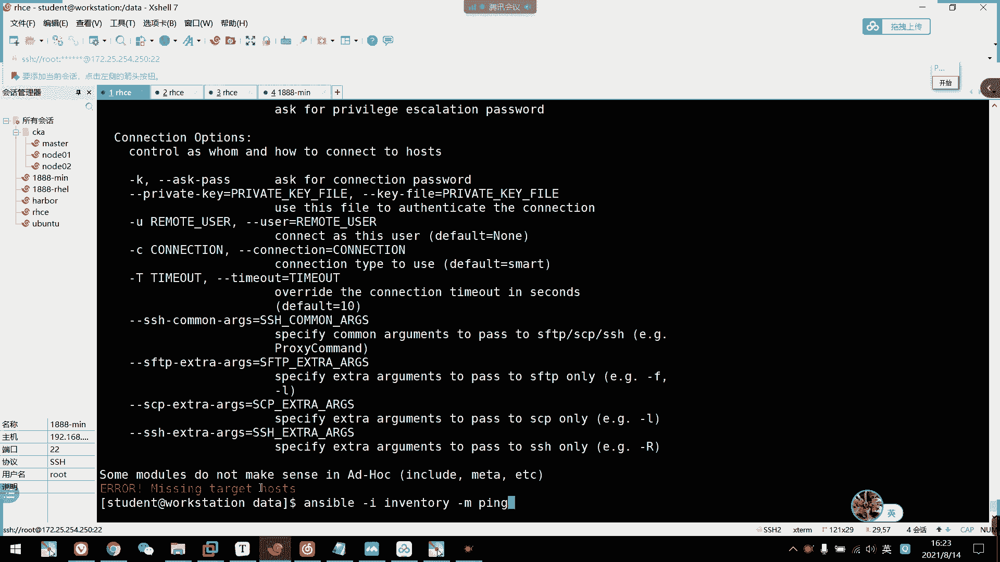
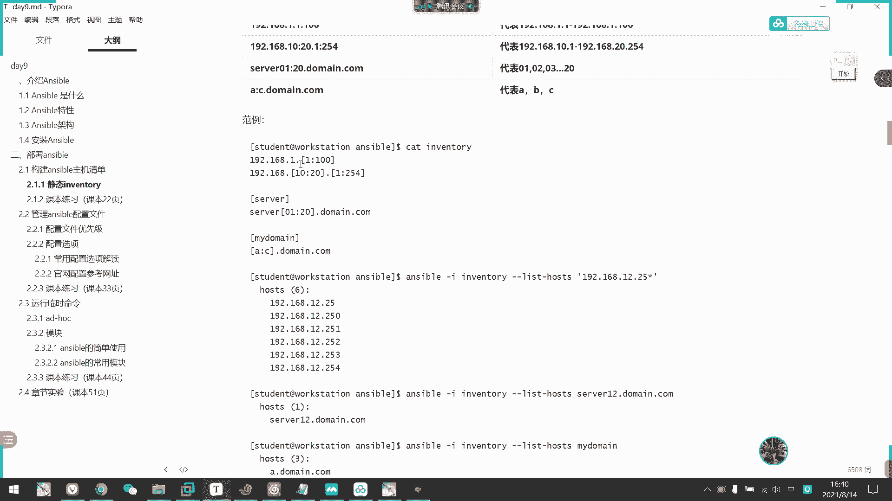
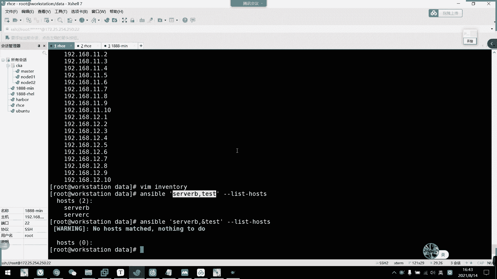

# 2021年7月新版-----RHCE8.2 RH124 RH134 RH294 认证课程 - P60：day11-3 ansible安装以及配置 - bili_15701050454 - BV1Gy4y1T7ug

啊，那我们接下来呢。啊不对，那我们前面呢。呃，关于。CSA的所有内容我们都讲完了，接下来我们就开阿G11的课啊。好，那我们要先切换环境啊，切换环境基本这么做吧。啊，我们要先把这个。

都关掉啊。呃。啊，把他们都先关掉。把卡送也关掉了。我跟讲。可以。还有我们那个。呃。切换。下把应该是。COURSE然后是啊H。

294。

我先把那个。先把那个。

我这个改什么了？算了，好了就保存。

对啊。不是重启变化，是它重启的时候呢，加载有问题。

😀呵呵呵。😊，还真的。

吃完了给你们。看在这里。

好了没有？好，切换好了啊。呃，那我先开机。直接来个付一下啊。我先重置这个。啊，然后。展现激极强大的时候来了。啊，S很简单的，就是操作有点多啊。就是他打的东西有点多啊，S我就是很简单的。

就我个人认为的话。会什呃会会会HCS一东西啊。学习一点问题都没有。我是床了笔记了，哎呀。S no。

忘了加密了。不用着急复习啦。对啊，不用着急复习。重听不是，应该说第二。应该说第二遍的时候啊。是我。是我们讲完辅导的时候才进行第二遍的学习啊。

你看我电脑没声音啊，这就跑完了，看到没有？是说展现电脑的强大了是吧？

OK那我们来拼一下啊。😊，刚时我已经起来了啊。这个该是闲了。What is this one I。

没听的话就要听。那不叫复习啊。他叫回顾。对。复习的话，我听了一遍，再看听第二遍才叫复习啊。而且你们。听的时候最好自己整理一下笔记啊，每个人的一个技肉手册都不一样啊。不要不要想着老师的笔记都。分好累了啊。

就。比较那个了。好，那我们直接开始啊直开始。呃。你节课应该。可以把我们这里讲到这里，应该可以，没问题啊。好，我们开始S始吧。😊，呃，Sible啊是我们的一个自动化运维工具啊。但是。也不是很自动化了啊。

它有一些前提条件啊，我们等一下再讲好，首先是呃如果我们要在50台。主机上面都安装上我们的一个engs啊PHP射口啊，这样子。我们一般怎么做啊，传统手法。啊，就写好脚本对不对？写脚本。

然后呢把它们传到50个G器去。但是我也没有一个命令可以操控50台服务器，同时去运行脚本，对不对？我们传玩还是要自己手动的一步一步去让他跑这个脚本对不对？那么我们这样子操作的话呢，那个效率是不是有点低啊？

所以呢。呃，而且我们校去执行的话，嗯，他有可能。这个机器。啊，50台嘛，我有可能是有40台能装上，然后还有10台啊，它要不是安9出问题，要不是HHP出问题，要不是马几克出问题。那么我们第二遍跑脚本的话。

它就跑不了了啊，跑不了的。因为它原有已经安装了一些东西啊，所以它跑不了的会有一些冲突之类的东西啊。但是我们S我可以完美的解决这个问题。能跑的他直接跑完。不能跑的话，他会先停止啊，然后告诉来一台。然后。

把那台电脑的一个环境啊，那那个服务器的一个环境给调整好以后呢，我们再用S再跑一遍啊。把所有主机都跑一遍也没问题啊，因为我们Sible呢，它存在有一个叫做密等性的东西啊。啊，密有些东西哦，我们后面再讲。

我们先了解有这个名词叫落密先。就说他可以重复跑，没问题。然后呢，他可以。批量的完掘任务啊，特别是从复性的工工作啊。啊，比如说我刚刚说的50台啊，都要做这H4服务啊。然后还要启动他们。

的确脚本是可以做到这样子啊，但是我们不能一键操作啊。啊，不能一件操作100台，就算一件的话也是100件，对不对？面对100台服务器，我们要啊做100次这个事情。啊。然后呃。

将某个文件拷到100台服务器上。啊，SCP也觉得麻烦啊，用霍旋盘对不对？用同学吗啊，也觉得那个啊而且他们IP不一定一样啊，或者是说那个主机名也不一定有相同的。啊，然后是。加新的服务器。呃。

我们都要做一个初始化，对吧？啊，然后也可以用S去给它做初始化也可以。感觉初始化用脚本也没问题，我觉得这个这个是多余的。但是他如果是批量的啊，批量的话呢啊批量的。服务器啊。啊，其实差不多。

可能时间会省一点点吧。因为我们啊每每到一台服务器，我们每一台服务器我们都要操作一个操作的。关于是什么操作，我们等一下就会介绍的啊。好。刚刚说的哦，我们S有这么方便的啊功能，对不对啊，强大又方便。

那么它到底是个什么东西呢啊？这是ensible。简样说就是一个配置管理系统啊。啊，它是需要SSH来访问我们的服务器或者设备的。所以刚才说。啊，可能我有多少台服务器，我要做多少个操作啊，操作就是什么呢？

设置我们的SSH。免密访问啊。好。他只要我们设好了SH取的美密就可以了。然后呢，它也不同于其他工具，他是用推送的方式，而不是代理方式啊。啊，不是用代理方说，它直接推送的。

然后呢它可以将代码部署到任意数量的服务器上了啊，直接推过去啊，所以它啊。首要是。无需代理。第二个是安全啊，利用SH啊，第三个呢它是直接推送。好，然后是。啊，然后是我们的一个S股特性啊。啊。

首先它是支持模块化。嗯。嗯，可以说。这个东西啊是我们S学习的核心内容啊。大家不是要写模块啊，而是使用模块啊使用模块。然后呢，这边有。三个万元啊，一个是PY样吧。要是premmo啊，micel啊。

还有一个金价兔啊啊，我们主要学的是这个安种啊。啊，然后他自自定义模块，这个就不说了，因为我们也不会去写这个东西的，是不懂啊。然后是啊这工具是基于pyython语言实现的。然后部署也简单啊不属于简单。

它就依赖于python了。就可以了啊，无去大理。安全基于SHH刚家已经说过了啊，支持我们playble编排任务啊。还有密等性，刚刚提到过了一个密等性的概念啊。啊，就是说他无论执行多少次。

他的一个执行效果都是一样的，不会重复带来意外的一个情况。啊，什么意思呢？我们比如一个啊我们就比如我们写了一个脚本啊，我们写了个脚本。那个问题我等一下告告诉你啊。发布问题。好。

比如我们脚写这个脚本啊啊是一口。啊，叉叉叉，然后它是追加的啊，追加到一个文件当中吧。就比如是这样子。要了我们每每一次跑脚本，那么。他是不是一直会追加，每一次跑它他都会追加一行，每一次跑它都会追加一家。

对不对？啊，但是SO不一样啊，SO啊，如果我是啊用的这个。啊，其实我这个例子不行啊，因为as手我的模块。他如果是追加的话，他也会自己进续追加。所以这个。例子不太好。啊，反正你你把它当成是S5里面啊运行。

我们也是一口。E狗叉叉叉。啊，也是到这个文件里面。啊，那么他只会改一次啊。所以改一次，我们每一次运行这个。命令过者是剧本啊，他都是执行这一次执行这一次啊。它存在于密等性，它不会一直追加啊。

我这个运行一一一遍，它定型是这样子，结果是这样子，它结果就是这样子啊，不不会一直追加啊，这就是我的密等性啊。好。呃，刚刚说了无税代理不需要我们的PKI啊，就是说不用那个证书了啊。可以用。

任何的编程语言去写模块，主要你会啊。啊，然后是支持我们的样母格式去编排任务啊，就写playbook的时啊啊，大概我们要明天才讲到playbook了啊。今天的话讲到AD后已经很不错了。啊。

然是它是较强大的多层解决方案。它的一个特性就这么多。那么然后我们看一下的架构啊，它是怎么执行的。呃，看这个图可能会好一点，看这个图。嗯。嗯。从这里可以看到啊。我们用户。啊。

可以通过呃1个AD house临时命令。啊，或者是通过编排我们的SF playbook。然后通过啊提提交给Sable啊，通过命令航工具提交给SableSable呢啊它会对应的一个接口啊，还有它的一个。

呃，资产清单。这产金单它对应的是我们的hosice。然后AD house还有这个SO。play book他。对应的是我们的models啊，所谓的模块啊啊这个就是我们所谓的模块。模干什么呢？

其实模块就是一个。我认为啊就是一个命令的实现啊，命令的实现。好。他通过资产清单。再通过网络。运行到我们的。主机里面。啊，完了推送过去啊。啊，通过模块将我们要做的操作推送到啊我们的数控主机里面。

然后它执行就可以了。然后插这个是插件的意思啊，插件我们很少用啊，也不是很少用啊，就是课程上面很少用。啊。这就是我们的S5的一个交育过程啊，这个过程。所以呢。我们通过这里。其实可以了解到他有。伤得好心啊。

一个是模块。嗯嗯。一个是SSH。还有一个是english。三得好先。来一个mod啊。🤧ok。啊，首先是OSS的核心啊，其实这个是指它的一个工具啊啊，然后是 modelsels啊，就是模块。啊。

贝就是插件。啊，后是pples就是我们的一个。呃。任务编排啊就任务编完ual就是自产清单。然后呢，hoss就是被管理的节点啊，我们把被管理的节点写到hostice里面啊。好。

那我们啊简单的了解一下我们的S架构啊。那我们看一下怎么做，首先是安装S。啊，这个也不难啊，其实不跑lab也可以啊，跑lab的话，它它的操作是把我们。主机上面的那些都呃已经安装过S5的，把它给清掉啊。

把它给清掉，让我也跑一下吧。我们先清掉了，等下安装的话，我们休息回来再再讲吧，我们先休息15分钟，3点钟。对啊。关于S5的安装啊啊，我们可以看到。

呃，刚我通过实验区把它给清掉了，我们现在去哦。我们。quangji at work stationation。工作中工作台意思。所以我们一般来说啊。把Sible的一个命令工具都是存放在这里啊啊。

让它作为主节点啊。我们可以看一下ensible ver。啊，没有安装啊，因为我们刚刚啊通过脚本把它给清掉了啊，它是默认装上了的啊。那么我们呃关键安装。其实它这里啊已经有镜像了。

所以我们这边的话呢直接安装就可以了。度啊，然后是。啊，直接安装就行。啊，这我们练习环境呢可以直接安装。啊，然后呢我们现在呃八版本的话呢啊，依然还是学2。8S52。8的版本啊。呃。

官方的快都出到新试版本了，但是他们区别区别不大的。还是以前2。4的时候。嗯，跟我们2。8相差很大，2。72。8都相差很大。好，那么我们就安卓上了。你啊，这也可以看到我们的一个。呃，版本嗯2。8。0啊。

然后它是依赖于我们的python3。6。8啊。🤧咳。好，那么我们看一下，如果要自己安装，但是么怎么做呢？啊，我们可以直接到官网啊，官网是dos。

点Sible。但他是国外网站，可能有点慢的。嗯，设计版的文档。Insttion。安装。啊，这里可以看到啊，你看它这里显示的是最新的啊，我们现在。嗯，就说要跨也是换到2。9而已嘛。啊，其实这个没关系。呃。

然后安装。install啊，然后再安装文档。啊，往下拉往下拉往下拉往下拉往下拉。啊，这里有一个instal on H yellow。啊，正常来说，它在呃斐洛上面呢可以直接安装。

因为呃我们这个仓库也是从斐洛上面拿下来的。嗯，vivo7跟vivo8呢可以从这个仓库来，原仓库呃安装一下这个就可以。然后呢呃vivos它都可以通过E批UR源啊，还有。呃，晒下来也行。

然后如果是其他系统啊，我伴图那些啊，建己看其他文文档啊，要我们点击加EP邀约。其实它也会跳动我们的fro的1个EBR而已啊。啊，那我就调到这里，要我们安装一下啊，选对应的版本或者是sds的。

我们就选sdows安装以后，它就会添加1个斐do的EEVR仓库而已。

以前还好一点，以前Sboard的话，它自己有个。我们仓库从网上面杀个II边包然拉下来下安装就可以了。好，因为我们现在就把这个EPR元给添加上了啊，直接安装就可以了。但是。DF。か和インスト。I那接。

🤧那什么？关键是怎么指定版本呢？说不指定。果电的话，它直接安装的是最新的。嗯，他就。在更新我们的fdora的离PR源。然后就自动安装。哦，还行，他现在装的还是2。9吧，2。9。他家装跳不跳不回去啊。

你看2。9的那还行。比较贴合我们啊目前使用。要它会通过依赖啊去安装。记得我们装的时候，一定要把我们的位啊，就是就是光盘给挂载上了，它这些依赖都是从光盘上面下下来的啊。这样就可以了，然后我们也开始S。

为什么？这就装好了，有没有什么工具已经装好了。啊看也是基于3。6。8，然后版本是2。9。20啊。比如说如果呃你们电脑跑不起来，呃，想自己模拟的话，也可以这样模拟啊。但是呃如果跑得起来的话。

我建议大家还是用我们的学习环境啊。因为他把我们的环境都模拟出来了，就不需要我们自己去。在模拟题。好，那么我们还是回到这里啊，安装我们已经。会安装的。

好，那么。比工具啊。有同具。当上呃清不清楚都没所谓啊啊，然后啊我们要想一下节点的问题啊，首先master啊就是我们的工制节点啊，所以我们就装在呃worktation上啊。然后呢。

我们的资产清单呢要对应着我们的一个。

叫什么来着？

啊，loads叫节点啊。What is Lous。工作节点呃，我们一般它已经建好了话呢呃。

室友。设AVCD4个机器嘛，对不对啊？设AVCD4个机器啊，我们这个环境呢一般都用这四个节点为我们的工作节点啊。

是吧。🤧啊，然后。主控端开版2。7或3。5，其实他自己啊通过依赖安装的。啊，然后这里是。备用端的。关你啊，然后2。4的话呢呃还要需要装我们的py成Cmailson啊。啊，随后接着来。看看出是微笑了。

不好意思。哎然后这windows不能做主分动啊。然后呢，备动端要开启SCD的格啊，需要安装我们的这个nveSD那 pass摄啊。啊，就是我们拍摄那个插件。官网地址刚刚我也输入过了啊，从官网看文档。

大家啊一定要学会从官网去看资料啊，以帮自己去了解这个服务的一个部署与使用啊。好，那么安装我们已经安装完了。接下来我们看一下S5如何部署。首先呢啊我们要构建我们的S博的主织清单。

呃，我们可以看一下啊，那边。杠QLS么。那我们拆分一下啊。嗯。SIB都E。嗯。RRPN杠QL。什么。啊骗。我杀了我。好，因为我们啊还是。敏感的发现啊，CF局配置文件。敏感的方现CFG是我的配送玩家。好。

其他的话先不需要怎么理解啊，不需要怎么了解，不是不是理解是了解啊，特别个。太多东西了，我们就不管了，我们敏感的看到我们的配送价，首先是EDC目录下的啊，然后是。呃。下面的。十节啊。好。

我们打开三保区后了。😊，🤧嗯，这边。都是他的一些配摄介绍啊。我们嗯首先要。了解的不多啊，我们学习了解的不多，就两个东西啊。You also divorce。dvos这块。这一块不是。一直往下。

其实他这些啊还有很多种用途，但是我们目前还不需要使用，学习也不需要。哎，不是说全部都有用啊。然后。第二个是我们的提圈。提确啊对。就这个。🎼啊，bread啊，这个很长，我没背过时啊，没背过下来。啊。

我做题的时候啊，或者是自己做的时候，从来都是直接把这个复制过来啊，一个是bent truee啊，becom。呃，提券的话，我们等一下再讲，我们先讲默认选项啊。啊，刚刚我们看到默认的快啊默认的快。呃。

有很多我们目前。也暂时用不上，首先是我们的一个指接端口啊，SHH的一个端口22啊，如果是默认22的话呢，我们这个项目不需要加啊。如果是基于安全问题，我们SHH的端口非22的话，我们这里就要改一下。好。

然后是evenventtu。🎼银水啊是指定我们资产清单的路径，指定资产清单的路径。然后是这个后面讲啊storeus。啊就是说说我呃。度以后提全到哪个用户啊？

输是然呢ask to pass是否啊这个速度是否需要密码。ask个 pass啊啊也是执行的时候是否需要密码。这个这两个一般都默认不加，默认不加就可以。好吧，这个要加。都有这儿。呃。

还有一个remoote user，我找一下remmoote user。往下翻。呃，这个roose pass我们后面讲，后面要用上，现在先不需要。啊，这里啊reroot user。

🎼文们的us就是说我们推送到的用户是哪一个？就是说呃工作节点。要跑任务的话，是哪个任户去跑哈？🤧咳。呃。基本上就这些，我们要关注的就是这些啊。呃，这里有个总结啊。

所以是呃。hosice还没接到，然后ro这个先不用管。啊，然后这个是命令的选办路径。有拍on的模块全放路径。把住文档在这里啊，刚刚的一个我们目前要关注的是这两个东西啊，有全的一个路径啊。

还有啊我们的一个配置文件的路径。好，我们先看配置啊，这两阶段先不看，先看配置。配置。反。配置。然后首先这配置文件呢啊默认是这一个安就是这一个，但是我们一般不使用啊。啊，我们一般不使用。为什么呢？啊？

因为它是优先最低的，要而且啊我们一般都会把它给放在一个工作目录里面啊。啊，比如说这个啊放在大前目录啊，然后如果放在加目录的话，呢，需要一个点啊点。当然如果说加目录的话呢，你只有这个用户可以使用啊。

对不对？只有这个用户可以使用。虽然说我们一般都是放在这里啊，大型目录啊，放在一个公众目录下面。所以说我这边讲述的主要还是这一个啊。主要呢还是讲这个，比如说。

啊，我现在在子直播间播，对不对？那么我们呃如果是。我们就MKDR可能是创不出来了，看下能不能创啊，pro不是。这个是。啊，我们说出来啊，以data为我们的一个S load。工作目录啊。

那我们只需要在这里写一个配置文件啊，叫做SO点CFG。然后把我们刚刚dposse写下来就以了。看到没？好，一方说。

然后呢，我们。然后我们啊看配置dosce有什么东西啊，而且我们这里啊还要注意一下，虽然呃的确可以通过环境变量定义啊，就是export。然后呃这个asible。confi然后等于什么什么什么啊。

其实它跟大前目录是一样，我只是指定一个目录而已啊啊，我只是把它指定的目录而已。啊，所以我们还是用这个比较好啊。直接把它写到里面去就可以了。啊。呃，我们主要看deer吧，刚刚在文件里面有很多东西啊。

我说了，我们主要关注的两个就是一个deforsse啊，一个是我们的啊提全啊priviage啊。啊，其他我们先不用管它。工作上有需要的时候我们再看啊，他基本上都会在默认的配置文件上面写全了那个啊注册上的。

他有什么功能都会写上来给你们。而且啊我觉得是茶话副文档还比较好一点点啊。啊，但是我们现在学习的话只需要这两个，一个是呃T恤啊，还有是de啊，默认的配置。那我们先解读一下dposse。啊。

刚刚我们说了啊一个有。默样的一完全笔是放在我们EDCS host啊，那么我们也可以通过啊荧完球这个选项呢把它修改到指定的位置啊。比如说我这边写了。

大屏部落。FVNTORY应该是等于嗯。A塔下的英文球员。可的。你有啲啦。啊，表示remoote。入手指定谁去使用，那什么。丢了。嗯，と。有色。其实这个如果加了提全的话，这两个要不要都没所谓的啊。

是因为我们自己设置的嘛，对不对？嗯。这是阿。但是。Do。Paス。其实这两项要不要都可以啊。我们啊目前的话啊用这4项就够了，目前用这4项就足够了。

我们把它对出来。嗯。这不能保存。呃，权限问题啊。系。所以一般呃喜欢把这个目录创建加目录下面啊，没有权限的通制。目前没有东西。嗯。我们是作为其他人是吧？加个W。哦，这。写这。好，我们可以看到这里有个呃。

被软禁了。好，然后我们接下来。其实这样子配置dforse的配置已经解决了啊。

然后呢，我们提前这里啊也写一下吧。啊，提全。这个删掉都是蛮好。呃，的确我们来解读一下事项都要写啊，事项都要写。就是说啊。become true啊是是否提全？啊，become most啊是提升的方式啊。

我们学要速度啊。然后becomeus啊，就是授权的用户啊，就个user授授权给我们的普通户啊，然后是become ask pass啊，提全是否需要密码。

那我们写一下，那么我们刚刚呃通过。这个文件啊我们定义了。inventual啊是放在我们当前目录下的一个evenvent域。那么我们就写一个invent就可以了。IMV EN。TORY啊。哎，不对。傻。

还没讲计算清单，不好意思啊。啊，还是配置问题啊，我们把提全也写上去啊，提全呃我是不会拼的，但不会拼怎么办呢？考试的时候也不会拼怎么办呢？很简单啊。直接找给我们的。不能见。然后搜出来。啊。

然后复制过去就好了。我拼我真的是不会拼啊，太惨了。记住一段时间啊，但是后来也挖了。直接复制过来就可以了。啊。然后我们这里啊become。是否提全啊？呃，这个空格要不要都可以啊。Be。ちっとは？

要示 become。优秀。ど日なろ。最后一个是ecom。あけ。靠。提出不上面吧。好，那么我们配置文件就搞定了啊。我们的配置只需要做到这里就可以了。那么我们刚刚指定的资产清单，我们把资产清单也写了。

资产清单怎么写？

🤧我这两题该分两种啊。一个是动态这离呢，一个是静态这离拉啊，但是我们课时主要是讲述我们的一个静态英关球啊。动道1万0米的话，我们后面会演示一下。但是啊它是通过python来实现的啊。

只是到时候我们实现呃用实验去啊随便演示一下。如果没有学过拍手的话，没有什么意义啊。Yeah。好，首先我们来看一下有没有选怎么写啊。首先我们可以写单个主机啊，单个主机可以是IP也可以设域名。

我们看一下怎么写嗯，VMIMVENTOIY。

然后可以写ID啊。啊，比如说我这边写个设备A啊。啊，一可。呃，我这边写了FQDN啊。我们要去看一下那个密码是多少才行，我也不知道密码。然后我我也看看一下IP是多少才行啊，我也不知道ID。呃。

好像有流水的啊，我们先看一下。那么sA的话就是。10啊。1722525010啊。What was it。把，要要写下呢，这就是尔B的好，那么去转移来就可以了。我们写完以后呢，怎么检验啊啊。

我们可以通过离职命令啊，叫做asible。啊。P。呃，刚安啊病。就可以。不对，然后突然间忘了什么录。为什么？哦，少了个。哦。诶，怎么了？都不了。可er。So。Hostice问题。As always。

 being run in whatever。They work with data。You not E S。There么 sauce。全身问题。我们改一下。是不。应该没关系啊。

我就得是我写配置文件写的有问题啊。索赔的文件是一个问题啊。我看一下。呃，他说这个是空的啊，所以应该是我拼错了他。看一下LVENDOYY。电脑下的IOVENTOYY。I MV， E， N P， O。

 RY。诶，没姐说啊。嗯，我们指定一下吧。S宝杠I。In what should。要是大概。嗯。Pple。我没有执行的广。

我好不顺利哦。看一下。嗯，之写单主机的。刚I指定这个订单应该没问题啊。Gu。

然后是。抗M指定模块。看一下实机模块没错啊。屁你没错啊。Mising targetet hostes。他说我这个hosice没有。

分组。很奇怪的。可以不分呢当主机呀。

都可以。我这个也没拼错啊。AN S，IB， L，E，ensible。哦，对，少一个哦。手个好。我以为指定自然清单啊，然后你后然后忘记指定主机了。然后他这里说什么呢？啊，being为 what。

You agree 에너지 test。Souce， for more。但是我刚才没有指定的话呢。都不行。为什么他锁空了？D， IM V， E， N T。I am V B， N T， O R。

Inventory。Data。下载IMVENDOYY。没问题啊。你们有看到问题吗？IMVENTORY。O are y。I M V， E， N， T， O， R， Y。对啊，我说我就说他为什么会跳过去？

哎VETOYY。DEFAULTS这里没拼错吧。defforce DFAULTS。First。哎，我真的是遇到问题是我。

等一下。配置。这么简单的东西没理由赔错啊。IM V E N T， Y， Y， default， D， F A， L T S。

我现在不在D塔下面吗？而家呢台做咩啊？当前目录只要运行，就读取这个备注文件啊。是图这个备用件。DEFA ULTS。IMB眼TY外。没有任何东西可以说吧。Ii， I am V E N T。都包我。

反正不行。Only local host is in。他说我这个这产订单是空的。就是他没有读取到我这个字，听到吗。It's been when。🎼不是，但是我现在在这里定义了嘛，他应该指向这个嘛。

明白我的意思吗？他现在读取的是这个配置文件。他当前要读取的是这个配置文件。明白吗？嗯。我去加木路吧。哎。再创一个S。NO点CFP可这个没问题。T恤我先不写了。我们这里就写两项吧，inventual。

等于。You完。嗯。要是。其他的不用，就这样吧。怎么写一个自然订单IMVENDORY。就写思维。这要求要点要。1后72点。250250。11。试一下。杠M。可以。应该是刚刚目录的问题啊。权限问题应该是。

他说我修改了呀。那我修改了呀。为什么？好奇怪。是吗。It's doing what。我了て哦。我知道他不能给其他人权限。所以刚刚要把它改成是那个da塔嗯。不是所有人是其他人。O减X应该可以了。对的。

5是要开始。呃。这样应该可以，我试一下。Before ask the pass version。你冇到。他这个将要移动移移种。但是为什么不通？Model。速度和pass is哦，我这里做了提全啊。

这个什么意思呢？啊，是因为我这里做了提全，它并不是它不同啊，而是我做了提全提全。然后呢它。

节点没有做啊，这个也是我要讲的啊。啊，我们来看一下啊，我现在在设A啊设，然后我们要配置速度啊，VI。让我们跳到用户那一行。U瑟是。都行吧。啊，主接是student。啊，刚开是他这个安全性问题啊。

其他人不能有。写权限啊。是的啊，然后是。哦，等于。哦。哎呀是low passport啊，注意这里一定要low passport的啊。哦。复制一下，然后是。个钟。然后我们再去下一个。VI。可以了啊。

再下一个啊。一定要每一台都要做啊，速速都还有SSH。这个先做了吧。虽然现在用不到啊。我以为他拼不需要权限的话，应该没所谓。可以啊。我再试一下。🤧嗯。呀，这样就通了。啊，因为刚刚是提全了。

然后他这里提示说这个可以不要了，这可以不要了。他这2。9的时候就会被删除掉。所以我们来把它删掉吧。这两个都可以不要啊。可以了。那我们这个已经做好了。啊，所以我们的配置。不啦，就这么点啊，就这么点。

提全也可以不写啊，提全也不可以不写。所以呢我们defosce其实现在啊首先最简单的应用就是一个remoal，就是谁去执行我们的asible。第二个是啊我们invent啊指向的是哪个位置啊？O。都给点。

好，那么我们继续往下。

那么我们就配置好了。配置好了以后呢。清单刚刚是单主机啊，我们已经拼通了啊，它这也是FQDN，一个是IP地址啊，也可以是非标准的端口啊，一个是非标准的端口。啊，然后是。呃，分组啊，关于主题分组。

首先是主主题组。

我们在一位水语上面定一个主名啊。可睇下 vIm。英文学名。哦。要不先把那个删掉啊。是的。那我这边啊，比如说我弄个DV组啊，然后我们这边写一个sryA。啊，或者是。再弄吧。加格收了。B了。

然后我们再分分割组交到测试组啊。就设了C。思文B。那么就晓了啊。首先我们呃中括号中间是主名啊，然后这里是中括号，中间是主名啊。好，我们sible。然后呢，O的话呢是所有就不分组了。

就只要清单中所有主机都会轮呃轮流的去执行一遍这个临时命令啊。那我这边直接弄个DV组啊，指定是DV组啊，那是该品。好，这也可以看到啊，它并的是是我们D一V左，是servA还有servB啊。

那么我们再看一下，试一下test组。Yeah。啊，他进行工作的只有我们收了CL设的D啊。所就说组一组啊对组啊进行操作啊，对组进行操作。

啊。呃，也可以这样子去查看清单，他他没有去跑，也没有去量。所以我。个人不喜欢就这个，他只是查看清单有什么东西啊啊，也不是说不喜欢。我们不一定要连嘛，有时候检查清单啊就要用的这个啊。

它这里直接是指定资产清单。然后呢，刚刚this host啊去把它给列出来啊。然后这个是主啊，我们看一下。

我们写个第一位。他就把我们的DV组列出来了。要示哦的话就所有吧。对。然后是t。啊，它这个呢只列出我们清单中的主题啊，但是没有去测试啊。我刚刚的话是直接去测试的啊。

也行。好。嘴主的概念啊。

嗯，他这个默认是有hosess啊。他默认是有的，所以我们不用自己收起啊。就是FQDM嘛。这个可点。只是他这个太强，我懒得输哦，我就说输一个短的FKDN嘛，输一个短于米。啊，OK啊，明白就行。

好，然后下一个概念。所个概念。叫做签到组啊。7了组。叫做什么呢？就主营加chren啊。

你是这个主是我的呃儿子。是我的子主。呃，哎。我要怎么定义呢？我看一下。好，那我们现在比如啊DVV9是4A。case组是设C。然后再加两个组啊嗯。比如说 balanceance。不感就很准了，是收了。

D啊再加一个。叫什么做好啊？嗯。这什么主好了？呃PHB主吧随便吧。骚臂。那么啊我们现在每一个组上面有一个主机，对不对？那么我们现在试一下这样子。嗯。我这个组叫做webs。啊，这个组。这是为个社会主。

有啦。😊，组里面。就是。主里面啊。是有我们的soerA，还有s入B。那我直接把BV读。还有PHB组加到里面去就可以了。好，那我们还是list。让我们看一下啊，rab server。好老虎。就说A个B吧。

对不对？🎼啊，这个要签到组啊，把组里面的成员啊放到里面去啊，把组里面的成员放到里面去。然它结合起来就是这个副组，就两个组加起来等于我们web server了，再就加到我们的一个嵌套组。

好。啊，这范例大家可以回去敲一下，虽然可以不联通啊，虽然可以不联通。我们直接通过list史的去把它列出来就可以了。主要是要知道这个逻辑。好。然后呢呃还有一个范围简化表达式啊。比如说呃。🤧开始跟结束。

不要。如果他前面的IP网都是一样的话呢啊，我们的范围是1到100啊，指定的是1到100。啊，然后这里。啊，是。10到20。的。1到254。啊，然后这里是server。01到20。啊，这里有了，看到没有？

啊，还有这个A到C啊，W是ABC的一个domminic啊。啊，简化。这边的话我看看时间有没有。

呃，可以这么想。啊，我们这个是连不通的主机啊，我们直接做一个演示而已啊，比如说192。168。给10。到1212，而且他都啊1点。要是1到10吧。不要写太多。好，等后我们list。第一V组。

他列不出来。嗯。要引起来啊。

嗯。要引起来。192。168。点1心点1心。

怎么不行呢？坏了。哦，忘了hold住他了啊，忘忘了hold住他了。

错了点。还要中国他扩起来。好了，我就不这个了，我直接看电影看这么多。三个网段啊。啊，从12。好的，从我们10。的1到10到12的1到10啊，是不是30个所以代表范围啊。

其他我就不演示了。大家可以回去看一下。下面的也是一样的方例而已啊。好。啊，然后是它支持模糊匹配啊。这么O啊，就是说我们要执行。这个时候。

比如说呃SO。哦。刚杠at least。Pos。嗯。没有这个选项哦，我是写错了。啊，对把他们所有列出来啊，哦是代表所有啊。啊，一个以指定组一组。其实跟刚才是一样，刚刚只是只是组翻到后面而已了。O谢谢。

Test住。呃，列出来，然后呢，我们可以。哦等于是新啊等于是新。我这个并不是说可以这样子写啊，还是说我们可以直接用新。去代表所有。也可以是魔鬼V啊，192。168点10点C。可以有，或者是这些。耀新呀。

那不就两个吗？啊冇会嘅。然后这里呢要也可带个新。

对唔对，仲有模孔面费。好，然后是我们那个逻辑或者是code匹配啊。呃。

我可一看。把它喝起来。呃，比如我这里写个servA呀。然后再加个组啊。太多了。哎，我没有说了A吗？not sorry为，我没写设为吗。看下有没。哦，没有收也不，是我的货。那就换一个了。只要射所逼的。

换一个组太多东西啊，换个t始组。Yeah。

啊，这不是呃设臂和我们的一个case了。这是。共同搞，然后你也可以某某与费啊，接受接受某某与费啊。啊，这是阔的意思。要是病啊并就是说都匹配到他才会执行啊。这个刚刚是呃匹配的话是有这个扩，这个他都会执金。

然后现在是都要匹配到他的执行啊。

比如说。呃。这这个按而已。

嗯， let's it头 do。不要逗号吗？要啊。

就什么了？色逼，还有我们的test为什么匹配不当呢？

射我。

Nothing to do。 No host message。So B so a C。哦，我知道啊，说错了。他说他的意思是什么了啊。他这个意思啊是我说错了，是同时存在啊，首先是设尔C。

如果它是存在基于我们的t的话呢。那么他就。通过啊明白吧？啊，刚那个是破啊，就是说破我们的特下没有主机啊，或者是有设币这个主机啊。啊，是扩的关系。然后呢并的话呢是主机与主啊，就前面为条件。

然后它啊同时在ts里面啊。对子。啊再是啊，如果是B的话，那就不行了。我也以看到。把这个收软C改成是收网C就可以了。同一时存在的。然后如果是改成D，他不在。就不行了。同时存在。

好，然后是非的关系下，就是说我这个不在。

这个组里面啊不在这个组里面啊，有插号。嗯。然后这个。哦，没有A，没有A，不好意思。这边吧。那就说毕吧。设尔杯不在这个组，如果设皮在个这个组就不行了啊。比如说我们设我C不是在这个组吗？

我也不行。啊这是飞啊。还可以多调节组合。他这个组，然后不在那个组。

啊，我试一下。呃，C。然后在这个组。表示。不在这个中。这不就可以吗，对不对？所以还通过这个条件啊，其实这这些用不上的，这个用不上的，说实话啊用不上。

啊，还可以支持我们的一个智能表达示啊，这个表示啊，我们在前面加个波的号，代表它使用智能表达示啊。我看一下。

五分？加个波辣哈。这是 server。啊，用扩吧。エーコビ。那么只有一个B，对不对？因为我们没有选送A啊。

这个其实也用不上啊，很少用。然后这里有课本练习啊，回去可以自己去做一下。就是。呃，他做了个清单，让我们去看了一眼啊，让我们去抢啊啊，还要我们去写还要我们去写。然后还要我们去查。O。嗯。这个还是练习来的。

那我们这场订单就讲到这里了，包括配置文件啊，我们也讲到这里啊。啊，提前注意事项，刚刚说了都要设置好对应的速度才可以啊。因为刚刚啊提了全指定的有速度，但是没有没有用啊，呃节点还没有配。

所以他们都是失败了啊，返回了一个失败值，对不对啊？然后配好了它就可以了。然后是否需要密码的话呢，就设置好对应的命令来设置就可以了。配送文件这边呢你也可以回去做一下这个练习啊。啊。

老师把那些都给抠出来了啊。这个我就不演示了，简单的东西我就不演示了。好。那我们还有。10分钟。算了不讲了，下课吧。首先讲过到什么东西。你是明天我们明天要讲。也VD还有。剧本我们明天一起讲啊。

大家回去可以看一下，也可以预习一下这个很简单的东西来的。真能点单。啊，还有整个战内的实验。啊，我们。今天就到这吧啊，十分钟讲不了什么东西。

