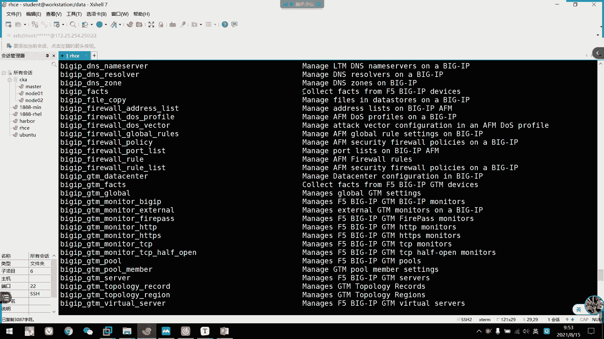

# 2021年7月新版-----RHCE8.2 RH124 RH134 RH294 认证课程 - P61：day12-1 临时命令ad-hoc1 - bili_15701050454 - BV1Gy4y1T7ug

那时先回顾一下昨天下午的内容啊。啊，首先我们讲的。Holdman。管理。容器寄服务啊。啊不是。管理中心就服务了有两种啊，一种是基于。ro用过。啊，一个是基遇。我关度。呃，管理员的话呢啊就比较简单了啊。

就是说啊首先。啊，创建一个游器。然后呢啊一。该。容器作为模板。生存。一个。Service。文件。怎么做呢？啊，虽然我拖的慢。然后s。C我弟啊是M的。嗯。刚刚那。是我们的 container。你。

我是刚刚fs。刚刚那把36。啊。嗯。刚刚那个。啊是指定。问题啊。然后呢，生存。文件的一。怎天呢。🤧咳。然后那个那。点service。匿名。然后是。Go fri。生存独立。在当前目录。生成。

service文件。啊，所以呢。嗯。🤧嗯。执行命令前。需要。切换到。咱们的EDC。system地下的stem。L是刚刚定了。一样。容器。在。服务。停止。10。删除。然后服务启动是。听建。啊。

那么生成好这个文件以后呢啊咱们需要。停止以及。删除。原来的。游气了。然后说是。5。开机。启动。那就可以了。啊，然后基于普通用户啊。接普任务呢啊步骤也是一样的啊，也首先。创建一个游器。啊，也是以。该。

游戏。作为模板。生层。设ice文件。嗯，步骤基本上一样噶。🤧咳。然后呢呃生成文件时。需要。切换到。加骨芦粉。加入录下的。D。咁 bigger噶。下的。System D。那要是优审啊。好。生成文件后。

需要重新加载。S。CTL啊，然后是注意啊，刚刚us。然后是A。你都。啊，昨天加载以后呢。啊，咱们。又弄一个叫做 log 。CCO。うん。Just some来。真面很难知啊。开机启动。叫什么来着？

lookingCTO。Enling。多了个猪啊。电几步。六。Looker。ALer。就是stem。这条。刚刚有色。都是因微猫。不跟了。嗯，指定啊service文件啊。好。🤧嗯。大家注意下一点啊。

普通用户。啊，创建。勇气济服。不能。数。が。或者。肉。好吧。对，一定要一。用户身份。直接登录。直接登录啊，什么意思？就要是。可以直接。收入。账号密码。登入中包。啊，或者是。こ後。就写写住。分都分到。

ok。嗯，然后是我们的S。嗯。Yesれ。🤧咳。S楼的。配置文件。可以是。默认的。配置文件。这般在我们的。EDC。Nible下等Nible。对，CFG啊。啊，都是。配置文件的读取。优先级吧。啊。

所以是环境。确定。定义。喂。最高。其次是当前。你。创建。35给CFG。表示用户加目录下。创键点。还有什么？相住。啊，最低为。默认。可这文件。好，然后呢配置文件。但是5的。主。修改我们的一个。明显35。

C。属于低栏啊。The4。又是 inventoryvent。指定。私场。清单的录制的。呃，Remote。有是。指定。工作节点。单什么的用口吧。后面那些都。在2点9版本以后都删了，所以我们可以不添加啊。

🤧嗯。后面的行不加我们最简单的默认两下就加这两项就可以了。然后是提全啊，提全我还是没有没有背起来。

完了开机了。

其实我这里有。叫什么来着？要知道这个要怎么说啊。在部分的配置文件上面啊复制过来就可以了。提全这是抵抗。等于。书。First是 force。是否。提确了。然后是比com。Look。都吧。一。堵豆。

方式齐全。打要是比坑。有是。提全。到。漏的。用库权。还要是becom。As。是否。需要。Xi。密码。进确了。嗯。啊，要注意一点的是什么呢？啊，如果。使用足度啊。需要配置。工作。节点的。中途。是否。

需要读密码。啊，如果需要的话呢，我们就要添加这个提取密码。好，那么呃接下来是资产。清单。别写。这是创建文件。配置文件。定义的。文件。鼻纸啊。然后有单主机。写法。可以是IP。啊，FQD。要是主机组。先行。

注明。啊，然后是。组类的。IP。或者是FQDN。然后是我们的嵌套组啊。小组也是先写主命。然后要个冒号固定写法啊。然后里面是呃。成员。15。救命了。比如说我们的1个DV啊。不说了，我些比如了。

就直接煮了煮面。Oh。基本上是这样的。列出。资产。清单的手机。啊，我们用SO。然后是。刚刚list。啊，然后是。Mr。 F。然后这里后面可以指定O啊。或者是。主机组。主机。啊，或者是。条件匹配啊。

要怎么匹配的话呢，我就不多说了。呃，可以是这里啊它可以加热。呃杠癌。指定多少清单啊。诶。保存。OK啊，我们奎哥就奎过这里了。

验证一下。Okay。あ修してた。

好，O。那我们从这里开始啊。

啊，临时命令啊，我们来运执行临时命令啊，什么临时命令呢？啊就是说我visible呢通常是使用我们的剧本来编写我们的一个任务机啊。但是有一些时候呢。

我们就用一些简单的命令呢可以通过我们的一个临时命令啊去执行推送啊，我们的asible。那么我们看一下啊临时命令，我们叫ed host。一是。那么它要怎么做呢？啊，我们看一下它的格式啊。

主要是我们的命令行对吧，是命令行工具asible。然后呢，是我们的一个主机匹配模式。啊，然后是杠M啊杠A指定模块model。然后是干A，然后是模块所要做的工作。可以是加个刚癌。指定我们的这清单文件啊。

啊，比如说我们昨天的啊我昨天的一个Sible。啊后是我这边直接所有啊，还要干MP啊。那么这里呢。就是我们的一个简单的。简单的1个AD host。它作用是什么呢啊？使用品模块啊，去到我们的。

市场订单里面所有节点。去查看啊是否能连通啊，是否能呃拼通我们的。呃，work station啊，就是我们的master啊，但是我这边不用op，因为我们知道听天昨天写的有点乱啊啊，用了一些范围的。

这边改一下吧。嗯，这里改为SH号了。怎么就这样。又再来一次啊。直接哦杠M。

然后呢我们返回的的话呢得到都是绿色的啊，然后呢返回则是pinpoint啊，就是他们的意思啊。如果是其他颜色的话呢，我们就要检查一下配置了啊。然后我们现在AVCD啊那个速度啊。🤧啊，手动的免密啊。

还有SSH啊。还有我们的一个。呃，网络连接啊已经是没有问题了啊，主机返回都是正常的。如果他。错误的话呢啊我们就要检查一下它的一个速度美密啊，或者是SC取的问题啊，或者是网络联通问题啊。就返过其他颜色的。

或者是有1个IRC的啊RC这是我们的返馈制啊。啊，只要阿C不是零的话呢啊。都是有问题的。那我们可以继续往下啊，这就是我们简单的一个模块的使用了啊，这里使用了我们的一个皮模块。

啊，然后Sbo。这个工具呢。嗯。我们可以直接S我刚刚微享啊，可以看到版本啊，昨天已经看过了啊，刚才A个高的是指定我们的一个模块参数。概验的话指定模块默默认的话呢是com啊，默认的是可。啊。

然后杠VV的话呢可以显示销售过程啊。然后杠VVI关于VVV的话呢是可以更加显。呃，更加详细的形事。啊，然后类似house啊昨天已经问了啊，就是我们那个显示日机列表。但系的话呢是只做检查啊，是大写的写啊。

就是劝，只要检查并不实行啊，比如说我们的一个d文啊。然后这里添加了一个操作时间。啊，或者是干u的话呢，指定我们的一个原程这些用户啊，就是我们的配置文文件中呃指定的remous啊。如果我们没有指定的话。

可以通过这里啊来指定。干带有就是优势。昨定是多的用户啊。隔逼的话呢就提全啊。下面的话就是T恤。啊，就实这些我们在配置文件当中都可以。配置的。啊，这个是呃SSH是501密码啊，这都是50要密码啊。

然后是呃。提全的方法啊，选择什么这样子。啊，这些其实我们在配置文件上写了就好了。好。那么第二个我就是我们的模块啊。嗯，我们S呢啊基本上都是使用模块，都是模块化的问题啊。

然后呃这个可以看到它一个转弯的位置啊。然后官方对呃我们的一个模块的。描述啊啊，然后是官方官方。官方把我们的一个模块分类的一个信息啊，其实要到。我觉得啊目前的话都不需要看啊，我们需要的话呃都不需要看。

但是我们学完以后呢，如果需要深入的更加了解其他模块的话，我觉得还是可以去官网去看一下的。🤧好。那么我们介绍一个强大的东西啊，就这个做的时候呢，完全离不开了一个东西叫是什么S do啊，S do。

我们到时呢啊杠L可以列出所有模块啊，我们可以看一下。

我那应该加个list。好，那么这里他就可以把我们所有的。都列出来。啊，这些都是。

啊，我们当前可以使用的模块啊，大家有点多啊。啊，当然我们一般都不会用nice啊。啊，大家这里注意啊，如果退出的话，我们要按Q啊，不要按ctrl加C啊，按ctrl加C的话会有问题的。我安P啊。

那然后呢，为什么说他强大呢？啊，对，这是呃文。

使可以使用的模块的列表啊。是模块列表。啊，这些都是模块来的啊，前面这些都是模块，后面的是模块的介绍。

啊，简单的描述。嗯。

啊，然后呢啊doss的强大之位是什么呢？啊，他可以提供帮助啊。

提供一个范例啊，比如说呃我这边。As么。どす。啊，如果我忘记了。一个呃比如说我们的一个经销仓库的编写啊，那么我们可以cre啊。呃。比如说我也忘记了那个啊不知道模块名字，那么我就大概的了解一下啊。

就大概按照自己的印象。那么我们有些销库是不是这样啊啊。然后是。那我就说个样子出来看一下。首要。然后我们就可以找到两个啊，一个是要啊。

然后可以看到他说嗯manageaging picks with the young pig manager啊，就是说安装包工具嘛，这个不就是。管理安装包啊，对不对？好，然后呢ywe。呃。

we博 jewelry吧，应该是啊we博。就唱过的意思，容易唱过那个ad or remove young。It was terrific it。Reipplejectries啊。啊。

就是添加或者是删除我们的一个软件仓库，对不对？啊，那么我们不知道他叫什么名，我就模糊搜索了啊，然后搜到两个，然后就找到自己想要的想要想要的东西嘛，就是我们要么仓库嘛。要么如果不知道怎么做呢。

我们可以这样子啊。我们可以S dos，然后直接加模块名啊。那么我打开U了。🎼他就会。好像面一样啊，只针对这一个模块。给我们提个关注。那首先他说啊这个模块是存坏在哪里呢？啊，然后是。

它的一个作用啊详细的描述啊，let move压仓库啊，然后是在我们的RBFbra。linux什么什么什么，你们这个老是也要描述一下。啊，然后下面呢是我们的一个。选项啊。选项啊。

然后我们一些选项看不懂没关系啊，我们可以看一些自己常用的啊。比如说我穿仓库，第一个是不是。呃，操库名字，然后是我们的base user路径啊。啊，然后是否启动啊，营业部的是不是有这个啊亏损。就描述啊。

啊，不对不对。아。啊，对啊，这是我们那个描述啊，就相当于是我们那个那个。我们样么仓库啊，是不是有个类？我们继续往前啊。哎后这里是fi啊，就是我们要创建的那个呃文件名叫什么啊。

但是我们可以直接不要不要输入这个IEPO啊，它会自动生成的啊，就是我们定义的fi name，然后它会自动结合点IEPO的，我们输入个名字啊。比如说DVD点IE标O啊，我们直接写DVD就可以了。啊。

你看GBG。缺ckkey啊。要是否启用GPG券？啊，这个CAK啊跟要跟密药啊，然后这里才是我们的GBGK啊。是不是。啊，然后可以定义这个文件的所组。那基本上啊我们用的都已经讲完了，对不对啊。

这里可以指定他这个文件的权限啊。🤧咳。啊，这个累。啊，这个令就是我们的一个呃中号破住的那个，就是我们仓库名字啊。对不对？所以那根这个呃我打开多一个中头吧。啊，比如说呃。我这边用不不用过啊。

我多打开下中路吧。不然你们看这个好像。说这个吧吧。Well。这个那。对照的是我们这个财务名字。啊，然后刚才说的disreion。描述。啊，这个di子亏损。这个手呢相当于是我们的这个呃内啊，是这个类。

所以呢。这个令呃的一个定义我们要注意啊啊，在模块中的令啊并不是这一行不是这一行。要在仓库中的这个那个呢这一行呢是我们的disc。啊，然后其他都一样，besus啊，是否营业部啊。

是否启用GPUcheck啊啊，其他都一样，对不对？一般这个其他模块的话，一般没什么作用了。但是啊我们这里强大的不是只会显示出我们需要用到的一些学项啊，强大的是往后看。啊，这里有个翻例啊。

基本上所有的模块都有翻例啊。啊，所以说啊什么干那。啊，这个概念不用管了，从这里开始啊。啊，我们的一个呃模块的选择。啊，这个我们到时候看学到play，我者知道这个怎么读了，其实也是一样的。

跟我们临时命令也是一样的啊。所以是选择模坏，然后是选项啊杠A，然后选项。啊，首要是那个啊这是。那啊就是我们的仓库名字叫disre就是我们那个呃生成关于P文件里面的这个 link啊。啊。

然后啊它的一个路径。呃，也有可能也可以是有其他的啊文件名啊文件名。啊，然后是是否启用GPU去啊。大家需要的放你这里基本上都有啊。这我看一下。其他的。

啊，我们看一下这个简论使用，刚刚也讲了，这接pin。嗯，那我们看一下其他的一个桥模块啊，刚刚。

🤧咳。创建仓库的话呢，我们留留一下作业啊。呃。留一下作业，就是在这个。机子里面呢我们写1个DVD呃，直接是挂着光盘的那个就可以了，它不一定要能使用啊，我就要生成一个文件，跟我们自己编写的一样就可以了啊。

啊，那我们看一下其他的一个桥模块啊，首先它默认使用的是我们的comma模块啊， commandma模块呢啊就是输入命令啊，让节点啊各作节点去执行这个命令而已啊。啊，到时这个。怎么说呢？呃。

可以说是跟笑是类似的，但是我们笑的话会比他强大一点点。啊，因为这个盒马呢我们看一下它。可以在load上面呢啊进入执行命令。然后呢，但是他一个。变量啊操作符号啊。啊，还有这个and啊都不能正常工作的。

就是如果需要使用，我们就用那个效模换。啊，S5默认不指定模块的时候，就用这个模块，就com慢的话呢，它希际上可以执行命令。但是如果我们要使用到一些比较复杂的啊，有一些特殊符号的那可能就识别不了啊。

无法无法正常工作啊。

所以我们有时候就要用到笑了。比如说我这边。S什么啊，我们指定。就一台机子。要是干com慢。呃，刚A做什么了？我们一口一个。到。呃，PS1吧。A， I B。Pssible。A到。要他诶。这人就行。啊。

但是他这里执行出来是不是有点问题啊，我看一下。你看他没有没有没有转移的。然后我们看一下效。返回一样的。啊，那就它可以识别出这一个变量。那就麻烦了，怎么做好了？呃。我们SS到。不过我刷的是我。

我定一个变量吧。应该可以读。这简单的辩段它可能读出来啊，所在不行了，自定义个。看他笑行不行？那效也读出来。不喜欢。是考虑面料。嗯。🤧咳。说刚定义的他。无法识别。杠A就是说要加入它的一个。前面一个模块嘛。

杠A的话是加入它的那个。

叫什么来着？Acuman。开见吧。叫什么？中文中文翻译这里有啊模块参数啊。🤧嗯。呃，变量和超符号。就以他有时候能正常工作。呃。

我们有重新下看一下。呃，用可先呃，比如说我一口一个hello。到。root下的。Test。太大都不能自信。哎看他这边这样走，我们看一下有没有啊。啊这没有，对不对？啊，没有。要我们用笑看一下。好的。

这里又没有房子。啊，然后我们这里。就创建了一个case子。所以其实。执行命令的话，我们用效就可以了。反正他们两个是类似的啊两个是类似的。都是手7比例，但是效的话呢，它可以识别一些操作符号。

诶然后咧。啊，这里你看它有个。有些变量读不了，好像那个window。刚才那个为什么能读出来，我也不知道。

把那个PS1怎不能读出来？哎看这里读了读了哦，用打底号啊。那就。不跑了，但以后。他是很毒的。啊，那我们要注意看什么时候用双引号，什么时候用单引号啊。

ok。啊，但是笑的话呢，有一些复杂的命令啊，他也会。失败的啊，比如说我们这里的。啊，要执行1个AWK的。工作啊。等一下我们这个多了是不能正常工作的，我们可以看一下这个病例啊。

好。多谢一下。那他。AWK这根本就没有工作出来，是不是？啊，所以我们那个。呃，我们那个笑啊也不是万能的啊，所以呢我们后面啊还有一个叫script的一个。

模块。然后呢，它是实现我把本地的脚本啊复制到原文节点，然后呢，在该语文节点执行这个脚本了。但是呢我们这个复制过去呢是放在临时目录了，我们执行完的话，它会自动删啊自动删除了，并不会说保存到那边去啊啊。

比如说我们写一看这个啊。

看来了。

算还是考啊。啊，比较复杂。

再说。其他明白选，然后是use。呃给。感铁曲。Great， okay。AWK。呃。嗯。然后是。群多少5。是不是这个？当时。It。多人。よ是。我看一下。DF。哦。这写不对啊。可以啊。诶。怎么取出列？

取消链。加个百分号看一下它取到第几列。空的。但是。应该是第六列吧。还是喝面。我数一下。DF杠哦，这里是刚取和少一类的1234。1234。第五类没错啊。啊，可以啊，取出来了啊，把钥匙取出来了。

那我们现在把这个。脚本传过去啊。我们就执行到设为A上吧。大打14。Sこ。感于。呃。搞忘的这个是不是要指定fire啊？

可以下。

啊，不要决定发吧。我不用写。直接写录径就可以了。我是da塔下的。嗯Yeah。然后呢，他丢大部分的设维。嗯。这不是从零开始，它只是打横列出来而已，没有排序啊，没有排序，它只是打横列出来而已啊。

它本来是这样。好。啊，然后啊如果说正常的话，我们的阿西的一员要劝举啊，是做改变的意思。看下他有没有一个。比如说要错误输出啊。

这什么shared collection to server a closed。后是standize啊。虽回来说吧，就干脆了一下。啊，然后呢标准输出啊标准输出。这是我们刚才要得到的结果。嗯。

t last就是速度这一行。啊，那么我就可以得到了这个，所以脚本可以执行掉我们刚才执行不了的命令啊，就这一个。

啊这些过于复杂的话，他就执行不了啊。好，让我们来看一下啊下一个模块啊。做泡饼复制。复制的话呢啊。他。这个复制呃有好有有有好几种啊，一个是啊比如说我们要创建一个口文件，或者是拷贝一个文件到那边去。

或者是直接。写一段文字生成在共同节点。的文件里面啊。这个我可以看一下啊，首先一个背靠。备看啊在覆盖之前约文件之前呢做一个备份啊。要色con。啊，用于替代我们的。呃，source就是提代源。啊。

可以直接设定指定的文件内容啊，也可以是。就是相当于呃刚刚就就是像我说的，就是一口到我们的一个重庆上的文件啊。然后dest啊，这个是比如下，就是目的地啊。啊，要将有文件复制到原来主机的一个绝对路径。啊。

如果原文件是一个目录，那么该路径也必须是一个目录。啊，就是其实这这句话什么意思？就说如果我是要复制目录的话呢，我们呃那个dest啊后面一定要设个目录，不要加加一个根号啊。

加一个根号的话呢会把我们里面的内容啊拷到里面去而已。啊，并不并不会把我们这个目录给拷过去啊。啊，然后这里可以设定为我们的一个权限啊。啊，fors的话呢是。如果那个。就就是说我们的工作节点啊啊。

比如说我要考一个文件。这话什么意思？啊，就是我要考一个文件啊，比如说我在呃work station啊，上面有1个F一的文件啊，里面的内容是hello。IL渗漏的节点里面呢，它又也有1个F一的文件。

但是它内容是word。好。那么如果我这把这个设定为y的话，它就会强制把这个覆盖了啊，就是说呃。执行完结果之后呢，这个呃n节点上面的F一的内容呢就会重默的转化成我们的一个hello被覆盖了。啊。

如果设定为O漏了。啊，设定为load的话呢，它就只有当目目标主机啊，就我们ro节点啊，它的一个destpa不存在看文件的时候才会复制啊。然后它默认是覆盖的默是覆盖的。啊，这个要注意啊。

好像是sources，source就是我们的源嘛。就是要复制什么到那那边去啊，就算是跟cont就。啊，source跟cont啊是不要一起使用啊，因为sources的话呢是指定文件的。

是指定文件的一个路径啊，可以自接的路径，也可以删对路径啊。啊，但是肯定时呢他是把我们的一个汇报内容啊拷贝过去啊。然后呢，它这个SRC的话呢，它相当于是呃类似于我们那个IRC啊。

刚刚我们说了用户复制目录的话呢，我们不要这个隔克结尾啊。因为加了根号呢，它是把我们目录的内容复制过去啊，不用根号的。你看看如果没有使用根号结尾。则包含目录在内啊，包含啊目录在内整个。内容全部复制过去啊。

然后是类似于我们的阿C。我可以看一下。Cpy。讲完copy吧，讲完copy就休息吧。啊，我们看一下copy。

打开错了。哎，什么？要是好像收了A吧。呃，是刚按选择copy模块啊。老示干。呃。我们直接开盖子吧。

小要TSD对不对？

唔听。CN贴的。点亮啊。加一个泪油吧，就hello吧。要追焦到什么？刚刚不是有个t文件吗？是不是太始，忘记是不是叫t死。啊，是要先生。就这样吧。我们可以看一下，s就是 five。在这顶的，然后是ro。

这个权谁都没改啊。啊，然后SCD个也有。原啊是它会从我们这里啊先生成一个临时文件啊。然后再卡过去，然后我们看一下这个ddes的有没有啊。那有T块钱我不得 hell能我的。对不对？好，然后我们再执行一次。

啊，对呀，他就直接是一个绿色啊。

啊，这是一个绿色。

因为我们没有改变，他就如果他只反馈绿色啊，然后没有劝阻，我们去这里劝阻啊，还有个success。呃劝举的话代表它有改变啊。如果是 successcess的话呢，由于密的性的原因啊。

导致它没有第二次时期不会再改变啊。啊，由于我们命令是一个原因啊，第二次执金不会再改变，所以它有一个绿色的反馈啊，就是一个success的意思。

Okay。哎，我们来看看。

拷贝文件吧啊。啊，也是一样。所以是送。说是哪个？我们当前路径呢。呃，刚刚的t等S下去吧。好，然后我在这里加一个。第于五录啊。因为我这个文件存在，对不对？所以我们这个fors漏的话呢啊它就不会考过去了。

对不对？我睇下。好了，直接写写写啊chanrenfor。他没有强制替换。那我先把它删掉啊，或者是直接改为yes吧。因为删它播值也是yes啊，他所以我们上不删也无所谓。你看这一次也改变了啊。

直接强制替换了。我看一下。对吧产制替换了。

要靠别的话，基本上就这些啊，其他的话呢。大家可以回去尝试一下，就备份了或者是指定我们的一个。呃。指定我们的一个权限也可以的啊，我可去试一下。那我先休息0分钟吧。啊，我们现在60分钟啊，上次都上课。

