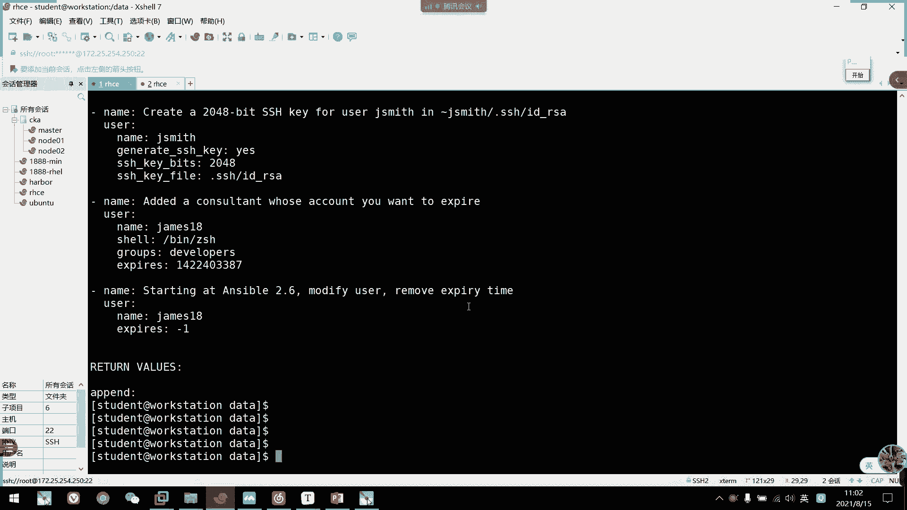

# 2021年7月新版-----RHCE8.2 RH124 RH134 RH294 认证课程 - P62：day12-2 临时命令ad-hoc2 - bili_15701050454 - BV1Gy4y1T7ug

好。该复制的话还要添加一个。

复制目录的时候啊，斜项不要写，注意啊，我们看一下它的一个区别啊，我们先弄个东西过来吧。随便考一个吧。快到了的。呃。说了。我们来。嗯。😊，呃。创建一个。🤧咕噜。这个。这试一啊。然后拷一些文件过来。

🤧考什么呢？随便考一些吧。呃。好okK忘了这样干R。让朋友们来看一下。我这些东西啊还有个ro。好，那么我们看一下啊花饼。点一下的t一我们加根号啊，先加根号。然后呃。我在这边也创建一个目录啊。Da塔好饼。

嗯。出问题了。嗯。Data for us。될 수 이。哦哦哦哦。我杀了我。啊，这边就卡过去了，我们看一下。🤧嗯。大一看我们就存放在toppy下面了，只有文件啊，并没有那个目录。好那么我先。

把它里面的链路先删掉哈。都删掉了。啊，没东西了，因我们现在不加根号啊。不要看啊来。看一下结果。还有这个啊，你看他又添加了一个目录，对不对？他会把整个目录录拷过来啊。加根号就只拷贝文件啊。

不加根号是整个目录拷贝过来。嗯，okK这就是我们的口碑。好，然后下一个模块啊是我们的fin模块啊。

F。啊，这个是可以创建目录啊，或者是我们那个文件啊，创建目录或文件的。啊，但是它比较多元化一点啊，就可以指定为它的一个组啊权限所有者啊，然后是呃目标的路径。然后是四府定位啊，这个只对目录有效啊。

然要瘦死啊。就是做软链接的这个。Best。啊，就是被软链接。的路径。啊，就是它这个STAT啊操作方法操作方法有什么呢？啊，我们有创建目录，创建文件，创建有链接，创建一连接。那可以是一个touch。

那么它就会创建一个新的文件。啊，如果他原有的文件或者目录已存在呢啊，最后就会修改呃。更新那个修碗时间啊，那么现在的话呢是删除目录文件或者取消。链接文件啊就相当于是I杠F是删除文件而已。虽然文先会成目录。

那我们看一下发有什么用啊，首先是呃创架库文件啊，创户文件我们用这个tuch。

那我们看一下啊S。还是4A吧。嗯，大概发有。Right。主先是创建控文件。Ps。root下的叫什么呢？啊，我们叫bb一吧。Moode。啊，等于我们的0644。真的。오떻엔야有녀 몇。从哪。感觉是我们的。

Stud。啊， group。等于我们的。Ro吧。どうす。等于我们的stdent。这个应该是。创建个文件，然后呢呃权限是0644，所有者是student，然后呢，所属组是我们的ro。

附加组是student。🤧呃叫什么呢？操作方法。嗯。我们写个cauch吧。说这个glu有问题啊。没有bl，应该它指定不了副加组啊。决定不了副药组。那我就把这个删了吧。没了回答去。아 그。

UID是1000，然后是GID是0。所以它的主是我们的这个root。🤧咳。然后他的这个权限啊，所有者我们看一下。所以说这被看了。放到哪里去？我把了放到哪里？入下的。road下的fi一。呀，这回出来了。

呃，644对不对？所有者的student。然后是锁主是我们的word呃，大小为0嘛，是控文件嘛，对不对？刚才创建的。So safari。好。😊，那么我们看一下创建目录啊。创建目录。呃，其实也是一样的啊。

路径是什么呢？然后我们这边创建1个DR吧。权限。755了。嗯。这边用默认的默认的话呢就是root跟root。就。那我们这边弄一个什么来着？Dory。啊，这些创建用户了，收入更户疼，对吧？嗯，我们看一下。

对，你这不是冲了一个科目录出来吗？就创建文件跟创建目录啊。

啊，你看全不录。我们看一下创建软链接啊，出软链接啊，就是要加一个source。あ、そうす。为什没有d链接到哪个文件。只有圆把它又配死了。我们看一下啊。

所以不用dest也可以。pri再一个。啊，这是链接文件啊。Good。原文件是哪一个呢？软件。比如说我们是EPC下的password。啊，然后是。等于link。装出来了，你们看一下。你看。

是是链接到我们的ETS码锁了？我看一下。对不对？好，这就可以创建我们的一个软链接了啊。一连接的话呢，我们可以自己看一下其他方面啊。我们给Sible。都。啊，这个Sbo到s。从头到尾啊。一直都要用的。

所以。大家常用啊常用这个帮助啊。他下面也有发你的。所以有说不需要记住他。下面的选项啊，我们直接看范例，它就可以得到它的结果。我们什么路径啊，所有者所有组啊，然后他的一个权限啊。对，他这里就可以了。

昨新有链接。看一下有没有硬链接的一个。Funny。好像没有啊。验睛应该是 hard的。我看下是不是好。不对不对不对啊，一连接是操作方式，用STAT指定号的。应该在这里这里方。我们看link。

先看link。你有没有看到那个？啊，不对啊。那个也是STAT下载。啊，一年级我想想。我们看一下这个贴体有什么啊，M是挂式删除啊。For the recovery。拍死。On mode。

touch啊啊哈 hard的话是创建一年级啊。我看一下FC赛吧啊，删除啊删除。嗯。我们把目录删掉。呃。删data刚刚那个copy啊，删这个copy。呃。data下的。Okay。然后是。对于。Oet。好。

我们看一下这目录是不是删掉了。哎呀删掉了，对不对？啊，所ab是删掉啊，删除卸载的意思啊。我们到后面呢啊也会常用的，要注意啊。

一个是person，一个是f。啊，很多会搞混了。因为这两个他在不同模块可能有不同的意思啊。但是这两个呢也在每个模块当中呢都是常中的。下一个是我们计划任务啊。管理计划业务呃，所以是可以对原有的计划业务。

做一份啊，然后是我们的一个。呃，指定文件啊。啊，然后是指定日小时分钟月，还有周啊，所以就是就是我们的分时日月星起啊，分时日月星起啊。啊，然后呢drop是要直接领用啊，刚刚才说过啊SAD操作方法啊。

person他才说过person啊，这个就有了，其实person就是创建的意思啊。啊，要是那个。另的话呢是对该任务的描述。啊，然后这里是指定什么时候执行啊啊，可以用我们的一个。特定方法啊。

就是说我们那个特殊的特殊的周期啊，就是说重启以后啊，昨天啊，不是啊，每年啊每年每月每周每天每小时执行啊。啊，stateate啊这里其实上面就说过了啊。啊，就是这个该用务是创建还是删除。

就是pro创建啊app set删除。啊，us审是以哪个用户的身份执行啊？我看一下范例啊。好，首先是。指定模块啊，然后是这个机关路的描述。啊，教育部员要说啊，然后是制定时间，它是每十0分钟执行一次。

没什么这接事啊，然后他工作的内容是什么呢？啊，输出一个hello。我们先看一下这个啊ro hellwork做了什么东西。

🎼那个它是呃把这个每10分钟，把这个显示到终端啊。写的到众多啊对，这个是写的众多，而且还会响啊。会分鸣啊。听到吗？有蜂鸣声。但是他会间隔不能那么快。大概5秒吧。好，那我们写一下这个。嗯。呃，这样吧。

我先。写一个。要他那么快执行了。这个。好オ。呃，我看一下。改可。啊，所以是类描述。我们用大泥号吧。因为里面需要用双引号的话，我们尽量外面使用单引号啊，注意啊。那个。This is test drop。

呃。

分钟有PLUNT是吧？啊，UTE。

这没5呃没5分钟吧。然后是。时间。每两个小时吧。要 drops。作定于。说一个。对呀。帮记速度贝卡吧。我看一下。Yeah。这不是加了一个吗？刚刚忘了breakreread卡。

他现在是直接加加到加到下面去了。加下回去。好。这也是我们那个添加激关任务啊，我们看一下是不是每两个小时啊，每每两个小时每5分钟之间，你看就是嘛，对不对？🤧啊，O。

那么就是定义机会任务啊，就是定义机关任务了啊，删除才能删除。我们看一下删除的话呢，它要。完整写呃完完整的写完，包括我们的令啊，我们看一下这两个。还在这个。呃，删除的话，我们就diable。我 do死。

呃，然后呢。他这里。没有完全写好，上面这里。下面这里没有完整信号。他会出事。嗯。然后我们再验证的话，他还有这个。我们验证一下吧呃。就用diableable是吧。

我们先不玩这些吧。🤧嗯。这个不要。表示。第 able。嗯。应该差了一个D啊。Disabled。好，O。😊，圈子错啊，然后是什么排量啊，什么 drops。我们看一下啊。啊，他现在是把这个给备注掉了。

那应该也对啊。那应该也对。那我们现在把它开回来啊。把这个注释删掉就可以了。哦哦，对，他他变成这样子了，变成这样子，看到没有？他把那个时间改了，我说应该有问题才对了，我们把它改回来啊。每5分钟。没两小时。

他把它里面那个改。嗯。哦，对。这个还是要注手啊。对他是个描述。嗯，怎么招我还在执行呢？怎么说吧啊，应该刚好5分钟了。啊。那我们再改一下。嗯，把我们原来的熟悉都添加回去。其实在后面加个DC我就可以了。

等于呃。也死。然后我们再看一下。行，这样子就保留原来的没有修改。就是说如果我们不把它写全的话呢，他就会。把他们那个时间都改成美啊。如果这里写的不对了，他就根据这个修改而呀，他就根根据这个修改。

这些注意一下啊。

好，ok然后我们继续往下删除。然后者禁用啊删除是呃呃用MC啊删除用MC啊。刚刚那个不是删除那个是金用嘛，所以只金用就是注射掉而已。上周的话直接是FC塞啊FC赛，然后是加我们的一个。

呃，描述就可以了，我们看一下吧。为什么我创建的时候不用加这个操作方法啊？因为它peror是默认值啊，所以不需要了。嗯，123了啊，坐死已经没有了，我友们看一下。没有了，对不。这就色彩的杀除啊。

Okay。好，然后是样啊。要么就安装。安装。然后它可以指定配置文件啊，其实不需要。然后是关闭我们的GPG权啊，也不需要记，这个其实不需要啊。好似冇嘅样啊第四部步嘅。

每个 i标诶启动个每个 i标 其这些都会动啊，其这会用啊。啊，同样是不是要用link啊指定我们的一个软件包的名称呢，就这个 link啊。还像是SCAT操作方式操作方法啊。呃。

如果是安装的话呢啊可以是person installed或者是las啊。person跟instore的就是我们默认安装。latice的是指定安装最新啊指定安装最新啊。

然后卸载啊卸载我们是a set或者是remove。这些都是可以值。刚刚说，然后默默认的话是per。More the person。

🤧好，那么我们来看一下。嗯。比如说我在那边安装一个。啊，我们就按装1个阿巴7吧。啊。🤧嗯。し。然后这里指定报名啊，是不是叫HTTBD。啊，然后是。啊，等于我们的一个。Psect。那就在执行过程哎。

写过了。怎么连的那么慢的感觉。好，那么他就安装完了，然我看一下。这个装出来。做起来了。或者就是安装嘛。他在不同模块有不同意思，也或或者就说创建的意思啊。指定安装文。这里没有啊。如果你是包名的话。

你可以指直接指定那个包的版本啊，要要要要安装到RPM的那个包的那个配配文件才行。这边就跟我们平常这样子一样么安装一样吧。啊，person的话呢就默认安装它的一个版本啊。如果你要指定的话。

你要把PM直接好像比比如说这个你直接把它个都要输进去才可以啊。

🤧嗯。啊然后我们继续往下。嗯，其实这个没什么好讲，要不是上安装，要不是卸载，然后exel，对不对？

搞不先。啊，person的话在不同模块不同意思啊，你就把它是创建了。拓建。好，O。都卸长。妥晒。

对。

O其他的话样母的啊没什么好讲啊，然后是我们的一个服务啊服务配置。服务的话也没什么要注意我，我们看一下注什么啊，一个是enable啊，一个是name的，一个是。State。

采用的是三格啊采用的是三个运行级别一般都不会在这里执行啊，虽然它可以指定运行级别啊。嗯，这里也可以让它再重启。就设定它的一个重启的一个间隔啊。啊，这个很少用啊，但是如果是批量的话呢啊。

建议还是加这个让它内存就。不用。过载了。啊，反正是CPU跟内存资源不用过载。🤧好，O我们看一下啊服务。比如说我把刚刚那个装回来啊。

不。那么我们要启动这个服务啊，当前它肯定是。关了，对不对？对说8的。好，然后呢我们看一下。其实这里不用改。这感觉service模块啊。设备是模块，然后名字就服务名称啊，就区PD。呃。

然后是STATEstate啊。stateate我们这里写。可以像个sstar比star还有stop啊。大的。enable的是什么呢？开机自启啊，这是开机自启。我先不加啊，我先不加。就直接这样子。

开始服务啊，这样就是直接开始服务啊。哎呀，哇，这么多东西吧？我看一下。做启动吗？然后他目前啊还不是开以之前。还会开就行，那我们现在把它关掉。用Sbo。这里感就stop这边。停止。那不是体了吗？好。

那么我们现在加个银业宝宝。那我们再看。你看他已经是开始之前。反正我们对service的操作就三个采用的就三个服务名称，然后的操作方法。还有他是否可以启动。有了。嗯，操作合法有3个啊，一个是开开启停止。

还有。呃，重启的。Okay。这就我们的 service。

然后是user，还有group。右手葫芦，我们看一下。有手。啊，所以是那的。啊，类的话有一个别名呃，就是它那个参数下有的别名叫入手，但是我还是觉得类比较好，把它们区分开哎，把它们区分开。好。

然后是创建用户。创电功呢呃，其实它这个选项跟我们的UCS差不多的。就是说啊首先是名字，然后指定它的效率型啊，然后他是否为我们的系统用户啊。有是可望，这里是它的一个叫什么来着？

负累啊负累其实就是它的一个描述啊。好我添加一下哦后直接复制这个吧。

不要说了。还是自己写有意思啊。Sible， sorry。价格啊user模块改A后中国名称啊，等于我们的。多手一吧。呃是销力型。要他。水冷老平嘛。啊，还是不要开呃，不能登录的啊。

指定为我们的一个系统用户啊，丢啊ssister谢谢。Yes。然后那个。复令复令我们不加了没什么意义。用务描述我们就不加了。好，那么它就算进了，然后它的主是9呃986，然后它的UID是990。

我们看一下啊。看到啊。嗯990986。986对不对？然后我们看一下它的消费型。在事刚刚的。冇攞见到你所咩我攞见。啊，佳布多斯后宫的手机。下在选项呢会不要加目录了，我们就自己开一下S部 dos就好了。

这边就不细说了。🤧好，这是卸载。啊，下来的话我们要加个屏幕啊，屏幕要相当于是我们的删除的时候呢，加一个杠R选项啊。系统就是系统中快，我都一个一个读出来啊，我都一个一个读出来，你还要问。😊，啊。

还可以配置它的1个SSHT啊。本这里。自己过就看好了，呃有个角色啊，卸载profer呀。怕什么都可以在这里地了。啊，这里是江木路啊，江木路。好正其他的自己看一下就好了。让大就简单的讲一下这个创建。

也要加，所以说系统用户是规定不能登录的。

他不是默认不能登录的。好，然后我们看一下啊，卸载删除用过啊，这是M3啊。我们刚才说的加一个呃remove啊，如果他没有remouff的话，就不删除它的邮件，以经加目录相关啊。我们看一下是不是这样子。

呃。删除了，让我们看一下他加入还在不在。야따 잡으로 할자对래。啊，所以我们加个录。把车屉回来了。要我们现在加一个。事不不符吧。收影幕放开下。Be move我 yes。lockfrank啊。

因为他没有啊。邮件没有。那我们现在看一下还有没有这个优。没有，对不对？

好。然后呢，大家可以指定我们的一个。

呃。主主啊还有反像主主啊那些都有啊，大家回去看一下啊，放力这里。啊，这里growth。是指定它的一个附加组啊，葫us啊有个S的是附加组啊啊，VS的话是它的一个主主啊。我们可以看一下的这里。🤧咳。呃。

咕芦啊，不要咕芦斯他的一个祖主啊。Pericua， Pericu。然后这里是它的一个附加组啊。

好像是主啊。穿的煮还稍微煮一点。煮的话更加更要更加少啊。添下附加主啊，或者是指定用户的组组都可以。🤧刚才是创建用户的。啊，然后是主啊。这个group是模块呀，这个是模块的意思啊。

然后它是作于添加组或者是删除组啊。哦。我看一下。呃，格模块的。他的请求就是我们的bl airbl delete或者是bl mode上个命那个。所以是。

它的参数有GID link啊t或者是stister是否会适用主。

好，我们也看一下拖节组，其实这个也一样的啊，S。Sorry。呃大概图。加A。要针内啊。比如说我们的腾克吧。诶。JD等于。105吧。嗯。系统组的。也是y思吧。哎哎，说错了。🎼好，ok这不是创了一个出来吗？

我们看一下天EBC下的图。这不是刚才创建了吗？啊，腾科。喂。这也看不到他是不是修主啊。这也就是创建的组，对不对？其实跟我们真的书命令是一样的。啊，所以不要想着S5多难了，实在不会就查查一下dos。

了解一下它的参数。那就说我想指定它的GIGID是多少啊，然后它是是否是系统组啊，这样子来卡一下就好了，对不对？然后删除啊也是一样的。应该也有一个目吧。开照有没有啊。他没有的话，他会报错的。

他就说没有这个吧。然后他有什么GID啊，local啊link啊啊。这些那就说他就没有了。好，那不删除了吗？我看一下。那不是没有这个主吗？OK。也是命你啊。

这是我们的明令命力。那么课本练习的话，大家回去要做一下，特别是章节练习啊，特别章节练习。我们总结一下，从配置。然后他这里。会从备置一直往下。啊，一直往下啊，到提拳。然后呢，再做一些临时命令啊。

比如说是呃让你做一个。我家就把。啊，就把一句话。从定向到一个文件里呀，然后通过com来查阅一下这个文件啊。大家可以去得做一下，记得我们做完要清除啊啊做完要清楚啊。

这个net本的fin finishish了。所以我们在实验的量百分的时候，它会有评论。如果是。啊，这里没有皮肤好像是。他不是每一张都有地方，有一些有吧，有一些没有。Okay。然后课本练习的话呢呃这是。

小结实验来的啊小杰实验。大家可以回去弄一下，这这边就有无吸甲。

不是放错什了。然后。

我们先休息10分钟吧。