# Ansible临时命令实战：P62：day12-2 临时命令ad-hoc2

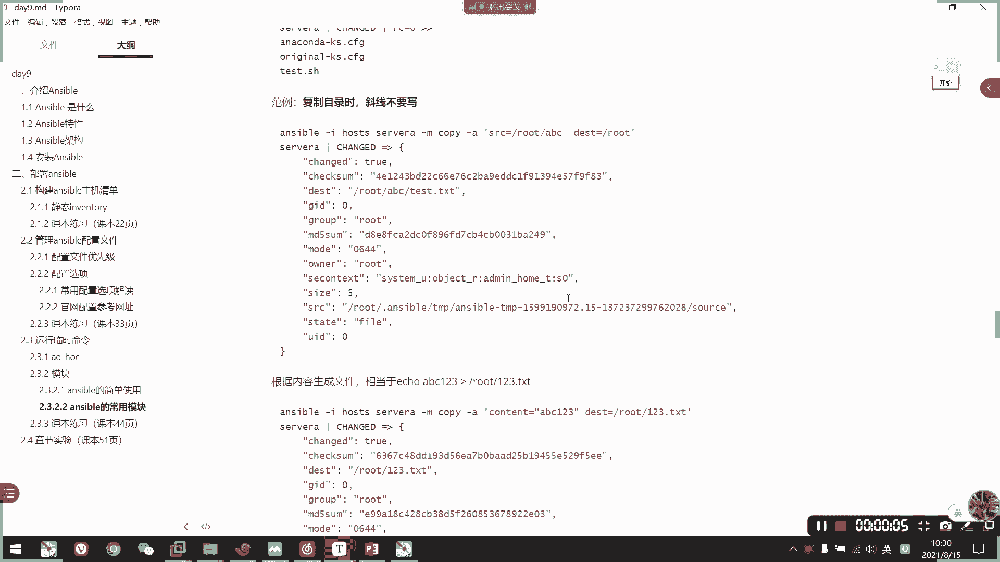

在本节课中，我们将继续深入学习Ansible的临时命令（ad-hoc command），重点介绍几个常用模块的实战操作，包括文件复制、文件管理、计划任务、软件包管理、服务管理以及用户和组管理。通过具体的命令示例，帮助初学者掌握这些核心模块的基本用法。

---

## 复制模块：copy

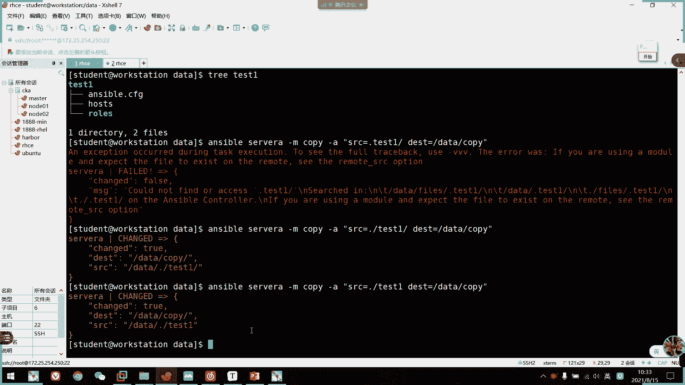

上一节我们介绍了Ansible的基础概念，本节中我们来看看如何使用`copy`模块复制文件或目录。

`copy`模块用于将文件从控制节点复制到受管节点。一个关键参数是`content`，它可以直接定义文件内容。另一个重要区别在于复制目录时，是否在源路径末尾添加斜杠`/`。

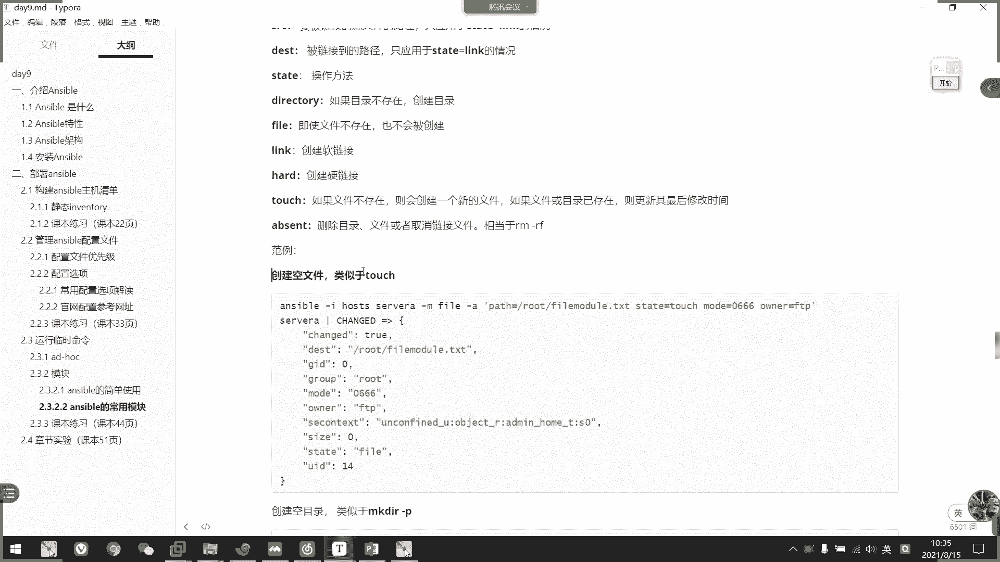

以下是`copy`模块的核心参数和行为对比：

*   **`content`**: 直接定义文件内容。
*   **源路径带`/`**: 例如 `src: /tmp/test/`，表示只复制`/tmp/test/`目录下的**所有文件**到目标路径。
*   **源路径不带`/`**: 例如 `src: /tmp/test`，表示将整个`/tmp/test`**目录本身**复制到目标路径。

我们通过一个例子来验证。首先在控制节点创建测试目录和文件：
```bash
mkdir /tmp/test
touch /tmp/test/file{1..3}.txt
```

然后执行以下两个临时命令观察区别：
```bash
# 只复制目录内的文件（不包含目录本身）
ansible all -m copy -a "src=/tmp/test/ dest=/tmp/ dest_dir_with_slash"

# 复制整个目录
ansible all -m copy -a "src=/tmp/test dest=/tmp/ dest_dir_without_slash"
```
执行后，检查受管节点的`/tmp`目录，可以看到`dest_dir_with_slash`下是直接的文件，而`dest_dir_without_slash`下是一个名为`test`的子目录。

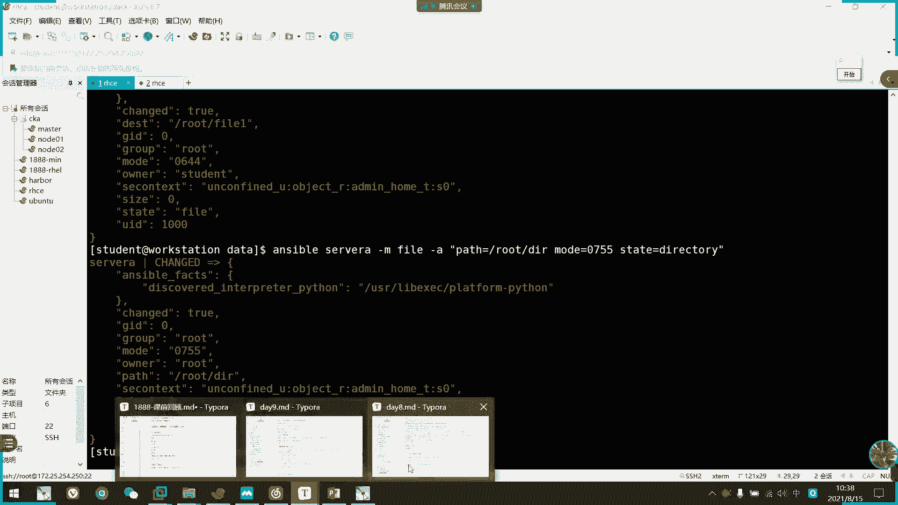

---

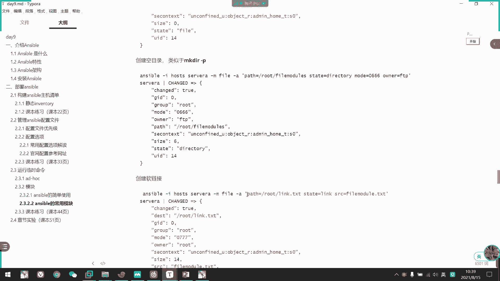

## 文件管理模块：file

接下来，我们学习功能更强大的`file`模块。`file`模块不仅可以创建文件或目录，还能设置权限、所有者、创建链接等。

`file`模块的常用参数如下：

*   **`path`**: 目标文件或目录的路径。
*   **`state`**: 定义操作类型，是核心参数。
    *   `touch`: 创建空文件，或更新已有文件的时间戳。
    *   `directory`: 创建目录。
    *   `link`: 创建软链接（符号链接）。
    *   `hard`: 创建硬链接。
    *   `absent`: 删除文件、目录或链接。
*   **`owner`**: 设置文件所有者。
*   **`group`**: 设置文件所属组。
*   **`mode`**: 设置文件权限（例如 `0644`）。
*   **`src`**: （当`state=link`时）指定软链接的源目标。

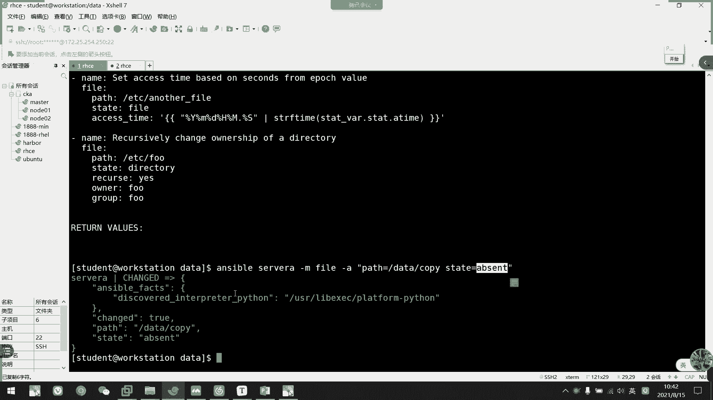

以下是几个具体操作的示例：

**1. 创建空文件并设置属性**
```bash
ansible all -m file -a "path=/root/file1 state=touch mode=0644 owner=student group=root"
```
此命令在受管节点的`/root`目录下创建一个名为`file1`的空文件，权限为`0644`，所有者为`student`，所属组为`root`。

**2. 创建目录**
```bash
ansible all -m file -a "path=/tmp/mydir state=directory mode=0755"
```
此命令创建目录`/tmp/mydir`，权限为`0755`，所有者和组使用默认值（通常是`root`）。

**3. 创建软链接**
```bash
ansible all -m file -a "path=/tmp/passwd_link state=link src=/etc/passwd"
```
此命令创建一个指向`/etc/passwd`的软链接`/tmp/passwd_link`。

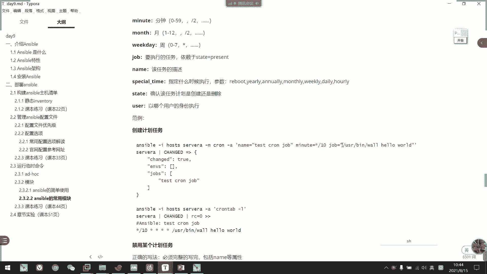

**4. 删除文件或目录**
```bash
ansible all -m file -a "path=/tmp/dest_dir_without_slash state=absent"
```
此命令删除之前创建的整个目录。使用`state=absent`进行删除操作。

对于不熟悉的模块或参数，可以随时使用`ansible-doc`命令查看帮助，例如 `ansible-doc file`。

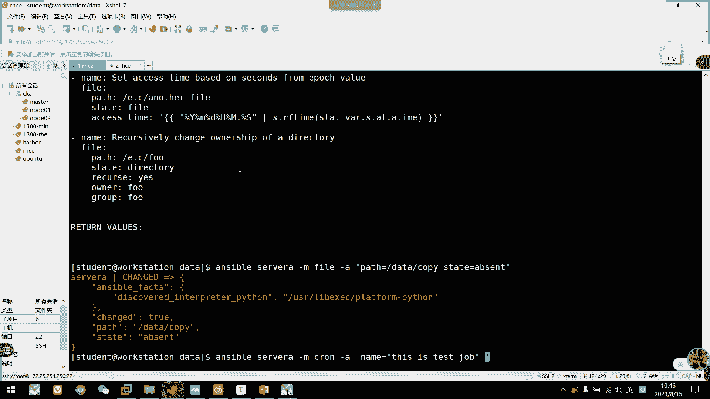

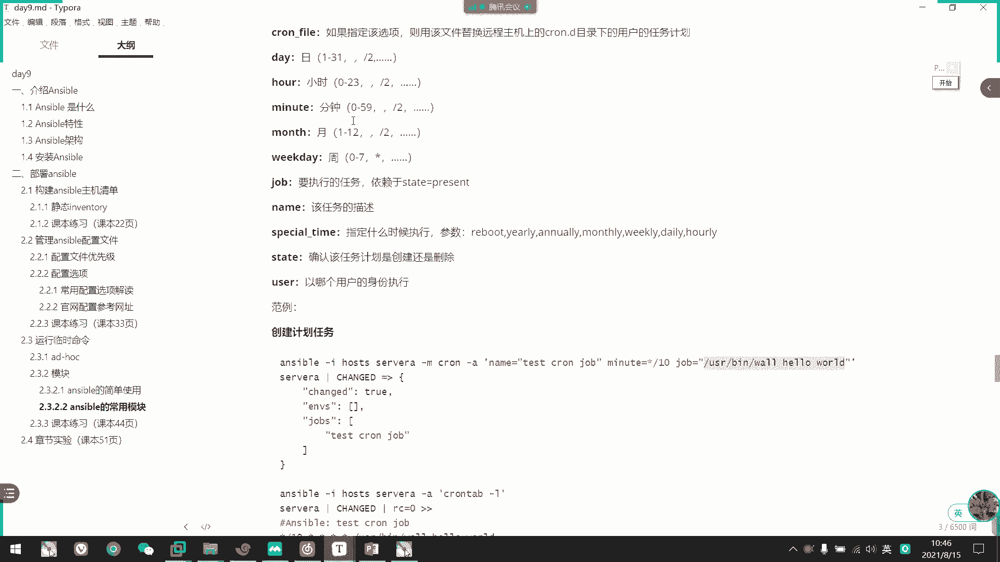

---

## 计划任务模块：cron

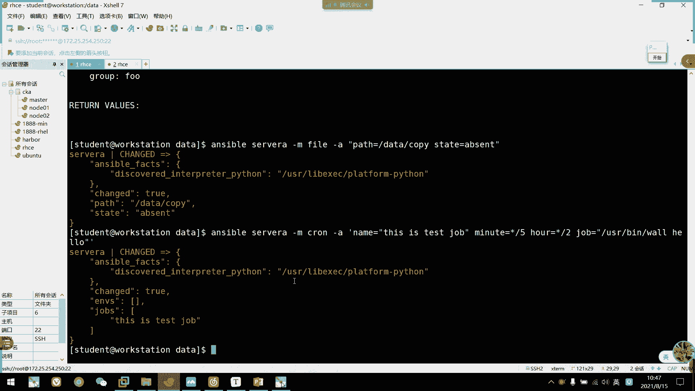

现在，我们来看如何用Ansible管理计划任务，这对应的是`cron`模块。

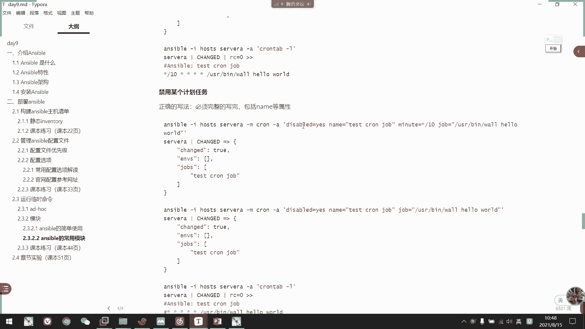

`cron`模块用于管理cron计划任务。其核心参数包括：

*   **`name`**: 任务的描述性名称（注释），必须唯一，用于标识任务。
*   **`job`**: 要执行的具体命令。
*   **`minute`**, **`hour`**, **`day`**, **`month`**, **`weekday`**: 定义任务执行时间（分、时、日、月、周）。可以使用 `*` 表示任何时间，或特定值。
*   **`special_time`**: 特殊时间关键字，如 `hourly`, `daily`, `weekly`, `monthly`, `reboot`。
*   **`state`**: 任务状态，`present`（创建/更新）或 `absent`（删除）。
*   **`user`**: 以哪个用户的身份执行任务（默认为`root`）。

**添加一个计划任务**
以下命令添加一个任务，每5分钟，每两小时执行一次，在终端输出“Hello World”并发出蜂鸣声。
```bash
ansible all -m cron -a "name='test cron job' minute='*/5' hour='*/2' job='echo -e \"\\aHello World\"'"
```
**注意**：由于`job`参数内的命令包含双引号，外层使用单引号可以避免冲突。

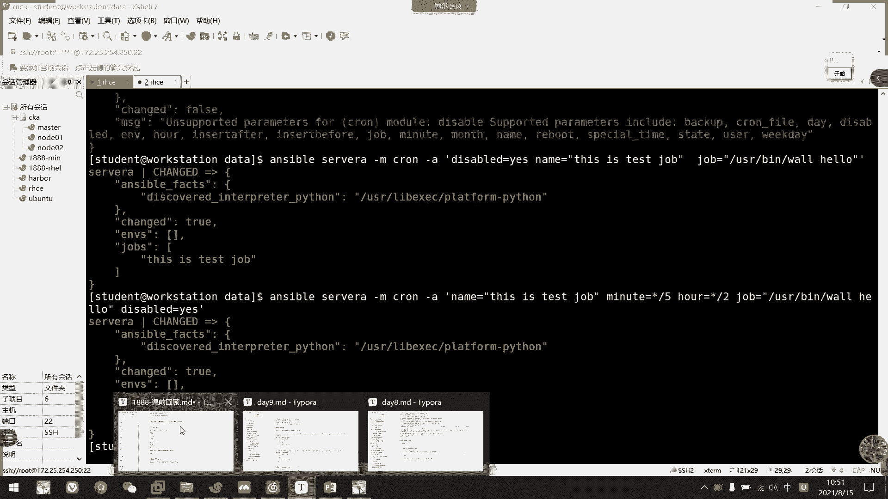

**禁用和启用任务**
禁用任务并非删除，而是将其注释掉。
```bash
ansible all -m cron -a "name='test cron job' disabled=yes"
```
要重新启用，将`disabled`设置为`no`即可。
```bash
ansible all -m cron -a "name='test cron job' disabled=no"
```
**重要提示**：如果更新任务时不完整指定时间参数（如只写了`name`和`job`），Ansible可能会将其他时间字段重置为默认值（`*`），导致任务执行频率改变。因此，更新时建议提供完整定义。

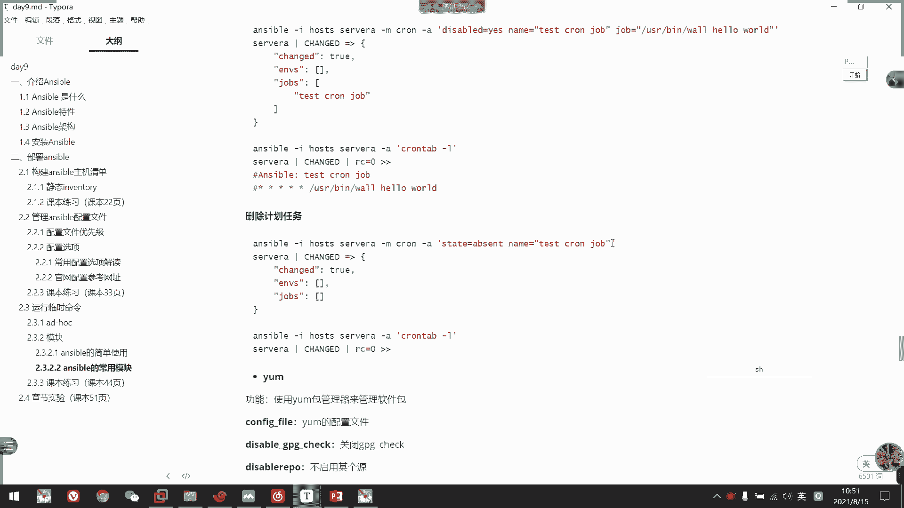

**删除计划任务**
使用`state=absent`可以彻底删除任务。
```bash
ansible all -m cron -a "name='test cron job' state=absent"
```

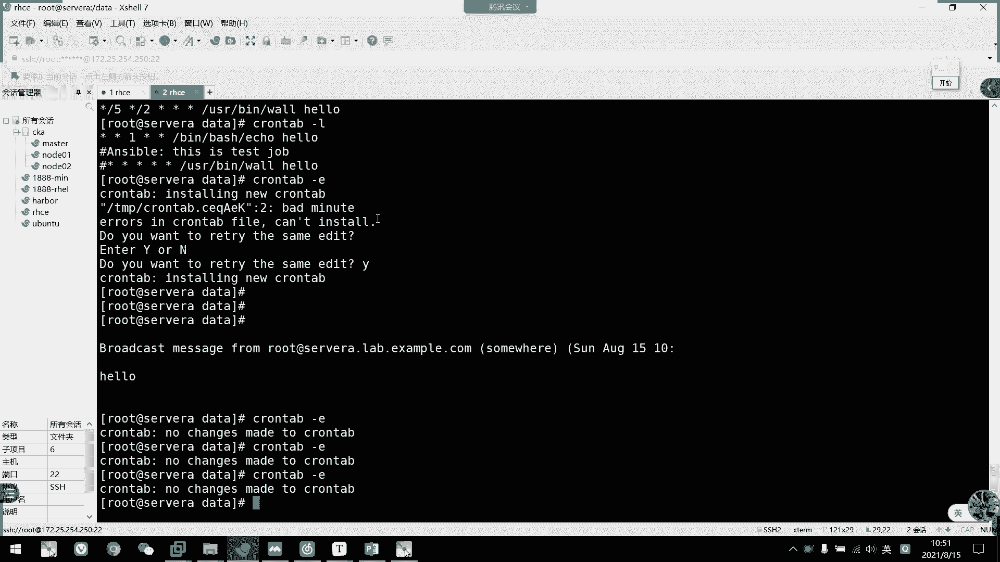

---

## 软件包管理模块：yum

软件包管理是系统运维中的常见操作，Ansible通过`yum`模块来简化这一过程。

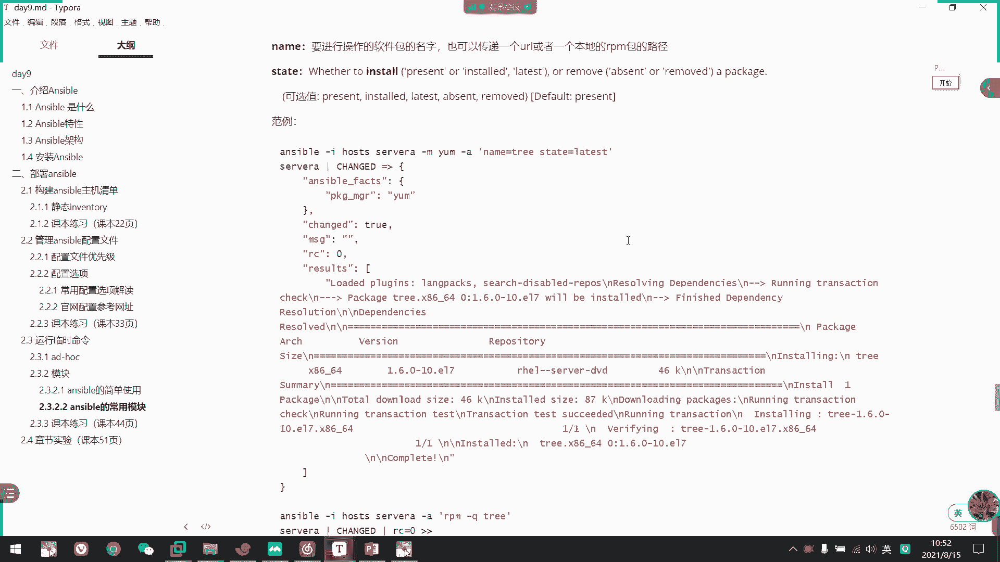

`yum`模块用于通过YUM包管理器管理RPM软件包。常用参数如下：

*   **`name`**: 指定软件包名称。可以是一个包名，也可以是包含完整版本的RPM文件名路径。
*   **`state`**: 定义操作。
    *   `present` 或 `installed`: 安装软件包（默认安装仓库中的可用版本）。
    *   `latest`: 安装最新版本。
    *   `absent` 或 `removed`: 卸载软件包。

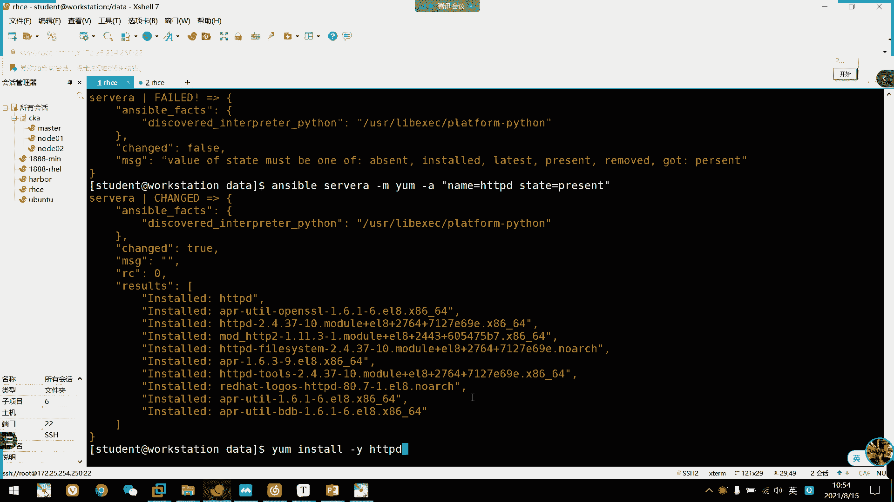

**安装软件包**
以下命令安装`httpd`软件包。
```bash
ansible all -m yum -a "name=httpd state=present"
```
如果要安装特定版本，`name`参数需要指定完整的RPM包名（包括版本号）。

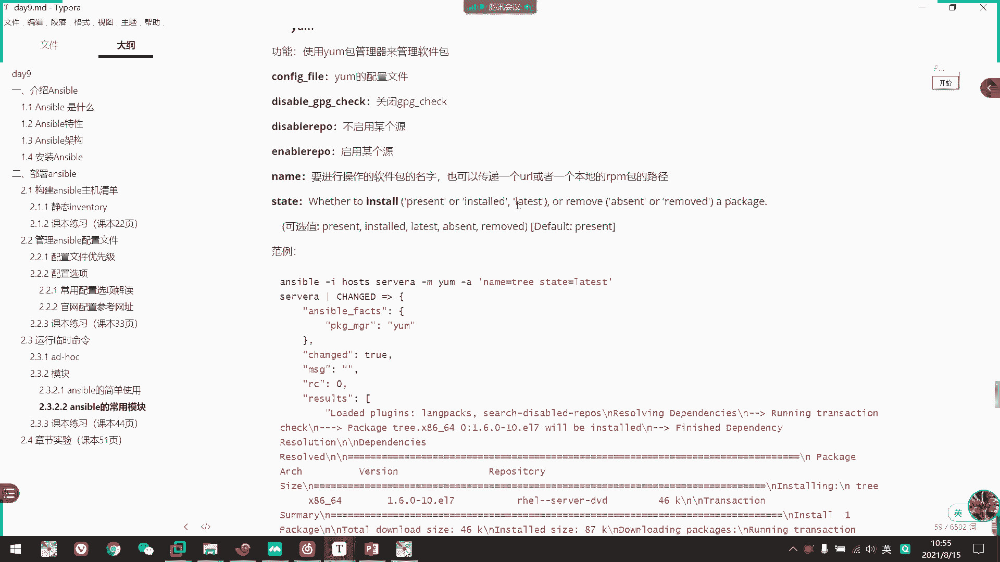

**卸载软件包**
以下命令卸载`httpd`软件包。
```bash
ansible all -m yum -a "name=httpd state=absent"
```

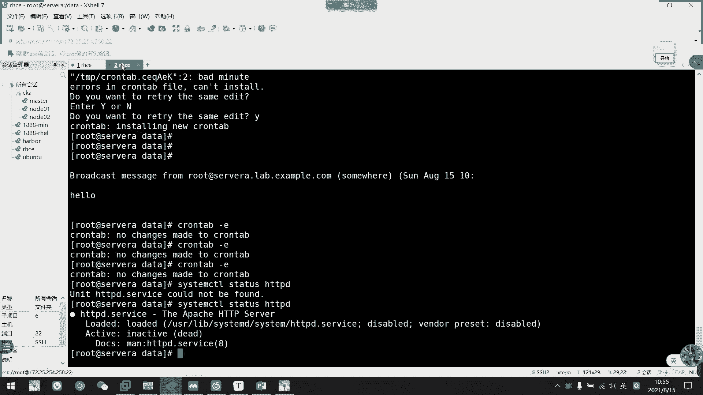

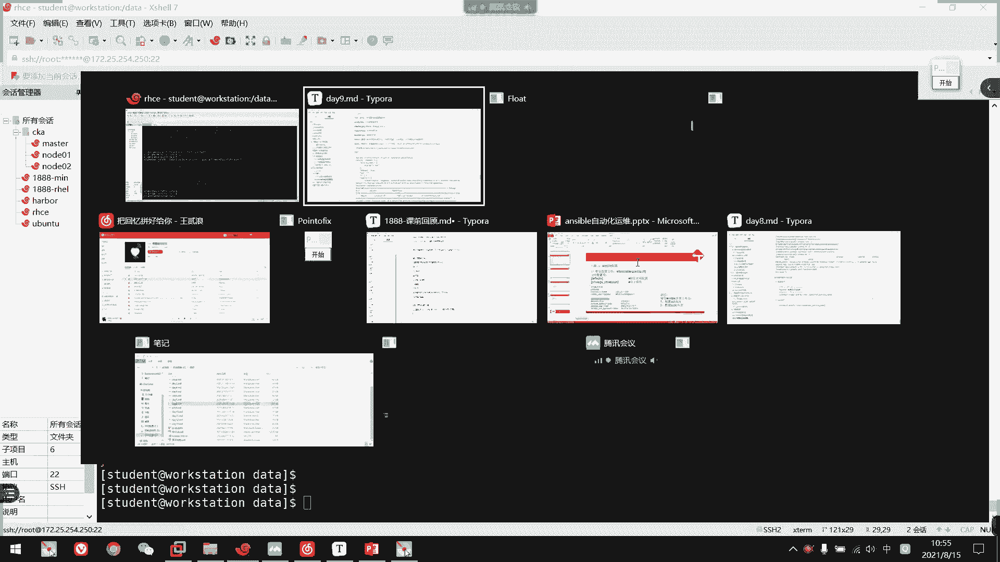

---

## 服务管理模块：service

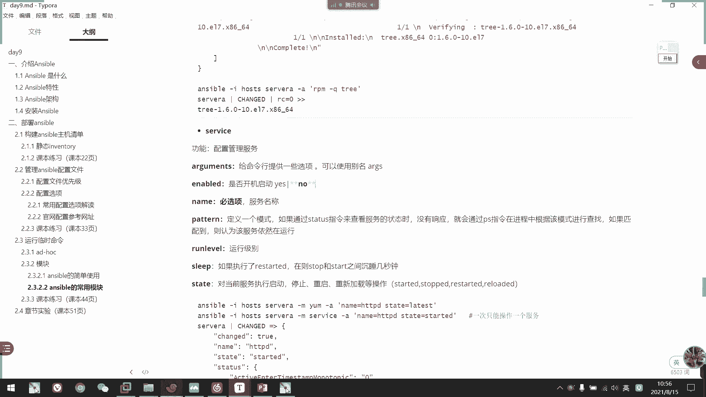

安装软件后，通常需要管理其服务。`service`模块就是用于管理systemd服务的。

`service`模块的核心参数很简单：

*   **`name`**: 服务名称（如 `httpd`, `sshd`）。
*   **`state`**: 服务运行状态。
    *   `started`: 启动服务。
    *   `stopped`: 停止服务。
    *   `restarted`: 重启服务。
*   **`enabled`**: 是否设置开机自启（`yes`/`no`）。

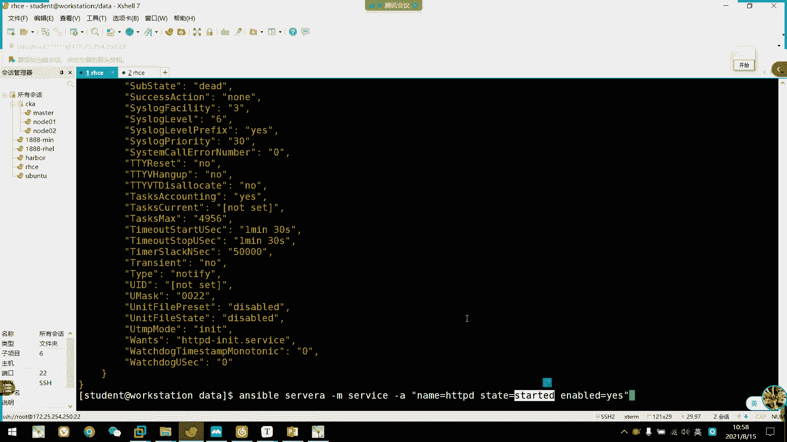

**启动服务并设置开机自启**
以下命令启动`httpd`服务，并设置为开机自动启动。
```bash
ansible all -m service -a "name=httpd state=started enabled=yes"
```

**停止服务**
以下命令停止`httpd`服务。
```bash
ansible all -m service -a "name=httpd state=stopped"
```

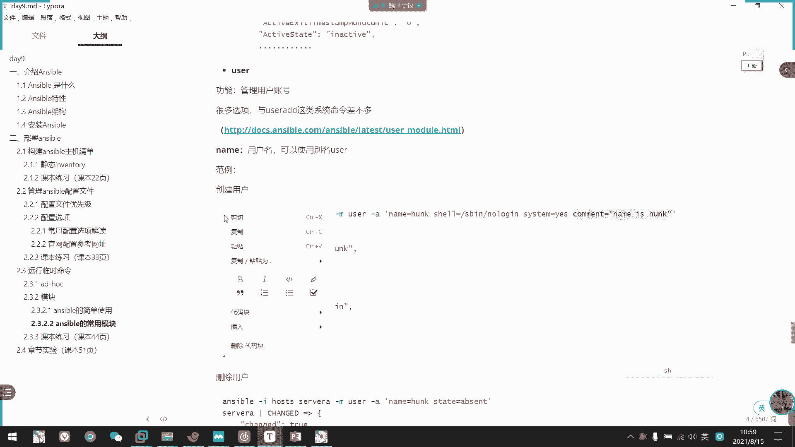

---

## 用户与组管理模块：user 和 group

最后，我们学习如何管理用户和组，分别使用`user`和`group`模块。

**user模块**
`user`模块用于管理用户账户，参数与`useradd`命令类似。

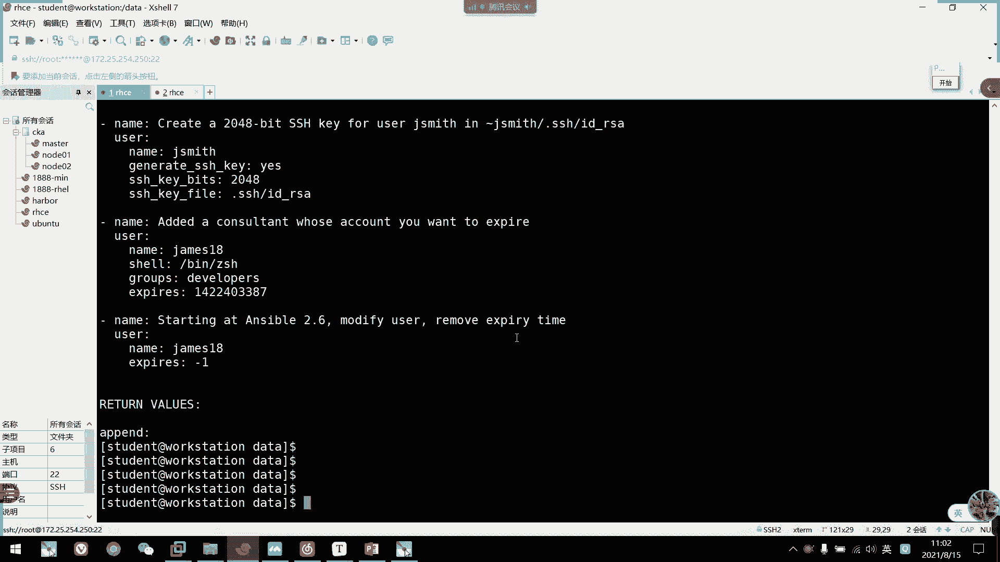

*   **`name`**: 用户名。
*   **`state`**: `present`（创建）或 `absent`（删除）。
*   **`system`**: 是否创建为系统用户（`yes`/`no`）。系统用户通常无法登录。
*   **`shell`**: 指定用户的登录shell。
*   **`groups`**: 指定用户的附加组。
*   **`remove`**: 删除用户时，是否同时删除其家目录和邮件池（`yes`/`no`）。

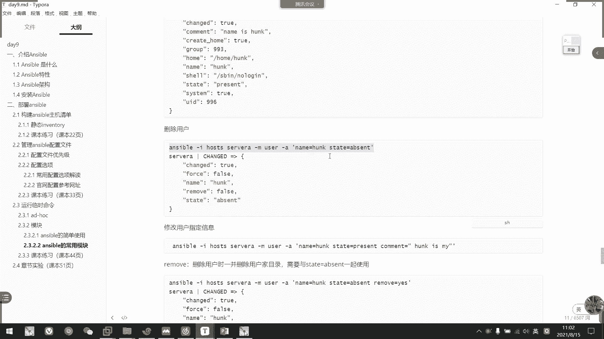

**创建系统用户**
以下命令创建一个名为`testuser1`的系统用户，并指定其shell为`/sbin/nologin`。
```bash
ansible all -m user -a "name=testuser1 shell=/sbin/nologin system=yes"
```

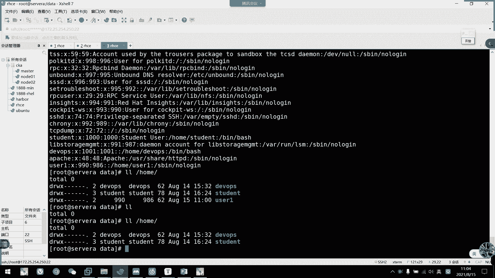

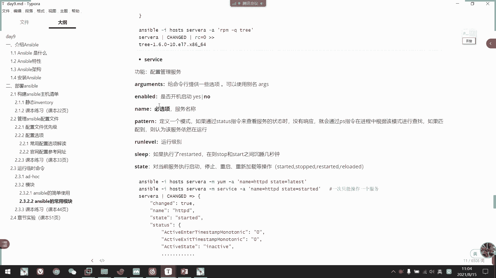

**删除用户及其家目录**
以下命令删除用户`testuser1`，并同时删除其家目录。
```bash
ansible all -m user -a "name=testuser1 state=absent remove=yes"
```

**group模块**
`group`模块用于管理组，用法更为简单。

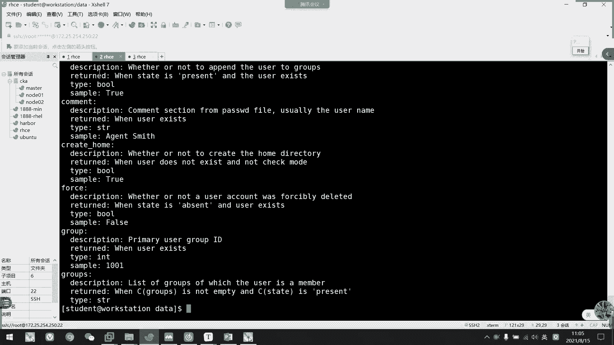

*   **`name`**: 组名。
*   **`state`**: `present`（创建）或 `absent`（删除）。
*   **`gid`**: 指定组的GID。
*   **`system`**: 是否创建为系统组（`yes`/`no`）。

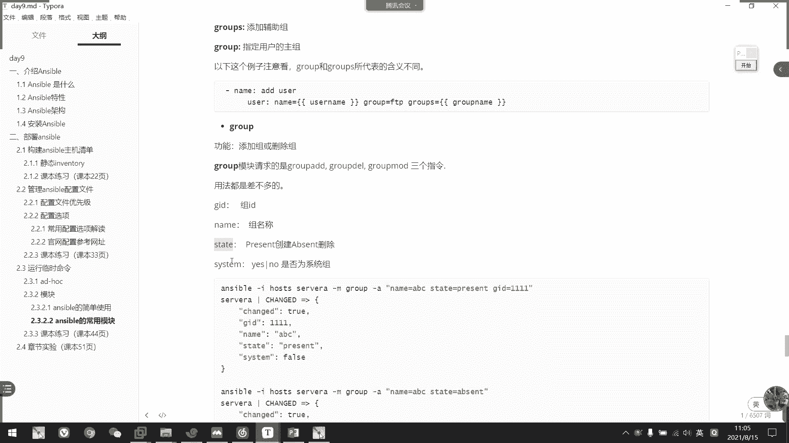

**创建组**
以下命令创建一个GID为`1005`的系统组`testgroup`。
```bash
ansible all -m group -a "name=testgroup gid=1005 system=yes"
```

**删除组**
以下命令删除`testgroup`组。
```bash
ansible all -m group -a "name=testgroup state=absent"
```

---

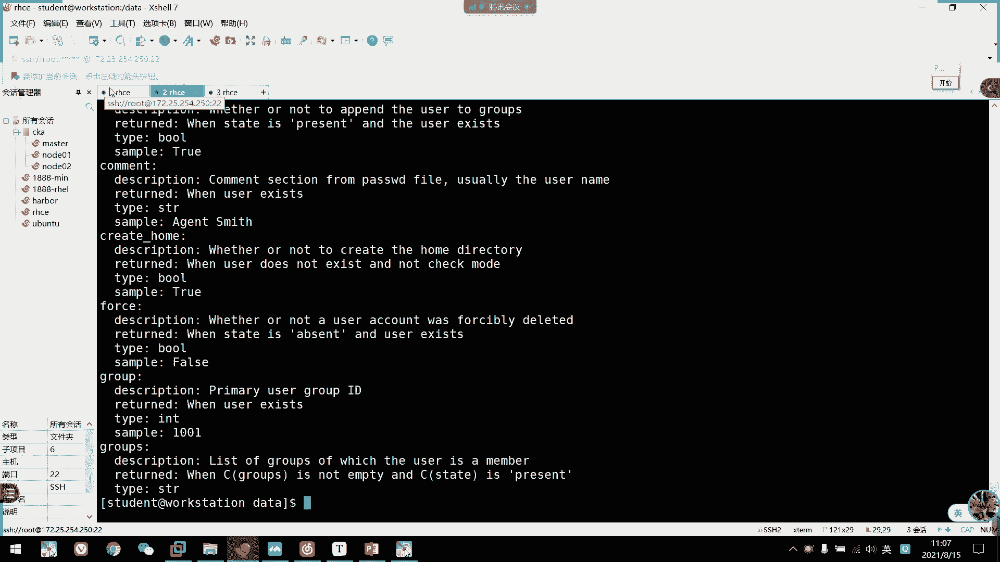

## 总结

本节课中我们一起学习了多个常用Ansible模块的临时命令操作。我们掌握了：

1.  **`copy`模块**：用于复制文件或目录，注意源路径末尾斜杠`/`的区别。
2.  **`file`模块**：强大的文件管理工具，可创建、删除文件和目录，设置属性，以及创建链接。
3.  **`cron`模块**：管理计划任务，可以创建、禁用、启用和删除cron job。
4.  **`yum`模块**：通过YUM安装、卸载软件包。
5.  **`service`模块**：管理系统服务的状态（启动、停止、重启）和是否开机自启。
6.  **`user`和`group`模块**：分别用于管理用户账户和组。

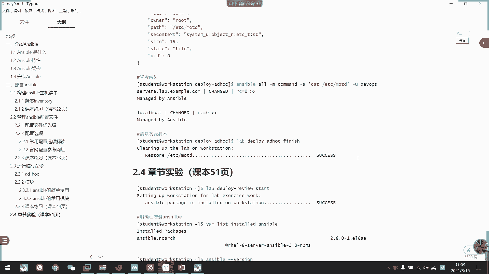

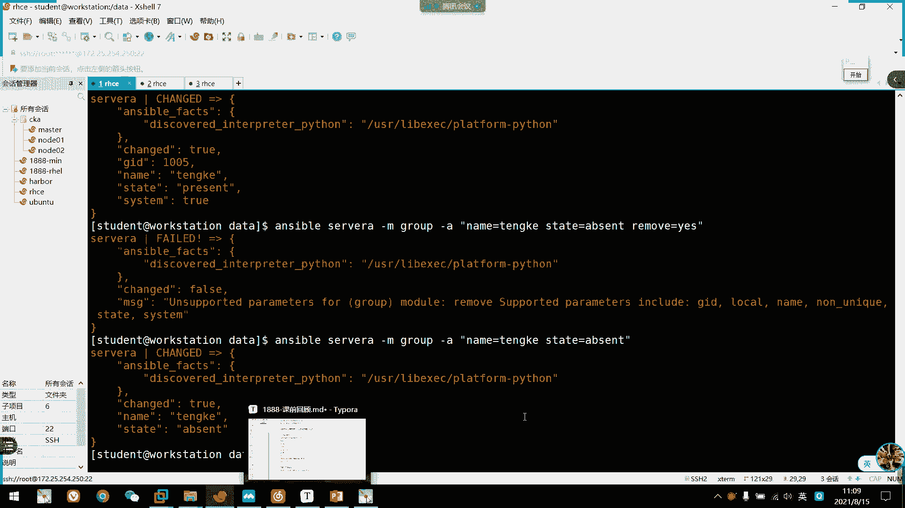

这些模块是Ansible自动化运维的基础。请务必完成课本的章节练习，特别是涉及从配置备份到权限设置的综合实验，以巩固所学知识。记住，在实践中遇到不熟悉的参数时，善用`ansible-doc <module_name>`命令查看官方文档是最好的学习方法。