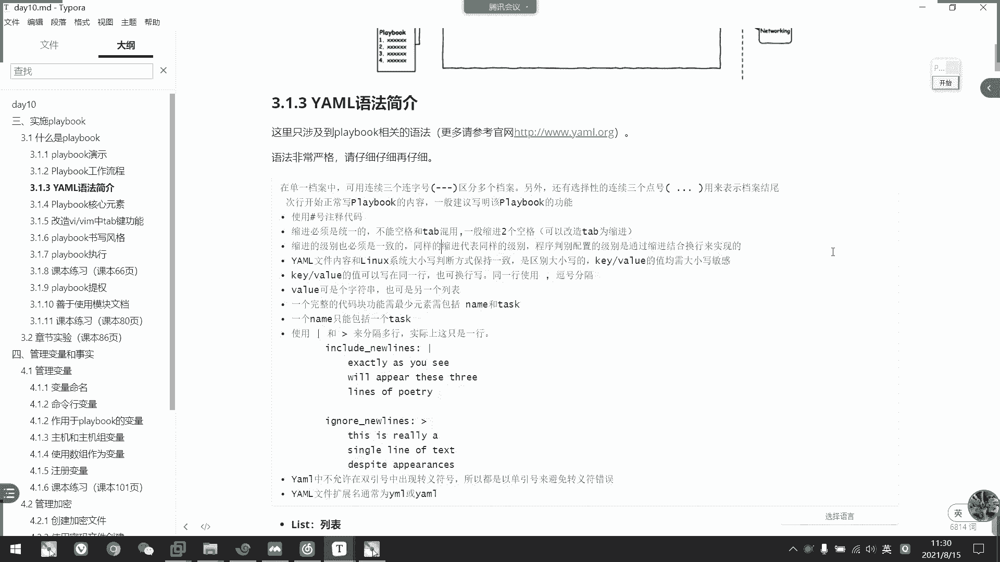

# 2021年7月新版-----RHCE8.2 RH124 RH134 RH294 认证课程 - P63：day12-3 playbook编写以及运行 - bili_15701050454 - BV1Gy4y1T7ug

好，我们继续上课。对。然后接下来我们。学习。剧本的编写啊。剧本呢其实就是我们那个临时命令的一个他。Taskク。我们每一次临时命令呢，他都只能执行一个，对不对？按我rebook了啊，它可以做很多个命令。

这就是我们的所谓的tsask。然后呢，多个tsask组合在在一起的，我们叫做task啊。啊，可以把任务集呢作为。一个play啊，那就是我们的一个。呃，剧本。p是巨吧。所以呢我们照下面的任务叫play啊。

这里叫play，然后整一本叫playbook啊，后一个playbook里面可以多个play啊，可以有多个play，然后一个play里面可以有多个tsask。啊，那么我们先从一个play开始啊。啊。

一般来说都是从一个配开的。啊，除了工作中啊。考试也不会让你会写多个play的，只会写多个task。不会不会写多个 break。好，OK。😊，然后我们看一下pble啊，其次。这个并不难。

但是他要接触一个新呃，对于我们来说啊，对于小白来说可能是一个新的东西啊，叫做要么。要么语。啊，其实现在很多东西都是依赖于样母语言的啊。啊，比如说我们的K8边牌或者是docker composeose啊。

这些都是用样目啊。아得个。另外了解一下啊。虽然他是样么员写，但是他这里也有一些规范化啊，这规范化啊。比如说我们开通要三个层杠啊。开头呢行三个行格。然后其他的话跟我们的呃要么是基本上一样的。好。

我们先写一个简单的它呃简单的一个play啊。

我先写一个简单准备。是这样的，它的语法。我们那边呃。嗯，可不管就这。对啊，然后它的结尾呢可以是YML，也可以是YAML啊，这个没所谓啊，他个人喜欢。然后呢，第一行我们先三个横杠。

你看它就有一个语法识别了。这个语法识别啊，说明这个是一个剧本，说明这个是一个剧本。好，然后我们这里杠 link。那么这里是我们的pre book。突变出。啊，啊，然后是hoice。啊，指定。呃。好。

指定执行。Pray。对。啊。然后呢是becom。True。或者是否则这是可选项啊。可选项。如果在。配置文件。中。二。必辑一个。提全就不需要了。呃，然后是我们的tsask。最先。定义。任务体。好。

然后task下面呢可是link。啊，这里是另了啊。作为一个task。的名称。用户明确啊，然后这里是model。模块。走。往下就是我们的参数了。呃。Acumen。A表。要就死吧啊。就这样。冇开。参数。嗯。

那么我们这个简单的一个play啊就搞定了啊，它需要这这么多点东西啊。啊，大家听到这里有没有注意到我们这个样母格式啊？有什么特点？啊。有没有敏感的同学知道他有什么特点。Mmhmm。

有没有敏感的同学知道他有个什么特点。算了啊还是我来说啊，你浩你听了三期你都不够敏感啊。好我们看一下。它这点就是啊。每一行。或者是每一项都是一个键职队啊。介职队。所以就这着呢就K位了。

例如是我们的一个变量也是一样的。就是我这个是键，后面是值。戒指对啊。那么我先。把这个。存一下吧。好。

这是简单的一个play啊，让我们看一下play的工作流程啊。好。😊，他不能流程是这样的。我们右选啊写了一个。其实。😊，这在第一章不是讲过吗？啊，我们playbook它每1个1234。啊。

都是一个task。或是是play啊，也有可能是pre。我就把它当成是一个play task多个tsask啊，就12344个ts。然后让它把它给传给我们SOS52可以把它解开啊，哦。

它的确是1234个pre啊，它可以解读出一个pre，两个配三个play啊呃四个配啊。然后每个play有多少个task呢它也拆分出来。逐个执行啊逐个执行啊，然后把tsaskk的里面的定义的模块。

以及它的argument或者是插件。都解不出来。然后了，通过我们的资产清单。传输给我的hos。压不压他资金啊，这就他的一个工作流程，一直拆一直拆一直拆。拆完菜煮了拆完菜煮了。好，O。

那我们看一下一个样语法的一个介绍啊。呃，这里只是涉及到我们的playbook的一个相关预法。啊，语法非常严谨啊，请仔细再仔细回去看啊。首先是我们的景。啊，所以是我的几号代表助持啊。然后呢。

刚刚说了开头要三个横杠代表。开始啊，然后可以单表结束，其实这个没必要这个没必要。我直接用这个区分就可以了，三个很杠啊。代表一个tsk的开始啊。🤧好。啊吧啊，大表个p开始说错了，不好意思啊，合污了合误了。

然后呢，我们。上行下面不是个内吗？这就是我们的p的名称啊，p的名称就是说我们这边啊一般用来描述于我们整个p的一个功能啊，整个play的一个功能。好，然后呢说进必须是统一的，必须同意。

不能空格和table可以动啊。所以说我们一般把那个table改造成是空格啊。改成回扣哥。然后呢缩机的级别也是一致的。什么叫级别呢？刚才我们是不是看到task下面了，我们又缩进了两个两下啊。

然后在model下面我们又往下缩进了两下，就是说。他们是分级啊啊，一个是我们的host级啊，一个是我们的一个model级啊。往下就是。查错了。啊。其实就是包含的关系啊，如果。怎么说呢？

我们task是不是包含在我们task下面，所以他要缩进来然行，然后再写第一个taskk啊。然后tsask啊是跟我们的一个mod。啊，是。呃。

task啊主要是是task不是tsask是tsaskk跟我们的modle型是同一个级别的，是包含关系用，它包含在我们的路籍里面。

所以它是同一个级啊，我们还是看这个吧。对他是往下啊，这是我们的泪。这类我们也是可以忽略不写啊，这个也是科选下来的，这两个都是科选下啊，可以不写。但是一般最好写明白啊，这个是做什么用的啊。

都是用于来简描述他是做什么的啊。比如说这个是我们整个play的一个。呃，作用啊，这个是我们tsask的作用啊，一般都加在这里啊，所以我们模块是跟它是。同一级别的。要让我们参数某本，这里又要写错字了。

🤧是。公没有太的。这个是区分它为第一行。第一行。在剧本里面呢是区分于。呃，tk的。然后在K8S的里面呢，也有其他。不同的啊呃，这个我就不多说了啊。ID还是区区分它的一个级别啊。D行。

你吧然后如果是多个task的话，那是区分task的啊。好，然后呃。这些就是级别啊这些就是级别。嗯， ok。

然后继续往下啊。🤧嗯。啊，刚刚说了。呃，压文件的内容啊和另大小判断方式保持一致啊，是区别区分大小写，主要是区别大小写。然后。戒指对的值均为大小写敏感Q戒指对。然后呢，我们的戒指呢可以是在同一行写。

也可以跨行写啊。同意还使用的话，我们要用这个逗号分割啊。好像是worden了，可以设置不出，也可以是一个列表。啊，然后一个完整的代码框功能最少元素需要包括我们的那个tasks。啊，需要类容是。呃。啊。

那个是科学家。但是啊如果有的话呢，一个类只能有一个tsask啊，或者是一个类，只能包括一个pre啊。啊，然后呢可以用我们的树干或者是。呃，大于号。分隔多行啊，实际上就是一行，就是我们的分行写而已。分行。

啊，比如说这或像是这个。没有写法，这个我就不演示出来了。反正太强了，就分行写而已。就是他们他们呃之之前的时候是同一行来的，所以的时候是同一行，这个也是啊，就是他们的一个符号问题而已啊，分行。

就相当于我们的需后面加一个法斜杠而已。好，然后样中呢。不允许在双一号双一号中。出现转移号。不能转移啊。所以呢就用单引号来避免我们的一个。左衣服错误。啊，然后最后就是我们的一个文件名啊。

刚才说了可以用样或者是YAL或者是YAAL结尾啊。要是它里面的啊可以是刚刚说的进争对，可以是列表啊，也可以是这转。列表的话，我们都要用横杠开头啊。就所有的游戏都很难的啊，所以是一个web啊DS啊。

或是注意啊，中间有个空格，中中间中间有个空格。好，然后是字典啊，也是那个间解论案。就通常。由多个key跟word组构成的。啊，所以是什么那个brolog啊，或者是link风格。🤧咳。注意啊，冒号。

隔壁一定要有一个空杆。

其实有没有空格，这个我们看这里就知道了啊，这个冒号到底有没有写对啊，冒号到底有没有写对，就看我们这里。啊，如果他没有风格。它又会变成白色，我们注意它语法结奏就好了啊。如果语法没问题的话，它是蓝色的啊。

但是一定要用VIM开启了我们的一个语防高量啊。如果没有语法高亮的话，也也也也没用啊。而且我们这里啊。如果说的中文漫号，它也是亏一个。不会变颜色啊。对不对？加厚个材量后输东西就可以。

啊，这是我们一个语法检测。🤧好。有了嗯。如果谁在同意哈，那我们可以用一个中呃大括号括起来啊，比link human啊，然后是blog。就这些都是负职到令啊，都是副职到令啊。啊。

我们一般都是用我们的一个样母写法。然后建议的话是动画后面啊，加一个空格啊，动画后面加一个空格。哦，不是啊，刚才说说了，他不是我轮流负责啊，是分开两个了，是汉。复制给累了，然后是他家复制不给我那个bro。

他写在同一行了已。然后是不尔则啊，可以是yes or no或者是 true or false啊跟一或者零啊。你看然比如说这些啊复制yes诺。啊，这些其实我们不用的。这给你们看一下眼。啊，然。

我们开始核心元素啊。本戏结束。啊，首先咧。可配置下，然后有助于我们的一个肌肉play的运行说明，然后hoss。hosice这个含的利用，我刚才说了啊，是水压主机啊，可以用逗号分割。啊。

也可以用我们的一个模糊回配啊，前面说的一个匹配。呃，耳机怎么样吧？啊，是不是有心啊，有叹号啊，或者是有M符号啊，对不对？啊。这里的主机都是我们从我们的这个。呃，这两题当中定义的主机列表来了啊。

report的 user的话是我们的一个。用品。啊，就是还是我们配置文件上面的一个re user一样的意思啊。最后如果我们在。电文件中配置的这个就可以忽略不行了啊。

但是我们如果配置文件中配置的一个是word的话，我现在执行的享受stu的话，我要这里声明一下啊。明白吗？啊要说tsk。这个是用忘记了。啊，这我题刚刚说了啊，tasks啊注意啊这问题。

然后下面才是我们的tsask啊啊，下面才是我们的task。好，最后呢为了方便啊为了方便。好，我们要改造一下我们的C步夹，这是我们第二张内容。啊，CSA第二章的内容我就。呃。

不是第第二天的那个啊VIM0我就在这里不细说了，就直接把它改。啊，就是文件类型是一样么的。要是。只改本地人改啊，就是AI呀，改成是。AIAAI是自动缩镜啊，然后ET的话是呃改变成table。

改变成我们的一个空格啊，然后是缩进为2啊，自动缩进也是为2啊。啊，这个我就不说不多说了。我上课的时候我就先不改了。你们练习的话啊，如果是为了速度，就直接改吧。我写习惯了，我就改不改没所谓。

那两个空格的事情，对不对？有自动刷机就足够了。好。然后我们那个。注意的是我们cbook的一个数据风格呃，风格有两种啊，一个是sthead的意思。方式啊，这个是比较旧的方法了，而且不太好读啊。

所以我不建议啊建议的话还是跟我刚才一个普遍的一个样式格式啊啊，就是说啊我写一个tsask，然后一个模块，然后模块下面呢有它的参数参数啊，这样子一项一项一行一行的写啊，比较容易读啊。

如果我们把所有的参数呢都放在统一行的话，就。有点。不舒服的感觉啊，看起来对不对？好，那我们。写一个简单的play啊，这真的写一个简单的pre。

好，我们写一个叫什么了？呃。在斯尔滨。在说耳机上面安装1个HTVD吧。好吧。或者是我直接再搜我A吧，把它先卸载掉吧。啊，不对，我们来这样子做啊，我先把这个卸掉。🤧呃。谢我谢亮。好，谢掉了。好，没有了。

じゃあ。呃。我先把这个文件保存一下。在这里对好，我们来改一下这个invent啊。好，改一下。呃，也不用改了。因为我现在想在我们。DV组，还有PHB组。上面两个主机啊。

不是两个主机主里面的所有主机都安装了这一个阿佩奇。那么我们用了内线组啊，刚好是那这两个组，对不对？那么我就指定这个组就可以了。他就可以在我们的sA跟sB上面转了。那我直接就用这个做起来啊。好。

先三个很大啊。到深圳累的。Beings。对，就是说。Configuration。有没有拼错？啊随便吧，错了就错了。我们整个 veryry。要把它安装好并启动啊安装好并启动。🤧好，然后host is。

我们选择的是rap server。对， sorry， I got serve of you。然后是task是拉。好。到这里注意啊。说尽啊，可以这样说，也可以这样说，也可以这样说啊，最好是两个两个吧。

我们的习惯啊，我个人习惯，我直接在他的下一集。第一个。就开始空格，我个人习惯了。个人习惯，但是好看的话呢，呃，老老老版本的习惯呢为了好看就这样写啊，要么要么很多的格式啊，要去后去输出都是这样子写。

🎼我个人喜欢喜欢这样子啊。okK好，然后第一个pas是instled。Hデ v啊 biggestす。好，然后模块我们选择要，对不对？对啊。啊，然后是特个是那个。参数啊。HDVD嘛，对不对？然后。

操作方法。So有 person。都是抓好了吗？好，第二步。服务启动。一定要对齐啊，注意啊，这里一定要对齐啊。这里同一级别的一定要对齐啊，同一级别一定要对齐啊。啊，这个主要。呃。开启。并且啊可以启动。

servervicice。好，然后我们用的是什么呢？service对不对？然后是那个。🤧嗯。H t v哩。呃，En。Yeses啊。然是。为我们的大。搞定了，那是不是这个搞定了？是不是还有一个防火墙配置？

能把问。🤧。Permitise。那么防火墙我们不知道怎么做，那我干嘛呢？到死吧，对不对？对这里不是一大堆吗？啊，然后我们就可以放找到fi word放墙。最干净的车吧。不行的话，我只有啊那个manage。

So all the service with the fire。看他的那个描述就好了。然后东写模块名た。然后。看一最后吧。啊，你看这边不是。我们的一个。服嘛，然后呢。不ish。是否通过啊。

LSDAD啊启有啊。当然我们这里要注意一点啊。他有一个呃，刚刚说那个pro来pro。就永久修改，对不对？我用了如有修改。然后呃我们是不是要vi啊，但是它下面这里啊没有一个插数是v啊。啊。

我们刚刚右眼看到了没有一个超40米了吧。那我要看。那往上找。所以先从这里找。在这聊看一下有没有一些期望的东西。啊，这个不像我那。然后插到这里了，有一个imitate imate。

我们看一下imate什么东西啊。这个。So， this。Confration。Be a pride in America。啊，就是要在我们的person。设定以后要加这个。就是up pridede。

🤧咳。重新下载吧。重新加入吧。啊， sorry，我家个。그这 입력。那我们继续看，就用fire word。also是 service。这些啲啊。好，然后是什么来着？呃。觉得应该是呢度噶。yes，对不对？

好。然后是permon。有这意思啊，Ecate。啊，也是也是。好，那么就到这里。我们是不是还差点东西啊？他说。大家觉得还差点什么东西？Yeah呵。😊，有没有同觉得差点什么东西啊？是不是少了个法文页面啊？

下访问页面。我价个访问页面啊。Create。Website。那我有什么呢？用高比吧。把这可虑。很太。写了吗？呃，hello。可以不。都写到哪里啊？啊，是不是 one。3WHTML。下的inex。

对HDL。🤧嗯。就这个就可。OK那我这就。那我执行了吗。执行怎么执行？我们用sible命台工具啊。Playbook。诶走咗俾啊。他也不说来。ASIB啊，少一个L。好要指定稳定有没有。好，好起来了。好。

第一个他s了，看到没有？他这个。哎呀，防我家出事了，应该我是拼错了。我看一下啊，他说这个enable的没有。应该是我写错了。那个是SDATTE啊。改一下。Pple我看见过没个。有命重。要改一个。呃。

等我钱。是。STAT为 enable的。🤧。在。啊，大家注意啊呀。虽然它这里比较久啊，你看你下跳过啊，绿色绿色。

是因为密的线，我安装过就。再再跑一遍，他也不会那个。

明白吧？同志。啊，对，就是说我上面已经第一次执行的时候已经劝举过了，所以他会不面会不会再劝举。好，我们来看一下cur server。Yeah。搞啲啦。是很简单。啊。所你看但是我们优化一下吧。

这个有也难看啊。他没有跨行。优化一下怎么优化呢？加个换海吧。在考试的时候不要乱加。然后我再执行。大理不斗经。😊，啊，哪里不要街，你说哪里不要街。可是英文写的不好啊，对不对？🤧。啊，我再刻一下。啊。

你看可以不？可以不可以？啊A b。咋电了。嗱咩度先号关线。前面没有修改过的都没事啊。然后最后我们修改的是它的一个内容啊，所以它这里文件券知的文件券。搞定了。我实现了啊啊，你觉得不对劲，你说一下。

哪里不对劲啊。说一下说一下。其实我们要把做的一个思路都想出来，就一步一步做出来就可以了啊。我们我们就说自己手动安装。我们是不是先做软件啊啊，先软件。然后呢。可以先做文件啊，先先先做页面啊，也没问题。啊。

一个协助诶服务启动。也可以先做这个啊，但是安装肯定要先先安装啊，对不对？我自己手动做也是这样子做，对不对？感觉太流畅了。啊，这是我们一个简单的一个play的意思演色啊，这是一个pre，这是一个pre。

啊，最简单的一个bra啊。对不对。啊，我们的HTVD的一个安装使用啊，最简单的一个啊最简单的一个。

🤧好，O。😊，那么这。呃。我真的是又要回头甲了。好，首先关于我们playbook啊，它可以先检测啊。我们刚才说了啊，模拟执行有一个杠C啊有一个杠C。

头先咧。哎呀，我头都大了。我来做一个什么来着？做一个卸载的脚本啊，卸载的剧本。

啊，然后叫做什么呢？remove。HVBD的。行。🤧嗯。好，要我写一下。好，那我们卸载这个。我这个放到最后吧。先把它这个啊，然后这里改成。系咪晒。太流酸了。对，太能洽有点不对劲。啊，终于发现了好，卸载。

😊，啊，卸载，然后这里。呃，改成饭我吧。这个是。Yes。🎼这里是我们的一个。什么来着？也是STAT啊。也是X啊。这里改成给C我就可以了。好，这里。给个漏。Sttop。那么我就把它跑越掉了。好。

既然这样哦反正还是要讲的。Rebo。所以是我的语法检测啊，我们看一下刚概help。啊，叫做select check。So that。啊，这个啊。好，我们加一下。这个是语法检测，可以算。哦，对。

没指定那个。啊如是这样，它就没问题了。语法简测。啊，大家注意啊，这里检测的是我们的剧本啊。记得是剧本，什么叫剧本？有这个三个横横线开头。有我们的tasks啊，这才叫做是一的剧本杀个干开头。注意啊。

我们后面会学到一些请求文件啊。啊，那些并不是剧本上的，千万不要用语法点单去检测它。那是错误的那我现在不计写错一个。比如说我这里呃。特别。我在减肥的。啊，他就会指定我们到了哪个位置说。

但是这个错误位置不一定真的是在这里啊，但是肯定会在这一块啊，肯定会在这一块。整个快啊。它不一定是错在这个位置的啊，大家要注意啊啊，跟我们的伴水呃讲项的时候是一样的啊，它不一定错在这一块啊。

这里要注意啊啊，okK那我们知道啊。它的这整一块啊是这一块啊，就这一块就这一块，如果它只只在里，就是这一块有问题啊。那我就把它改回来了，对不对？大个是。1了我们可以S我。G cr。然后是干大C。

让他d文一次啊，d文看一下有没有问题。第一个就出问题了。reload with start啊，我stop拼错了。再做入里面啊，那个名字没有改，不用管它了。

Ts肯定没有改。

那么我们做文是没有问题啊。那我们看一下谢长。

啊，真正执行啊。直接一个就可以啊，我们可以加一个杠目一来看一下任务结果。

啊对。他不意思。说了个。不该说的。屏幕上位。呀他是呃在跑哪个啊，使用的是这个呃配置文件。然后第一个我们不用管了，那个是ge first，我们下午会讲。这个跑了。啊啊，那他说呃确认举了什么东西。是不的。

不的。啊这个开始啊。先是停止我们的服务啊。啊这服务有点多都是有点多啊。还有这里啊。把它。呃，改成是diable呃diable。好像是卸载了这个文件啊，最后是删除。对对。小小信息啊。

他会把他那个输出都写出来，不然的话呢只有一个劝举啊，或者是successful啊这样子。好，我看一下。结果。11我。tus的TV啊。然后是frywood。先定。刚刚list刚刚勾完。诶。多了个杠。对啊。

HDPS呃HDP已经没有了。然后还有什么呢？啊，上面已经删掉了，就不用说了啊，看那个文件啊。呃，L我的袜。3W。行，没有了。

你对对。搞的，这是两个两个剧本，一个安装，一个卸载。啊，一个按装一个 sit的，int and remove。Thank you。好，那么接下来我们讲一下这个。提全啊。欢迎T恤。うん。🤧。

T恤的话呢是我们那个host跟tk统计。其实我刚才都说过了啊，它可以用智常的，一个是bee true啊，一个是become mode啊，还有一个become user。

呃，比如说我这边。把配置文件修改一下。啊，我把提全都删掉啊。都不提了。啊，都不提了。啊，我们。现在执行一个啊，现在执行一下啊。被他返回什吧？说微问题一下吧啊，我就不实际运行了。哎呀，他直接错返回信息啊。

他说 this has to be one another。W to use Sir。啊，他说一定要执行债务的用户下执行啊。所以就是我们的一个提权问题嘛，对不对？提权我们可以有两种方式啊，一个是这里。

呃，刚笔的。

哎呀，谢取消掉了。我让他装装就好了，先不装了，我们看一下这样子的确行不行。

然后完全没问题啊，关闭这里就可以安装了。

感连速度都不用指定啊，因为它会自动检测我它是否有权限了。啊，把它一提它默认试用的是度了。

搞啲啦， t 恤约着我啦。那，这个play book是不是讲的有点快啊？我讲完了。呵。😊，啊，算了，我先休息10分钟吧。好，我们回来总结一下这样的实验。课本时间你自己回去做啊。好，我们先跑一下leb。

好，这这是。嗯，看一下他做什么的，安检查安装。然后配置我们的工作路径。嗯，配置了一个。face文件啊以及我们的 image。看一下。啊，他会在我们的加目录下面创建了。

看下，就是这个playbook review啊。啊，一般我们文文件名跟我们的这个脚本名称是一样的。

然后配手件，我看一下配手件。啊，做的齐全了。然后再看这名单。啊。

就一个色尔病啊，那我们看一下这个要我们做什么东西。这个开错了吧。啊，他要我们写一个剧本啊。叫做interlect。Yeah。嗯，这个是做估计是做了一个。呃。LMP啊LVMP。还要做1个PP啊。

然后这这个是相当于是我们呃科尔干癌返回的啊，然后最后返回的是一个。大码是什么呢？啊，是200啊是200。他要是200的话就没问啊。不对，他是ge入此了，咱要下载一个啊，他要下载，把那个下载下来。

hold多文件就是我们的页面文件而已。🤧。然后这是另一个pre啊啊，然后是返回满200钱对了啊。这个是转了2吧。一定要20正常。好，大家好，那我坐一下。become true不用写啊，这里be个for。

这个取消了这个取消了。所以我们这里要需要be true。好，我们来写一下。

就是。对呀。一个pre叫什么呢？Be的 let。一样。这上很啊，然后是累的。呃，叫做create。这个咧。啊，然后postsage。刚刚忘了看名字了啊。他没有啊，只有一个整个主机。

然后我就把这个整个主机复制过来了。O。然后是比克嘛。处e。Testters。有没有觉得他这个跟我刚才做的是一样的？比说。Pickages。然后是一样。啊，这里是波盖，那我们就列表啊。不裂个。

首先是我们的。HTVD。哎，我是。By。我的。啊，然后是我们的merDB。然后是我们的PP了。

但的名字好像不是这样，我们确认一下。啊，这是什么啊vivoDV的serv。还有1个PHPmy circle MD啊。

🎼最后一个是它的一个连接到。mDB的一个插件啊。这什么买。C口MMD还是MB啊。MD啊。啊，然后是t。啊，装最新的。Lastice啊。搞定了。要后示累。0。设备是。好。这里要一个一个来啊。这个一个人。

呃。那我们先。HTVD吧。そして he。大。你给able。Yes。唉，还是一样的。这个就不要了，反个是要service的。还有一个。叫什么？没有第B吧。We will低其都没有了。呃。啊。

服务都启动起来了。

呃，这有什么呢？看下看一下，确认一下我们的。Fu。只开防火墙啊，然后这里开我们那个。对CBD了啊，然后这里是我们memoryDV啊，目前的话还没有问题啊。然后是配置防火墙，还有镜团页面就可以了。啊。

这个等一下要考过了才行，因为他。

呃，是下载下来的。这个get URLRL呢是相当于是我们的呃呃那个叫么W改。然后我们配置防火墙的。呃。Saad。Fwood。很没事。P。ris for我们的一个什么HTVD。可可呀。

然后是fireairwood。是跟我刚才那个谁有点像啊，这个。呃，service。我这改一下吧。我不用这个了。我们这里改一下。叫什么？我指定一个炮吧。You real product。啊，有好。

我是直接要泡的。巴黎做火。TCP协议。呃，然后是perm。Yes。Imedia。I am am。And。好了批的这个东西。I amE。DI aE。好，那个房管家就设计好了啊，最后是我们的一个。我不三。

我们用get。Rightよ。啊，然后这里是UIL地址。

烤一下。因为我也不知道是多少。8。考一下。

好，然后是它的存放在哪里啊，也是目标路径，对不对？放哪里了？呃。わあ。3WHTR。🎼我觉得这个可以不加，所以。我把所有套去掉。像是某的。0644。不要检测啊。呃。Trick。

嗯，这个用什么呢？去呃。To的所 you are挨。

我觉得hosice。logoos代表我本地啊。要是不看。不需要提取。比说tss。累。不要累了，直些URI。

让他做什么东西。这个这个要看了，用果按这个模块。URL是这个啊，然后是tium course。扣的返回大码，昨态码。

和这个弱爱。啊，然后是STATUS。Xi。

哦 r d吧。Crod， C， R， O D。

修丁呀。饿吧。写完了啊，让我们检测一下语法。Sible杠。Playbook。都是尴尬的。Se么。走吧。不会P。这都不会避。曾经记过一次啊。然后是很少用的话就又忘记了。语法语法是SYMTX。

🤧叫什么internet。语法没问题，然后我们装了一下看一下。没想到啊开始就是问题了。laice拼错了。L， A T， S T。2ATE。

呃，这里有什么问题，STATE有问题。First ministry myth arguments， S T A T E。Firework这里。他少了一个，他说没找到啊。我们这有个beable的。B选项。

继续说吧。搞定了。啊，他由于收不到，所以他跳过了啊，然后他就应该没问题了，我们就直接跑了啊。先直接跑也没问题的。那直接跑的话比较跨时间啊，如果有问题。就要排查。

快点啦。

做完了啊它就OK我们看不到状态码是吧？哦加个杠V啊，排一下那防位置啊。

看一下这个。啊，连我们的PHP是7。2。11都都知道了。然后收到码是200，没问题啊。ok。那我就当个实验也完成了。啊，他这个实验跟我刚才来的差不多，他只是直接做了一个叫做LNP一个东西出来。好了。

我们就。完成了啊完了之后，我们这里做个评分就可以了。

啊，贵贵的。他考试也是这样子评分的，呀，我也不知道为什么分啊。不管他。我而不知道他为什么非。

firearwork有问题吗？别人题他他做出来啊，是不是？虽然有时候考试可能会扣分，就这样子扣的。我发我有没有问题啊？对不对？turn出来，我说yes也没问题啊。呃，可能是因为我。

安装的时候他自动安装了吧。他这里没有清除掉而已。好，那么我们就呃进入实验啊切入实验。

一定要清楚，如果我们做了实验一定要清楚啊，不然他下一个实验可能可能会出现一些冲突问题的。那他要卸载我们的一个包了啊，然后卸载我们的那个merorDV了。谢一下我们的那个HP。谢谢完了王真。

那我这个战期实验就做完了。啊，对对对对对对对对。不卡有的一直在清除，你看一直在清除，但他这个目录会保持。

菠萝会保留。如果要把它给删掉的话，我们就重置就可以了。

这个防火墙我还是不明白。

哦，我知道了，我我改成80了，是不是啊，我改成80了，我是改看一下。😊，呃。再重新跑一遍啊。

あ。我特意跟他不一样，我刚是特意跟他不一样。我们这里改回去啊呃。他只能说定了。啊，这里感觉是我们的一个AP个哔BD啊。好了。对对对。我再跑一遍。

快点时间吧。🤧。本来想早点下课的都不行。这回家评们看一下。搞定了。是哎，原来是这样子。

我卡试的评分没有那么严格。应该。啊，O了，我们下课了。😊，可以啊。

就说我做时间我就喜欢跟他不一样。跟着做有什么意思，对不对啊，要按自己的思路来。啊榜他多少分练习而有。

好，我们下课了。