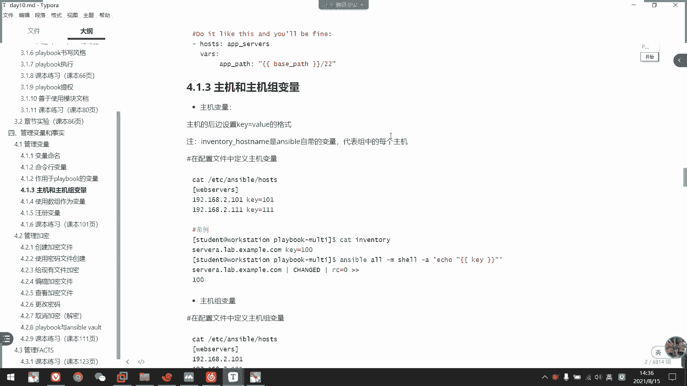
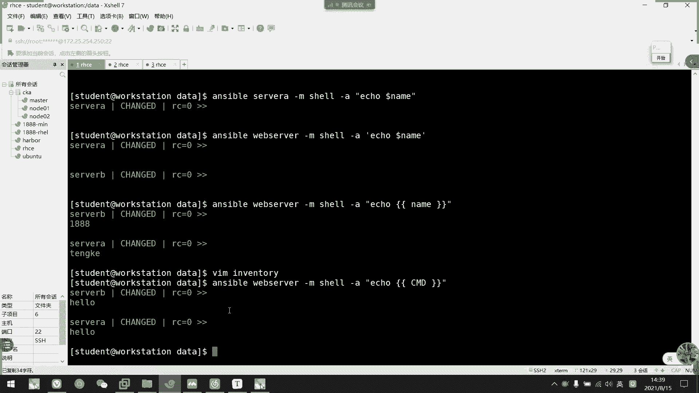

# 2021年7月新版-----RHCE8.2 RH124 RH134 RH294 认证课程 - P64：day12-4 管理变量 - bili_15701050454 - BV1Gy4y1T7ug

啊，我们先回顾一下上午内容啊。上午两个内容啊，一个是。还有什么？临时命令。这使用啊。啊，也就我们的一个playbook。的。编写以及。使用。🤧咳。好，临时命令。嗯。我们的。冰量工具啊S不。啊，然后是。

ホスです。模式。P题吧。嗯。要后是杠M指定模块。啊，杠A是 the argument。要他有才才能用啊。对会啊，然后是我们的一个执行就可以了。嗯。邀了我们简述了一些模块，有是高PR。发了。

Good morning。啊，然后是绿色。还有我们的输入。等等啊。啊，要么仓库啊呃之类的。那啊。啊，然后我们临时的命令呢。佢如。啊，让我们熟悉。我们的playbook啊，熟悉我的模块啊。不是。嗯。熟悉。

模块。对是。然后preble呢啊就是。8。每一个。task那么把每1个AD号。作为。Tusask。按照。嗯。部署。应用顺序吧。编写成。回一下。啊，然后它的一个格式啊。啊，首先是。首行。三个人应该不大。

然后是。第二集。啊，这是prebook link。这个。嗯。主要。描述。该。可以嗯。的作用。然后是 hostsess。嗯，也如是我们的。Hosice club。执行。Pray。节点。然后是。可选项啊。

科学。所以说我们的becom。这个我就不多写了啊，become user。人面贴球的感觉个mo。然后是一条绿色。啊，或者是loadode。不少。接下来是我们tss。这里又是下一集了啊。啊，然后是类的。

我用我们的task。你。描述。该。タスです。呃。作用。好，接下来是model。模块。接下来下一集。啊，就是我们的参数啊。这也是我们的一个基本格式啊。啊，好像没什么要回过来，早上就讲这么多是吧？

主要是扩展开我们的一个模块来解说一下，然后是我们的一个craboard的编写。就上没什么了。好那么。嗯，我们早上。简单的去。呃，写了一个prebook啊。那么我们下午啊。啊，就要有一个C的概念啊。

把一些。willm啊改成是我们的变量形式啊，或者是调用我们的事实啊，事实什么呢？我们等一下来讲，我们先来看一下。它的变量啊。我们先看一下那个S股变量的简介啊，就是说跟我们校一样，它是可以。

通过变量来存储我们的一个值啊，然后再到我们的preble中，或者是啊在AD host中调用啊。呃，标量可能包括以下。呃，值啊。要重新用户啊，要安装的软件包啊，要重新启动的服务啊。啊。

或者是要删除的文件啊，还有一个从互联网解锁的存档啊。好，所以是变量命名，变命名呢跟我们那个笑是类似的啊，都是嗯。关键字或者是内置关键字都不能作为我们的编类名。然后呢，建议还是大写开头啊。

或者是字母加英文或者下划线。啊，大头风小头风等等啊啊要见明之一。然后呢它的变量呢啊不仅可以支持我们简单的啊key和啊，而且还支持一个字典啊。啊，这点的话可能我们现在没什么概念。

我们到后面呃调用的时候就更加清晰啊。啊。所以我们来看一下啊，命令行变量啊，命函变量刚才说了，我们的变量是可以作用在我们的Ahose里面啊。那么我们看一下通过命令行啊，我们怎样去指定变量啊啊，首先。

我们可以在执行pre的命令行指定变量。需要注意的是啊，变量行指定的变量在所有其他变量中优先级是最高的。啊，就是说如果我在play中定义了该play的变量也好，但是如果我从命令行中指定了。

它就会以我们命令行的为优线级最高进行替换啊。那我们看一下啊，它的一个船舱也是用杠E啊，用杠E，我看一下怎么抓。呃，也可以是也sure啊，其实它就是个扩扩大一些。我们看一下AD house能不能用啊。

啊，比如说。Sible。嗯。我们在s尔B安装吧。设备。然后是杠M样啊安装一些东西啊。比如说。啊，我们要装的是HTVD还有。我们用大一号吧，外面。啊，比如说我们要做HTVD啊，或者是呃我们的。什么呢？

再加一个啊，加一也要做一个数据库啊，那么怎么做呢？啊，我这里使用变量，看一下行不行。我，备料格式。哦，没试过在ADho上面使用啊，一般都是写在我们的背部里面，我们试一下行不行？PAKG吧。这样子写。啊。

L是STATD超作方式等于person。PRE吧。好，我们来前面。说一下了。干一呃。B。TG等于什么呢？这个不知道能不能传两个参数啊，在这里传的话。用逗号分割看一下行不行吧，这群哔哔D啊，然后逗号。嗯。

要是。快点休息。啊，不行。干你不能这样闯，我看一下。

嗯。加个双引号试一下。这样吧。看一下单引号，然后用双引号或着。里面的数据。主后这里是一个空格。看下这个行不行。啊，还是不行。Omissions or argument。应该位置有问题啊。

被我第一次啊在AD后s上面使用这个东西。AD house没有这个杠衣选项，我看一下有没有啊。看一下有没有。好像是没有哎啊有啊，有。Sure。To was。

K the your room。好像作用不了。

有红格那是wson。我了么给你只我先装你一个看一下吧。这都不行。可能是他引用有问题啊。主是引用问题。P， A K G we been。可能你又有问题。嗯。哦，我知道了，少了个杠A啊。十六更几。那些读东。

哦，没有色尔B哦，我知道。刚才那个是我们早上实验的路径啊。啊，不行，看一下。This command has to be worn out of媒体权而已。好像可以大约啊。我看一下能不能打入吧。

我是第一次在这里使用变量。啊，应该可以啊，我们看一下设备有没有装上啊。这应该装上的。装上，但是没有启动。因为我们只是做嘛，对不对？那我们改一下啊，看下两个变量行不行。有空格分割开看行不行？是不行的。

看一下。然后没有这个。所以这样做不行。所以我们这里这样子重舱的话还是有点问题啊。你说命令也不知道怎么写那个。列表因为我这我们一般这样显示以列表形式写到playbook里面的。那么他这里就不行。

那我们就算了啊，但是我们刚刚已经演示过一遍船舱的过程啊。就这样。转这。或者是用多方。快说都好。这样行不行？感觉好像可以。感觉好像在安装啊。因为他那么久都没有返回值。

嗯。大家是可以啊，你看他装了一个merrryDB啊。

我们看一下是不是中了。

啊，对，这样子可以。那么我们这样子就可以啊批量安装了。通过呃这样子指定变量。然后我们可以注意到啊，我们变量的引用啊。是双引号，然后加两个大括号。然后中间是变量名称啊。

嗯。等一下我们会有一个详细的解。讲讲述的啊。ok。好了么？呃，这个了解一下就可以了，我们一般都不会在这里传的。呃，如果要传的话，也是做替代的。因为我们后面呢还会有一个叫做变量文件。

它这里也可以指定我们的变量文件。啊，就是用ant，然后指定我们的编量文件名称。我们先不管它啊，我们先看一下啊，状于pre的一个变量啊，我们看一下在pre中什么定义变量。好。

首先我们可以呢在我们的play中。啊，was定义变量。改变量作用于整个play啊啊注意要是整个play。是在这个级别，在我们host级别定义的变量，它是作用于这个P类的。

啊，比如这样呃，我把早上的那个。烤过来。下个。嗯。喂。都没有。怎么多了个整号了，这里。没文件呢。没理由啊。Interlo。嗯。😊，我们CD过去吧。H student。要是。咩玩这噶。

呃In public。看一下copy啊，算了不用copy了。呃，我们先把那个卸载掉啊，先把那个卸载掉。🤧嗯。d f。Remove。From Y M A， R，RA A， D， B。说吧。

以及我们的HTPD啊，把它写到。好。那么我们可以看一下这个play啊。我们中午。是不是做了一个play比较麻烦？啊，比如说这里。怎么service。写了3个。那我们是不是可以利用？变量的形式啊，让它。

循环去。🤧解决这个问题。我看看行不行。嗯。我把这个。删了删了删了删了删K。好，要我们这里改一下啊。把它做成变量啊，变量名我们定义为service吧。啊，可以不？啊，不要不要不要用service。关键字。

Rpper。不是VC了serv。然后我们在里定一个别梁啊，叫was。好，然后呢，service有什么呢？啊？他名字叫呃rapper。そ。然后我们来定一个。啊，首先第一个什么呢？HTVD对不对？啊。

L是我们的firework。啊，要是merDB。嗯。也可以。我把的手开一下。正在于发啊。呃。评错了。嗯。拼错了。slack会总是拼出这个东西。看一下。哦，TAX。只要T一颜色。

它这里显示我们的预法没有问题。那么我们执行一下看一下。用。这个杠C让他。这样子实行。啊，这个变量调用还是有点问题啊，我等一下看一下什么问题啊。他应该会报错的。我看一下是不是有问题。诶，没问题我。呃。啊。

因为我们没有装，所以它下不了这个东西啊。那我们直接执行一下，看一下。是否正常？我现在装包。我等一下把包也改成是变量啊。你看这里是出问题了。So is Web SVC host。嗯，出问题了。

我要变量这里。哦，知道了。是我写的一个问题。刚刚如果检测检不出来这个问题。主要问你问不出来什么问题。🤧咳。有。现在问题是什么呢？我刚刚说了，这个肯定这样子定义肯定有问题啊。你看他把它们作为一个整体的。

看到没有？把它们作为一个整体，那我怎么样它循环呢？主要循环呢。我看下。要改成列表形式啊。🎼能不能循环？如果不能循环，我们要涉及到一个新的概念了。不行。Could not fight。嗯。

它是类型是列表啊，所以我们要用一个循环。怎么做呢？看一下这里能不能。应该要用磁铁方式吧。哇好烦啊。21行。The fur depend。I can， I T E。他说我没有定义这个ITEM。哦。

我知道了。这还要加一个东西啊，加肉。漏。Rber。是的是手这里定要用啊，然后我们这里就不用了，直接留个艾就可以了。Oh。艾特没定义，什么意思？Iphone丝。奇怪的哦。我看一下有没有问题。

我知道什么问题。啊，洛虎斯放射死。模块一一级啊。啊，这个应该可以对呀。🤧嗯。啊，真的要设计一个新的概念。我们来分析一下啊啊，虽然我这里啊已经可以了。嗯，把变量啊，把它们定义成变量。

但是呢啊我们执行的时候呢，它。🎼会把它们作为一个整体啊。把它们作为一个整体来执行，就不会说呃循环的使用。那么如果我们循环了就要需要这个look啊。就。相当于把他们轮流复制啊，这个lo的意思是轮流复制啊。

这样子啊人力复制先复制这一个，然后再复制这一个。最后再复制这个啊，一步步执行啊，循环使用这个一个tsk等于是有3个task啊。有了艾en。啊，我们通过lo定义出来的一个列表，它们那个变量啊。

他会把那个值复制给谁的啊，复制给艾特这个编爱名啊。啊，复制给他。因为我们所以要调用艾特他。啊，这个意思是什么呢啊？首先是通过look啊，把我们的列表先复制啊，它读取这个列表啊。

我们通过变I名读取这个列表要扩得HTVD啊，firework还有miDV。好，然后呢。把它们轮流负值啊，首先是HDB复值给艾特，然后执行一遍大概，然后再把我们的fire word复值给。ite。

然后再执行一遍这个task，然后这是meror DV，然后也复制给我们的iteer，然后是再循环一遍啊，这是我们利用变量来做一个循环啊。啊，这是我们的一个月亮的使用啊。所以一般来说变量的话。

如果要讲它用处。就是这个用处啊，不然的话我这里只定义一个呃指定义一个值啊HTVD。虽然说不是不可以啊，也是提高了我们剧本的复用性。啊，但是始终还没有这个好。对不对？用了这种方法的话。

我们只写一个serv备C就搞定了。如果像刚才呃那样子，我们还是要一个一个写啊，那就没什么意义啊，意义不大啊意义不大。所以说我们这边也可以改的。就是说我们把要安装的或者是要全统服务啊。

以列表形式复制给我们的编量，然后再通过录去读取。然后再系。嗯，复制以后呢。再给我们tsask读循啊，这样子做循环的话，我们脚本呢就不用写的太臃肿了啊，不需要写的太臃肿。啊，这是我们变量使用的一种方式啊。

好，O。那么。继续往下看。他那种就直接定一个值而已。啊，它这种虽然是互动性啊，就是说啊比如说我现在用80，然后我后边帮我改了，不为8080，我直接改这个位置就可以，就不用翻剧本了，就不用翻剧本。

跟我们校是一样的，是为了提高我们的一个运维，还有复用性啊啊，或者是修改的方便程度啊。🤧好。然了这个呃像我刚才的定义到这个位置啊，在host一个级别的话呢，那么它是作用于整个play的一个变量啊。

所以对于这个play里面的所有tsker啊，或者是角色，或是inportin等等。下面定义的tsk都会生效啊。好，然后第二个是我们的一个变认文件啊变认文件。通过我们的wa files。来啊导入。啊。

什么意思？

就是说我们把变量啊都写在一个文件里面啊。比如说我这边写一个wa吧。等一下啊，哎。呃。比如说我这个PAKG。在这里啊，然后我们还是用列表的列表形式啊。嗯，比如说我那边要装个HTVD。然后还要做一个什么？

PHP。啊，还有。MiorDV。S。呃啊PHP的那个myxico。MD对不对？这是个那我我写到这里。同时呃我把那个。Weer。SVC也是在这里啊。有我们的HTGPD。我们的meD。

还有我们的firewood。谢谢，都谢大家啊，那么我们先把刚才的那个清掉下啊。

清掉他。我看一下这样子能不能清的。让它卸下，看一下能不能卸。

应个能谢。

看一下。好，接这儿啊。好，那么我们现在用这个wasfire看一下怎么做。还是这个要了我们这里啊袜子不要了，虽然它可以呃共同使用啊，共同使用没问题的。我们不要这个了。改的是was files。啊，注意啊。

这里有个S啊S一般来说啊，这些都是有复用性的啊，不不啊，是可以分片的啊。其实刚才写到那里也没关系。这里指定路径吧，我用三个路径。weday有啊。那么我们这个就可以。我要了。诶。5个哦。

我少了个fire word，等一下加回去啊。那我这里。也引入一个艾特。啊，注意啊，我们这个ite跟下面那个艾是不一样的。就是说我把它定义在taskk里面啊，这是我相当于是他task的。

变量啊只中于该tk啊，所以跟下面那个是不一样的。刚才叫什么PAAKG是吧？那我这边改一下。呃。再加一个包。叫什么来着？不我的。那我们现在执行一下。Prebook。要是。In可。

一得咧。我们看一下结果。嗯。然后他现在就按列表循环了，先装了1个HDPD啊，然后装了1个PHP。没尔DB可能做的有点慢。

所以呢我们这个变量啊。写到文件当中的话呢，他就啊可以给多个。剧本调用啊。

给多个play不调用。你看我们这边直接实现了。而且显得我们的没那么臃肿啊，对不对？

🎼看一下，你看显得没那么臃肿，全都是通过我们变量形式来调用的。O，那么我们现在。呀这边。

全都可以了，对不对？要它返回的啊也是ok的值啊。那我。看一下使用评分行不行。

使用评分。

大家有没有问题。那我们用变量啊操作方式出来以后呢，我们全都是pass啊。啊，OK是啊，然后我们还是清掉它。我去掉。

啊，OK那我们继续往下看。好，接下来的变量呢是我们的一个。哦，不对，这里啊还有一个来自官方的说明啊。看一下有没有问题。啊，以后变量文件就刚刚已经说了啊，其实一样的东西。啊，这是应用变量啊。

然后这是wafire的翻译啊。大家可以可以试一下。然后呢，它是调用再调用啊，测试调用再调用。他用到我们那个tempate。这个模块啊就是啊以这个为模板啊这个为模板。写成我们的一个。呃，写到C里面啊。

就是说嗯temp首先呢我们是定义了个呃values啊，这个里面的值应该是有两个，一个是my name，一个是HTV port。好，然后呢满令的值是ABC啊，HCPport是80。然后呢，他们执行以后呢。

通过temporary以这个为模板啊，这个为模板，然后它。复值以后呢啊这个就复制到ABC，然后这个复制到巴黎啊，然后它调用出来啊，作业我们写到文件里面啊，是不需要加双引行的。这个要注意啊。

不需要加缩一号，只有在tsask里面的时候啊，我们才要加缩一号。啊， ok。😊，然后呢，如果要引入文件的话，我们都要以一个横杠开头啊。啊，刚刚老师呃做的时候也是一个很杠开头的。有哇哇的话呢呃要加横杠。

它就作为一个列表吧。啊，这个没所谓。因为它呃是一个值啊，一个键一个值啊一个键一个值。刚刚我是一个键多个值啊啊是不一样的。那么我们看一下来自官方的说明啊，就是说在preve中调用啊。这个是错误的。啊。

这个才是正确。就是说如果我们有变量。而且啊还有其他的话呢啊我们要变量加一些字符串，然后把它引起来啊，一定要加个双引号，然后只有变量要扩起来啊，注意啊，只有变量要扩起来。嗯，要扩入变量名就可以了啊。

然后加其他东西。其他吃不错。就可以了。好，O。那么接下来我们看一下呃下一个变量的定义啊，叫做主机，还有主机组的一个变量啊。首先我们看一下主机变量啊，也是一个key建设队啊，建设队。

然后呢它是写在我们的invent后面的。谁要疑问视频？

呃，我们可以看一下，比如说。我这里。用回我们自自己创建的eventuual。好，然后我现在有个sorry。好，我们写到这里。要写一个。link等于N科。然后再设尔B啊也定一个。零等于。啊，1888啊。

我们的班题号好，然后缓成退出。好。🤧然后我们来看一下。干什么？嗯。Rpper server。因为他们是这个组的。嵌到左，所以我们直接调用这个就可以调用A跟sry A跟sB了啊大M。然后是笑了就可以了。

杠A。E口。都人群累。O看下纸。え。这没有字。主要是。这没有指。我等一下。Shui。哦，我知道了。我知道这也要。早你好。你也不管事啊，就果大一套的话更加不可能。

那这样哪里出问题？谁在主机后面啊？

哦。他不是do尔啊，他不是do啊，记住了啊，在S5里面不是用do尔调用啊啊，要用这个。😊，我知的。打要算一套顶起来。可以啊啊，这就是我们99备啊。啊，主机变量，这是我们主机变量。

就说啊只作用只作用于单个主机啊，只作用单个主机。

好，那么我们看一下下一下概念叫做主机主变量啊，主机主变量它定义在主机组的那怎么做呢？啊，它跟我们圈到组是类似的啊。

还是写在整清单后面。谢对。比如说我这边啊给我们第一V组啊，就web server吧。啊，装于两个组那个就。摔个袜子。好，然后我们再定一。定义各什么字好了？呃。我们试一下这样子行不行啊，CD。等于。

写一个命令出来。一口。Hello。看下这个行不行？然后我们来个叫什么来着？呃，先D啊。嗱呢个。它注用于我们的主机组的啊。那我们我们现在直接调呃直接直接是写在web server里面啊。

我并没有一个一个主机去设啊。然后还可以执行命令看，对不对？还有执行命令。

O。啊，这是我们那个主机主编的啊啊是我们的一个是主机主名压控冒号，加个was，然后写在后面去就可以了。Okay。啊，然后是文件定义主机以及我们的主机主编啊这个。到后面练习经常会用到啊，它是怎么说呢？啊。

要创建两个目录啊。啊，一个叫做。postst was，一个是gva。嗯。🤧咳。我现在不用创建在这个位置的。啊，是创建跟我们那个S和C位区统一个位置就可以了。啊，我们试一下是不是这样子。

差不多吧。嗯。CD到先写个主一手边那个5。呃，主机变量啊serverA。然后写个金额都到里面去啊。呃，这里写什么了。还是啊不能UCND啊，为UCND就会替代。这边随便弄个内衣吧。另一呃还是hello。

我看一下行不行。Bsible。Ser a。大M下。呃A。内衣。来呀这不就可以了吗？嗯。我们要写要配置文件下，然后创建两个目录啊，一个是hostwa，一个gluwa。hoswa是主机变量啊。

然后是gluwa是我们的一个主机主变量。然后呢里面的变量文件呢要跟我们的一个。呃，主机名或者是主名相同啊。那我们现在弄个主题组的，还是一样呢。啊，用we server。喂。呃，这里弄个。开死了。

A b c 。😊，好，然后我们来看一下啊。Reappoaur。要是ABC。开死了。是不是？啊。这样子的话，我们就不用写到计算器那里面去了，就把它给分离出来而样。啊，我建议使用的是这种方法。

建议使用的这种方法。啊，这样就比较方便管理啊。啊，也不用把我们的inventory弄得过于臃肿了。

啊。啊啊。啊，素五这个不讲，因为用的不多啊，所以我这边不论说啊，大家可以回去看一下课板。而且素五这个在S用的话不是很好啊。我们用时点还比较好一点点，所以这边就不讲这个了。好。

那么我们变量的话呢啊自定义变量已经说了。然后在我们的Sible里面呢，有一个特殊的变量叫做啊注册变量啊啊，它的变量名叫做registerreg。其实不是变量敏啊，它是一个方法，叫做方法。

他是把我们的一个资金结果啊存放到自自定义的一个。名称当中啊，看我们一下翻例啊，它这样子使用的。他。会放在我们tsask里面，然后跟模块是同一个级别。The visit inform。这就是我们定义的。

变量名称啊。我那个。Rling。好。然后呢，他。保存一下以后呢啊，可以给到另一个task调用啊。比如说我这里。啊，调用了这个变量，对不对？好，我们来看一下。呃，大家可以注意一下底报这个模块。

底报这个模块是呃一般用来输出一些信息的啊。message的话呢是它的参数啊，mesage参数用于。呃，以这个作为一个消息打印出来啊，打印到屏幕上。

我看一下。就做这个例子吧。嗯。我这边就不改名字了啊。poice啊，然后是收了一把，随便一个就可以了。嗯，他的是。那呃不要那了。都说不改名字了。啊，我们用小需做什么呢？嗯。一口一个hello。好。

然后是由尾句选。啊，不是registerregister取仓库啊register。啊，然后是改一个名字啊，这个随便改。比如我是改ABC啊。然后用其他。B路据啊，让我们用message。

要是直接调用这个变量就可以了。好，然后我们来执行一下。可能要叫杠V会好一点点。哦，不用啊，耶。啊，debug他就呃问age句，他就把结果打印出来啊。然后返回执啊啊状态，然后这个命令是什么一口哈lo啊。

其实它这个是存放了我们上面这个内容啊，我们看一下吧。

嗯，加个杠密看一下。啊，对不对，是不是？啊，劝阻的 true啊，而是 command啊，一口hello啊，然后时间。是004267啊004267是不是一样啊，然后结束时间。对不对？

啊所以他只是把我们的这个啊message的话，是把这个这这一串信息打印出来而已。

回去上这个我家呃。要常用啊要常用，这个很关键，回去存这个概念啊。好，那么我们先休息13分钟吧啊，3点钟上课。然后我们就讲一下管理加密啊。咩事。那些要不要讲？还是给你们回去练习啊。课课本练习的话。

我建议还是给你们自己做，我到时候讲一个章节练习就好了。所以这些练习跟我刚才说的都是一个样的。对不对？然后他是一个个定义的。我刚刚还是用列表，它是一个个定义的。一个点义。又仔嚟屌咯。

