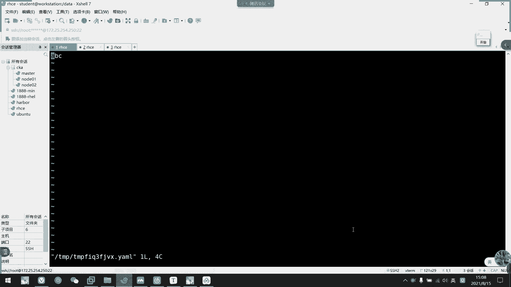
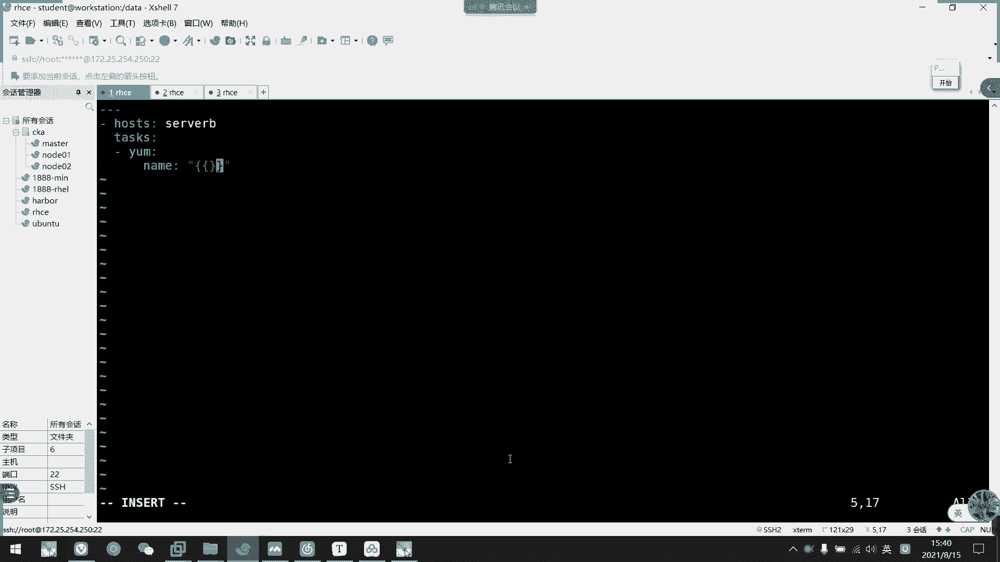

# 2021年7月新版-----RHCE8.2 RH124 RH134 RH294 认证课程 - P65：day12-5 管理加密以及管理事实 - bili_15701050454 - BV1Gy4y1T7ug

好，那么我们继续往下啊，刚刚我们已经呃了解了变量。那么。我们的变量啊虽然。可以写到play里面。也可以写到。文件里面啊，我们的辩论文件啊we files。但是呢有一些数据啊。是有一个安全风险的。

比如说说我们创建用户的一个密码。比如说我们的IP地址。比如说我们的端口号啊这些。是不是一些比较敏感的安全信息？那么。如果我们就这样子写到playbook里面啊，或者是。直接写到was file里面呢。

啊，这样子人家如果攻破了你的服务器，那他就可以得到一些敏感信息。所以这是啊比较危险的事情啊。虽然我们S啊有一个管理方法啊，叫做啊给文件加密。呃。我加密呢啊，他可以。加密我们任何的一个文件数据。

比如说我们那个。What's fors。或者是playbook。啊，还有一些。面料导入的文件。啊，其实就是whats five。啊，然后是copy或者是temp。要用到的一些某呃参数，其实就是变量。

其实也是加密变量而已啊。所以我们加密主要是加密两个东西啊，一个是文件，一个是playbook。那么我们这个怎么创建呢啊。就是我们的一个asible。L后是creed，然后加一个文件，这是创建空文件。

创建个空的。那么我们这个文件呢可以是变量文件啊，也可以是我们的prebook。啊，比如说呃我们把刚才。

嗯，英特。嗯。H yous。我不是拷过来了吗？internet没考过来。我科比一下。稍的稍等。嗯。我们把这个就拷过来哎。把编量文件也拷过来啊。这哇。把这个也拿过来。我们把这两个搞过来了啊。嗯。那么。啊。

不对，我现在应该不要这个。算了，随便吧，我们写一个啊叫做ensible。干。Viard表示C。啊，比如说我的一个。呃。叫key吧。好，这然后我们这里定义密码定义密码，我现在定义一个read。

那么我们就创建出来了。然后我们把这个刚刚的一些考写过来吧，就。对说到收起了。也给据。然后是HKBD啊。LeverDB。S。然后是firewood。PHP。买1个PHP买。C口ND。然后是rap。

Yes weC。🤧嗯有什么。呃，这是PPT。嗯。Rememberber D。还有个firewood。完的说O。那我们这个文件要加密了啊，我们看一下能不能直接看到里面的数据。直接加密了啊，直接加密了。

呵呵。😊，然后我们写一下看一下。不行。那我怎么查看或者是编辑啊，我们要用这个s包。不。要是 we。will查看用will。要提等下啊，要输密码啊。这你们看了。如果要写的。啊，我要edit它。要编辑啊。

我们就用AD可以。啊，这就没编辑了。

我就不改它。啊。啊，这里有写。呃，这是给谢文件加密的啊，编辑加密的文件，我们用edit啊edit。啊，要查看我们有没有啊，这里都有。走。呃。然后下一个是我们直接。使用密码文件去创建啊。

就是说把我们的一个密码。把个密码直接。记录在我们的文件里面啊。就在我这里面。呃。啊，不不不。我开始我也怕死。

啊，就记入在文件里面，没错。呃，比如说我写一个。Scra SE C RED。对，掉了。呃，到时候外给他吧。我先不创建，我们直接用这个文件去看了。干为了。然后我比如说我要看他出用6啊。不啊，要是杠杠。

はす。不的。50。ハす。我的。8了。等于。明见。一样，然后是读我们的这个。Yeah。直接使用这个文件。里面存放密码。那我这样子就不用记在脑海里啊啊，就不用记在脑海里了。啊。

然后直接用这个密码文件去解锁这个文件就可以了。那么怎么用这个文件去。创建了一样的。好，我们来创建一个最用。啊，当然它这个文件不一定说要存放什么变量啊，其实发数去也可以啊，比如说。ABC。好。

然后我们K一下。哦。呀他这样子也可以加密啊。系有。查看啊，我们这里改成view就可以了。对不对？啊，或者是edit。我们都可以通过文件来指定的。

啊，然后呢，如果现有的文件呢没有加密的话，我们可以啊给现有的文件加密啊。这个当时不记得的话呢，没所谓的，但是要有个印象啊，我们直接用S。

Re it。然后是刚刚。hel就可以了。它上面有很多个子命令会都显示出来啊，所以是创建啊呃然后是给当前密码啊，不给当前文件加密啊，然后是编写啊，呃，然后是重置密码，还有查看啊等等都可以。

这个deecscribed应该是删除密码。这应该是上周兵吧。我们后面再看一下是不是啊，那我现在加密啊。那我直接就S包。我也了解，然后是。呃，给我们的ittro。加 me。密码我这边写个123吧。

那就加了啊。是不是。对不对啊，加密了而且还这么长。那么他。的密码又要用另一个文件存了我啊吧，他的密码又用另一个文件存了。S呀。123。那么我们就用这个密码来解密啊。看。为你。嗯。要是。我有。

还不能补全了。要是。这个就可以了。嗯，这么，那我就可以查看吧。为。Okay， 더 sure。

🤧咳。啊，这是我们那个给下文件加密啊。啊，变业账面文件我们刚刚说了，用edit就可以了。

啊，要是更买更改密码，就用为ki就可以了ki。我们来看一下呃。这什么？这。要是一T啊。然要指定文件。Oh。呃，对啊。然后呢呃第一个密码是输我们旧密码。好，然后是新密码。这实是神秘岛。啊。

我新密把设备给下啊。好，幸运我是不的。那我们现在看一下呃，用wi的这个密码行不行。中接S什么。对。V it。嗯。我有吧。刚干。SEC c啊。一T版。搞定了啊，用我这个稍微等一下啊。

やっかり？啊，主席嘉宾啊，果然是这个。果然是这个。啊，加控室输入密码。呃输完了就成功了啊。

我们看一下这个。能不能用文件啊？能不能治理问题啊？啊，应该可以啊，可以的，我试一下啊。我这次不手动输入了。다好지。搞定了，这就删了密码了，我们现在看一下能不能编写啊。直接可以打开啊。那直接给打开。肯定。

那就把密码给删掉了。

🤧好。那我们怎么运行这个加密的密码呢？

Yeah。我们看一下呃，先把它改一下啊。我现在只对我们的编量文件加密了。那我们再里改一下它的一个变量名称就可以了。这边刚刚改了什么名字？哦即起啊。早期。好，然后我们看一下。看一下能不能直接执行。

Yeah。哦哦，是我这个有问题啊。我们坐在摄索机上面吧。看一下能不能直接。他说这个密码文件或者是密码没有。那么呃他这个是没有交互式的啊，我们只能通过选项来指定啊，只能通过选项指定。我看一下选项啊。嗯。

所以应该也差不多，但是他那个顺序可能不一样啊，首以是一个呃这个没变化啊，指定密码文件。🤧啊，然后。这个应该是我们的pas了，用杠K我们试一下啊。哎，这是SCC是吧，看错了。嗯。

这个ask个 pass选下来的。我看一下能不能直接输密码。啊，这个啊ask pass。是这个。他有没有缩写。啊，没有。那我输入密码就可以了。🤧咳。那我们这样子就可以直接起来了。

这不等了。啊。然后第二种方式可以指定我们那个密钥玩件，也是willm plus what flower。

我看一下。啊连直接可以使用了。嗯，还啊，因为我们也安装，所以它这个就出事了。

好。那我们加密就讲到这里啊。啊，这是我们的加密啊。嗯。他说时间有点多。那么接下来。看一下。这个概念叫做faestt。这叫做事实啊事实。呃，在我们执行S的时候啊，有没有发现啊我们啊现在作问一下。

非常好玩啊非常好玩。啊，敏感的同学有没有发现他的tsk有什么问题吗？嗯。有没有一些比较敏感的同学发现了什么？一个一个ts的问题。好。可能没有啊，我们也注意到在我们。😊，play执行过程中啊。

它是读取了个play。然后呢它第一个tsk啊，我们就它第一个tk叫做getting friends。就获取事实。要我们的这个fest就是从这里来。我们没有定义过这个task啊，为什么他在这里？

因它是S保留的机制啊。啊それも就こ有だ了。当是说实话，如果机器过多的话，我们获取这个事实啊，那个时间是比较久的。时间比较久。那么如果不想。破举他怎么办？我们可以这样子啊。呃。在剧本。

最中啊也是host这一。部分这一级别我们加一个getter。算。来后这改个肉啊。等我执行一下。咋写错了。으 응。我想想。Getta fast。是我这个东西写错了。GA啊geter。和拘E啊GA。

然后我刚刚是快出现问题了，然后他的错误是报在这个link上面啊，咱说过了，他指的是这一个快啊，你看速度是不是快很多，他不用获取事实，就少了一个tsask。所以我们不需要获取字试的话。

我们直接把它关掉就可以了。

好，我们继续。啊，就这里。有。事实。我们先看一下这个剪介吧。事实组件呢是Sible用于采集。漏节点就被管理节点的一个设备信息的一个功能。产业机器的一个信息主要包含的一个是IP地址，操作系统啊。

以太网设备。呃，m克地址或者是时间日日期等相关数据，还有意见信息啊，就比如我们的device啊。然后他采集这些信息有什么用啊？啊，就有时候我们需要根据远程主机的一个信息啊。作为我们的一个。执行条件啊。

这。可以添加为呃一些后面学到的一个判断信息啊。就有人说我加了一个判断啊，如果这个主机它的。呃，硬盘啊，比如说它的硬盘在虚拟机上面是以VDVD开头啊啊，VDABCD这样子嘛。啊，我们可以获取啊VDA。

比如是获取VDA。看它是否大于一居啊。若果大EG，我们就执行这个啊，如果不是大浴支，他就也装呃，也也也装不了我的一些工具，所以他就直接跳过不做这个了啊。You白吗。啊。

就抽取那些某些特定的条件来作为判断。所以呢在一些业务场景中呢，我们这个face对我们是很有帮助的啊，省去我们很多的工作。大大的提高了工作效率。那我们看一下这个as of fast的一个用法。啊。

我们可以使用。第呃这个这个set up模块啊来获取到我们的被管理机器的一个fest信息啊，可以使用这个fier啊。来查看指定的信息啊。啊，首以下他模块呢啊获取的是整个face信息啊。

然后报装到一个jason格式中啊，注意要是jason格式。然as fast是最外层的是最外层的。所以呢我们可以通过呃ADho来查看我们的分信息，我们看一下。

我们直接抽取一个主机吧。好，我们看一下。嗯，你看。啊，这就是我们的Sbo。哦，好多啊。人道头啊棱道头啊啊，首先首先是然后它打印出来了一些啊相关的讲你看as per fastest是我们最外层。啊。

所以我们要调用的时候呢，是一级一级下去的一级一级下去啊。首先从Spro开始啊。啊，然后呢它有一个呃它全部的IP地址啊，当然我们当前只有1个IP地址，所以它只打印出来一个啊，然后是IPV6的地址。嗯。

然后是它的一个系统架构啊，差不60。嗯，然后是bes的时间啊，bes版本。啊，等等信息都有。然后我们看一下呃系统时间。嗯。然后还有一个默认的。地址啊，我们通常都是使用这个默认的地址。

就是使用这个fasest的时候啊，都是抽取它的一个目地。啊，首先是address是他IIP地址。然后它的一个呃网卡排名啊。网络地址。网关。啊，这是他的一个网卡名啊，device那个。

表后示他的markac地址。然后他的指网年码啊等等啊，然后他的网购啊是。Well， I it。啊，那就放在这里，然后它的类型啊是我们的interlect呀这些都能获取到啊都能获取到。

所以其实我们那个get first啊。在跑的时候。他时间为什么那么久？其实就因为他要获取这么多的信息。啊，然后是它的dice啊，刚刚说的啊，如果要去VDA。VDA的话呢，我们往下看啊。啊，上区都有啊。

上区大小。有啊，这里有个 size。刚刚我就说了，如果我这个赛事是小于一G的，我就不就有跳过嘛，对不对？啊，所以是抽取了这个纸啊。然后开始是从2048个字节开始啊。哎后连那个VDA的那个UID都有。

看一下有没有文件系统。어자 왜 언제지도。这个可能获取不了他的分分居信息啊啊，他的损一跟分居信息啊，VDAE。嗯。这个才是它的1个VDAE的1个UID啊，好像真的是没有它的一个文件系统啊。

我继续往上看看下有没有啊，然后这里啊是它的一个系统版本啊，是来自于哪里的，然后读取那个文件是哪里啊？就是我们的外ad的rex。啊后得到的一个这部算就是我们的we。版本设我8。0的。好。然后呢。

它的1个DNS啊就是这个。呃，DNS的一个域名。啊，就这个。都能控制到。都能解析啊，这两个都能解析啊。那意思是这两个都能解析。好，要是懂梅啊，这个也是域名啊。

就域名就是我们的lab examem点com。是。啊，然后是套网卡啊，这里传到网卡的一个配用信息。这个就不看了，这是内核的，这些都是内核的一个。黑色的。啊，你看这里也有1个IBV4啊。

所以但是我们不用这里的啊，一般都是获取了deIBV4就可以了。Oh。呢个张玩卡都有啊。第二怎么看。好，继续往下看一下还有什么东西。啊，可肉类核。呢个版本。所以啊他基本上可以把那个机器的数据都读出来。

内存了，看到没有？啊，内存总大小为821兆啊。啊，一下这里是MB啊。呃，然后说挂的，挂小信息。现这里应该就有文件系统啊，看到没有？啊，刚迪外是我们DDV的VDAE啊，然后它的文件是种是彩粉啊啊，在这里。

啊，不在我们的呃直盘经业中啊。

啊，放到这里了。然后是节点名称啊节点名称。But to。拍thon的版本。啊所。基本上后面的都没什么用啊。对，那么我们注意到的是一个啊还有一个加工问件啊，还有有有有内存呢，有分区的，有IP地址。

对不对啊，还有系统加工。啊，这么多的东西都都都足够用呃，我们用的啊。这有架构也不要说没用啊，呃，刚刚的那个re啊，你不要说没用啊，就是说如果我们的机器。不仅仅是用危害危害或者是sal，还有用误弯图啊。

你是不是要做判断啊，你要全部都跑的话，那就没所谓啊。但是如果只在危害上面跑，我们是不是可以调用那一个东西？啊，这就是我们的一个事实啊，这些都是事实。然后呢，过滤啊，我们刚才说的用feer啊feer。

呃。他用的是SOFQDN。

我们看一下吧。S什ible。S a。杠M set。哇。表示。

杠A。Feer。

That。IL。等于我们的S包。这时头。看一下能不能抽出来啊。他又把只把这个信息给导出来了。对不对？那我们往范围往往往大的放啊，看一下还能说什么呢？上亿级看一下有没有3亿级的内容。比如说。嗯。

N识able这个是下一级，这些都是下一季。哦，那是刚刚那个内存都是下一级的。啊，比如说我只抽到这个dress开下行不行吗？That's all best。

嗯。

I don等。呃，deBV4啊。先戳到这里。法问。那我们再加一个点，看一下能不能代表下一级啊。嗯，不行啊不行。他只能说到这一级别啊。我们直接address看下行不行。我觉得应该是不行的。啊，不行。啊。

所以我们只能就收收集到一些啊S5开头的那些东西啊。S不还楼啊这个东西。对不对？啊，这个内存的信息啊。那些事情啊都可以。

嗯。OK然后呢我们这里调用呢有两种语法。呃。这是我们的一个新的语法，这是我们旧的语法。新旧。对。然后他们还有另一种写法，我们现在都用新语法就可以了。我们进入这个SOest后呢就打印我们的主机名啊。

FQD啊就完成限定域名啊啊，然后设BV4的ADR。Eeses啊，我们注意到这里啊。加个美容飞懂啊，是读不出来，是不是？那我们都是从呃Spro开始啊，这是第一题嘛，对不对？啊，后这里代表它的下一级。啊。

然后这里再下一集啊，这个就可以读啊，这种就可以读。但这种写法我觉得是有点复杂。啊，就中括号加两个单引号，里面再加我们的实时的名名称啊。设置名称。掉是这边掉啊。然后一直一级往下用中号啊，一级往下。

但是我们可以简写了这个东西啊可以简写，把这个去掉啊。

改的是我们的一个点就可以了嗯。我看一下能不能这样子。嗯。那什么。所为。然是。你爸爸。第二个。都是message。等于。这就改到一号了。嗯。那时候。Fased。然后下一集是。唉打印那个APP是吧，叫de。

IPV4。然后再下一集是什么来着？ADDRESS。我们要他的一个。I比地址。看下直司。呃，看一下 message Def I is。嗯。是我Spro评错吗。

开着的。D about fshua also describe you。

拼种了PV4DEFAULTIPV4。The task will include our occasion with an un fri available。我改一下吧。还是不行。嗯，他说这个没有定义。

为什么？读不出来了。D four I于4。

我们先弄个简单点的吧。又不是另吧。嗯，也不行啊。我想想啊。第八个户型。我写到。哦，他这里应该。没有获取到啊。我要写成一个剧本。叫第bu本。Sah，8。然后是ts。一ぱ？Message。N死不。F。

然后是。bos内衣。大家这样休不行。嗯，你看这样子就可以了。因为刚刚我们林志明他没有做呃get fast，所以他获取不了。好，然后我们还是呃弄复杂一点。还是用回我们的。Before。IBV4。啊。

就我们这里啊要忽略掉那个前面的S。🤧嗯。对。他读到这个跟一级一级往下的。但是这个写法有点复杂。我们来看一下一个新型的小东西。这些中括号什么都不要啊。什么都不要了。我们改成一个点啊。佢个。嗯，对。

这不就可以了。啊，所以大家要注意啊。是。🎼能方便就方便啊。如果他实在不行的话啊，我们先啊，如果我们先点怎么样都不行的话呢。我们就先把它写回一个啊中括号单引号的写法。🎼那中华大银行能读出来的话呃。

那我们点就肯定写的有问题啊，是写的有问题。然后这里是一级一级，每一个点是大表一级啊一级一级往下的。

啊，O这是我们的一个呃事实的一个使用啊。啊，旧的写法我就不看了啊。你这里还还更加复杂，什么deevice啊VDA啊啊press啊VDAEsize啊，这里可以读绝到我们的VDAE的一个大小啊。🤧咳。好。

然后关闭faest收集啊，刚刚已经说了啊，改成low就可以了啊啊，改成low就可以。啊。然后呢，我们的事实啊。是可以自定义的，但是要写在我们那个基础上，写在我们的工作节点上啊，写工作节上。怎么说啊。

就是要写到我们的EDC festival fe这个里面。

呃。我现在是42B4尔B是4尔B吧。呃，随便改个名字吧。叫什么好了？文件名叫什么好了？呃。Festty吧。主要这里。

可能不对呀，看下。他要用这个对应的格式啊。可以用INI格式啊，也可以用我们的一个接身格式。Well。是。呃，都复制一遍吧。

啊，这里他到时候有一个weerPKG啊，M后是呃DPPKG，M后是UC1U是2，这个对。

嗯，这里都有啊。Please。

那我们先看这个吧。嗯。呃，他说当前目录并没有啊。那我就。MKTIR。

嗯。

Go it。那我们再扩取一遍看一下。介绍吧。嗯。一 and them step up。那我找一下，看一下有没有刚刚我们这定义的。啊，不是这洗看一下是不是。嗯，没有。我写的是有问题了。应该是文件名。

他无法读出来吧。这实验还是能说到的。是不是真的没有啊，你们有没有发现有没有啊？🤧咳。呃，应该是没有了。

要的话，我们看一下范例怎么做。啊，这里啊看到没有？

啊，是文件没有问题啊。🤧嗯。呃。叫做。开死吧。再一个。啊，这个应该有吧，看一下。啊，有了啊，看到没有？local本地的要是读取到我们的文件名啊，文件名下面有什么呢？这です。嗯。

那么到时候我们可以把它当做是变当引用也可以的。我把它当都是被他鱼里。好，我们看一下呃，我们有个HTPD对不对？我看一下。They有。谢谢因为D。啊，已经没有了，那我们安装一下。叫做picage。

然后是rap package。这个纯期有点那个。然后是他。肯不要了那不要了。就直接样。我们调用一下试试喽。

🤧嗯。嗯，叫什么？

Thatible。F。然后是。Logo。要设太。帅是什么pics。

再以后是wes。

P啊。搜PKG。少个。看一下能不能执行了。有。不行啊。看下他说老里没有定你啊。Unified。Eible fast is undeified。是他调用的话。所调用的问题。我看一下。放到哪里去了？诶。

应该loal那里可能要写成什么 local吧。先往下看。你怎么不见了？呃。还说的啊还说哦那OCL没拼错吧，t packageage。看一下。LCL这改成是Sible logogo看一下。

一定得能调用才可以啊，不然就没有用了。呃。炸了炸了。粉什波 logo。There's a wall show。 There's a world call。是可能应该只用logo，应该没关系。

You test。I。Ri。P。嗯。L， def。他手S死吗？这个。应个是。然后看一下这里啊呃它是提全问题啊。提有问题。我们把这些文件改回来啊，那应该是刚刚说的。嗯。应该没问题，是少个S。啊。

应该是可以。啊，点啊。这不可以啊，调度试试啊。那我们呃唉那我们的确啊是要把这个S写上去啊。这里啊那怎我的确要写上去。有一些要写有一些补写来，就是自定义的要写啊。又7点游戏了。O。

嗯。😊，嗯，那么还可以以节省个日期啊。其实也是一样的。

我们直接改一下吧。嗯。说了再写一个吧。呃。我好觉得。他读取有问题。

好，看一下有没有。在这里啊在这里。first有啊，这个不用写。所以就直接按照这里的写法写下去而已啊，把它读出来，然后通过文件直接把它给输入出来就可以了。啊就IN格是它转化了而已啊。

ok啊，这是说我们的一个自定义faest。

好，那我们先休息吧，现15分钟。这个内容。

