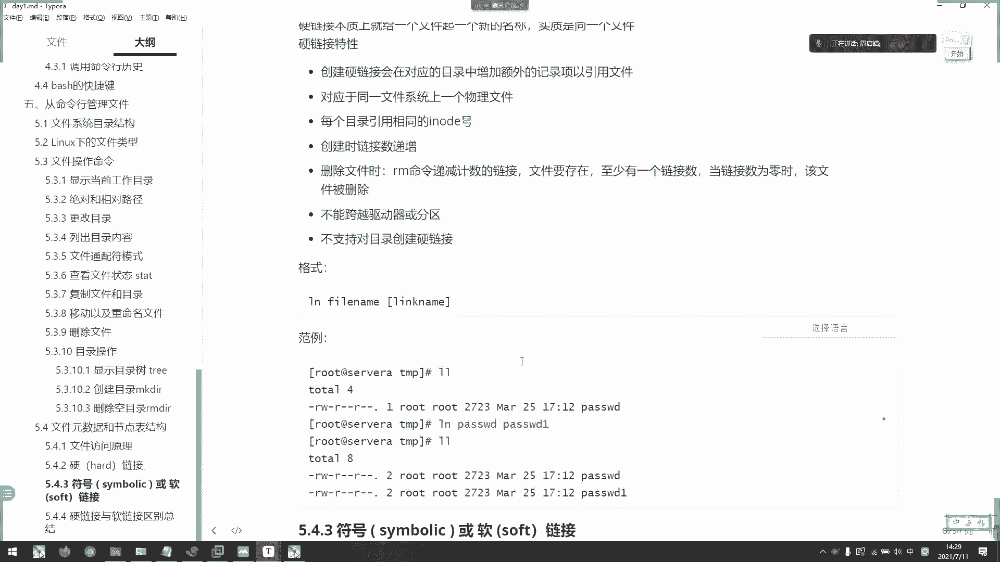

# 2021年7月新版-----RHCE8.2 RH124 RH134 RH294 认证课程 - P6：day2-4 文件访问原理以及软硬连接 - bili_15701050454 - BV1Gy4y1T7ug

啊，是我的重点啊，首要是七大文件类型啊。好，主要是干哎。啊，叫普通文件。啊，第一啊是目录文件。🤧嗯。嗯，然后是L。链接文件。Yes。一。广大文件。嗯Yes。套接字文件。第啊B。快设备。好。

最后一个是我们的C啊。字服设备。我见。好，然后。查看。目录啊。滚。文件。或者目录。啊，我们用L。I wish a close file。哦， director。嗯。好，然后是他看。文件原数据。嗯。😊。

快。The problem。应该这目录没有啊。好，然后是。复制。文件啊。Cool。目录。有货品啊，然后是选项。不tion。然后是fiil。そ that。杠A选项啊等于DR啊。递归且。保留。语言数据。

裤子啊。嗯，然后是。移动。和重命名。好。是。Move。我不选了后4。删除。问题。或者侮辱吧。啊个FA。M。😊，어。就在这里好，然后是增三改差。啊，都有了。创建。目录啊。不唔给爹啊啊。然后是学校。嗯。

然是。对吧所。然后长水上有。干。皮。九月啊咁。嗯嗯，那个叫什么来着，加M。就是删除。空目录啊。I点。没有了吧。这选稍位加一下啊。干系。咁。铁干 we。不对。Move。呃，杠I杠F杠B啊。

就是杠I杠R杠F。O。早上呢基本上就这些内容啊。做啦就再食利用。好，那么我们。看一下啊。下午的。哦，还有个图配符。我要准备付啊。뭐 번 아요。同配服。と方有。啊，讲一些常用的啊，首先是新。所有支付。

冇虎 p备。我他。单个。一意支付。任意个。祝方闭。啊，然后是。括号嚟啊。中午好。嗯，ABC啊。二。嚟。的字符。匹配。好。诶。😊，哎，怎么回事？嗯，那个是什么键iner。有没有按你色键啊。可以。啊。

想摸磨个查询的意思啊。嗯。对啊，模糊匹配嘛。呃，这不算。这只就是单个字符啊啊，每你你们每一个都是单个字符啊。啊。と。匹配。中合。累的。脱制服A不起啊。同讯。嗯。匹配字母。脾配大学之母。小写字母。

脾胃0到9。灯。不。数字。🤧嗯嗯。啊。好道。匹配。所有。嗯以经。数字。嗯。Space。啊。匹配。控制。以及支付表。啊，最个。对啊。啊，O。😊，哎，我空调有问题啊，不制冷的，好热。好。上午内容就这些啊。

好，那么我们继续。来看一下效果内啊。好，下午的。这个有点复杂啊，首要是Ilo的表啊。Iload。表。呃，这是我们文件语文数据，还有节点表啊。alber的结构了啊。

我们看一下文每个文件的属呃的一个属现信息。比如我们有早上看到的stateta啊，可以看到有文件的大小、时间、类型等等啊，称为我们文件的原数据啊，mate data啊m data。然后呢。

此类原数据啊是存放在我们的load里面的啊，就叫做。index load啊in load标中，然后呢。load表中有很多条记录组成，第一条记录对应的存放了一个文件的原言数据啊。

然后第一个load表记录对应的一个保存的以上的信息啊，主要是我们的。Iload number啊这个节点号14我们文件类型啊，权限UIDUID啊链接数什么该文件的大小与不同的时间戳。然后呢。

它磁盘上文件的一个数据或者么，这个是最重要的啊，这是我们的bro好，然后有关文件的一个其他数据啊，这里啊我们state啊上面可以看到的一些内容啊，其实在这里都有啊，这都是我们的一个语数据啊。

所以我们看一下它的一个工作原点。啊，其实。呃，我们。安卓指标啊，最重要的是。让他知道如何去访问数据啊，如何去访问数据。啊，这些都是我们一些权限啊，抽则啊啊时间戳啊大小的原数据。然后呢。

我们上面还有一个block。啊。B o CK啊 rock。啊，通常我们看到brolock的4096啊。3期6。396指的是我们的一个直接时针块啊，直接指针块这指块怎么样呢？啊。

它通过我们的一个I load。然后呢，可以直接指向我们文件的data。啊，这个证就可以直接反射，所以它是4096啊。就是说我们直接只动快。最大。可以达到我们4期6。如果那数据大小。超过了跟96吗。

那么我们就用间接子整块啊，间接子整块就是说。从我们第一个指针。指向另一个指针，然后再指向数据。TA啊，这就是TA。所以呢间接指针这块啊，最大能达到多少了啊，就是4。左右。But。是万。啊，刚这始啊。

确实。就是变成造了嘛啊变成造。然后呢啊如果。那么他就是可以。达到是4K。到4套6。啊，就是用清电这动块。啊，然后双重子针块啊双子块啊也是一样的。继续行也词就可以了啊，最后是删除这块。

这这些都是我们VI系统的底层啊，了解一下就可以了啊，然后是道具啊道具。你捋下就可以了，然后呢。这里可以看一下我们呃文件访问的原理啊。刚刚说了，时间指寸快，我就直接可以通过啊我们文文件只样说了吗？啊。

其实它是分开保存的啊，一个是mate data，一个是我们的data哎。然后这里是。没错啊，他们结合起来。才是真正的一个数据啊。然后我们这里。这一个不是数据啊啊这个不是数据啊。

它这个相等于比如说我这个文件是data。下载F1啊，这个文件。啊，电脑箱的F1。😊，他在我们LL出来的数据，其实它做一条记录。他在做一条记录。呃，最大一块数据是4兆啊。就那一块数据啊，是实是啊。

它天节指针是这样子的，它相当于里面又有4096啊，4096个那个下一个指针块啊，它记录是指针块的大小。明白吗？啊，哎，清楚了。啊，所以它反正我们查看的啊DATAF1。啊，这里可以看到的其实是一条记录。

所以早上有同学说RM。杠F组。把这个记录删了啊，把这个文件删了。其实。他只是删除了他的记录。啊删咗之录。底是怎样的呢？啊，他把这条记录指向的。Meer。贝塔。哎呀，挡住了。啊，还有data。

的这个记录删掉。然后呢，这两个数据啊在硬盘上的快呢其实没有被删除的啊，但是它会被隐藏。不影响。就是说它没有对应的。不表。啊。他所在空间。可能会被禁用呃被用掉。如果我再建一个data。

有一把它原来的在空间给占用了啊。学校学小啊，那就回复不了了。如果。我还没有写过新数据，他的。那个那个空间还没有被使用，它现在他们会被移开的啊，删除以后它会被移开啊，移开到一个空闲位置啊。

然后不显示的大小啊。这是硬盘的一个啊文文件系统的一个工作啊，它具体放在哪里，我不知道啊，但是它原来的位置已经没有了，原来位置。然后如果我写入了一个新数据啊，写入到这一块来把它覆盖我们。

文键系统就会认为它这个真的是完全没用了，然后把这里删除掉啊，真的是清楚了啊，这回是很清楚的。如果我没有写入。那么我的系统是会别帮他给保留的啊，帮他保留的。所以还可以通过特定的工具查找到我们这个记录锁。

指向的文件。相互匹配啊，匹配以后呢，数据就能恢复了啊，这是要通过一些特定的工具啊，主要说具具体有什么工具，我也不知道，因为我们没有错过数据恢复啊。啊，一般人也不会这样做啊。嗯。有备份就好。好，然后呢。

😊，当然然是直接指的快，就说我要访问这个文件啊，F1呃。啊，F一的data。那么我在硬盘上是不是存放了1个F1的 meta datata？然后呢。上面在这个里面是不是有一条记录？是存放在塔。

的文件路径啊，比如说是data。有可以。啊，我先通过访问这个。made data，然后得到了路径以后，是不是就可以访问到它的数据？原理啊。远啲。那么如果是间接的呢。接着啊，比如说我现在。呃。

这个图有点复杂。我重新跨一个啊。比如我现在。是在。T。一、他父母录。是data。啊，他父母孙赔对他，然后呢。t一下面有1个F一文件。啊，那么我们今天的话呢啊首先它这里有一个。

没了 data存放在我们K1一里面啊，存放在K1里面。然后呢。一的原数据啊。也记录了FE的相关信息，然后呢，他再把它的元数去存放在地台里面。那么。对卡是是不是还要准备再跟呢啊，准备再跟。

然后呢我就通过访问。反转。然后再跟上面找到data原数据，然后data原数据找到test的原数据，test原数据找到F一的原数据。然后从而找到F的F一的路径，对不对？最大的一块是4096K啊。好的。

是4K啊，4096啊是4。96。啊，这里其实也是一样，但是你要看清楚它的一个指向啊，指向。你看I3，然后指向它的属性，然后属性呢，然后再指向它的一个data，然后再过来这样子的。

所以我刚刚是一个单路径的一个。就比较快一点啊就比较快一点。好，然后是我们的复制与Ilo的关系啊。早上说到了，首先复制呢。会分配到一个新的啊。Ilo的号，然后呢在ilo的表生成一个新的条纹啊。

我们早上说了啊，就算我们copy杠A。啊，它相当于是新建的一个文件。先车换啫。啊，杠A的话呢可以复制你的原数据过去。但是我新建以后呢，它肯定要改一个C态啊。对不对？改一下其它原数据肯定要得改变。

因为他I的号啊要重新给他啊，要它不是硬链接啊，它是一个新的文件，就要分配一个新的I号给他。然后呢，目录中创建一个目录项。产名称与Ilo的编号关联，然后拷贝的数据啊生成了一个系统夹啊。

是不是原理就是这样啊，原理就是这样啊，然后是IM跟IIload的关系啊，所以是IM啊。首先是我们的。记录。😊，与。Data。咩度地图。所关联的。表啊那个链接。没有了。就就上除记录了啊，上述记录。

这个是记录没有了，但是它数据跟原数据还在啊。然后呢，释放记录以后呢，它原有的Ilo值。啊，就可以备用了啊，I啊Ilo值就可以备用了。如果新数据使用了这个Ilo的值，就像我刚才说的。

他们原来的位置被占用了，他们就恢复不了了。啊。你看把数据块放在空目前列表中，看到没有？我要做。文件系统把它放在哪里，我是不知道的啊，但是啊已经没有可以找到它的一个记录啊。所以呢我说了啊。

数据实际上不会马上被删除的。但是它写入另一个文件时，数据块就会被覆盖。啊，要是移动啊。啊，如果移动命令的一个目标和原相同的文件系统啊，那么。我们移动命令呢用新的文件名创建一个对应的新的目录墙。

删除旧目录。对应的第五的文件名啊，它的一个动作啊啊对是个动作动作啊，它一一就是说它相中的文件系统呢，就是说呃我在同一个。分区啊同一个分区。他们那个文件系录可定是一样的嘛，对不对？啊。

但是我如果在在我这个实验时间里面，如果在d去移动到呃跟，那就肯定不一样啊，或者移动到我们的wordot的全目录肯定是不一样的啊。因为昨天我们做了嘛啊，我们的根释放在HEL。ROOT下的嘛，对不对？

那这个是LVM嘛。然了我们da塔。啊，是另一个分区嘛啊它对应的。应该是也是HH1L了 data塔。这样子。啊，虽然是LVI，但是他们已经不是同一个分区啊，完全不是同一个分区。啊，然后它不影响啊。

就是说如果在同一个文件情况，它不影响那个Ilo值。我们说了啊，I主要早上有提过啊，I load的值。全分区为一。分区为一。说我把它在同一个分区里面移动啊。那个艾只是不会重新分背的啊。

所以呢我们移动只要不移动其他分区的话呢，它相当于我没有创建新文件，只是把它那个位置给移走了而已啊。那数据没有被移动的啊啊，移动的只是我们的记录啊。一共指是记录。啊，所以他时针戳啊。

我们的基态还是会改变的啊。还有数据位置啊，我们的那个叫什么来着？啊，就他说的啊。

呃，STAT。🎼嗯，随便找一个文件吧。还没文件。啊，参观了啊。呃，root3。🎼啊，有啊定。就这个啊。工资。啊，I block就是我们刚刚说的一个呃Iload表的最大限制啊最大限制。

好。所以呢我们移动的呢相当于是move。啊，相当于是我们的copy加IN啊啊copy加A它虽然没有新建一个记录，但是。他还还是会改变它的一个啊时时间错啊时间错。好，这些了解一下就可以了啊。

文件系统的底层啊。其实。没有说的那么。呃，就是说目前不需要知道那么深入的啊，不是做不是做硬盘的，真的啊就没太大必要去了解那么深入啊，知道就可以了，知道这可以。啊，对对对对对，知道就可以了。

好像我们玩了那么多年windows了，你你你还有有想过它吸盘是什么东西吗啊。但是这里我要给你们提一下而已啊啊，知道肯定是得知道的啊，他怎么访问的啊，访问的一个原理啊，就是跟你们说一下。

lo的表这个怎么来的啊，不需要了解太太深入啊。当课外知识学一下就可以了。哇。万一有人面试问到这些了，是不是好？😊，那么我们了解了I罗呃文件访问原理呢，我们就得了解链接啊链接。好。

我们linux里面呢有两种链接，一种叫做硬链接，一种叫做呃软链接LM啊啊 software。你好啊。说。对。S， O， F，P。LINK啊。不链题啊。要求E链接一个左要链接，我们先了解一下E链接啊。

要求E链接。一连接。

本质上就是给我们一个企业一个新的名称啊。我们来看一下，我目前台上面有东西，对不对啊，我现在。写一个文件。啊你面里有有hello。嗯。好，我们看开始一。啊，有hello，对不对？写了一个文件。

然后我们通过LL杠I啊杠I可以看到它的I的值啊，你看它在我们当前分区中啊是。🎼131啊141。那么我再给他创建一个硬链接啊，硬面怎么圈呢？直接是LM然后啊等等啊，还是先再创建一个文件夹给他啊。呃。

叫t一啊就t吧。就です啊。然后呢，我现在给他创了个硬链接放在我们电子里面啊。🎼L都是。🎼然后放在我们pas下啊，叫做hard软啊har唉。Not allow for directly we。Yeah。

是不是反过来了，文件名链接名没错。嗯。

应该可以发过去啊。问题 hardlink lot for delivery。哦哦哦哦对对对对对对啊，他目录啊，目录不能用一连接啊。啊，搞定啊。那么我们现在啊杠I啊，它依然是131，对不对啊，131。

然后呢，我们现在。看哎看着啊。🎼t仪。呃，test里面的哈。Yeah。他们的Ilo是是一样的，ilo是是一样，而且链接数为2链接数为2。那么。朋友们，我问一下。我们hard里面的内容是什么？

看咗点咩内容。啊，同学们。得我这个测吧好，hello啊。Yeah。嗯。嗯。😊，好的。没有两个文件，为什么是T一呢？啊，为什么T一呢？😊，你们想的说怎么会是3一了啊？😊，就算我是软链接，也不会是T11啊。

我说它里面的内容啊啊然K1一的内容啊，这样子可以说啊。对啊，然后。那么我现在。修改一下呃。呃。太一的内啊。把它改成。Hello，我。那么。我现在hd的内容是什么？啊，他的利用是什么？啊。啊。

还是这谁的利用对吧？🎼那么我们现在删除T1。三个开始1。他的还有内容吗？😡，有什么内容？啊，什么内容？还是这11的内容对吧？很好啊很好。😊，啊，为什么呢？😡，啊，是因为我们一链接。相当于是一个人。有。

两个名字。啊，比如。我的贝塔。啊，所以是个公司。data下的ts。现在是加。啊，然后呢，我刚刚那个文件t。一啊。公司原则叫做全民。回到家，人家叫他小明啊。那他还是不是一个同一个人啊？啊。

他是不是同一个人？对啊，然后你在这个公司离职了，那就删除记录了嘛。那小明还收不是你？啊。所以他们本质的。内容是什么呢？他们只是一个记录。而且还是Ilo的相同的记录。指下的都是data。

还有vi的data。啊，对不对？啊，所以我删除任意一个都不影响我的ilo值的一个关于。漏的标。指向原数据再指向数据。的记录啊一点都不影响啊。谁在里夸了个点。ふ。啊。谁怕了。给他擦一下，我有强迫责。😊。

好，不管了。

또。

好，这是一年级。那么。我们现在。啊，LBOK看一下。road跟我们data不在同一个分区，那么。我现在had啊，不对。嗯。Nom。在时下的。好的。能在howword的加目录下创建一个链接吗？可以吗？啊。

同学们可以吗？好，不了啊。因为他们。对啊，不能靠文件系统啊，非常好非常好。因为刚才说了，我们的i load。🤧Okay。分区。唯一。我们这里已经有L的。并且。他是131。如果到这边啊，另一个文件筒。

看好。他131已经有文件了啊，比如说131是一个叫做FE的文件。咋搞？啊，已经有个记录在这里了。所会有一个重步现象啊。所以文件系统是不允许跨分区去创一链接。全分居为一啊。说你到这边来啊。

要改L的也不不可能啊，不存在的啊不存在的啊。因为他记录不在那里嘛啊，虽然就是没错啊，是我的data。还有matedata。存放在我这个。里面对不对？你怎么可能这里会找到我的数据和源数据呢？😡。

所以不存在了。是不人在的。啊，点记得啊okK为什么硬链接不能画出去啊，就是这个原因啊，就是这个原因。

好，继续往下。好，那么我相信啊。一链接大家掌握了啊，就是一链接一点都不难啊，一链接一点都不难，对不对？啊。但是什么。

一个问题啊。我在这里。有个。🎼hud一对不对啊？hud对不对？嗯。我这他的，然后。🎼呃，我再创建一个一连级。嗯，就放在这里吧，交 test吧。诶。嗯，我没有切换进去啊。先发去。Fest。好好。

我这里创建了一个一连接。那么。我可以删除原文件，那么。我这样子说备份吗？啊，同学们，我这样子双备分吗？算不算做了备份。嗯。😊，Okay白。啊。啊，恭喜你们啊。道。不算被。么叫备份啊？2辈份。早上。对。

可以。有copy是做法啊做法，但是为什么说copy是备份呢？首先我有一个文件t。我通过复制。好，通过复制。这个test一的文件出来。虽然他们的内容。是相等的。啊，例容。摄像东的。这他们A脑一样吗？

他们d塔一样吗？啊。他和电台一样吗？嗯。data有咩有 data 一样吗？其实我这里给了提示啊，我给了提示啊，我说内容是相同的。😊，啊，内口是相同的，data相同吗？啊，对啊，不同啊。

我们 copy出来的文件，它是重新拿了一块地，拿了一块地存放我这一个data。这里它原来的data已经有一块地损么的data，对不对？所以我们K一是有占用空间的啊。然后呢，第面接。指向的。

都是同一个数据，对不对？啊。下周的同学是，所以我删了只是删了这个名字啊。啊。但是我备份啊就不一样，他这个数据是完完全全是他自己的。他们所以我再拿拉拿一个文件稿啊，他修改的知是跟迭的，但是备份不一样啊。

无论修改哪一个保存下来是哪一个修改了，对不对？这才叫做备份，这才叫做备份。

备份的不是为了什么的话？比如说我。

有拿到一个应应用服务，我要改它的配置啊。要改它的配置。那么我是不是要把先先把这个配置给。保留一份出来。啊，点BAK啊作为备份。如果他们我改了这个这个跟着改，我这样子做还有意义吗？啊，这个杯方案有意义吗？

嗯。啊，这个备份有意义吗？我备份是为了什么呢？回退嘛，对不对啊？备份为了回退嘛，如果我这里写不好了，我还可以拿把把备份拿出来，让他继续参加工作，对不对啊，所以这才叫备份，所以一链接不算是备份啊。😊。

也不是快钱方式啊。也不是快捷方式，接下来才会讲到快捷方式啊，多链接。

老人甲。软链接财叫快计方式啊。它只是多了一个记录啊，这个叫做多了一个记录。明白吗？好。现让我们开下网链接。好。😊，有人间王学是相读于。我们的一个快计方式啊，比如说呃网易云音乐。睡个。快说是他书记。

他全包的是什么？啊。他询问的是什么？他全放的是不是网易云音乐这个哎呀，我打开这个看不了。啊，打开文件锁在位置可以啊。它存放的。这做目标taarking啊taring。冇有啊。啊，对，没错，资产。

所以它主部的是什么呢啊。地止位止他记录了，让我们看一下这个属性对比对比一下。啊，呀。大小进不相同啊，然后别数就进步相同。所以会捷分式啊会捷方式可以说软链接。

若链接。啊，是。原文件。存放的是原文件的。美塔 data塔。啊。他存放的是，因为我这边没有地方，然后。有链接自己有它的没他 data啊。这个能理解吗？啊，这句话能理解吗？啊，就是说。转链接。

我再重新写一遍啊。短链接啊，我我这里改成LINK吧啊，用那个吧，中文太难写了。嗯。😊，怎么弹出来这个好，首先是data。呃是美个 datata。好。😊，link的 militarylit它是有Ilo。

load表记录对不对？load表记录，然后是面上指向的是我们软连接这个文件。好，然后非场是数据啊，数据它存放的啊是我们目标。文件。原数据信息。好，可以啊。到这里，同学们，我问一下链接本质是什么？啊。

说吧。软链接的本质。啊，这个很难回答吗？他的本质。😊，我图上面已经给了提示啊。啊，图上面就给他提示。他错了错。😊，邮链接本质就是一个文件嘛，对不对？😊，他有。あはは。嗯。

你们不如你们不如别别回答这快捷放诉的。😊，快捷发式是软链接的一个别名好不好？我说他的个本质啊。😊，本质是一个文件，你看它有大小啊，它有大小。他大讲，然后他也有他的一个数据。然后他数据。数据加原数据。啊。

我都说了，子霞，然后他还有一条记录啊啊，他有路径啊，对不对？所以它本质是一个文件啊啊本身是一个文件。😊，因为他只是他的那个电脑是存放别人的元数据而已啊。它是一个文件啊，所以它是一个文件。哎呀，笑死我了。

😊，好，那我来看一下啊。😊，🎼软链接创建啊LS我软链接。啊，看一下。慢的杠T肯定不算啊。这个叫挂仔。😡，挂载怎么可以说是有链接啊啊。话怎么可以说是软链接呢？啊。或者选项啊，盖s啊，ges就是软链接了。

软链接，然后是原文件。啊，然后。目标。那同学们问一下，软链接能跨分区吗？啊。为什么？为什么为什么都可以啊？啊。为什么他可以呢？啊。好，没错啊，不错不错不错不错不错。大家学到了啊。啊，大家学到啊。好。

非常好。😊，那我们大家看一下啊。Yesす。哎。🎼怎么没有做出来了。出色啊。哎呀，我知道了。哎。我知道他这里是失败了哎。嗯。😊，先把它删掉。我知道什么问题啊。因为这里有点特殊，我本来想挖坑给大家的。

😀Yeah。😊，啊，本来想挖个坑的。啊，先写上学的路径吧。嗯。😊，我会删了吗？你怎未删得了。🎼欢迎杠2组。嗯。算，从现在开始。反正这是路径。那就没问题啊，看了。啊，然后我们来。L隔矮。Data。🎼不。

还有还有当地的test一。🎼哦，我知道了，刚刚。改错名。你。嗯，你看他们安装的时是不一样的。hello，这是不一样。呃。但是我用绝对路径。就有点麻烦，但是。啊，说呢。也没所谓，用这个东金。

到时候我这里提一下相对路径，我们来看一下呃，如果你要移动这个文件的话，而且。移的不深也没关系啊，但是我建议的话呢，创建有的链接一般是用相对器啊，我们看一下跟。你看他们这些都是用的。什都路径的什么路径。

而且他们创建出来的时候呢，是反过来相对的。就是说我们通常商要路径啊，比如说我现在是在加目录嘛，然后它的相对于data是不是根号上的？啊，是不是？啊，是以我自己为标的物呃，被标标标的，对不对啊。

标的物就参照物啊。参照物这个概念应该懂吧啊，早上说过了啊，以以我本身为参参照物，然后相对于它我是不是上一级施更，然后再到他d塔啊，是不是对不对？啊，这这相对啊这相对。一本身，然后呢软链接是反过来的啊。

它是以link。的目标跟sources。哦呃相对的说我link。的位置。啊，相对于sources的位置。啊，link是3角5啊，比如说呃明显刚才刚才刚才失败了原音啊。🎼该是不了原因就是啊，我这里开一。

🎼啊，然后是t1。然后创建了一个root。テスて。一。那么同学们。我们现在做出来的是是个什么样的啊，是个什么东西？我都说了，它相对于这个，那么它是不是一个传照物啊，传照物。那么。一个删路径。

他就直接看link商业级。要它链接的就是我们word上有没有T1。所以我刚才试了说他纸上没有找到T一这个文件。啊，所以我们要用相对路径创建文件的时候，一定要注意啊，一定要注意这个问题。明白吗？啊。

明白吗？同学们。啊，一定要注意这个问题。来靓只。要用。决对路径硬面啊不然后原文件是相对于软链接的。选的录地。啊，明白吗？同学们。就反过来啊，他们的一个参照反过来。🎼啊，很好啊。

那么如果明白了这个的话呢啊比果在这里打S。首先。嗯嗯。其实这里已经没有意义了。这是。嗯哦。对，一个。没有错。Yeah so。他。没有任何符号，跟我们这个病啊是一样的，因为它当前是在跟销，对不对？

再等一下。然后他的。我这样写吧。然后呢，它作用链接是空下的。右侧。并。那么。以这个为参照物，它的商意是不是跟。对，没有了啊，这个直接没有。跟下的下一级user他们评级嘛，对不对？user。

然后user下的并有要些指向。就这么来的吗。什么来的？好。有人姐，不太明白。😊，你回头看一下山对路径啊，回头看一下山对路径。然后。跟我们原本的相对路径。我说了，存市路径本来是以。安全。位置。做传造物。

大家为这个做任务，然后软链接是反过来以链接文件为参加物。你反过来就知道了。回去想一下回去想一下。反过来就知道了。快来我这里做个演示吧。哎呀。这个点是不是我自己跨的到底。谁画的。你们看不看到到这里有个点。

😊，能不能看到？即。啊，能看到我以为只有我能看到吗？那行，那不管他不要急。我有点强迫好，嗯，我这边创个例子出来吧。😊，好。比如说我现在在test里面。啊，要创建一个。关于这个case一的链接文件啊。

关于这个case一的链接文件。那么我们先LN杠S。先把我链接文件写出来，就当前。前呃叫做ts点link吧。那么。相当于他再上一级点点。🎼たし。看到没有？能理解没有？但是。一这个文件相当于我之前目录t下。

我这出现一个文件，是不是叫做啊t？点 test。link啊，要缩写啊，要然后。2T1是跟这个同一同一层吗？那么我以这个为标的物，它是我上一层输入点点就可以了。啊，点点就可以了，对不对？嗯。有什么好处啊？

有什么好处啊？就他如果移动同一个层级移动。我指向不会有变框。所有路径如果你移动了，就肯定会出错啊。如果你移动了，它就找不到这个文件了。啊，路径还有可能不会变化，还有可能不会变化。明白吗？Okay。对。

所以我们系统中很多都是用三个路径自己做运做做做软链接的啊。不是我说的，是系统告诉你的啊，系统告诉你的，你看你要专元链接，全都是三对路径。对不对？啊，人家这喜那家全都是相对不性。好，可以，那么理解了，吧。

一天前我们就休息。

