# Linux文件管理：2-4：文件访问原理与链接

在本节课中，我们将要学习Linux文件系统的核心概念，包括文件访问的基本原理、硬链接与软链接的区别与创建方法。理解这些知识对于高效管理Linux系统中的文件至关重要。

## 文件类型概述

Linux系统主要包含七种文件类型。

以下是这七种文件类型：

*   **普通文件**：最常见的文件类型，用于存储文本、程序或数据。
*   **目录文件**：用于组织和管理其他文件的特殊文件。
*   **链接文件**：指向另一个文件的特殊文件。
*   **管道文件**：用于进程间通信。
*   **套接字文件**：用于网络通信。
*   **块设备文件**：用于访问块存储设备（如硬盘）。
*   **字符设备文件**：用于访问字符设备（如键盘、终端）。

## 文件操作命令回顾

上一节我们介绍了文件的基本类型，本节中我们来看看常用的文件操作命令。

查看目录或文件信息，我们使用 `ls -l` 命令。

查看文件的元数据（如大小、时间、权限等），我们使用 `stat` 命令。

复制文件或目录，我们使用 `cp` 命令。`cp -a` 选项可以递归复制并保留所有元数据。

移动或重命名文件，我们使用 `mv` 命令。

删除文件或目录，我们使用 `rm` 命令。`rm -rf` 可以强制递归删除。

创建目录，我们使用 `mkdir` 命令。删除空目录，我们使用 `rmdir` 命令。

## 通配符简介

在操作多个文件时，通配符能帮助我们进行模式匹配。

以下是一些常用的通配符：

*   `*`：匹配任意长度的任意字符。
*   `?`：匹配单个任意字符。
*   `[abc]`：匹配括号内的任意一个字符（如a、b或c）。
*   `[!abc]` 或 `[^abc]`：匹配不在括号内的任意一个字符。
*   `[[:alpha:]]`：匹配任意字母。
*   `[[:upper:]]`：匹配任意大写字母。
*   `[[:lower:]]`：匹配任意小写字母。
*   `[[:digit:]]`：匹配任意数字（0-9）。
*   `[[:alnum:]]`：匹配任意字母或数字。
*   `[[:space:]]`：匹配任意空白字符。
*   `[[:cntrl:]]`：匹配任意控制字符。

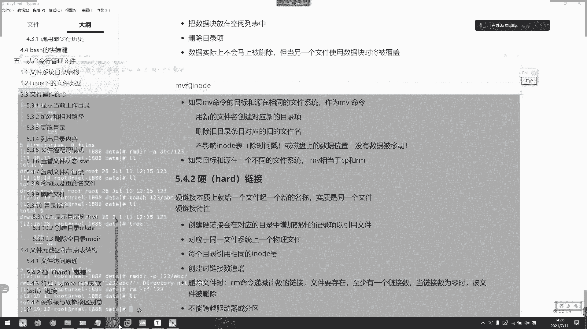

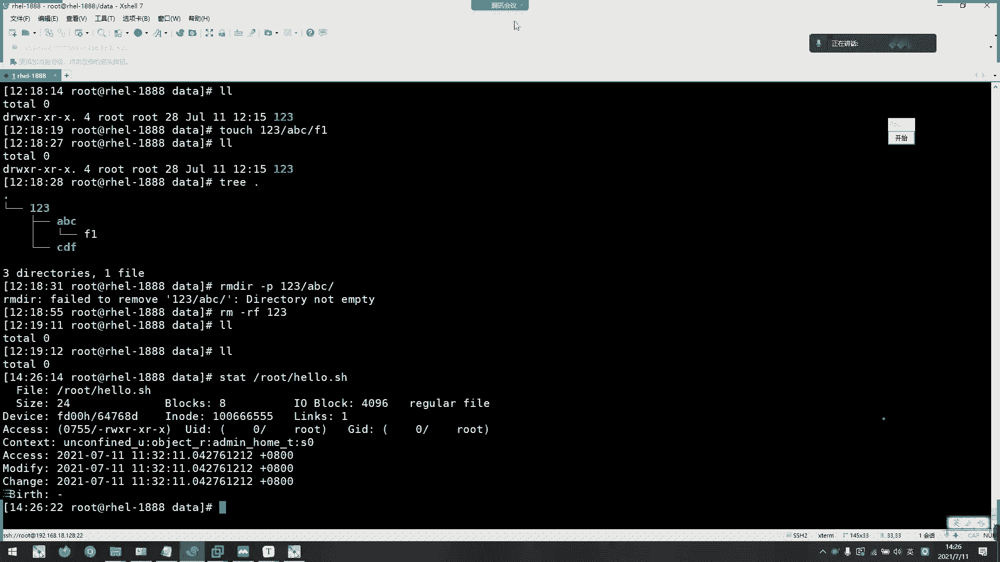

## 文件访问原理（Inode表）

理解了基本操作后，我们需要深入一点，看看文件在系统中是如何被组织和访问的。这涉及到Inode表的概念。

每个文件的属性信息（如大小、时间、类型、权限等）被称为文件的**元数据**。这些元数据存储在称为 **Inode（索引节点）** 的结构中。一个文件系统有一个Inode表，其中每条记录对应一个文件的元数据。

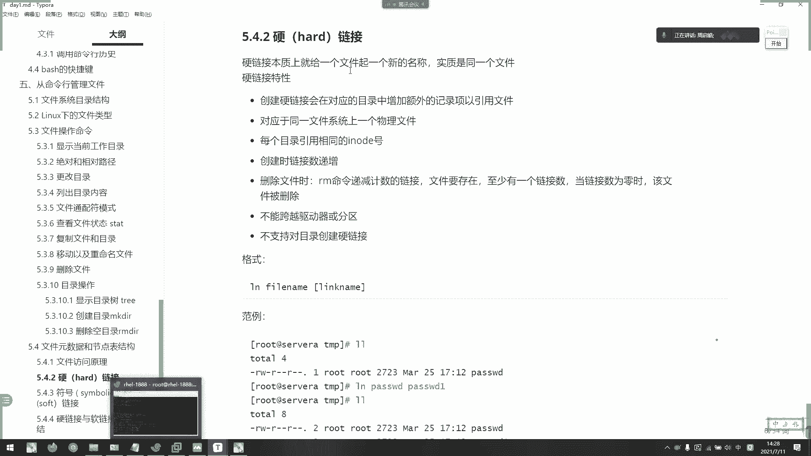

一条Inode记录主要包含以下信息：
*   **Inode编号**：该记录的唯一标识。
*   **文件类型与权限**
*   **所有者与所属组（UID/GID）**
*   **链接数**
*   **文件大小**
*   **时间戳**
*   **指向数据块的指针**

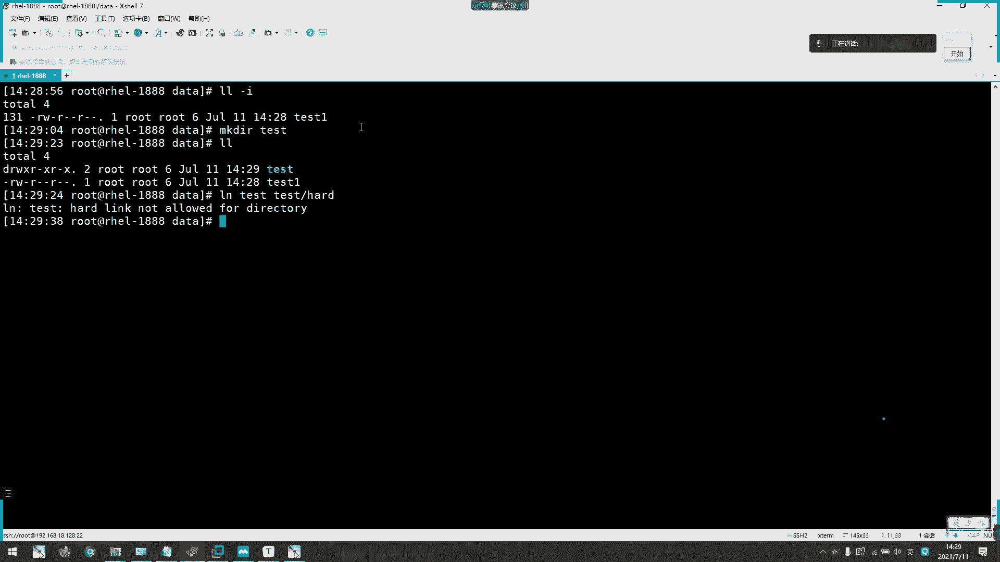

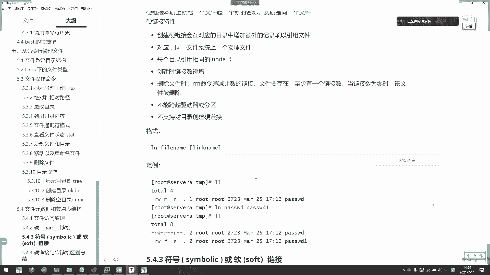

最重要的部分是**指向数据块的指针**。文件的实际内容（数据）存储在磁盘的数据块中，Inode中的指针告诉系统如何找到这些数据块。

**工作流程简述**：
当系统访问一个文件（例如 `/data/f1`）时：
1.  首先在目录中找到文件名 `f1` 及其对应的Inode编号。
2.  通过Inode编号在Inode表中找到该文件的元数据记录。
3.  根据记录中的指针，定位到存储文件实际内容的数据块。

**关于删除**：
当使用 `rm` 命令删除文件时，系统只是删除了目录中文件名到Inode的这条记录，并将Inode标记为“空闲”。文件的实际数据块并没有被立即擦除，只是被标记为“可覆盖”。如果后续有新的数据写入，这些块可能会被重用，原数据才真正丢失。在此之前，可以通过专业的数据恢复工具尝试找回。

## 复制、移动与Inode的关系

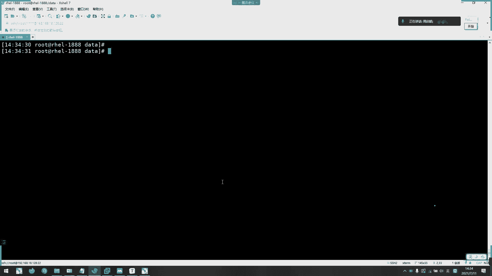

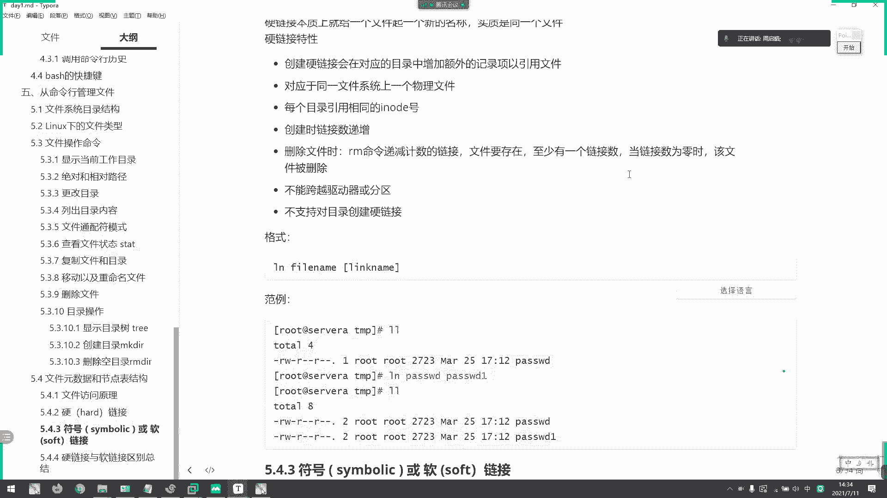

了解了Inode的基本原理，我们就能更好地理解文件操作背后的行为。

**复制（cp）与Inode**：
复制操作会创建一个全新的文件。系统会分配一个**新的、独立的Inode编号**给新文件，并在目录中创建新的记录。即使使用 `cp -a` 保留元数据，Inode编号、某些时间戳等依然会改变，因为这是一个全新的文件实体。

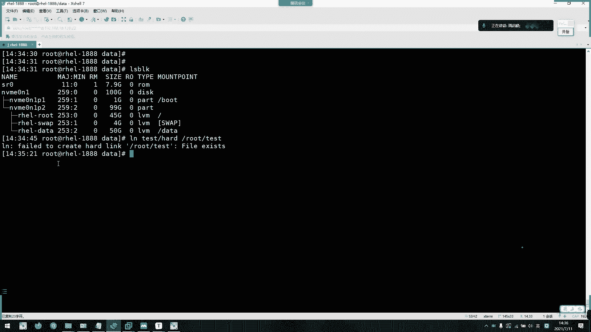

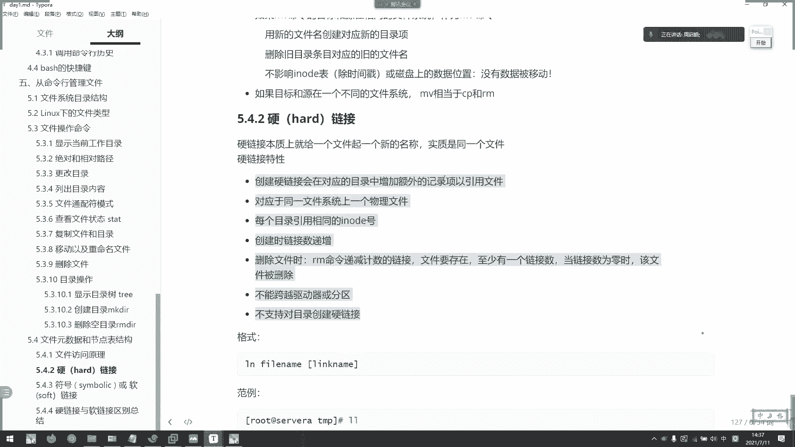

**移动（mv）与Inode**：
移动操作的行为取决于目标位置：
*   如果**目标位置与原位置在同一文件系统（分区）内**，`mv` 仅仅是修改目录记录（改变文件名或路径），文件的Inode编号和数据块位置都保持不变。这相当于“重命名”。
*   如果**目标位置在不同文件系统**，`mv` 的实际行为是先**复制**（在新位置创建新Inode和文件），再**删除**原文件。

## 链接：硬链接与软链接

文件访问的核心是Inode，而链接则是基于Inode的巧妙应用。Linux中有两种链接：硬链接和软链接。

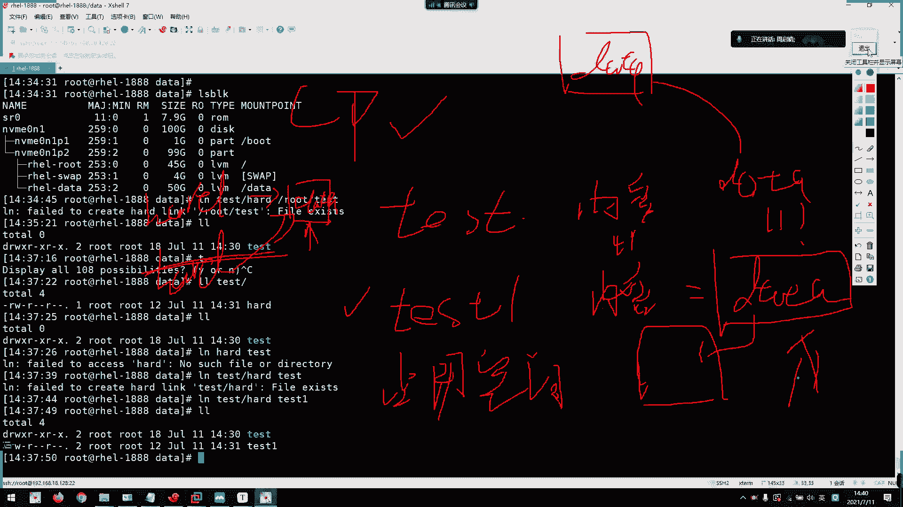

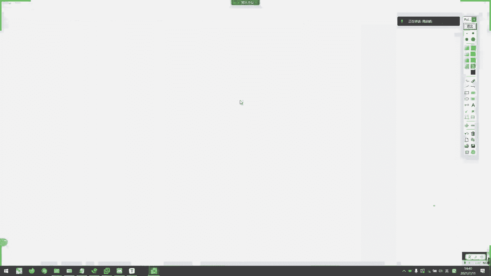

### 硬链接

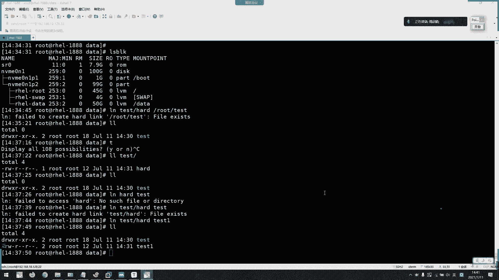

**硬链接**本质上是给同一个文件数据创建了另一个目录入口（名称）。它直接指向文件的Inode。


创建硬链接的命令是：
```bash
ln <源文件> <链接名>
```

**硬链接特性**：
1.  硬链接与源文件拥有**相同的Inode编号**。
2.  查看文件属性时，链接数会增加。
3.  修改任何一个链接（或源文件），所有链接的内容都会同步改变。
4.  删除源文件或其他硬链接，只要链接数不为0，文件数据依然通过剩余的链接存在。
5.  **硬链接不能跨文件系统（分区）创建**，因为Inode编号是分区内唯一的。
6.  **硬链接不能指向目录**。

**硬链接示例**：
```bash
echo “hello” > test1.txt          # 创建源文件
ln test1.txt hardlink_test        # 创建硬链接
ls -li test1.txt hardlink_test    # 查看，可见Inode相同
rm test1.txt                      # 删除源文件
cat hardlink_test                 # 硬链接内容依然存在，“hello”
```

**重要理解**：硬链接不是备份。所有硬链接都指向同一份数据，修改即全局生效，无法实现版本回退。

### 软链接（符号链接）

**软链接**类似于Windows的“快捷方式”。它是一个独立的文件，其内容存储的是目标文件的**路径**。

创建软链接的命令是：
```bash
ln -s <目标文件或目录> <链接名>
```

**软链接特性**：
1.  软链接拥有自己**独立的Inode编号和文件大小**。
2.  文件类型标记为 `l`，内容是对目标路径的引用。
3.  如果目标文件被删除或移动，软链接会“断裂”（成为悬空链接）。
4.  **软链接可以跨文件系统**，也可以指向目录。
5.  创建时建议使用**相对路径**，这样移动包含链接的整个目录结构时，链接不易失效。

**软链接示例**：
```bash
ln -s /path/to/target my_softlink  # 创建绝对路径软链接
ln -s ../target relative_link      # 创建相对路径软链接
ls -l my_softlink                  # 显示类似 `my_softlink -> /path/to/target`
```

**路径注意**：创建软链接时，指定的目标路径是**相对于链接文件本身的位置**来解析的，而不是相对于你执行命令时的当前目录。

---

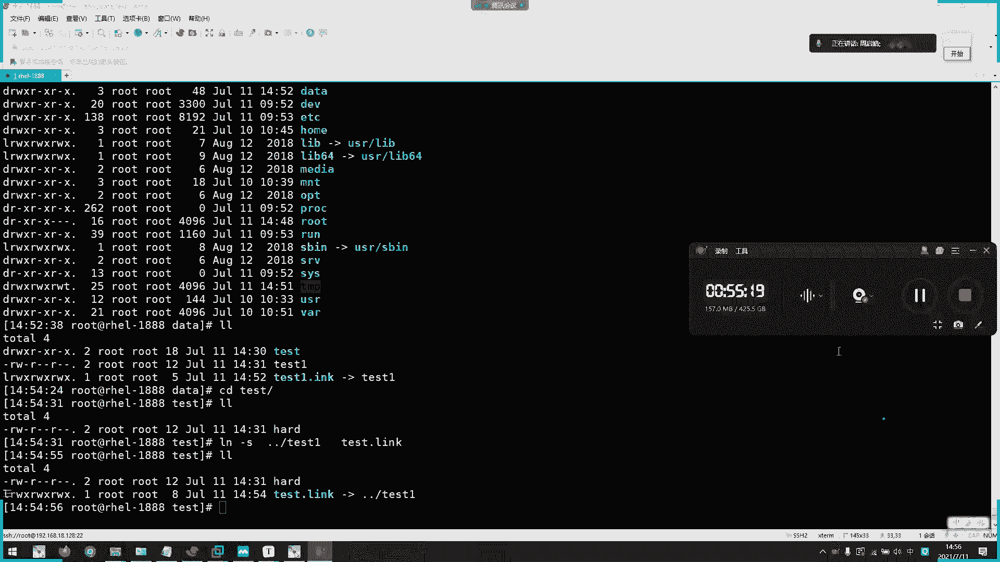

本节课中我们一起学习了Linux文件系统的核心访问机制——Inode表，并深入探讨了基于Inode的两种链接方式：硬链接和软链接。硬链接是文件的别名，共享数据与Inode；软链接是独立的快捷方式，仅存储目标路径。理解它们的区别和适用场景，能帮助你在实际工作中更灵活、更安全地管理文件。