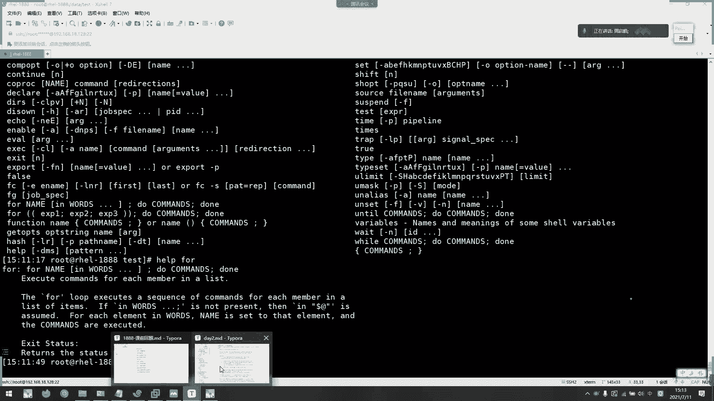
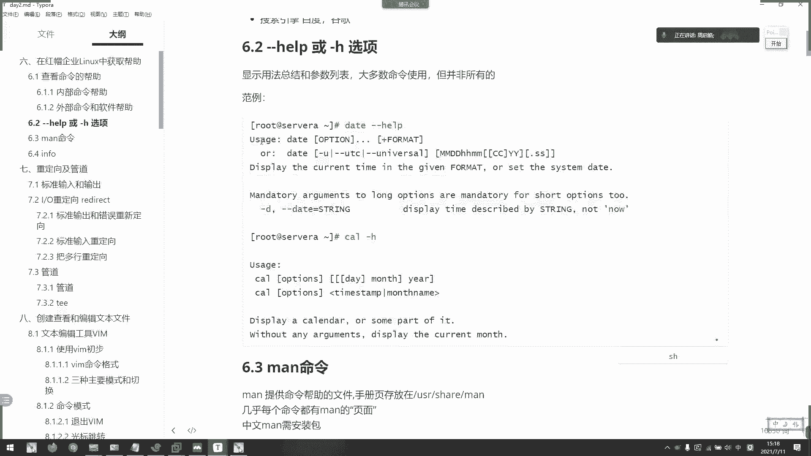
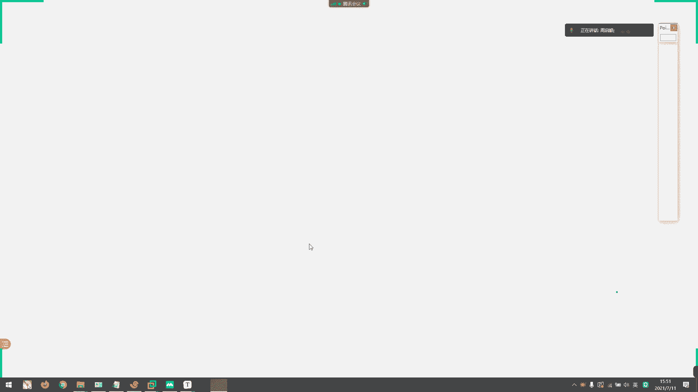

# 2021年7月新版-----RHCE8.2 RH124 RH134 RH294 认证课程 - P7：day2-5 获取帮助以及重定向和管道 - bili_15701050454 - BV1Gy4y1T7ug

新的章节了啊。🤧嗯。好。我们这一张讲。啊，已经我们已经脱离了系统原理了啊，系统原理了啊，后面所有都是框架了啊啊，我们来看一下。通过。系统。获取帮助啊，通过使统获取帮助啊，首先。是命令的帮助啊。

我们命令有两种，对不对？一种是内部命令，一种是外部命令啊。我们内部命令呢啊它有一个howll，叫做how。昨天已经挑过了。

🎼加好。哎。Help。本身。就是一个内部命令，要了hel。它能获你的帮助就是内部命令的帮助啊，内部命令的帮助啊，所以help加com on啊，help加com on。

然后呢或者是man啊用manman工具我们稍后再讲啊，它可以对。

呃，Y用命令内部命令以及第三方应用，它都有它的一个帮助业啊。比高 type history啊。🎼一模一样的东西是不是啊，一模一样的东西啊，hel看一下吧啊。

🎼呃，我们用for吧，for句环看到没有？啊。要了到这里就有个格式啊，example等等。给了一个介绍。啊，什么foring啊inward啊啊就是说这个变量。在一个列表当中啊，迭代循环。

要做的什么东西啊，要做什么东西，就就就是如果。有个框，这个框是代表啊，不是。啊，这不是代表判断啊，它就是列表啊列表。然后呢。如果能连加进去啊，是处的，直接就度啊，直接是度啊。然后多我们一个循环底啊。

这个叫循环体啊，当我们学到变量的时候就会详细的讲解，然后完成啊，就是说它。

比如说我这里是1234，然后它迭代嘛，然后第一个一复知道那，然后。

做这个东西2。都令做这个东西3做这个东西是这个东西啊，等到它没有了啊，完成那就循环完成了，循环完成就大结束啊。别的啊，所以啊这已已经有一个讲解了啊，已经有一个讲解了。啊。好。😊，这就是我们的。

help帮助啊help帮助。嗯。然后Y文命令呢啊Y文命令我们一般来说呢，它有一个选项啊，叫做杠尬help或者是刚H啊刚HH啊。比如说我们的一个呃free啊，由于它的钢曲是有一个特定水项，所以它出来啊。

所以这里给他做了一个刚 help。

风格问题啊。因为他去呃刚H选项已经有用了啊，用过了，所以它只能有刚刚 helpp啊。一般来说啊一般来说很多命令呢它都有help刚或者是HH都能用的，很多很多命令啊很多命令。但是你现在叫我指出呢。

我也不知知道了。看一下PS有没有。确始没有。😊，啊。别看我现在直播也找不出来。呃。copy啊，下一去。啊，没有啊，那就刚刚跳。呵。😊，是很土然。没有多选项，那你看很多都有一个多选项穿选项的啊。

一般来说我们都是用短选项比较多啊，但它有多选项是等义的啊，我们都是用短选项啊。但是长选项的好处是什么呢？我们看帮数以后呢，就知道它这个A是代表了什么东西啊，A代表了什么东西啊，B又代表什么东西。呃。

肝癌为什么叫肝癌？然后肌肝穿一上我就。得到这个单词，知道这个单词这个含义了，对不对？啊，这样子就很好的去记我们的一个短选项是什么含义了啊。

好，然后同时他也能用我们的面手册啊。用我们的麦串啊，还可以用我们的inform啊inform。然后呢，第三方应用呢啊。有一些程序会自身提供。我们的一个帮助文档啊，比如说我们with me啊。

instore啊trans log啊等等这些东西啊，一般二进制安装都会有啊，二进制安装的包里面都会有啊，然后包括我们的asible，我们asible后面会学到一个叫做呃 systemt。系统用户吧。

系统角色吧。是我们觉得。然后他这种角色的。目录里面呢，它有一个叫做read me。啊一 a。第一。M1。点ND。这个就是这个角色的一个帮助文档啊。到时候我们学到S5的时候就知道了。啊，早上我已经说了。

首先查系统帮助，什么帮助没有查官方文档。关方文档你没有了，再去论坛。才是舒服引擎啊。我们的一个查找查找帮助的思路啊，不要说一一呃每遇到问题，我直接百度谷歌了啊。啊，把滚可能说实话。在论坛上面啊。

在这些第三方找到的答案可能都没有官方的信晰啊。或者是人家直接给了一个步骤啊，你也不理解啊，说实话你也不理解做了什么东西。当然这是要大量积累经验才可以的。好。嗯，dos不一样。

dos的话它是对于它内置的模块啊，或者是自己写的模块提供帮助。然后我刚才说的系统决策呢是啊从galaxy上面人家写下来。啊，不是官方写下来的。角色啊，所以它里面有一个外部的帮助啊。

只能通过vi me去查看。因为这个为 me上面写的是一个角色的，需要使用变量，而且调用的方式啊。啊，所以不一样的dos给你们是那那些模块是怎么使用的啊，那些模块怎么使用？好。

然后呢我们来看一下help或者刚才选的一个选项啊。首先。用法我刚刚已经说过了啊，命令加刚刚下我过H取，然后它就会给出。讲解啊，给大家讲解一个命令格式啊。首先是最重要是先要知道命令格式。

然后再去看它一些提供的选项啊，提供的选项。而且最后是我们的一个格式啊。可是。嗯。好。帮助这个其实呃讲的东西不多啊。但是每接出一个新命令呢，我建议你们都啊去看一下班主啊。

主要是要看那些。太多了。啊，如是说要看一些。呃，比如说我们的一个分区啊。啊，我们就。刚刚下午。啊，知到他一个。呃。格式。嗯。我找不到我的命令在哪里啊。呃，都说时间丢了。啊，这里啊。哦，不是这MS的。是。

哦，眼都瞎了。诶。真的是眼眼都瞎了啊，这还是L的。你们看得到吗？哎，怎么就不见了呢？我，正打算新品啊。都是清拼一啊，在这里啊在这里。啊。呀它这里dis，然后插选项，然后加下dis。啊，不以告诉你了嘛啊。

然后刚有什么用啊？对呀，然后再再这里找啊，刚刚list的嘛，对不对？🤧嗯。没有，主要是讲讲解一下。首要我们拿到一个新的命令比较陌生，我们就hel啊，看一下他怎么使用的就好。然后他知道格式以后，然后。

大U啊啊，把学校带入进去就可以了，选套进去好。然后我觉得。呃，更加详细的文档啊，这种面啊这种面面呢啊。卡。有中文伴组吧，但是中文的话要另外自己装包，叫做m package。

然后再装一个m package啊。你是NC啊，这样子才能做做中文中文的。

中文中文版主啊，我们看一下，首先我们看一下type。咩。啊，你看m啊，这是一个外部命令啊，外部命令。然后我们m。可以看到。man提供的man这个命令的帮助啊。首先我们呃man呢。응。里面有很多个章节啊。

所以说它的一个名字啊。然后他的一些选项啊。呃，也不是说选项这一块不不能做选项。命令格式吧，就问命函格式吧，然后不同的选项选选校有不同的结果啊。描是描述啊discion啊啊diion啊，描述啊看到没有？

啊，然后是。呃，他的一个介绍。

我们。卖啊一共分8个章啊，分9个章节啊，9个章节。啊，然后呢第一个章节呢是有关消命令的啊，还有一些项目相关啊啊，不论pro程序。还有需要相关的。然后systems course啊啊就是内核相关的。

然后呢，这是第三张library啊，库商宽的库库相关的啊，然后这里是。啊，非常关啊。第五。啊，就是一些。配置文件相关啊。第六啊是游戏。然后。第七。啊，是那些什么。包含。傻包。

啊哦是那些关于程序包的一些路径帮助啊。第八章系统管理员帮助。啊。都作基本上都是作用于word啊，其实word可以使用的，普遍无故是不可以的。然后第九个是我们的一个呃内核三关啊。

就是我们所以我们一般来说呢就是关注一。嗯。好吧，3张。然后第六张呢啊有游戏也可以找一下游戏，开玩笑了，不要看到游戏就眼睛发光。这个游戏呢是以前一样。历纸说了啊，昨天开始就说了。这系统原来是为了搭载。

Okay。开发那个游戏呃做的一个内核。所以他这个是以前。游戏帮助的。啊，现在可能已经没有了，但是这个列表啊，这个粘接啊还保留还还还保留在这里啊，还保留在这里。然后呢接往下有它的一个。呃，应用帮助啊啊。

还有example啊，放力啊放力。啊。什么默认啊啊。等等啊，还有最后一个第bug。啊。第bu个的话呢是。嗯。😊，啊。🎼这个软件历史啊啊应用历史。啊，然后是相关文件啊相关文件。然后。

看一下这里没有没有没有debus啊啊，选项啊有选项。没有没有没有底bu啊，也不是说所有都是底bu。我们这里有中文啊。

呀啊，首以是系统命令啊，系统调用嘛。洗过掉用了。受理文件还有特殊文件吧啊，然后备置文件格式啊。咋像了。管理类的命令啊对样内核API啊，所以很多这些呀这些啊啊这些啊其实都是开发用的东西啊。

我们一般要查的就是这个做运维啊，对系统运维，一个是用户命令。一个是配置文件格式。啊，杂上有时候需要啊有时候需要，但是也不是很多需要啊。管理类面你可就不用说了啊。所以我们一般了解的是1583张啊。

1583张。那么我们怎么选择专章节呢啊，怎么选择章贴啊，就直接m加粘节，然后加我们的一个命令关键词就可以了。

好，Q比如说面。马单。袜ず。T。你呀这就是。所里就有了，所以是命令什，然后创建第八章。管理管理管理类的名你啊，慢的是我们挂载啊，挂载。Mo额。f system啊挂载文件系统。啊，然后有一些帮助啊。

那我这边直接先退出去啊，ki啊按Q就可以退出去了。或上面有写啊，上面有写，你看。H提供帮助Q。

退出。就退束。然后导航在这里翻页的话，我就建议呃出些空格或者是三下箭头就可以了。这些啊啊还有一个大G回到开头啊，我括小G回到开头，大G回到末尾啊，知道这个就可以了知道这些就可以了啊。

还有一个s俊啊搜索搜索搜索相关关键词啊啊，比如说搜一个M有问题那就高点显示啊，高点显示。

🎼啊，其他没什么用啊啊，就大句调到末尾，小句回到首页。然后空格发页空格发页啊，或者用鼠标滚动也可以啊。

啊，所以最喜欢啊。所以我说觉得这个快捷件没什么用啊，但在本地的话就不一样，我们用插票才有这样子。啊，到时我觉得上下箭头加搜索加 shiftft啊，不是加家具就够用了啊。我觉得啊还有空合键，这些就够用了。

这些就够用了。好。😊，刚刚已经简单的介绍过一些组。标题啊，说的是那啊标是语法概要啊，然后diion就是描述嘛。oppention就选一项嘛。第 example呢啊，有些有有些没有。

就是一些啊命令的使用方例。啊，格式放例。然后fis啊有呃man page就相关文件，还有它那个man。姐。比较bus啊，就说有人说你你就说我有一些第三方应用呢，他就会把已知的bug会写上去的啊。然后呢。

我们来看一下面的一个常用选项啊，面的一个常用选项。啊，首先要更，如果要更新这个MDB的话呢，我们要更新mo的数据库啊。用manDB这个命令啊去更新。我们看一下等一下能不能用啊。

你看你看相当于是wa数据库啊，它依依赖的也是沃次数据库，说实话啊。好，我去看一下列出所有帮助啊，map杠A慢。

对他其实也直接调到第八张的吧。啊。嗯啊，变成第二章了啊，我突出了，他就变成第二章了啊。在Q啊，没有，它就只有第八张还有第二张啊。啊，比如说我卖password。啊，看第二张。第五层。嗯，看到没有？

所以我不清楚我该选哪个场节的时候，我就用杠应，就用杠列。

看一下找不找得到我自己想要的相关信息啊，想要的相关信息。啊，然后杠K呃所匹配的页面啊，比如说呃杠K，然后是我的挂载文件fasti。

哎呀，没有了，所以我要更新一下。啊，感谢生。他没有跳啊，我用杠A，他就把它这个命令在man里面所有章节它都会显示出来。我没有跳，差不多跳，他是已经打开了给你。你看过第一张没有找到想要的。

他就会跳到第五张，明白吗？我用我用干A呀。啊，看哎看到没？概类就是相关这个命令的，它有多少个章节，它都会全都打开。首先打开第一章啊，没找到自己想要的啊，然后再回撤。哎，怎么还是第一张？🎼啊。

那变成第五张了，对不对？然后在第五张找。如果他还有第一张，他还会打开第一张，他这都没有吗？

啊，他只有第一张跟第五章了。好，那我手里手势呃再来啊面杠KFS table。

Yeah。他就会把有我这个FStable这个字符串的所有相关信息都写出来。Q5啊配置相关吗？我们Ftable是不是配置文件？对不对？所以呢它是放在第五章，一般来说放在第五章。FS的发展。

还有FStable的发发展。这是通过关键字搜索对应的。

min你和章解啊min你和讲解。

好，然后是该幅啊。他是Festtable。你啊。这试不一样，测是它直接指向的是这里了。单独。就是以章贴名字。来搜索关键字啊，以3就没字搜索关键字。刚刚杠K是所有凹含。

FStable这个关键字的所有内容都会输入出来啊，看到没有？응 응 응 응 응。啊，都有。但是如果啊我是该F指定的话，他。就只显示出我们对应的文件或者命令。所在的章节给列出来啊。

跟后面描述已经没有关系了啊。

啊，11个大W啊，打开我们那个文件的路径在哪里啊？

啊，就他。嗯，刚刚我不是更新数据库了吗？你没更新数据库啊。啊，FS table。啊，你看它又绑留在这里。

跟你数据库这个。啊，manDB啊manD币。

啊，呀他的帮助就存放在这里啊，我们也其实也不用太了解这个东西啊，知道就个只是提一下这个选项而已。啊，所以。不知道就用杠K杠F搜索啊，如果知道的，直接打开啊，盯着发什。

，直到接下来。O。这就什面。面膜是最好用的帮助，我可以这样说面是最好用的帮助啊，用一个是infer啊一点都不好用啊，我们了解一下就可以了，了解一下就可以了。infer啊，它像一个网站啊。

然后每页存在呃一个节点啊，就是好像有没有用过呃。how are you，怎么老是你什么意思？嗯，能跟上能跟上能跟上。因为准备又讲下一个章节了。好，我们看一下。😊，抛光吧。不有没有用过调链接。差你点。呃。

随便弄点东西吧。可。88。嗯。哎，随便打开一些东西吧啊，你看它链接嘛，然后它有个高览也示点进去，它就会打开我对应的文件嘛，对不对？点进去你看。他就会打开我对应的文件嘛，对不对？啊，所以。啊。

跟啊其实我打开一个百度也是一样的。打开完整，但是我网络不知道出什么问题呃。哎，今天卫试。随便收点东西吧，输了。Yeah。

他在一个网站里面是不是有很多个链接，很多个链接，很多个链接inform也是一样的啊。比如说我们in风。Password。一。打开呀。当前页面是不是有点像我们的麦啊，其实他们啊都差不多，但是。

它这里啊还有一个金柱啊。🎼还翻不了。🎼就这么配角啊。配置档配置档配置档配置单啊，这里有啊，你看一些相关信息，他说啊有产品信息啦啊，什么讲解，你看有下划线的都是串串联件啊，这个串连件啊。

就像我们的啊就像我们的那个网站一样啊，你看我选中了。会车一跳跳到去里了，看到没有啊，不要怕E啊，进续房间看一下还有还有没有需要链接啊，你看。还有其他啊，然后再点。啊，再点。为什。仲有咩咯。

没有你干嘛呢啊，你看又跳过来了。啊，所以inform的话不太好用啊。我还建议使用man啊使用man啊，男人他肯定找男人啊，是不是啊难道找女人吗？😀呵呵。😊，好，这是引提一下就好了，提一下就好。

如果有兴趣要了解其他的，就返回复链接这些快捷键自己了解一下啊。

好。就是啊红鸿贸企业另那的中获取帮助啊。好，接下来。我们又到了一个新的知识点啊，就要重定一下底管道啊，重定一下底管道。广大啊，这是我们提到的广大文件啊，它的一个应用。我们不需要写还的文件啊。

直接用网上就可以了。好，我们来先了解什么叫重名下。第二重新上之前呢，我们要了解系统中的三种。叔呃，叔叔叔。呃，系统中的IO啊系统中IO。它相当于是程序中的指定一加数据。啊，读入数据一步啊，输入数据发布。

对不对？啊，那我们输入是不是鼠标键盘输出是不是显示器。啊，说说说。然后呢。😊。

输入啊比如说我现在输个。对 b c。可以是他肯定有一个输出，对不对？啊，这叫做输入输出啊输入输出。但是呢我们的一个输出有两种。

啊，一种叫标准输出。Stdy out啊t out。一种叫做货物标准错误输出stay earth啊stay earth。标准错误输出。好。

它有我们的设备文件啊控制。我们看一下DV steady。嗯。🎼LLDVSTD。先点家。冇跟姐。然后他们没有关联，所以用到一年级了啊，对不对？啊，原格的决度器呢，而而且我们也不会移动它那么啥。好。

我们看一下啊。😊，它存部在DV上面都是软链接，实际他们是存部在内存下的啊，飘行啊，不是不是类存下，这个叫做什么引导下啊引导下。啊，是我们的三个设备啊，012啊012。零代表输入。一代表输出。

二、代表标准错误输出啊。啊，一代表标准输出啊，零代表费的输入。二代表标准输错误输出。那么下面呢我们要了解一下什么叫标准输入输出，还有标准错误输出啊。

主要我们要学到这个。

首先。加油。是。人。正常执行我们命令并。返回结果打印到屏幕上的。叫做。标准输出。像这种。执行。命令以后返回错误结果打印到屏幕当中，叫做错标准错误输出啊，标要错误输出。我们01号到底怎么用啊？到什么用了？

好，我们看一下。先从从定向这边说起，什么叫重定向？什么叫输出重名下？就是说我要把当前的输出。从定向到其他文件当中，对不对？这另另外。这需啊就需要他在另外的地方。所所以要重定一下它它的输出方式是不是？

直接打印到屏幕上，其他的。是我现在不让他打印到屏幕上，而是存放到文件上。存放在文件上，这样子是不是要重定下来？嗯。它的定向。这是定向是要输出到屏幕。我现在把它拦截掉啊，让它输出到文件。所以是不是错？

重新定向的意思嘛，对不对？非要重明一下，那怎么说呢啊，也不难啊。ど。所以是执行一个命令。那我出去呃。一口hello。然后用。You要。是不是有点像流水的意思啊啊，我要留下哪里啊，留向哪里。可以啊。呃。

然后是放到。我们当前目录啊，随便弄一个吧，叫taying吧。啊。Yeah。He。して。对我们一口通常情况下是不是要打印个哈lo出来，然后它没有打印，然后staying创建出来了，并且我的输出放向了。

这就叫做标准输出重新下，用一表示啊一箭头啊一箭头。那么。我们11。야스 자 잡아。はい。出一下。好不对，一建龙。S c d i am。能重新一下吗？同学们。啊。能充电上吗？不能是吧。好，这好。不能。

他直接在屏幕上打印。因为他存理下不行，我们一。一是标准输出。S所以要用到2。啊，所以说。🎼为什么要用二去弄我们的标准数据错误输出？现在知道了吧，😊，啊，以前老师有没有告诉过你为什么要用呃？嗯。看到没有？

他利用就放在这里了。用2有它就没有打印出来，对不对？被打出来了。一可以二不行。2、一定要增加。都一定要增加。一可以不要。😡，啊，你可以不要，比如说一口。Yeah。保出下来了，变成word，对不对？

一可以忽略啊，都是不行啊。

我上面也有加。我比例下面有写啊。有写一或者接头是可以的。但是错误的，一定不行啊一定不行。因为你大家都忽略了，一又忽略，二又忽略。那那你到底是。标准输出重定下还是标准错误输出重定上啊，你不知道了，对不对？

所以呢一般呃人的定价思维都是把正确的忽略啊，错误的一定要标记，对不对？好，然后。第三种。

啊，第二种。小错。🎼标准书。标准。呃。不要说说。标准输入重新一下啊。Yeah。🎼嗯，怎么样才能让他们有一个。🎼既有标准输入，也有标输入。啊，更出不出出，怎么样才能做到？我想想。然后。重一上。哦。🎼，T。

응。嗯。啊，可以啊，这样可以。你看那是正确还是错误。都输出出来，这叫做啊艾叫做呃标准输入入输出呃标准的输入啊，标准错误输入出一下。

啊，也可以箭头加箭头加这个一样的。但是我一一般都是用这个。因为我们习惯性把这个写在前面啊，因为我们已经习惯性把二写在前面了，所以其他的。还是原用这个类型啊。好，然后呢。

我们箭头啊一个箭头是代表覆盖啊代表覆盖。比如说我现在再弄一个。

1要。ABC。🎼有 cat test。Yeah。是不是内容变了啊内容变了啊，全覆盖。就说我这一次重定下内容把上一次重定下内容给覆盖掉了啊，给覆盖掉了。

好，那么为了避免这种情况呢，我们可以啊加一个set。て。

默认是加的啊是可以覆盖的，默认是可以覆盖。我们点啊就是把它去掉。你看那么我们现在。对呀报错了。报错了。但我真的是想覆盖呢，我们就可以在前面加个数签啊。诶。😊，不会出现吗？是啊。强州不该。语法错误。嗯。

😊，语法错误。么个约数啊。哦，他这种不行。只能这样。啊，只能这样。所以啊然后呢它这里只输出一个，因为标准错误呃，标准错误的啊，不能重新下嘛，对不对？我这里是标准输入重新下嘛啊。

标准输出重新下嘛哎很拗口啊，这也是标准输出重定项嘛，对不对？所以呢它这里就重定下不了，只能打印出来啊，只能打印出来。要我们这样t test。Yeah。覆盖了对不对啊，它本来下面还有一行先覆盖了。

强制覆盖啊，这个强制覆盖。那我直接它一口一个hello。好。你看还是会报错，因为我加了个减C啊。但是他应该也是临时的，我看一下是不是临时。对错。记住。嗯。さ。那么我再看一下啊。这个意思。呃一co。

 hello。啊，我们的。你看是厘子，对不对？是我们也要写到。或呃。我建议写到bech7里面啊。かり。

那么我们想。把我们的一系列输出。一系列输出哦保存到文件里面怎么做呢？啊。我每一次重理上，它都覆盖，我能不能追加呢？啊，我又想一直保去嘛，对不对？那么我要追加。追加怎么做啊？对，两个箭头代表追加。

两个箭头代表追加。啊，数字是一样啊。还有一个N，还有个NN也可以用啊。

好。哦。🎼啊보기给。我们先。🎼目前是hello吗，对不对？can dating。啊，然后我要追加啊我要追加呃，那就。E口WRLD。我不想它覆盖，那就追加追加就两个牵头就可以了。好，我们可一下STBIN。

你看就在后面追加了，这后面追加。包括错误也是一样的。Yeah。好，又追加了啊，看到这样。啊，包括我们的呃。首先第一个对象。是正确的，存在的。第二个不存在的。然后。啊，切下 end的。把它到test里面。

嗯，我么看 test。Yeah。但冇对。搞定了嘛，然后OPD下面是没有东西而已啊，但是他还是会要输出啊大屏目录嘛，对不对啊，word是我本来有的嘛啊，然后这是它的一个标准错误输出嘛，对不对？🤧好。

这就是我们的一个。标准。输出输入同定项。的基础。

的基础好。😊，然后。😊，嗯。讲输入之前还有要提一个东西啊，那个叫做。

浪设备。好。在我们。🎼这种烂啊是代表空代表无的意思啊，它一般不能作用于分子等等啊。但是呢它有一个特殊的设备啊，这种烂设备。看下有没有。啊，是有的。它没有挂载的地方啊，什么也没有。但是我不想把。直接输出。

打印出来的时候，我们是不是可以。这样做啊就说我不想把它打印出来，也不想让它保存到文件，那是要消耗空间的啊。hello，重新一下到我们。第那。你看他们的事情都没有发生，对不对？啊，什么事你没发生。呵呵。

😊，他这种情况啊通常也是用于脚本啊，用于脚本啊，或者是删文件啊，删文件。比如说呃有一些文件。在应用上面它必须存在，但是它过大了，你又不能把它删除。啊。可以这么说，但是它不是文件的回收站。

它是内容的回收站啊，接下来就是我要说的啊。我们现在。所有内容。对是不有是不是有大奖？比如说他。是文应用中。不能删除的。同学。不了他的东西。那么。我想要清热的内容。怎么做？有一些应用真的是啊。

它里面有一个文件里一定不能删除，但是它会越来越大越来越大。但是里面的数据一点都不重要，是可以删除的。但是你不能删这个文件，里只能删数据，怎么装看把它抛坏掉啊。是全部们的是。嗯，要我们要对识便一下密码。

啊，不扭。所以这是一个神奇的东西啊，一定要记住这个东西很好用的很好用的。把它当成啊所谓的数据的回收长，数据回收站。

他可能上数据啊，但是不能上文件啊不能上文件。好，讲完这个。输标准输出，还有标准输标准错误输出重定下以后呢啊我们来看一下标准输重定下。它一其是可以忽略啊。还是你这是文件啊，那个是叫做夸里股票。

那个叫做夸里股巧。啊。数时现下很容易的啊，就是说把它给反向就可以了啊，把它给反向就可以了。

先我们不要看重新价，首先看标准输入啊，什么叫标准输入理解。是。一般来说，你输完这个以后啊，它没有跳动，而且一直在等待等什么呢？就等待你的标准输入嘛。比如我这个BC命令是一个计算器啊。

那就100加100亏总，你看。100加100就是我的标准输入，对不对？

啊，然后不要输入还给我们的BG。啊。

这样输入分给我们的BC处理完以后再有标准输出打印两百出来啊，这就叫做。标准输入啊。对啊。好，退出。按标准输入了，1标准输入我们有这条接头。就打入。啊，这书入其实用的地方不多。

图插用于数据库导入那个SQL语言啊。🤧HQR脚本比如说刚刚的BC嗯。BC，我现在写一个BC log。哎，对，1加1。小易。有后BC啊BC咯。搞定。一加一是不是等于2？啊。

他又把log文件里面的内容还给我们BC，然后作为标准输入，让它作为处理，再打印出来。不准输出啊，这叫标准输入重新一下啊，标要输重新一下。那么我们知道。标准输入成绩上标准输出还有标准错误输出这三种以后呢。

啊，就可以有标准。唔系多闲重电站多闲重电站。啊，大家都含纯递上一般是用于啊写我们的一个配置文件用的。比如说capt。箭头。然后是F1。清楚好。嗯，有的。B哎谁错了？那我还是用回我原来的写法吧。本案长。

什么鬼？这不行。我看下。

没留啊。嗯。😊。

不说不行。没谁说啊。对啊，多少重定站没错。啊，要要用追加才行啊，多行的话用追加。行，那我重新来啊。其实他可以是这样子。然后都可。其实你了解了我们一个标准标准输出，还有标准输入啊，重进一下。

你就知道为什么这两种都可以。啊，首先是我这里弄个A啊，BCC。然后EOF空格。EOF。好的。有会注意到什么东西啊啊，我们这种形式。什么子。给我们这一次格式。写什么意思？是等待EOF内容传输到这里。

然后呢从。呃，我们的一个。看在跳输出到F1。主要其是这样来的啊，其实这个是这样来的啊，这个也是一样的啊啊他看。看到我EF的一个标准输入内容，给到F1而已。其实是同一个东西啊。呃，通常使用都是这样是写啊。

通常使用都是这样是写UF是什么东西呢？啊？这个叫做结束符啊，这这个叫做结束符。啊，F一是文件啊，然后通过这种机构就会多还重新下。啊，看到不一，你看到没有？ABCD。也为什么我这里没有结束啊。

为什么我这里没有接锁？同学们。为什么？有没有注意到刚刚老师的一个小动作啊啊，对啊，空格没错。我。你的结束符是什么？啊结束的时候必须是什么？不能加任何其他字符，只要加了其他字符都不是结束符。一定要注意。

如果是只压脚本下这个这种叫做语法错误啊。什么样？这种叫羽法球误，它会报出来。啊，我们这里面报出而已。啊，也不是，如果其在成粉下，我暗留这里，没有留这一句。大家就错语法错误了啊，没有留这一句。

就我们前面那5句，那肯定死翘翘了，死翘翘。然后呢EUF是我们那个。嗯。可以说在玩linux的人。比。定的一种标准啊，结束服用UUF啊，其实他用什么都可以了，看下啊。ca十二。Yeah。看了。A。B一一。

点你看一样的有，对不对？男同学吧。嗯。😊，哦，就是现在这种反而拉理解是吧？嗯。就第二种好理解是吧？第一种好理解还是第二种好理解，我你你两种都写出来，两种都写出来了，我都不知道到底是哪一种啊。

第二种好理解是吧？其实一样的，自己喜欢而已啊。不需要理解不需要理解啊，知道就可以了知道就可以啊，多行中间上嘛，就是你其实他已经跟标准输入标准输出没关系了，你要把它当成是多行的。然后我这里打出来。

它保存到我指定的文件当中就可以了嘛，对不对啊？😊，第一种不是更明显吗？我跟你们说。啊，第一种我跟你说第一种才是。更明显。因为它最后一个动作还是保存到F1啊，它在这里。这镜头什么意思啊？😡。

标准输入重新下，我要看里面的内容。等待我的标准输入，然后听完以后我再输出。这是第一种才是标准的写法啊，但是现在都用这种了啊，现在都用这种。不用这种啊，这是一样的，不用管。好，我那我先来看F你啊。

你看就变成AVCD了啊，编注一下。那那么我们想要覆呃呃不要覆盖啊，那么我们想追一下怎么办呢？啊，想追下怎么办呢？哪年。肯定有啊，我现在在就就问这个还被你问出来了。😊，追加啊，对不对？啊，居这。呃。

两个调头啊，F1在两个接头。UF。好。呃，FG啊，其那么多是算了，EO。Yeah。看到没有？啊FG追加。对啊。主要是你们可能不理解这个结束符而已啊。啊。是end of嘛，这个像相对说end of嘛。

出并退出啊。And off。

好。能明白了吧嗯。不明白的，自己做一下就知道了。啊，不用把自己拽一下就是了。那去乏，你看这里说啊，你看and of。A of the fire。O。😊，我们先休息啊，休息15分钟。嗯，重定香。算了。好。

刚才我们学到了一个。重定下。那么接下来我们讲的是一个广告啊，广告跟我们的标准输出标准输入也是有关系的啊。我们刚才也了解到了什么叫标准输出标准输入了。那么管道是怎么做的呢？啊，先是命令一这个管道符啊。

我们这个符号叫管道符啊，用来链接多个文件。啊，这里是比较多。那么我现在来一个简单的例子。

啊，一口。我得依家。一加1。这种是标准输出啊，这种是会叫标准输出。你看排出来变成出。然后我们BC。这工具是不是要等待标准输入？那么我们就会用宝刀，用管道一口1加1。管道服BC。能理解这是什么意思吗？啊。

同学们可以理解到这什么意思吗？用一句话来概括啊。一句话操作。或打字出来吧，写太多了啊。😊，Yes。一个命令的。标准输出。作为下一个命令的标准输入。能理解吧？一句话概括啊一句话概括。🤧嗯。

上一个命令的标准输入作为下一个命令标准输输入啊。🎼那么常用的是看一些大文件啊，比如说我要看一下我们的。日子。没住诶。🎼还没有。

睇一下。看一下有多少呀这么多。那么我们开始看是不是很麻烦，那么我们就可以用到管道啊，随开好，把它丢给我们的more。🎼或者是lesss分页显示啊，这mo跟less是分页显示的意思啊。

这个应该在下周会详细讲解啊，我们先了解一下就可以了。你看把它给分页啊，换分页，从开始。呃，看一下时间的话，这里啊就开始在这里。第一看完这一页，没有需要的信息。按一下空格，翻页啊，继续看啊，继续看。

还是没有继续翻页啊。翻页翻译翻译啊。拿到自己想要的信息啊，一直发一直发。🎼如果不翻的话，什么时候才是个头啊，什么时候才是个头。对不对？好，这个是我们的管道服的一个作用。好，这里有一个功能说明，然后呢。

如果是多多个命令，可以把啊命令二的一个标准输出啊，作为我们命令三的标准输入啊，一直一次都可以。然后所有命令都会在当前效的直销中。这样执行啊，什么意思？就说。到我执行有命令的时候，托管到啊他会。啊。

我们当前再当成ba嘛，对不对？然后他会建一个新的ba。作为处理处理完以后呢，返回我发现那个ge，然后再打印出来。啊，按这个了了解一下就可以了啊，了解一下就可以了。其实是他作用的时候呢，在后台当中。

它是新建了一个be来操作的啊。然后呢开始主要多个工多个工具。比如说我们要获取网卡啊，获取IP地址。

怎么说？啊，这里用if commit，我没装吧，应该。啊，还有的。也可了。嗯。我们可以if他们一个人。然后。啊，指定一下网卡。啊，那它就打印出啊这一行出来了。然后呢，我们要提取这一行。啊，目前还没学到。

先龙哥出来啊，head啊。Head up。Yeah。啊，那就只打印两行了，对不对？然后再加一个跳。啊，这更多是下周讲的内容。说再详细讲这个工具啊。你个。跳啊是H。啊，指定网卡。什么意思？加一。不用啊。

因我要我都加了啊，然后调杠一。😊，那不是。啊，然后这里。啊，你刚刚说的是配置文件吧啊，我这个直接王卡名啊，是他的DY那个。好。干码是提取他最后银行。所以我我现在。先讲解一下前三个病例啊。

我们第一个命令if不 can make个。然后他就打印出我们160指定这个网卡的所有信息，对不对？有。这一堆东西是它的标准输出了，对不对？变准输出。然后第二个命令。通过这个标准输出。

传给第二个命令作为标准输入啊，第二个命令就是rehead。啊，然后我要截取到他头两行啊头两行截错了，头两行。那么。提出来以后，通过这个命令处理以后，标准输出是不是这两行啊，所以我们这里就打印这行了啊。

打印这两行。啊，然后呢再加一个管道，把这个标准输出传给下一个命令做标准输出啊。第三个命令就是我们跳啊，第三个命令就是我们跳，然后他把这个传下来。你好。啊，4。打印。最后一行啊最后一行head是头。

跳四尾啊头尾啊，然后呢，我就反应最后一门啊，指定了杠一。那就打印出最后一行，对不对？好，然后。继续往起。拿到这一行了啊，我们还没学gra啊，gra我要细讲所以，我先不用这个工具，用TRTR杠S。

空格你看。这个叫压缩。啊，压缩压缩空格啊，把连续的空格压缩成一个啊，连续的空格压缩成一个。去你那边吧。不好看，嗯，你看把连续风格压缩成一个。好，那是不是我们跳啊。作为它的一个啊这个跳的变准输出，对不对？

然后也作为它的一个变准输出让他处理了啊，然后再做一个变准输出啊，所以我就会压缩后的结果了啊，对不对？好，然后继续往下。看。cut杠低。关电啊。指定分割服。要是财富。さっかり。扩到IP啊。

这两个工具后面没有讲的也没有讲。但是因为后面我们会学AWK，其实这两个东西也不太重要啊也不太重要。AWK可以压缩，并且可以指定输入第几第几列啊。所以不重要。但是我这边啊还是讲解一下这两个工具吧啊。

就是答开始压缩啊，就是把连续的指定指定的符号压缩成一个啊压缩成一个。然后呢，看杠低什么意思呢？杠低指定分割符啊，指定分割符。我们现在是指定空格为分割符，对不对？然后看内。截取第几列。啊。

这里要注意一点啊，以空格为风格符的话呢，这是一个空格。O以了。系统默认它前面有一列的啊，所我们要截取到第三列是IP啊，是IP。啊，这些广告。啊，主要我这里要讲的是一个管道的工作原理啊。

你可以把它当成是一个流水线。我第一个。第一步。把它粗略加工。然后是。加工进加工进加工再进加工。得到我们的销同西，对不对？啊。可以吧。不然吧，管他啊能理解不管告。啊。

我现在刚根据我刚才画圈圈一步一步给你分析过来，应该能理解吧，广大。啊。还在懵逼状态吗？啊，不懵逼的同学举个手。啊，不明不蒙不懵逼的同学举个手啊，很清楚了是吧？😊，啊，不是啊。人家不是啊，他。

是把我是指定空格，然后它就压缩空格。呃，两个数。两个数不行啊两个数不行。难道说不行。用逻辑运算是不行的。逻辑运算是不行的。给你看一下。接暴错啊。好了。他是么该执行吗？管道的话是把它传过来才可以用啊。

是你要。看到。你要给他一个目标啊，对不对？他要等待输入啊，其他要等待输入的。比如说我要。它有一个插数啊，要是文件啊，比如说嗯就刚刚message吧。他要等待输入的。他需要对象。你看这样子可以吗，对不对？

啊，逻辑冰说是不行的。不是同一个东西。好，那我管道讲了。

然后管道还有一种叫做T啊，了解一下就可以了啊，了解一下就可以了。啊，也可以做到一个。从第下到多个目雕啊啊，就像我们的东航兄第下。只不是那个顺序改变了而已啊。呃，这个了解一下就行了。

嗯，比如说我们的一个。刚刚的cap。E。哎，你看其实他的等待标准输入啊。他这个东西啊是本来表述的啊，没事。啊，然后。IT杠A转到。呃，发了去吧。这管道是不是把标准输出？从定上到不有说啊，对不对？啊。

把标准输出，然后作为这一个命令的标准输入啊，所以这这个体改就是一个重定下啊，把前面的标准输出重定下的文件当走啊。啊，A。是。以为。都是。cat fire看到没有？这是个题啊，这个题。

所以说了解一下就可以啊，了解一下就可以。它相当于是呃一口hello。它等于啊他等于。

重新下到发。加个杠A的话是最条。你解了解一下就可以了。如果不了解的话，就。呃，课后分析一下啊，课后分析一下这个。扣分这下这个。呵。好。还有半个小时我们来。

行吧。