# 2021年7月新版-----RHCE8.2 RH124 RH134 RH294 认证课程 - P8：day2-6 vim三种模式切换 - bili_15701050454 - BV1Gy4y1T7ug

文本编辑器之识啊。啊，这是VIM。我们系统当中呢只会安装默认有VI。然后呢VIM是要另外安装的，它不是我们使统指的，它是图形话，它会带有VIM啊。早上我那个不知道出什么事了。

但是啊有VIM的情况下呢啊建议大家使用VIM。等一下。🎼啊，算了，就个现在讲解了，为什么推荐使用VIM呢？这VI跟VIM的一个操作方式是一样的啊。VMVI。

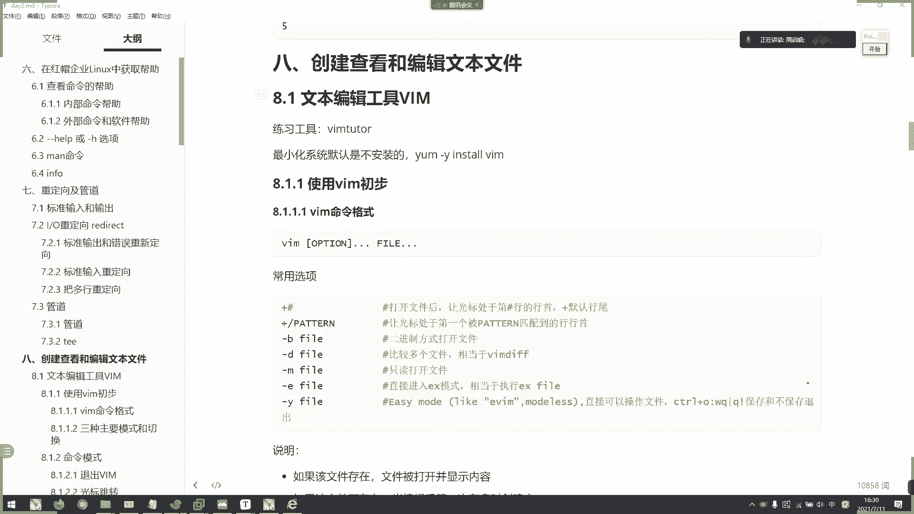

发了。啊。啊，不要种这个了VI。EDC下的怕死。啊，一下把说一样这样子。然后呢，我在VIMEDG下的他索。🎼在于它有颜色啊，叫做语法高亮啊，语法高亮。然后第二个。搜索。啊，搜索。来。比如说。

我要搜这个lobo底。要说这个lo卜点看见。搜索。你看它就跳到这里，光标跳动到我们第一个搜索到的。啊。是这样的啊，搜索搜索是从我们光标所在行往下搜索啊，光标所在往下搜索，然后搜索到第一个。

然后画面调换到第一个啊，看下他还有其他啊啊那个我们后面再讲，我们先要知道这个，他要跳到这里啊，这个光标做提示啊，然后我们看下不要用的。Wm it is password。자。呃， nobodybody。

Yeah。他能查出来，而且刚才显示啊，当当然我现在只有一个，我们现在找一下很多的啊。比如这种loging。low喽，你看所有都高亮啊，你看它是从光标所在处往下搜索啊，但是它会把所有的匹配项都列出来。嗯。

所以呢啊我建议大家使用的是啊VM啊。

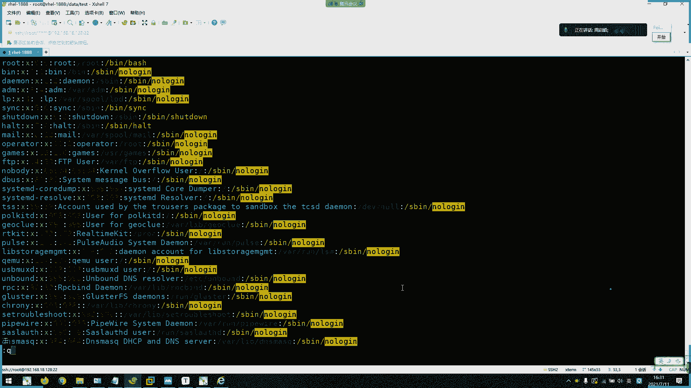

啊。好，然后呢我们了解一下VRM的一些。基本操作啊，V11提供了一个练习工具啊，叫做V1突槽啊。

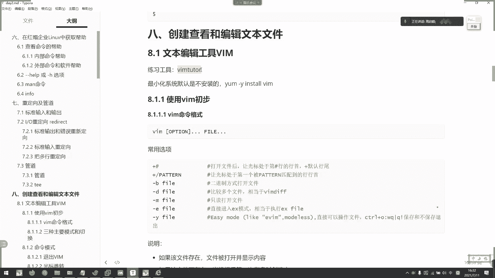

啊，我改错了没有，我忘了。😊，之前笔记上面不说啊，可以啊。你看这个文件啊。🎼它是不一样的帮助文档，并且它是一个练习环境啊，练习环境。你看它这里有说光标跳动啊，光标跳动啊H。一。😊，呃。

HKJL啊HKJHKLH是光标。向左跳动啊。L是上腰跳动，K是向上跳动，A是向下跳动啊。是这样子，我们他打横的我们很难习惯，是不是？🎼啊，打很多很大是吧，但然它支持方向键啊，我们直接用方向键去。

移动画面就可以了，就是发向键的。啊，所以这个了解一下就可以了。然后呢这里可以练习啊，我们。嗯，他这里也有讲解啊，什么退出啊，什么Q唱啊，就不保证退出啊，强制不把人退出啊啊，然后什么其他东西啊。

乱七八糟的。🎼啊，我们不看了啊，都没有我讲的详细，对不对啊？我们下周讲的详细一点。什么来着这是。嗯。你在弄什么东西啊？没看懂吗。怎么有第三个目录，什么d啊？我看一下。low en啊，你都没有仓库啊啊。

他说你没有仓库啊，在那三个目录里面。🎼所以我说你们新手学习一定要装图形画啊，新手学习一定要装图形画。有很多工具啊已经带有了。啊。🎼我又还没讲到一样我，怎么装啊，对不对，是不是？然后呢，这里可以练习啊。

比如我进入插作模式啊。怎么修改不了？我们进入全了50吧，你看。🎼可输的东西啊也可以删除。然后呢，他怎么做都可以啊，保持不了的，就过来啊，你看。🎼我刚刚保存了，但是它不会保存，然后进入还是这样子啊。

你可以在这里随一晚啊，随一网啊什么。🎼第一大G啊什吧，你看没有啊，后面什么东西有。啊，然后反9。啊，没事啊，又没事了，又又又回来了啊。ok这是我们的ta。因为我说了官方听下啊。

vivo的官官方音下是没有。

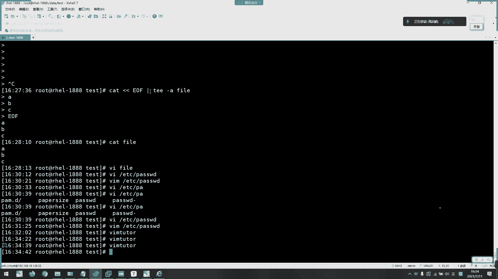

没有做本地仓库的，要我们自己手动写的。好。然后呢，我们。了解文本之前呢，我们先来了解一下这个工具啊啊。它的一个工具使用VIM加选项加文件啊加文件。嗯。就是还有选项啊。调整下啊，一个是加。就说。啊。

🎼几号这个不是注释的意思啊，加几号他们结合起来是我要跳动到第几行。就是说比如说我现在是打开ETC passwordword。

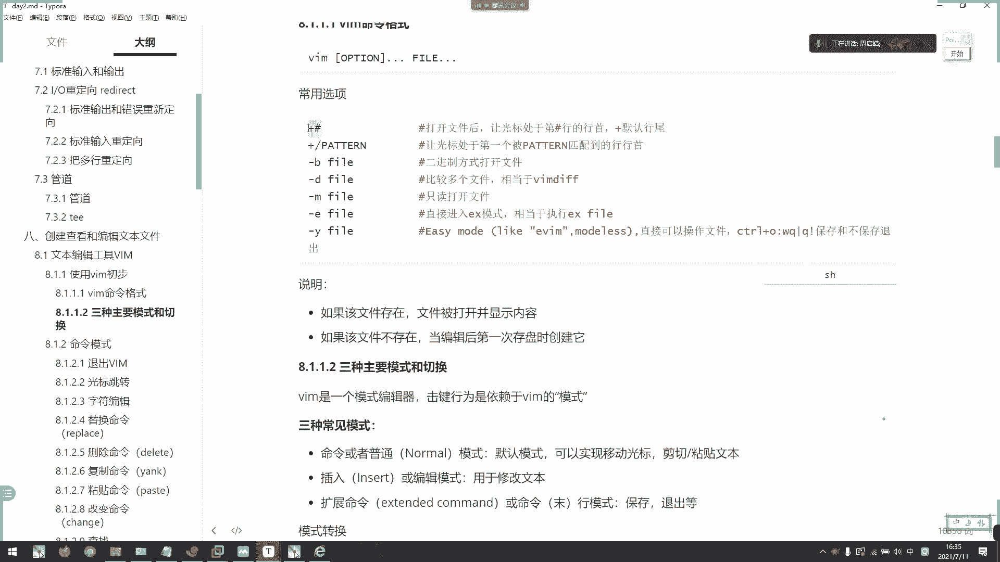

会。打开的时候跳动到我上一次退出光标所在哈。我先把它回到函数你回到函数。那么。我这里弄一个加3。Yeah。进以后呢，他下在就打开光标所在行，就是我指定的地下。啊，昨天是一样。

不指定默认是莫寒啊不指定默认是莫罕，你看。啊。

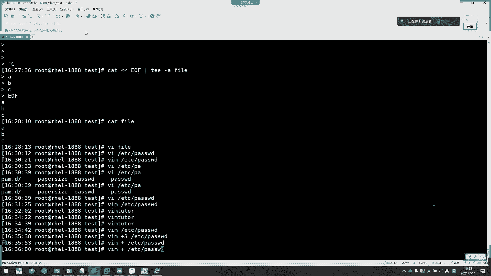

一分。你看回到地下啊，这是加地下。然后呢是加，然后再加一个模式啊，不是啊，一般来说是正在表达时啊，我没学到啊。

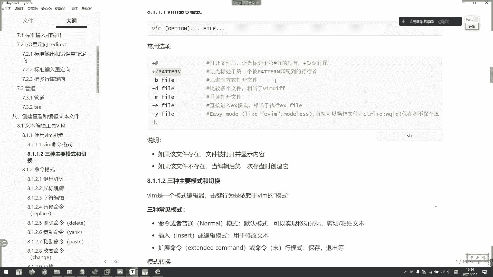

啊，比如说我这里加。Ro， yeah。啊，还搜索出来了啊，对不对？然后是加落地。嗯，好到没？

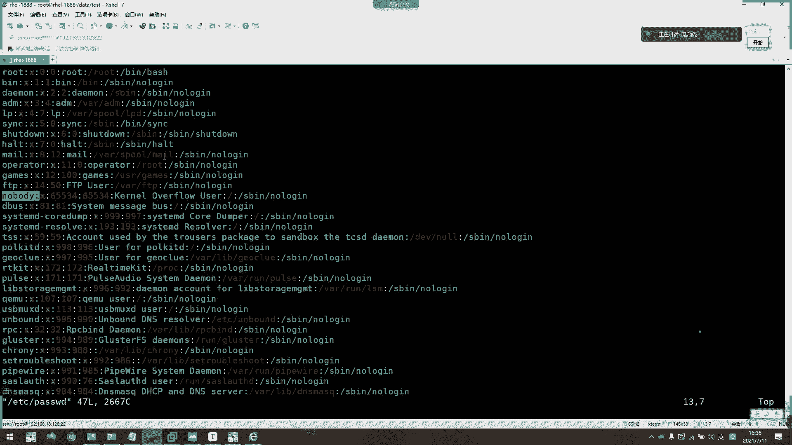

啊，这是加啊然是刚闭啊，以个验证方式哪个文家？

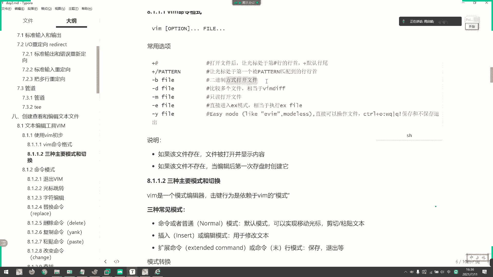

啊，其实这个没什么用啊。我们也看不懂。我也看不懂，对不对？🎼是呢如果是二进制文件啊，比如我们。关。优er。变。下的L。啊。什么都看不到啊，但是呢如果加1个B啊，可能就会好一点点啊。🎼没呀。

就看到他的二进车了。啊，虽然还是很多and and and add，但是啊你看这些数字啊，这些字符已经不一样了。虽然你也看不懂，虽然也看不懂，不一样啊不一样。

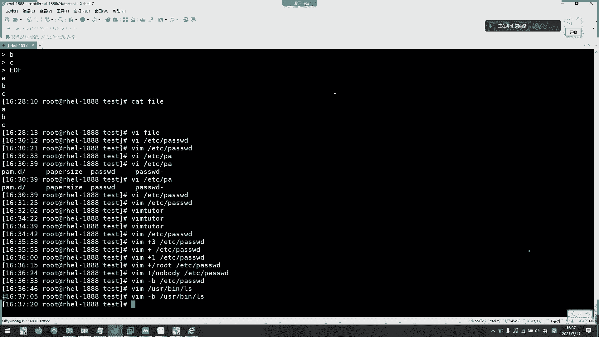

哎呀。少了很多and的已少了很多and的了。所以不用管它，其实二进制我们也不会看啊。

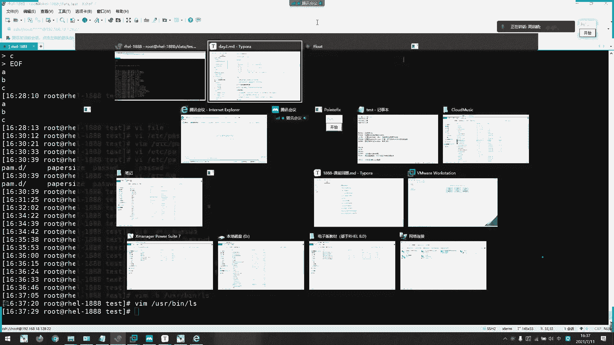

🎼啊，要看地啊，比较多个文件啊，这个怎么用呢？啊，比如说我现在考一份冰虾的pass。哦，哎。🎼吸到 data。啊，8元杠RF。啊，copyED下的password。嗯。嗯。哎，那真的一定要加一个点才行。

啊，然后。相当于是pass，他做了个备份啊，然后我删一下这个东西。编辑一下这个东西啊，比如说我现在就留到这里啊。啊，上诉。啊，然后呢通过表人。掂。啊，pasword。啊 e啲 c。🎼他死。嗯。哎。

地F错了啊，杠D啊啊杠D。不是VI地方。

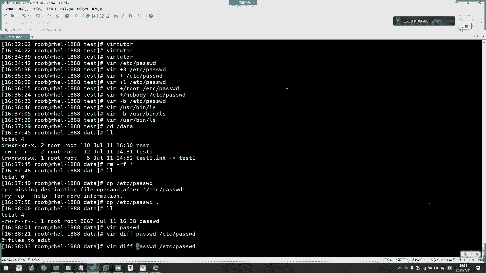

看到没有？你。🎼啊，没有颜色的部分啊，没有他们是一样的啊，相同的部分红色跟蓝色部分啊。是字。啊。🎼我们不一样的地方啊不一样的地方。还没有？🎼啊，不一样的地方这样子做对比啊做对比。文件对比。啊，接起来啊。

然后是刚才以直读方式打开啊。

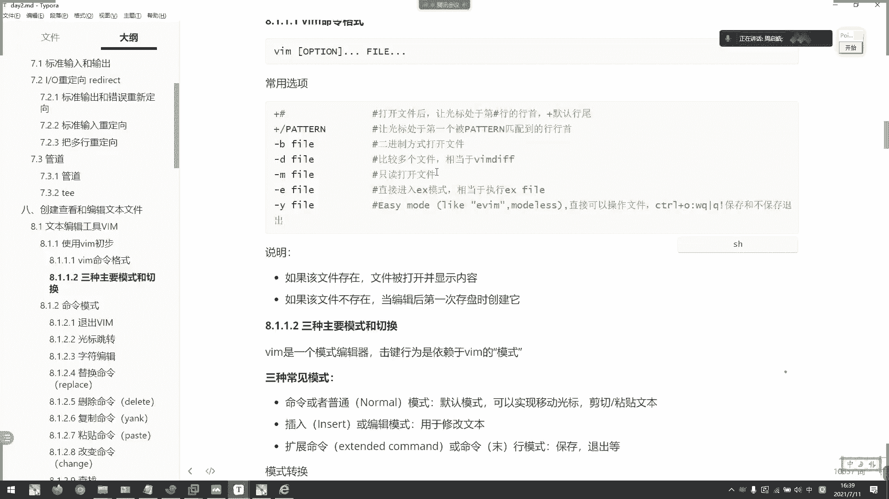

啊。那就做不了修改啊。对不对？那报出了啊，大家制度。

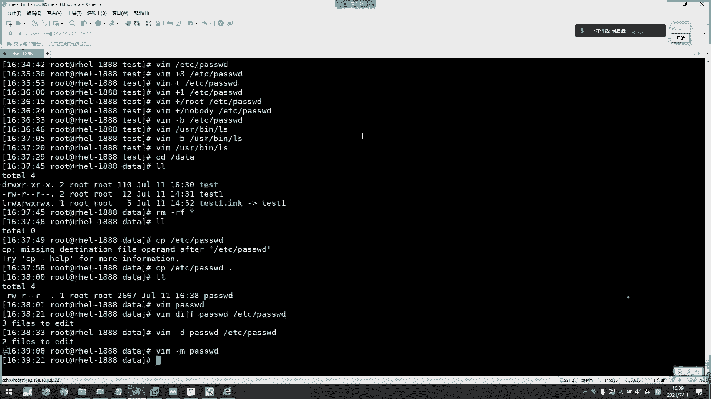

好，而是按一呃，这个不想讲这个警讲出错的哦。

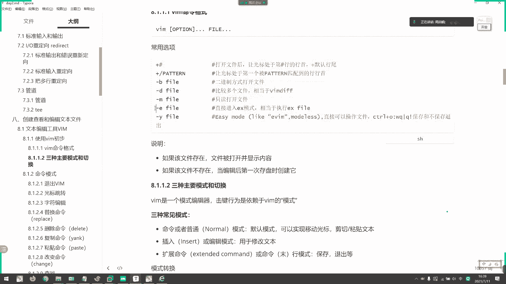

DN模式啊，这个直接修改模式啊。😊，Yeah。呵呵。😊，木夯模式啊，他意思是打开进直接进入木夯模式啊。比如说呃。八、烫。That was。对吧。啊，14WQ。那我现在开这个东西啊。Yeah。嗯。

你看是不是多了一个东西啊嗯。我刚刚出现的命是Lda啊。然后他把它的输出保存到这里来。

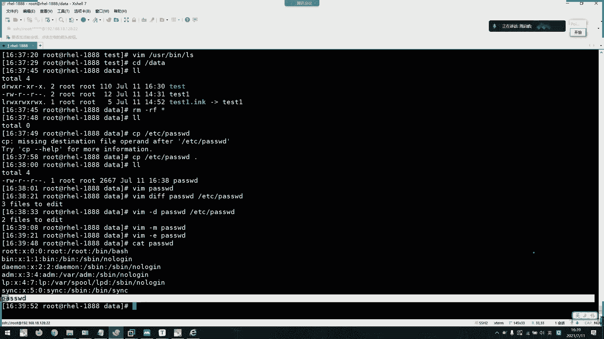

走直接进入默幻模式啊，直接进入默幻模式。好，各位。呃，这个更更加少用啊。

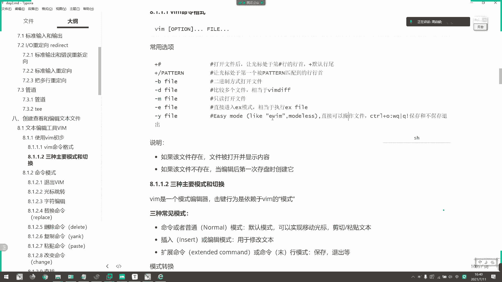

进去以后呢，直接。作文档啊。🎼啊，你看直接隐射模式啊，隐射模式，但是呢它推不回我们的命令航模式了。啊，如果要保存呢，首先要肯头加我啊啊，刚才一测的我是要不啊，这样就才能对啊。

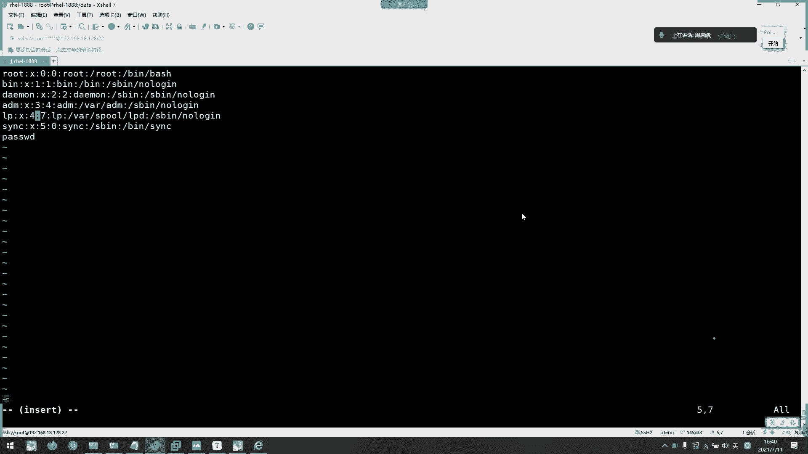

呵呵。😊，这些不参与啊不参与。啊。然啊然后VRN的一个的确我也少用的。😊，我也很少用啊，除了def啊，除了def啊啊除了def，这个常用啊，这个很常用啊。啊这采油。真的说说到我心坎里去了。😊。

一点用过没有是吧？😊，好。

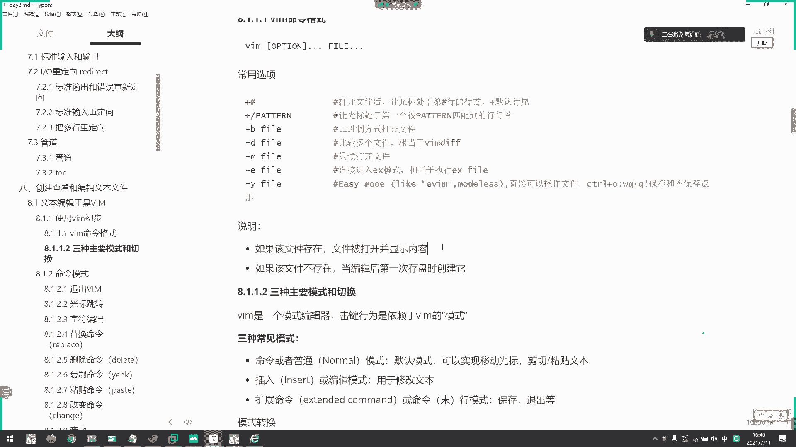

然后啊。呃，鸳鸯的一个特性啊。就说。嗯，好。但是他刚才做了个备份哎啊，我和莫涵模式，他做了个备份哎。

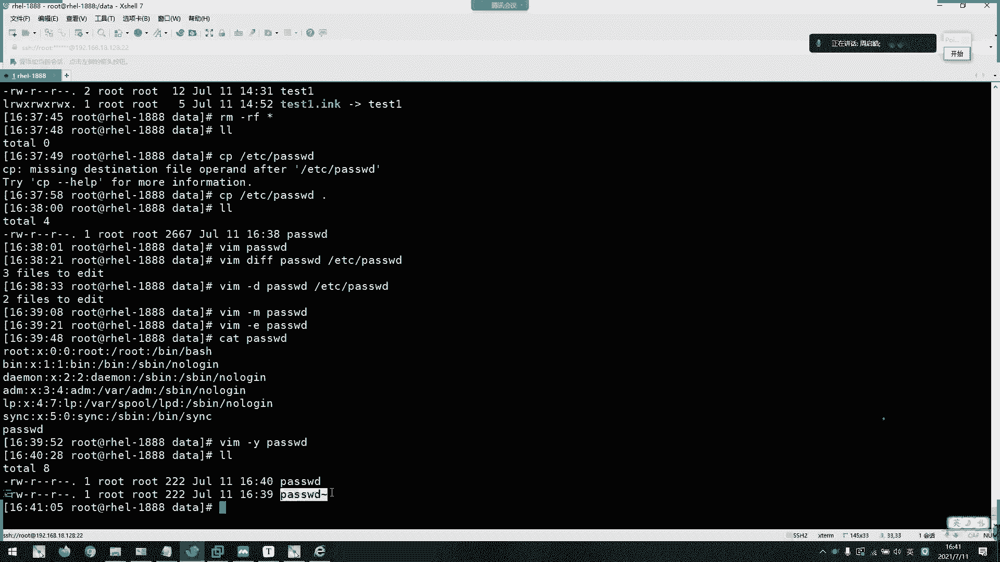

挺好的啊。

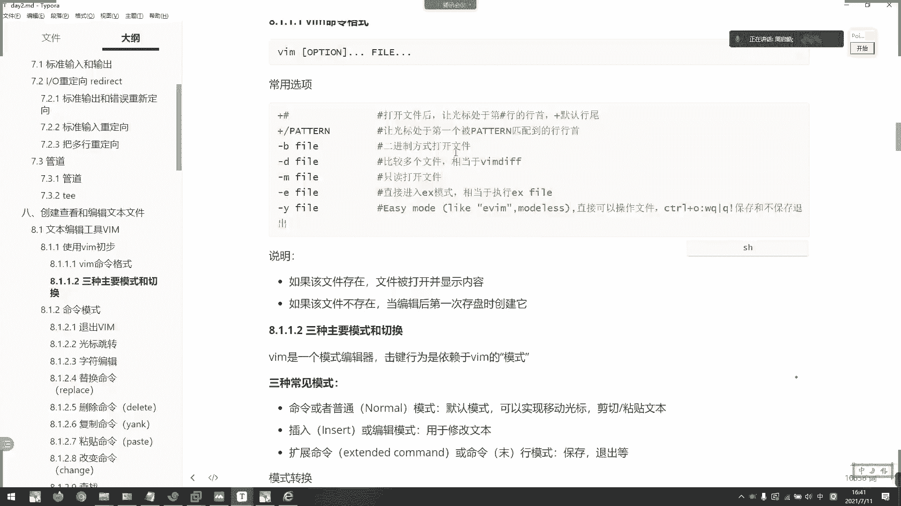

好，那个不重要啊这个不重要，重要的是我们。VM如果他在当前目录下。存在这个文件呢就打开这该文档。如果不存在呢，会新建文档啊，然后等待输入打了退出啊，你看是不是多了KBC不存在了就会新建文档了。啊。

比如说我现在再新建1个BVB。对呀，他写的。new friend啊，然后前面是他的文件名，然后我现在保证特殊啊。啊，然后再保证特说你看。就一个。空文件了啊空文间。如果不能在，只要我把人退出。

它就会新建文件啊，直接退出就不会保啊，不会保留吧。比如说我现在先写1个CCP啊，我现在直接退出。

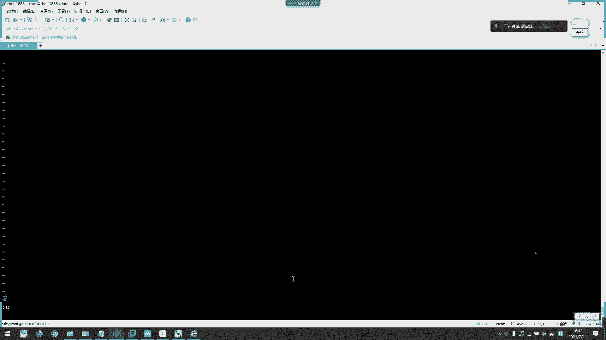

いや没有学习这个问题。啊。好，就往下啊。😊。

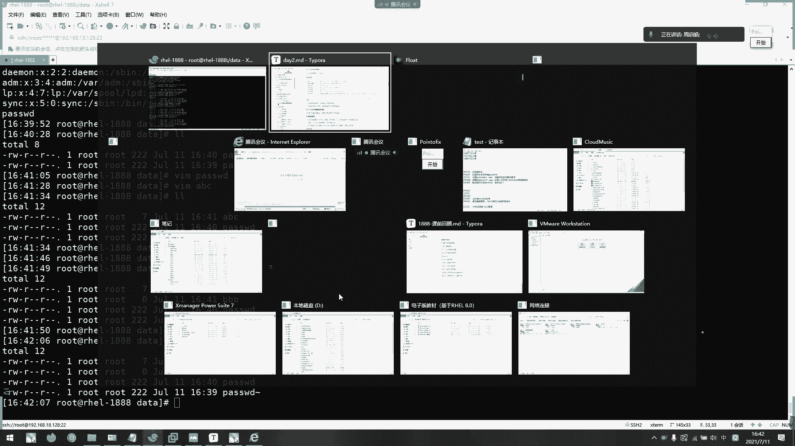

然后我们呃剩下的时间。先简单的介绍一下我们的三种模式啊，我们VIM有三种模式啊。一开始用VN打开文件，它就进入我们的一个默认模式，做命令或者普通模式啊，命令或者普通模式。我一般就说他教教他做命令模式啊。

我一边一般就到明天还公司。然后呢，它可以实现移动狂标剪贴，还有粘贴文本啊，剪贴，还有粘贴文本。

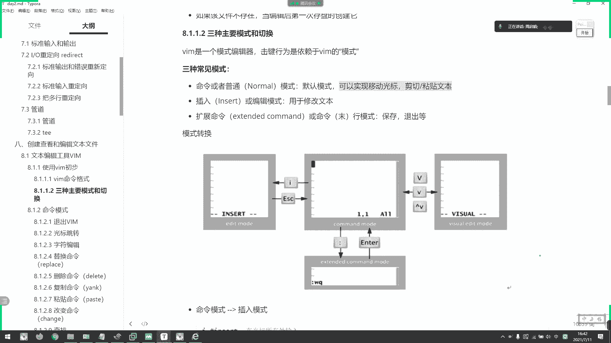

对看。🎼呃，剪切跟粘贴我自己先不讲啊，但是我打开，我可以做一些简单移动光标。他这个还有其他东西可以做的话，我等一下再讲啊，明天呃下周再讲，我们每一个模式它都有一个很强大的功能。

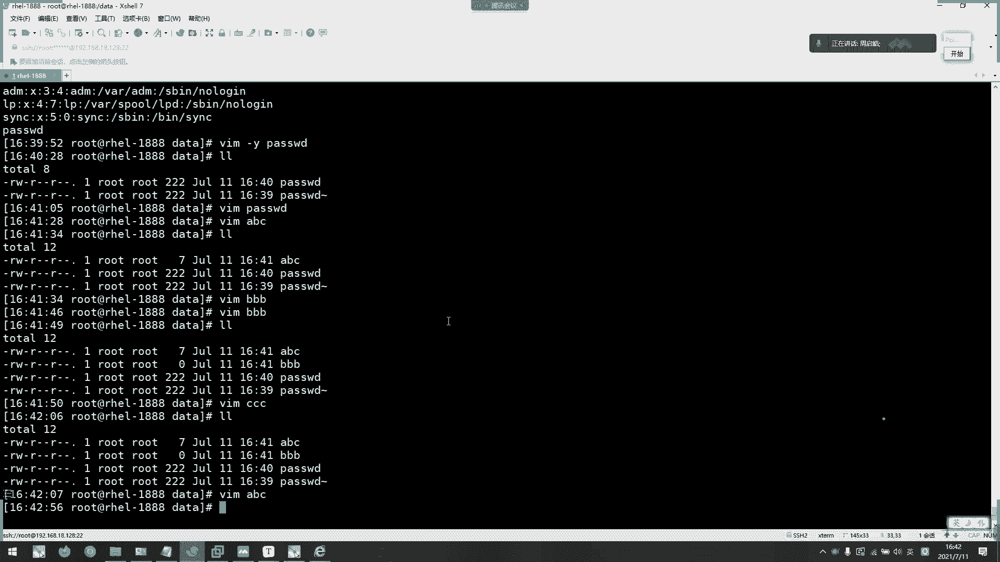

再下周再讲。啊，我们先讲一个系统模式的替换。好，这个插用模式啊，插入银色的。呃，我喜欢叫常用模式啊，你可以叫做编辑模式啊，用于修改文本，你看。

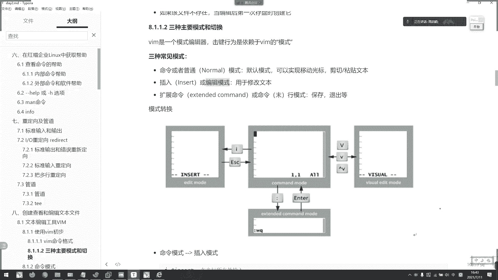

什么进了？🎼ABC。啊，我们挂标锁在什。注E光票所组按杠呃按I。就按光标所在处插入啊，123看到没有？在光标所插入啊，退出啊，就按ESC键就可以了啊啊，杠I可以采用模式啊。

然后ESC可以回到我们的普通模式啊，默认模式，然后。呃。杠A啊，这意啊，不是不是杠A啊，小A啊小A注意画标啊，A看到没有？光标所在处。后一个字母啊，后后一个字符插入。画面跳动了一下，对不对啊。

你看啊唉画面跳动一下。啊，这是A，所以不调应。我都是采用I的啊，I跟O。😊，好，然后。😊，第三种啊。大A有没有啊，我忘记了。大A。啊，还有吧。首接在光标所在行的末末尾啊光标所在行的末尾插入。啊，然后。

大写癌。框标所在行的函所插入。啊，然后是桥。光标所在行下啊光标所在行下新建一行啊，兵在该行。插入啊，然后大姐。多少。关标所在行三阳。秋。啊，并编辑。O。这就是我们经入插入模式。

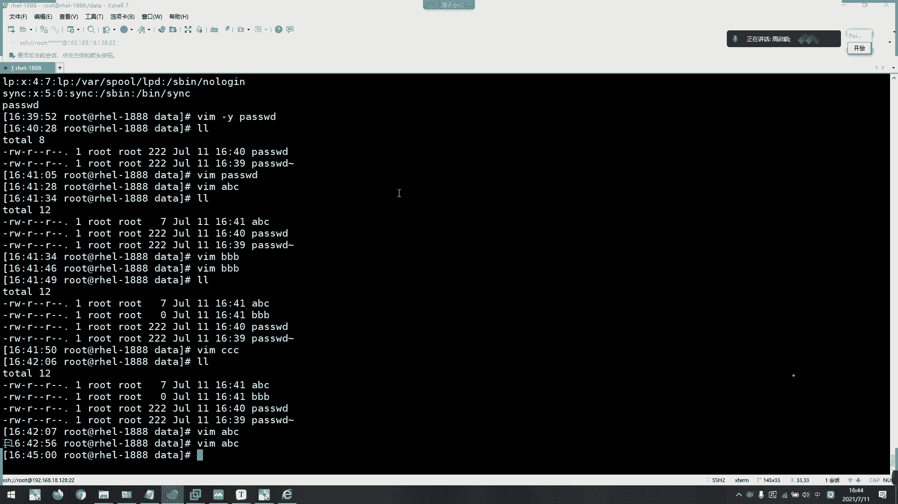

经入常油模式的6种方式嗯，在哪里？不用谁的啊啊，这里啊。有个。大家可以回去试一下。是当目前的话，我用IO比较多啊，IO比较多，我还懒得去宽大写。啊，我用IO比较多啊。然后我在想啊，A也很少用啊哦。

我我直接挑调动到我想要的位置就好了。为什么还要往后挑一个呢，对不对？好，这就是我们。呃，普通模式到插油模式，然后从插油模式返回呃我们的普通模式的一个操作啊。刚刚的啊从普通模式进入到超油模式啊，有IAA。

系。O o啊腰紧啊腰紧。然后呢，返回只需要1个ESC件。啊。啊，对，夜S期间。而且偶尔有时候也要用啊。た是オ我也すよ来。两种模式已经讲，还有第三种叫扩展。命令行模式啊，我一般叫做莫寒模式啊。

这模幻模式啊，它一些操作啊，基本操作是保存任多，但是它有更加强大的功能啊，我们下周再讲。我们先了解一下这个基本的打开VIM要会保存退出，对不对？打开VM要懂得怎么保存得住。

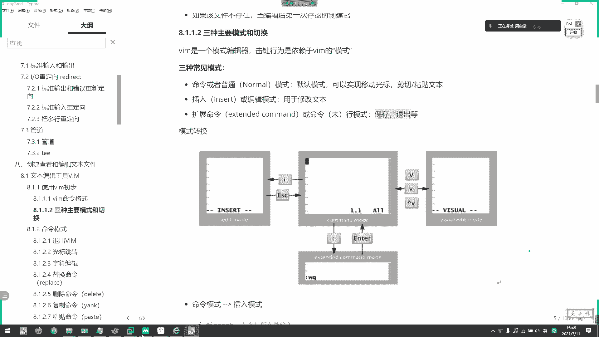

啊，打开。🎼编辑完以后啊，或者是我想不编辑直接退出。我们要禁用默航模式怎么做啊？直接输入一个冒号啊，注意左下角。这里是变成一个问号啊，没看清楚，再来一次。行，我们每打开一个文件，只要我不做其他操作啊。

不进用其他模式，它这里会显示我的一个文件的信息啊，文件的信息有32个字符啊，什么有三行啊之类的啊。行，然后这里是坐标啊啊，什么第二行第三列。这样子。然后。如果我想退出了啊，虽然我在当前模式都能退出。

但是习惯用了习惯用了模仿模式来，注意左下角啊，我不再重复了，注意左下角，我现在按一个冒号出来了。然后我们就可以在这里输东西了，玩木模式。是啊，其实把它给删了也可以按椰子之间也可以啊回过去啊。

也可以回过去。然后呢保存。W。保存。啊，然后退出Q退出。啊，推殊啊QIT的意思啊QIT的意思。按Q。然后呢，如果我做了修改，但是我不想保存按Q。拒绝。啊，他说。嗯。呃，这个更呃没有保存。啊。

这个话什么意思啊？就是我最后一次更改以后没有保存。然后他说啊加一个叹号呢，可以强制退出啊。啊。那么我们强对出所以就加一个叹号强对出。啊，这叫不保存退出啊，然后保存退出，有时候他不让你退。

也可以直接强制保存退出。🎼啊，这些我保持的动作啊，就这么多。然后刚刚说他返回。🎼呃，默认模式啊可以通过把冒号三的或者是ES期件返馈我们的啊默号模式。你看黄标我又用工资的，然后。

我们进入插入模式能进入到我们的墨模式吗？啊，同学们。进入插作模式后，我们能进入到模好模式吗？啊，不用mo啊，就是不能啊，因为我要输入的是一个冒号，我在插作模式，我输入冒号就改它的内容嘛，对不对？

所以我们可以这样想。

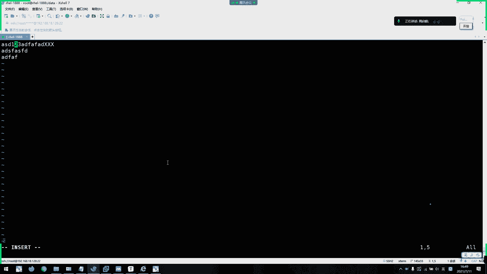

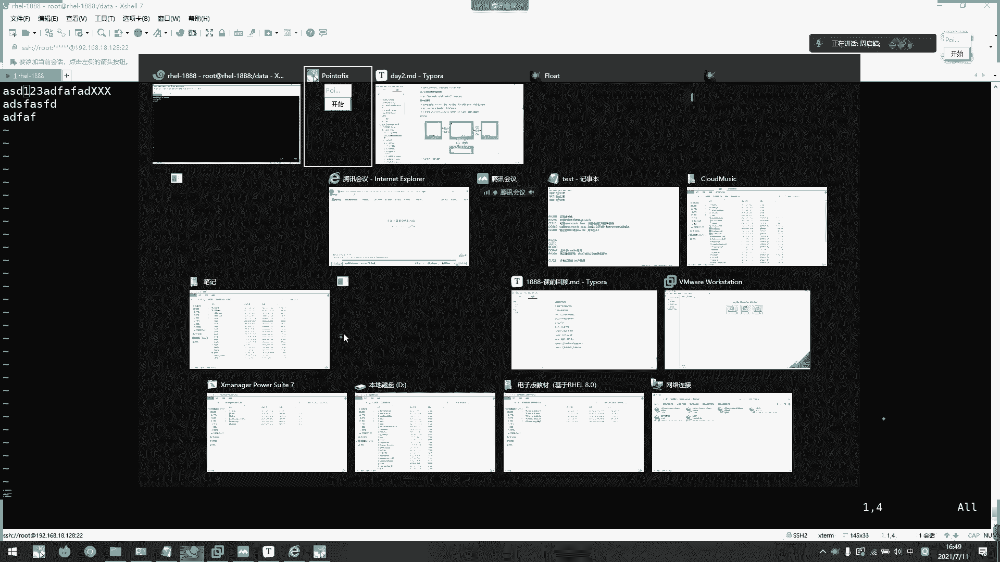

普通模式是一个桥。是个桥。啊，左边可以通银射的。插入模式右边可以进入墨罕模式。它是一个桥。是我不能在桥底下游泳过去。对不对？所以呢我们插入模式跟木尔模式要互相切换，必须要过这条桥。

我要先恢复成命令行模式。啊，恢复到命令模式。好，就是我们三种。常呃常用的。模式。啊，然后快vers啊这个visosvis这个要做最后再讲，这是一个特殊的模式啊，不是常用的模式。啊。这个就先不讲。

所以我们今天。的任务先到这里。然后下下一周。我们每一个模式每一个模式详细讲啊，还有模式其实讲完了，假如我们是没有什么东西讲其其实都讲完了，其实讲完。然后这这周我们内容就是。莫涵模式普通模式，还有啊。

visr模式啊。进行详细的讲解啊详细讲解。嗱主一。

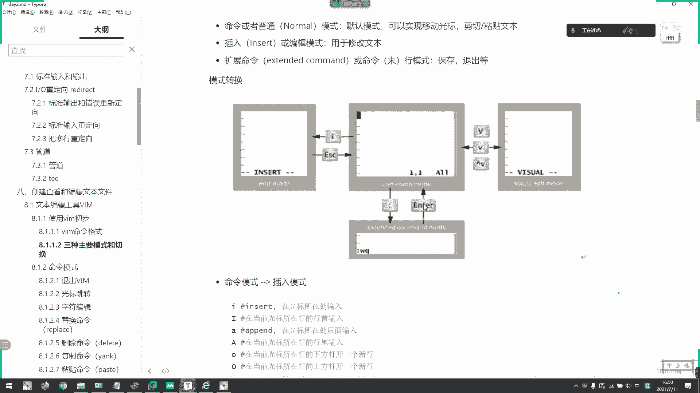

不讲了。