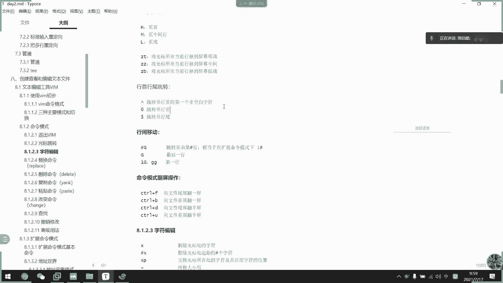
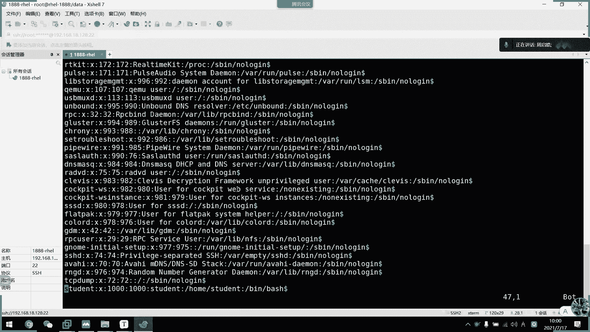
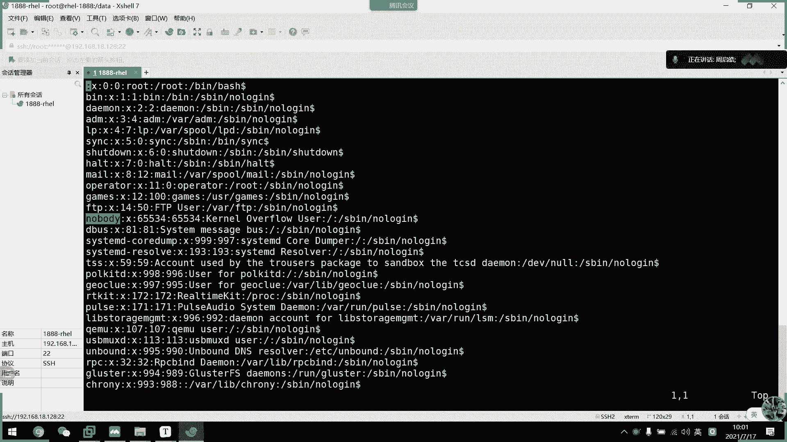
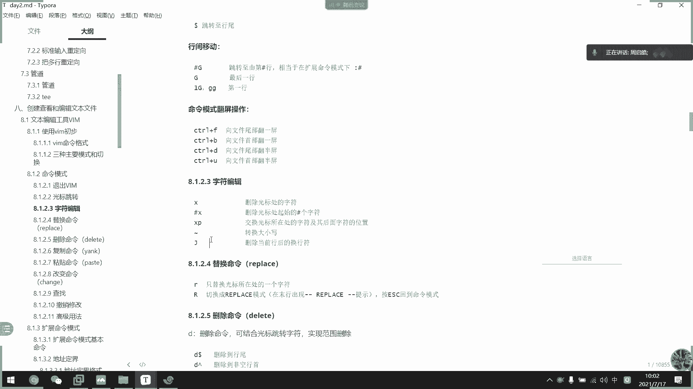
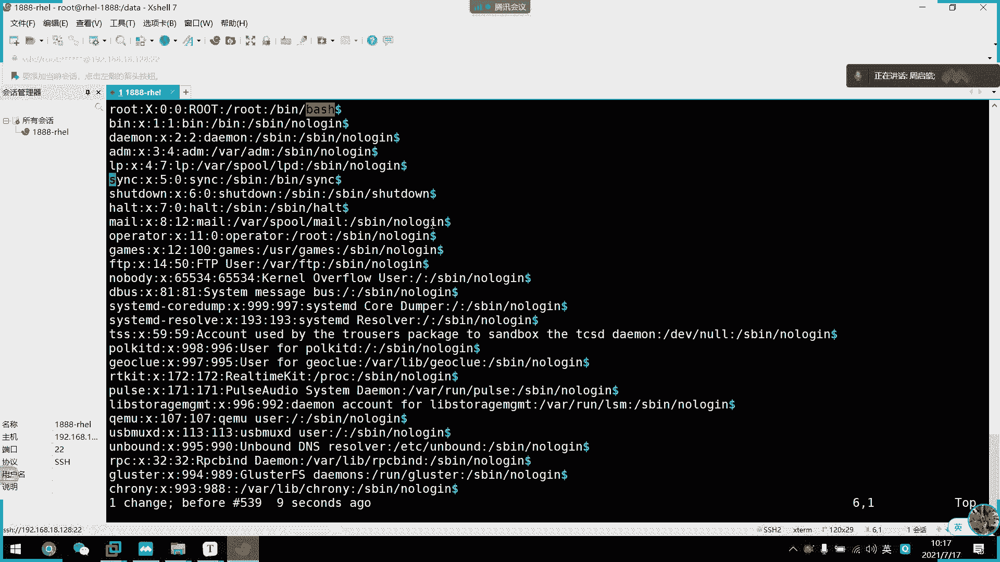
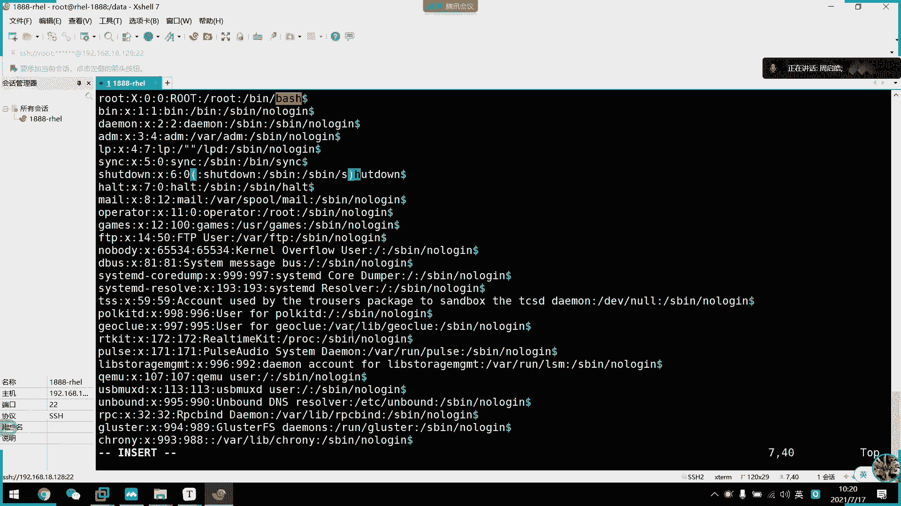
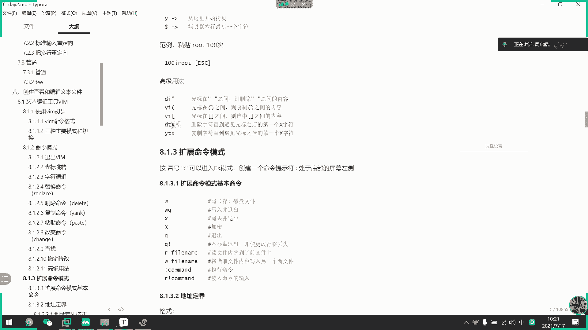

# 2021年7月新版-----RHCE8.2 RH124 RH134 RH294 认证课程 - P9：day3-1 vim命令行模式 - bili_15701050454 - BV1Gy4y1T7ug

好。好，调一下这个。看到显示在这里。嗯。怎么调？晕死不会用了。下一个。诶。没看到录屏那个啊，这是。好。😊，我去回以播一下下周六啊。调到下午。好，下下午来。嗯。我们主要。先讲述了一下。关于啊Ilo。

的信息啊。首先啊。Ilo的。这个值了。啊，是我们。分区。位一啊分区为一。啊。主要用于文件搜索啊，这个我们后面讲到f的时候会讲。啊，然后还有就是。加速。文件访问的过程。这个了解一下就可以了啊。好，第二个。

🤧就是通过了，我们知道了那个。呃，爱load表就load表的这个概念以后呢啊我们学习了。链接。链接。啊，有我们的一个入网链接。和我们的一个硬链接啊。有链接更新链接。啊，首先。我们来看一下。

先先看硬链接吧啊，硬链接。啊，命令函模式。锁门啊LOM。Source。然后是link file。🤧啊，直接LN就可以了。啊，他是什么呢？啊，音链接。啊，等于。一个人。有两个名字。啊，他们。都是。

一个data。在。系统中。记录啊。🤧嗯。所以呢啊。他们的啊i load值。相等。啊，第二个。打开以后。数据相同。啊，并且。修改。任一。连接。阔。原文件。写这个吧。后啊。访问的数据啊一并修改。啊。

第3个啊，由于Ilo的值。向总。所以啊。因链接不支持。划分区。也不是说这个L值相同啊，而且。指向。的 datata。是。一致的。啊，不支持划分区。春建。好，这就是我们音链接啊，所以啊是音链接。无视。

违份啊。然后是我们的一个软链接啊，软链接。明量格式啊LM。有逼了。大S。You also sauce fire。呃 link。F。啊，它的难点在于哪里呢？啊。难点在于。创建。有链接。最好使用。相对路径。

大。我链接。创建。相对。路径等。参照。Wu。喂。链接都是啊。啊，这是它的难点啊。然后。他有什么特性呢？啊，一。有网链接。本身。就是一个文件的。他的data。Wei。原文件。mate塔地塔。打L2有链接。

相当于。Windows。快捷方式。3。软链接。啊，是一个新的文件。所以。支持跨分区。这是我们网链接啊。好。然后啊是。获取帮助啊。啊，会把助三种方式啊，一个是命令行。对。Hep。一个是我们的M帮助。

就是一 four啊。密兰号呢也分两种啊两种，一种是内部命令。对。Help。啊，然后是一种是外部命令。啊，内部命令也有啊，以及内部命令。总。hellp选项。比如是。嗯。Free。Got help。

刚刚还吧。但是另那个风格。或者是我想想啊。有什么可以干个曲先身。

我看一下。

可以吗？不行。呃。没o Zhuang。嗯。

，这个可以啊。都能啊。把，内目 mini啊，直接比如是hel。依据。05年。然后顺便帮助啊。面慢住。主要是我们的一个man。keyword。好。呃。没有呢。是。你有3。比较。全都搬主啊。安全的满足。好。

里面啊有。内部命令。的帮助。啊，也有。外部命令的帮助。啊，所以很多第三方。应用。都。适用于。慢帮助啊。呃。然后面了啊一共有9个章夹。好。常用啊。15782。第一张。啊，一般是我们的命令。使用帮助啊。

第五章。

不许我要开一下。😊，咩打。系啊。No。关于命令和帮助啊，然后第五章。

文件帮助啊。也不是说配置文件，它这个不属于配置文件。命令相关。文件。文件格式吧。第七章。

一人是什么来着？大家。

呃。

啲七。这个也是。

配置相关的。啊，第八章。管理员。管理。管理员管理。系统。相瓜的啊。所以我们主要还是这几家啊。好。聊了。每个章节。嗯，都有。不同的。异议。不要这样说吧啊，每个战舰都有。

那个叫什么来着？

呃，自动划分吧。比如。零啊。分开来吧。嗯，我可选择。Example。啊，bug等等。好，尹凤啊，这个比较少，用我就。不多介绍啊。嗯。跟M类似啊。风格。风格为。网恋风格。呃，可以。通过。里面的连接。跳转。

就这样吧。好。啊，其他帮助。谢谢关注啊。一些。第三方应用。蕲春。安装包集成。啊。比如是。呃，里面的一个vi。没什没有啊。点心之类的。好，然后是。官方文档。嗯。再后是啊说说已及呢。够到。问他。好。

这就是我们的一些。获取帮助信息。然后啊最后呢吴羊洋。文本编辑。气啊。呃，其实这里主要知道一些。嗯。它的一个三种。模式的切换啊。所先。不要洋。加发了。命量模式啊命量格式。算了，写在上面吧。如果文件。

存在着。编辑。文件不存在。保存。10。新结过。啊，主要是啊它的一个上种模式切换啊。啊，通过命密啊。打开文件以后。默认进入。命令航模式。所以可以称为啊。默认模式。从从命令模式。切换到。插入模式。

也可以叫做。编辑模式。怎么做了？有我们的I。但系。A大AO大啊。啊，他们之间区别啊，自己回去看一下啊。这里不细说啊。好。然后。从编辑。模式。插入模式。轨道。你行。模式啊。嗯。ES。然后命令行。

模式切换到。莫涵模式。也叫做。扩展。啊，或者叫做扩展。你你好。我是他。啊。🤧咳。输。英文。5号。忙好啊。冇。这里我框起来。蛮好。🤧嗯。好。从。扩展模式。切换到。命密盒模式。也是ESC啊。插入模式。跟。

莫航。模式啊不能。直接切换啊。啊，一定要先切换到。你你还模是。啊。OK啊，我们上周一些主要内容啊，就这些啊。那么我们啊现在开始一些新的内容啊。嗯。好。那么上周我们介绍了。嗯，关于三种模式的一个切换。

也知道了我们主要的三种模式有哪三种。那么我们。今天上午。先看一下。啊，每种模式。诶。这个图哎呀，我重做了。啊。呃，每种模式他们之间有什么。这就就是说也不是说直接没有模式。

他们啊在该模式下那能做什么东西啊啊，它有什么功能啊啊，首先我们的一个命量模式啊。密R模式呢啊也算作为我们的一个普通模式啊，就是我们的一个默认模式。只是此模式输入的那个指令呢，并在我们的一个屏幕上显示。

需要记忆大量的快捷键才能更好的使用啊。啊，上次我们提到了一些。啊，保存。

保存退出的一些操作啊啊，比如说我现在打开一个。文档啊随意打开一个文档，这样。啊，我输入以后呢啊想要保存，是不是按一个冒号WQ啊。啊，虽然说了这个是保存并退出嘛啊，但是它这种是模含模式。那么。

比如说呃我打开了一个文件。啊，但是我也不需要进入其他风格啊，虽然也可以进入它的一个墨罕模式把它退出掉。那么如果我在这里。啊，面瘫模式我看完以后呢，选择退出怎么办呢？啊，直接大写的一些Q啊。

大写的一些Q啊。如果编辑过了。别辑过了。啊，想保存又不WQ9么8呢啊，两个大写的一塞啊。对呀，那就保留退出了。大写的啊。注意哪些。好，然后呢光标。跳动。嗯，其实上周已经说过了啊。啊。

用我们的方向键下下左右可以移动我们的光标啊，当前绿色在跳动的啊这个东西。就是我们的光标啊。这就是我的光标。啊，扣有大跳动。然后我们就可以选中啊哪一个字符了啊。

啊，大家也可以。啊，有我们的一个。啊，HLJK来控制啊，但是这个一点都不好用啊，所以建议大家还是用方向向，再没有方向键的。啊，等那个情况下才再用这个啊。就是说比如你不能发现件快了啊，就用这个吧。

然后呢它支持啊我们的一个。

し。指定字符数跳动啊，比如说我现在在root这里，对不对？然后呢，我需要往右跳动5个字符，那么我就按五，然后是按方射键。有吧。你看这样调整如何支付，对不对？啊。下也是一样的啊，往下调动，然方向这下。

然后。往左跳到4个字符。啊，往上挑了三个字符。啊，这个要记住啊，因为。

这个除了跳动以外呢啊，我们学了钉界仪，还有剪，还还有还有剪切复制啊，这个就很有用了啊。

看个人习惯吧，行要。说是有用啊。他个习惯，那在快捷键的操作。他。

那么我现在继续回到课件好。这个。关别跳动。然后呢。还支持单词间的一个跳转，对好，W是下一个单词的词手啊，比如说玩W看到没有？W。

啊，他把那个符号啊，冒号当做一个单词啊。啊，这才是厕所。Yeah。你看好。比如他他们三个啊之间没有分个服，那么他们是不是一个字符串？有了。可以把它们看成四三个单词，然后我现在按W跳动啊。

它又跳动下一个单词的词数啊，下一个单词的次数对不对？啊，这是W啊，然后是一啊一。挑到词尾啊调词尾。

挑自己思位啊，并且是下一个单词的思位。

还有B啊回到上一个啊上一个单词的词首。B看到没有？BA就插模式了。哔哔哔哔逼。

我设置一下。

可以。

这是我们大球间跳动啊，然后是呃页面跳动。

说了我现在不敢那个。我把这个文件拷过来啊。好。

啊，然后是翻页啊，就翻页，我觉得了解一下就行了啊，了解一下就行。耶。

方业我们一般不用这个了解一下就可以了。首先是H回到叶总。

大写的回到夜索。啊L是M啊，调到中间。

然后中间1L啊是月底。

是该页的液点啊，不是整个文件，它你看它这个范围只指到这里啊。

所以它这个不太好用啊不太好用。啊，这个啊以屏幕为啊以屏幕为。

那个。

啊，为界定啊，以屏幕为界定啊啊，然后是以身T啊。

跳转啊，这个也不好用啊，说实话这个也不好用。了解一下就可以了。

啊，我们常用的是这下面的啊这下面的含接天呃。这个。含泪跳动啊，还有系一个寒见天筒啊。

什么叫行列跳动啊啊，就是说它这一行有没有跳动啊，整一行。比如说。呃，我这里。啊，我们含手跳动啊。苏志林。啊，苏志林。看见啊。然后还有个脱字符。两个有什么区别啊？大家有看到吗？有什么区别啊？啊。同学们。

啊，都是投资符啊，这是投资符，这是零。啊，同学们这有什么区别吗？发现吗？知道怎么讲吗？这个区别。各思考啊，跟上周一样，各有思考啊。没关系啊。那么你们不说，我就说了哇。啊，0。啊。跟拖字符啊都叫跳到函数。

一个区别是什么呢？如果我有空格，如果我有空格，就函数有空格，那么我们拖支符是跳到叫做飞空函数啊，非空函数。那么零的话呢是跳到行数啊，真正的行数。啊，比如说我这里加一个记号啊，那么我现在。按透制符。

你看它就可以跳跳回他索了，只要它哈索飞空就可以了。就是说如果这里是空的，那么我按零它跳动啊，就会跳动到该行的最后函手，看到没有？啊。然后。啊，最后一个是我们的dora啊，美金dora啊，是以跳到韩墨啊。

这是糖不。脱字符。还有dora啊，这个要记住啊，拖字符跟多ra这个要记住啊，到时候用这个表达式啊，这个很重要的啊很重要的啊。反正一行来说啊，我们的托支服为行手，多伦为航末啊。记住啊。为什么多老师还问？

呵呵。😊，因为多的是我们的一个跨幅啊跨幅。

看这里有血。啊，非非控函所啊非控函所。好，然后是这个比较重要啊，叫做行间移动啊，行间移动。

分别是大G，还有两个小G啊。第一行啊，可以。

用两个小区来调动啊，比如说我现在在某一行，然后我要想回到第一行，那么我就敲两个小区就可以跳回来了啊。

啊，然后他挑的也是我们那个飞控滑锁啊。

也是最后函数。然后呢，最后一行啊就是大G啊，大狙就是最后一行啊。啊，这个很有用的啊，记住啊。就很有用了。

啊，然后跳到第几行就就数字加大G啊，它就跳就下来了啊。

但是采用的还是两个小G，还有一个大G啊，这两个是最常用的啊。好，这个翻页的话就没什么意义啊。了解一下就可以了。好，然后是我们的一个文呃字符编辑啊，字符编辑。

啊，首先。

其实如果我们要删字符啊，不需要进入到插入模式啊，我们按一下X就可以了。X。啊，相当于是我们的一个。啊。

我们的一个迪ele或者是我们的best飞剑啊。删它就可以了。然后呢啊要删多少个啊，就数字加X啊。

啊，比如说我把word删了，就直接试叉搞虑。对不对？好，4X4X。

好，然后呢。呃，交换光标所在位置。

就叉P啊windows XP啊。你看他一直往后走来呢。啊，其实这个原理啊。我们等一下学到粘贴的时候就知道了。你要学到粘贴的时候就知道了。可以。

展它原理。好，然后是波浪号，可以直接切换大消写啊。

直接切啊。毫不留行的啊把小写都变成大写。对不对？波浪幅啊波浪服。就是我们啊数字一隔壁啊，但是要用shiftft啊去把它给切掉，切换啊。啊如果他大写的，我按还要变成小写的，对不对？

好。啊，然后是J啊，所这个是删除跨F符啊。

大姐。对啊。是不是把快弧转换为我们的一个空格了啊？画幅短控一个空格。是的。是不是？这是我不了。嗯。😊，就转不了。

好。好，然后替换命令啊。这个怎么说呢？

啊，耶。挺方便的啊，但是我一般用于改一一两个字符啊，比如说呃我配置写错了啊，或者是。这里啊。不应该是142的话呢啊，如果我进入插入模式，然后删掉。再写一个二是不是很麻烦啊啊，是不是很麻烦？

那么我们从命令行模式呢。啊，如果要改了一个字符，我们之间。比如这里啊二要改回一，我们按一下。小写的L楼啊小写的L楼。然后改到我们要改的字符就可以了啊，你你看。阿龙2。二51。Hello you。是不是。

就不用进入拆53。如果要替换很多的话呢，我们就大家进入那个repress模式啊。

啊。啊，这样子随意改就可以了。一。嗯。把符号都改掉了。一。They have。嗯。啊，这是我们的replace模式啊。这就是。

O。好。然后呢啊刚刚说到了。一些操作啊，为什么说很重要？上面呢都是我们的一些地址钉件。啊，或者是指定目标。那么下面的一些操作啊。就是配合他们的一个快捷方式啊。所以呢啊我们来了解一下D啊D这个按钮。

它相当于是删除，其实是剪切啊，其实是剪切。

啊，有这么多，但是我给你们说一下要常用的啊，常用的。一个是。啊，Ddo啊低 dollar啊，比如说我从这里开始，后面的都不想要了，直接D。多了。所以刚刚跟你们说的一个位置定界很重要啊，位置定界。😀呵呵。

😊，好。然后比如说我要往下删除几行，那么我们就。

啊，B5。往下看到没有？有看到操作吗？

啊。大家啊。

第一。Wu。Xiaia。

看到没有？啊，第五项。就是说我。可了几事出。IA不。Sa哎 you。🎼好，给你们看一下啊，函啊，然后呢我现在要删除呃删除。这几行。那么我就D5。

然后往下删除啊，按下。是不是3十六还了。

我我从第一行开始，然后往下删除五行，是不是一共三六行？

我回头一下，是不是？

刚好杀了六行，对不对？对不对？告诉就好。

好。啊，然后其实他就配合我们的一个跳动啊，等一下会讲啊等一下会讲。

那么我们零跟拖支符啊，不用说就是三到函数，对不对啊，三到函数。

啥的还走。啊，然后这些这几个是单词啦，不用说了，是不是？好。然后是呃滴滴啊，其实就删除整行了，删除整行。

下周准。

呃。倒选D。

这个。就从当当前况标啊删到最后还。我喜欢用D多我喜欢用D多。好。🎼然后啊比如说我现在是在22行，我要把它。到行首的都删除掉啊，怎么做啊？啊，不把把它到第一行。都上手料怎么做？同学们。查一下。思考一下。

Haha。😊，这周你们不积极哦，上周都很积极回答问题的哦。嗯。下周还是比较积极回答问题的。

然后我们要三道寒手呃，第一。然后敲两个小局啊。

看到没有？嗯。啊，注意啊，从QEM入啊，下下是QEM入啊D两个小度，对不对？

那不就删到这里了吗？好。那删到最后一下了。回答一下啊。所以呢跟着走会比好啊，第一大句啊，很好啊。第大句。没错啊。第25项。呃。第25下的话，那是你看到行有多少行才能这样回答，对不对？

那么我现在不看不看那你知道第几行吗？啊还要数吗？这个。啊。我给了行，你看你才知道是25啊，对不对啊，虽然你这样说也没有错啊，我不知道他有多少行，我直接低100。诶，怎么？这样子。啊我觉得第一版。行不行？

呵。😊，啊，你这样说也没有错啊。😊，啊，到时候一定要。

符合啊。万一他不止一0百行呢，对不对？

好，O。😊，这就是我的一个删除啊删除。刷住等于剪切啊，刷住等于剪切啊，这个要记得。好要是复复制啊，复制跟剪切是一样的，我就不多讲了啊，一模一样的啊一模一样，只是把D改成Y而已啊。

🎼啊，大家要注意一下啊，比如说我现在是啊只负制这一行，我们就敲YY啊，敲YY。你看是不是负责。啊，比如说我要复制4啊，4YY。

到最后。粘贴出来是不是是行啊是不是行4YY啊。🎼呃，比如是现在Y大G啊，我就从该行开始一直复制到墨行啊，然后打印出来。

站得出来，对不对？

啊，这是复制一模一样的啊一模一样的。那么。这个就不重要了，重要的是哦我的一个涨贴命令啊，涨贴命令啊是小P跟大P啊，小B大B大B啊小B跟大P啊，他们两个之间的区别就是一个在下，一个在上而以啊，一个在下。

一个在上啊，但是要注意一点是什么呢？

啊。我们整行复制它粘贴。才会在下一行粘贴或者是上一行粘贴。啊，或者是三亚这里。能看出效果啊，我在冰那里从这里啊。下下去倒写P啊，就在上面嘛，对吧？能看出区别嘛，对不对？🎼但会但是如果我是复制5个字符了。

W。🎼那么他这里粘贴，你看它是在盖行粘贴的啊。即街系真天。啊，看这操作啊是Y5，然后方向键右啊，我就复制了5个字符，然后我。你看。🎼它就只只在该行粘贴啊。如果我们不是整行复制的话呢。

它是在该行去粘贴在光标所在处。往下粘贴多少个字符对。

整开的话呢啊，它就在下一行上一行啊这样子。O这就是张贴啊。啊，然后是我们的一个券阻模式啊。就是删除后就会啊换成我们的一个采用模式。

啊这个其实也不常用啊。比如是说呃我从这里开始啊，C多了啊，然后就直接给以编辑了，看到没有？啊，就这样啊就这样。C多少个？啊，然后其他位置定界是一样的，位置定界是一样。

所以呢。我们要学快捷键之前的啊，一定要学会我们的一个啊光标跳转啊，光标跳转。所以我刚才一直在强调哪些是常用的啊，哪些是不常用的。啊，这很重要啊啊是。虽然。

你不记也没问题啊，但是这是加快你工作效率的一些啊快捷方式啊。常用的啊，建议你们都是记住它的。玩错了。啊错了按错了错了。也是。啊 c。

破得号啊port的号你看也是也是一样的啊。啊，这改配置就会很快啊。

好。然后往下啊就是查找了啊查找。呃，查找其实。常用的就一个啊用用我们的一个。这叫什么来着？斜斜斜杠啊，斜杠它就是啊在光光标所在处啊，光标所在处往下寻找啊，比如说我现在是搜loing。

我们刚刚刚刚关标所在处置在d姆这里，对不对啊，d伍这里，所以呢它会跳动到我们搜索中的第一个。

相匹配的字符啊，所以是从光标所在处向下搜索。

所以它可以把关所有关联的都会高电显示出来啊，高电显示出来。啊，但是它会跳动到第一个啊往上搜索跳动啊。跳动到我们往下搜索，搜索出来的第一个。关键词啊，然后跳动怎么跳呢啊，我们按字母。M啊W的M啊W的M。

小A往下跳动啊小A往下跳动，大A往上跳动啊。

太往上掉动。看吧。

那么。嗯。先把它关掉。嗯，比如我们在这里啊，不行啊，也可以也可以也可以在这里啊就在这里吧啊，我们搜一下beash。所宝必。下面有没有往下走，有没有？应该有权对。好像还真的没有。

看一下有没有。好，相面最后一个有啊最后一个有。

啊，那就不管他。那么我们要上上搜索啊，那就用问号啊。你看它要跳动到啊，网上搜索跳动到第一个收到的字符。第一个说到是往上搜索问号问号。

那往下搜索也是一样的。不约到这里了，对不对？

直接搜索搜索。啊，然后刚刚问到的啊，撤销啊回退啊，撤销回退啊，就是U啊就是U小入。小优。啊，就相当于我们啊编辑那个word文档以后呢，按那个ctrl加接啊就会退。撤销啊。

然后呃进入是撤销多少次更改大陆的话呢是撤销该行。不更改。啊，点的话呢是重复前一个操作啊，重复前一个操作啊，比如说呃。

好还是复制了个啊这一行吧，说了那个P，然后呢我按点点点点点点点点点点点啊，是不是？

然后按一下U，然后点点哎，还是。撤销不算啊撤销不算。啊，那就。撤销啊按U，比如说我这在。撤销100次小路，那就。全测完了全测完了。啊，如果大撸啊，比如说我现在。改一下大小姐啊改一下大小姐。把这啲。嗯。

上上到前面，然后了。我现在是落在这一行，我按大写入啊，大写入。诶。我明明在上一行，为什么要跳下来呢？不管了，反正他撤就就撤了这样啊。他就测这一行的一个操作啊。都测不了最好，奇怪。第。我操跳舞为什么？嗯。

哦，他是临近最后修改那一行的啊。年天小白啦以后。🤧嗯。啊，然后是我们的一个高级用法啊高级用法啊，就是说啊我们的开始匹配的模式啊，然后加命令啊，然后再加我们的啊结束模式。啊，常见的命令呢是复制删除啊。

然后是变大小写啊，改变大小写啊，居大入变大写，居小又变小写。好。啊，但是其实这些不是很常用啊不是很常用。呃，但是我们这里也先看一下翻例吧。所以是零Y多了，它是什么意思了啊？是。先到行头啊，然后复制。

然后是复制到行尾。啊，所以这里。知道是什么意思吗？H。😊，啊，这是命令啊。这开始的指令结束指令。它不是粘贴100次嘛啊，所以输入100，然后呢，命令是插入插入什么呢？root然后结束。啊，是不是？

粘贴root100次啊，我看一下啊。

我不行，好吧。这是100，然后是插入WOTESC。

虽然我没有熟过，是不是真的有100颗啊？好。啊，这里有一些啊扩展的一些方例啊，有一些扩展的方例。

啊，比如说DI冒号。第一。啊，不行哦，这里没有看一下冒号行不行啊啊，DI。不行，第来。不许了。引号才可以有，我写一个引号出来。试一下这个行不行DI。不行啊。写个乙靠出来啊。DI抵号。

DI引号删除引号里面的内容啊，引靠这些内容啊，然后是DI括号啊，删除括号里面的内容啊。

啊，比如说我这里。录个括号出来。

DI括号呃，把括号里面的链路删除掉了啊。好。然后是选中里面内容啊，选中啊V这个东西啊，我们等一下会讲，现在可能还。

不了解什么叫V啊。呃，什么叫V。我了解一下就可以了。直先是。比如说是括号啊，其实是都是一样的，他们的一个定界，只是啊把他们八威的啊，把他们八威的那个选中就可以了。

啊，VI。VI。不好啊，你看选中里面的。手游里面的那个内容啊。

好，然后是呃YTX啊。

上字符主到遇见光标后的第一个字符啊。注意啊。我试一下啊。DY。DTXDTX。对。好，比如说我这里。DTIADDI不对。呃。弄什么好了？第一T大写题的不行。DT大谢题啊，可以啊，你看。🎼就T。

然后输一个字符，然后它呢会一直上除到遇到这个位置啊，钢法。

耳Y也是一样。所以我这个就。不过我咋说了。其实这这个几个也不是很常用的，也不是很常用。好。那我们先休息一下，就讲我们的墨汗模式啊，密号模式讲完了啊。

