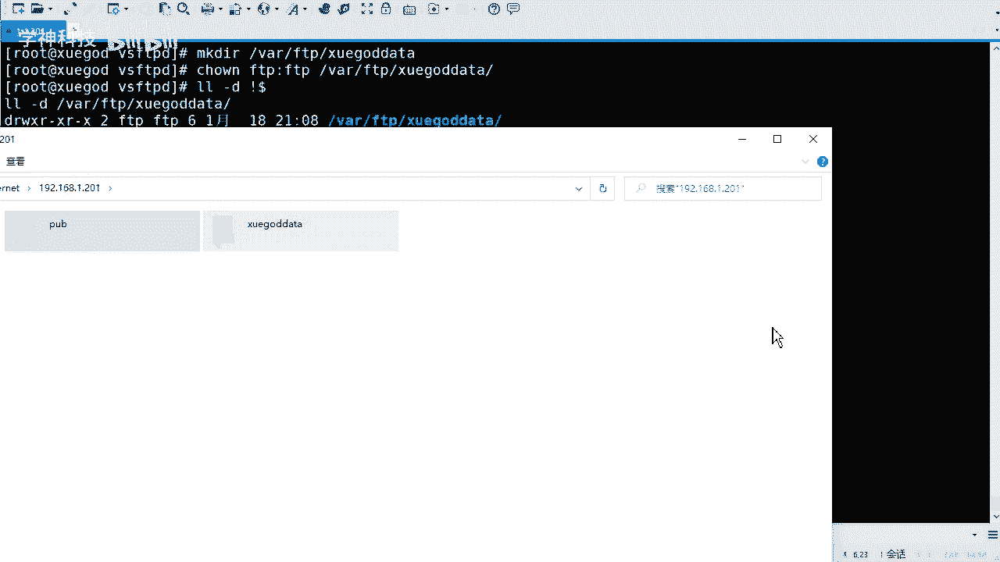
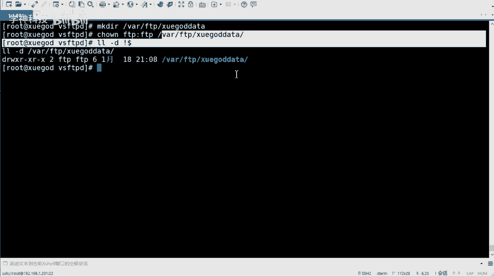
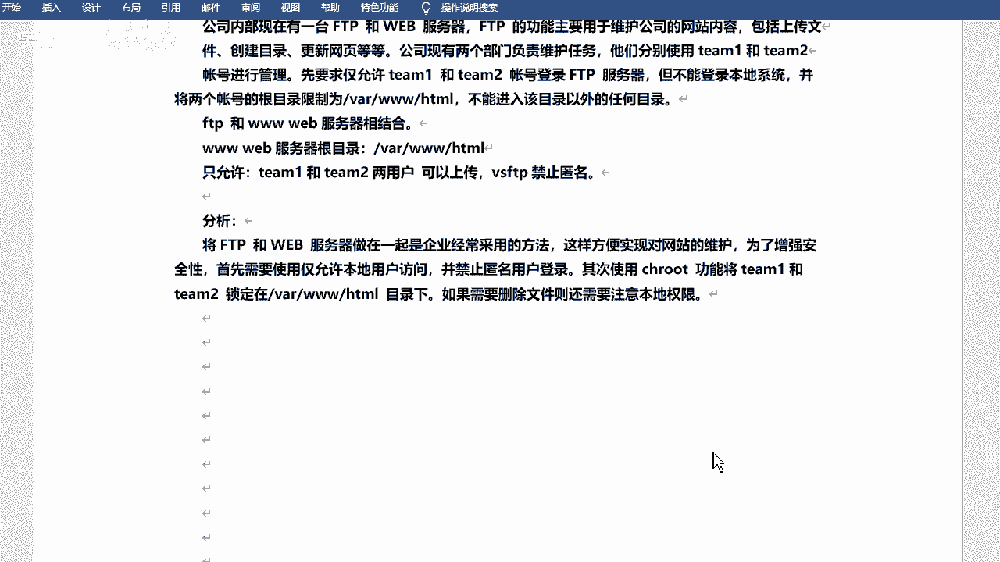
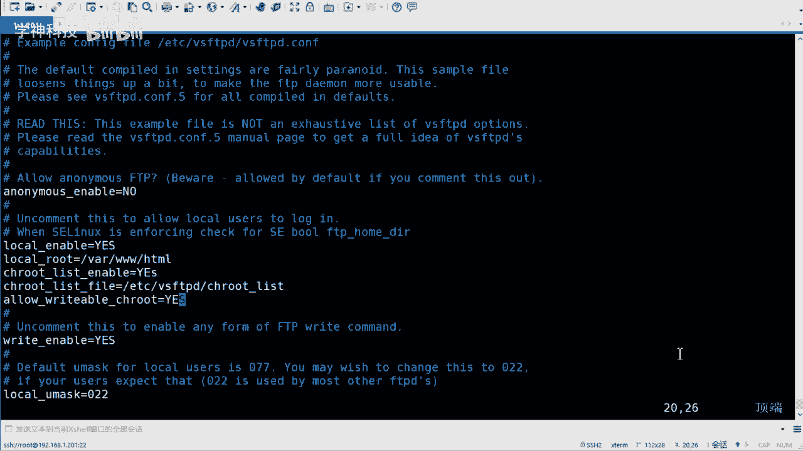
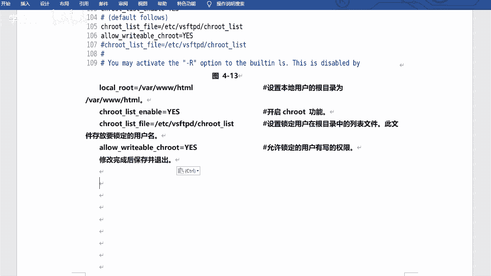
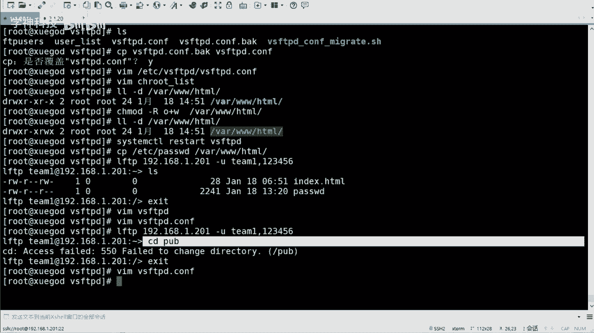

# FTP服务器配置教程：P10：指定用户对FTP有读写权限 🔧


在本节课中，我们将学习如何为特定用户配置FTP服务器的读写权限，并实现将用户活动范围限制在指定目录内（即“禁锢”用户）。我们将通过一个模拟公司内部需求的案例，详细讲解从创建用户、修改配置文件到最终测试的完整步骤。


---



## 概述 📋



默认的匿名FTP用户权限较大，存在安全风险。在实际生产环境中，更常见的需求是为特定的系统用户（如公司内部员工）配置FTP访问权限，同时严格限制他们的操作范围。本节教程将指导你完成以下任务：
1.  禁止匿名用户登录，提升安全性。
2.  创建专用的系统用户，并禁止其登录本地操作系统。
3.  配置FTP服务，将这些用户的根目录“禁锢”在Web服务器目录下。
4.  确保用户在该目录内拥有上传和创建文件的写权限。

---

## 配置详解与步骤 🛠️

上一节我们介绍了匿名用户的基本配置，本节中我们来看看如何为实名用户配置更精细的访问控制。

### 1. 创建系统用户并设置权限



首先，我们需要创建两个代表公司部门的系统用户（team1和team2）。这些用户需要能够登录FTP，但不能登录服务器的本地Shell，以增强系统安全。

以下是创建用户并设置其登录Shell为不可登录状态的命令：
```bash
useradd team1 -s /sbin/nologin
useradd team2 -s /sbin/nologin
```
接着，为这两个用户设置登录密码：
```bash
echo “123456” | passwd --stdin team1
echo “123456” | passwd --stdin team2
```
通过将用户的Shell设置为`/sbin/nologin`，我们实现了“允许FTP登录但禁止本地系统登录”的需求。


### 2. 修改FTP主配置文件

接下来，我们需要修改VSFTPD的主配置文件，以实现用户禁锢和权限控制。

核心的配置修改如下：
1.  禁止匿名用户登录：将 `anonymous_enable=YES` 改为 `anonymous_enable=NO`。
2.  启用本地用户登录：确保 `local_enable=YES`。
3.  添加以下关键配置行，通常可以放在文件末尾：

```bash
# 设置所有本地用户的FTP根目录为/var/www/html
local_root=/var/www/html
# 启用用户禁锢功能
chroot_local_user=YES
# 指定禁锢用户列表文件
chroot_list_file=/etc/vsftpd/chroot_list
# 允许被禁锢的用户拥有写权限
allow_writeable_chroot=YES
```
这些配置的含义是：
*   `local_root`：定义了本地用户登录FTP后的初始目录。
*   `chroot_local_user=YES` 与 `chroot_list_file` 结合：表示只有`chroot_list_file`文件中列出的用户会被禁锢在其`local_root`目录下。
*   `allow_writeable_chroot=YES`：这是一个重要参数，允许被禁锢的用户在根目录中进行写入操作，否则用户将无法上传或创建文件。

### 3. 创建用户禁锢列表文件

根据上一步的配置，我们需要创建`/etc/vsftpd/chroot_list`文件，并将需要被禁锢的用户名写入。



执行以下命令创建并编辑该文件：
```bash
echo “team1” > /etc/vsftpd/chroot_list
echo “team2” >> /etc/vsftpd/chroot_list
```
现在，`team1`和`team2`用户就被添加到了禁锢列表中。



### 4. 设置FTP根目录权限

我们的FTP根目录（也是Web目录）是`/var/www/html`。需要确保FTP用户在此目录下有写权限。

为`/var/www/html`目录添加其他人（other）的写权限：
```bash
chmod o+w /var/www/html
```
这条命令使得所有用户（包括FTP用户）都能在该目录下创建和修改文件。在实际环境中，你可能需要更精细的权限控制，例如通过设置目录所属组。


### 5. 重启FTP服务并测试

完成所有配置后，重启VSFTPD服务以使更改生效：
```bash
systemctl restart vsftpd
```
请务必检查服务重启过程是否有报错信息，这能帮助你快速定位配置文件的语法错误。

服务启动成功后，即可进行测试。你可以使用`lftp`命令行工具或FileZilla等图形化FTP客户端进行连接测试。
*   使用`lftp`测试连接和上传：
    ```bash
    lftp -u team1,123456 192.168.1.201
    ```
    登录后，尝试使用`ls`查看文件，使用`put`上传文件，并尝试使用`cd /`切换目录，验证禁锢是否生效（应无法切换到`/var/www/html`之外）。
*   使用FileZilla测试：新建站点，输入服务器IP、端口（21）、用户名（team1）和密码进行连接，尝试文件上传下载。



---

## 总结 📝

本节课中我们一起学习了如何为FTP服务器配置指定用户的读写权限。关键点在于：
1.  **安全性优先**：禁用匿名登录，使用实名系统用户，并禁止其本地Shell登录。
2.  **目录禁锢**：通过`chroot`相关配置，将用户的FTP活动范围严格限制在指定目录（如`/var/www/html`），防止其访问系统其他部分。
3.  **权限控制**：结合`allow_writeable_chroot=YES`参数和系统目录的写权限（`chmod o+w`），确保被禁锢的用户能在指定目录内正常进行文件上传和创建。
4.  **灵活配置**：通过`chroot_list_file`可以灵活指定哪些用户需要被禁锢，实现了配置的精细化管理。


这套配置方案非常适合需要将FTP与Web服务结合，供内部团队维护网站内容的场景，在提供便利的同时，也保障了服务器的基本安全。