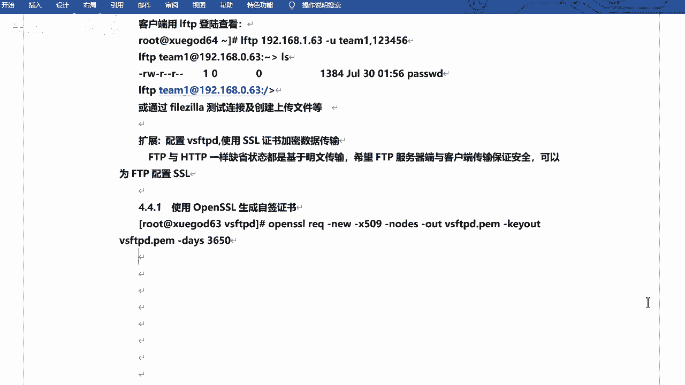
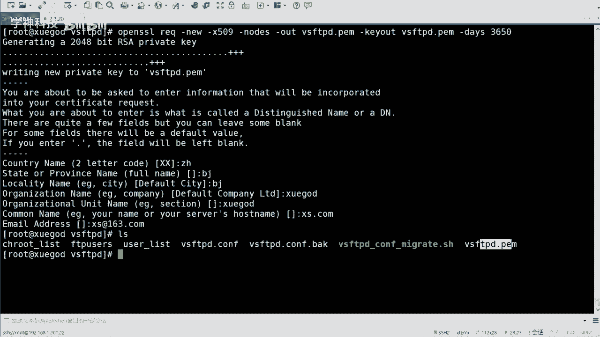
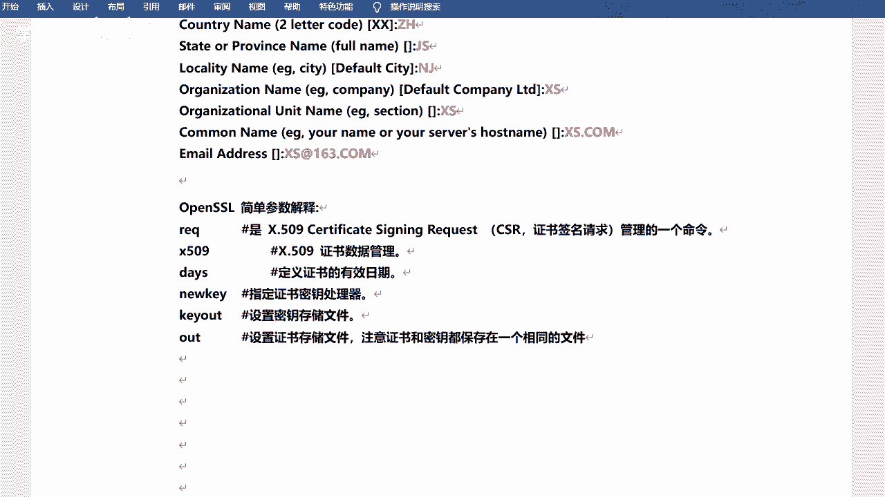
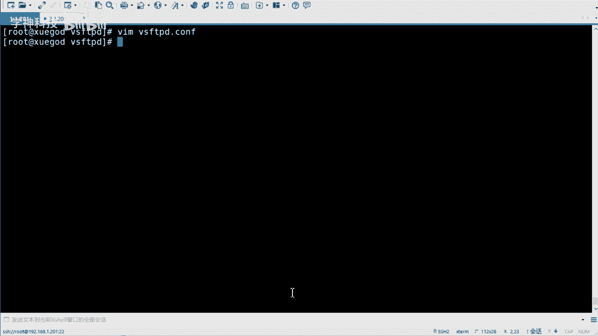
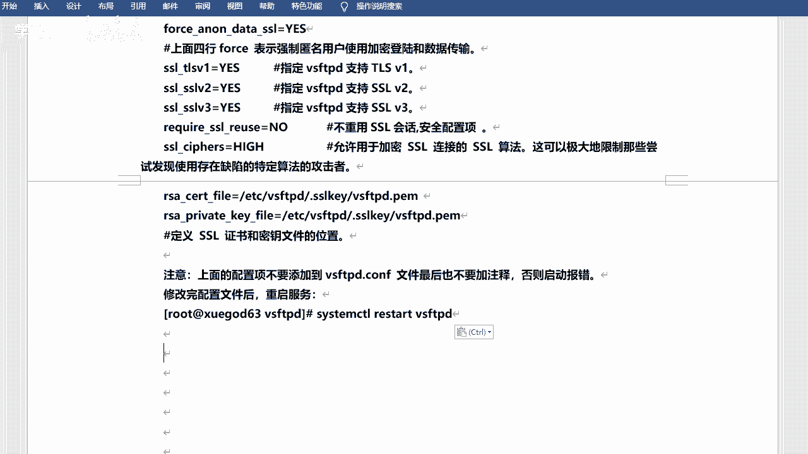
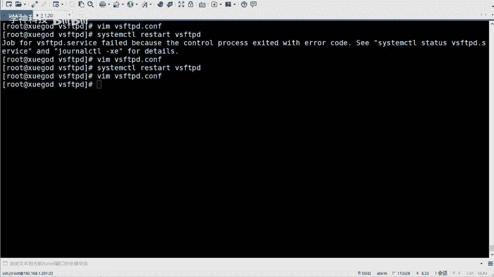
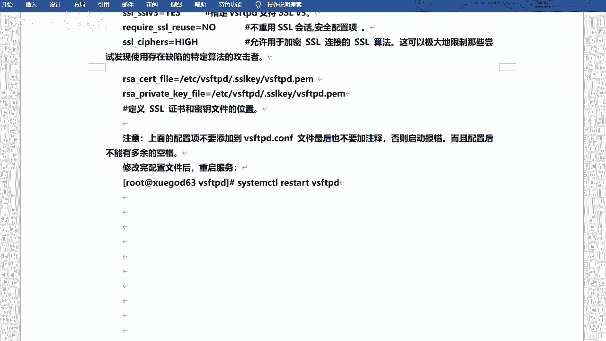
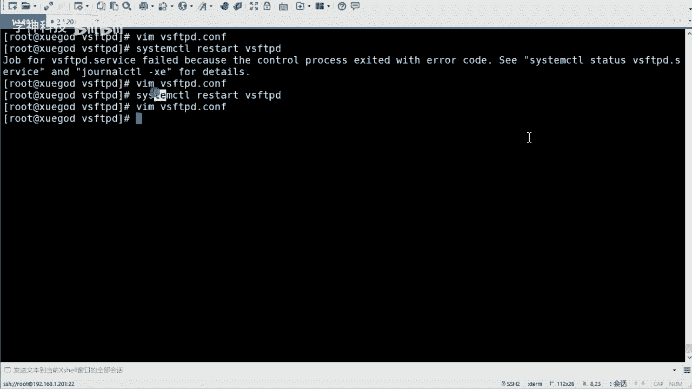
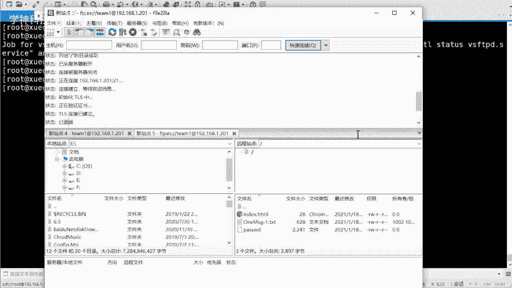
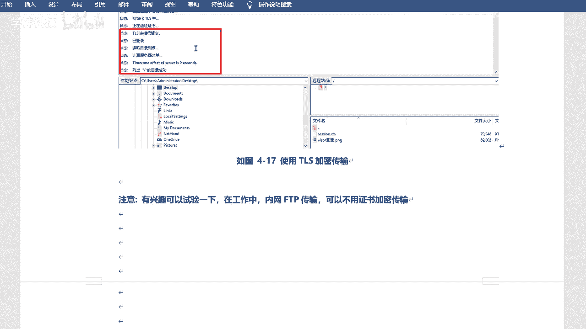

# 红帽认证教程：P11：使用SSL证书加密FTP数据传输 🔒

在本节课中，我们将学习如何为VSFTPD服务配置SSL/TLS证书，以实现FTP数据传输的加密，从而提升通信过程的安全性。



上一节我们介绍了FTP服务的基本配置，本节中我们来看看如何为其添加加密层。

## 生成自签名证书

首先，我们需要创建一个自签名SSL证书。这可以通过OpenSSL工具完成。

以下是生成证书的命令及其参数说明：



```bash
openssl req -x509 -nodes -days 365 -newkey rsa:2048 -keyout vsftpd.pem -out vsftpd.pem
```



*   **`req`**: 证书请求和管理命令。
*   **`-x509`**: 指定生成自签名证书。
*   **`-nodes`**: 生成的私钥不加密。
*   **`-days 365`**: 设置证书有效期为365天。
*   **`-newkey rsa:2048`**: 生成一个新的2048位RSA私钥。
*   **`-keyout`**: 指定私钥输出文件。
*   **`-out`**: 指定证书输出文件。

执行命令后，需要根据提示输入证书信息，例如国家、省份、组织名称和服务器域名等。

生成证书后，建议将其移动到专用目录并设置严格的权限：

```bash
mkdir -p /etc/vsftpd/.sslcert
mv vsftpd.pem /etc/vsftpd/.sslcert/
chmod 400 /etc/vsftpd/.sslcert/vsftpd.pem
```

## 配置VSFTPD使用SSL



证书准备就绪后，下一步是修改VSFTPD的配置文件以启用SSL加密。



以下是需要添加到 `/etc/vsftpd/vsftpd.conf` 配置文件中的关键参数：

```bash
# 启用SSL
ssl_enable=YES
# 允许匿名用户使用SSL
allow_anon_ssl=NO
# 强制本地用户登录和数据传输使用SSL
force_local_data_ssl=YES
force_local_logins_ssl=YES
# 指定SSL/TLS协议版本
ssl_tlsv1=YES
ssl_sslv2=NO
ssl_sslv3=NO
# 不重用SSL会话
require_ssl_reuse=NO
# 设置高强度加密算法
ssl_ciphers=HIGH
# 指定证书和私钥文件路径
rsa_cert_file=/etc/vsftpd/.sslcert/vsftpd.pem
rsa_private_key_file=/etc/vsftpd/.sslcert/vsftpd.pem
```



**重要提示**：添加上述配置时，请确保语句末尾没有多余的空格，否则服务可能无法启动。配置完成后，重启VSFTPD服务使更改生效：





```bash
systemctl restart vsftpd
```

## 验证加密连接

服务配置完成后，我们可以使用支持SSL的FTP客户端进行测试。



以下是连接测试的步骤：
1.  在FTP客户端（如FileZilla）中，选择“要求显式的FTP over TLS”连接类型。
2.  输入服务器IP地址、端口（21）、用户名和密码。
3.  首次连接时，客户端会提示“服务器的证书未知”，这是因为我们使用的是自签名证书。可以查看证书详情，确认信息与生成时填写的一致，然后选择信任并继续连接。
4.  连接成功后，客户端通常会显示“TLS连接已建立”或类似信息，表明数据传输已加密。



本节课中我们一起学习了为VSFTPD配置SSL证书的全过程，包括生成自签名证书、修改服务配置以及验证加密连接。虽然这不是FTP服务的强制要求，但实施加密能有效保护数据传输安全，是一个值得掌握的安全实践。