# Linux服务管理：P1：环境配置与SSHD服务介绍 🚀


## 概述
在本节课中，我们将开始学习Linux第二阶段的核心内容——服务管理。我们将首先完成CentOS 7系统的环境配置，然后详细介绍第一个服务：SSHD（安全外壳守护进程）服务，它是实现远程安全登录和文件传输的基础。

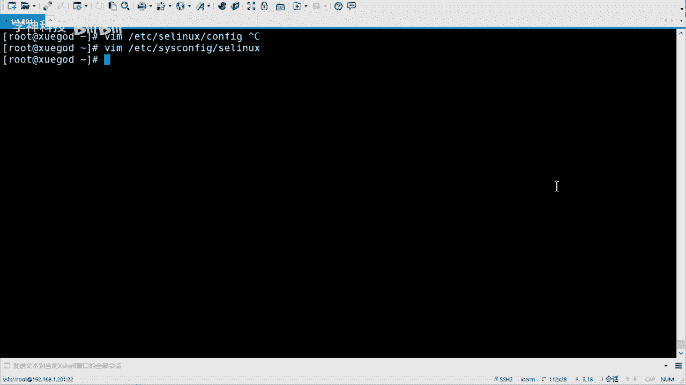

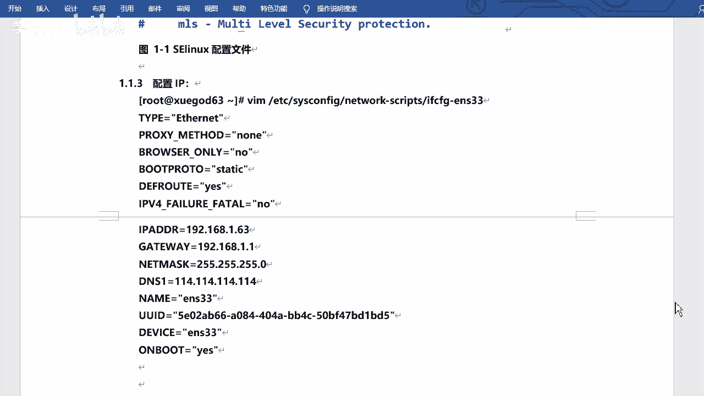

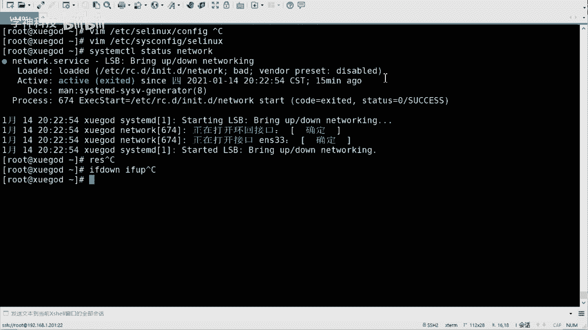

## 系统环境配置 🔧
上一节我们概述了课程内容，本节中我们来看看如何为后续的服务学习准备一个干净的CentOS 7实验环境。以下是需要完成的基础配置步骤。

### 1. 关闭防火墙与SELinux
为了在实验阶段避免不必要的访问控制干扰，我们首先需要关闭防火墙和SELinux。
*   **关闭防火墙**：
    ```bash
    systemctl stop firewalld
    systemctl disable firewalld
    ```
*   **关闭SELinux**：
    *   临时关闭：`setenforce 0`
    *   永久关闭：需要修改配置文件 `/etc/selinux/config` 或 `/etc/sysconfig/selinux`，将 `SELINUX=` 的值改为 `disabled`，然后重启系统生效。

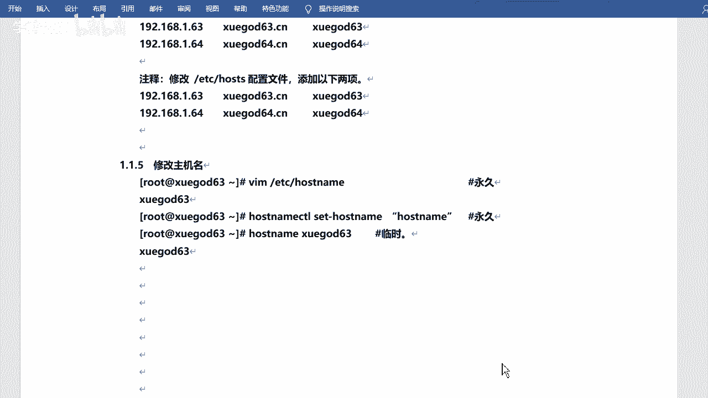

### 2. 配置网络
配置静态IP地址可以确保远程连接的稳定性。以下是配置方法。
*   编辑网卡配置文件，例如 `/etc/sysconfig/network-scripts/ifcfg-ens33`。
*   将 `BOOTPROTO` 改为 `static`，并设置 `IPADDR`、`NETMASK`、`GATEWAY`、`DNS1` 等参数，确保 `ONBOOT=yes`。
*   配置完成后，重启网络服务使配置生效：
    ```bash
    systemctl restart network
    ```


### 3. 设置主机名与主机映射
清晰的主机名有助于在多台服务器环境中进行区分和管理。以下是相关操作。
*   **修改主机名**：
    *   永久修改：编辑 `/etc/hostname` 文件，或使用 `hostnamectl set-hostname <新主机名>` 命令。
    *   临时修改：使用 `hostname <新主机名>` 命令。
*   **设置主机映射**：编辑 `/etc/hosts` 文件，添加 `IP地址 主机名` 的映射关系，方便通过主机名访问。

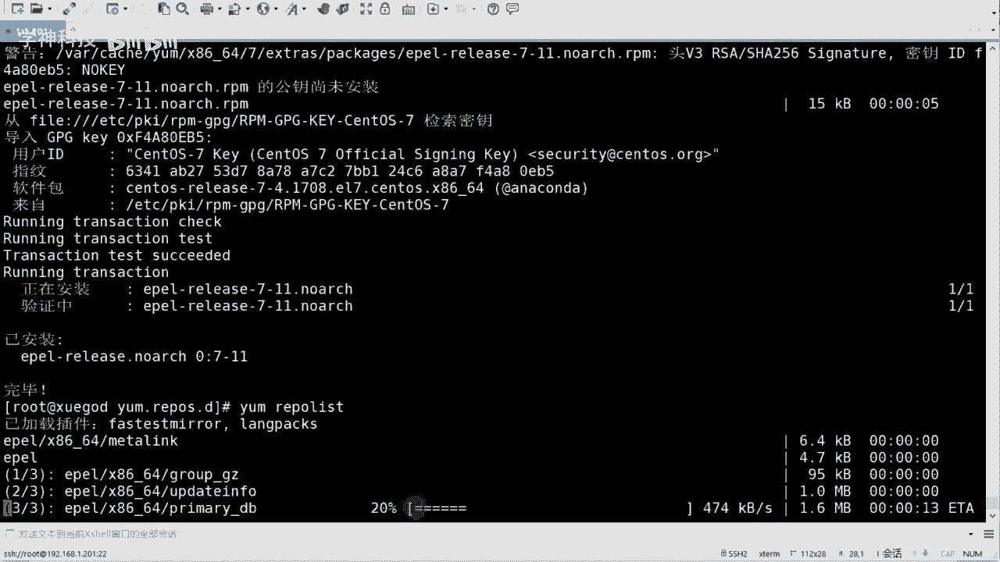

### 4. 配置Yum软件源
为了能够方便地安装各种软件包，我们需要配置Yum源。以下是两种常用源的配置思路。
*   **本地光盘源**：适用于无网络环境，挂载系统ISO镜像即可。
*   **网络源（如阿里云、EPEL）**：提供更丰富、更新的软件包。可以启用系统自带的网络源，或按照笔记配置阿里云的镜像源，然后安装EPEL扩展源：
    ```bash
    yum install -y epel-release
    ```

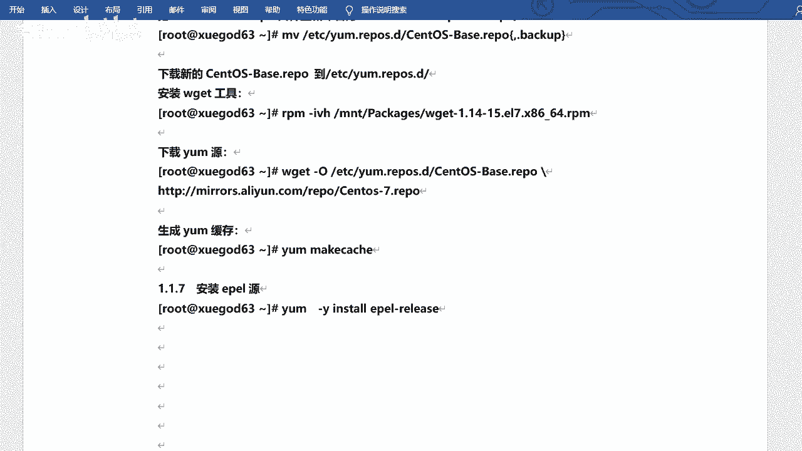


完成以上所有配置后，建议为虚拟机创建一个快照，以便后续实验能快速恢复到这个干净的基础状态。

## SSHD服务详解 🔐
环境准备就绪后，我们正式进入服务学习阶段。首先介绍的是SSHD服务，它是远程管理Linux服务器的基石。


### 什么是SSHD服务？
SSHD（Secure Shell Daemon）服务是基于SSH协议的后台守护进程。它主要用于实现安全的远程系统登录和网络服务。相较于早期的Telnet（明文传输），SSH对所有传输数据进行加密，因此安全得多。

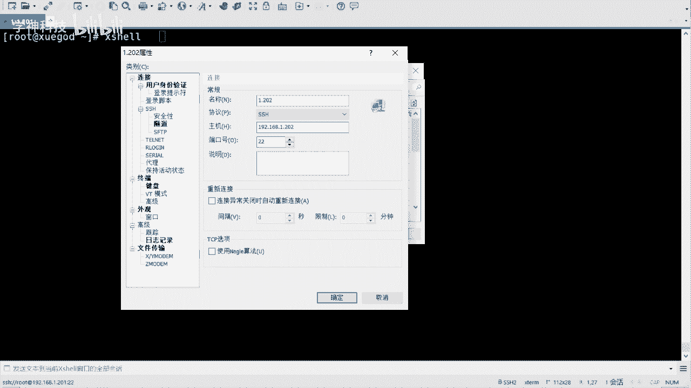

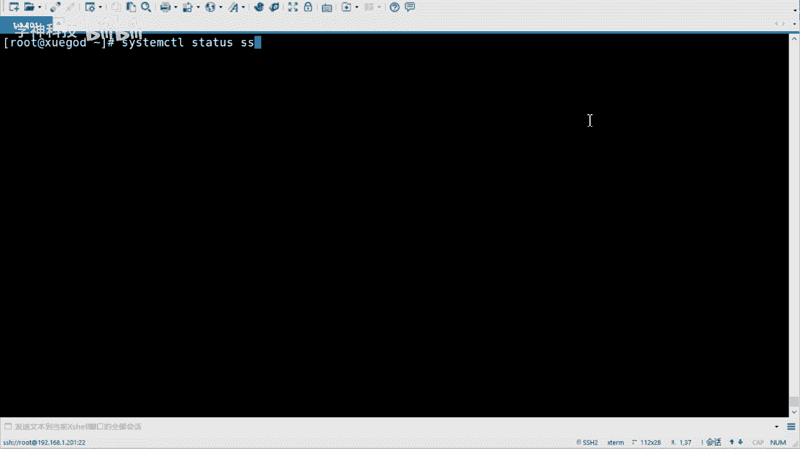

### 服务安装与验证
在最小化安装的CentOS 7中，SSHD服务通常已默认安装并运行。以下是验证和安装的方法。
*   **检查服务状态**：`systemctl status sshd`
*   **查看已安装的包**：`rpm -qa | grep openssh`
*   **如需安装**：可以安装 `openssh`、`openssh-clients`、`openssh-server` 等软件包。

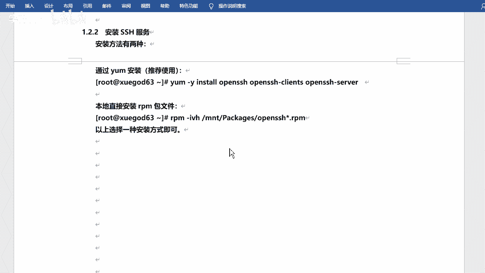

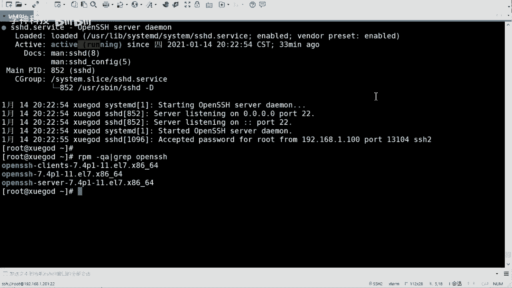

### 核心配置文件
学习服务管理，核心之一就是了解其配置文件。SSHD服务有两个主要的配置文件。
*   **`/etc/ssh/ssh_config`**：**SSH客户端**的配置文件。
*   **`/etc/ssh/sshd_config`**：**SSHD服务端**的配置文件。我们管理服务时，主要修改这个文件。

### 服务管理命令
在CentOS 7/8中，我们使用 `systemctl` 命令来管理系统服务，它与旧版的 `service` 或 `chkconfig` 命令兼容。
以下是常用的服务管理命令。
*   启动服务：`systemctl start sshd`
*   停止服务：`systemctl stop sshd`
*   重启服务：`systemctl restart sshd`
*   查看状态：`systemctl status sshd`
*   设置开机自启：`systemctl enable sshd`
*   禁用开机自启：`systemctl disable sshd`

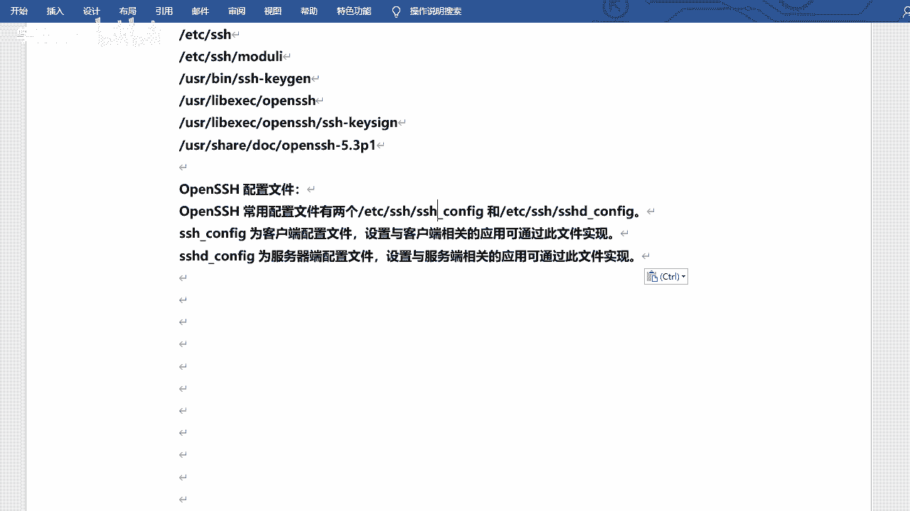

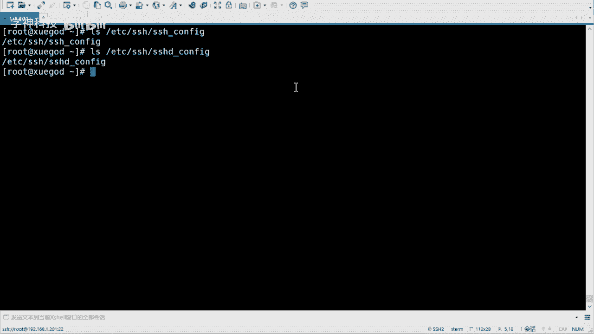

### SSH协议的应用
SSH协议不仅用于远程终端登录（如通过Xshell、FinalShell等工具），还是一些其他安全工具的基础。
*   **SCP**：基于SSH的安全文件拷贝命令。
*   **SFTP**：基于SSH的安全文件传输协议。
*   **Rsync**（配合SSH）：高效的文件同步工具。


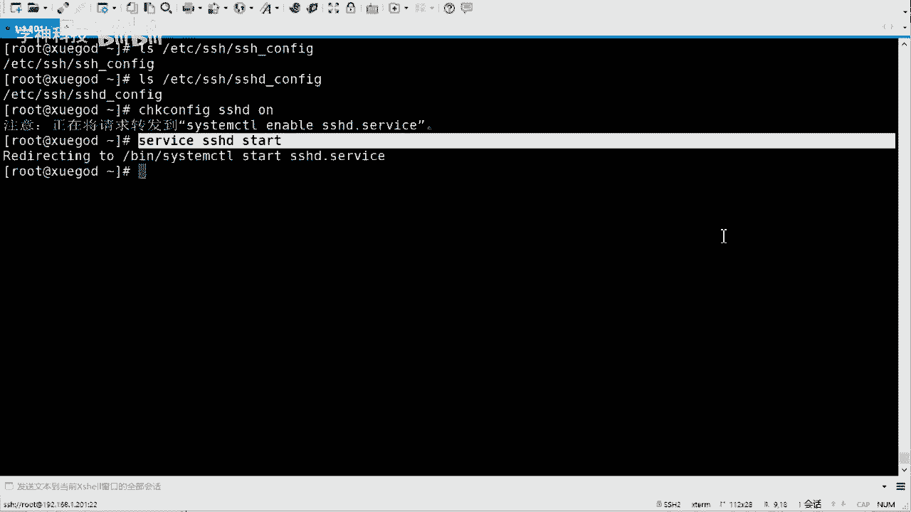

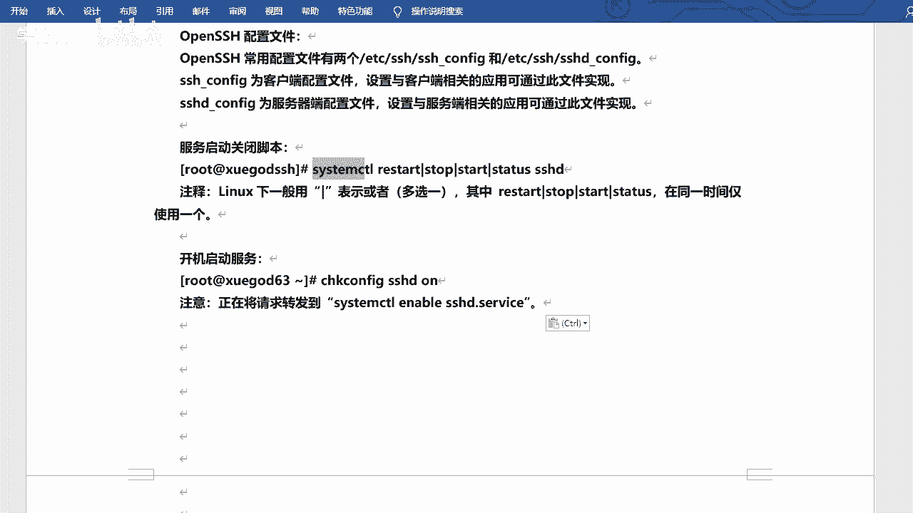

## 总结
本节课中我们一起学习了第二阶段课程的准备工作以及第一个Linux服务——SSHD。
我们首先完成了CentOS 7实验环境的基础配置，包括关闭防火墙/SELinux、配置网络、主机名和Yum源。
接着，我们深入介绍了SSHD服务，了解了其加密传输的安全特性，掌握了服务状态检查、安装以及使用 `systemctl` 进行服务生命周期管理的方法。
理解SSHD服务是后续远程管理、文件传输及其他服务学习的重要基础。