# Linux系统管理：P2：SSH远程连接与配置文件详解 🔧


在本节课中，我们将学习SSH远程连接的基本使用，并深入讲解其核心配置文件。你将掌握如何启动服务、使用SSH命令连接服务器、修改关键配置以增强安全性，以及一些实用技巧。

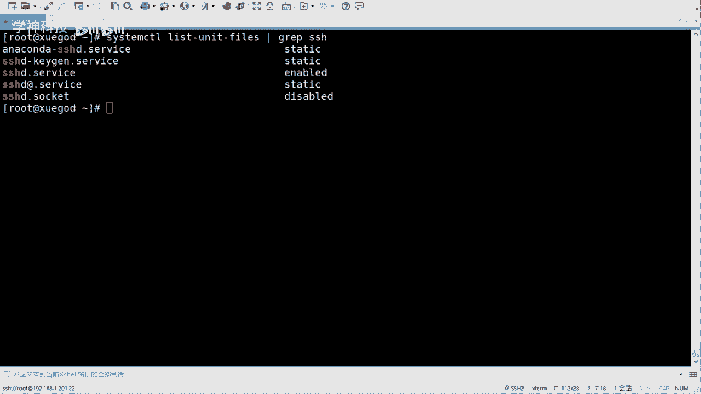

## 服务管理 🔄

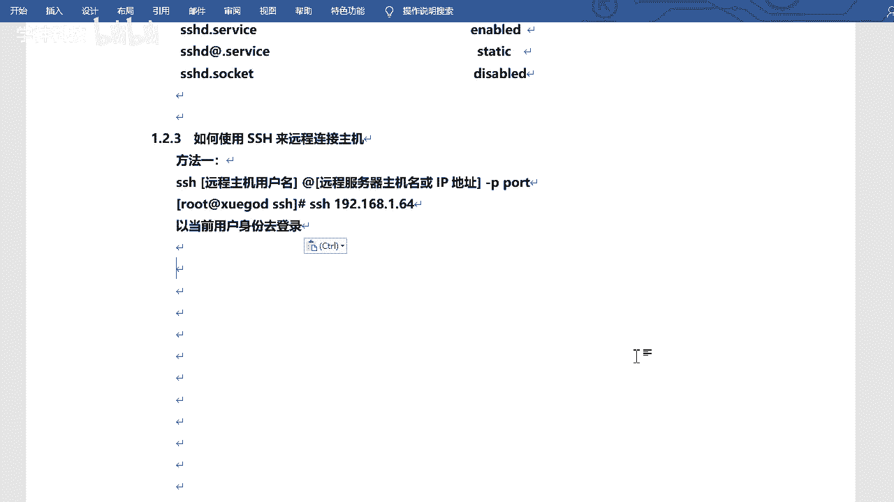

上一节我们介绍了SSH的基本概念，本节中我们来看看如何管理SSH服务。

SSH服务可以通过`systemctl`命令进行管理，包括启动、关闭和设置开机自启。

以下是常用的服务管理命令：

*   `systemctl start sshd`：启动SSH服务。
*   `systemctl stop sshd`：停止SSH服务。
*   `systemctl restart sshd`：重启SSH服务。
*   `systemctl enable sshd`：设置SSH服务开机自启。
*   `systemctl disable sshd`：取消SSH服务开机自启。

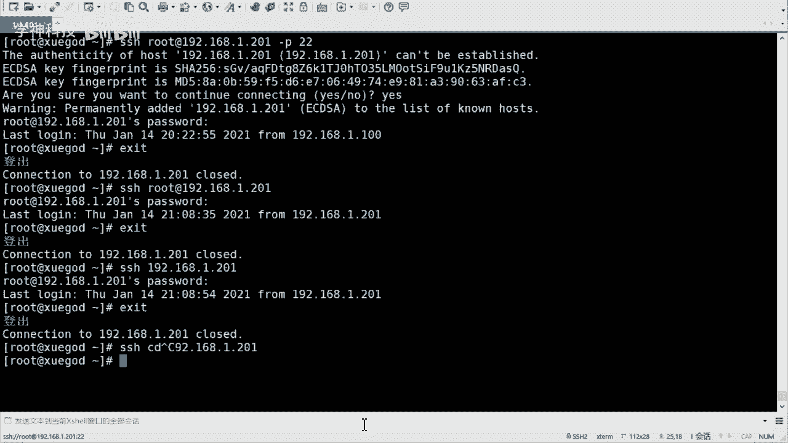

要检查SSH服务的当前状态和是否启用，可以使用以下命令：

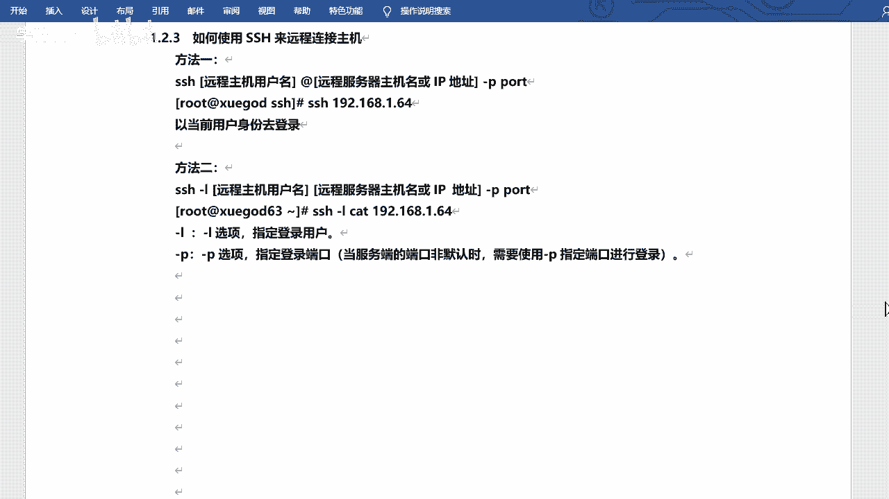

*   `systemctl status sshd`：查看服务运行状态。
*   `systemctl is-enabled sshd`：检查服务是否设置为开机启动。命令会返回`enabled`（已启用）或`disabled`（已禁用）。

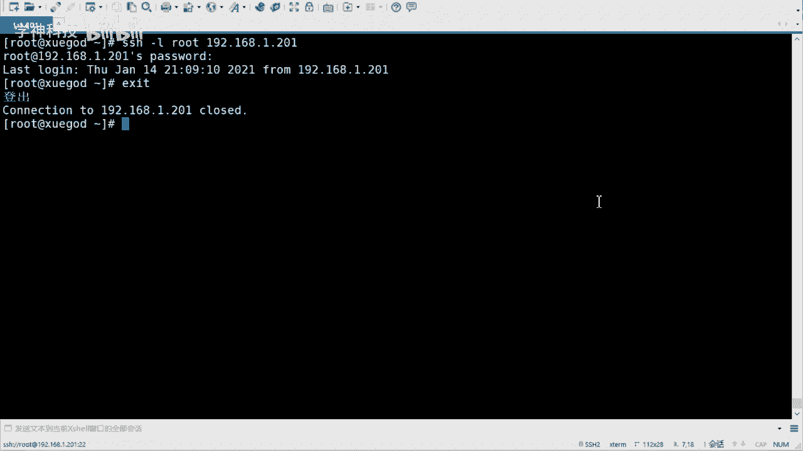

如果不确定服务的完整名称，可以使用`systemctl list-unit-files | grep ssh`命令进行过滤查找。

## SSH连接使用 🌐


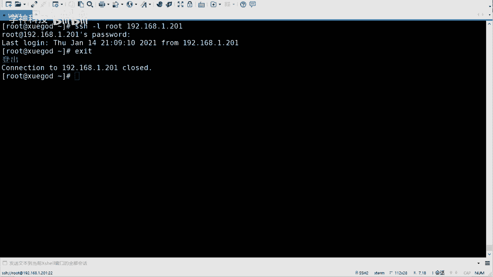

了解了服务管理后，我们来看看如何使用SSH进行远程连接。

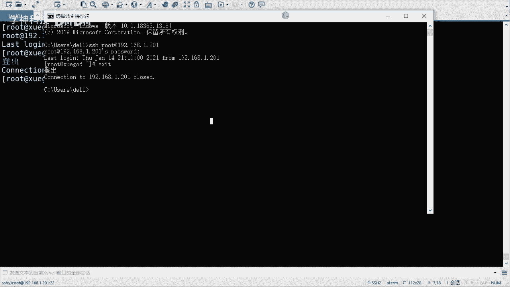

在Linux或macOS系统的终端，可以直接使用`ssh`命令进行连接。基本语法如下：


```bash
ssh 用户名@服务器IP地址 -p 端口号
```

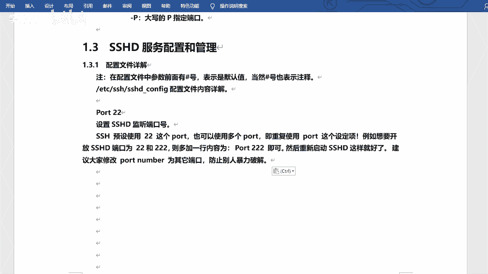

例如，连接IP为`192.168.1.201`的服务器，使用`root`用户和默认的22端口：
```bash
ssh root@192.168.1.201
```
首次连接时会提示确认主机密钥，输入`yes`后，再输入相应用户的密码即可登录。

连接参数说明：
*   如果端口号为默认的22，可以省略`-p 22`。
*   如果客户端当前用户名与要登录的服务器用户名相同，可以省略`用户名@`部分，直接使用`ssh 服务器IP地址`。
*   也可以使用`ssh -l 用户名 服务器IP地址`的格式，效果与`用户名@IP`相同。

退出远程连接使用`exit`命令。

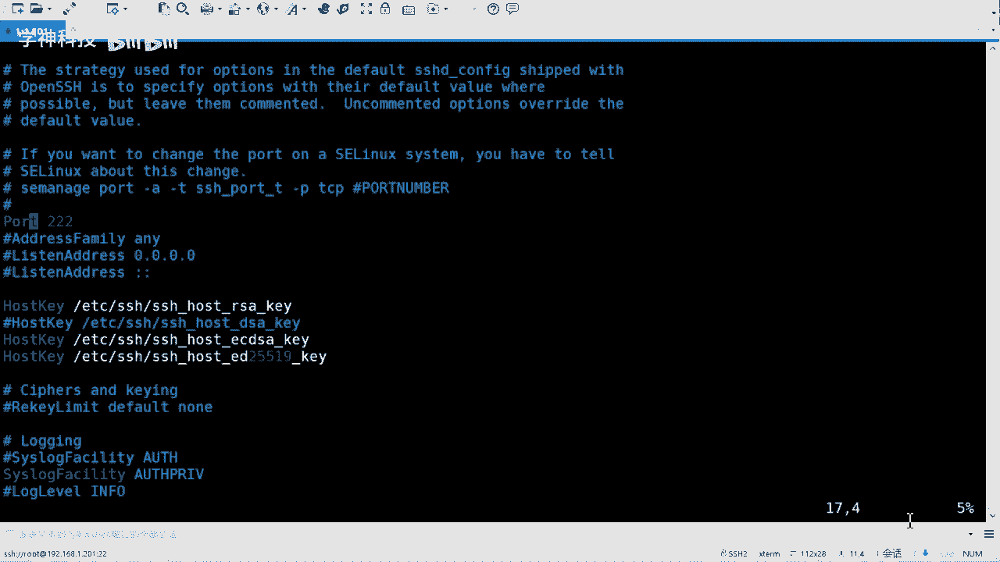

此外，基于SSH协议的命令还有`scp`，用于在本地和远程主机之间安全地复制文件。其基本格式为：
```bash
scp 本地文件路径 用户名@远程IP地址:远程目录路径
```
例如，将本地文件`file.txt`拷贝到远程服务器的`/tmp`目录：
```bash
scp ./file.txt root@192.168.1.201:/tmp/
```
参数说明：
*   `-r`：递归复制整个目录。
*   `-P`：指定远程服务器的SSH端口号（注意是大写P）。

Windows 10及更高版本的系统，其命令提示符（CMD）或PowerShell也内置了SSH客户端，使用方法与上述相同。

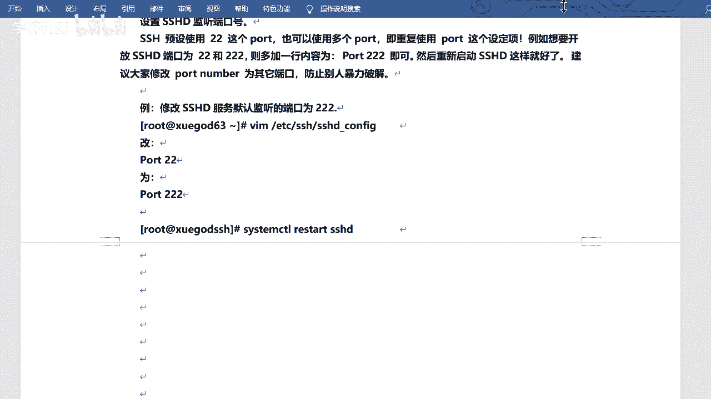

## 配置文件解析与修改 ⚙️

现在我们已经会使用SSH了，接下来深入了解其核心配置文件，这是进行安全加固和自定义设置的关键。

SSH服务端的主配置文件位于`/etc/ssh/sshd_config`。修改前，建议先备份原文件，这是一个好习惯：
```bash
cp /etc/ssh/sshd_config /etc/ssh/sshd_config.bak
```


配置文件中有许多以`#`开头的行，表示注释或默认配置。要启用或修改某项配置，需要确保该行没有注释符号`#`。

以下是几个关键的安全配置项：

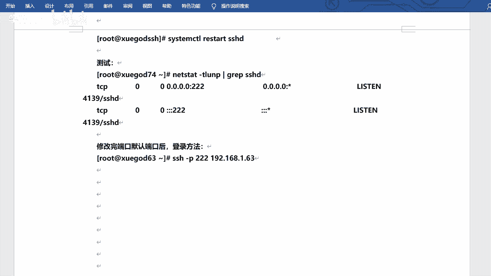

1.  **修改默认端口**
    找到`#Port 22`这一行，去掉`#`，并将`22`改为一个1024以上的非知名端口（如`322`）。这可以降低被自动化工具扫描攻击的风险。
    ```
    Port 322
    ```
    修改后必须重启服务生效：`systemctl restart sshd`。之后连接需指定新端口：`ssh root@192.168.1.201 -p 322`。


2.  **禁止root用户直接远程登录**
    找到`#PermitRootLogin yes`，去掉`#`，并将`yes`改为`no`。
    ```
    PermitRootLogin no
    ```
    这样设置后，攻击者无法直接用root账号尝试爆破。管理员应先以普通用户登录，再通过`su`或`sudo`切换权限。

3.  **登录时长与空密码限制**
    *   `LoginGraceTime`：设置登录超时时间（秒）。
    *   `PermitEmptyPasswords`：确保其为`no`，禁止空密码登录。
    *   `PasswordAuthentication`：是否启用密码验证，默认为`yes`。如果使用密钥对登录，可将其设为`no`以禁用密码登录，安全性更高。


4.  **其他配置**
    *   `PrintLastLog`：设置为`yes`时，用户登录后会显示上次登录的时间和信息。
    *   `UseDNS`：在内网环境中可将其设为`no`，以加快SSH连接速度，避免DNS反向查询。

每次修改配置文件后，都需要执行`systemctl restart sshd`重启服务以使更改生效。


## 登录提示信息定制 💬


除了核心配置，我们还可以定制用户登录时看到的提示信息，例如添加法律警告或系统公告。

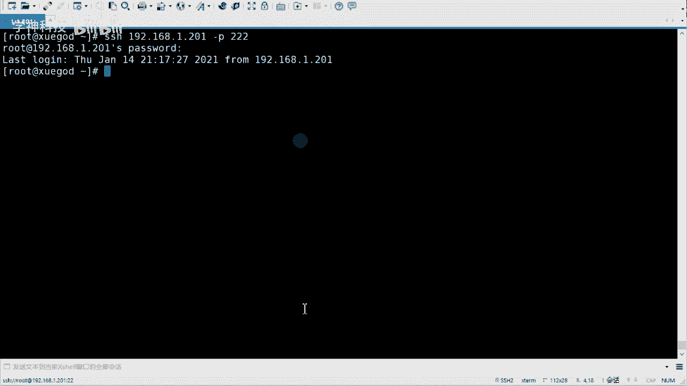

这个功能通过`/etc/motd`（Message Of The Day）文件实现。只需将想要显示的文本内容写入该文件即可。

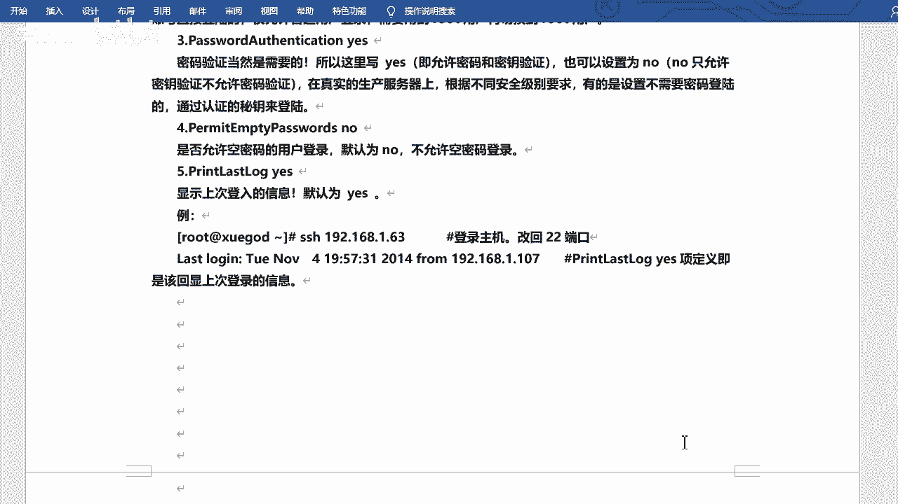

例如，添加一条警告信息：
```bash
echo “Warning: All activities on this system are monitored and recorded.” > /etc/motd
```
或者使用编辑器直接编辑`/etc/motd`文件。

此后，任何用户通过SSH成功登录后，都会在命令行提示符出现前看到这行信息。这个功能常用于发布系统维护通知或安全警示。

---

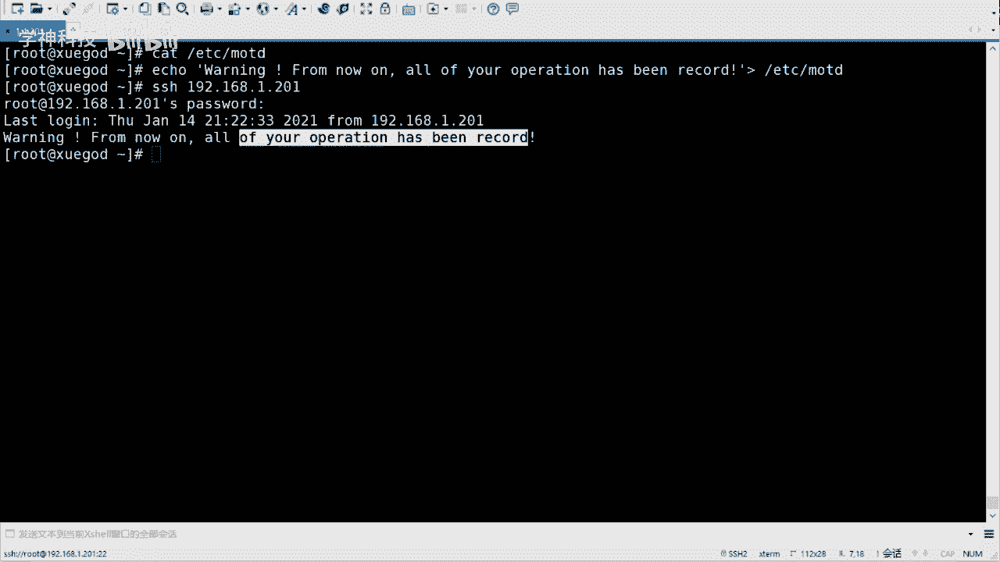

**本节课总结** 🎯

本节课我们一起学习了SSH远程连接的完整知识：
1.  使用`systemctl`命令管理SSH服务的启动、停止和自启状态。
2.  掌握`ssh`命令的基本语法，以及基于SSH的`scp`文件传输命令。
3.  深入解析了`/etc/ssh/sshd_config`配置文件，并实践了修改默认端口、禁止root远程登录等关键安全设置。
4.  学会了通过编辑`/etc/motd`文件来自定义用户登录后的提示信息。

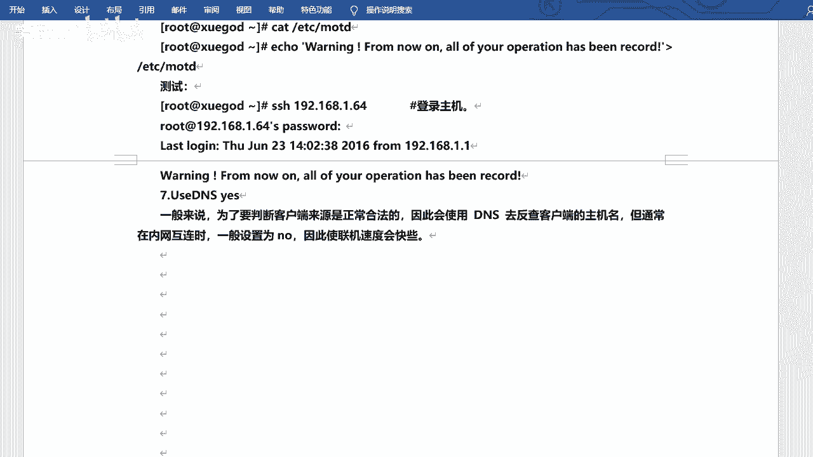

通过合理配置SSH，可以极大地增强Linux服务器的远程访问安全性。