# 红帽认证课程：P3：使用fail2ban防止暴力破解 🔒

在本节课中，我们将学习如何保护Linux服务器免受暴力破解攻击。暴力破解是指攻击者通过尝试大量用户名和密码组合来非法访问系统的行为。我们将重点介绍使用`fail2ban`工具来监控和阻止此类攻击，并回顾其他增强SSH安全性的方法。

## 什么是暴力破解？🤔

暴力破解是一种常见的网络攻击方式。攻击者会使用自动化工具，反复尝试使用不同的密码登录系统，例如默认的`root`账户，试图通过穷举法猜出正确的凭证。

## 增强SSH安全性的基础方法 🛡️


在引入自动化工具之前，我们可以通过配置SSH服务本身来大幅提高安全性。以下是几种有效的方法：

*   **设置强密码**：密码应大于8位且小于20位，并混合使用**数字**、**大写字母**、**小写字母**和**特殊符号**。包含其中三种或以上字符类型的密码可视为强密码。例如：`P@ssw0rd`。
*   **修改默认端口**：将SSH服务的默认端口22更改为其他非标准端口，可以减少自动化扫描攻击。
*   **禁止root用户远程登录**：创建一个普通用户账户用于远程登录，然后通过`su`或`sudo`命令获取管理员权限。
*   **使用密钥对认证**：完全禁用密码登录，改用更安全的公钥/私钥对进行身份验证。

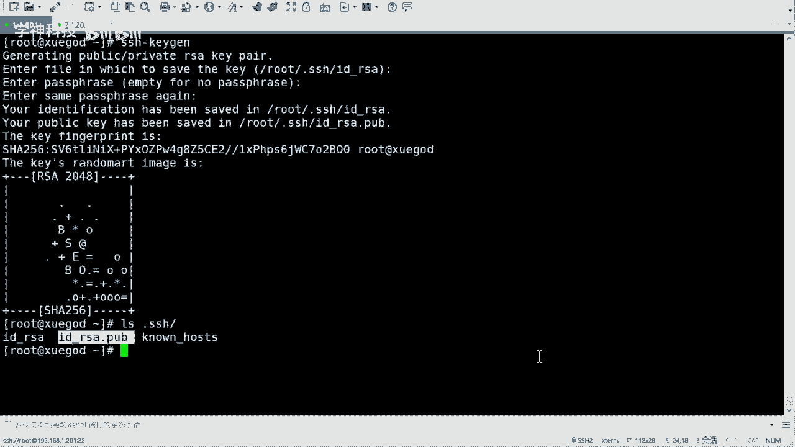

上一节我们介绍了基础的安全加固方法，本节中我们来看看如何使用密钥对实现免密码登录。


## 配置SSH密钥对认证 🔑

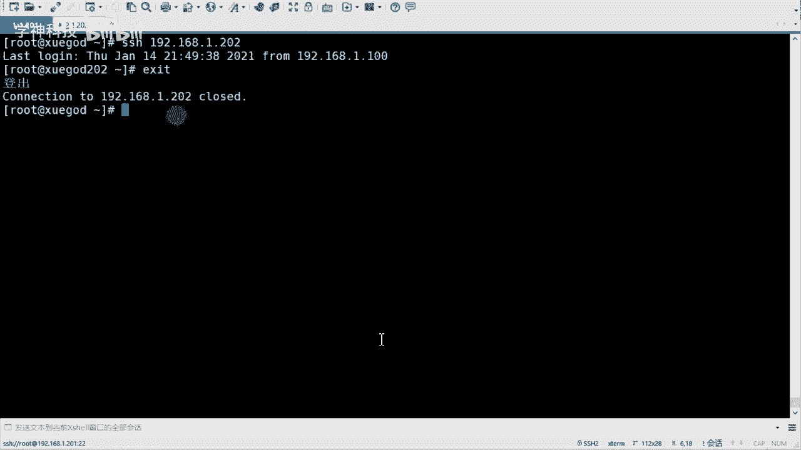

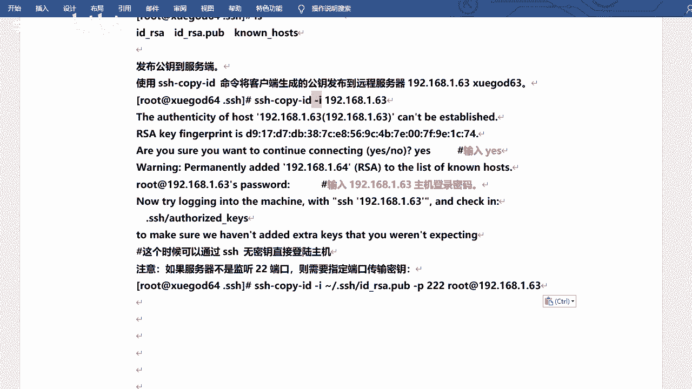

密钥对认证比密码更安全。其原理是生成一对密钥：公钥（好比锁）和私钥（好比钥匙）。将公钥放置在服务器上，持有私钥的客户端即可无需密码直接登录。


以下是配置步骤：

1.  **在客户端生成密钥对**：在计划用来登录的机器上执行命令 `ssh-keygen`，全程按回车使用默认选项即可。生成的密钥文件默认位于用户家目录的 `.ssh/` 文件夹下（`id_rsa` 是私钥，`id_rsa.pub` 是公钥）。
2.  **将公钥传输到服务器**：使用 `ssh-copy-id` 命令将公钥上传到目标服务器。例如：`ssh-copy-id user@192.168.1.202`。首次连接需要输入目标服务器的用户密码。
3.  **测试免密登录**：公钥传输成功后，即可使用 `ssh user@192.168.1.202` 直接登录，无需再输入密码。

如果服务器SSH端口不是22，需要在命令中使用 `-p` 参数指定端口，例如：`ssh-copy-id -p 2222 user@192.168.1.202`。

除了上述方法，还可以使用IP黑白名单（`/etc/hosts.deny` 和 `/etc/hosts.allow`）或部署堡垒机。接下来，我们将学习一个功能更强大、更自动化的工具——`fail2ban`。

## 使用fail2ban进行主动防护 🚨


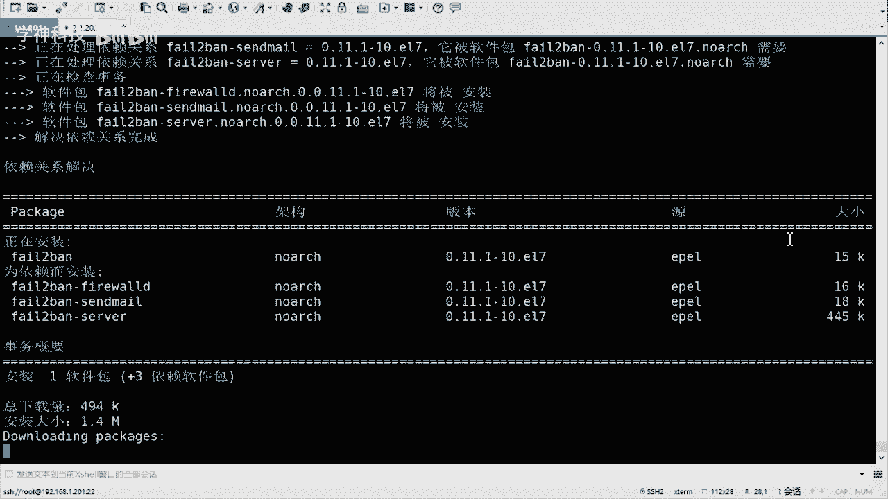

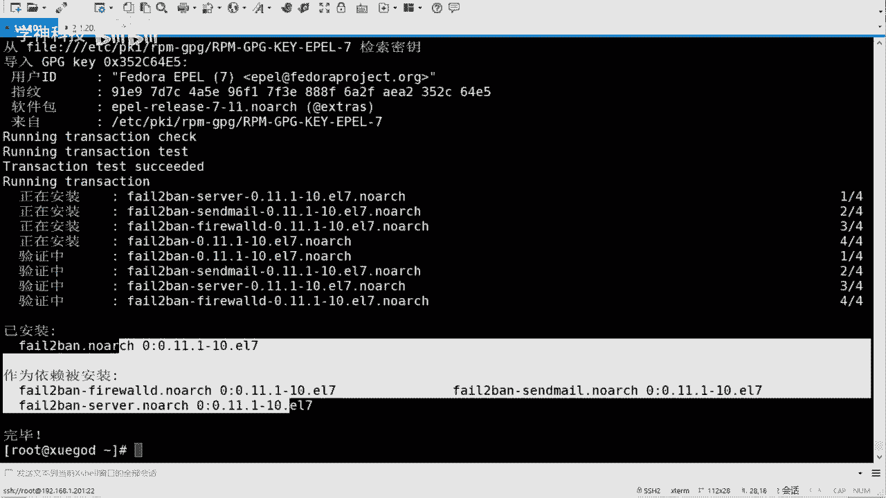

`fail2ban` 是一个入侵防御框架，它可以监控系统日志（如 `/var/log/secure`），根据设定的规则匹配失败登录等恶意行为，并自动调用防火墙（如iptables）临时封禁来源IP地址。

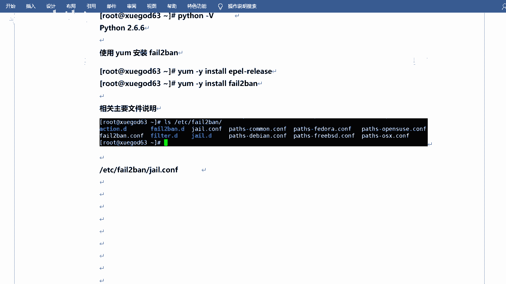

它的优点是能有效减轻因持续暴力破解导致的系统资源消耗，防止服务因攻击而瘫痪。


### 安装fail2ban


在配置了YUM源的RHEL/CentOS系统上，安装非常简单：
```bash
yum install -y fail2ban
```
`fail2ban` 需要Python环境（版本>2.4），通常系统已满足要求。

### 配置fail2ban保护SSH

`fail2ban` 的主要配置文件是 `/etc/fail2ban/jail.conf`。建议在 `/etc/fail2ban/jail.local` 中添加或覆盖配置（如果此文件不存在，可以复制 `jail.conf` 并修改）。

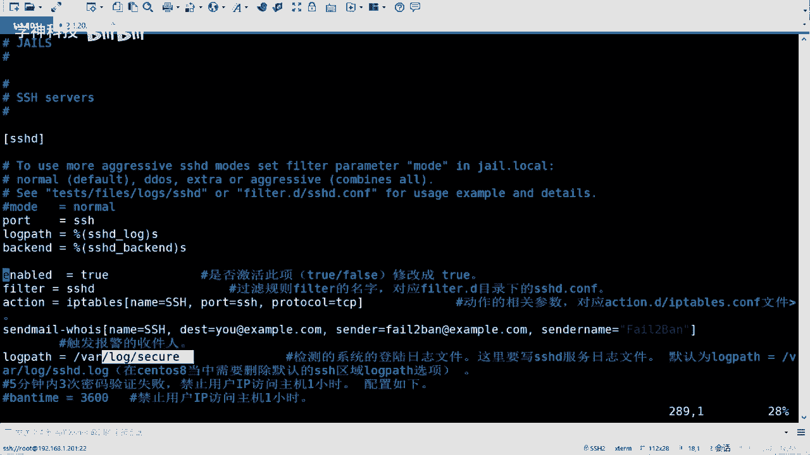

我们将设置一个规则：在5分钟（300秒）内，如果来自同一IP的SSH密码验证失败达到3次，则禁止该IP访问1小时（3600秒）。

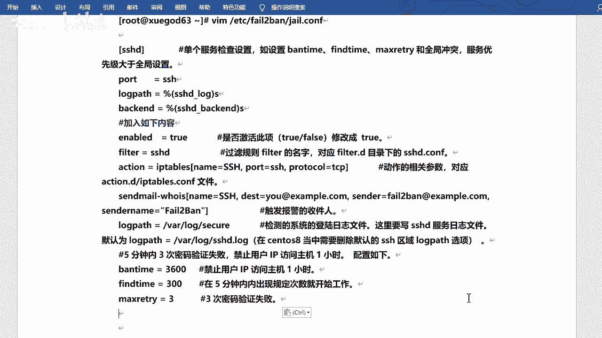

需要修改或添加的配置段落如下：
```ini
[sshd]
enabled = true
port = ssh
filter = sshd
logpath = /var/log/secure
maxretry = 3
bantime = 3600
findtime = 300
action = iptables[name=SSH, port=ssh, protocol=tcp]
```
*   `[sshd]`: 启用对SSH服务的监控。
*   `filter`: 指定使用的过滤规则（位于 `/etc/fail2ban/filter.d/sshd.conf`）。
*   `logpath`: 指定SSH日志文件路径。
*   `maxretry`: 最大重试次数。
*   `findtime`: 计数的时间窗口（秒）。
*   `bantime`: 禁止访问的时长（秒）。
*   `action`: 触发后执行的动作，这里是添加到iptables规则。

### 启动并测试fail2ban

1.  启动服务并设置开机自启：
    ```bash
    systemctl start fail2ban
    systemctl enable fail2ban
    ```
2.  **测试**：从另一台客户端，尝试用错误密码SSH连接服务器3次。第4次尝试时，连接会被直接拒绝（Connection refused）。
3.  **查看状态**：
    *   查看被禁止的IP：`fail2ban-client status sshd`
    *   查看iptables规则：`iptables -L -n`，会发现一个名为 `f2b-SSH` 的链及其规则。

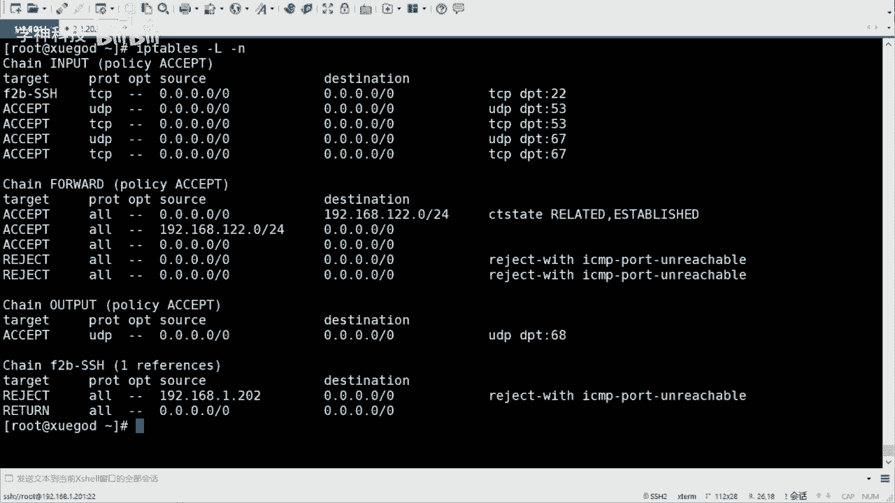

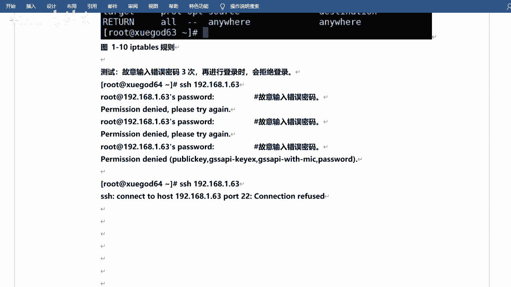

### 管理fail2ban

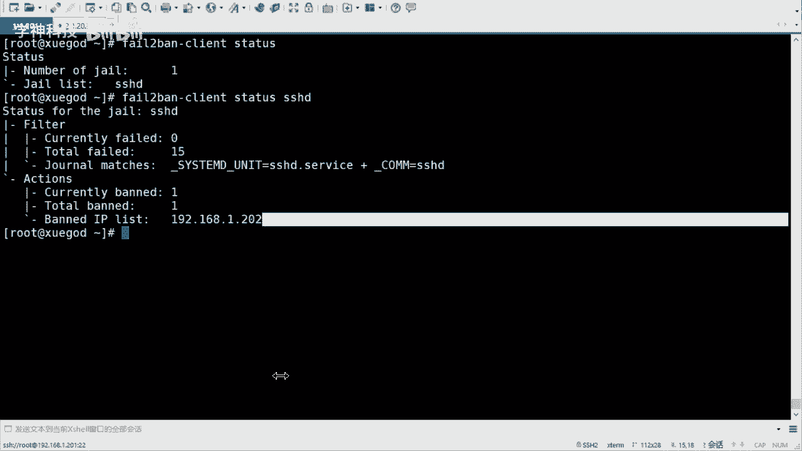

*   **修改SSH端口后**：如果服务器SSH端口不是22，需在 `jail.local` 的 `[sshd]` 部分将 `port = ssh` 改为 `port = 你的新端口号`，然后重启fail2ban服务。
*   **手动解封IP**：如果误封了IP，可以手动解除：
    ```bash
    fail2ban-client set sshd unbanip 192.168.1.100
    ```
*   **重启防火墙后**：如果系统防火墙（iptables）被清空或重启，需要同时重启fail2ban服务以重新应用封禁规则：`systemctl restart fail2ban`。

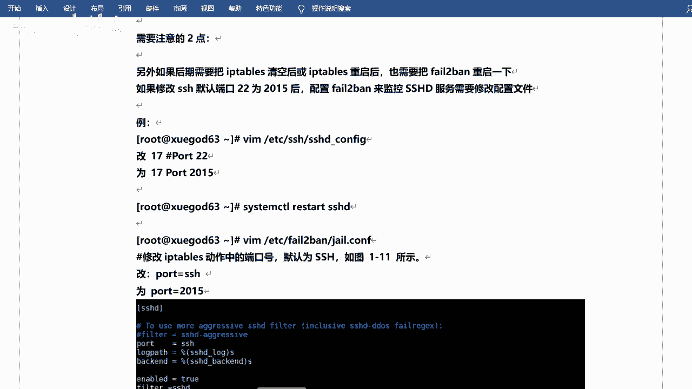

## 总结 📝

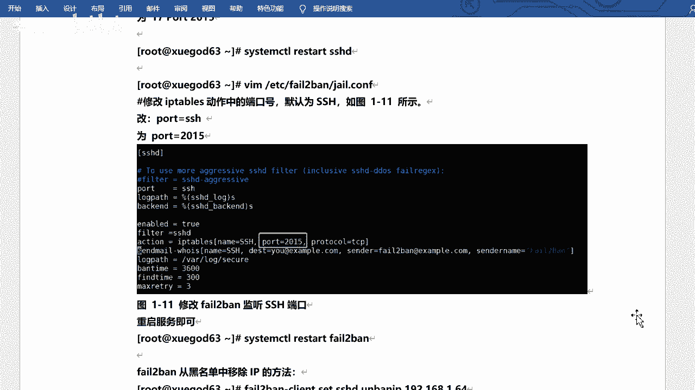


本节课中我们一起学习了如何防御SSH暴力破解攻击。我们首先回顾了基础安全措施：设置强密码、修改端口、禁止root远程登录和使用密钥认证。随后，我们深入探讨了如何使用 `fail2ban` 这一强大工具进行自动化监控和动态封禁。通过配置 `fail2ban`，我们可以有效缓解暴力破解攻击，降低系统资源被恶意消耗的风险，从而提升服务器的整体安全性。记住，安全是一个多层次、持续的过程，结合使用这些方法能构建更坚固的防御体系。