# 红帽认证课程：P4：SSH服务升级 🔧

在本节课中，我们将学习如何升级SSH服务。SSH是用于远程连接服务器的安全协议，其服务端程序SSHD由OpenSSH软件包提供。如果SSH服务存在已知漏洞，攻击者可能无需密码即可控制服务器。因此，定期检查并升级SSH版本以修复安全漏洞至关重要。

## 升级前的准备工作 🛡️

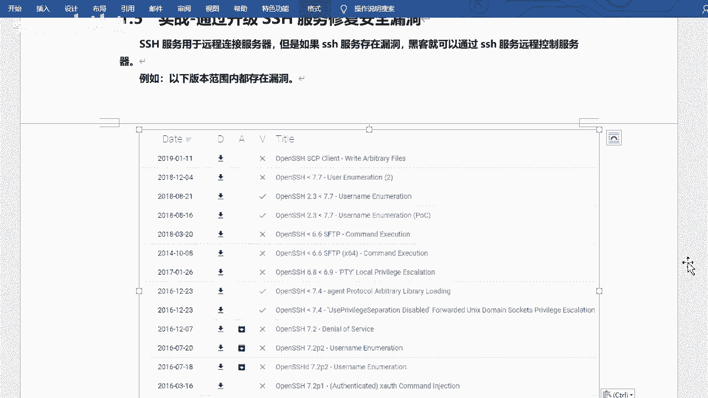

上一节我们介绍了SSH服务的基本概念。本节中，我们来看看升级SSH前必须完成的准备工作。

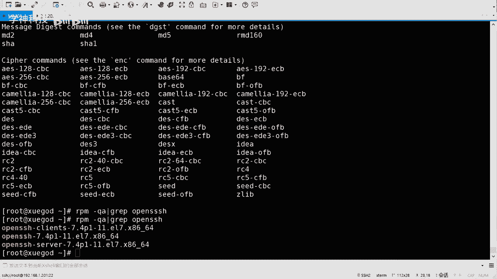

升级SSH服务时，一个关键步骤是配置备用连接方式。因为在升级或配置过程中，如果SSH服务中断，你将无法远程连接到服务器。因此，我们需要启用Telnet作为备用连接方式。

以下是配置Telnet备用连接的步骤：


1.  **安装Telnet相关软件包**：使用YUM包管理器安装`xinetd`和`telnet`服务。
    ```bash
    yum install -y xinetd telnet
    ```
    `xinetd`是一个守护进程，用于管理一些简单的网络服务。

2.  **配置Telnet登录终端**：编辑`/etc/securetty`文件，在文件末尾添加允许远程连接的虚拟终端类型。
    ```bash
    echo “pts/0” >> /etc/securetty
    echo “pts/1” >> /etc/securetty
    echo “pts/2” >> /etc/securetty
    echo “pts/3” >> /etc/securetty
    ```
    这个配置允许通过PTS（伪终端从设备）进行远程Telnet登录。


3.  **启动服务**：启动`xinetd`和`telnet.socket`服务。
    ```bash
    systemctl start xinetd
    systemctl start telnet.socket
    ```

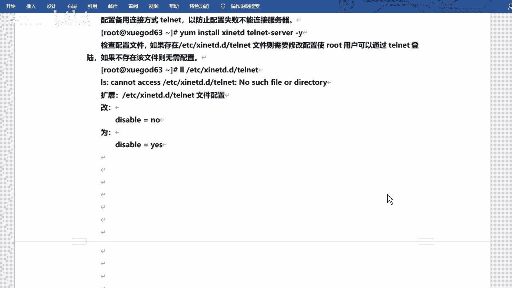

完成以上步骤后，你可以使用Telnet客户端（如Xshell，协议选择Telnet，端口23）连接到服务器进行后续操作，从而避免SSH服务中断导致失联。

## 安装编译依赖与获取源码 📦

准备工作完成后，我们就可以开始升级操作了。首先需要安装编译OpenSSH源码所需的依赖包。

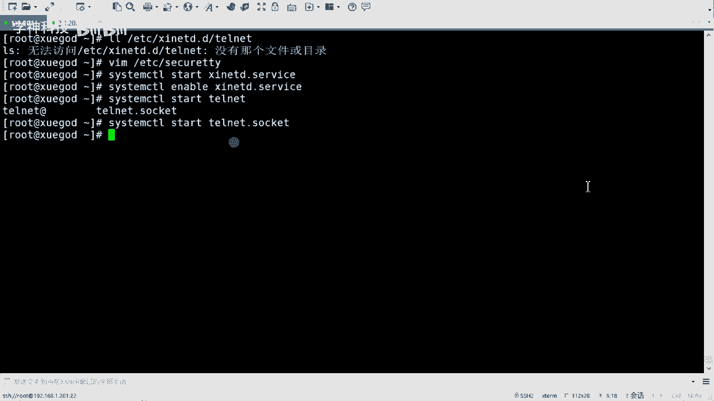


以下是需要安装的依赖包列表：

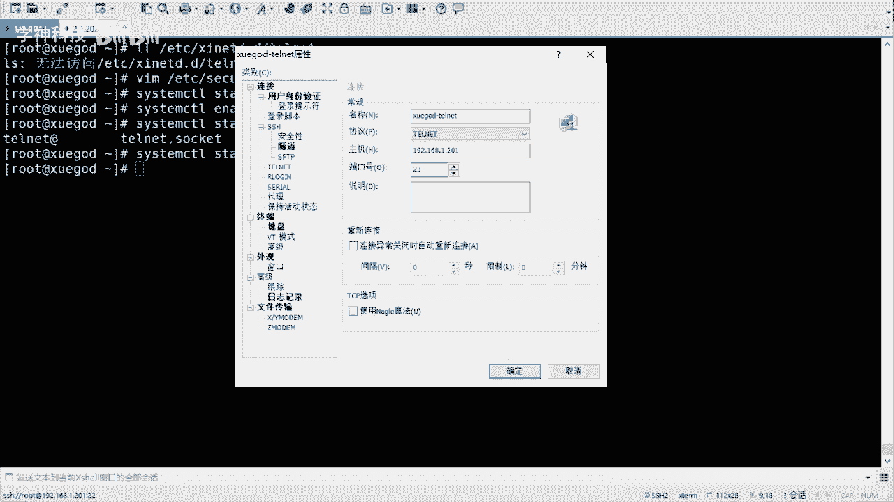

*   gcc
*   gcc-c++
*   zlib-devel
*   openssl-devel
*   pam-devel

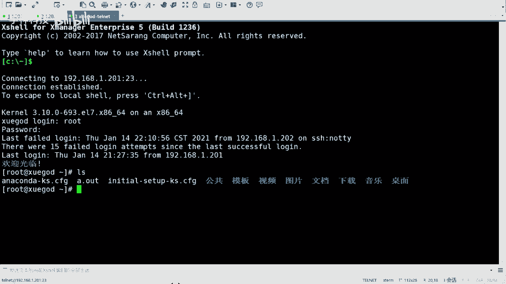

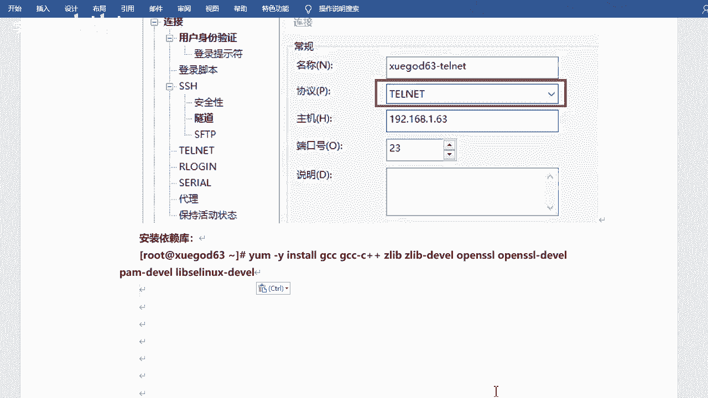

使用以下命令一次性安装：
```bash
yum install -y gcc gcc-c++ zlib-devel openssl-devel pam-devel
```

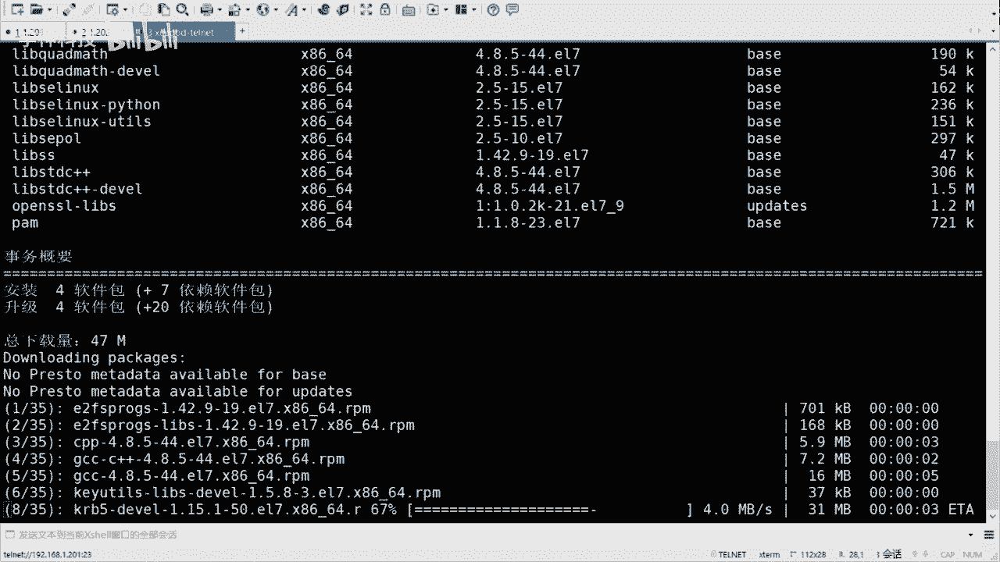

安装完依赖后，需要获取新版本的OpenSSH源码包。你可以从OpenSSH官方网站下载，例如`openssh-8.3p1.tar.gz`。然后使用SFTP工具将源码包上传到服务器的指定目录，例如`/usr/local/src/`。


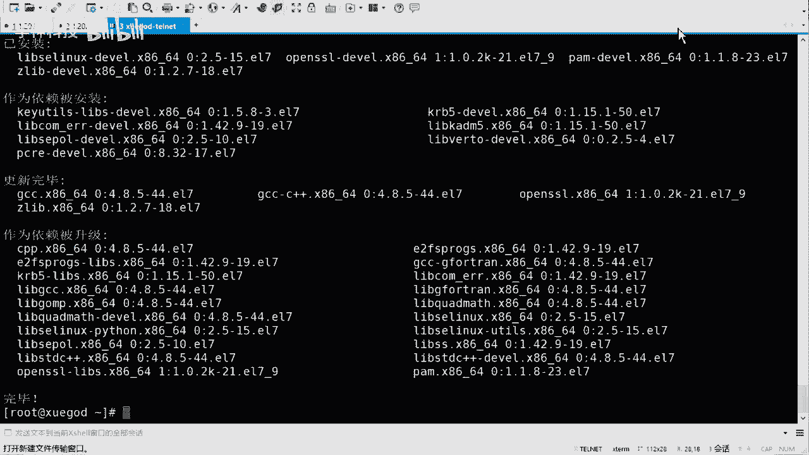

## 备份与编译安装 🚀

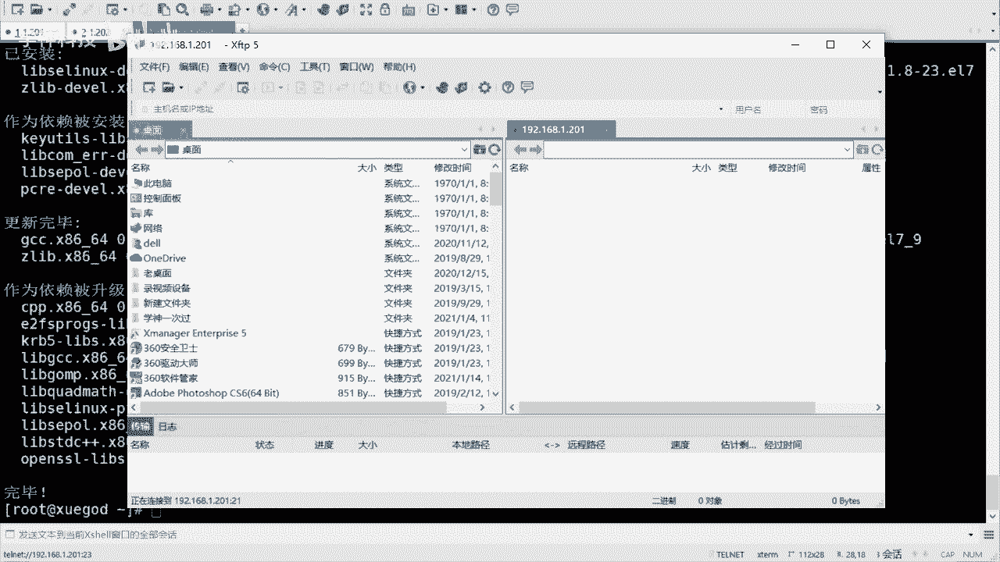


依赖和源码就绪后，接下来是关键的备份和编译安装阶段。


1.  **备份现有配置**：首先，备份当前SSH的配置文件，防止升级失败。
    ```bash
    mkdir /opt/ssh_back
    mv /etc/ssh/* /opt/ssh_back/
    ```

2.  **创建安装目录并解压源码**：为新的OpenSSH创建安装目录，并解压源码包。
    ```bash
    mkdir /usr/local/sshd
    tar xf openssh-8.3p1.tar.gz -C /usr/local/sshd/
    cd /usr/local/sshd/openssh-8.3p1
    ```

3.  **配置编译选项**：运行`configure`脚本，指定安装路径、配置文件路径以及启用所需的功能模块（如PAM认证、密码登录等）。
    ```bash
    ./configure --prefix=/usr/local/sshd \
                --sysconfdir=/etc/ssh \
                --with-pam --with-md5-passwords \
                --with-tcp-wrappers
    ```

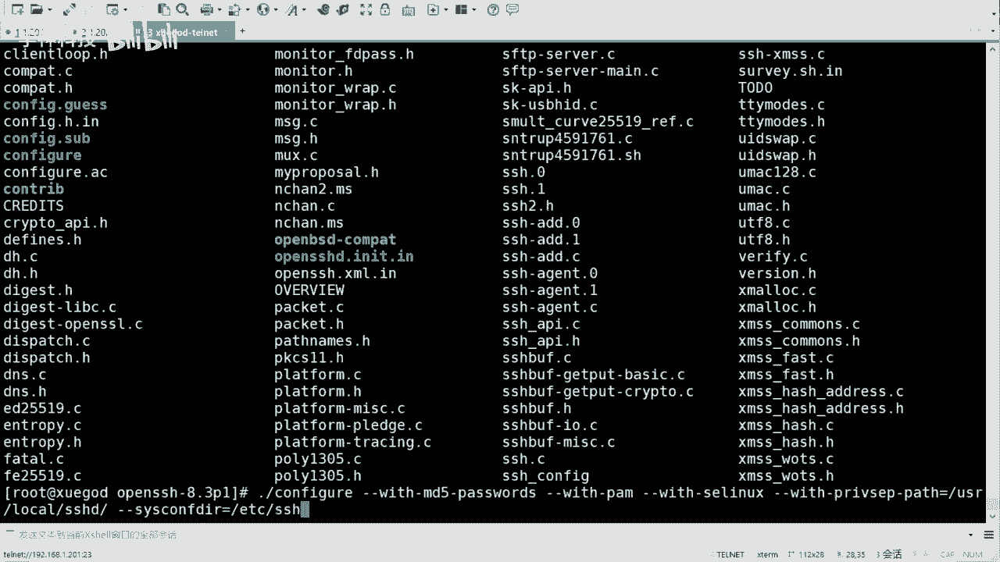

4.  **编译与安装**：执行`make`进行编译，然后执行`make install`进行安装。
    ```bash
    make && make install
    ```

## 配置文件与系统集成 ⚙️

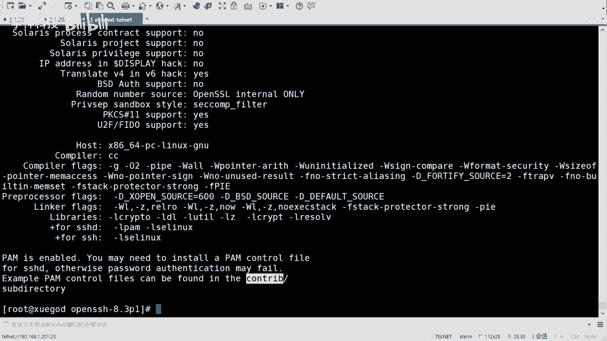

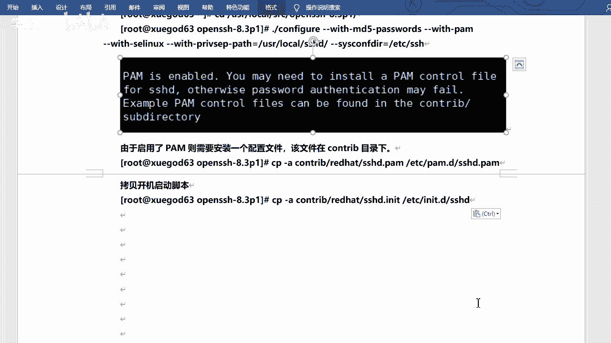

软件编译安装完成后，还需要进行一些配置和系统集成工作，新服务才能正常使用。

1.  **拷贝PAM配置文件**：将源码包中提供的PAM配置文件拷贝到系统目录。
    ```bash
    cp contrib/redhat/sshd.pam /etc/pam.d/sshd
    ```

2.  **拷贝服务启动脚本**：将源码包中的Systemd服务启动脚本拷贝到系统目录。
    ```bash
    cp contrib/redhat/sshd.init /etc/init.d/sshd
    chmod +x /etc/init.d/sshd
    ```

3.  **修改新SSH配置文件**：编辑新生成的配置文件`/etc/ssh/sshd_config`，确保关键设置正确。
    *   允许root用户登录：找到`PermitRootLogin`行，确保其值为`yes`。
    *   启用公钥认证：找到`PubkeyAuthentication`行，确保其值为`yes`。
    *   禁用DNS反向解析（可选，可加快连接速度）：找到`UseDNS`行，将其值改为`no`。

4.  **设置开机自启并替换旧服务**：将新的SSHD服务添加到系统启动项，并移走旧的服务文件。
    ```bash
    chkconfig --add sshd
    mv /usr/lib/systemd/system/sshd.service /opt/ssh_back/
    systemctl daemon-reload
    chkconfig sshd on
    ```

## 验证升级与收尾工作 ✅

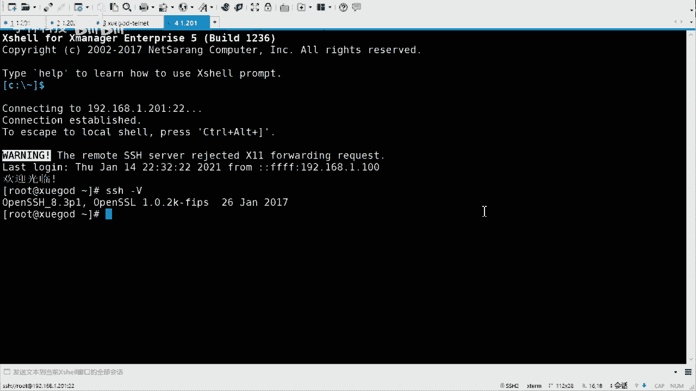

所有配置完成后，最后一步是验证升级是否成功，并清理临时环境。

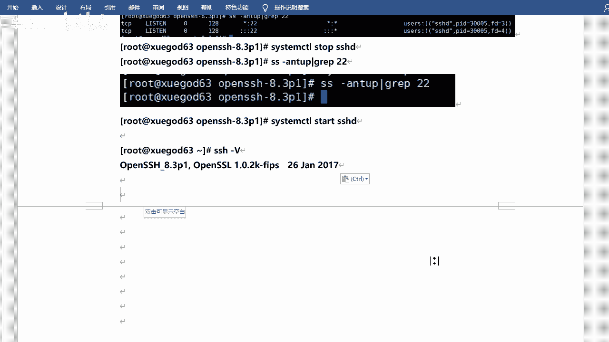

1.  **重启服务并验证版本**：重启新的SSHD服务，并使用`ssh -V`命令检查版本号。
    ```bash
    systemctl restart sshd
    ssh -V
    ```
    如果输出显示为`OpenSSH_8.3p1`，则表明升级成功。

2.  **禁用Telnet服务**：升级验证成功后，出于安全考虑，应立即停止并禁用之前临时启用的Telnet服务。
    ```bash
    systemctl stop xinetd
    systemctl stop telnet.socket
    systemctl disable xinetd telnet.socket
    ```
    现在，你可以继续使用安全的SSH协议（端口22）来连接和管理服务器了。

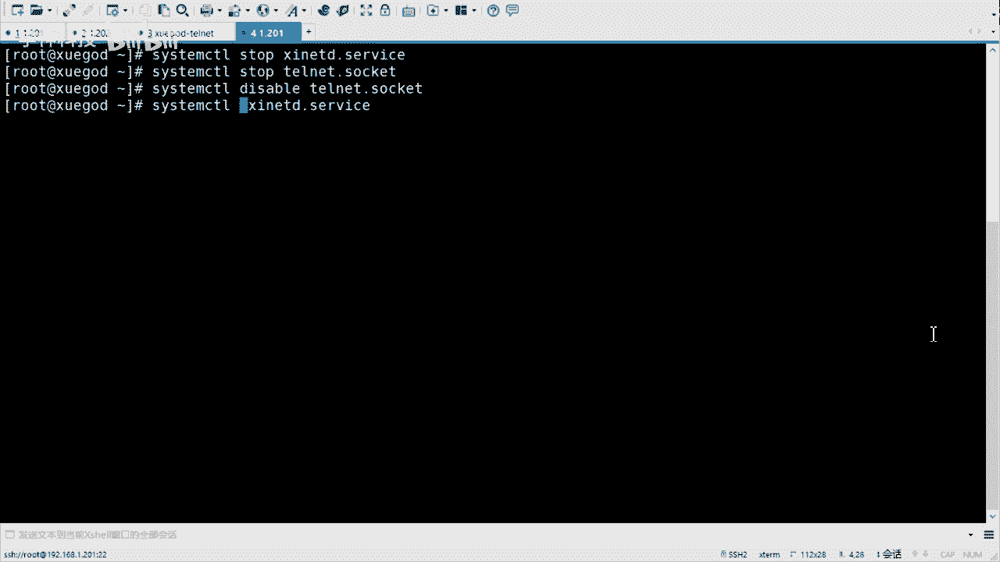

## 总结 📝


本节课中我们一起学习了如何为安全而升级SSH服务。我们首先了解了升级的必要性，然后详细演练了从准备备用连接到编译安装新版本的全过程。关键步骤包括：配置Telnet备用连接、安装编译依赖、备份旧配置、编译安装新版本、集成到系统服务以及最后的验证和收尾。通过源码编译安装，你可以精确控制升级到的版本号，这对于满足特定的安全合规要求非常有用。记住，在生产环境中进行此类操作前，务必在测试环境充分验证。