# Linux数据同步与备份：P2：rsync介绍与同步单个目录 📂

在本节课中，我们将要学习一个在Linux系统中非常重要的数据镜像备份工具——rsync。我们将从认识rsync开始，了解其特点和工作模式，并最终通过实践掌握如何使用rsync命令来同步单个目录。

---

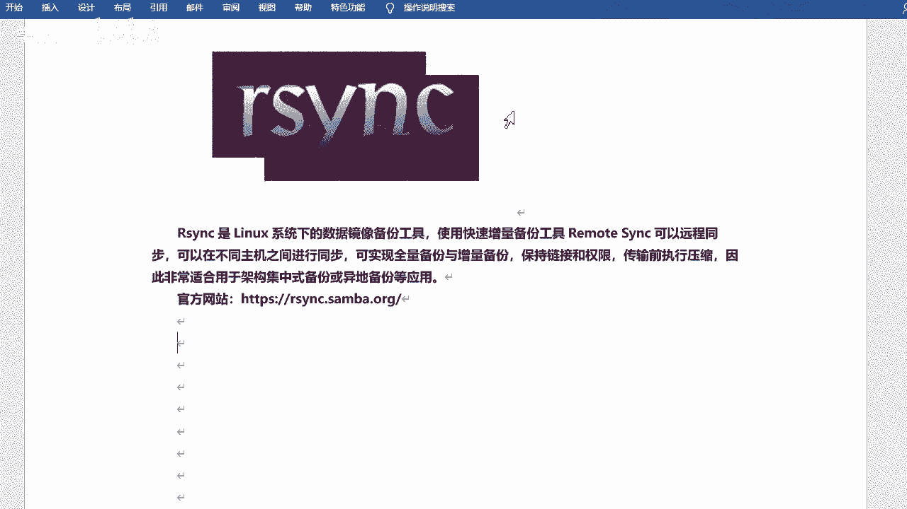

## 什么是rsync？🤔


rsync是Linux系统下的一个数据镜像备份工具，它是一个快速的增量备份工具。其全称是remote sync，意为远程同步。它可以在不同主机之间进行数据同步，支持全量备份和增量备份，并且能够保持文件的链接、权限、时间等属性。在传输过程中，rsync可以进行压缩，因此非常适合用于架构备份或异地备份等应用场景。

**核心概念**：`rsync` 是一个用于同步和备份的命令行工具。

---

## rsync的特点与优势 ⚡

上一节我们介绍了rsync的基本概念，本节中我们来看看它具体有哪些特点和优势。

rsync具有以下主要特点：
*   它可以镜像保存整个目录树和文件系统。
*   能够保持文件的原有属性，如权限、时间、软硬链接等。
*   安装简单，无需特殊权限。
*   采用增量备份方式，第一次同步会复制全部内容，后续只传输修改过的文件，效率高。
*   支持在传输过程中进行压缩，节省带宽。
*   可以通过SSH等安全协议进行传输。

与简单的`scp`命令相比，rsync更加专业。`scp`类似于Windows的复制，主要用于文件传输，而rsync在复制过程中可以进行比较和统计，是专门为同步和备份设计的工具。

---

## rsync的备份模式 🔄

rsync支持增量备份模式。为了更好地理解，我们先了解几种常见的备份方式：

以下是几种备份方式的对比：
*   **完全备份**：每次备份都会备份所有的数据。
*   **差异备份**：每次备份时，都会与第一次完全备份的数据进行比较，备份有差异的部分。
*   **增量备份**：除第一次完全备份外，每次只备份相对于上一次备份后新增或修改的数据。

rsync采用的就是**增量备份**的方式。它通过对比源端和目标端文件的修改时间、大小等信息，只同步发生变化的部分，这大大提高了备份效率，节省了时间和网络资源。

---

## rsync的工作模式与概念 🏗️

rsync支持两种工作模式：本地同步和通过远程shell（如SSH）同步。当涉及远程同步时，会涉及到“推”和“拉”两种数据流向，这也引出了不同的角色称呼。

为了清晰理解，我们以数据为参照物：
*   **源端**：存放原始数据的机器。
*   **目标端**：接收备份数据的机器。

根据同步方向的不同，操作方式分为：
*   **拉取**：目标端主动从源端获取数据。
*   **推送**：源端主动将数据发送到目标端。

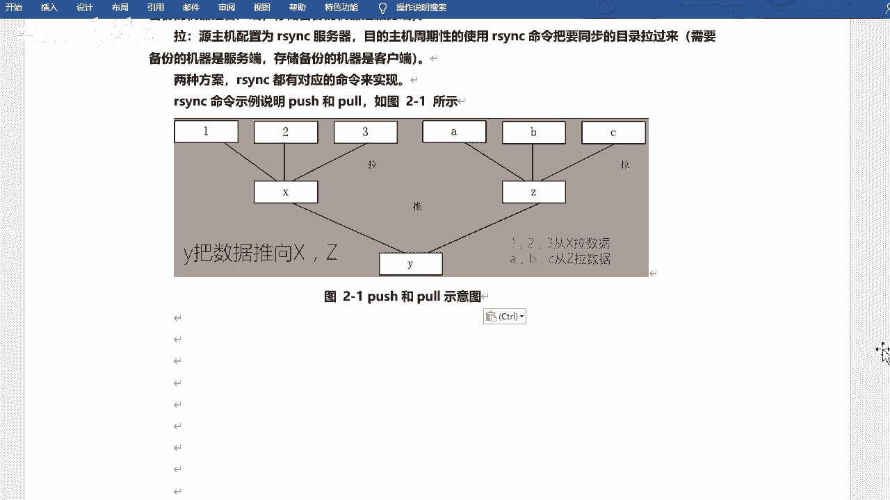

在早期的Linux系统中，rsync服务由`xinetd`管理。但在现代系统中，rsync可以独立运行，我们直接安装和使用rsync软件包即可。

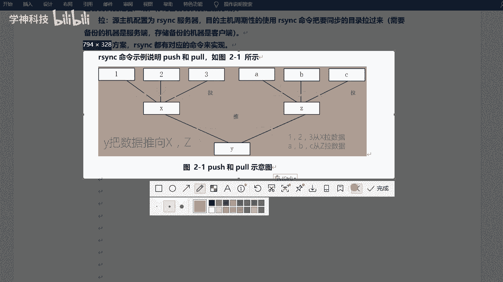

---

## 安装与基本命令使用 🛠️

大多数Linux系统默认已经安装了rsync。我们可以通过以下命令检查：

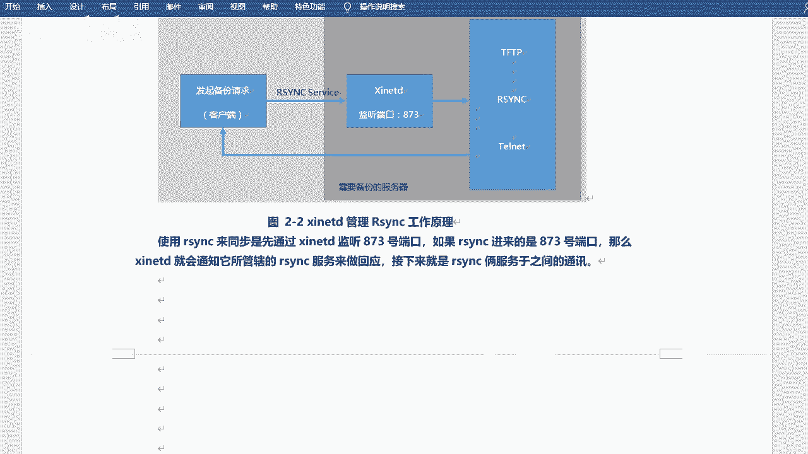

```bash
rpm -qa | grep rsync
```

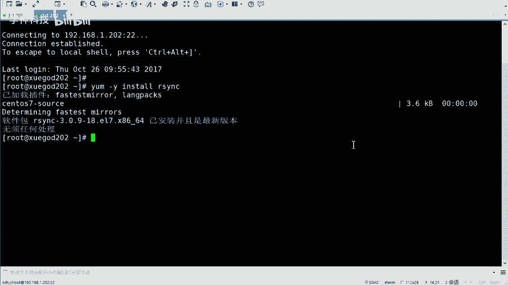

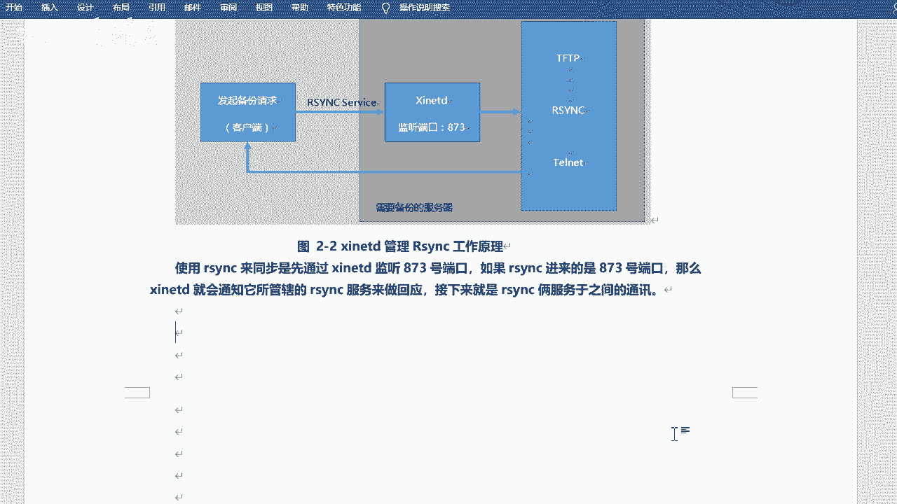

如果未安装，可以使用包管理器进行安装，例如在CentOS/RHEL上：
```bash
yum install -y rsync
```


rsync命令的基本语法结构如下：
```bash
rsync [选项] 源路径 目标路径
```

---

## rsync常用选项解析 📝

rsync的选项很多，但对于初学者，记住几个关键组合即可应对大部分场景。

以下是几个最常用和重要的选项：
*   **-a**：归档模式，相当于 `-rlptgoD`。这是最常用的选项，它保持文件所有属性并递归同步。
*   **-v**：详细模式，输出同步过程中的详细信息。
*   **-z**：在传输过程中进行压缩。
*   **--delete**：删除目标端有而源端没有的文件，确保两端完全一致。


**核心组合**：`-avz` 这个组合集成了归档、详细输出和压缩功能，非常实用。

`--delete` 选项需要特别注意。例如，源端目录删除了一个文件，如果不加此选项，目标端对应的文件会保留；如果加上此选项，同步后目标端的那个文件也会被删除，从而实现两端目录的严格一致。

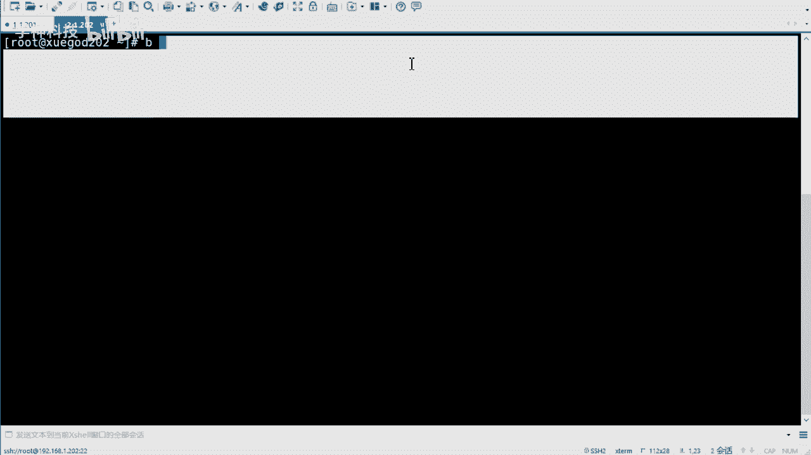

---

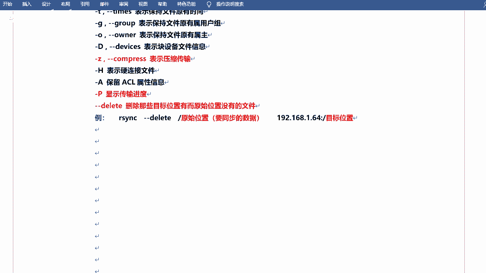

## 实战：同步单个目录 🚀

现在，让我们通过一个实际例子来巩固所学知识。我们将使用两台机器：`192.168.1.101`（源端）和 `192.168.1.202`（目标端）。

**操作步骤**：
1.  在源端准备一个包含数据的目录，例如 `/var/www/html`。
2.  在目标端，我们打算将数据同步到 `/backup` 目录。
3.  在目标端执行同步命令，将源端的数据“拉取”过来。

**执行命令**：
在目标端机器上执行以下命令：
```bash
rsync -avz --delete root@192.168.1.101:/var/www/html/ /backup/
```
*   系统会提示输入源端机器（101）的root密码。
*   如果目标端的 `/backup` 目录不存在，rsync会自动创建它。
*   命令执行后，会显示详细的传输进度和文件列表。

**命令解析**：
*   `-avz`：使用归档模式、显示详情、启用压缩。
*   `--delete`：使目标目录与源目录内容严格一致。
*   `root@192.168.1.101:/var/www/html/`：源路径，指定了用户名、主机IP和目录。
*   `/backup/`：目标路径。

> **注意**：路径末尾的 `/` 有重要含义。`/var/www/html/` 表示同步该目录下的所有内容；而 `/var/www/html`（不带斜杠）则表示同步整个目录本身。在备份时，通常使用带斜杠的写法。

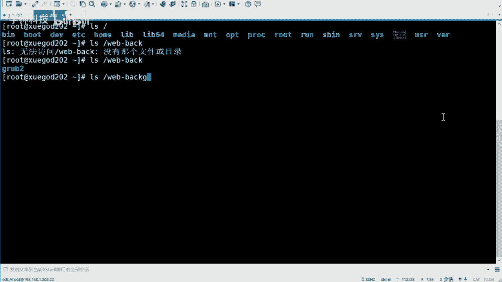

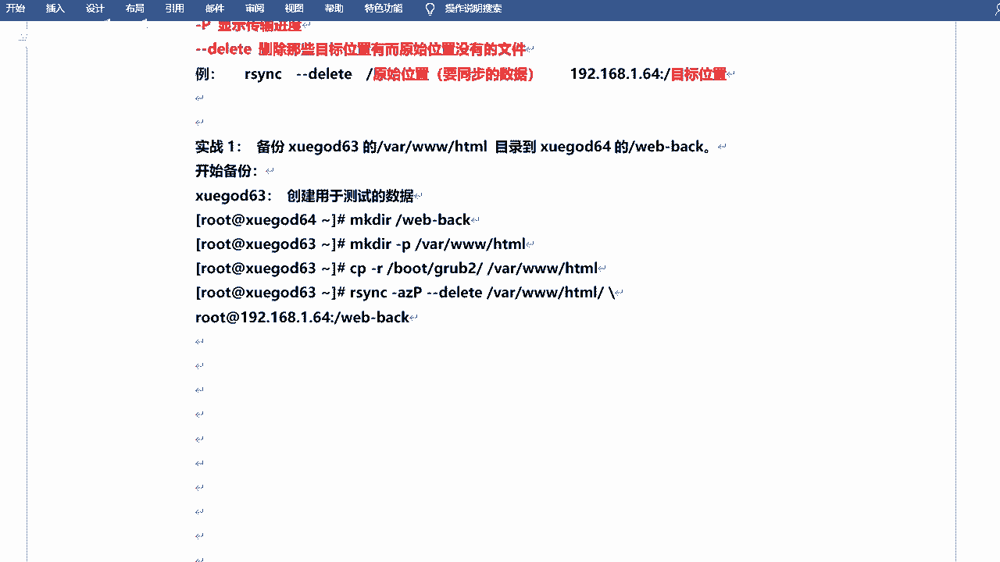

---

## 总结 📚

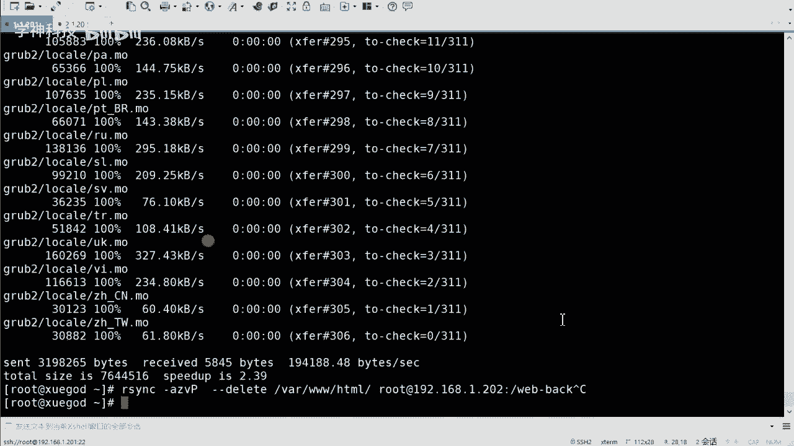

本节课中我们一起学习了Linux下的强大同步工具rsync。我们从rsync的定义和优势讲起，了解了其增量备份的工作原理，区分了“推”和“拉”两种同步模式。接着，我们学习了rsync的基本命令格式和关键选项，特别是 `-avz --delete` 这个实用组合。最后，通过一个实战示例，我们完成了从一台机器到另一台机器的目录同步。

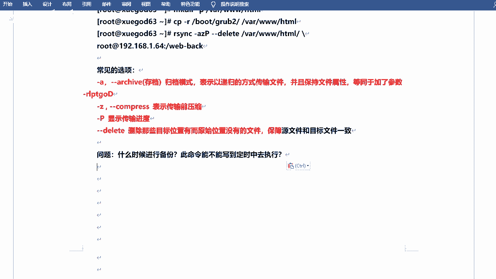

掌握rsync的手动命令是基础，它为后续学习如何配置rsync守护进程服务以及实现定时自动同步打下了坚实的基础。