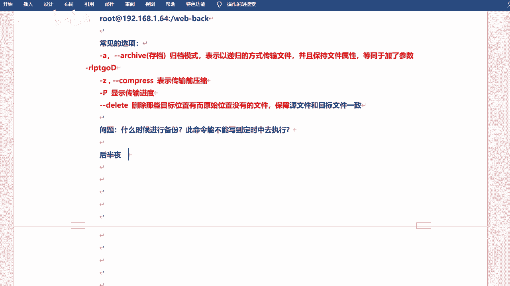
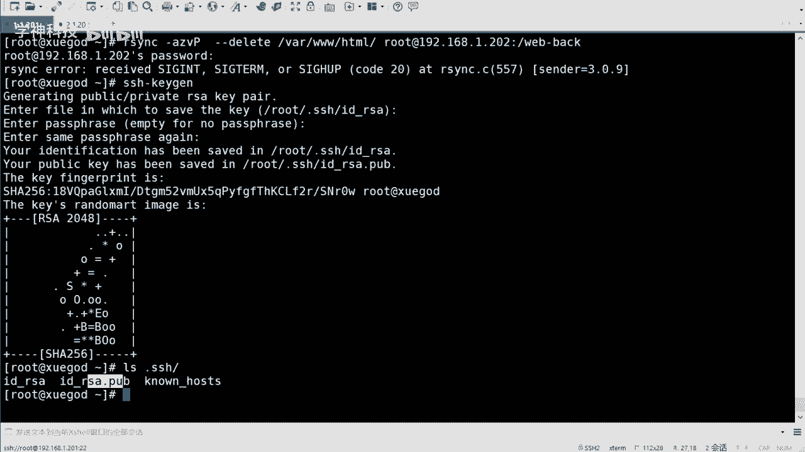
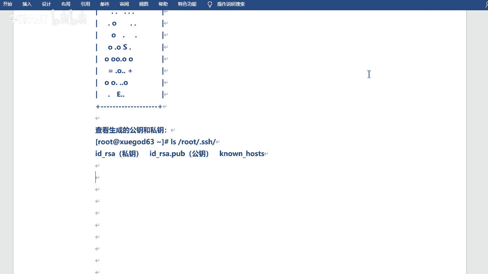
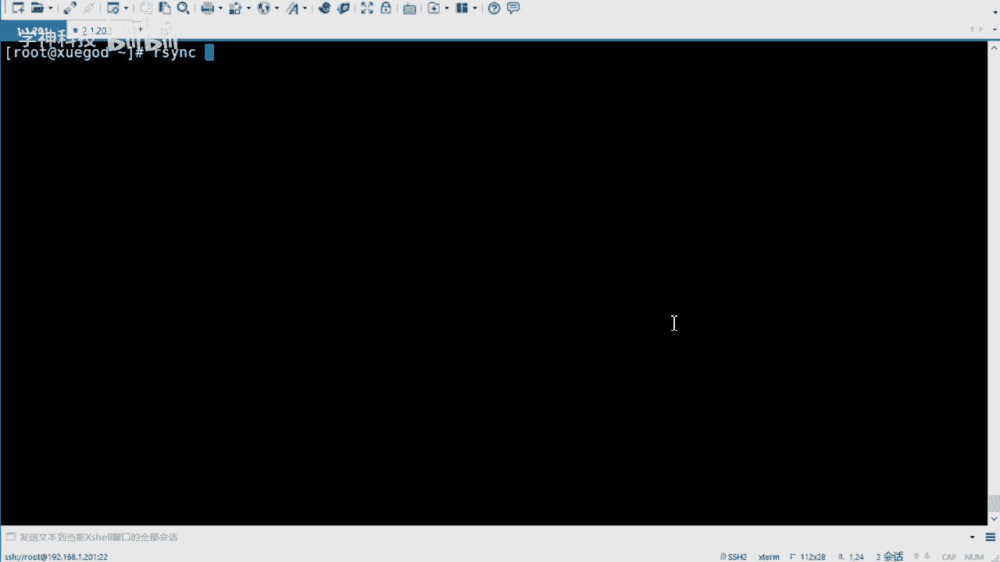
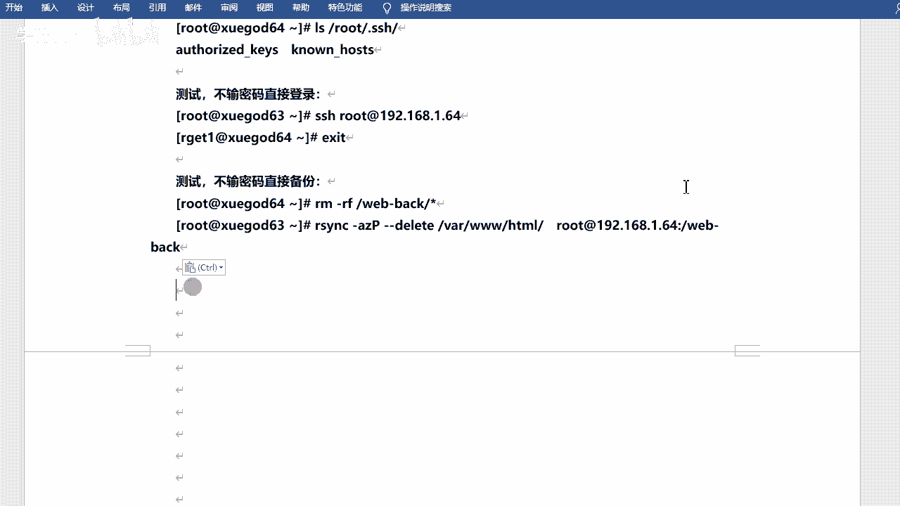
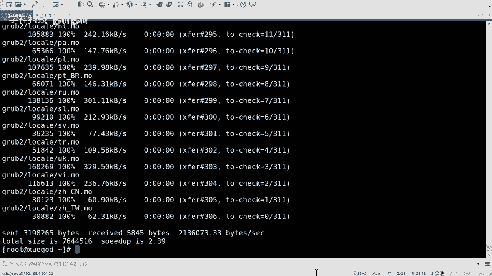
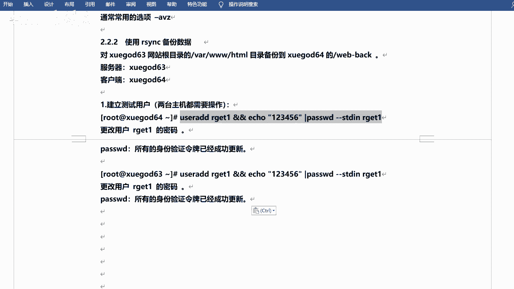

# 红帽认证课程：P6：无密码同步与保持文件权限




在本节课中，我们将学习如何实现Rsync的无密码自动同步，以及如何在同步过程中保持文件的原始权限。这对于在业务低峰期（如凌晨）进行自动化备份至关重要，可以避免手动干预并确保数据一致性。

## 无密码同步的必要性




上一节我们介绍了Rsync的基本用法。本节中我们来看看如何实现自动化。在业务闲时（如后半夜）进行同步是常见做法，因为同步大量数据会占用带宽和系统资源，可能影响正常业务。然而，如果每次同步都需要手动输入密码，则无法实现真正的自动化。



因此，我们需要一种方法，让Rsync能够无需人工输入密码即可自动完成同步任务。





## 实现无密码登录：SSH密钥对

实现无密码同步的核心在于SSH协议。Rsync基于SSH协议传输数据，而SSH支持两种认证方式：密码认证和密钥认证。如果我们配置了密钥认证，就可以实现无密码登录，进而实现无密码的文件同步。



以下是配置SSH密钥对并实现无密码Rsync同步的步骤：

1.  **在源主机生成密钥对**
    使用 `ssh-keygen` 命令生成密钥对。执行后按回车接受默认设置即可。
    ```bash
    ssh-keygen
    ```
    此命令会在 `~/.ssh/` 目录下生成两个文件：私钥 `id_rsa` 和公钥 `id_rsa.pub`。


2.  **将公钥传输到目标主机**
    我们需要将公钥发送到希望无密码登录的目标主机。可以使用 `ssh-copy-id` 命令。
    ```bash
    ssh-copy-id root@192.168.1.202
    ```
    首次传输时，仍需输入目标主机的密码。


3.  **测试无密码登录与同步**
    配置完成后，首先测试SSH无密码登录是否成功。
    ```bash
    ssh root@192.168.1.202
    ```
    登录成功后，即可使用Rsync进行无密码同步。
    ```bash
    rsync -avz /var/www/html/ root@192.168.1.202:/web_back/
    ```

**操作技巧**：使用 `Ctrl + R` 快捷键可以搜索历史命令，快速找到并执行之前输入过的长命令（如带有一串参数的rsync命令）。

## 以服务方式运行及权限保持

除了使用命令行，Rsync也可以以守护进程（服务）方式运行，这常用于更复杂的备份架构。同时，在同步时保持文件的原始属性（如所有者、权限）非常重要。

以下是配置Rsync服务并保持文件权限的步骤：



1.  **基础环境准备**
    确保源主机和目标主机的SELinux和防火墙已关闭，避免影响服务。
    ```bash
    setenforce 0
    systemctl stop firewalld
    ```

2.  **安装并启动Rsync服务**
    在两台主机上安装rsync包，并在作为“服务端”的主机上启动rsyncd服务。
    ```bash
    yum install -y rsync
    systemctl start rsyncd
    systemctl enable rsyncd
    ss -ntl | grep 873  # 检查873端口是否监听
    ```
    *注意：在RHEL/CentOS 6或8上，可能需要额外安装并配置 `xinetd` 服务来管理rsync。*


3.  **创建专用同步用户并设置权限**
    为了安全和管理方便，可以创建一个专门用于同步的用户，并为其设置目录权限。
    ```bash
    useradd rget
    echo “123456” | passwd --stdin rget
    ```
    修改待同步目录的所有者和默认ACL，确保 `rget` 用户有权限访问。
    ```bash
    setfacl -R -m u:rget:rwx /var/www/html/
    setfacl -R -d -m u:rget:rwx /var/www/html/
    ```


4.  **使用专用用户进行同步并保持属性**
    现在，可以使用 `rget` 用户进行同步。`-a` 参数包含了 `-p`、`-o`、`-g` 等选项，可以保留文件的权限、所有者和组信息。
    ```bash
    rsync -avz /var/www/html/ rget@192.168.1.202:/web_back/
    ```
    同步后，检查目标主机上的文件，其所有者和权限应与源主机保持一致。

## 总结


本节课中我们一起学习了两个关键的Rsync进阶技能。首先，我们通过配置SSH密钥对，实现了Rsync的无密码自动化同步，为定时备份任务铺平了道路。其次，我们探讨了以服务方式运行Rsync，并通过创建专用用户和设置ACL权限，确保了在同步过程中文件的所有者及权限属性得以完整保留。掌握这些技能，你将能够构建更可靠、更自动化的数据备份方案。