# Linux系统管理：P7：以服务形式运行rsync及推拉模式详解 🚀


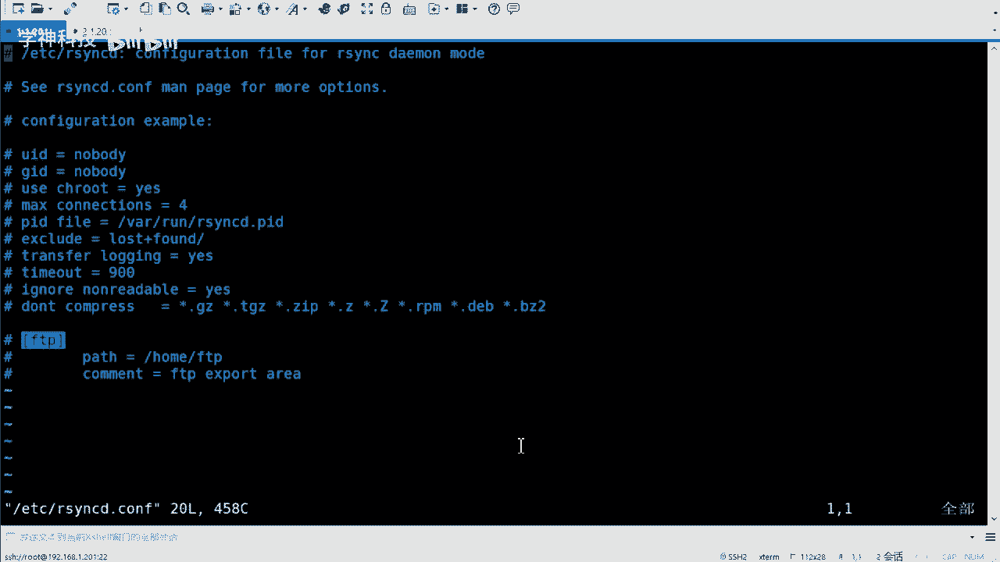

在本节课中，我们将学习如何将rsync配置为系统服务（守护进程模式）运行，并掌握其“推送”和“拉取”两种数据同步模式。通过服务化配置，我们可以实现更安全、更灵活的自动化备份。

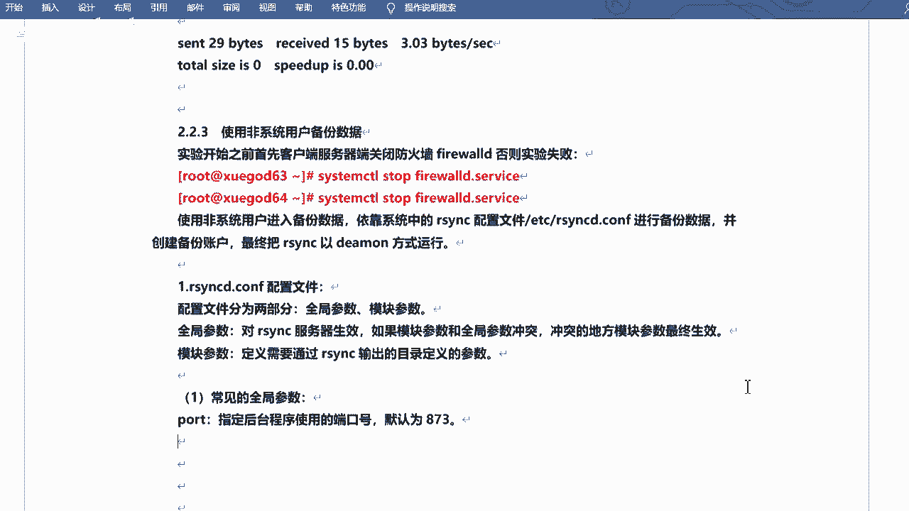


---


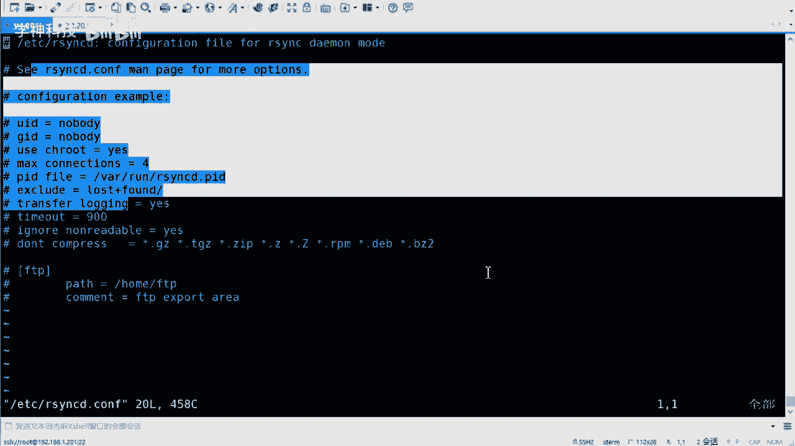

## 全局配置与模块参数 📝

上一节我们介绍了rsync的基本命令，本节中我们来看看其服务形式的配置文件。rsync的守护进程配置文件通常为 `/etc/rsyncd.conf`，其内容主要分为两个部分：**全局配置**和**模块参数**。

全局配置对整个rsync服务生效，而模块参数则定义了具体的共享目录及其访问规则。如果两者配置冲突，将以模块参数为准。

以下是配置文件的核心结构示例：
```ini
# 全局配置部分
uid = root
gid = root
address = 192.168.1.202
port = 873
hosts allow = 192.168.1.0/24
use chroot = yes
max connections = 5
pid file = /var/run/rsyncd.pid
lock file = /var/run/rsyncd.lock
log file = /var/log/rsyncd.log
motd file = /etc/rsyncd.motd

# 模块参数部分
[wwwroot]
    path = /web_backup
    comment = A backup for wwwroot
    read only = false
    list = yes
    auth users = rsyncuser
    secrets file = /etc/rsyncd.passwd
```

---

## 关键配置参数解析 ⚙️

配置文件中有许多参数，理解其含义对正确配置至关重要。以下是几个需要重点关注的参数说明：

*   **`uid` / `gid`**：指定rsync守护进程运行时使用的用户和组身份。
*   **`hosts allow`**：定义允许访问此rsync服务的客户端IP地址或网段，例如 `192.168.1.0/24`。
*   **`auth users`**：指定用于身份验证的用户名。**注意**：此用户无需是系统真实用户。
*   **`secrets file`**：指定存储用户名和密码的文件路径。该文件权限**必须**设置为 `600`，即仅root用户可读写，以确保密码安全。
*   **`read only`**：定义模块是否为只读。若为 `true`，客户端将无法上传文件。
*   **`list`**：控制当客户端请求模块列表时，是否显示此模块。

---

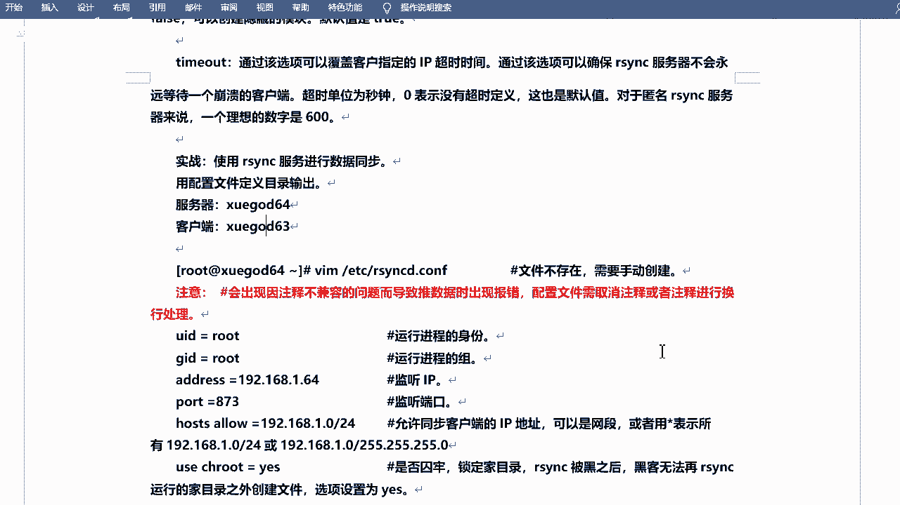

## 服务配置实战演练 🛠️

理解了参数后，我们开始动手配置。请严格按照步骤操作，并注意手动输入配置，避免复制可能带来的格式错误。

**第一步：编辑配置文件**
使用 `vi /etc/rsyncd.conf` 命令，根据上述示例编写你自己的配置文件。请根据你的网络环境修改IP地址和目录路径。

**第二步：创建认证密码文件**
创建密码文件并设置严格的权限：
```bash
echo “rsyncuser:password123” > /etc/rsyncd.passwd
chmod 600 /etc/rsyncd.passwd
```
请将 `password123` 替换为你自己的强密码。


**第三步：创建备份目录及欢迎文件**
```bash
mkdir -p /web_backup
echo “Welcome to backup server” > /etc/rsyncd.motd
```

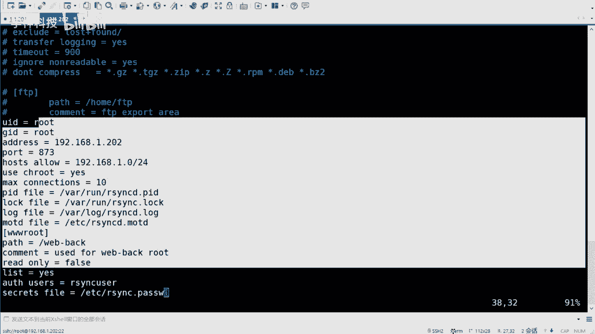

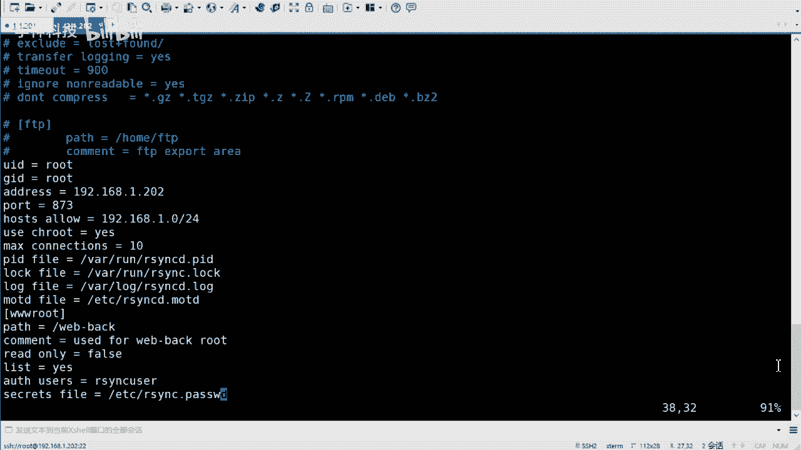


**第四步：启动rsync守护进程**
```bash
systemctl start rsyncd
systemctl enable rsyncd
```
使用 `netstat -antp | grep 873` 命令检查服务是否正常启动并监听873端口。

---

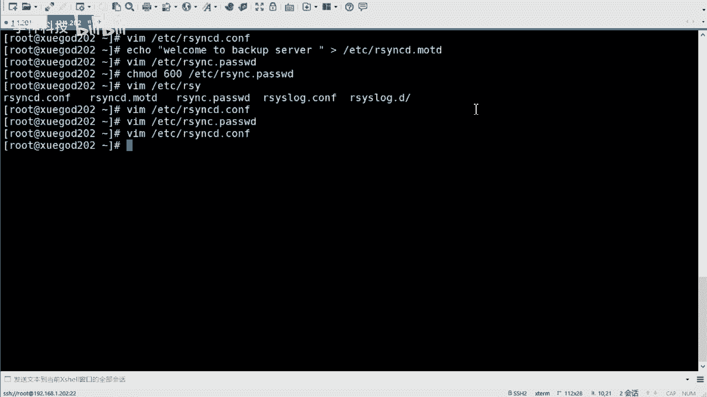

## 推拉模式数据同步测试 🔄

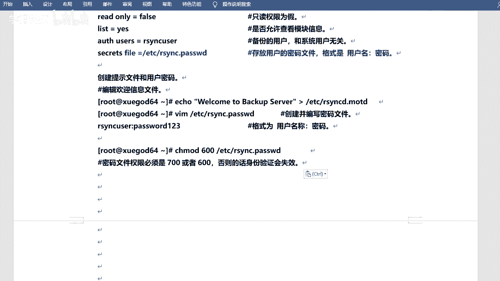

服务配置完成后，我们可以在客户端机器上进行同步测试。rsync支持两种模式：**推送（Push）** 和 **拉取（Pull）**。


**推送模式测试**
将本地目录 `/opt/data` 下的文件推送到远程rsync服务器的 `wwwroot` 模块：
```bash
rsync -avz /opt/data/ rsyncuser@192.168.1.202::wwwroot
```
系统会提示输入密码。为简化操作，可以在客户端创建一个仅包含密码的文件（如 `/etc/rsync_client.pass`，权限设为600），然后使用 `--password-file` 参数：
```bash
rsync -avz /opt/data/ rsyncuser@192.168.1.202::wwwroot --password-file=/etc/rsync_client.pass
```

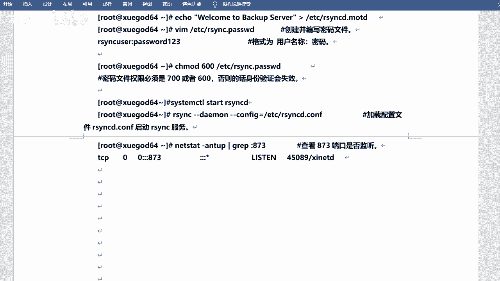

**拉取模式测试**
将远程rsync服务器 `wwwroot` 模块的文件拉取到本地 `/opt/backup` 目录：
```bash
rsync -avz rsyncuser@192.168.1.202::wwwroot /opt/backup --password-file=/etc/rsync_client.pass
```
通过调换命令中的源路径和目标路径，可以轻松在推、拉模式间切换。

---

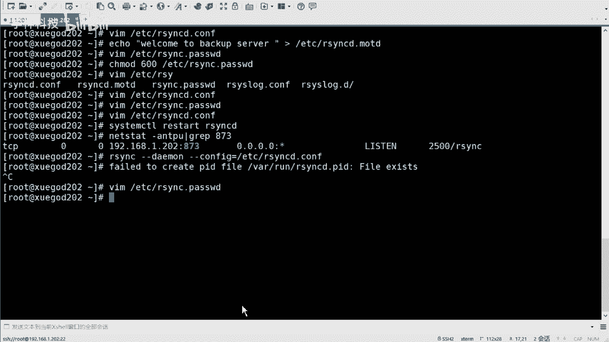

## 实现自动化备份 📅


将rsync配置为服务并测试成功后，我们可以结合脚本和计划任务实现自动化备份。

1.  **编写备份脚本**：将上述带 `--password-file` 的rsync命令写入一个Shell脚本（如 `/root/backup.sh`）。
2.  **赋予脚本执行权限**：`chmod +x /root/backup.sh`。
3.  **配置计划任务**：使用 `crontab -e` 编辑定时任务，例如，设置每天凌晨3点执行备份：
    ```bash
    0 3 * * * /bin/bash /root/backup.sh
    ```


---

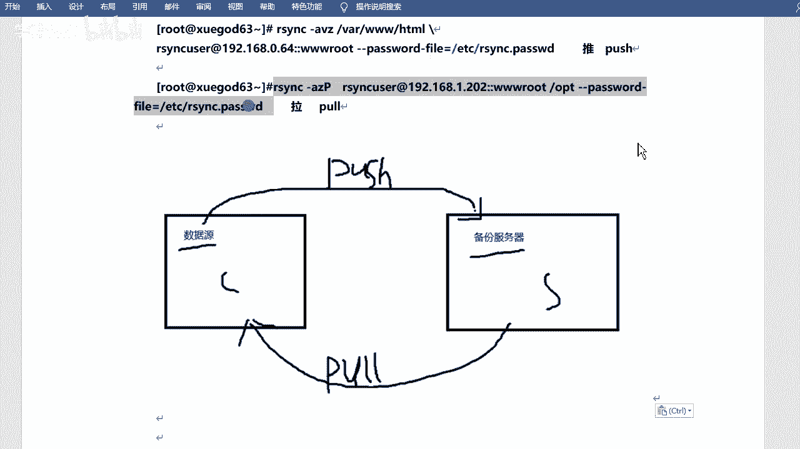

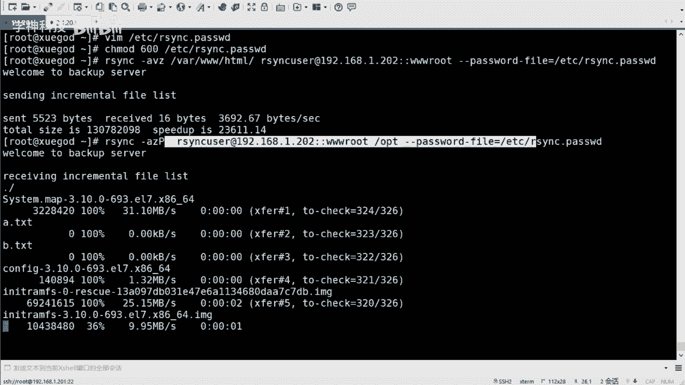

## 课程总结 🎯

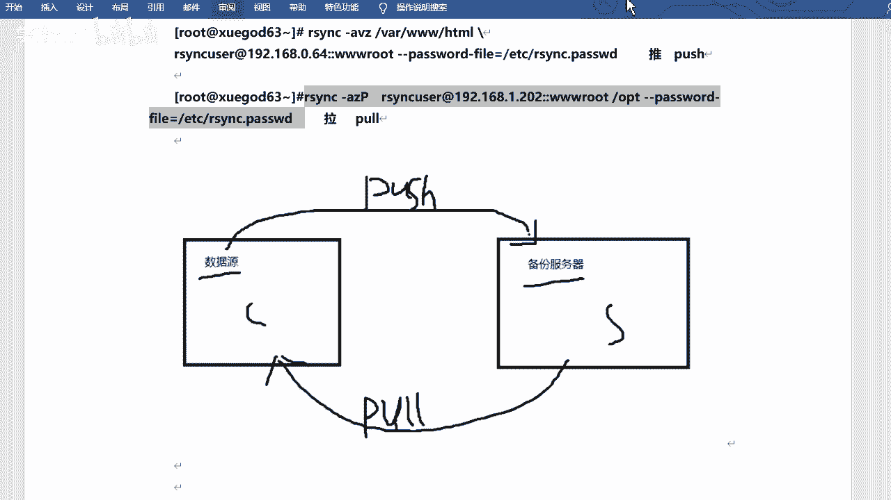

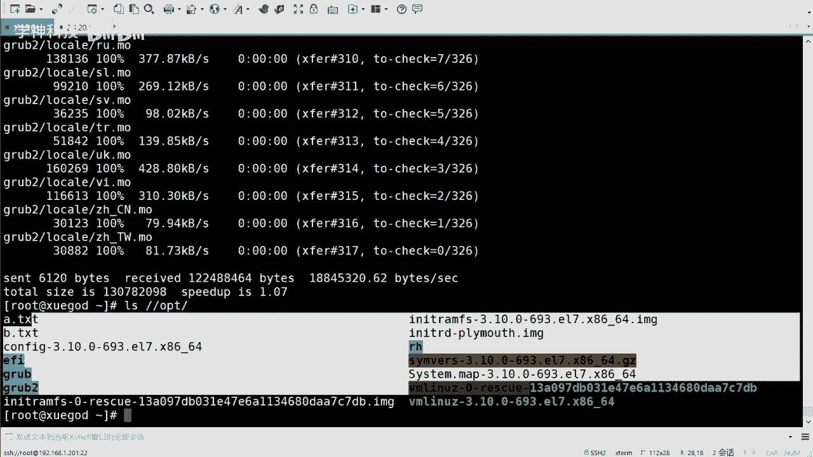

本节课中我们一起学习了：
1.  **rsync服务化配置**：了解了 `/etc/rsyncd.conf` 配置文件的全局与模块参数结构，并掌握了关键参数如 `auth users` 和 `secrets file` 的配置方法。
2.  **服务部署流程**：完成了从编辑配置文件、创建密码文件到启动守护进程的全过程。
3.  **推拉同步模式**：实践了使用 `rsync` 命令进行数据推送和拉取，并学会了使用 `--password-file` 参数实现非交互式认证。
4.  **自动化整合**：了解了如何将配置好的rsync服务与Shell脚本、Cron计划任务结合，实现定时自动备份。


通过本课的学习，你已经掌握了在企业环境中部署和使用rsync守护进程进行可靠、自动化数据同步的核心技能。