# 红帽认证教程：P8：sersync+rsync触发式同步 🔄


在本节课中，我们将学习如何实现触发式文件同步。我们将使用 `sersync` 工具结合 `rsync` 服务，实现当源目录文件发生变化时，自动将变化同步到远程服务器，从而替代需要手动或定时执行的同步方式。

---


## 触发式同步原理

上一节我们介绍了基本的 `rsync` 同步。本节中我们来看看如何实现更智能的同步。

我们通常所说的“实时同步”并非指每秒都在同步，这没有必要且消耗资源。更准确的说法是“触发式同步”。

触发式同步是指：仅当被监控的源目录内容发生**增、删、改**等变更操作时，才触发同步任务。如果目录内容没有变化，则无需同步。这样可以极大地提高效率并节省系统资源。

为了实现监控和触发，我们需要一个工具。过去常用 `inotify` 工具，但它不够稳定且配置复杂。现在，我们将使用一个更优的工具：`sersync`。

以下是 `inotify` 与 `sersync` 的核心对比：

*   **inotify**：仅能监控到目录发生了变化，但无法记录是哪个具体文件发生了变化。因此同步时可能需要比对整个目录，效率较低。
*   **sersync**：能够监控并记录具体是哪个文件或目录发生了变化。然后调用 `rsync` **只同步发生变化的文件**，因此效率更高、更稳定。

其工作流程简述如下：
1.  在存放源文件的服务器（主服务器）上配置 `sersync` 服务，用于监控指定目录。
2.  在远程备份服务器上开启 `rsync` 守护进程，提供同步接口。
3.  当主服务器的被监控目录发生变更时，`sersync` 会立即调用 `rsync` 命令，将变更的文件同步到远程服务器。

---

## 配置sersync实现触发同步


接下来，我们开始配置 `sersync`。首先需要准备好 `rsync` 服务端（备份服务器）的配置，这是 `sersync` 工作的前提。

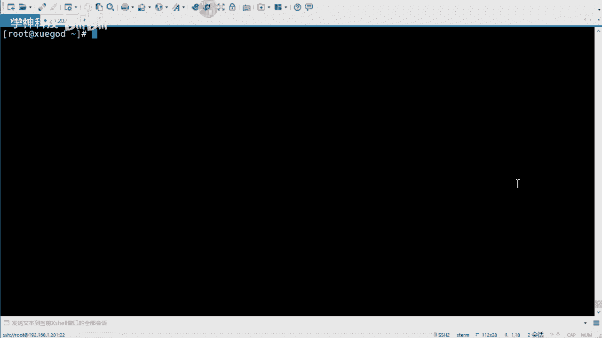

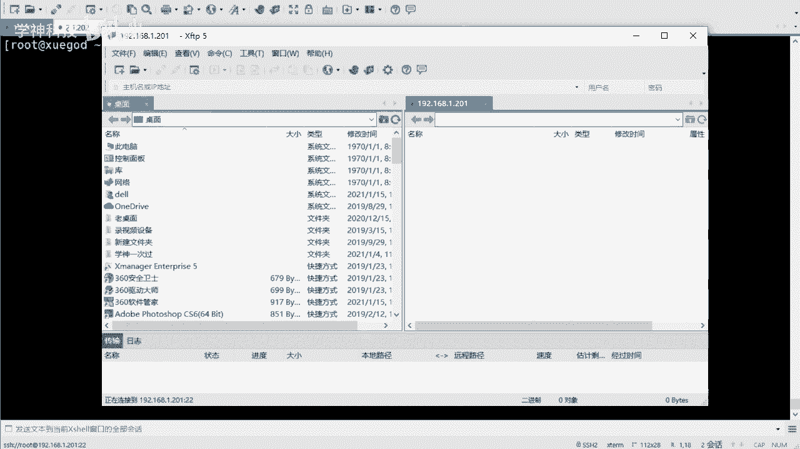

### 部署sersync软件


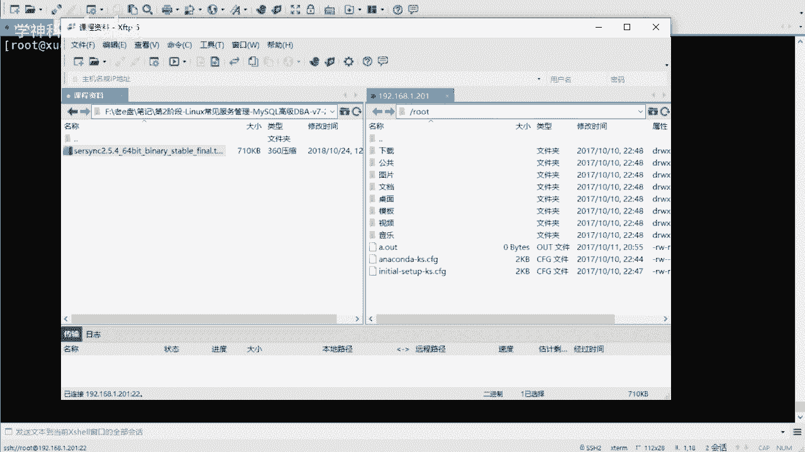

`sersync` 工具是一个由国内开发者编写的开源软件，我们直接使用编译好的二进制文件即可，无需复杂安装。

以下是部署步骤：


1.  将 `sersync` 压缩包上传至主服务器（例如 `/opt` 目录）。
2.  解压并重命名目录，使其更直观。
    ```bash
    cd /opt
    tar -zxvf sersync2.5.4_64bit_binary_stable_final.tar.gz
    mv GNU-Linux-x86/ sersync
    cd sersync
    ```
3.  进入目录后，你会看到两个主要文件：可执行程序 `sersync2` 和配置文件 `confxml.xml`。

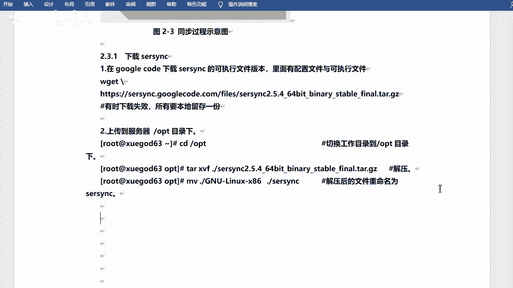

### 修改sersync配置文件

在修改配置前，建议先备份原始配置文件。

以下是需要修改的核心配置项（在 `confxml.xml` 文件中）：

```xml
<!-- 第24行左右：定义本地要监控的目录路径 -->
<localpath watch="/var/www/html">
    <!-- 第31行左右：定义远程同步目标信息 -->
    <remote ip="192.168.1.202" name="wwwroot"/>
    <!--
        ip: 备份服务器的IP地址
        name: 备份服务器rsync配置文件中定义的模块名（不是用户名）
    -->
</localpath>

<!-- 第36行左右：配置rsync认证信息 -->
<rsync>
    <commonParams params="-artuz"/>
    <!-- 第39行左右：设置用户认证 -->
    <auth start="true" users="rsyncuser" passwordfile="/etc/rsync.password"/>
    <!--
        start: 启用认证（true）
        users: rsync服务指定的同步用户
        passwordfile: 存放对应用户密码的文件路径
    -->
    <!-- 第44行左右：设置失败重试和并发连接数 -->
    <failLog path="/tmp/rsync_fail_log.sh" timeToExecute="60"/>
    <timeout start="false" time="100"/>
    <ssh start="false"/>
</rsync>
```

**关键点说明**：
*   `watch`：必须设置为需要监控同步的源目录绝对路径。
*   `name`：必须与备份服务器上 `rsyncd.conf` 配置文件中 `[module]` 的名称完全一致。
*   `users` 和 `passwordfile`：必须与 `rsync` 服务端配置的认证信息匹配。

### 启动sersync服务

配置完成后，使用以下命令启动 `sersync`：

```bash
cd /opt/sersync
./sersync2 -d -r -o confxml.xml
```


**参数解释**：
*   `-d`：以守护进程（daemon）模式在后端运行。
*   `-r`：在启动监控前，先全量同步一次本地目录到远程。确保初始状态一致。
*   `-o`：指定使用的配置文件。

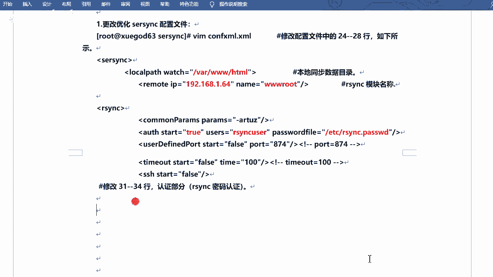

启动后，你可以尝试在监控目录（如 `/var/www/html`）中创建、修改或删除文件，观察备份服务器上是否会立即出现相应的变化。

---

## 服务管理与监控 🔍

为了保证 `sersync` 服务的可靠性和持续性，我们需要将其设置为开机自启，并建立简单的监控机制。

### 设置开机自启

我们可以将启动命令加入到系统启动脚本中。

1.  编辑 `/etc/rc.d/rc.local` 文件。
    ```bash
    vim /etc/rc.d/rc.local
    ```
2.  在文件末尾添加 `sersync` 的启动命令。
    ```bash
    /opt/sersync/sersync2 -d -r -o /opt/sersync/confxml.xml
    ```
3.  给 `rc.local` 文件添加执行权限。
    ```bash
    chmod +x /etc/rc.d/rc.local
    ```

### 编写监控脚本

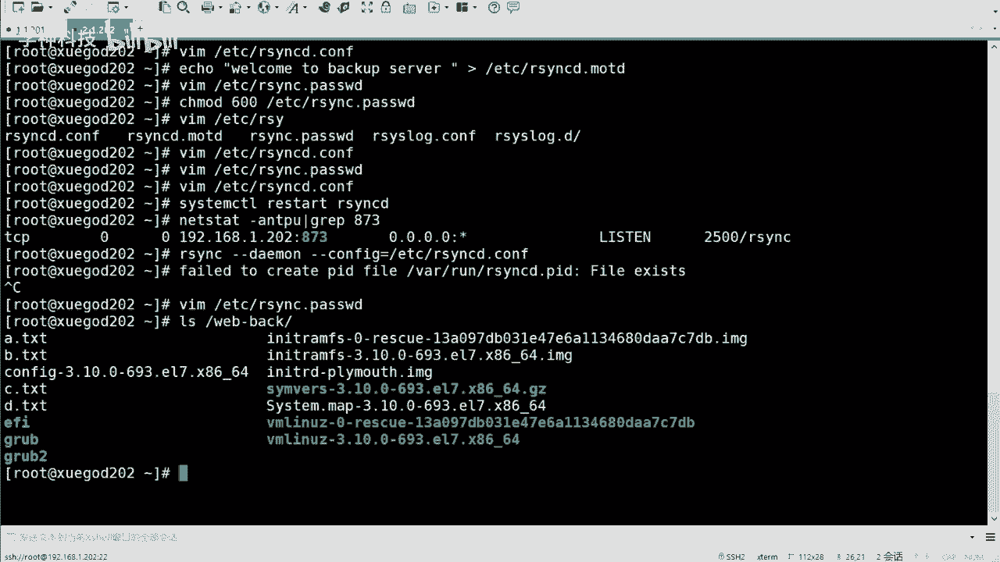

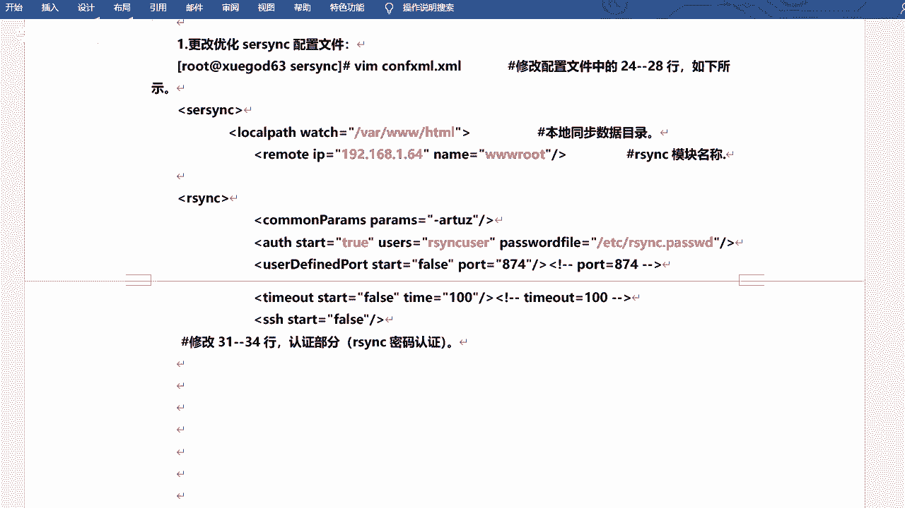

由于服务可能因异常原因退出，我们需要一个监控脚本来定期检查 `sersync` 进程是否存活，如果停止则自动重启。

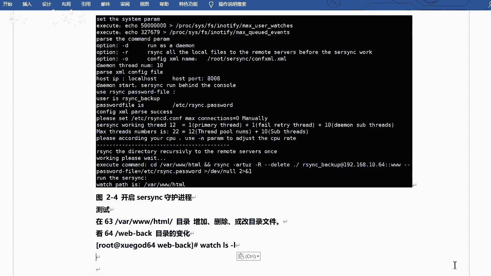

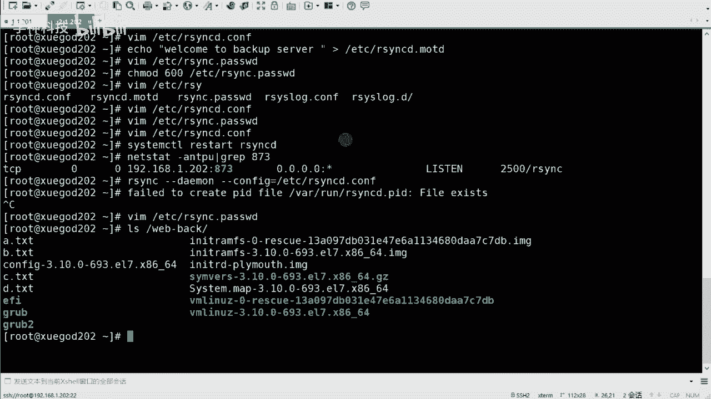

以下是一个简单的监控脚本示例 `check_sersync.sh`：


```bash
#!/bin/bash
# 检查sersync进程是否运行
sersync_path="/opt/sersync/sersync2"
conf_path="/opt/sersync/confxml.xml"

# 使用ps命令检查进程中是否存在sersync2
count=$(ps -ef | grep "$sersync_path" | grep -v grep | wc -l)

if [ $count -eq 0 ]; then
    # 如果进程数为0，说明服务未运行，则启动它
    $sersync_path -d -r -o $conf_path
    echo "$(date)： sersync 服务已重启" >> /var/log/sersync_monitor.log
fi
```

**脚本逻辑**：
1.  使用 `ps` 和 `grep` 命令检查 `sersync2` 进程是否存在。
2.  如果进程数 (`count`) 为 0，则执行启动命令。
3.  将重启记录追加到日志文件中，便于追溯。

### 配置定时任务

最后，我们使用 `crontab` 设置定时任务，让系统每分钟执行一次上述监控脚本。

1.  打开当前用户的定时任务编辑器。
    ```bash
    crontab -e
    ```
2.  添加以下一行配置，表示每分钟执行一次监控脚本。
    ```bash
    * * * * * /bin/bash /path/to/your/check_sersync.sh > /dev/null 2>&1
    ```
    请将 `/path/to/your/check_sersync.sh` 替换为你脚本的实际存放路径。

通过以上步骤，我们实现了对 `sersync` 服务的双重保障：开机自启和进程存活监控，大大提高了同步任务的可靠性。

---

## 总结 📝

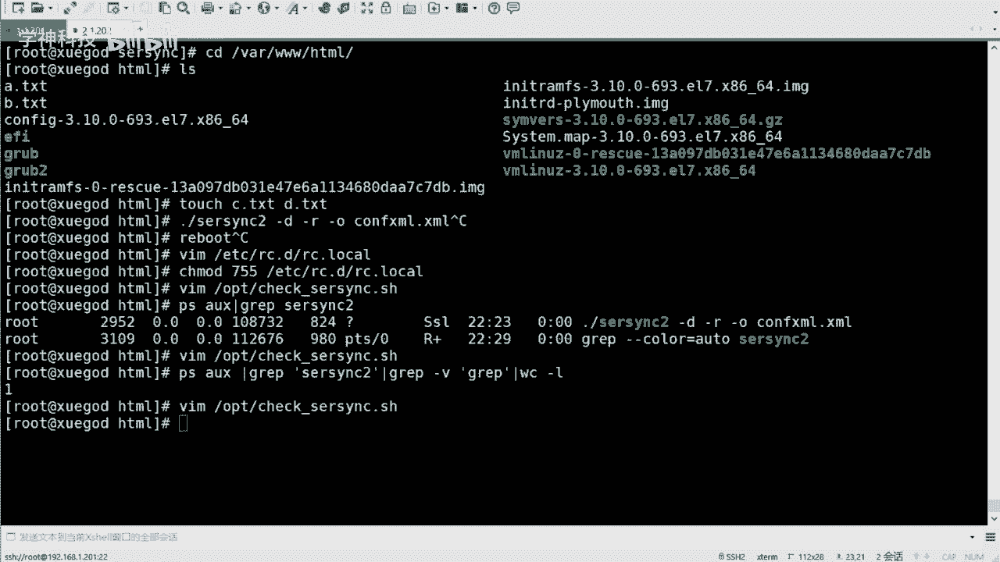

本节课中我们一起学习了如何配置 `sersync` 实现触发式文件同步。

我们首先理解了触发式同步相较于“实时”同步或定时同步的优势。然后，我们逐步完成了 `sersync` 的部署、核心配置文件的修改，并启动了同步服务。最后，为了确保服务的持续稳定运行，我们设置了开机自启，并编写了监控脚本结合定时任务来守护进程。

关键点回顾：
1.  **触发式同步**：仅在文件变更时同步，高效节能。
2.  **sersync**：是一个监控目录变化并调用 `rsync` 进行增量同步的高效工具。
3.  **配置核心**：正确设置监控目录 (`localpath`)、远程模块名 (`name`) 和 `rsync` 认证信息。
4.  **服务保障**：通过开机自启和定时监控脚本，确保同步服务持续在线。

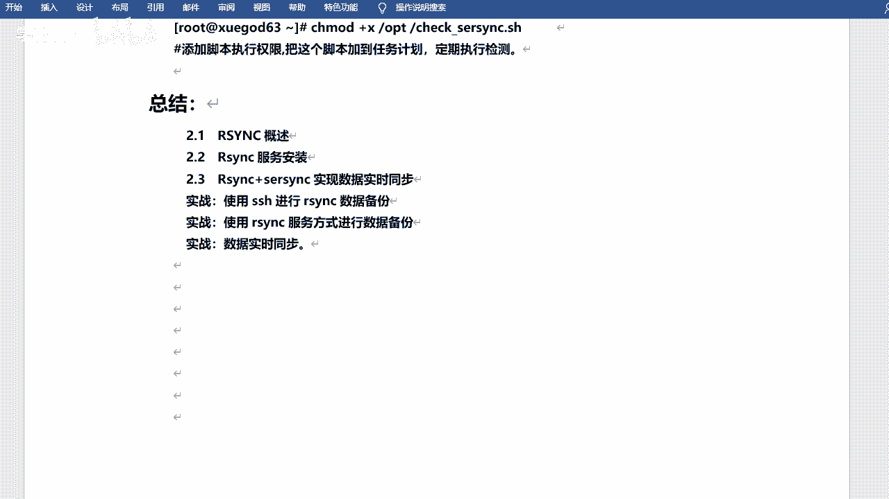

建议课后多动手实践，熟练配置流程，并尝试理解每个参数的作用。