# 2021年RHCE／RHCA／RHCSA／红帽最新教程 - P10：指定用户对ftp有读写权限 - 学神科技 - BV1Wi4y1K7g1

嗯，这样的话就可以了是吧？但是这个权限比较大，好吧。😊，看一下啊。这样的话可以删除，当然也可以改名字是吧？但这个参数呢对于匿名用户来说比较大啊，不安全。使用这个参数呢需要考虑安全性啊，然后注意啊。

默认匿名用户呃加的权限是75，这个权限是不能改变的啊，这个需要注意就是普通的目录权限啊后就是75嘛，是吧？然后下面咱们可以一步一步来实现啊。怎样呢？我可以先修改目录权限啊，创建一个公司上传用的目录。

比如叫做学挂的data是吧？设置拥有者为FTP用户啊，所有目录权限的话是755啊，我就给他一个这个目录是吧？用这个目录你密用户你可以去操作的，好吧，可以操作的啊。

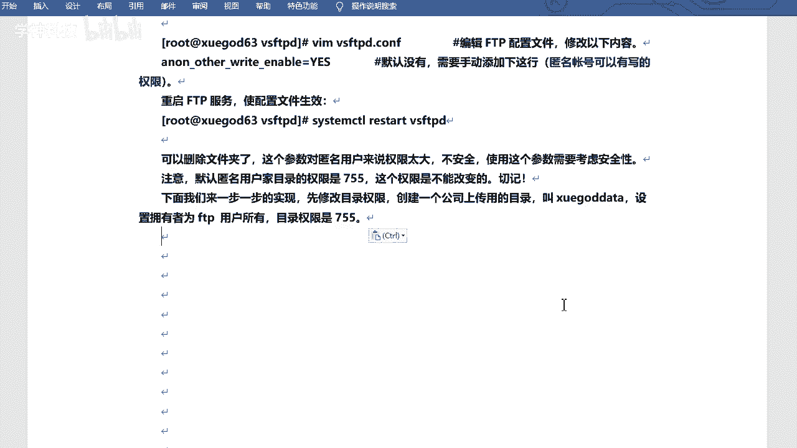

相当于专门的一个用户是吧啊，专门的一个目录。呃，重建一下啊。呃，然后Y下的FTP下的。呃，就是叫学gard是吧，data。然后陈卓文FFTP。哎FTB嗯。哇现在FTP，然后学干 data。是吧。

看一下啊。是吧这个这个和刚才的pub就一样了是吧，就一样了啊，然后咱们来试一下啊。

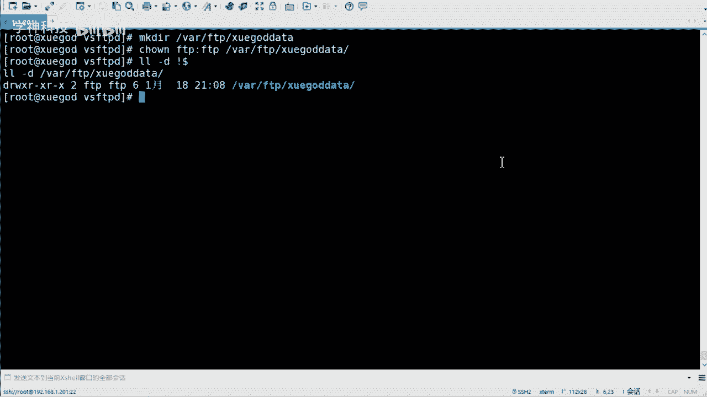

嗯。打开一它。在这儿啊。新建。是吧这个是可以的啊，然后你就用比如说我就用这个目录啊，用一名用户生成下载就可以了啊。然后你可以把这个目录的那个权限给它去掉。😊，是吧因为他因为因为他没有这个权限的话是吧？

没有FTP权限的话，他是写不了的，对不对？这个你就可以放心了啊。😊。

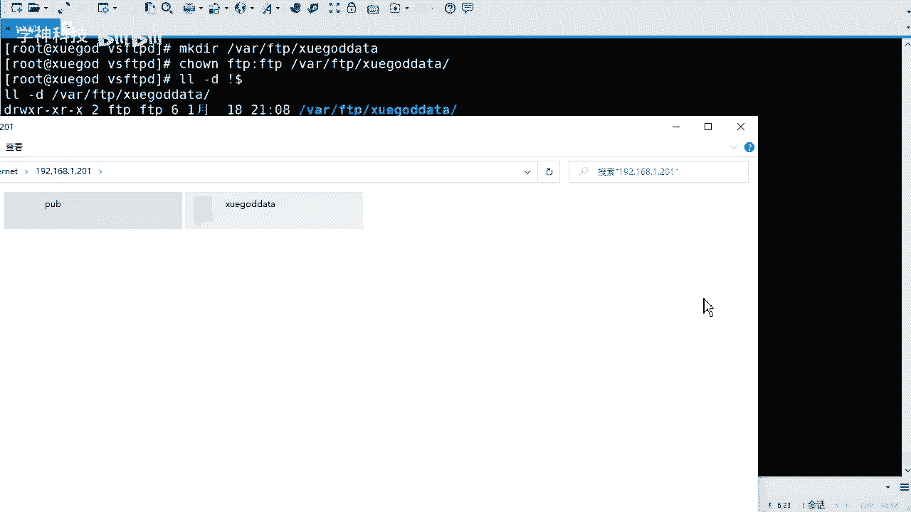

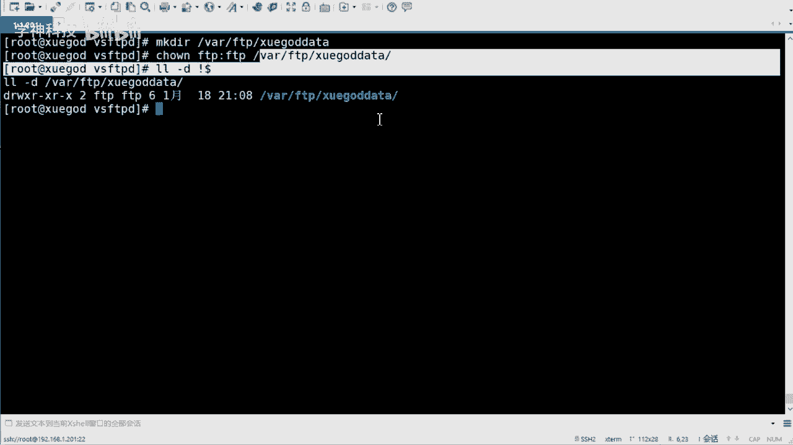

呃，75。默认就是75啊，所以说不用去改。啊，然后改的话就是改数组数组就可以了。哎，然后测试是吧。就可以了啊。其实一般的话，匿名用户只有读就可以了啊，只读就可以了。写权限其实也是没有的。

你可以再回收回来是吧？可以再回收回来啊。匿名用户它的权限应该是最小的。😊，是吧你是最小的，你不然的话谁都能是吧，谁都能这个这个下载是吧，谁都能上传肯定是不行的。嗯，万一给你上传个木马呢，是吧？😊。

那不就坏了吗？好啊，然后正常情况下呢，咱们是用。正常的用户名和密码对吧？哎，你的用户名密码是匹配的话是吧？那那那这个是可以的。😊，对吧这个是可以访问的啊，所以说咱们还是要来看这个啊。

正常的用户名和密码的访问，好吧。来看这个啊。嗯，比如说公司内部啊，现在有一台FDP和web服务器。😊，呃VDP的功能呢主要是维护公司的网站内容啊，包括上传文件、创建目录、更新网页等。公司的话。

现在有两个部门负责维护啊，分别是team一和Tam2。呃，先要求允呃允仅允许te名和 team2。账号登录FDB服务器。但不能登录本地系统啊，并将两个账号的根目录限制为one下3WTL啊。

就是他们的根目录啊，就是不能去不能去切换的啊，不能进入该目录以外的任何的目录。啊，然后FTB和3W webb服务器相结合。也就是说你的FTB服务器的目录和这个web目录的服务是重合的是吧？重合的啊。呃。

是挖一下3W天标啊这个目录好吧，只允许贴名贴面两用户上传啊，VFFPB禁止匿名。啊，禁止匿名的。就是不允许域民域名户户登录啊，这个意思。呃，那么这这个相当于是个题吧，是吧，或者是一个正常的一个需求。

好吧，正常的一个需求啊，咱们看一下怎么去。😊，解决一个需求啊嗯。咱们可以分析一下啊是吧，看一下啊，这个可能字儿比较多是吧？咱们简化一下它啊。😊，嗯。

将FTFTP和web服务器坐在一起是企业经常用到的方法啊，然后这样可以方便对维网站的维护。增加按键性啊，首先需要使用仅允许本地用户访问，并禁止匿名用户登。其次，使用chroot功能。

将team名和 teammer锁定在Y下3W这个模录下。如果需要删除文件，则还需要注意本地的权限。啊，而且还有什么？还有这儿啊，还有一个叫。😊，嗯。这两个用户不能登录本地系统啊。

这个也需要注意的啊也需要注意的啊，就是它不能登录你的系统，但是可以登录你的FTP。是吧等谜FTP啊。行，那咱们来创建一下吧，好吧。😊。

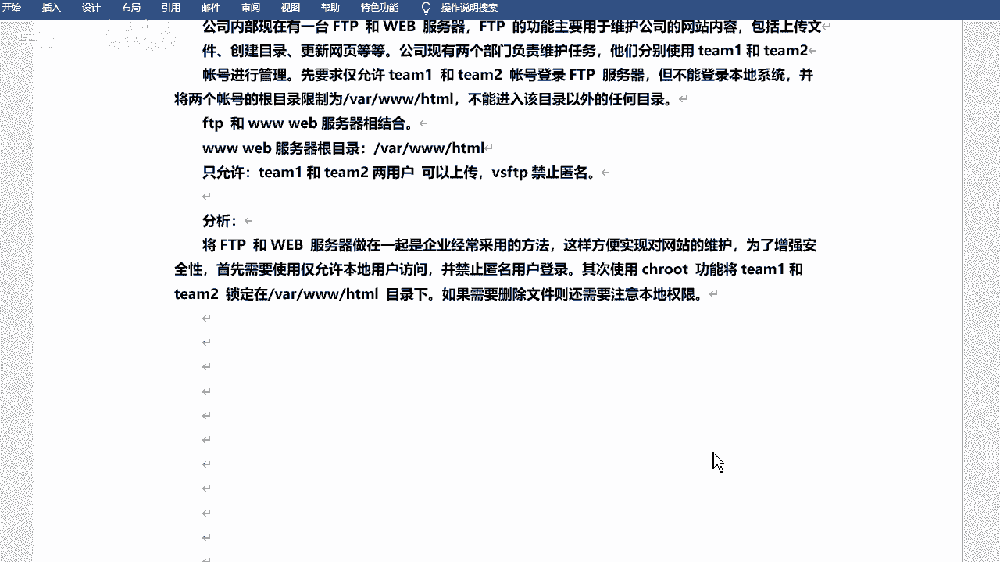

创建一下这两个目录啊，那么这两个目录的话呢，呃，这两个用户啊，那么这两个用户的话呢呃是系统用户，但是它不能登录系统。😊，那么你就得给他设置这个。登录shall是吧，登录shall啊。叫死pen性的n病。

对不对？我感大家应该也想到了啊，这个呢是不允许动作操作系统的，好吧，这是team一是吧？然后再设置一个te2啊。对吧，然后再给它设置一下密码。好吧，密码A的方式设置密码啊。然后题门都是123456啊。

我这个都设置的比较简单的。

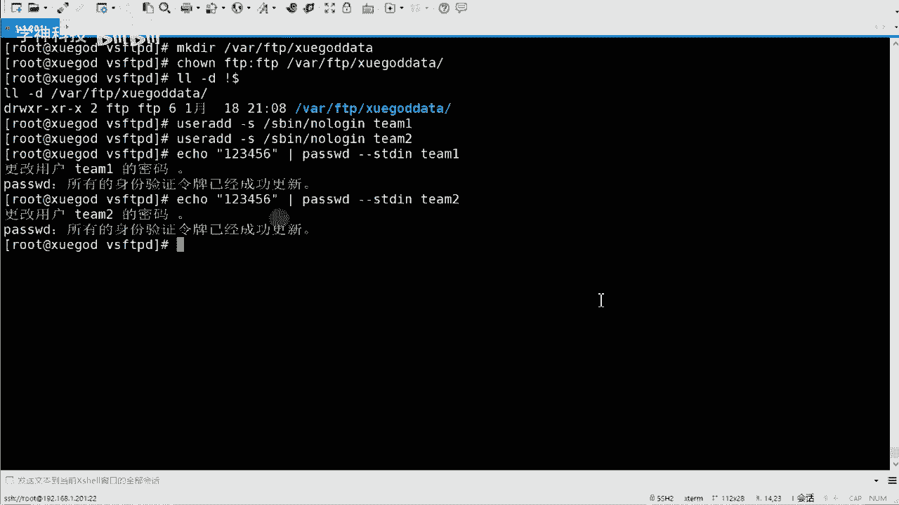

是吧都是比较简单的啊。直接去st它就可以啊。嗯。OK然后的话咱们去改配置，好吧，改配置啊。😊。

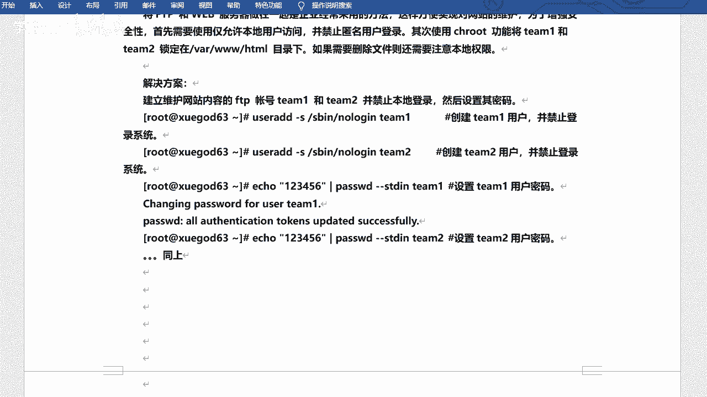

嗯，那我还在这个目录下是吧，我还是在。FGP这个呃配置文件的根录像相当于啊。嗯，我干嘛呢？我再去给他拷贝一下吧。VSFTP点儿com点BAK恢复回来啊。VSFTP点com就是我不让匿名用户可以去登录。

好吧，可以登录了啊。服务宁。是否要覆盖啊？yes。好吧，yes啊，然后修改一下ATDC啊，然后VSFDD下的VSFDD点comM。修伪他就可以了，好吧。呃，然后的话不允许匿名互动啊。

然后找到anonymous enable。这个啊这个。好吧，这个它默认是yes的是吧，默认是允许的啊，咱们给它改成重。😊，飞过去。我给他这改一下啊。分钟好吧嗯。对。

然后local enable yes这个是还是yes啊，允许本地用户都。对吧。就是这个啊。然后下边啊然后下边呃再那个找一下吧，还是找一下啊。叫做local root。没有这个什么？啊，没有这个是吧？

没有的话，那我就。呃，我就。找一下这个吧，叫做chro。Local。😔，有这个吗？啊，其实我随便找个地方也可以啊，然后去写一下咱们的配置。好吧，现单的配置啊嗯主要是这么几个。从哎呀，我还是从上面这写吧。

因为他没有这个配置啊。我还不如从这儿现的。嗯，叫做local root。Local root。没会。😔，是Y下3W。H天标。是吧这个是它的本地root嘛，是吧？就是根目录啊根目录啊。😊。

然后叫做chan root。List。然后enable。呃，然后yes嗯。啊，成认ro册list呢其实就是相当于禁锢你了啊，禁锢你的用户了。好吧，它不能去迁换到别的目录。😊，好吧，不能切换到别的目录啊。

然后是 change。Root。呃，list。Few。啊，你给他fi啊。呃，这个是锁设置锁定用户啊，设置锁定用户在根目录的列呃这个列表文件啊，这里边存放的是用户名啊，呃，这个文件的话。

其实咱们可以去写一个啊，目前没有啊，一会咱们写一个啊LETCETC下的，还是在VSFTPD下叫做深认之。Alist。嗯，好吧，就他吧。好吧，这个就是锁锁定用户的一个文件啊，一个文件啊。嗯，然后是low。

Hello， rattable。Chenzut。等于yes。啊，这个是允许锁定用户有写权限啊，hellow嘛是吧？reable啊。😊，好吧，这是几个，这是啊啊，应该从这开始啊，12344条是吧。

四个配置啊。😊。

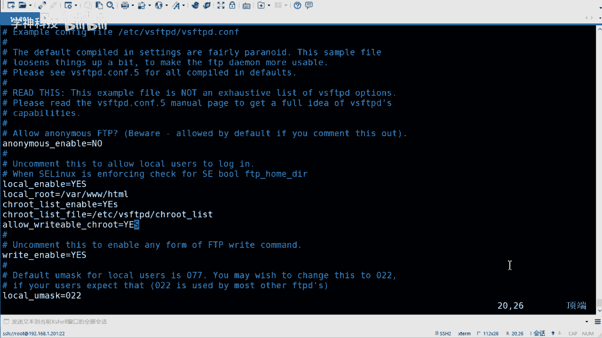

四个配置啊。配置件。OK改的多嘛？是吧？其实改的不多啊。😊，一个是把y改成皱是吧，就是默认的啊，然后下边呢加这4条。好吧，再这个思啊，当然你可以新加。如果说你找不到的话是吧？那呃那你可以新加啊。

找得到的话，你可以直接去改。😊，啊，这驱干也行的啊嗯。okK改完之后不保存退出是吧？然后呢，我去呃新建一个叫做真至root list的一个文件啊，然后把咱们的用户名呢写进去。

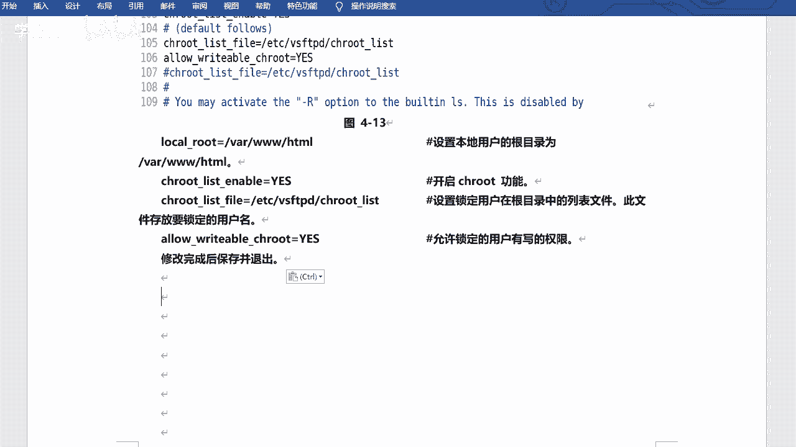

呃，ETECC啊就是在当前目录啊，叫它这个这个ch rootot list。好吧，把用户名写进来啊，一个是team一。😊，一个是地面。OK这两个啊。嗯，好吧，那他们两个就有写权限了是吧？就有写权限了啊。

呃，然后就看一下哇下3WATM啊这个目录。😊，好吧，这个目录啊这个目录是。往这个目录是吧，同时也是咱们FTP的根目录。好吧，FTB这个蒙啊，然后给他改个什么权限呢？呃，在这的话可以改一个这个啊。😊。

前置modode加一个。啊，不是叫杠R啊，应该叫。嗯，O加W。啊，O的话就是其他人嘛，是吧？其他人的话呢，对我这个目录也有写的权限。😊，好吧，也有写性啊，如果没有写性的话，你是不能去创建文件的。

是吧原来怎么不改成FTP啊，是吧？FTP那个呢只针对于匿名用户。😊，好吧，只对于一名用户啊，咱们这边是新加的两个用户是吧？所以说用O加W这种方式啊。呃，Y下的3W1秒给它改一下，好吧，给他改一下啊。嗯。

这样的话O就会写权限了。O59写权限了啊。

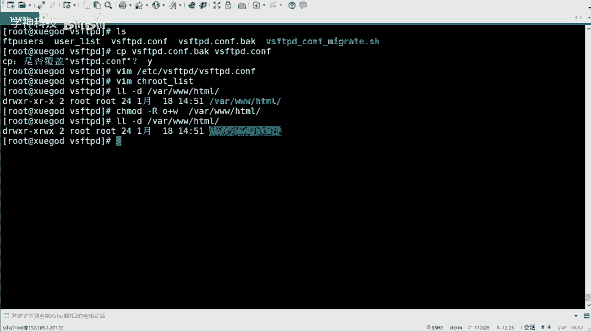

这个地方。这是咱们的配置啊。

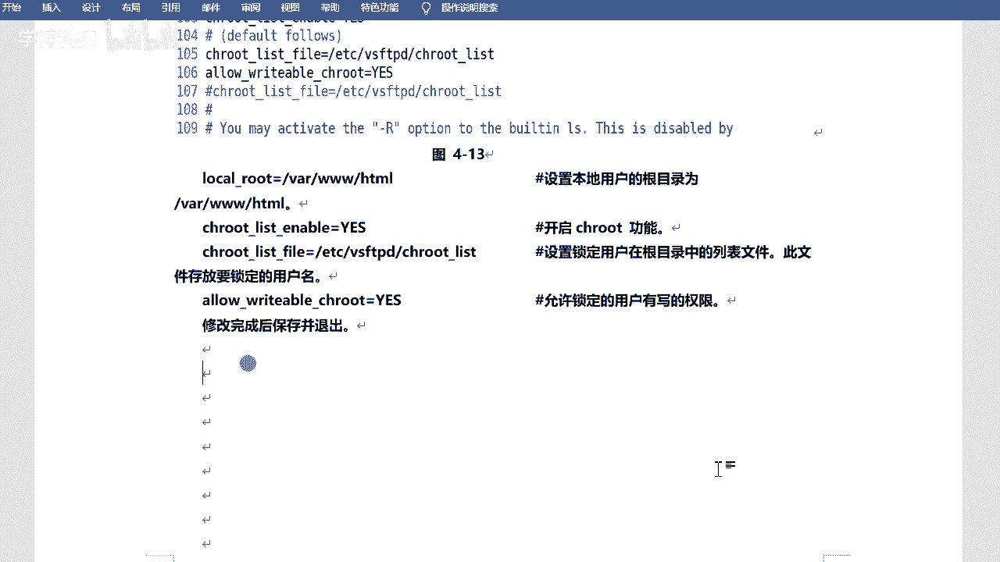

OK然后重启服。好吧，重启服务啊。They can restart。VSFPD。好吧，然后重启的时候一定要注意有没有报错啊，报错的话，说明你的配置啊是吧写的不对啊，那你去修改一下是吧，修改一下啊。呃。

没问题的话，就就能起来的好吧，能起来的啊。那比如说我去干嘛呢？😊，嗯，我去拷贝一下吧，把ETT的pass word拷贝到Y下3W怎么样？嗯，然后用LFTP啊，咱们试一下啊。嗯一圈这1了吧。加1。201。

然后杠U是指定用户名啊，然后team。一然后逗号是密码啊，然后123456。过来。好吧，我在绕你看啊，它有两个文件啊，一个是index，有 password错了。index是我之前存在的啊。

比如我切过去看一下啊。哇下，3W7秒啊，这个index是我之前创建的啊。我下午上课好像用这个来着啊。对，然后pa座的是刚才传的是吧？哎，那你能看见这两个文件。😊，嗯，对不对？你能看下这两个文题的吗？😊。

不是写错了是吧？改成大写的啊。😊，嗯，行，但是它其实不影响的是吧？然后其实你去切换这个目录上的，你是切不了的，因为它已经禁锢你了。

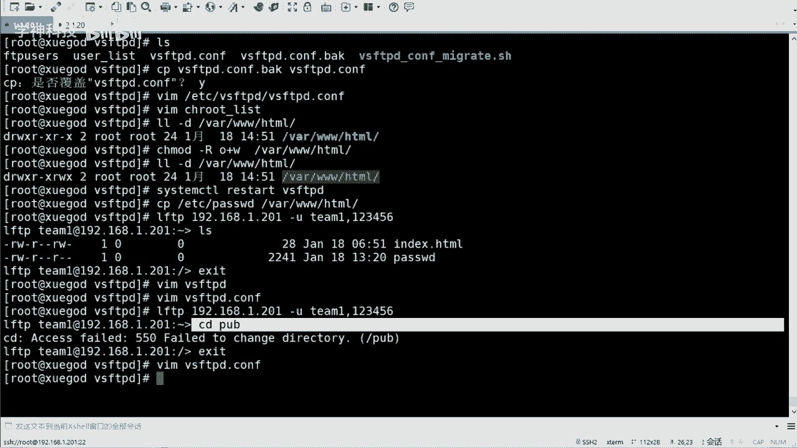

好吧，肯经禁过你了啊。对。啊，OK这是咱们。普通用户设置用户去登录是吧？登录啊。Okay。呃，然后也可以通过filelzela这样的用户呃，这样的工具是吧？去上传这个文件啊，上传文件啊，这个也是可以的。

feelzela这个东西我给大家传一下吧。😊，有Z了啊，就是那个什么来着工具嘛是吧？工具其实挺多的啊。😊，嗯， feel得啦。😔，这个吧。EXE啊，这个直接就能用。我记得是。嗯是吧，然后我连一下啊。嗯。

我连一下啊，然后主机面用户名是在这连吧。嗯，新站点。FTP协议是吧？嗯，主机名的话是192。168。加1点201啊，逗个号的话是21。呃，加密。不用加目前不用加密啊。登录的话是。询问密码好吧。

用户名呢是team一对吧？密码是。我一会儿连接一下啊，这才能说密码啊。啊，密码呢话是123456。啊，这是我之前的一个东西啊，不用管它。嗯，行吧，这样的话就连上了啊，在这可能不明显啊，在这儿呢。😊。

在这呢啊，这是你的站点是吧？然后这边的话是你的文件名，呃，这边是咱们linux服务器啊，这边是windows服务器是吧？😊，嗯，那我传个东西吧，比如说。随便传个啥，把它传过来。对不对？你看这是可以传的。

可以传的话，证明是可以写的嘛。是吧这明就是可以写的啊嗯。O啊。嗯，这是咱们的。用户名和密码的方式是吧？用户名和密码的方式去去登录是吧？去登录啊，然后什么读写权限啊什么的都有的啊嗯。

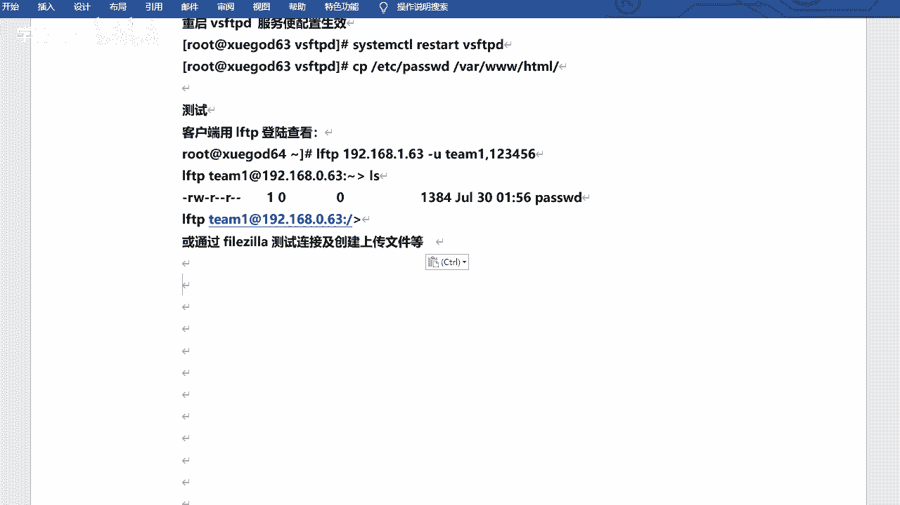

だ。