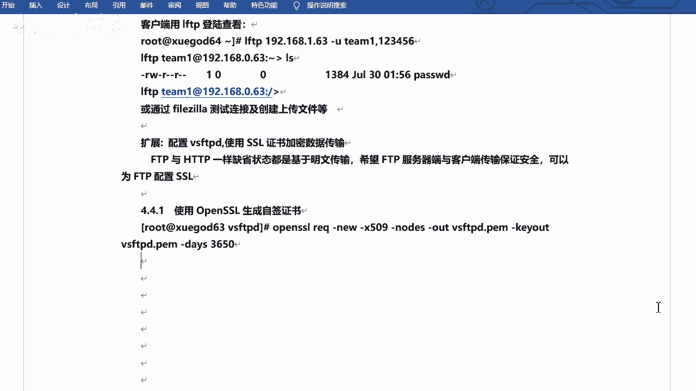

# 2021年RHCE／RHCA／RHCSA／红帽最新教程 - P11：使用ssl证书加密数据传输 - 学神科技 - BV1Wi4y1K7g1

行吧，下面咱们来个扩展啊来个扩展啊。呃什么扩展呢？就是。😊，加加这个SL作证书。好吧。配置SFDB啊，使用SF证书加密数据传输行吧？当然这个是呃不是那个啥的啊，这个不是怎么说呢？不是这个必须的是吧？

但是咱们可以看一下是吧？可以开放一下眼界啊嗯。加密的啊。对。FTP啊呃其实不单单是咱们外部服务器可以做做这个SSL的是吧？FTP的话也是可以的。😊，对不对？FPTP的话也是可以的啊。😊，嗯。

因为他们默认情况下啊，宣染状态啊都是基于笔幕传输的，是吧？呃，希望FTP服务器端与客户端保证呃传输保证安全。那么可以使用FTP配置SSL。好吧，这个其实几个命令就可以搞定啊，但是呃看上去很难。

其实不难啊，其实不难的啊。😊，是吧这个命令啊，我们一起看一下。生成自签名证书。证人资行明证书啊，这个可以直接去直接去使用的，好吧。

天使用的啊。嗯，我给他。嗯，我就我就在这吧，执行一下啊。😊，open啊IQ杠6啊，什么杠叉509note这个参数非常多啊，out out，然后K out，然后day是吧？这个我简单说一下啊，嗯。

IQ什么意思？IQ的意思是。呃，是一个一个怎么说呢？是一个管理命令啊，管理命令啊，就是证书签文人请求叉50的是方式啊或者证书管理数据的方式。this是有效期，有效期啊，就是天好吧，就是天啊，对。

然后这个这个note是节点嘛啊，al就是输出证书的保存文件啊，K out的话是K叫妙的存储文件啊，newK就是新哎，这有newK吗？啊，没有newK是吧，有个new是吧？这个就是新新证书啊。

这是个新的证书，这没事。😊，好吧，就可以了啊。直接回这就可以啊，但是他会让你输个信息啊，比如说你的country，你的你的这个这个。😊，啥你的这个这个国家是哪是吧？中国比如说啊。呃，省啊。省是北京吧。

啊，然后CT也是北京。呃，公司是吧，公司是学干的吧。呃，部门是吧。需渣他。😔，啊，然后是你的域名啊，你的hoserv house name啊，你的服务的。这个这个主机名是吧，副务主机名啊，比如说叫。

这叫什么叉S点com吗？呃，email address啊，你的你的email地址是吧？email地址啊。😊，这个随便写啊。1163点儿COM。行吧，就可以了。😊，好吧，就可以了，他会给咱们去生成。😊。

啊，他会给他们去生成啊，它是在当前目录吧。在这啊，它会生成这个证书，好吧，他会生成这个证书啊，我们把笔记写一下，好吧，笔记写一下啊。😊。

呃，这个这个你们不用记是吧，这个参数其实当然也比较多啊，然之后直接复制就可以啊。如果想做的话是吧，直接复制就可以啊。😊，嗯，然后参数的话，我这儿也有一个说明是吧，这个参数是干什么的啊？好吧。

关键是咱们要找到呃，不是要要看到你生成的这个这个证书。好吧，生成的证书啊，然后咱们已经找到了，在这儿了。😊。

对吧在这儿啊。呃，一般的话呢，咱们是给它生成一个什么呢？呃，生成一个目录吧，然后专门去存放这个证书啊。嗯，比如说叫那个爹啊，叫。点儿SSO啊。呃，SOK是吧，这个。

然后MV把VSFPPD点PM啊拷贝到点SSLK。然后给他加个权限啊，叫400。好吧，400啊就是。呃，root权呃root用户对它只有写权限是吧？当然读写也是可以的，但是它里边其实是是一些什么。

这个字符之类的啊，你没有必要读。给他盖一下400就可以啊。嗯，好嗯，改完之后啊，这个当然只是生成证书是吧？生成证书啊，然后咱们需要去改配置文件。对吧还是需要改配置文件的啊。VSF点儿comM。行吧。

然后咱们写一下。啊，写一下啊。呃，写的话呢，我看看他有没有值，他有没有那个啥的啊，有没有。以前的配置啊。嗯，找一下SSL部有吗？啊，没有是吧。这个啥呢？这个这个这个SSL。TS有吗？也没有好吧。

那我就自己写吧，行吧。啊，找个位置啊找个位置，一般的话咱们嗯不写到最后好吧，一般的话咱们找个位置插一下就行啊，就是在这儿。行吧，然后插一下啊。我给他复制一下吧，因为加的东西比较多啊。

SSO enable yes是吧？这个是启用SSO啊，然后。这个嗯。helloO啊，就是呃匿名用户是吧？😊，然后foralse就是强制啊，local data SSL啊。

local login呃SSL匿名用户login SSL啊，什么匿名用户data都是SSO啊，都是。强制加密的相当于好吧，强制加密的啊。😊，啊，然后是知识的版本啊知识的版本啊。

因为SSL它是分分这个版本的，好吧。好像是从1到到3啊，咱们都写一下。123是吧，都写一下啊。🤧K。呃，然后这个啊。呃，requireSSL什么ra啊，这个东西这个是什么不重用SSO规划啊。

不重用SS规划啊，就是你已经建立了这个规划了，然后不再去重用这个了啊。然后还有一个，因为这个配置比较多是吧？配置比较多啊，什么sus high啊，就是一个加密算法，好吧。😊，呃，然后是指定你的文件啊。

指定文件thirt third view啊， third view就是认证文件啊。就是刚才咱们放的那个那个目位置啊，然后是。私要文件啊，这俩目前咱们这两个用的是呃用的是一个文件啊，一个文件啊。哎。

就这些。对吧所以说这个配置很多对吧？很多啊，你也不用记，好吧，你也不用记啊。😊，因为记的话，我估计也寄不过来。

是吧也寄不过来啊，你就直接用就可以了。好吧，咱们主要可以咱们主要是看看效果，行吧。主要是看看效果啊，就是它支持这种SS方式。嗯，把这个。等一下嗯。好吧，这些啊这些啊都是需要去插入的。嗯嗯呃需要注意的是。

上面的配置不要添加到最后的配置文件啊。不能在文件之后添加啊，否则我启动会报错的。对吧然后咱们重启一下服务。

呃，是怎么取消。Restar V S activity。好，你看我是不是我是不是还写错了呀，哎呀呀呀。嗯。喂，我是复制的呀，我是复制的，还能写错喽。😊，我看看啊。然后我给他删掉。就可以了。

是吧这在就可以了啊，就是这个地方。多了几个空格是吧？这个东西非常的严谨的啊非常严谨的啊，和R3C一样是吧？23C的话也不行啊，你也不能多空格啊，然后也不能后边跟上什么注释什么什么之类的，是吧？都不行啊。

😊，然后对，然后重启就可以了啊，重启就可以了啊。那我在这写一下吧。😊。

而且是吧，这个这个。在配置后不能有是吧，多余的。空格啊，我感觉就是这个结果真的是嗯。有的配置文件其实挺是吧？挺宽松的啊，但是有的就非常的较劲啊，它就是不能让你。😊，多空格少空格是吧？这都不行。嗯。好。

那咱们来验证一下吧，是吧，验证一下啊。😊，呃，还是用这个feel了，好吧，还是用它啊。那我来再再连一下啊。

啊，重启了吧，我我重启了吧。

重启了啊，然后我再连一下啊。这个东西啊。有新版本，我就不用新版本的，然后再新连一个，再新连一个吧。再先连一个啊。谢新一个整点啊。嗯，192。1ば。加1。201啊，端口是21。是吧然后。这个怎样呢？

这个可以选择一个叫做要求显示的FTP什么over tS啊，可以用它啊。然后也是询问密码。用户名的话是还是提迷啊。嗯，连一下。已经连了一台服务器在新标签中连接。嗯，你看啊它会有它会有这样的一个什么呢？

有这样的一个一个提醒吧，是吧，一个提醒啊。😊，呃，服务器的证书未知，且小新验证证书已确信该服务器可信任。好吧，就是他已经连的时候呢，已经开始去验证这个证书了啊。然证书内容的话呢，是咱们写的就对，好吧。

😊，什么叉S叉S点com呀，学尬的学尬的一个东西，这是咱们自己写的。说的没问题啊。该证是自签的啊，自签名的，就是咱们自己去签发的啊呃嘚得哒哒得啊，然后确定就可以了，好吧，然后也能连上。😊，也能连上啊。

然后你看这儿它连的时候呢，会正在验证证书TS连接已程已建立啊，已登录啊，然后这个就OK了，好吧，这这就可以了啊。😊。

好吧，咱们看的就是那个那个提示啊，包括它的一个连接过程。就行了，好吧。嗯，OK这个是咱们的。加密是吧，加密啊。对吧有兴趣的话可以可以试一下是吧？可以试一下，这个不强制。😊，如果说你感觉困难的话是吧？

这个不强制必须要做的。好吧，但是我建议的话可以去试一试。好，可以试一试啊。连上之后，你可以看一下是吧，它的一个提醒。对不对连接过程啊。O。行，这个是什么呢？这个是。呃。

加密是吧，加密啊。