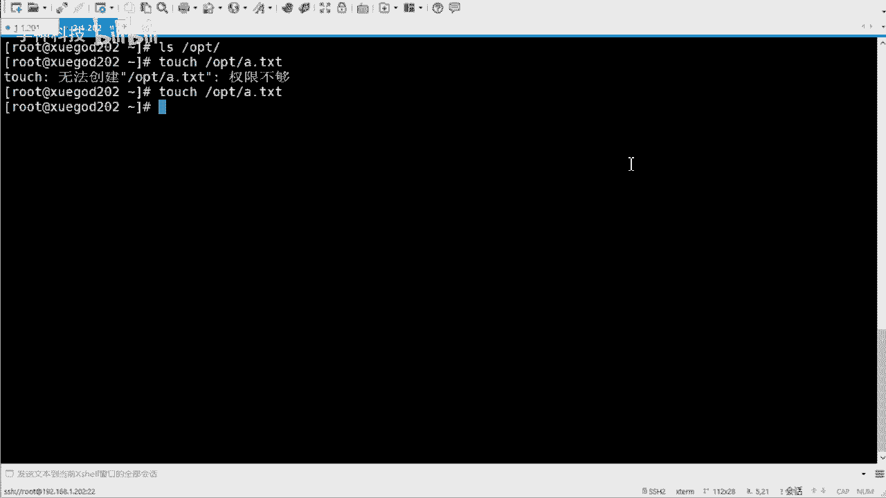
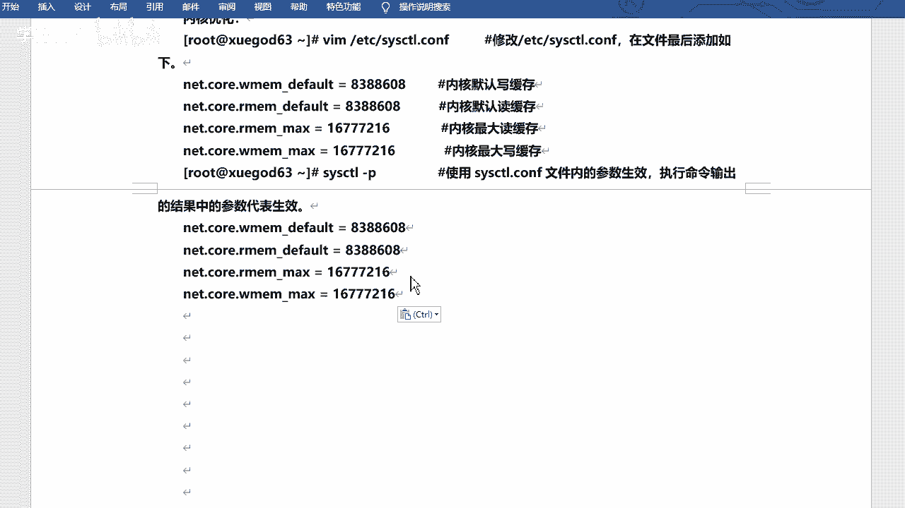

# 2021年RHCE／RHCA／RHCSA／红帽最新教程 - P12：NFS服务配置及设置开机自动挂载mp4 - 学神科技 - BV1Wi4y1K7g1

看一下NFS。比会在这啊，NFS。嗯，我得给他改一下这个啥，改一下这个字体。哎有啊。找一个正常点的。这个大点儿。嗯。NF啊，然后。配置NF服务器，并实现开机自动挂载是吧？NF叫什么？

NFS的话叫呃network fuel system啊，network fuel system是吧？通过这个名字你应该也能猜出来是啥意思吧。😊，对不对？网络文件系统。

是吧网络文件系统啊呃它呢是什么freeBSD支持的文件系统的一种啊，也被称为N允许一个系统。看看它啊，允许一个系统在网络上与其其他人啊共享目录和文件。通过使用MS用户和程序可以像访问本地文件一样。

访问远端系统上的文件。是吧这就是NNFS对不对？其实这种nas的这种存储都是好吧，都是啊，然后那个啥。😊，那个那个FTB其实也是啊，你登了之后就好像是吧？FTB的目录就在你的本地一样。

你也可以去上传下载呀是吧，创建呀是吧，这也是可以的，对不对？FS也可以啊，像之前咱们还讲过一些扫码什么的，是吧？也可以。😊，嗯，也可以的啊，对，都都都是可以挂载文件器，挂载这个目录，然后可以去用。啊。

可以用啊。那么FS的话，它也是CS的一个模式，好吧。然后呢。啊，这个也是直接可以通过那种目录的形式去访问的。好吧。它端口是2049。啊，2049啊7版本的默认人是四版本。啊啊。

默认是这个NFSV4的版本，好吧，这括号是049，但是呢它不单单是有一个服务啊，和和FTP很像啊，它也还有一个叫还有1个RPC的啊，就这个。2RPC的啊。像RPC的话，它会管理你的端口。

因为它传输的时候可能会用到很多4G端口啊，所以说有一个专门的去管理这个端口的，就RPC。啊，RPC啊，然后服务叫RPC办的。是吧2049啊，由于文件系统非常复杂啊，因此NF还有其他程序去启动额外的端口。

M默认使用传输端呃，使用传输的端口是随机选择的，小于1024端口。啊，卷端口告知客户端是需要依赖于RPC的啊，RPC的啊RPC就是管理端口的，是吧？当M启动呃启动时候会随机选取数个端口，并向PC注册。

因此RPC就可以知道每个端口对应的M功能啊，然后RPC最主要的功能就是指定每个M功能所对应端口，并告知客户端，以便客户端连接。是吧就是干这个的啊。😊，嗯。

这个的话NMS呢也可以通过那个呃ETCservice那个文件去看是吧？它的界段位是多少啊？2049。好吧，049啊，这个我就不继续看了是吧？到时候你们可以看一下，可以搜一下，搜NNFS就可以了。😊。

行吧，那就可以啊。那么装NS的话呢，咱们最少的话需要装这么两个包啊，一个就是IRPC，一个是NS包的名字呢叫这个啊。包的名字可能不太好记，因为比较长啊嗯。嗯，我把它拿过来啊。

啊，一个叫RRPC band，一个叫NFSut是吧？呃，当然这两个默认是装好的是吧？装好的，一般像这种。😊，呃，就是平常的安装是吧？还有这种什么图形化的话，它一般都是装好的，好吧，都是装好的啊啊。

但是你没装好的话，肯定需要装嘛，是吧？😊，没装好的话，肯定需要装的啊。OK这样的话就装好了，对不对？装好之后呢，它有这个配置文件啊，在ETC下的叫exports。它里边默认是空的啊。好吧。

你可以把要共享的。这个目录写进去是吧，写进去啊嗯。

嗯，配置文件在这儿。嗯，是吧。EDC export啊，然后呃启动它启动它之后呢，咱们可以啊启动两个啊，一个是RPC band的，一个是NFS server，两个服务都要起啊，两个服务都要起。呃。

情动好之后呢，它的金端口呢是2049。是吧2049啊，然后需要注意的是在启动FS之前，要先启动RPC是吧？先启动RPC啊，否则FS就无法向RPC进行注册。另外如果RPC重新启动啊，这个应该是重新吧。

是吧？这个。😊，重新是吧？重新好像都成了方言了，是吧？啊，等等等等等。哎，我在哪儿呢现在呀，这是。启动NFS。😔，重新启动啊。重新启动。那原来注册的数据会消失，所以在重启RPCA之后啊。

它所管理的服务器都要重新重启，以重新向RPC注册。是吧，所以说这两个相对差是有关联的。好吧，但是有关联的啊。😊，Okay。呃，那咱们来启动一下啊嗯。

System go， start。2RPCband。以后这已经启动了吗？2RPC端啊。因为我退本不出来啊。哇塞，卡了吗？刚才啊起来了啊，然后我再去启那个。NFS server。是吧。来，取一下啊。

取完之后咱们看一下啊。NTBgra一下2049。是吧已经在监听啊已经在监听啊，然后enable一下开机启动，好吧。

是吧开源启动啊。😊，这样就可以了啊。Okay。呃，然后的话然后的话咱们可以怎样呢？可以去呃呃连接一下你的服务啊，连接一下你的服务啊，就是应该是客户端连接啊，我看我这边可以可以显示吗？😊。

Show， show much。刚一显示啊，然后是1。2。1。8。点1。201。好吧，他会去export啊，给你导出列表啊，你的这台服务器共享的NFS的目录是吧？它会给你显示。但是目前我没有共享。

所以说它是它是空的，对吧？它是空的啊啊，然后比方说你去mount它挂载什么的，他可能是不能去挂载的，因为还没有分享是吧？咱们需要去给它分享一下，比如说我把我的某个目录分享出去是吧？让别人可以用我的这个。

分享的目录是吧才可以的啊。呃，那么这样的话呢，就需要修改咱们配置文件啊。你想共享谁是吧？然后可以给它。

这个这个这个写一下啊。在这儿写一下啊。EDC下的exports是吧？ports啊这写。嗯，比如说我要共享media这个目录啊。我者OPD上的都可以共享啊。😊，然后心儿啊，然后。2W。啊。

这个写法是很简单的啊。是吧这么写就可以啊，什么意思呢？media的话就是当前你的系统的某个目录，你想去共享啊。😊，星儿的话呢其实是这个网段啊，网段就是你想共享给谁，或者说谁可以去挂在你的这个共享是吧？

星的话就是任何的网段。😊，啊，2W的是访问权限是吧？就是读写权限啊，读写权限啊。😊，He。好吧，然后咱们再去收梦幻钢一看一看啊。呃，1。201。嗯，那我应该啊应该先这样啊，exports。

Exports export office。杠2V有了吗？啊，已经有了啊med。啊，哇塞，他可能不能自己看自己是吧？那我还是开开个机吧。是吧开个新机器，我看一下啊。等一下啊。书。😔，书帽。告义是吧。嗯。

一加2。1了吧，点1。201。啊，你看这个才能看出来。对吧大能看出来啊，mediaor星，然后我自己看不出来是吧？😊，自己是看不出来的啊。那那那还得开两台啊，我本来想今天能开一台就解决还是不行。😊。

还是看两天吧。呃，没有共享，直接去写就行啊。然后呢，你可以先自己去看，叫export FS杠RV啊，这个也可以就是可以看到自己的那个啥啊，这个是看自己的好吧，自己的那个。那个那个共享的目录啊。

杠RV是吧，你可以能能看到啊。然后这个手报的刚译呢是看你的服务端的啊，这个是刚毅，是看你的服务端的啊。😊，OK行，那那咱们来试一下哈，然后我来挂载一下，行吧，我来挂载一下啊。😊，呃，Mo挂子。

帽他挂着啊。杠T是指印那个那个文件类型啊。NF类型啊，应该叫应该叫文件系统类型啊。NFS挂谁呢？1922。168点1。201下着啊这么写。😊，冒号啊根，然后谜底。挂到哎呀，往哪去啊？我瞅烟啊。嗯。哇塞。

我这个。算了，我就挂这吧，目前里边也用不到什么东西啊，那我就挂到这个这个OPT下，好吧。挂到皮底下啊。挂过来是吧，挂完之后，咱们看一下啊DF杠大TH是吧？😊，然后在这儿你能看到啊。

然后你的201的这台机器的media挂到了我的OPD下是吧？NFS4类型啊，四的话就是版本啊，呃，10个G用了3。9，还剩6。2是吧？很大对不对？其实它这个挂的话呢。

是相当于把这边你剩余的这个根根区都给你挂过来了啊。你看我是刘明居。用了3。9，还剩6。2，一共10个G。

对不对？它它它就是这样去显示的。行吧，就这样显示的啊。那么你共享了，然后直接挂就可以，好吧，直接挂就可以啊。好的。行，那这个是手动挂是吧？然后呢咱们来设置这个开机自动挂载。

可以自动挂载的话呢，其实在这ETCFSTB啊也是写在这儿。对吧，然后我写一下啊，然后地址是19。168。点1。1。1。201下的是吧？me啊。挂的话挂到OPT下啊，按照格式写啊。😊，呃。

文件类型是MS啊，defor。😊，00是吧。就这样写就可以了。好吧，这样写就可以了啊。😊，OK然后咱们可以重启验证一下，好吧，重新验证一下啊。😊，嗯。如果写择错的话，他可能都开不了机是吧？

咱们稍等他一下啊。😊，记得啊，然后咱们再来看一下啊。挂上了吗？啊，在这儿呢啊，没有在最后啊，在这呢。😊，对吧这就挂好了啊。😊，就是重启验证一下，可以是吧？

啊，当然你不想重启也可以啊，但是他肯定是可以去。可以去这个啥的啊，可以去这个这个。呃，挂挂在上的是吧，因为你只要写的没问题是吧，然后肯定是可以的啊。😊，除非如果说你写的错的话是吧，它可能起不来。

起不来的话就会进入一个emerence mode是吧？一个模式啊，可能就是那写错了。😊，好吧，可能今年写错了啊。好，那咱们再来看啊，挂上了是吧？挂上之后呢，就是咱们的OPT这个目录，你看里边现在是空的。

对吧以前还有什么NG，还有印象吧，还有什么2H这个目录啊。就在这儿呢。我现在把它挂上，挂上之后呢，他就把我之前的东西覆盖掉了，好吧，就看不见了啊。然后目前的话就是media里边现在是空的。😊，对不对？

空的话呢，我去创建一个文件是吧？咱们看看能不能写啊，能不能写啊。touch1个OPD下，比如说A点TIT吧，能不能写？对不对？咱们刚才这个权限是。是吧是这个这个读写的RW的，对不对？但是呢他却不能写。

好吧，他就不能写啊，为什么呢？因为。😊，读写的话确实是可以读写。但是呢你不是root用户，现在对吧？😡，啊，不是你不是啊，是你挂载的时候，对吧？你不是root啊，就是观看之后，你不root权限。😊，对。

虽然说你现在这是root啊，但是你挂载的时候它不是啊，因为NFS的话，它有一个默认的挂载权限是NFSno啊，这样的用户就好像FTP匿名用户是FTP1样是吧？这个用户叫NFS nobody啊。😊。

所以说你还得改权限啊还得改权限啊。😊，呃，那我看啊呃可以改成717啊，直接改717啊啊，是在这边改服务端去改啊，但是77太大了就验是吧？那我可以去改成NFSno。😊，啊，然后是NFS nobody。嗯。

杠是吧，把me底盖一下啊。好吧，把me底改一下，然后咱们再来创建一下。哎，你看现在就可以了。😊，对吧，现在就可以了啊。所以说你虽然是 root册，但是你也不能创建。

目录是吧，你发现了吗？这个很神奇的说你权限不够。对不对？说以权限不够啊，你很少看到说root权限不够吧。😊，是吧但是这个地方哎就就就就看到问题了是吧？就看到问题了啊。😊，好吧。

就是因为这个这个这个权限啊，我把它标个红吧。呃，我把这个。啊，把这个吧标啊，因为有可能不太明显是吧？NFS nobody啊，这是7的。嗯，在八版本里边的话呢，其实NF nobody nobody是吧？

这个用户他缩写成了叫nobody啊，nobody。八的版本啊，当然目前你们可能还用不到八的这个服务的啊。这个知道就可以啊，它简简化了。因为之前也有nobody有NFnobody。

它现在全部改成了nobody。😊，是吧。点权限啊，当然这个这个不建议是吧？不建议这么想这个因为它它太大，声音太大。对吧但是你可以用后边这个啊。这个不是建议的。然后再去写的话就可以了，好吧。

你再去创建是吧，这个就没问题了。是吧，这就没问题了啊。的话其实它的参数可以可以很多啊，这个参数就是指咱们那个配置文件的参数。对吧2W刚才只是一个是吧？2W啊。那行。还可以RO只读是吧？SNC是同步。

对吧咱们上节课讲的是2NC你看现在有SNCSNC的话是资料同步写入内存和硬盘当中是吧？ASNC是异步。😊，啊，一步的话就是先存的内存，然后再写到这个硬盘是吧？对的硬盘啊。对。

scurure啊什么之类的啊，然后inec。啊，什么什么这种的啊这种这种其实简单看下就可以啊，什么wely啊，no wordly had had是是是是躲藏的意思啊。在IF的共享目录中。

不共享其子么动是吧？你看。😊，哎，是不是你看。对吧它可以写的很细啊它可以写的很细的啊。😊，呃，什么subre啊，什么allcra啊rootcra norootcra这个可能会用到啊。

这个意思是root用户的所有请求映射成如an anonymousyous用户一样的权限。啊，这个是完全的访问权限。就是权限的问题啊。然后用法的话就是把它加入到括号里边。对吧咱们刚才写的括号呢。

就是就是那个啥嘛，就是按W嘛，对不对？但是呢你可以加这些都可以加进来啊，然后逗号给它分开。😊，是吧就行了啊。就是你可以说的很复杂是吧？😊，可以设置的很复杂啊。就这种的。啊，可以这样写。括号里边的是吧。

刚才咱们这些参数简单说了一下啊，然后呢这个星儿啊这个星儿的话代表是什么呢？代表是呃网段是吧？就是谁能连接我，谁能挂载我，对不对？星儿的话，就是任何任何的。如果说你想要扔某网段的话。

也可以这样写IP地址啊，什么点0加上24，就是这个零网段，具体的某一个就是只有它可以连可以挂在我。😊，啊，这个就就写的很很很那啥了嘛，是吧？就很专业啊。对，然后也可以这样写。😊，是吧。

你看什么UID等于500这东西都可以啊，然后还可以写3个51个0也行啊，写24也行啊。对，然后也可以这样写，还可以写多个啊，可以允许这个网段，三个0网段，也可以允4个联网段都行啊，形成这种。对吧。嗯。

在发布共享目录的格式中，除了共享目录是必必根参数外，其他参数都是可选的啊。除了这个就是共享目录啊，是可选的，其他必选的，其他都是可选的。😊，是吧都是可选啊。

并且共享目录与客户端之间及客户端与客户端之间需要使用空格符号，就是这个地方啊，空格。空格。但是客户端与参l之间不留有空格啊，就是客户端就是这个地方。啊啊，就是你的地址和空小块之间是吧？不留空格的。好吧。

不能用空格的啊嗯。😊，OK这是共享的参数啊，然后还有挂载的参数。啊，挂点参数的话，这个就是客户端的了。😊，是吧高端啊就是mount的时候。

好吧，mount的时候啊，然后你可以去去加的啊。mount的时候，刚才咱们只加了个T吧，是吧？就这个嘛是吧，然后可以加。

ASNC这个也可以一步啊，什么no time啊，取消更新文件上的anode的访问时间，提升L性能是吧？啊，什么DRAT timeNTR可以中断不成功的挂载。RSWs是吧，读取写入的区块大小啊。

这个也可以去设置。希望也可以设置啊。就是挂载的时候好吧，挂载的时候啊，然后还可以内核优化。哪会用啊？那时句话的话就得去改什么呢？就得去改sstem呃C死CTL啊这个配置文件了。😊，好吧。

这个可以直间了啊，内核默认携缓存啊，独缓存最大独缓存，最大现缓存是吧？然后让它生效。杠P的话就是生效啊，然后把这个参数可以写进去是吧？让它生效啊，这个可以可以可以试一试。😊，行吧，咱正这个。呃。

怎么说呢？呃，除非你对他的要求特别严格是吧？然后你可能需要去改这个东西。对吧如果一般去用的话，你可以不用改。好，可以不用改啊。行吧，然后如果说你咱们挂载的时候，mount的时候可以写是吧？

mount比如说更。

mount这个这个杠TNF对吧？然后你可以加上那个参数。啊，加参数的话就是用这个哎。

用这个刚O的方式啊加。我这有血高吗？牛啊游戏啊在这高的参数，后边加上这些这些东西啊。这些东西啊。就是杠TNF之后是吧，你加上杠O啊，就什么no a time这种的。

啊，逗号什么。no什么DRAA time是吧？然后什么R size这种的。而。5。等于什么？随便选一个吧。啊，是吧如果不写的话，就空格空开。啊，公开，然后把谁关到哪去。对吧这样就可以啊。

当然我这个是BZ的啊，因为我已经挂过了是吧，对不对？你没挂过的话，可以这样写啊，可以这样写啊。😊，FATP可以加吗？可以加的FATP加的话呢，就是这种加啊，客户端的加啊，就是加这些。😊。

行吧就加这些啊。😊，嗯，我把这个写一下吧。写一下啊。😔，是吧帽子的时候的话呢，你可以去这样加啊，杠TNS杠O这样写是吧，这样写啊。呃，FITB的话就不用杠O这个参数了是吧？不用杠O了啊。NA。

但是后边有空格。好吧，要有空格啊，就是把谁空格挂到哪儿空格NF空格，然后你的这个这个优化的参数是吧？什么V time呀，ODR time呀是吧？然后得得的没有啊，没完了之后呢，直接00。啊。

00它就不是default。

明白了啊，default啊它就不是default。就这个比方。啊，你把dossce给它是吧，给它换掉。好吧，devose给它换掉啊，换成嗯你想加的那种是吧？什么东为attime啊这种的，好吧。

我看改一下啊。no a time啊，然后是。No there A。嗯，好吧，它会变变颜色的啊。我看我冒子高一可以吗？是吧你看啊这个是可以挂的。对吧没有报错嘛是吧？没有报错啊。

嗯。是吧，可以这样写啊。O当然这是这全都是扩展扩展，好吧，因为这个东西太多。是吧太多啊太多啊，一般的话你就记住啊W2SNC的话，可能有的时候会用到啊，然后。其他的这个地址需要记住怎么写的格式需要记住啊。

嗯。这个这个其实没什么，客户端里边没什么，除非你要改参数，这个地方可能要改是吧？但是几率会比较小啊，几率比较小啊。行，然后的话咱们来总结一下，好吧，总结一下啊。今天主要是FT好吧，FTP啊。

嗯首先介绍FTPFTP服务器的这个介绍是吧？然后安装配置。匿没有访问对吧？用户密码的方式访问，包括咱们用客户端的方式访问，包括那个SSO加密是吧？咱们也试了一下啊。然后就是NS啊NFSF的话。

你能正常的去。这个装好装完之后呢，去分享这个目录。然后呢，客户端中挂载就可以了是吧，就可以了啊。

OK行，这是咱们今天的内容。